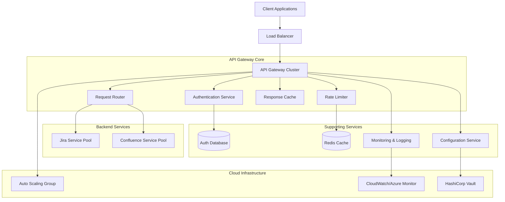

# API Gateway Architecture for Atlassian Services

## Overview
This document outlines the architecture for a cloud-native API Gateway designed to handle Jira and Confluence services with auto-scaling capabilities, hybrid authentication, and comprehensive security features.

## Core Components Architecture

## Key Architectural Principles

### 1. Microservices Architecture
- **Stateless Design**: All gateway instances are stateless for horizontal scaling
- **Service Mesh Integration**: Istio/Linkerd for service-to-service communication
- **Container-First**: Docker containers orchestrated by Kubernetes

### 2. Cloud-Native Features
- **Auto-Scaling**: Horizontal Pod Autoscaler (HPA) based on CPU/memory/custom metrics
- **Multi-AZ Deployment**: Cross-availability zone deployment for high availability
- **Infrastructure as Code**: Terraform/CloudFormation for reproducible deployments

### 3. High Availability Design
- **Circuit Breaker Pattern**: Prevent cascade failures
- **Health Checks**: Comprehensive health monitoring for all components
- **Graceful Degradation**: Fallback mechanisms when services are unavailable

## Core Components Detail

### API Gateway Engine
- **Technology**: Kong, Ambassador, or AWS API Gateway
- **Responsibilities**:
  - Request routing and transformation
  - Protocol translation (HTTP/HTTPS, WebSocket)
  - Request/response validation
  - API composition and aggregation

### Authentication & Authorization Service
- **Multi-Protocol Support**:
  - OAuth 2.0/OpenID Connect
  - SAML 2.0 for enterprise SSO
  - API Key authentication
  - JWT token validation
- **Token Management**: Secure token storage and refresh mechanisms
- **Role-Based Access Control (RBAC)**: Fine-grained permissions

### Rate Limiting & Throttling
- **Algorithms**: Token bucket, sliding window, fixed window
- **Granularity**: Per-user, per-API, per-tenant rate limits
- **Distributed Rate Limiting**: Redis-based for cluster-wide limits

### Caching Layer
- **Multi-Level Caching**:
  - L1: In-memory cache (Redis)
  - L2: CDN for static content
  - L3: Database query result caching
- **Cache Invalidation**: Event-driven cache invalidation strategies

### Monitoring & Observability
- **Metrics**: Prometheus for metrics collection
- **Logging**: Structured logging with ELK stack
- **Tracing**: Distributed tracing with Jaeger/Zipkin
- **Alerting**: PagerDuty/Slack integration for critical alerts

## Scalability Considerations

### Horizontal Scaling
- **Pod Autoscaling**: Based on request rate, CPU, and memory usage
- **Database Scaling**: Read replicas for authentication data
- **Cache Scaling**: Redis cluster for distributed caching

### Performance Optimization
- **Connection Pooling**: Efficient backend connection management
- **Compression**: Gzip/Brotli compression for responses
- **Keep-Alive**: HTTP keep-alive for persistent connections

## Security Framework

### Network Security
- **TLS Termination**: SSL/TLS encryption for all communications
- **WAF Integration**: Web Application Firewall for threat protection
- **IP Whitelisting**: Source IP filtering capabilities

### Data Protection
- **Input Validation**: Comprehensive request validation
- **Output Sanitization**: Response data sanitization
- **Secrets Management**: HashiCorp Vault for sensitive data

### Compliance
- **Audit Logging**: Comprehensive audit trails
- **Data Privacy**: GDPR/CCPA compliance features
- **Security Headers**: HSTS, CSP, X-Frame-Options implementation