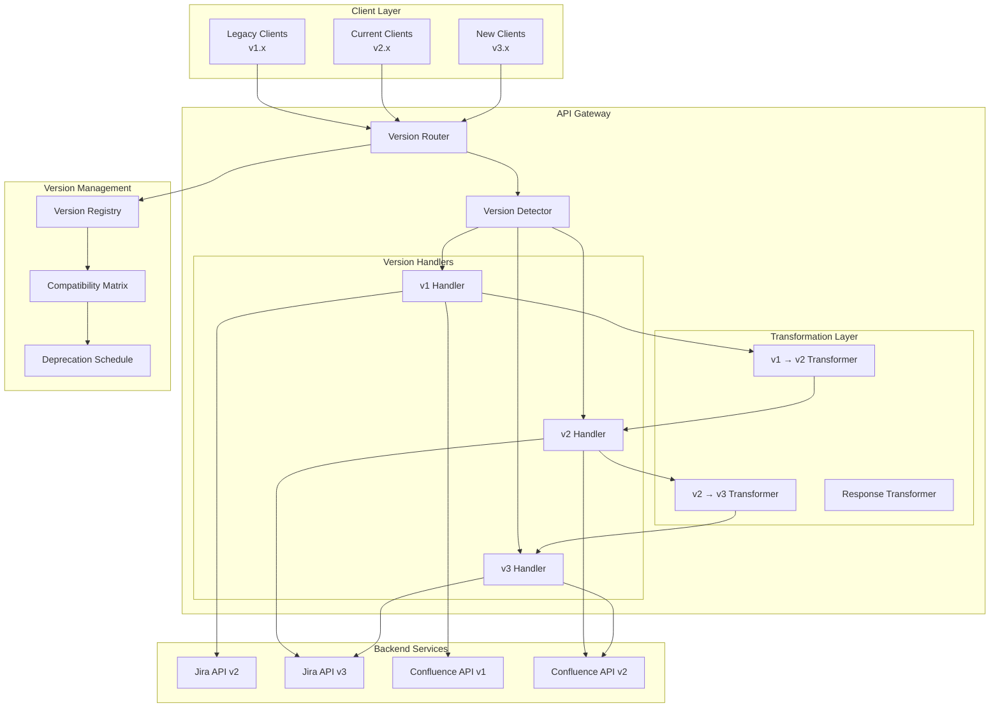

# API Versioning and Backward Compatibility Strategy

## Overview
This document outlines a comprehensive API versioning and backward compatibility strategy for the Atlassian API Gateway, ensuring smooth evolution of APIs while maintaining compatibility with existing clients and providing clear migration paths.

## API Versioning Architecture



## Versioning Strategies

### 1. URL Path Versioning
```yaml
url_path_versioning:
  pattern: "/api/{version}/{service}/{resource}"
  
  examples:
    jira_v2: "/api/v2/jira/issues"
    jira_v3: "/api/v3/jira/issues"
    confluence_v1: "/api/v1/confluence/content"
    confluence_v2: "/api/v2/confluence/content"
  
  routing_configuration:
    version_extraction:
      regex: "^/api/v([0-9]+(?:\\.[0-9]+)?)"
      capture_group: 1
      default_version: "2"
      
    route_mapping:
      v1:
        jira: "/rest/api/2"
        confluence: "/rest/api/content/1.0"
        
      v2:
        jira: "/rest/api/2"
        confluence: "/rest/api/content/1.0"
        
      v3:
        jira: "/rest/api/3"
        confluence: "/rest/api/content/2.0"
  
  version_validation:
    supported_versions: ["1", "2", "3"]
    deprecated_versions: ["1"]
    sunset_versions: []
    
    error_responses:
      unsupported_version:
        status_code: 400
        error_code: "UNSUPPORTED_API_VERSION"
        message: "API version {version} is not supported"
        supported_versions: ["2", "3"]
        
      deprecated_version:
        status_code: 200
        warning_header: "299 - \"API version {version} is deprecated. Please migrate to version {latest}\""
        sunset_date: "2024-12-31"
```

### 2. Header-Based Versioning
```yaml
header_versioning:
  primary_header: "API-Version"
  fallback_headers:
    - "Accept-Version"
    - "X-API-Version"
    - "Atlassian-API-Version"
  
  version_formats:
    semantic: "2.1.0"
    major_only: "2"
    date_based: "2024-01-15"
    
  header_examples:
    - "API-Version: 2"
    - "API-Version: 2.1"
    - "API-Version: 2024-01-15"
    - "Accept: application/vnd.atlassian.v2+json"
  
  content_negotiation:
    media_types:
      v1: "application/vnd.atlassian.v1+json"
      v2: "application/vnd.atlassian.v2+json"
      v3: "application/vnd.atlassian.v3+json"
      
    default_media_type: "application/vnd.atlassian.v2+json"
    
    quality_values:
      - "application/vnd.atlassian.v3+json;q=1.0"
      - "application/vnd.atlassian.v2+json;q=0.9"
      - "application/vnd.atlassian.v1+json;q=0.8"
```

### 3. Query Parameter Versioning
```yaml
query_parameter_versioning:
  parameter_name: "version"
  
  examples:
    - "/api/jira/issues?version=2"
    - "/api/confluence/content?version=1.5"
    - "/api/jira/projects?api-version=3.0"
  
  parameter_validation:
    format: "semantic_version"
    required: false
    default: "2.0"
    
  precedence_order:
    1: "url_path_version"
    2: "header_version"
    3: "query_parameter_version"
    4: "default_version"
```

## Backward Compatibility Framework

### 1. Compatibility Levels
```yaml
compatibility_levels:
  full_compatibility:
    description: "No breaking changes, only additions"
    version_increment: "minor"
    examples:
      - "adding_optional_fields"
      - "adding_new_endpoints"
      - "adding_optional_parameters"
      
  partial_compatibility:
    description: "Minor breaking changes with fallbacks"
    version_increment: "major"
    examples:
      - "changing_default_values"
      - "deprecating_fields"
      - "changing_response_format"
      
  breaking_compatibility:
    description: "Significant breaking changes"
    version_increment: "major"
    examples:
      - "removing_endpoints"
      - "changing_required_parameters"
      - "changing_authentication_methods"

### 2. Breaking Change Categories
```yaml
breaking_changes:
  endpoint_changes:
    - name: "endpoint_removal"
      severity: "high"
      migration_required: true
      
    - name: "endpoint_path_change"
      severity: "high"
      migration_required: true
      
    - name: "http_method_change"
      severity: "high"
      migration_required: true
      
  parameter_changes:
    - name: "required_parameter_addition"
      severity: "high"
      migration_required: true
      
    - name: "parameter_removal"
      severity: "high"
      migration_required: true
      
    - name: "parameter_type_change"
      severity: "medium"
      migration_required: true
      
    - name: "parameter_validation_change"
      severity: "medium"
      migration_required: false
      
  response_changes:
    - name: "response_field_removal"
      severity: "high"
      migration_required: true
      
    - name: "response_structure_change"
      severity: "high"
      migration_required: true
      
    - name: "response_type_change"
      severity: "medium"
      migration_required: true
      
    - name: "error_code_change"
      severity: "low"
      migration_required: false
      
  authentication_changes:
    - name: "authentication_method_removal"
      severity: "critical"
      migration_required: true
      
    - name: "permission_requirement_change"
      severity: "high"
      migration_required: true
      
    - name: "token_format_change"
      severity: "medium"
      migration_required: true
```

## Version Transformation and Adaptation

### 1. Request Transformation
```yaml
request_transformation:
  v1_to_v2_transformation:
    jira_issues:
      field_mappings:
        - old_field: "assignee"
          new_field: "assignee.accountId"
          transformation: "user_key_to_account_id"
          
        - old_field: "reporter"
          new_field: "reporter.accountId"
          transformation: "user_key_to_account_id"
          
        - old_field: "project"
          new_field: "project.key"
          transformation: "extract_project_key"
      
      parameter_mappings:
        - old_param: "username"
          new_param: "accountId"
          transformation: "lookup_account_id"
          
        - old_param: "maxResults"
          new_param: "limit"
          transformation: "direct_mapping"
      
      default_values:
        - field: "expand"
          value: "names,schema,operations,editmeta,changelog,renderedFields"
          
    confluence_content:
      field_mappings:
        - old_field: "body"
          new_field: "body.storage.value"
          transformation: "wrap_in_storage_format"
          
        - old_field: "space"
          new_field: "space.key"
          transformation: "extract_space_key"
      
      parameter_mappings:
        - old_param: "type"
          new_param: "type"
          transformation: "validate_content_type"
          
        - old_param: "spaceKey"
          new_param: "spaceKey"
          transformation: "direct_mapping"

  v2_to_v3_transformation:
    jira_issues:
      field_mappings:
        - old_field: "timetracking.originalEstimate"
          new_field: "timetracking.originalEstimateSeconds"
          transformation: "time_string_to_seconds"
          
        - old_field: "timetracking.remainingEstimate"
          new_field: "timetracking.remainingEstimateSeconds"
          transformation: "time_string_to_seconds"
      
      deprecation_warnings:
        - field: "timetracking.originalEstimate"
          message: "Field deprecated in v3. Use originalEstimateSeconds instead."
          sunset_date: "2024-12-31"
```

### 2. Response Transformation
```yaml
response_transformation:
  v3_to_v2_transformation:
    jira_issues:
      field_mappings:
        - new_field: "assignee"
          old_field: "assignee.accountId"
          transformation: "account_id_to_user_object"
          
        - new_field: "reporter"
          old_field: "reporter.accountId"
          transformation: "account_id_to_user_object"
      
      field_additions:
        - field: "self"
          value_template: "{{base_url}}/rest/api/2/issue/{{key}}"
          
        - field: "key"
          source: "key"
          transformation: "direct_mapping"
      
      field_removals:
        - "expand"
        - "operations"
        - "editmeta"
        
    confluence_content:
      field_mappings:
        - new_field: "body"
          old_field: "body.storage.value"
          transformation: "extract_storage_value"
          
        - new_field: "space"
          old_field: "space.key"
          transformation: "space_key_to_object"
      
      field_additions:
        - field: "_links"
          value_template: "{{base_url}}/rest/api/content/{{id}}"

  v2_to_v1_transformation:
    jira_issues:
      field_mappings:
        - new_field: "assignee"
          old_field: "assignee.name"
          transformation: "extract_username"
          fallback: "assignee.key"
          
        - new_field: "reporter"
          old_field: "reporter.name"
          transformation: "extract_username"
          fallback: "reporter.key"
      
      pagination_transformation:
        old_format:
          start_at: "startAt"
          max_results: "maxResults"
          total: "total"
          
        new_format:
          start_at: "startIndex"
          max_results: "itemsPerPage"
          total: "totalResults"
```

## Version Lifecycle Management

### 1. Version Lifecycle Stages
```yaml
version_lifecycle:
  stages:
    development:
      description: "Version under active development"
      stability: "unstable"
      breaking_changes_allowed: true
      public_access: false
      
    alpha:
      description: "Early preview for selected partners"
      stability: "unstable"
      breaking_changes_allowed: true
      public_access: "limited"
      duration: "3 months"
      
    beta:
      description: "Public preview with feature complete API"
      stability: "stable"
      breaking_changes_allowed: false
      public_access: true
      duration: "6 months"
      
    stable:
      description: "Production-ready version"
      stability: "stable"
      breaking_changes_allowed: false
      public_access: true
      support_duration: "24 months"
      
    deprecated:
      description: "Version marked for removal"
      stability: "stable"
      breaking_changes_allowed: false
      public_access: true
      support_duration: "12 months"
      
    sunset:
      description: "Version no longer supported"
      stability: "unsupported"
      breaking_changes_allowed: "n/a"
      public_access: false
      
  transition_criteria:
    alpha_to_beta:
      - "api_completeness > 90%"
      - "partner_feedback_incorporated"
      - "performance_benchmarks_met"
      
    beta_to_stable:
      - "zero_critical_bugs"
      - "performance_sla_met"
      - "documentation_complete"
      - "migration_tools_available"
      
    stable_to_deprecated:
      - "newer_version_available"
      - "migration_path_documented"
      - "customer_notification_sent"
      
    deprecated_to_sunset:
      - "deprecation_period_expired"
      - "usage_below_threshold"
      - "migration_support_ended"

### 2. Deprecation Strategy
```yaml
deprecation_strategy:
  deprecation_timeline:
    announcement:
      advance_notice: "12 months"
      channels:
        - "developer_portal"
        - "email_notifications"
        - "api_response_headers"
        - "documentation_updates"
        
    warning_period:
      duration: "6 months"
      actions:
        - "deprecation_headers_added"
        - "migration_guides_published"
        - "developer_outreach_initiated"
        
    sunset_period:
      duration: "6 months"
      actions:
        - "feature_freeze_implemented"
        - "migration_tools_provided"
        - "support_escalation_available"
        
    removal:
      final_notice: "30 days"
      actions:
        - "api_endpoints_disabled"
        - "redirect_to_new_version"
        - "error_responses_returned"
  
  deprecation_headers:
    warning_header: "Warning"
    sunset_header: "Sunset"
    link_header: "Link"
    
    examples:
      - 'Warning: 299 - "Deprecated API" "Tue, 31 Dec 2024 23:59:59 GMT"'
      - 'Sunset: Tue, 31 Dec 2024 23:59:59 GMT'
      - 'Link: </api/v3/jira/issues>; rel="successor-version"'
  
  migration_support:
    migration_guides:
      format: "interactive_documentation"
      includes:
        - "breaking_changes_summary"
        - "field_mapping_tables"
        - "code_examples"
        - "testing_strategies"
        
    migration_tools:
      - "api_diff_analyzer"
      - "request_response_converter"
      - "compatibility_checker"
      - "automated_migration_scripts"
      
    developer_support:
      - "dedicated_migration_team"
      - "office_hours_sessions"
      - "priority_support_tickets"
      - "migration_workshops"
```

## Version Detection and Routing

### 1. Version Detection Logic
```yaml
version_detection:
  detection_order:
    1: "url_path_version"
    2: "accept_header_version"
    3: "api_version_header"
    4: "query_parameter_version"
    5: "default_version"
  
  detection_rules:
    url_path:
      pattern: "/api/v([0-9]+(?:\\.[0-9]+)?)"
      extraction: "regex_capture_group_1"
      validation: "semantic_version_format"
      
    accept_header:
      pattern: "application/vnd\\.atlassian\\.v([0-9]+)\\+json"
      extraction: "regex_capture_group_1"
      validation: "supported_version_list"
      
    api_version_header:
      header_names: ["API-Version", "X-API-Version"]
      extraction: "direct_value"
      validation: "version_format_validation"
      
    query_parameter:
      parameter_names: ["version", "api-version", "v"]
      extraction: "parameter_value"
      validation: "supported_version_list"
  
  version_normalization:
    input_formats:
      - "1" → "1.0.0"
      - "2.1" → "2.1.0"
      - "3.0.0" → "3.0.0"
      
    canonical_format: "major.minor.patch"
    
  fallback_strategy:
    invalid_version: "use_default_version"
    unsupported_version: "use_latest_supported"
    missing_version: "use_default_version"
    
    default_version: "2.0.0"
    latest_version: "3.0.0"

### 2. Routing Configuration
```yaml
version_routing:
  route_mapping:
    v1:
      jira:
        base_path: "/rest/api/2"
        transformations:
          - "v1_to_v2_request_transform"
          - "v2_to_v1_response_transform"
          
      confluence:
        base_path: "/rest/api/content/1.0"
        transformations:
          - "v1_to_v2_request_transform"
          - "v2_to_v1_response_transform"
          
    v2:
      jira:
        base_path: "/rest/api/2"
        transformations: []
        
      confluence:
        base_path: "/rest/api/content/1.0"
        transformations: []
        
    v3:
      jira:
        base_path: "/rest/api/3"
        transformations: []
        
      confluence:
        base_path: "/rest/api/content/2.0"
        transformations: []
  
  routing_middleware:
    version_validator:
      enabled: true
      strict_mode: false
      
    transformation_engine:
      enabled: true
      cache_transformations: true
      
    compatibility_checker:
      enabled: true
      log_compatibility_issues: true
      
    deprecation_warner:
      enabled: true
      include_sunset_headers: true
```

## API Evolution Patterns

### 1. Additive Changes (Non-Breaking)
```yaml
additive_changes:
  new_endpoints:
    guidelines:
      - "add_new_resource_endpoints"
      - "add_new_action_endpoints"
      - "maintain_existing_endpoint_behavior"
      
    examples:
      - endpoint: "/api/v2/jira/issues/{id}/watchers"
        method: "GET"
        description: "Get issue watchers"
        
      - endpoint: "/api/v2/confluence/content/{id}/restrictions"
        method: "POST"
        description: "Add content restrictions"
  
  new_fields:
    guidelines:
      - "add_optional_request_fields"
      - "add_response_fields"
      - "maintain_field_type_consistency"
      
    examples:
      - field: "priority.iconUrl"
        location: "response"
        type: "string"
        description: "URL to priority icon"
        
      - field: "expand"
        location: "request"
        type: "array"
        description: "Fields to expand in response"
  
  new_parameters:
    guidelines:
      - "add_optional_query_parameters"
      - "provide_sensible_defaults"
      - "document_parameter_behavior"
      
    examples:
      - parameter: "includeArchived"
        type: "boolean"
        default: false
        description: "Include archived items in results"

### 2. Evolutionary Changes (Potentially Breaking)
```yaml
evolutionary_changes:
  field_deprecation:
    process:
      1: "mark_field_as_deprecated"
      2: "add_deprecation_warnings"
      3: "provide_alternative_field"
      4: "maintain_dual_support"
      5: "remove_deprecated_field"
      
    timeline: "24_months"
    
    example:
      deprecated_field: "assignee.name"
      replacement_field: "assignee.accountId"
      deprecation_date: "2024-01-01"
      removal_date: "2025-12-31"
  
  parameter_evolution:
    type_changes:
      - old_type: "string"
        new_type: "object"
        migration_strategy: "wrapper_object"
        
      - old_type: "integer"
        new_type: "string"
        migration_strategy: "string_conversion"
    
    validation_changes:
      - parameter: "maxResults"
        old_validation: "1-1000"
        new_validation: "1-100"
        migration_strategy: "cap_at_maximum"
  
  response_evolution:
    structure_changes:
      - change_type: "field_nesting"
        old_structure: "user.name"
        new_structure: "user.profile.name"
        migration_strategy: "maintain_both"
        
      - change_type: "array_to_object"
        old_structure: "errors[]"
        new_structure: "errors{}"
        migration_strategy: "format_conversion"

### 3. Breaking Changes (Major Version)
```yaml
breaking_changes:
  endpoint_removal:
    process:
      1: "deprecate_endpoint"
      2: "provide_alternative_endpoint"
      3: "migration_period"
      4: "remove_endpoint"
      
    migration_support:
      - "redirect_to_new_endpoint"
      - "provide_mapping_documentation"
      - "offer_migration_assistance"
  
  authentication_changes:
    examples:
      - change: "remove_basic_auth"
        replacement: "oauth2_only"
        migration_period: "18_months"
        
      - change: "require_additional_scopes"
        impact: "permission_expansion"
        migration_period: "12_months"
  
  data_format_changes:
    examples:
      - change: "date_format_standardization"
        old_format: "DD/MM/YYYY"
        new_format: "ISO8601"
        migration_strategy: "dual_format_support"
        
      - change: "error_response_restructure"
        old_format: "string_message"
        new_format: "structured_error_object"
        migration_strategy: "format_detection"
```

## Version Monitoring and Analytics

### 1. Usage Analytics
```yaml
version_analytics:
  usage_metrics:
    - metric: "requests_per_version"
      labels: ["version", "endpoint", "client_type"]
      
    - metric: "client_adoption_rate"
      labels: ["version", "client_id", "organization"]
      
    - metric: "error_rate_per_version"
      labels: ["version", "error_type", "endpoint"]
      
    - metric: "response_time_per_version"
      labels: ["version", "endpoint"]
      
    - metric: "deprecated_feature_usage"
      labels: ["version", "feature", "client_id"]
  
  adoption_tracking:
    new_version_adoption:
      measurement_period: "90_days"
      success_criteria: "50%_adoption"
      
    deprecated_version_migration:
      measurement_period: "180_days"
      success_criteria: "90%_migration"
      
    client_segmentation:
      - "enterprise_clients"
      - "developer_clients"
      - "integration_partners"
      - "internal_services"
  
  reporting:
    dashboards:
      - "version_usage_overview"
      - "migration_progress_tracking"
      - "deprecation_impact_analysis"
      - "client_adoption_patterns"
      
    alerts:
      - "slow_adoption_of_new_version"
      - "high_usage_of_deprecated_version"
      - "breaking_change_impact"
      - "client_migration_stalled"

### 2. Compatibility Monitoring
```yaml
compatibility_monitoring:
  automated_testing:
    compatibility_test_suite:
      - "cross_version_integration_tests"
      - "backward_compatibility_tests"
      - "transformation_accuracy_tests"
      - "performance_regression_tests"
      
    test_execution:
      frequency: "continuous"
      triggers:
        - "code_changes"
        - "configuration_updates"
        - "dependency_updates"
      
    test_environments:
      - "staging"
      - "pre_production"
      - "production_canary"
  
  real_time_monitoring:
    compatibility_metrics:
      - "transformation_success_rate"
      - "transformation_latency"
      - "compatibility_error_rate"
      - "client_error_correlation"
      
    alerting_rules:
      - alert: "high_transformation_failure_rate"
        condition: "transformation_error_rate > 1%"
        severity: "critical"
        
      - alert: "compatibility_performance_degradation"
        condition: "transformation_latency > 100ms"
        severity: "warning"
        
      - alert: "client_compatibility_issues"
        condition: "client_error_rate > 5%"
        severity: "critical"
  
  client_feedback:
    feedback_channels:
      - "developer_portal_feedback"
      - "support_ticket_analysis"
      - "community_forum_monitoring"
      - "direct_client_surveys"
      
    feedback_analysis:
      - "compatibility_issue_categorization"
      - "migration_difficulty_assessment"
      - "feature_request_prioritization"
      - "documentation_gap_identification"
```

## Migration Tools and Support

### 1. Automated Migration Tools
```yaml
migration_tools:
  api_diff_analyzer:
    functionality:
      - "compare_api_specifications"
      - "identify_breaking_changes"
      - "generate_migration_reports"
      - "suggest_migration_strategies"
      
    output_formats:
      - "html_report"
      - "json_diff"
      - "markdown_summary"
      - "csv_export"
  
  request_converter:
    supported_conversions:
      - "v1_to_v2_requests"
      - "v2_to_v3_requests"
      - "header_format_updates"
      - "parameter_transformations"
      
    integration_options:
      - "cli_tool"
      - "web_interface"
      - "api_endpoint"
      - "sdk_integration"
  
  compatibility_checker:
    validation_rules:
      - "endpoint_availability"
      - "parameter_compatibility"
      - "response_format_compatibility"
      - "authentication_requirements"
      
    reporting:
      - "compatibility_score"
      - "issue_prioritization"
      - "remediation_suggestions"
      - "timeline_estimates"

### 2. Developer Support Resources
```yaml
developer_support:
  documentation:
    migration_guides:
      - "version_comparison_matrices"
      - "step_by_step_migration_instructions"
      - "code_example_transformations"
      - "common_pitfalls_and_solutions"
      
    interactive_tools:
      - "api_explorer_with_version_switching"
      - "request_response_playground"
      - "migration_planning_wizard"
      - "compatibility_testing_sandbox"
  
  community_support:
    forums:
      - "version_migration_discussions"
      - "best_practices_sharing"
      - "troubleshooting_assistance"
      - "feature_request_voting"
      
    events:
      - "migration_workshops"
      - "office_hours_sessions"
      - "webinar_series"
      - "developer_conferences"
  
  direct_support:
    migration_assistance:
      - "dedicated_migration_engineers"
      - "priority_support_channels"
      - "custom_migration_planning"
      - "implementation_review_sessions"
      
    enterprise_support:
      - "white_glove_migration_service"
      - "custom_compatibility_layers"
      - "extended_support_timelines"
      - "dedicated_account_management"