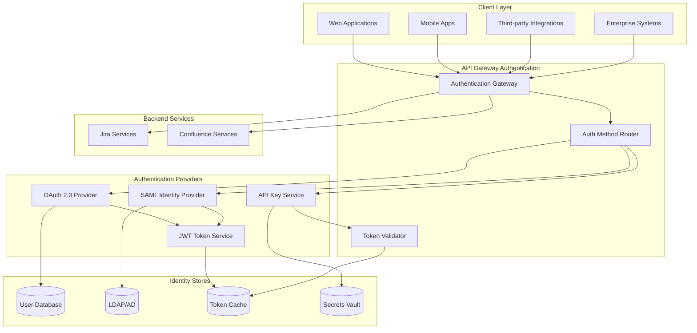

# Hybrid Authentication System for Atlassian API Gateway

## Overview
This document outlines a comprehensive hybrid authentication system that supports multiple authentication methods including OAuth 2.0/OpenID Connect, API Keys, and SAML 2.0 for enterprise SSO integration.

## Authentication Architecture



## Authentication Methods

### 1. OAuth 2.0 / OpenID Connect
```yaml
oauth_configuration:
  provider: "atlassian-oauth-server"
  authorization_endpoint: "https://auth.atlassian.com/oauth/authorize"
  token_endpoint: "https://auth.atlassian.com/oauth/token"
  userinfo_endpoint: "https://auth.atlassian.com/oauth/userinfo"
  jwks_uri: "https://auth.atlassian.com/.well-known/jwks.json"
  
  supported_flows:
    - authorization_code
    - client_credentials
    - refresh_token
  
  scopes:
    jira:
      - "jira:read"
      - "jira:write"
      - "jira:admin"
      - "jira:project-admin"
    confluence:
      - "confluence:read"
      - "confluence:write"
      - "confluence:admin"
      - "confluence:space-admin"
  
  client_configuration:
    web_applications:
      client_id: "${WEB_CLIENT_ID}"
      client_secret: "${WEB_CLIENT_SECRET}"
      redirect_uris:
        - "https://app.company.com/callback"
        - "https://app.company.com/silent-refresh"
      grant_types:
        - "authorization_code"
        - "refresh_token"
    
    mobile_applications:
      client_id: "${MOBILE_CLIENT_ID}"
      client_secret: null  # Public client
      redirect_uris:
        - "com.company.app://oauth/callback"
      grant_types:
        - "authorization_code"
      pkce_required: true
    
    service_accounts:
      client_id: "${SERVICE_CLIENT_ID}"
      client_secret: "${SERVICE_CLIENT_SECRET}"
      grant_types:
        - "client_credentials"
      scopes:
        - "jira:read"
        - "confluence:read"
```

### 2. API Key Authentication
```yaml
api_key_configuration:
  storage: "vault"  # HashiCorp Vault for secure storage
  key_formats:
    - "atlassian_v1"  # Format: atl_v1_<base64_encoded_key>
    - "legacy"        # Format: <32_char_hex_string>
  
  key_types:
    user_keys:
      prefix: "atl_user_"
      expiration: "1y"
      permissions: "user_scoped"
      rate_limit: "1000/hour"
    
    service_keys:
      prefix: "atl_service_"
      expiration: "never"
      permissions: "service_scoped"
      rate_limit: "10000/hour"
    
    admin_keys:
      prefix: "atl_admin_"
      expiration: "90d"
      permissions: "admin_scoped"
      rate_limit: "5000/hour"
      mfa_required: true
  
  validation:
    hash_algorithm: "SHA-256"
    salt_rounds: 12
    key_rotation: "quarterly"
    
  headers:
    primary: "Authorization: Bearer <api_key>"
    fallback: "X-API-Key: <api_key>"
    
  security:
    ip_whitelist_enabled: true
    usage_logging: true
    anomaly_detection: true
    automatic_revocation:
      - "suspicious_activity"
      - "multiple_failed_attempts"
      - "geographic_anomaly"
```

### 3. SAML 2.0 Integration
```yaml
saml_configuration:
  identity_providers:
    - name: "corporate_ad"
      entity_id: "https://adfs.company.com/adfs/services/trust"
      sso_url: "https://adfs.company.com/adfs/ls/"
      slo_url: "https://adfs.company.com/adfs/ls/"
      certificate: "${SAML_IDP_CERT}"
      
      attribute_mapping:
        user_id: "http://schemas.xmlsoap.org/ws/2005/05/identity/claims/nameidentifier"
        email: "http://schemas.xmlsoap.org/ws/2005/05/identity/claims/emailaddress"
        first_name: "http://schemas.xmlsoap.org/ws/2005/05/identity/claims/givenname"
        last_name: "http://schemas.xmlsoap.org/ws/2005/05/identity/claims/surname"
        groups: "http://schemas.microsoft.com/ws/2008/06/identity/claims/groups"
      
      group_mapping:
        "CN=Jira-Admins,OU=Groups,DC=company,DC=com": "jira:admin"
        "CN=Confluence-Users,OU=Groups,DC=company,DC=com": "confluence:read"
        "CN=Developers,OU=Groups,DC=company,DC=com": "jira:write,confluence:write"
    
    - name: "okta_saml"
      entity_id: "http://www.okta.com/exk1234567890"
      sso_url: "https://company.okta.com/app/atlassian/exk1234567890/sso/saml"
      certificate: "${OKTA_SAML_CERT}"
      
  service_provider:
    entity_id: "https://api-gateway.company.com/saml/metadata"
    acs_url: "https://api-gateway.company.com/saml/acs"
    sls_url: "https://api-gateway.company.com/saml/sls"
    certificate: "${SAML_SP_CERT}"
    private_key: "${SAML_SP_KEY}"
    
    signature_algorithm: "RSA-SHA256"
    digest_algorithm: "SHA256"
    
  security:
    require_signed_assertions: true
    require_signed_response: true
    encrypt_assertions: true
    session_timeout: "8h"
    max_session_duration: "24h"
```

## Token Management

### 1. JWT Token Structure
```yaml
jwt_configuration:
  issuer: "https://api-gateway.company.com"
  audience: "atlassian-services"
  
  token_types:
    access_token:
      expiration: "1h"
      algorithm: "RS256"
      claims:
        - "sub"      # Subject (user ID)
        - "iss"      # Issuer
        - "aud"      # Audience
        - "exp"      # Expiration
        - "iat"      # Issued at
        - "jti"      # JWT ID
        - "scope"    # Permissions
        - "tenant"   # Tenant ID
        - "auth_method"  # Authentication method used
    
    refresh_token:
      expiration: "30d"
      algorithm: "HS256"
      rotation: true
      family_tracking: true
    
    id_token:
      expiration: "1h"
      algorithm: "RS256"
      claims:
        - "sub"
        - "name"
        - "email"
        - "picture"
        - "groups"
        - "preferred_username"

  key_management:
    rotation_interval: "90d"
    key_storage: "vault"
    algorithm: "RS256"
    key_size: 2048
    
  validation:
    clock_skew_tolerance: "5m"
    require_exp: true
    require_iat: true
    verify_signature: true
    verify_audience: true
```

### 2. Token Caching and Storage
```yaml
token_storage:
  cache_provider: "redis"
  
  access_tokens:
    cache_duration: "1h"
    cache_key_pattern: "access_token:{jti}"
    distributed_cache: true
    
  refresh_tokens:
    storage: "database"
    encryption: "AES-256-GCM"
    family_tracking: true
    automatic_cleanup: true
    
  blacklist:
    storage: "redis"
    key_pattern: "blacklist:{jti}"
    ttl: "token_expiration + 1h"
    
  session_storage:
    provider: "redis"
    key_pattern: "session:{session_id}"
    ttl: "8h"
    sliding_expiration: true
```

## Authentication Flow Implementation

### 1. OAuth 2.0 Authorization Code Flow
```yaml
oauth_flows:
  authorization_code:
    steps:
      1. "Client redirects to authorization endpoint"
      2. "User authenticates with identity provider"
      3. "Authorization server returns code to callback"
      4. "Client exchanges code for tokens"
      5. "API Gateway validates and caches tokens"
    
    security_measures:
      - "PKCE for public clients"
      - "State parameter validation"
      - "Nonce validation for ID tokens"
      - "Redirect URI validation"
    
    error_handling:
      invalid_client: "Return 401 with error description"
      invalid_grant: "Return 400 with error description"
      invalid_scope: "Return 400 with supported scopes"
      server_error: "Return 500 with generic error"
```

### 2. API Key Validation Flow
```yaml
api_key_flow:
  validation_steps:
    1. "Extract API key from request headers"
    2. "Validate key format and structure"
    3. "Check key existence in secure storage"
    4. "Verify key is not expired or revoked"
    5. "Load associated permissions and metadata"
    6. "Apply rate limiting based on key type"
    7. "Log usage for audit and analytics"
  
  caching:
    valid_keys: "5m"
    invalid_keys: "1m"
    permissions: "10m"
    
  security_checks:
    - "IP address validation"
    - "Usage pattern analysis"
    - "Geographic location check"
    - "Time-based access restrictions"
```

### 3. SAML Authentication Flow
```yaml
saml_flow:
  sso_initiation:
    sp_initiated:
      1. "User accesses protected resource"
      2. "Gateway redirects to SAML IdP"
      3. "User authenticates with IdP"
      4. "IdP posts SAML response to ACS"
      5. "Gateway validates response and creates session"
    
    idp_initiated:
      1. "User initiates SSO from IdP portal"
      2. "IdP posts SAML response to ACS"
      3. "Gateway validates response and creates session"
      4. "User redirected to default landing page"
  
  validation:
    - "Signature verification"
    - "Certificate chain validation"
    - "Assertion expiration check"
    - "Audience restriction validation"
    - "Subject confirmation validation"
```

## Multi-Factor Authentication (MFA)

### 1. MFA Configuration
```yaml
mfa_configuration:
  providers:
    - name: "totp"
      type: "time_based_otp"
      issuer: "Atlassian API Gateway"
      algorithm: "SHA1"
      digits: 6
      period: 30
    
    - name: "sms"
      type: "sms_otp"
      provider: "twilio"
      message_template: "Your Atlassian verification code is: {code}"
      expiration: "5m"
    
    - name: "push"
      type: "push_notification"
      provider: "duo"
      timeout: "60s"
  
  policies:
    admin_users:
      required: true
      methods: ["totp", "push"]
      grace_period: "0"
    
    regular_users:
      required: false
      methods: ["totp", "sms"]
      grace_period: "7d"
    
    service_accounts:
      required: false
      methods: []
      
  enforcement:
    high_risk_operations:
      - "user_management"
      - "permission_changes"
      - "system_configuration"
    
    triggers:
      - "new_device_login"
      - "geographic_anomaly"
      - "elevated_permissions_request"
```

## Security Considerations

### 1. Token Security
```yaml
token_security:
  encryption:
    at_rest: "AES-256-GCM"
    in_transit: "TLS 1.3"
    key_derivation: "PBKDF2"
    
  signing:
    algorithm: "RS256"
    key_rotation: "quarterly"
    key_backup: "encrypted_vault"
    
  validation:
    signature_verification: true
    expiration_check: true
    issuer_validation: true
    audience_validation: true
    
  protection:
    rate_limiting: true
    brute_force_protection: true
    token_binding: "optional"
    secure_headers: true
```

### 2. Session Management
```yaml
session_management:
  security:
    secure_cookies: true
    http_only: true
    same_site: "strict"
    csrf_protection: true
    
  lifecycle:
    idle_timeout: "30m"
    absolute_timeout: "8h"
    concurrent_sessions: 5
    
  monitoring:
    session_hijacking_detection: true
    concurrent_login_alerts: true
    geographic_anomaly_detection: true
```

## Integration with Backend Services

### 1. Service-to-Service Authentication
```yaml
service_auth:
  jira_integration:
    method: "service_account_jwt"
    client_id: "api-gateway-jira-client"
    key_id: "jira-service-key-2024"
    audience: "jira-api"
    
  confluence_integration:
    method: "service_account_jwt"
    client_id: "api-gateway-confluence-client"
    key_id: "confluence-service-key-2024"
    audience: "confluence-api"
    
  token_propagation:
    method: "jwt_bearer"
    claims_mapping:
      user_id: "sub"
      permissions: "scope"
      tenant: "tenant_id"
```

### 2. Permission Mapping
```yaml
permission_mapping:
  oauth_scopes_to_permissions:
    "jira:read": ["jira.issues.view", "jira.projects.view"]
    "jira:write": ["jira.issues.create", "jira.issues.edit"]
    "jira:admin": ["jira.admin.users", "jira.admin.projects"]
    "confluence:read": ["confluence.pages.view", "confluence.spaces.view"]
    "confluence:write": ["confluence.pages.create", "confluence.pages.edit"]
    "confluence:admin": ["confluence.admin.spaces", "confluence.admin.users"]
  
  saml_groups_to_permissions:
    "Jira-Administrators": ["jira:admin"]
    "Confluence-Administrators": ["confluence:admin"]
    "Developers": ["jira:write", "confluence:write"]
    "Viewers": ["jira:read", "confluence:read"]
```

## Monitoring and Auditing

### 1. Authentication Metrics
```yaml
auth_metrics:
  success_rates:
    - "oauth_success_rate"
    - "api_key_success_rate"
    - "saml_success_rate"
    
  latency_metrics:
    - "token_validation_time"
    - "saml_assertion_processing_time"
    - "permission_lookup_time"
    
  security_metrics:
    - "failed_authentication_attempts"
    - "suspicious_activity_count"
    - "token_abuse_incidents"
```

### 2. Audit Logging
```yaml
audit_logging:
  events:
    - "authentication_success"
    - "authentication_failure"
    - "token_issued"
    - "token_revoked"
    - "permission_granted"
    - "permission_denied"
    - "mfa_challenge_issued"
    - "mfa_verification_success"
    - "mfa_verification_failure"
  
  log_format: "json"
  retention: "7y"
  encryption: true
  
  fields:
    - "timestamp"
    - "user_id"
    - "client_id"
    - "ip_address"
    - "user_agent"
    - "auth_method"
    - "result"
    - "error_code"
    - "resource_accessed"