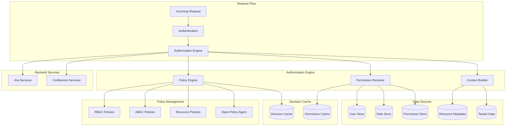

# Authorization and Access Control Framework

## Overview
This document defines a comprehensive authorization and access control framework for the Atlassian API Gateway, implementing fine-grained permissions, role-based access control (RBAC), attribute-based access control (ABAC), and policy-driven authorization.

## Authorization Architecture



## Role-Based Access Control (RBAC)

### 1. Role Hierarchy
```yaml
role_hierarchy:
  system_roles:
    super_admin:
      description: "System-wide administrative access"
      permissions:
        - "system:*"
        - "jira:*"
        - "confluence:*"
      inherits: []
      
    tenant_admin:
      description: "Tenant-level administrative access"
      permissions:
        - "tenant:admin"
        - "jira:admin"
        - "confluence:admin"
      inherits: []
      
    service_admin:
      description: "Service-specific administrative access"
      permissions:
        - "jira:admin"
        - "confluence:admin"
      inherits: ["power_user"]
      
    power_user:
      description: "Advanced user with elevated permissions"
      permissions:
        - "jira:project-admin"
        - "confluence:space-admin"
        - "jira:write"
        - "confluence:write"
      inherits: ["standard_user"]
      
    standard_user:
      description: "Regular user with basic permissions"
      permissions:
        - "jira:read"
        - "confluence:read"
        - "jira:issue-create"
        - "confluence:page-create"
      inherits: ["viewer"]
      
    viewer:
      description: "Read-only access"
      permissions:
        - "jira:read"
        - "confluence:read"
      inherits: []
      
    service_account:
      description: "Automated service access"
      permissions:
        - "api:service-access"
      inherits: []

  jira_specific_roles:
    jira_admin:
      description: "Jira system administrator"
      permissions:
        - "jira:admin:*"
        - "jira:project:*"
        - "jira:user:*"
        - "jira:workflow:*"
        - "jira:scheme:*"
      
    project_admin:
      description: "Project-level administrator"
      permissions:
        - "jira:project:admin"
        - "jira:project:configure"
        - "jira:issue:*"
        - "jira:component:*"
        - "jira:version:*"
      scope: "project"
      
    developer:
      description: "Development team member"
      permissions:
        - "jira:issue:create"
        - "jira:issue:edit"
        - "jira:issue:transition"
        - "jira:issue:assign"
        - "jira:comment:create"
      scope: "project"
      
    reporter:
      description: "Issue reporter"
      permissions:
        - "jira:issue:create"
        - "jira:issue:view"
        - "jira:comment:create"
      scope: "project"

  confluence_specific_roles:
    confluence_admin:
      description: "Confluence system administrator"
      permissions:
        - "confluence:admin:*"
        - "confluence:space:*"
        - "confluence:user:*"
        - "confluence:app:*"
      
    space_admin:
      description: "Space administrator"
      permissions:
        - "confluence:space:admin"
        - "confluence:space:configure"
        - "confluence:page:*"
        - "confluence:blog:*"
        - "confluence:attachment:*"
      scope: "space"
      
    content_creator:
      description: "Content creator and editor"
      permissions:
        - "confluence:page:create"
        - "confluence:page:edit"
        - "confluence:blog:create"
        - "confluence:comment:create"
        - "confluence:attachment:create"
      scope: "space"
      
    content_viewer:
      description: "Content viewer"
      permissions:
        - "confluence:page:view"
        - "confluence:blog:view"
        - "confluence:attachment:view"
        - "confluence:comment:view"
      scope: "space"
```

### 2. Permission System
```yaml
permission_system:
  permission_format: "service:resource:action"
  
  jira_permissions:
    system_level:
      - "jira:admin:configure"
      - "jira:admin:users"
      - "jira:admin:groups"
      - "jira:admin:schemes"
      - "jira:admin:workflows"
      - "jira:admin:fields"
      - "jira:admin:applications"
      
    project_level:
      - "jira:project:admin"
      - "jira:project:configure"
      - "jira:project:view"
      - "jira:project:browse"
      
    issue_level:
      - "jira:issue:create"
      - "jira:issue:edit"
      - "jira:issue:delete"
      - "jira:issue:view"
      - "jira:issue:assign"
      - "jira:issue:transition"
      - "jira:issue:link"
      - "jira:issue:attach"
      
    comment_level:
      - "jira:comment:create"
      - "jira:comment:edit"
      - "jira:comment:delete"
      - "jira:comment:view"
  
  confluence_permissions:
    system_level:
      - "confluence:admin:configure"
      - "confluence:admin:users"
      - "confluence:admin:groups"
      - "confluence:admin:spaces"
      - "confluence:admin:apps"
      
    space_level:
      - "confluence:space:admin"
      - "confluence:space:configure"
      - "confluence:space:view"
      - "confluence:space:export"
      
    content_level:
      - "confluence:page:create"
      - "confluence:page:edit"
      - "confluence:page:delete"
      - "confluence:page:view"
      - "confluence:page:restrict"
      - "confluence:blog:create"
      - "confluence:blog:edit"
      - "confluence:blog:delete"
      - "confluence:blog:view"
      
    attachment_level:
      - "confluence:attachment:create"
      - "confluence:attachment:delete"
      - "confluence:attachment:view"
```

## Attribute-Based Access Control (ABAC)

### 1. ABAC Policy Structure
```yaml
abac_policies:
  policy_structure:
    subject_attributes:
      - "user.id"
      - "user.email"
      - "user.department"
      - "user.location"
      - "user.security_clearance"
      - "user.groups"
      - "user.roles"
      
    resource_attributes:
      - "resource.type"
      - "resource.owner"
      - "resource.classification"
      - "resource.project"
      - "resource.space"
      - "resource.created_date"
      - "resource.sensitivity_level"
      
    environment_attributes:
      - "request.time"
      - "request.ip_address"
      - "request.location"
      - "request.device_type"
      - "request.network_type"
      - "request.authentication_method"
      
    action_attributes:
      - "action.type"
      - "action.risk_level"
      - "action.data_access_level"

  example_policies:
    sensitive_data_access:
      description: "Restrict access to sensitive data based on user clearance"
      rule: |
        permit if (
          subject.security_clearance >= resource.sensitivity_level AND
          environment.network_type == "corporate" AND
          environment.time between "08:00" and "18:00"
        )
      
    geographic_restriction:
      description: "Restrict access based on geographic location"
      rule: |
        permit if (
          subject.location in resource.allowed_locations OR
          subject.roles contains "global_admin"
        )
      
    time_based_access:
      description: "Time-based access restrictions"
      rule: |
        permit if (
          (environment.time between "06:00" and "22:00" AND subject.roles contains "standard_user") OR
          subject.roles contains "admin"
        )
      
    project_based_access:
      description: "Project-based access control"
      rule: |
        permit if (
          subject.projects contains resource.project OR
          subject.roles contains "project_admin" OR
          (action.type == "read" AND resource.visibility == "public")
        )
```

### 2. Dynamic Policy Evaluation
```yaml
policy_evaluation:
  evaluation_engine: "open_policy_agent"
  
  policy_decision_points:
    - name: "api_gateway_pdp"
      endpoint: "http://opa-service:8181/v1/data/authz/allow"
      timeout: "100ms"
      cache_ttl: "5m"
      
  policy_information_points:
    user_attributes:
      source: "user_service"
      endpoint: "http://user-service/api/v1/users/{user_id}/attributes"
      cache_ttl: "10m"
      
    resource_attributes:
      source: "resource_service"
      endpoint: "http://resource-service/api/v1/resources/{resource_id}/attributes"
      cache_ttl: "5m"
      
    environment_attributes:
      source: "context_service"
      real_time: true
      
  policy_enforcement_points:
    - "api_gateway"
    - "jira_service"
    - "confluence_service"
```

## Resource-Level Authorization

### 1. Jira Resource Authorization
```yaml
jira_resource_authorization:
  project_level:
    authorization_rules:
      - resource: "project"
        actions: ["view", "browse", "admin"]
        evaluation: |
          permit if (
            subject.project_roles[resource.key] contains required_role OR
            subject.global_roles contains "jira_admin"
          )
      
      - resource: "project_settings"
        actions: ["view", "edit"]
        evaluation: |
          permit if (
            subject.project_roles[resource.project_key] contains "admin" OR
            subject.global_roles contains "jira_admin"
          )
  
  issue_level:
    authorization_rules:
      - resource: "issue"
        actions: ["view"]
        evaluation: |
          permit if (
            (resource.security_level == null OR 
             subject.security_levels contains resource.security_level) AND
            subject.project_permissions[resource.project_key] contains "browse"
          )
      
      - resource: "issue"
        actions: ["edit", "delete"]
        evaluation: |
          permit if (
            (resource.reporter == subject.id OR
             resource.assignee == subject.id OR
             subject.project_permissions[resource.project_key] contains "edit_all_issues") AND
            (resource.security_level == null OR 
             subject.security_levels contains resource.security_level)
          )
      
      - resource: "issue"
        actions: ["assign"]
        evaluation: |
          permit if (
            subject.project_permissions[resource.project_key] contains "assign_issues" AND
            (resource.security_level == null OR 
             subject.security_levels contains resource.security_level)
          )

  component_level:
    authorization_rules:
      - resource: "component"
        actions: ["view"]
        evaluation: |
          permit if (
            subject.project_permissions[resource.project_key] contains "browse" AND
            (resource.component_lead == subject.id OR
             subject.project_permissions[resource.project_key] contains "view_all_components")
          )
```

### 2. Confluence Resource Authorization
```yaml
confluence_resource_authorization:
  space_level:
    authorization_rules:
      - resource: "space"
        actions: ["view"]
        evaluation: |
          permit if (
            resource.permissions.anonymous_access == true OR
            subject.space_permissions[resource.key] contains "view" OR
            subject.global_permissions contains "confluence_admin"
          )
      
      - resource: "space"
        actions: ["admin"]
        evaluation: |
          permit if (
            subject.space_permissions[resource.key] contains "admin" OR
            subject.global_permissions contains "confluence_admin"
          )
  
  page_level:
    authorization_rules:
      - resource: "page"
        actions: ["view"]
        evaluation: |
          permit if (
            (resource.restrictions == null OR
             subject.id in resource.restrictions.view.users OR
             any(subject.groups, group, group in resource.restrictions.view.groups)) AND
            subject.space_permissions[resource.space_key] contains "view"
          )
      
      - resource: "page"
        actions: ["edit"]
        evaluation: |
          permit if (
            (resource.restrictions == null OR
             subject.id in resource.restrictions.edit.users OR
             any(subject.groups, group, group in resource.restrictions.edit.groups)) AND
            (resource.creator == subject.id OR
             subject.space_permissions[resource.space_key] contains "edit")
          )
      
      - resource: "page"
        actions: ["delete"]
        evaluation: |
          permit if (
            resource.creator == subject.id OR
            subject.space_permissions[resource.space_key] contains "delete" OR
            subject.space_permissions[resource.space_key] contains "admin"
          )
```

## Policy Management

### 1. Policy Administration
```yaml
policy_administration:
  policy_lifecycle:
    creation:
      - "Policy definition in YAML/Rego"
      - "Syntax validation"
      - "Semantic validation"
      - "Impact analysis"
      - "Approval workflow"
      
    deployment:
      - "Staging environment testing"
      - "Gradual rollout"
      - "Performance monitoring"
      - "Rollback capability"
      
    maintenance:
      - "Regular policy review"
      - "Performance optimization"
      - "Conflict resolution"
      - "Deprecation management"
  
  policy_versioning:
    version_format: "major.minor.patch"
    backward_compatibility: "2_versions"
    migration_strategy: "gradual_rollout"
    
  policy_testing:
    unit_tests: "rego_test_framework"
    integration_tests: "policy_simulation"
    performance_tests: "load_testing"
    security_tests: "penetration_testing"
```

### 2. Policy Conflict Resolution
```yaml
conflict_resolution:
  resolution_strategies:
    - name: "explicit_deny_wins"
      description: "Explicit deny overrides any permit"
      priority: 1
      
    - name: "most_specific_wins"
      description: "More specific policies override general ones"
      priority: 2
      
    - name: "role_hierarchy"
      description: "Higher roles override lower roles"
      priority: 3
      
    - name: "default_deny"
      description: "Default to deny if no explicit permit"
      priority: 4
  
  conflict_detection:
    automated_analysis: true
    conflict_types:
      - "permit_deny_conflict"
      - "overlapping_conditions"
      - "circular_dependencies"
      - "unreachable_policies"
    
    resolution_workflow:
      - "Conflict identification"
      - "Stakeholder notification"
      - "Impact assessment"
      - "Resolution proposal"
      - "Approval and implementation"
```

## Authorization Caching

### 1. Decision Caching
```yaml
authorization_caching:
  decision_cache:
    provider: "redis"
    ttl: "5m"
    key_pattern: "authz:decision:{user_id}:{resource_id}:{action}"
    invalidation_triggers:
      - "user_role_change"
      - "resource_permission_change"
      - "policy_update"
    
  permission_cache:
    provider: "redis"
    ttl: "10m"
    key_pattern: "authz:permissions:{user_id}"
    refresh_strategy: "lazy_loading"
    
  policy_cache:
    provider: "memory"
    ttl: "1h"
    key_pattern: "authz:policy:{policy_id}"
    preload: true
    
  attribute_cache:
    user_attributes:
      ttl: "15m"
      refresh_strategy: "background_refresh"
    
    resource_attributes:
      ttl: "5m"
      refresh_strategy: "on_demand"
    
    environment_attributes:
      ttl: "1m"
      refresh_strategy: "real_time"
```

### 2. Cache Invalidation
```yaml
cache_invalidation:
  strategies:
    immediate:
      triggers:
        - "user_role_assignment"
        - "user_role_revocation"
        - "critical_policy_update"
      
    batch:
      triggers:
        - "bulk_user_updates"
        - "scheduled_policy_refresh"
      interval: "5m"
      
    time_based:
      triggers:
        - "regular_cache_refresh"
      schedule: "0 */6 * * *"  # Every 6 hours
  
  invalidation_patterns:
    user_based: "authz:*:{user_id}:*"
    resource_based: "authz:*:*:{resource_id}:*"
    policy_based: "authz:policy:*"
    global: "authz:*"
```

## Monitoring and Auditing

### 1. Authorization Metrics
```yaml
authorization_metrics:
  performance_metrics:
    - "authorization_decision_time"
    - "policy_evaluation_time"
    - "cache_hit_rate"
    - "cache_miss_rate"
    
  security_metrics:
    - "authorization_failures"
    - "privilege_escalation_attempts"
    - "policy_violations"
    - "suspicious_access_patterns"
    
  business_metrics:
    - "resource_access_frequency"
    - "user_activity_patterns"
    - "feature_usage_statistics"
    - "compliance_violations"
```

### 2. Audit Logging
```yaml
audit_logging:
  authorization_events:
    - "authorization_decision"
    - "policy_evaluation"
    - "permission_grant"
    - "permission_deny"
    - "role_assignment"
    - "role_revocation"
    - "policy_update"
    - "cache_invalidation"
  
  log_format:
    timestamp: "ISO8601"
    user_id: "string"
    resource_id: "string"
    action: "string"
    decision: "permit|deny"
    policy_id: "string"
    evaluation_time: "milliseconds"
    context: "object"
    
  retention_policy:
    security_logs: "7_years"
    performance_logs: "90_days"
    debug_logs: "30_days"
    
  compliance_reporting:
    formats: ["json", "csv", "pdf"]
    schedules: ["daily", "weekly", "monthly"]
    recipients: ["security_team", "compliance_team", "audit_team"]
```

## Integration Patterns

### 1. Microservices Integration
```yaml
microservices_integration:
  authorization_service:
    endpoint: "http://authz-service:8080/v1/authorize"
    method: "POST"
    timeout: "100ms"
    retry_policy:
      max_attempts: 3
      backoff: "exponential"
    
  token_propagation:
    method: "jwt_bearer"
    claims_to_propagate:
      - "sub"
      - "roles"
      - "permissions"
      - "tenant_id"
      - "security_context"
    
  service_mesh_integration:
    envoy_authz_filter:
      enabled: true
      endpoint: "http://authz-service:9191"
      failure_mode: "deny"
      
    istio_authorization_policy:
      enabled: true
      default_action: "DENY"
      custom_conditions: true
```

### 2. Legacy System Integration
```yaml
legacy_integration:
  atlassian_native_permissions:
    jira_permission_sync:
      enabled: true
      sync_interval: "1h"
      mapping_rules: "jira_permission_mapping.yaml"
      
    confluence_permission_sync:
      enabled: true
      sync_interval: "1h"
      mapping_rules: "confluence_permission_mapping.yaml"
  
  migration_strategy:
    phase_1: "parallel_evaluation"
    phase_2: "gradual_migration"
    phase_3: "full_replacement"
    rollback_capability: true