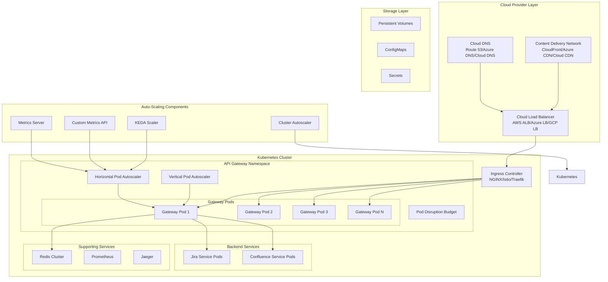

# Auto-Scaling and Cloud-Native Deployment Architecture

## Overview
This document outlines the auto-scaling strategies and cloud-native deployment architecture for the Atlassian API Gateway, designed for high availability, elastic scalability, and efficient resource utilization across multiple cloud providers.

## Cloud-Native Architecture



## Horizontal Pod Autoscaling (HPA)

### 1. HPA Configuration
```yaml
horizontal_pod_autoscaler:
  api_gateway_hpa:
    apiVersion: autoscaling/v2
    kind: HorizontalPodAutoscaler
    metadata:
      name: api-gateway-hpa
      namespace: api-gateway
    spec:
      scaleTargetRef:
        apiVersion: apps/v1
        kind: Deployment
        name: api-gateway
      
      minReplicas: 3
      maxReplicas: 50
      
      metrics:
        - type: Resource
          resource:
            name: cpu
            target:
              type: Utilization
              averageUtilization: 70
              
        - type: Resource
          resource:
            name: memory
            target:
              type: Utilization
              averageUtilization: 80
              
        - type: Pods
          pods:
            metric:
              name: http_requests_per_second
            target:
              type: AverageValue
              averageValue: "100"
              
        - type: Object
          object:
            metric:
              name: response_time_p95
            target:
              type: Value
              value: "2000m"  # 2 seconds
      
      behavior:
        scaleUp:
          stabilizationWindowSeconds: 60
          policies:
            - type: Percent
              value: 100
              periodSeconds: 60
            - type: Pods
              value: 5
              periodSeconds: 60
          selectPolicy: Max
          
        scaleDown:
          stabilizationWindowSeconds: 300
          policies:
            - type: Percent
              value: 10
              periodSeconds: 60
            - type: Pods
              value: 2
              periodSeconds: 60
          selectPolicy: Min

  custom_metrics_configuration:
    prometheus_adapter:
      rules:
        - seriesQuery: 'http_requests_total{namespace!="",pod!=""}'
          resources:
            overrides:
              namespace: {resource: "namespace"}
              pod: {resource: "pod"}
          name:
            matches: "^http_requests_total"
            as: "http_requests_per_second"
          metricsQuery: 'rate(<<.Series>>{<<.LabelMatchers>>}[2m])'
          
        - seriesQuery: 'http_request_duration_seconds{namespace!="",pod!=""}'
          resources:
            overrides:
              namespace: {resource: "namespace"}
              pod: {resource: "pod"}
          name:
            matches: "^http_request_duration_seconds"
            as: "response_time_p95"
          metricsQuery: 'histogram_quantile(0.95, rate(<<.Series>>_bucket{<<.LabelMatchers>>}[2m]))'
```

### 2. Advanced HPA with KEDA
```yaml
keda_configuration:
  scaled_object:
    apiVersion: keda.sh/v1alpha1
    kind: ScaledObject
    metadata:
      name: api-gateway-scaledobject
      namespace: api-gateway
    spec:
      scaleTargetRef:
        name: api-gateway
      
      minReplicaCount: 3
      maxReplicaCount: 100
      
      triggers:
        - type: prometheus
          metadata:
            serverAddress: http://prometheus.monitoring.svc.cluster.local:9090
            metricName: http_requests_per_second
            threshold: '100'
            query: sum(rate(http_requests_total{job="api-gateway"}[2m]))
            
        - type: prometheus
          metadata:
            serverAddress: http://prometheus.monitoring.svc.cluster.local:9090
            metricName: response_time_p95
            threshold: '2'
            query: histogram_quantile(0.95, rate(http_request_duration_seconds_bucket{job="api-gateway"}[2m]))
            
        - type: prometheus
          metadata:
            serverAddress: http://prometheus.monitoring.svc.cluster.local:9090
            metricName: queue_depth
            threshold: '50'
            query: sum(queue_depth{job="api-gateway"})
            
        - type: redis
          metadata:
            address: redis.api-gateway.svc.cluster.local:6379
            listName: request_queue
            listLength: '100'
            
        - type: cpu
          metadata:
            type: Utilization
            value: '70'
            
        - type: memory
          metadata:
            type: Utilization
            value: '80'
      
      advanced:
        restoreToOriginalReplicaCount: true
        horizontalPodAutoscalerConfig:
          behavior:
            scaleUp:
              stabilizationWindowSeconds: 60
              policies:
                - type: Percent
                  value: 50
                  periodSeconds: 60
            scaleDown:
              stabilizationWindowSeconds: 300
              policies:
                - type: Percent
                  value: 10
                  periodSeconds: 60
```

## Vertical Pod Autoscaling (VPA)

### 1. VPA Configuration
```yaml
vertical_pod_autoscaler:
  api_gateway_vpa:
    apiVersion: autoscaling.k8s.io/v1
    kind: VerticalPodAutoscaler
    metadata:
      name: api-gateway-vpa
      namespace: api-gateway
    spec:
      targetRef:
        apiVersion: apps/v1
        kind: Deployment
        name: api-gateway
      
      updatePolicy:
        updateMode: "Auto"  # Auto, Recreation, Initial, Off
        
      resourcePolicy:
        containerPolicies:
          - containerName: api-gateway
            minAllowed:
              cpu: 100m
              memory: 128Mi
            maxAllowed:
              cpu: 4
              memory: 8Gi
            controlledResources: ["cpu", "memory"]
            controlledValues: RequestsAndLimits
            
          - containerName: sidecar-proxy
            minAllowed:
              cpu: 50m
              memory: 64Mi
            maxAllowed:
              cpu: 500m
              memory: 512Mi
            controlledResources: ["cpu", "memory"]

  vpa_recommender_config:
    recommender_interval: "1m"
    checkpoint_gc_interval: "10m"
    prometheus_address: "http://prometheus.monitoring.svc.cluster.local:9090"
    
    memory_aggregation_interval: "24h"
    memory_aggregation_interval_count: 8
    memory_histogram_decay_half_life: "24h"
    
    cpu_aggregation_interval: "24h"
    cpu_aggregation_interval_count: 8
    cpu_histogram_decay_half_life: "24h"
```

## Cluster Autoscaling

### 1. Cluster Autoscaler Configuration
```yaml
cluster_autoscaler:
  aws_configuration:
    deployment:
      apiVersion: apps/v1
      kind: Deployment
      metadata:
        name: cluster-autoscaler
        namespace: kube-system
      spec:
        replicas: 1
        selector:
          matchLabels:
            app: cluster-autoscaler
        template:
          metadata:
            labels:
              app: cluster-autoscaler
          spec:
            serviceAccountName: cluster-autoscaler
            containers:
            - image: k8s.gcr.io/autoscaling/cluster-autoscaler:v1.21.0
              name: cluster-autoscaler
              resources:
                limits:
                  cpu: 100m
                  memory: 300Mi
                requests:
                  cpu: 100m
                  memory: 300Mi
              command:
                - ./cluster-autoscaler
                - --v=4
                - --stderrthreshold=info
                - --cloud-provider=aws
                - --skip-nodes-with-local-storage=false
                - --expander=least-waste
                - --node-group-auto-discovery=asg:tag=k8s.io/cluster-autoscaler/enabled,k8s.io/cluster-autoscaler/api-gateway-cluster
                - --balance-similar-node-groups
                - --scale-down-enabled=true
                - --scale-down-delay-after-add=10m
                - --scale-down-unneeded-time=10m
                - --scale-down-utilization-threshold=0.5
                - --max-node-provision-time=15m
              env:
                - name: AWS_REGION
                  value: us-west-2
  
  node_groups:
    general_purpose:
      name: "api-gateway-general"
      instance_types: ["m5.large", "m5.xlarge", "m5.2xlarge"]
      min_size: 3
      max_size: 20
      desired_capacity: 5
      
      labels:
        node-type: "general"
        workload: "api-gateway"
        
      taints: []
      
      scaling_config:
        scale_up_cooldown: "3m"
        scale_down_cooldown: "10m"
        
    compute_optimized:
      name: "api-gateway-compute"
      instance_types: ["c5.large", "c5.xlarge", "c5.2xlarge"]
      min_size: 0
      max_size: 10
      desired_capacity: 0
      
      labels:
        node-type: "compute-optimized"
        workload: "high-cpu"
        
      taints:
        - key: "workload"
          value: "high-cpu"
          effect: "NoSchedule"
          
    memory_optimized:
      name: "api-gateway-memory"
      instance_types: ["r5.large", "r5.xlarge", "r5.2xlarge"]
      min_size: 0
      max_size: 5
      desired_capacity: 0
      
      labels:
        node-type: "memory-optimized"
        workload: "high-memory"
        
      taints:
        - key: "workload"
          value: "high-memory"
          effect: "NoSchedule"
```

### 2. Node Affinity and Pod Scheduling
```yaml
pod_scheduling:
  api_gateway_deployment:
    apiVersion: apps/v1
    kind: Deployment
    metadata:
      name: api-gateway
      namespace: api-gateway
    spec:
      replicas: 5
      selector:
        matchLabels:
          app: api-gateway
      template:
        metadata:
          labels:
            app: api-gateway
        spec:
          affinity:
            nodeAffinity:
              requiredDuringSchedulingIgnoredDuringExecution:
                nodeSelectorTerms:
                - matchExpressions:
                  - key: node-type
                    operator: In
                    values: ["general", "compute-optimized"]
                    
              preferredDuringSchedulingIgnoredDuringExecution:
              - weight: 100
                preference:
                  matchExpressions:
                  - key: node-type
                    operator: In
                    values: ["general"]
                    
            podAntiAffinity:
              preferredDuringSchedulingIgnoredDuringExecution:
              - weight: 100
                podAffinityTerm:
                  labelSelector:
                    matchExpressions:
                    - key: app
                      operator: In
                      values: ["api-gateway"]
                  topologyKey: kubernetes.io/hostname
                  
              - weight: 50
                podAffinityTerm:
                  labelSelector:
                    matchExpressions:
                    - key: app
                      operator: In
                      values: ["api-gateway"]
                  topologyKey: topology.kubernetes.io/zone
          
          tolerations:
          - key: "workload"
            operator: "Equal"
            value: "api-gateway"
            effect: "NoSchedule"
            
          topologySpreadConstraints:
          - maxSkew: 1
            topologyKey: topology.kubernetes.io/zone
            whenUnsatisfiable: DoNotSchedule
            labelSelector:
              matchLabels:
                app: api-gateway
                
          - maxSkew: 2
            topologyKey: kubernetes.io/hostname
            whenUnsatisfiable: ScheduleAnyway
            labelSelector:
              matchLabels:
                app: api-gateway
```

## Multi-Cloud Deployment Strategy

### 1. Multi-Cloud Architecture
```yaml
multi_cloud_deployment:
  primary_cloud: "aws"
  secondary_clouds: ["azure", "gcp"]
  
  traffic_distribution:
    aws:
      percentage: 70
      regions: ["us-west-2", "us-east-1"]
      
    azure:
      percentage: 20
      regions: ["westus2", "eastus"]
      
    gcp:
      percentage: 10
      regions: ["us-west1", "us-central1"]
  
  failover_strategy:
    type: "active-passive"
    health_check_interval: "30s"
    failover_threshold: 3
    recovery_threshold: 2
    
    failover_rules:
      - trigger: "primary_cloud_unavailable"
        action: "redirect_to_secondary"
        
      - trigger: "region_unavailable"
        action: "redirect_to_backup_region"
        
      - trigger: "performance_degradation"
        condition: "response_time > 5s for 5m"
        action: "gradual_traffic_shift"

  cross_cloud_networking:
    service_mesh: "istio"
    cross_cluster_communication: "admiralty"
    
    network_policies:
      - allow_cross_cluster_communication
      - encrypt_inter_cluster_traffic
      - monitor_cross_cloud_latency
```

### 2. Cloud-Specific Configurations
```yaml
cloud_specific_configs:
  aws:
    load_balancer: "application_load_balancer"
    auto_scaling: "ec2_auto_scaling_groups"
    storage: "ebs_volumes"
    networking: "vpc_with_multiple_azs"
    
    specific_features:
      spot_instances:
        enabled: true
        percentage: 30
        instance_types: ["m5.large", "m5.xlarge"]
        
      fargate:
        enabled: false  # Use EC2 for better control
        
      eks_managed_node_groups:
        enabled: true
        
  azure:
    load_balancer: "azure_load_balancer"
    auto_scaling: "virtual_machine_scale_sets"
    storage: "azure_disks"
    networking: "virtual_network_with_multiple_zones"
    
    specific_features:
      spot_instances:
        enabled: true
        percentage: 25
        
      aci_integration:
        enabled: false
        
      aks_managed_identity:
        enabled: true
        
  gcp:
    load_balancer: "google_cloud_load_balancer"
    auto_scaling: "managed_instance_groups"
    storage: "persistent_disks"
    networking: "vpc_with_multiple_zones"
    
    specific_features:
      preemptible_instances:
        enabled: true
        percentage: 20
        
      autopilot_mode:
        enabled: false  # Use standard GKE for more control
        
      workload_identity:
        enabled: true
```

## Scaling Policies and Strategies

### 1. Predictive Scaling
```yaml
predictive_scaling:
  machine_learning_models:
    traffic_prediction:
      model_type: "time_series_forecasting"
      training_data: "historical_traffic_patterns"
      prediction_horizon: "2h"
      update_frequency: "1h"
      
      features:
        - "time_of_day"
        - "day_of_week"
        - "month_of_year"
        - "business_events"
        - "deployment_events"
        - "external_factors"
    
    resource_prediction:
      model_type: "regression"
      training_data: "resource_utilization_history"
      prediction_horizon: "30m"
      update_frequency: "15m"
      
      features:
        - "request_rate"
        - "response_time"
        - "error_rate"
        - "payload_size"
        - "authentication_method"
  
  scaling_actions:
    proactive_scaling:
      enabled: true
      confidence_threshold: 0.8
      lead_time: "10m"
      
      actions:
        - "pre_scale_pods"
        - "warm_up_connections"
        - "pre_load_cache"
        - "prepare_additional_nodes"
    
    reactive_scaling:
      enabled: true
      fallback_for_prediction_failures: true
      
      triggers:
        - "cpu_utilization > 70%"
        - "memory_utilization > 80%"
        - "response_time_p95 > 2s"
        - "queue_depth > 50"

### 2. Event-Driven Scaling
```yaml
event_driven_scaling:
  event_sources:
    business_events:
      - name: "product_launch"
        scaling_factor: 3.0
        duration: "4h"
        
      - name: "marketing_campaign"
        scaling_factor: 2.5
        duration: "2h"
        
      - name: "system_maintenance"
        scaling_factor: 0.5
        duration: "1h"
    
    external_events:
      - name: "ddos_attack_detected"
        scaling_factor: 1.5
        duration: "until_resolved"
        
      - name: "upstream_service_degradation"
        scaling_factor: 0.8
        duration: "until_resolved"
    
    scheduled_events:
      - name: "daily_peak_hours"
        schedule: "0 9-17 * * 1-5"  # Business hours
        scaling_factor: 1.8
        
      - name: "weekend_low_traffic"
        schedule: "0 0-23 * * 0,6"  # Weekends
        scaling_factor: 0.6
  
  event_processing:
    event_bus: "kafka"
    event_processor: "kubernetes_jobs"
    
    scaling_webhook:
      endpoint: "https://scaling-controller.api-gateway.svc.cluster.local/scale"
      authentication: "service_account_token"
      
    notification_channels:
      - "slack"
      - "email"
      - "pagerduty"
```

## Resource Management and Optimization

### 1. Resource Quotas and Limits
```yaml
resource_management:
  namespace_quotas:
    api_gateway_namespace:
      requests.cpu: "20"
      requests.memory: "40Gi"
      limits.cpu: "40"
      limits.memory: "80Gi"
      persistentvolumeclaims: "10"
      services: "20"
      secrets: "50"
      configmaps: "50"
      
  pod_resource_specifications:
    api_gateway_pod:
      requests:
        cpu: "500m"
        memory: "1Gi"
      limits:
        cpu: "2"
        memory: "4Gi"
        
    sidecar_proxy:
      requests:
        cpu: "100m"
        memory: "128Mi"
      limits:
        cpu: "500m"
        memory: "512Mi"
  
  quality_of_service:
    guaranteed_pods:
      - "api-gateway-critical"
      - "authentication-service"
      
    burstable_pods:
      - "api-gateway-standard"
      - "monitoring-components"
      
    best_effort_pods:
      - "batch-jobs"
      - "development-tools"

### 2. Cost Optimization
```yaml
cost_optimization:
  instance_optimization:
    spot_instances:
      enabled: true
      percentage: 30
      fallback_strategy: "on_demand"
      
    reserved_instances:
      enabled: true
      percentage: 40
      term: "1_year"
      
    right_sizing:
      enabled: true
      analysis_period: "7d"
      recommendation_threshold: "20%"
  
  resource_optimization:
    unused_resource_detection:
      enabled: true
      threshold: "10%"
      action: "recommend_downsizing"
      
    over_provisioning_detection:
      enabled: true
      threshold: "50%"
      action: "automatic_adjustment"
      
    idle_resource_cleanup:
      enabled: true
      idle_threshold: "5%"
      cleanup_delay: "1h"
  
  cost_monitoring:
    budget_alerts:
      - threshold: "80%"
        action: "notify_team"
        
      - threshold: "95%"
        action: "freeze_scaling"
        
      - threshold: "100%"
        action: "emergency_scale_down"
    
    cost_allocation:
      by_namespace: true
      by_team: true
      by_environment: true
      by_application: true
```

## Deployment Strategies

### 1. Blue-Green Deployment
```yaml
blue_green_deployment:
  strategy_configuration:
    deployment_method: "blue_green"
    traffic_switching: "instant"
    rollback_capability: true
    
  blue_environment:
    namespace: "api-gateway-blue"
    replicas: 5
    version: "current"
    traffic_percentage: 100
    
  green_environment:
    namespace: "api-gateway-green"
    replicas: 5
    version: "new"
    traffic_percentage: 0
    
  switching_process:
    pre_switch_validation:
      - "health_checks"
      - "smoke_tests"
      - "performance_tests"
      - "security_scans"
      
    switch_criteria:
      - "all_pods_ready"
      - "health_checks_passing"
      - "performance_within_sla"
      - "error_rate_below_threshold"
      
    post_switch_monitoring:
      duration: "30m"
      metrics:
        - "error_rate"
        - "response_time"
        - "throughput"
        - "resource_utilization"
      
    rollback_triggers:
      - "error_rate > 1%"
      - "response_time_p95 > 3s"
      - "health_check_failures > 5%"

### 2. Canary Deployment
```yaml
canary_deployment:
  strategy_configuration:
    deployment_method: "canary"
    traffic_splitting: "gradual"
    rollback_capability: true
    
  canary_stages:
    stage_1:
      traffic_percentage: 5
      duration: "10m"
      success_criteria:
        - "error_rate < 0.5%"
        - "response_time_p95 < 2s"
        
    stage_2:
      traffic_percentage: 25
      duration: "20m"
      success_criteria:
        - "error_rate < 0.5%"
        - "response_time_p95 < 2s"
        - "no_critical_alerts"
        
    stage_3:
      traffic_percentage: 50
      duration: "30m"
      success_criteria:
        - "error_rate < 0.5%"
        - "response_time_p95 < 2s"
        - "user_satisfaction > 95%"
        
    stage_4:
      traffic_percentage: 100
      duration: "60m"
      success_criteria:
        - "error_rate < 0.5%"
        - "response_time_p95 < 2s"
        - "all_metrics_stable"
  
  automated_promotion:
    enabled: true
    promotion_criteria:
      - "all_stage_criteria_met"
      - "manual_approval_received"
      - "security_scan_passed"
      
  automated_rollback:
    enabled: true
    rollback_criteria:
      - "error_rate > 1%"
      - "response_time_p95 > 3s"
      - "critical_alert_fired"
      - "user_satisfaction < 90%"
```

## Disaster Recovery and High Availability

### 1. Multi-Region Deployment
```yaml
multi_region_deployment:
  regions:
    primary:
      region: "us-west-2"
      traffic_percentage: 60
      clusters: 2
      
    secondary:
      region: "us-east-1"
      traffic_percentage: 30
      clusters: 1
      
    tertiary:
      region: "eu-west-1"
      traffic_percentage: 10
      clusters: 1
  
  cross_region_replication:
    configuration_sync:
      enabled: true
      sync_interval: "5m"
      
    data_replication:
      enabled: true
      replication_lag: "< 1s"
      
    secret_management:
      cross_region_sync: true
      encryption_in_transit: true
  
  failover_configuration:
    automatic_failover:
      enabled: true
      health_check_interval: "30s"
      failure_threshold: 3
      
    manual_failover:
      enabled: true
      approval_required: true
      
    recovery_procedures:
      rto: "5m"  # Recovery Time Objective
      rpo: "1m"  # Recovery Point Objective

### 2. Backup and Recovery
```yaml
backup_recovery:
  backup_strategy:
    configuration_backup:
      frequency: "hourly"
      retention: "30d"
      storage: "s3_cross_region"
      
    data_backup:
      frequency: "daily"
      retention: "90d"
      encryption: true
      
    cluster_backup:
      frequency: "daily"
      retention: "7d"
      include_persistent_volumes: true
  
  recovery_procedures:
    configuration_recovery:
      automated: true
      validation_required: true
      
    data_recovery:
      automated: false
      approval_required: true
      
    cluster_recovery:
      automated: false
      disaster_recovery_team_required: true
  
  testing_schedule:
    backup_validation: "weekly"
    recovery_testing: "monthly"
    disaster_recovery_drill: "quarterly"