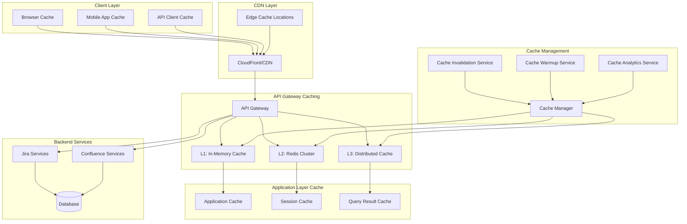

# Caching Strategies for Performance Optimization

## Overview
This document outlines comprehensive caching strategies for the Atlassian API Gateway, designed to optimize performance, reduce backend load, and improve user experience through intelligent multi-layer caching mechanisms.

## Caching Architecture



## Multi-Layer Caching Strategy

### 1. Layer 1: In-Memory Cache (Local)
```yaml
l1_in_memory_cache:
  technology: "Caffeine/Guava Cache"
  characteristics:
    - "ultra_low_latency"
    - "high_throughput"
    - "limited_capacity"
    - "process_local"
    
  configuration:
    max_size: 10000
    expire_after_write: "5m"
    expire_after_access: "2m"
    refresh_after_write: "3m"
    
  cache_categories:
    authentication_tokens:
      max_size: 5000
      ttl: "15m"
      refresh_ahead: true
      
    user_profiles:
      max_size: 2000
      ttl: "10m"
      refresh_ahead: true
      
    permission_cache:
      max_size: 3000
      ttl: "5m"
      refresh_ahead: false
      
    api_responses:
      max_size: 1000
      ttl: "2m"
      refresh_ahead: false
      
  eviction_policies:
    primary: "LRU"  # Least Recently Used
    secondary: "size_based"
    emergency: "TTL_based"
    
  monitoring:
    hit_rate_threshold: 85
    miss_rate_alert: 20
    eviction_rate_alert: 10

### 2. Layer 2: Distributed Cache (Redis)
```yaml
l2_distributed_cache:
  technology: "Redis Cluster"
  characteristics:
    - "shared_across_instances"
    - "persistent_storage"
    - "high_availability"
    - "scalable_capacity"
    
  cluster_configuration:
    nodes: 6
    replicas: 1
    sharding_strategy: "consistent_hashing"
    failover: "automatic"
    
  cache_policies:
    default_ttl: "1h"
    max_memory_policy: "allkeys-lru"
    persistence: "RDB + AOF"
    compression: "enabled"
    
  cache_categories:
    session_data:
      ttl: "24h"
      persistence: "high"
      replication: "sync"
      
    api_responses:
      ttl: "30m"
      persistence: "medium"
      replication: "async"
      
    user_data:
      ttl: "2h"
      persistence: "high"
      replication: "sync"
      
    configuration_data:
      ttl: "6h"
      persistence: "high"
      replication: "sync"
      
    temporary_data:
      ttl: "5m"
      persistence: "low"
      replication: "async"
      
  performance_optimization:
    connection_pooling:
      min_connections: 10
      max_connections: 100
      connection_timeout: "5s"
      
    pipelining:
      enabled: true
      batch_size: 100
      
    compression:
      algorithm: "LZ4"
      threshold: "1KB"
      
  high_availability:
    sentinel_configuration:
      sentinels: 3
      quorum: 2
      failover_timeout: "30s"
      
    backup_strategy:
      frequency: "hourly"
      retention: "7d"
      cross_region: true

### 3. Layer 3: Content Delivery Network (CDN)
```yaml
l3_cdn_cache:
  provider: "CloudFront/Azure CDN/Cloud CDN"
  characteristics:
    - "global_edge_locations"
    - "geographic_distribution"
    - "static_content_optimization"
    - "dynamic_content_acceleration"
    
  cache_behaviors:
    static_assets:
      path_pattern: "/static/*"
      ttl: "1y"
      compress: true
      
    api_responses:
      path_pattern: "/api/*/public/*"
      ttl: "5m"
      compress: true
      query_string_forwarding: "whitelist"
      
    user_avatars:
      path_pattern: "/avatars/*"
      ttl: "1d"
      compress: true
      
    documentation:
      path_pattern: "/docs/*"
      ttl: "1h"
      compress: true
      
  cache_invalidation:
    strategies:
      - "tag_based_invalidation"
      - "path_based_invalidation"
      - "wildcard_invalidation"
      
    triggers:
      - "content_updates"
      - "configuration_changes"
      - "scheduled_purges"
      
  geographic_optimization:
    regions:
      - "north_america"
      - "europe"
      - "asia_pacific"
      - "south_america"
      
    edge_locations: 200+
    origin_shield: "enabled"
```

## Service-Specific Caching Strategies

### 1. Jira API Caching
```yaml
jira_caching_strategy:
  read_operations:
    issue_details:
      cache_key: "jira:issue:{issue_id}:v{version}"
      ttl: "10m"
      cache_layers: ["L1", "L2"]
      invalidation_triggers:
        - "issue_updated"
        - "issue_transitioned"
        - "comment_added"
        
    project_metadata:
      cache_key: "jira:project:{project_key}:metadata"
      ttl: "1h"
      cache_layers: ["L1", "L2", "L3"]
      invalidation_triggers:
        - "project_updated"
        - "project_configuration_changed"
        
    user_permissions:
      cache_key: "jira:permissions:{user_id}:{project_key}"
      ttl: "15m"
      cache_layers: ["L1", "L2"]
      invalidation_triggers:
        - "user_permissions_changed"
        - "project_permissions_updated"
        
    search_results:
      cache_key: "jira:search:{jql_hash}:{user_id}"
      ttl: "5m"
      cache_layers: ["L2"]
      invalidation_triggers:
        - "issues_updated_in_result_set"
        - "project_changes_affecting_search"
        
  write_operations:
    issue_creation:
      cache_invalidation:
        - "jira:project:{project_key}:*"
        - "jira:search:*"
        - "jira:dashboard:{user_id}:*"
        
    issue_updates:
      cache_invalidation:
        - "jira:issue:{issue_id}:*"
        - "jira:search:*"
        - "jira:activity:{user_id}:*"
        
  conditional_caching:
    conditions:
      - condition: "issue_status == 'Closed'"
        ttl_multiplier: 5  # Cache closed issues longer
        
      - condition: "project_archived == true"
        ttl_multiplier: 10  # Cache archived projects much longer
        
      - condition: "user_type == 'service_account'"
        cache_layers: ["L2", "L3"]  # Skip L1 for service accounts

### 2. Confluence API Caching
```yaml
confluence_caching_strategy:
  content_operations:
    page_content:
      cache_key: "confluence:page:{page_id}:v{version}"
      ttl: "20m"
      cache_layers: ["L1", "L2", "L3"]
      invalidation_triggers:
        - "page_updated"
        - "page_moved"
        - "permissions_changed"
        
    space_metadata:
      cache_key: "confluence:space:{space_key}:metadata"
      ttl: "2h"
      cache_layers: ["L1", "L2", "L3"]
      invalidation_triggers:
        - "space_updated"
        - "space_permissions_changed"
        
    page_tree:
      cache_key: "confluence:tree:{space_key}:{root_page_id}"
      ttl: "30m"
      cache_layers: ["L2", "L3"]
      invalidation_triggers:
        - "page_hierarchy_changed"
        - "page_created_or_deleted"
        
    search_results:
      cache_key: "confluence:search:{cql_hash}:{user_id}"
      ttl: "10m"
      cache_layers: ["L2"]
      invalidation_triggers:
        - "content_updated_in_result_set"
        - "space_permissions_changed"
        
  attachment_operations:
    attachment_metadata:
      cache_key: "confluence:attachment:{attachment_id}:metadata"
      ttl: "1h"
      cache_layers: ["L1", "L2", "L3"]
      
    attachment_thumbnails:
      cache_key: "confluence:thumbnail:{attachment_id}:{size}"
      ttl: "24h"
      cache_layers: ["L3"]  # CDN only for thumbnails
      
  macro_rendering:
    macro_output:
      cache_key: "confluence:macro:{macro_hash}:{context_hash}"
      ttl: "1h"
      cache_layers: ["L2", "L3"]
      invalidation_triggers:
        - "macro_parameters_changed"
        - "referenced_content_updated"
```

## Cache Key Design and Management

### 1. Cache Key Patterns
```yaml
cache_key_patterns:
  hierarchical_keys:
    format: "{service}:{resource_type}:{identifier}:{version}"
    examples:
      - "jira:issue:PROJ-123:v2"
      - "confluence:page:12345:v1"
      - "auth:user:user123:profile"
      
  composite_keys:
    format: "{service}:{operation}:{param1}:{param2}:{hash}"
    examples:
      - "jira:search:project:PROJ:user:user123:abc123"
      - "confluence:permissions:space:SPACE:user:user456:def456"
      
  versioned_keys:
    format: "{base_key}:v{version}:{timestamp}"
    examples:
      - "jira:project:PROJ:metadata:v1:1640995200"
      - "confluence:space:SPACE:tree:v2:1640995300"
      
  user_specific_keys:
    format: "{service}:{resource}:{user_context}:{identifier}"
    examples:
      - "jira:dashboard:user:user123:main"
      - "confluence:recent:user:user456:pages"
      
  tenant_aware_keys:
    format: "{tenant}:{service}:{resource}:{identifier}"
    examples:
      - "tenant1:jira:issue:PROJ-123"
      - "tenant2:confluence:page:12345"

### 2. Cache Key Generation
```yaml
key_generation_strategy:
  deterministic_hashing:
    algorithm: "SHA-256"
    input_normalization:
      - "parameter_sorting"
      - "case_normalization"
      - "whitespace_trimming"
      
  parameter_inclusion:
    always_include:
      - "resource_identifier"
      - "user_context"
      - "api_version"
      
    conditionally_include:
      - "tenant_id"  # Only for multi-tenant scenarios
      - "locale"     # Only for localized content
      - "timezone"   # Only for time-sensitive data
      
    never_include:
      - "request_id"
      - "timestamp"
      - "session_id"
      
  key_validation:
    max_length: 250
    allowed_characters: "alphanumeric + : - _"
    reserved_prefixes: ["system:", "internal:", "temp:"]
```

## Cache Invalidation Strategies

### 1. Event-Driven Invalidation
```yaml
event_driven_invalidation:
  event_sources:
    jira_events:
      - event: "issue.updated"
        invalidation_patterns:
          - "jira:issue:{issue_id}:*"
          - "jira:search:*"
          - "jira:dashboard:*"
          
      - event: "project.updated"
        invalidation_patterns:
          - "jira:project:{project_key}:*"
          - "jira:permissions:*:{project_key}"
          
      - event: "user.permissions.changed"
        invalidation_patterns:
          - "jira:permissions:{user_id}:*"
          - "jira:search:*:{user_id}:*"
          
    confluence_events:
      - event: "page.updated"
        invalidation_patterns:
          - "confluence:page:{page_id}:*"
          - "confluence:tree:*"
          - "confluence:search:*"
          
      - event: "space.permissions.changed"
        invalidation_patterns:
          - "confluence:space:{space_key}:*"
          - "confluence:permissions:*:{space_key}"
          
  event_processing:
    event_bus: "Apache Kafka"
    processing_guarantees: "at_least_once"
    batch_processing: true
    batch_size: 100
    batch_timeout: "5s"
    
  invalidation_execution:
    strategies:
      - "immediate_invalidation"
      - "lazy_invalidation"
      - "scheduled_invalidation"
      
    execution_order:
      1: "L1_cache_invalidation"
      2: "L2_cache_invalidation"
      3: "L3_cache_invalidation"
      4: "CDN_invalidation"

### 2. Time-Based Invalidation
```yaml
time_based_invalidation:
  ttl_strategies:
    fixed_ttl:
      description: "Fixed expiration time for all entries"
      use_cases: ["static_content", "configuration_data"]
      
    sliding_ttl:
      description: "TTL extends on access"
      use_cases: ["user_sessions", "frequently_accessed_data"]
      
    adaptive_ttl:
      description: "TTL based on access patterns"
      factors: ["access_frequency", "update_frequency", "data_volatility"]
      
  scheduled_invalidation:
    daily_cleanup:
      schedule: "0 2 * * *"  # 2 AM daily
      targets: ["expired_entries", "orphaned_keys"]
      
    weekly_refresh:
      schedule: "0 3 * * 0"  # 3 AM Sunday
      targets: ["long_lived_cache_entries"]
      
    monthly_purge:
      schedule: "0 4 1 * *"  # 4 AM first day of month
      targets: ["analytics_data", "historical_cache_entries"]

### 3. Manual Invalidation
```yaml
manual_invalidation:
  admin_interface:
    cache_management_ui:
      features:
        - "view_cache_statistics"
        - "search_cache_entries"
        - "invalidate_specific_keys"
        - "bulk_invalidation_operations"
        
    api_endpoints:
      - endpoint: "/admin/cache/invalidate"
        method: "POST"
        parameters: ["key_pattern", "cache_layer"]
        
      - endpoint: "/admin/cache/stats"
        method: "GET"
        response: "cache_statistics"
        
      - endpoint: "/admin/cache/warmup"
        method: "POST"
        parameters: ["cache_keys", "priority"]
        
  emergency_procedures:
    cache_flush:
      trigger: "data_corruption_detected"
      scope: "all_cache_layers"
      notification: "immediate_alert"
      
    selective_invalidation:
      trigger: "security_incident"
      scope: "user_specific_data"
      audit_logging: "required"
```

## Cache Warming and Preloading

### 1. Proactive Cache Warming
```yaml
cache_warming_strategies:
  startup_warming:
    description: "Warm cache during application startup"
    priority_data:
      - "frequently_accessed_configurations"
      - "popular_jira_projects"
      - "active_confluence_spaces"
      - "user_authentication_data"
      
    warming_sequence:
      1: "system_configurations"
      2: "user_authentication_cache"
      3: "popular_content_cache"
      4: "search_index_cache"
      
  predictive_warming:
    description: "Warm cache based on usage predictions"
    prediction_models:
      - "time_based_patterns"
      - "user_behavior_analysis"
      - "seasonal_trends"
      - "business_event_correlation"
      
    warming_triggers:
      - "approaching_peak_hours"
      - "before_scheduled_events"
      - "after_system_maintenance"
      - "new_content_publication"
      
  user_behavior_warming:
    description: "Warm cache based on individual user patterns"
    user_profiling:
      - "frequently_accessed_projects"
      - "preferred_confluence_spaces"
      - "common_search_queries"
      - "dashboard_configurations"
      
    warming_scope:
      - "user_specific_data"
      - "team_shared_resources"
      - "project_related_content"

### 2. Cache Preloading Mechanisms
```yaml
preloading_mechanisms:
  background_preloading:
    scheduler: "Quartz Scheduler"
    execution_threads: 5
    
    preloading_jobs:
      popular_content:
        schedule: "0 */30 * * * ?"  # Every 30 minutes
        data_sources: ["analytics_api", "usage_statistics"]
        
      user_dashboards:
        schedule: "0 0 6 * * ?"     # 6 AM daily
        data_sources: ["user_preferences", "recent_activity"]
        
      search_results:
        schedule: "0 15 * * * ?"    # Every hour at 15 minutes
        data_sources: ["popular_searches", "trending_queries"]
        
  real_time_preloading:
    triggers:
      - "user_login_detected"
      - "new_content_created"
      - "project_activity_spike"
      
    preloading_rules:
      user_login:
        preload_data:
          - "user_dashboard"
          - "recent_projects"
          - "assigned_issues"
          - "watched_pages"
          
      content_creation:
        preload_data:
          - "related_content"
          - "similar_projects"
          - "team_members_data"
          
  intelligent_preloading:
    machine_learning_models:
      - "collaborative_filtering"
      - "content_similarity_analysis"
      - "user_behavior_clustering"
      
    preloading_optimization:
      - "cost_benefit_analysis"
      - "cache_hit_prediction"
      - "resource_utilization_optimization"
```

## Performance Optimization

### 1. Cache Performance Tuning
```yaml
performance_tuning:
  memory_optimization:
    object_serialization:
      format: "Protocol Buffers"
      compression: "LZ4"
      compression_threshold: "1KB"
      
    memory_allocation:
      heap_size_optimization: true
      garbage_collection_tuning: true
      off_heap_storage: "enabled"
      
    data_structure_optimization:
      bloom_filters: "enabled"
      probabilistic_data_structures: "enabled"
      compact_representations: "enabled"
      
  network_optimization:
    connection_pooling:
      pool_size: 50
      connection_timeout: "5s"
      idle_timeout: "300s"
      
    request_batching:
      enabled: true
      batch_size: 100
      batch_timeout: "10ms"
      
    compression:
      algorithm: "Snappy"
      threshold: "512B"
      
  cpu_optimization:
    async_operations:
      cache_reads: "async"
      cache_writes: "async"
      invalidations: "async"
      
    thread_pool_configuration:
      cache_read_threads: 20
      cache_write_threads: 10
      invalidation_threads: 5
      
    cpu_affinity:
      enabled: true
      dedicated_cores: 2

### 2. Cache Sizing and Capacity Planning
```yaml
capacity_planning:
  sizing_calculations:
    l1_cache_sizing:
      base_calculation: "available_memory * 0.1"
      max_size: "2GB"
      entry_size_estimate: "2KB"
      estimated_entries: 1000000
      
    l2_cache_sizing:
      base_calculation: "total_redis_memory * 0.8"
      max_size: "50GB"
      entry_size_estimate: "5KB"
      estimated_entries: 10000000
      
    l3_cache_sizing:
      base_calculation: "cdn_storage_limit"
      max_size: "1TB"
      entry_size_estimate: "50KB"
      estimated_entries: 20000000
      
  growth_projections:
    data_growth_rate: "20% per quarter"
    user_growth_rate: "15% per quarter"
    cache_efficiency_improvement: "5% per quarter"
    
  capacity_monitoring:
    utilization_thresholds:
      warning: 70
      critical: 85
      emergency: 95
      
    scaling_triggers:
      - "utilization > 80% for 30m"
      - "hit_rate < 85% for 1h"
      - "response_time > 100ms for 15m"
```

## Cache Analytics and Monitoring

### 1. Cache Metrics Collection
```yaml
cache_metrics:
  performance_metrics:
    - name: "cache_hit_rate"
      calculation: "hits / (hits + misses) * 100"
      labels: ["cache_layer", "cache_category"]
      
    - name: "cache_miss_rate"
      calculation: "misses / (hits + misses) * 100"
      labels: ["cache_layer", "cache_category"]
      
    - name: "cache_response_time"
      type: "histogram"
      buckets: [1, 5, 10, 25, 50, 100, 250, 500]
      labels: ["cache_layer", "operation_type"]
      
    - name: "cache_throughput"
      calculation: "operations_per_second"
      labels: ["cache_layer", "operation_type"]
      
  utilization_metrics:
    - name: "cache_memory_usage"
      type: "gauge"
      labels: ["cache_layer", "node"]
      
    - name: "cache_entry_count"
      type: "gauge"
      labels: ["cache_layer", "cache_category"]
      
    - name: "cache_eviction_rate"
      calculation: "evictions_per_second"
      labels: ["cache_layer", "eviction_reason"]
      
  business_metrics:
    - name: "cache_cost_savings"
      calculation: "backend_requests_avoided * avg_backend_cost"
      labels: ["service", "operation_type"]
      
    - name: "user_experience_improvement"
      calculation: "response_time_reduction"
      labels: ["endpoint", "user_type"]

### 2. Cache Analytics Dashboard
```yaml
analytics_dashboard:
  real_time_panels:
    - title: "Cache Hit Rate by Layer"
      type: "gauge"
      query: "cache_hit_rate"
      thresholds:
        - value: 95
          color: "green"
        - value: 85
          color: "yellow"
        - value: 70
          color: "red"
          
    - title: "Cache Response Time"
      type: "graph"
      query: "histogram_quantile(0.95, cache_response_time)"
      
    - title: "Cache Memory Utilization"
      type: "graph"
      query: "cache_memory_usage / cache_memory_limit * 100"
      
  trend_analysis_panels:
    - title: "Cache Efficiency Trends"
      type: "graph"
      time_range: "7d"
      query: "avg_over_time(cache_hit_rate[1h])"
      
    - title: "Cache Cost Savings"
      type: "stat"
      time_range: "30d"
      query: "sum(cache_cost_savings)"
      
  operational_panels:
    - title: "Top Cache Keys by Access"
      type: "table"
      query: "topk(20, cache_access_count)"
      
    - title: "Cache Invalidation Events"
      type: "logs"
      query: "cache_invalidation_events"
      
    - title: "Cache Warming Status"
      type: "stat"
      query: "cache_warming_completion_rate"

### 3. Alerting and Notifications
```yaml
cache_alerting:
  performance_alerts:
    - alert: "LowCacheHitRate"
      expr: "cache_hit_rate < 80"
      for: "10m"
      labels:
        severity: "warning"
        team: "platform"
      annotations:
        summary: "Cache hit rate is below threshold"
        description: "Cache hit rate for {{ $labels.cache_layer }} is {{ $value }}%"
        
    - alert: "HighCacheLatency"
      expr: "histogram_quantile(0.95, cache_response_time) > 100"
      for: "5m"
      labels:
        severity: "warning"
        team: "platform"
      annotations:
        summary: "High cache response time"
        description: "95th percentile cache response time is {{ $value }}ms"
        
  capacity_alerts:
    - alert: "CacheMemoryHigh"
      expr: "cache_memory_usage / cache_memory_limit > 0.85"
      for: "15m"
      labels:
        severity: "critical"
        team: "sre"
      annotations:
        summary: "Cache memory usage is high"
        description: "Cache memory usage is {{ $value | humanizePercentage }}"
        
    - alert: "HighEvictionRate"
      expr: "cache_eviction_rate > 100"
      for: "10m"
      labels:
        severity: "warning"
        team: "platform"
      annotations:
        summary: "High cache eviction rate"
        description: "Cache eviction rate is {{ $value }} evictions/second"
        
  operational_alerts:
    - alert: "CacheInvalidationFailure"
      expr: "cache_invalidation_failure_rate > 0.05"
      for: "5m"
      labels:
        severity: "critical"
        team: "sre"
      annotations:
        summary: "Cache invalidation failures detected"
        description: "Cache invalidation failure rate is {{ $value | humanizePercentage }}"
```

## Cache Security and Compliance

### 1. Data Security in Cache
```yaml
cache_security:
  data_encryption:
    at_rest:
      algorithm: "AES-256-GCM"
      key_management: "HashiCorp Vault"
      key_rotation: "quarterly"
      
    in_transit:
      protocol: "TLS 1.3"
      certificate_management: "automated"
      
  access_control:
    authentication:
      method: "mutual_TLS"
      certificate_validation: "strict"
      
    authorization:
      rbac_enabled: true
      permissions:
        - "cache_read"
        - "cache_write"
        - "cache_admin"
        - "cache_invalidate"
        
  data_classification:
    sensitive_data:
      encryption_required: true
      access_logging: true
      retention_limits: "30d"
      
    public_data:
      encryption_optional: true
      access_logging: false
      retention_limits: "1y"
      
    personal_data:
      encryption_required: true
      access_logging: true
      retention_limits: "as_per_gdpr"
      anonymization: "required_after_retention"

### 2. Compliance and Governance
```yaml
compliance_requirements:
  gdpr_compliance:
    right_to_deletion:
      implementation: "cache_key_based_deletion"
      verification: "deletion_confirmation"
      
    data_portability:
      export_format: "JSON"
      encryption: "required"
      
    consent_management:
      cache_consent_tracking: true
      consent_withdrawal_handling: "immediate_deletion"
      
  data_retention:
    retention_policies:
      user_data: "2y"
      session_data: "30d"
      analytics_data: "7y"
      system_logs: "1y"
      
    automated_cleanup:
      enabled: true
      cleanup_frequency: "daily"
      verification_required: true
      
  audit_requirements:
    access_logging:
      enabled: true
      log_level: "detailed"
      retention: "7y"
      
    change_tracking:
      configuration_changes: true
      data_modifications: true
      access_pattern_changes: true
      
    compliance_reporting:
      frequency: "monthly"
      automated_generation: true
      stakeholder_distribution: true