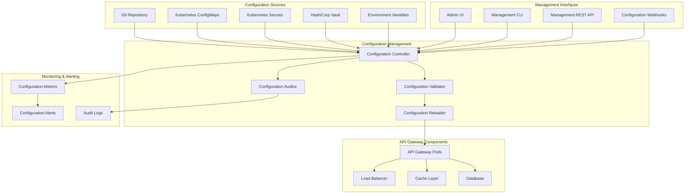

# API Gateway Configuration and Management

## Overview
This document provides comprehensive guidance for configuring and managing the Atlassian API Gateway, including operational procedures, configuration management, troubleshooting guides, and best practices for day-to-day operations.

## Configuration Management Architecture



## Core Configuration Structure

### 1. Application Configuration
```yaml
# application.yml
server:
  port: 8080
  servlet:
    context-path: /
  compression:
    enabled: true
    mime-types: application/json,application/xml,text/html,text/xml,text/plain
    min-response-size: 1024

management:
  server:
    port: 9090
  endpoints:
    web:
      exposure:
        include: health,info,metrics,prometheus,configprops,env
  endpoint:
    health:
      show-details: always
      probes:
        enabled: true
  metrics:
    export:
      prometheus:
        enabled: true
    tags:
      application: api-gateway
      environment: ${ENVIRONMENT:development}

spring:
  application:
    name: atlassian-api-gateway
  profiles:
    active: ${SPRING_PROFILES_ACTIVE:development}
  
  datasource:
    url: ${DATABASE_URL:jdbc:postgresql://localhost:5432/api_gateway}
    username: ${DATABASE_USERNAME:api_gateway}
    password: ${DATABASE_PASSWORD:password}
    driver-class-name: org.postgresql.Driver
    hikari:
      maximum-pool-size: 20
      minimum-idle: 5
      idle-timeout: 300000
      connection-timeout: 20000
      leak-detection-threshold: 60000
  
  redis:
    host: ${REDIS_HOST:localhost}
    port: ${REDIS_PORT:6379}
    password: ${REDIS_PASSWORD:}
    timeout: 2000ms
    lettuce:
      pool:
        max-active: 50
        max-idle: 10
        min-idle: 5
        max-wait: 2000ms
  
  security:
    oauth2:
      resourceserver:
        jwt:
          issuer-uri: ${JWT_ISSUER_URI:https://auth.company.com}
          jwk-set-uri: ${JWT_JWK_SET_URI:https://auth.company.com/.well-known/jwks.json}

logging:
  level:
    com.atlassian.gateway: ${LOG_LEVEL:INFO}
    org.springframework.security: WARN
    org.springframework.web: WARN
  pattern:
    console: "%d{yyyy-MM-dd HH:mm:ss} [%thread] %-5level [%X{traceId},%X{spanId}] %logger{36} - %msg%n"
    file: "%d{yyyy-MM-dd HH:mm:ss} [%thread] %-5level [%X{traceId},%X{spanId}] %logger{36} - %msg%n"
  file:
    name: /var/log/api-gateway/application.log
    max-size: 100MB
    max-history: 30

# Custom API Gateway Configuration
api-gateway:
  routing:
    jira:
      base-url: ${JIRA_BASE_URL:https://jira.company.com}
      timeout: ${JIRA_TIMEOUT:30s}
      retry:
        max-attempts: 3
        backoff-delay: 1s
    confluence:
      base-url: ${CONFLUENCE_BASE_URL:https://confluence.company.com}
      timeout: ${CONFLUENCE_TIMEOUT:30s}
      retry:
        max-attempts: 3
        backoff-delay: 1s
  
  authentication:
    jwt:
      enabled: true
      public-key-location: ${JWT_PUBLIC_KEY_LOCATION:classpath:public-key.pem}
    api-key:
      enabled: true
      header-name: X-API-Key
    saml:
      enabled: ${SAML_ENABLED:false}
      entity-id: ${SAML_ENTITY_ID:api-gateway}
      sso-url: ${SAML_SSO_URL:}
  
  rate-limiting:
    enabled: true
    default-limits:
      requests-per-minute: 1000
      requests-per-hour: 50000
    redis-key-prefix: "rate_limit:"
  
  caching:
    enabled: true
    default-ttl: 300s
    max-cache-size: 10000
    redis-key-prefix: "cache:"
  
  circuit-breaker:
    enabled: true
    failure-rate-threshold: 50
    wait-duration-in-open-state: 60s
    sliding-window-size: 100
    minimum-number-of-calls: 10
  
  monitoring:
    metrics:
      enabled: true
      export-interval: 30s
    tracing:
      enabled: true
      sampling-probability: 0.1
    logging:
      access-log-enabled: true
      audit-log-enabled: true
```

### 2. Environment-Specific Configurations
```yaml
# application-production.yml
spring:
  datasource:
    hikari:
      maximum-pool-size: 50
      minimum-idle: 10
  redis:
    lettuce:
      pool:
        max-active: 100
        max-idle: 20

logging:
  level:
    com.atlassian.gateway: INFO
    root: WARN
  file:
    name: /var/log/api-gateway/application.log

api-gateway:
  rate-limiting:
    default-limits:
      requests-per-minute: 2000
      requests-per-hour: 100000
  circuit-breaker:
    failure-rate-threshold: 30
    wait-duration-in-open-state: 30s
  monitoring:
    tracing:
      sampling-probability: 0.05

---
# application-staging.yml
spring:
  datasource:
    hikari:
      maximum-pool-size: 20
      minimum-idle: 5
  redis:
    lettuce:
      pool:
        max-active: 30
        max-idle: 10

logging:
  level:
    com.atlassian.gateway: DEBUG
    org.springframework.web: INFO

api-gateway:
  rate-limiting:
    default-limits:
      requests-per-minute: 500
      requests-per-hour: 25000
  monitoring:
    tracing:
      sampling-probability: 0.2

---
# application-development.yml
spring:
  datasource:
    url: jdbc:h2:mem:testdb
    driver-class-name: org.h2.Driver
    username: sa
    password: 
  h2:
    console:
      enabled: true
  redis:
    host: localhost
    port: 6379

logging:
  level:
    com.atlassian.gateway: DEBUG
    org.springframework: DEBUG

api-gateway:
  rate-limiting:
    enabled: false
  circuit-breaker:
    enabled: false
  monitoring:
    tracing:
      sampling-probability: 1.0
```

## Configuration Management Procedures

### 1. Configuration Deployment Process
```yaml
configuration_deployment:
  process_steps:
    1: "configuration_validation"
    2: "staging_deployment"
    3: "integration_testing"
    4: "production_deployment"
    5: "post_deployment_verification"
  
  validation_checks:
    syntax_validation:
      - "yaml_syntax_check"
      - "json_schema_validation"
      - "configuration_completeness_check"
    
    semantic_validation:
      - "dependency_validation"
      - "resource_availability_check"
      - "security_policy_compliance"
    
    compatibility_validation:
      - "backward_compatibility_check"
      - "api_version_compatibility"
      - "client_impact_assessment"
  
  deployment_strategies:
    blue_green:
      description: "Deploy to parallel environment and switch traffic"
      rollback_time: "< 30 seconds"
      risk_level: "low"
      
    canary:
      description: "Gradual rollout with traffic splitting"
      rollback_time: "< 2 minutes"
      risk_level: "medium"
      
    rolling_update:
      description: "Sequential update of instances"
      rollback_time: "< 5 minutes"
      risk_level: "medium"
  
  rollback_procedures:
    automatic_rollback:
      triggers:
        - "health_check_failure"
        - "error_rate_spike"
        - "performance_degradation"
      
    manual_rollback:
      approval_required: true
      rollback_window: "1 hour"
      
    emergency_rollback:
      no_approval_required: true
      immediate_execution: true
```

### 2. Configuration Change Management
```yaml
change_management:
  change_categories:
    low_risk:
      examples:
        - "log_level_changes"
        - "monitoring_configuration"
        - "non_functional_parameters"
      approval_process: "automated"
      testing_requirements: "basic_validation"
      
    medium_risk:
      examples:
        - "timeout_adjustments"
        - "cache_configuration"
        - "rate_limit_changes"
      approval_process: "team_lead_approval"
      testing_requirements: "integration_testing"
      
    high_risk:
      examples:
        - "authentication_changes"
        - "routing_modifications"
        - "security_policy_updates"
      approval_process: "architecture_review"
      testing_requirements: "full_regression_testing"
  
  change_workflow:
    1: "change_request_creation"
    2: "impact_assessment"
    3: "approval_process"
    4: "implementation_planning"
    5: "testing_execution"
    6: "deployment_execution"
    7: "post_change_verification"
    8: "documentation_update"
  
  change_tracking:
    change_log:
      format: "structured_json"
      retention: "2_years"
      fields:
        - "change_id"
        - "timestamp"
        - "author"
        - "description"
        - "risk_level"
        - "approval_status"
        - "deployment_status"
        - "rollback_plan"
    
    audit_trail:
      enabled: true
      immutable: true
      encryption: true
      compliance: "sox_gdpr_compliant"
```

## Administrative Interfaces

### 1. Management REST API
```yaml
# Management API Endpoints
management_api:
  base_path: "/admin/api/v1"
  authentication: "bearer_token"
  authorization: "rbac"
  
  endpoints:
    configuration:
      - path: "/config"
        methods: ["GET", "PUT"]
        description: "Get/Update gateway configuration"
        permissions: ["config:read", "config:write"]
        
      - path: "/config/validate"
        methods: ["POST"]
        description: "Validate configuration changes"
        permissions: ["config:validate"]
        
      - path: "/config/reload"
        methods: ["POST"]
        description: "Reload configuration without restart"
        permissions: ["config:reload"]
    
    routing:
      - path: "/routes"
        methods: ["GET", "POST", "PUT", "DELETE"]
        description: "Manage routing rules"
        permissions: ["routes:manage"]
        
      - path: "/routes/{id}/test"
        methods: ["POST"]
        description: "Test routing rule"
        permissions: ["routes:test"]
    
    cache:
      - path: "/cache/stats"
        methods: ["GET"]
        description: "Get cache statistics"
        permissions: ["cache:read"]
        
      - path: "/cache/clear"
        methods: ["POST"]
        description: "Clear cache entries"
        permissions: ["cache:manage"]
        
      - path: "/cache/warmup"
        methods: ["POST"]
        description: "Warm up cache"
        permissions: ["cache:manage"]
    
    monitoring:
      - path: "/metrics"
        methods: ["GET"]
        description: "Get system metrics"
        permissions: ["metrics:read"]
        
      - path: "/health"
        methods: ["GET"]
        description: "Get health status"
        permissions: ["health:read"]
        
      - path: "/logs"
        methods: ["GET"]
        description: "Get application logs"
        permissions: ["logs:read"]
    
    security:
      - path: "/auth/tokens"
        methods: ["GET", "POST", "DELETE"]
        description: "Manage API tokens"
        permissions: ["auth:manage"]
        
      - path: "/auth/sessions"
        methods: ["GET", "DELETE"]
        description: "Manage user sessions"
        permissions: ["sessions:manage"]
```

### 2. Command Line Interface
```bash
#!/bin/bash
# API Gateway Management CLI

GATEWAY_CLI_VERSION="1.0.0"
GATEWAY_API_BASE="${GATEWAY_API_BASE:-http://localhost:9090/admin/api/v1}"
GATEWAY_TOKEN="${GATEWAY_TOKEN:-}"

# Configuration Management Commands
gateway_config_get() {
    curl -s -H "Authorization: Bearer ${GATEWAY_TOKEN}" \
         "${GATEWAY_API_BASE}/config" | jq '.'
}

gateway_config_set() {
    local config_file="$1"
    if [[ ! -f "$config_file" ]]; then
        echo "Error: Configuration file not found: $config_file"
        return 1
    fi
    
    curl -s -X PUT \
         -H "Authorization: Bearer ${GATEWAY_TOKEN}" \
         -H "Content-Type: application/json" \
         -d "@${config_file}" \
         "${GATEWAY_API_BASE}/config"
}

gateway_config_validate() {
    local config_file="$1"
    curl -s -X POST \
         -H "Authorization: Bearer ${GATEWAY_TOKEN}" \
         -H "Content-Type: application/json" \
         -d "@${config_file}" \
         "${GATEWAY_API_BASE}/config/validate"
}

gateway_config_reload() {
    curl -s -X POST \
         -H "Authorization: Bearer ${GATEWAY_TOKEN}" \
         "${GATEWAY_API_BASE}/config/reload"
}

# Cache Management Commands
gateway_cache_stats() {
    curl -s -H "Authorization: Bearer ${GATEWAY_TOKEN}" \
         "${GATEWAY_API_BASE}/cache/stats" | jq '.'
}

gateway_cache_clear() {
    local pattern="${1:-*}"
    curl -s -X POST \
         -H "Authorization: Bearer ${GATEWAY_TOKEN}" \
         -H "Content-Type: application/json" \
         -d "{\"pattern\": \"${pattern}\"}" \
         "${GATEWAY_API_BASE}/cache/clear"
}

gateway_cache_warmup() {
    local keys_file="$1"
    if [[ -f "$keys_file" ]]; then
        curl -s -X POST \
             -H "Authorization: Bearer ${GATEWAY_TOKEN}" \
             -H "Content-Type: application/json" \
             -d "@${keys_file}" \
             "${GATEWAY_API_BASE}/cache/warmup"
    else
        curl -s -X POST \
             -H "Authorization: Bearer ${GATEWAY_TOKEN}" \
             "${GATEWAY_API_BASE}/cache/warmup"
    fi
}

# Monitoring Commands
gateway_health() {
    curl -s -H "Authorization: Bearer ${GATEWAY_TOKEN}" \
         "${GATEWAY_API_BASE}/health" | jq '.'
}

gateway_metrics() {
    local metric_name="$1"
    if [[ -n "$metric_name" ]]; then
        curl -s -H "Authorization: Bearer ${GATEWAY_TOKEN}" \
             "${GATEWAY_API_BASE}/metrics?name=${metric_name}"
    else
        curl -s -H "Authorization: Bearer ${GATEWAY_TOKEN}" \
             "${GATEWAY_API_BASE}/metrics"
    fi
}

gateway_logs() {
    local lines="${1:-100}"
    local level="${2:-INFO}"
    curl -s -H "Authorization: Bearer ${GATEWAY_TOKEN}" \
         "${GATEWAY_API_BASE}/logs?lines=${lines}&level=${level}"
}

# Route Management Commands
gateway_routes_list() {
    curl -s -H "Authorization: Bearer ${GATEWAY_TOKEN}" \
         "${GATEWAY_API_BASE}/routes" | jq '.'
}

gateway_route_test() {
    local route_id="$1"
    local test_request="$2"
    
    curl -s -X POST \
         -H "Authorization: Bearer ${GATEWAY_TOKEN}" \
         -H "Content-Type: application/json" \
         -d "${test_request}" \
         "${GATEWAY_API_BASE}/routes/${route_id}/test"
}

# Main CLI Handler
main() {
    case "$1" in
        "config")
            case "$2" in
                "get") gateway_config_get ;;
                "set") gateway_config_set "$3" ;;
                "validate") gateway_config_validate "$3" ;;
                "reload") gateway_config_reload ;;
                *) echo "Usage: $0 config {get|set|validate|reload} [file]" ;;
            esac
            ;;
        "cache")
            case "$2" in
                "stats") gateway_cache_stats ;;
                "clear") gateway_cache_clear "$3" ;;
                "warmup") gateway_cache_warmup "$3" ;;
                *) echo "Usage: $0 cache {stats|clear|warmup} [pattern|file]" ;;
            esac
            ;;
        "health") gateway_health ;;
        "metrics") gateway_metrics "$2" ;;
        "logs") gateway_logs "$2" "$3" ;;
        "routes")
            case "$2" in
                "list") gateway_routes_list ;;
                "test") gateway_route_test "$3" "$4" ;;
                *) echo "Usage: $0 routes {list|test} [route_id] [test_request]" ;;
            esac
            ;;
        *)
            echo "API Gateway Management CLI v${GATEWAY_CLI_VERSION}"
            echo "Usage: $0 {config|cache|health|metrics|logs|routes} [options]"
            echo ""
            echo "Commands:"
            echo "  config get                    - Get current configuration"
            echo "  config set <file>            - Set configuration from file"
            echo "  config validate <file>       - Validate configuration file"
            echo "  config reload                - Reload configuration"
            echo "  cache stats                  - Show cache statistics"
            echo "  cache clear [pattern]        - Clear cache entries"
            echo "  cache warmup [file]          - Warm up cache"
            echo "  health                       - Show health status"
            echo "  metrics [name]               - Show metrics"
            echo "  logs [lines] [level]         - Show application logs"
            echo "  routes list                  - List all routes"
            echo "  routes test <id> <request>   - Test a route"
            ;;
    esac
}

main "$@"
```

### 3. Web-Based Admin Interface
```yaml
# Admin UI Configuration
admin_ui:
  enabled: true
  path: "/admin"
  authentication:
    method: "oauth2"
    provider: "company_sso"
    
  features:
    dashboard:
      enabled: true
      widgets:
        - "system_health"
        - "request_metrics"
        - "error_rates"
        - "cache_statistics"
        - "active_connections"
        
    configuration_management:
      enabled: true
      features:
        - "view_current_config"
        - "edit_configuration"
        - "validate_changes"
        - "deploy_configuration"
        - "rollback_changes"
        
    monitoring:
      enabled: true
      features:
        - "real_time_metrics"
        - "log_viewer"
        - "alert_management"
        - "performance_graphs"
        
    cache_management:
      enabled: true
      features:
        - "cache_statistics"
        - "cache_browser"
        - "cache_invalidation"
        - "cache_warming"
        
    route_management:
      enabled: true
      features:
        - "route_configuration"
        - "route_testing"
        - "traffic_analysis"
        - "load_balancing_config"
        
    security_management:
      enabled: true
      features:
        - "api_key_management"
        - "user_session_management"
        - "security_audit_logs"
        - "access_control_config"
  
  security:
    csrf_protection: true
    session_timeout: "30m"
    max_concurrent_sessions: 3
    audit_logging: true
```

## Operational Procedures

### 1. Daily Operations Checklist
```yaml
daily_operations:
  morning_checks:
    - task: "Check system health status"
      command: "gateway health"
      expected: "All components healthy"
      
    - task: "Review overnight error logs"
      command: "gateway logs 1000 ERROR"
      action: "Investigate any errors"
      
    - task: "Check cache hit rates"
      command: "gateway cache stats"
      threshold: "hit_rate > 85%"
      
    - task: "Verify backup completion"
      location: "backup monitoring dashboard"
      expected: "All backups successful"
      
    - task: "Review security alerts"
      location: "security monitoring dashboard"
      action: "Investigate any alerts"
  
  throughout_day:
    - task: "Monitor request rates"
      frequency: "hourly"
      threshold: "within normal patterns"
      
    - task: "Check error rates"
      frequency: "every 2 hours"
      threshold: "< 1%"
      
    - task: "Review performance metrics"
      frequency: "every 4 hours"
      threshold: "response_time < 2s"
  
  end_of_day:
    - task: "Review daily metrics summary"
      location: "monitoring dashboard"
      
    - task: "Check capacity utilization"
      metrics: ["cpu", "memory", "disk", "network"]
      
    - task: "Verify log rotation"
      location: "log management system"
      
    - task: "Update operational log"
      content: "daily summary and issues"
```

### 2. Incident Response Procedures
```yaml
incident_response:
  severity_levels:
    critical:
      definition: "Service completely unavailable"
      response_time: "15 minutes"
      escalation: "immediate"
      
    high:
      definition: "Significant service degradation"
      response_time: "30 minutes"
      escalation: "within 1 hour"
      
    medium:
      definition: "Minor service issues"
      response_time: "2 hours"
      escalation: "within 4 hours"
      
    low:
      definition: "Non-critical issues"
      response_time: "next business day"
      escalation: "if unresolved in 48 hours"
  
  response_procedures:
    immediate_actions:
      1: "assess_impact_and_scope"
      2: "implement_immediate_mitigation"
      3: "notify_stakeholders"
      4: "begin_root_cause_investigation"
      
    investigation_steps:
      1: "collect_system_logs"
      2: "analyze_metrics_and_traces"
      3: "check_recent_changes"
      4: "test_system_components"
      5: "identify_root_cause"
      
    resolution_steps:
      1: "implement_permanent_fix"
      2: "test_fix_in_staging"
      3: "deploy_fix_to_production"
      4: "verify_resolution"
      5: "monitor_for_recurrence"
      
    post_incident:
      1: "conduct_post_mortem"
      2: "document_lessons_learned"
      3: "update_procedures"
      4: "implement_preventive_measures"
  
  communication_plan:
    internal_notifications:
      - "on_call_engineer"
      - "team_lead"
      - "platform_team"
      - "management" # for critical incidents
      
    external_notifications:
      - "status_page_update"
      - "customer_notifications" # for customer-impacting incidents
      - "partner_notifications" # if applicable
      
    communication_templates:
      initial_notification: |
        INCIDENT ALERT: {{ severity }}
        Service: API Gateway
        Impact: {{ impact_description }}
        Status: Investigating
        ETA: {{ estimated_resolution_time }}
        
      status_update: |
        INCIDENT UPDATE: {{ incident_id }}
        Status: {{ current_status }}
        Progress: {{ progress_description }}
        Next Update: {{ next_update_time }}
        
      resolution_notification: |
        INCIDENT RESOLVED: {{ incident_id }}
        Resolution: {{ resolution_description }}
        Root Cause: {{ root_cause }}
        Preventive Measures: {{ preventive_measures }}
```

### 3. Maintenance Procedures
```yaml
maintenance_procedures:
  scheduled_maintenance:
    weekly_maintenance:
      schedule: "Sunday 2:00 AM - 4:00 AM"
      tasks:
        - "system_updates"
        - "log_rotation"
        - "cache_cleanup"
        - "database_maintenance"
        - "certificate_renewal_check"
        
    monthly_maintenance:
      schedule: "First Sunday of month 1:00 AM - 5:00 AM"
      tasks:
        - "security_patches"
        - "dependency_updates"
        - "performance_optimization"
        - "capacity_planning_review"
        - "disaster_recovery_testing"
        
    quarterly_maintenance:
      schedule: "Planned with business stakeholders"
      tasks:
        - "major_version_updates"
        - "infrastructure_upgrades"
        - "security_audit"
        - "architecture_review"
        - "business_continuity_testing"
  
  emergency_maintenance:
    triggers:
      - "critical_security_vulnerability"
      - "system_instability"
      - "data_corruption_risk"
      - "compliance_requirement"
      
    procedures:
      1: "assess_urgency_and_impact"
      2: "get_emergency_approval"
      3: "notify_stakeholders"
      4: "implement_maintenance"
      5: "verify_system_stability"
      6: "document_changes"
  
  maintenance_checklist:
    pre_maintenance:
      - "backup_current_configuration"
      - "backup_database"
      - "verify_rollback_procedures"
      - "notify_stakeholders"
      - "prepare_maintenance_window"
      
    during_maintenance:
      - "follow_maintenance_procedures"
      - "monitor_system_status"
      - "document_all_changes"
      - "test_critical_functionality"
      - "verify_performance_metrics"
      
    post_maintenance:
      - "verify_all_services_operational"
      - "run_smoke_tests"
      - "monitor_for_issues"
      - "update_documentation"
      - "notify_completion"
```

## Troubleshooting Guide

### 1. Common Issues and Solutions
```yaml
troubleshooting_guide:
  performance_issues:
    high_response_times:
      symptoms:
        - "response_time > 5s"
        - "user_complaints"
        - "timeout_errors"
      
      investigation_steps:
        1: "check_system_resources"
        2: "analyze_database_performance"
        3: "review_cache_hit_rates"
        4: "examine_network_latency"
        5: "analyze_application_logs"
      
      common_causes:
        - "database_connection_pool_exhaustion"
        - "cache_misses"
        - "network_congestion"
        - "inefficient_queries"
        - "memory_pressure"
      
      solutions:
        - "increase_connection_pool_size"
        - "optimize_cache_configuration"
        - "add_database_indexes"
        - "scale_horizontally"
        - "optimize_application_code"
    
    high_memory_usage:
      symptoms:
        - "memory_usage > 85%"
        - "garbage_collection_pressure"
        - "out_of_memory_errors"
      
      investigation_steps:
        1: "analyze_heap_dump"
        2: "check_cache_sizes"
        3: "review_connection_pools"
        4: "examine_memory_leaks"
      
      solutions:
        - "increase_heap_size"
        - "optimize_cache_configuration"
        - "fix_memory_leaks"
        - "tune_garbage_collection"
  
  connectivity_issues:
    backend_service_unavailable:
      symptoms:
        - "502_bad_gateway_errors"
        - "connection_refused_errors"
        - "circuit_breaker_open"
      
      investigation_steps:
        1: "check_backend_service_health"
        2: "verify_network_connectivity"
        3: "examine_dns_resolution"
        4: "review_firewall_rules"
      
      solutions:
        - "restart_backend_services"
        - "update_dns_configuration"
        - "adjust_firewall_rules"
        - "implement_fallback_mechanisms"
    
    database_connection_issues:
      symptoms:
        - "database_connection_errors"
        - "connection_pool_exhaustion"
        - "slow_database_queries"
      
      investigation_steps:
        1: "check_database_server_status"
        2: "analyze_connection_pool_metrics"
        3: "review_database_logs"
        4: "examine_query_performance"
      
      solutions:
        - "increase_connection_pool_size"
        - "optimize_database_queries"
        - "add_database_indexes"
        - "scale_database_resources"
  
  security_issues:
    authentication_failures:
      symptoms:
        - "401_unauthorized_errors"
        - "token_validation_failures"
        - "user_login_issues"
      
      investigation_steps:
        1: "check_authentication_service_health"
        2: "verify_token_configuration"
        3: "examine_certificate_validity"
        4: "review_security_logs"
      
      solutions:
- "renew_certificates"
        - "update_token_configuration"
        - "restart_authentication_service"
        - "verify_identity_provider_connectivity"
    
    authorization_failures:
      symptoms:
        - "403_forbidden_errors"
        - "permission_denied_errors"
        - "role_assignment_issues"
      
      investigation_steps:
        1: "verify_user_permissions"
        2: "check_role_assignments"
        3: "review_authorization_policies"
        4: "examine_policy_evaluation_logs"
      
      solutions:
        - "update_user_permissions"
        - "fix_role_assignments"
        - "update_authorization_policies"
        - "clear_permission_cache"
```

### 2. Diagnostic Commands
```bash
#!/bin/bash
# Diagnostic Commands for API Gateway

# System Health Diagnostics
diagnose_system_health() {
    echo "=== System Health Diagnostics ==="
    
    # Check application health
    echo "Application Health:"
    curl -s http://localhost:9090/actuator/health | jq '.'
    
    # Check system resources
    echo -e "\nSystem Resources:"
    echo "CPU Usage: $(top -bn1 | grep "Cpu(s)" | awk '{print $2}' | cut -d'%' -f1)"
    echo "Memory Usage: $(free | grep Mem | awk '{printf "%.2f%%", $3/$2 * 100.0}')"
    echo "Disk Usage: $(df -h / | awk 'NR==2{printf "%s", $5}')"
    
    # Check network connectivity
    echo -e "\nNetwork Connectivity:"
    ping -c 3 google.com > /dev/null && echo "Internet: OK" || echo "Internet: FAILED"
    
    # Check database connectivity
    echo -e "\nDatabase Connectivity:"
    pg_isready -h localhost -p 5432 && echo "Database: OK" || echo "Database: FAILED"
    
    # Check Redis connectivity
    echo -e "\nRedis Connectivity:"
    redis-cli ping > /dev/null && echo "Redis: OK" || echo "Redis: FAILED"
}

# Performance Diagnostics
diagnose_performance() {
    echo "=== Performance Diagnostics ==="
    
    # Check response times
    echo "Response Time Analysis:"
    curl -w "@curl-format.txt" -o /dev/null -s http://localhost:8080/health
    
    # Check active connections
    echo -e "\nActive Connections:"
    netstat -an | grep :8080 | wc -l
    
    # Check thread usage
    echo -e "\nThread Usage:"
    curl -s http://localhost:9090/actuator/metrics/jvm.threads.live | jq '.measurements[0].value'
    
    # Check garbage collection
    echo -e "\nGarbage Collection:"
    curl -s http://localhost:9090/actuator/metrics/jvm.gc.pause | jq '.measurements'
}

# Cache Diagnostics
diagnose_cache() {
    echo "=== Cache Diagnostics ==="
    
    # Redis info
    echo "Redis Info:"
    redis-cli info memory | grep used_memory_human
    redis-cli info stats | grep keyspace_hits
    redis-cli info stats | grep keyspace_misses
    
    # Application cache stats
    echo -e "\nApplication Cache Stats:"
    curl -s http://localhost:9090/actuator/metrics/cache.gets | jq '.'
    curl -s http://localhost:9090/actuator/metrics/cache.puts | jq '.'
}

# Database Diagnostics
diagnose_database() {
    echo "=== Database Diagnostics ==="
    
    # Connection pool stats
    echo "Connection Pool Stats:"
    curl -s http://localhost:9090/actuator/metrics/hikaricp.connections.active | jq '.'
    curl -s http://localhost:9090/actuator/metrics/hikaricp.connections.idle | jq '.'
    
    # Query performance
    echo -e "\nSlow Queries:"
    psql -h localhost -U api_gateway -d api_gateway -c "
        SELECT query, mean_time, calls 
        FROM pg_stat_statements 
        ORDER BY mean_time DESC 
        LIMIT 10;"
}

# Security Diagnostics
diagnose_security() {
    echo "=== Security Diagnostics ==="
    
    # Check SSL certificates
    echo "SSL Certificate Status:"
    echo | openssl s_client -connect localhost:8080 2>/dev/null | openssl x509 -noout -dates
    
    # Check authentication metrics
    echo -e "\nAuthentication Metrics:"
    curl -s http://localhost:9090/actuator/metrics/auth.success | jq '.'
    curl -s http://localhost:9090/actuator/metrics/auth.failure | jq '.'
    
    # Check failed login attempts
    echo -e "\nRecent Failed Logins:"
    grep "Authentication failed" /var/log/api-gateway/application.log | tail -10
}

# Main diagnostic function
main() {
    case "$1" in
        "health") diagnose_system_health ;;
        "performance") diagnose_performance ;;
        "cache") diagnose_cache ;;
        "database") diagnose_database ;;
        "security") diagnose_security ;;
        "all")
            diagnose_system_health
            echo -e "\n"
            diagnose_performance
            echo -e "\n"
            diagnose_cache
            echo -e "\n"
            diagnose_database
            echo -e "\n"
            diagnose_security
            ;;
        *)
            echo "Usage: $0 {health|performance|cache|database|security|all}"
            ;;
    esac
}

main "$@"
```

## Best Practices and Guidelines

### 1. Configuration Best Practices
```yaml
configuration_best_practices:
  security:
    - "never_store_secrets_in_plain_text"
    - "use_environment_variables_for_sensitive_data"
    - "implement_configuration_encryption"
    - "regular_secret_rotation"
    - "principle_of_least_privilege"
    
  performance:
    - "optimize_connection_pool_sizes"
    - "configure_appropriate_timeouts"
    - "enable_compression_for_responses"
    - "implement_efficient_caching_strategies"
    - "monitor_and_tune_jvm_settings"
    
  reliability:
    - "implement_circuit_breakers"
    - "configure_retry_mechanisms"
    - "set_up_health_checks"
    - "implement_graceful_shutdown"
    - "configure_proper_logging_levels"
    
  maintainability:
    - "use_descriptive_configuration_names"
    - "document_all_configuration_options"
    - "version_control_all_configurations"
    - "implement_configuration_validation"
    - "maintain_environment_parity"
    
  monitoring:
    - "enable_comprehensive_metrics"
    - "configure_appropriate_log_levels"
    - "implement_distributed_tracing"
    - "set_up_alerting_for_critical_metrics"
    - "regular_review_of_monitoring_data"
```

### 2. Operational Guidelines
```yaml
operational_guidelines:
  change_management:
    - "always_test_changes_in_staging_first"
    - "implement_gradual_rollout_strategies"
    - "maintain_rollback_procedures"
    - "document_all_changes"
    - "conduct_post_change_reviews"
    
  incident_management:
    - "establish_clear_escalation_procedures"
    - "maintain_up_to_date_runbooks"
    - "conduct_regular_incident_response_drills"
    - "implement_blameless_post_mortems"
    - "track_and_analyze_incident_trends"
    
  capacity_management:
    - "monitor_resource_utilization_trends"
    - "implement_proactive_scaling"
    - "conduct_regular_capacity_planning"
    - "load_test_before_major_releases"
    - "maintain_performance_baselines"
    
  security_management:
    - "implement_regular_security_audits"
    - "maintain_up_to_date_security_patches"
    - "conduct_penetration_testing"
    - "implement_security_monitoring"
    - "maintain_incident_response_procedures"
    
  documentation:
    - "maintain_up_to_date_architecture_diagrams"
    - "document_all_operational_procedures"
    - "keep_troubleshooting_guides_current"
    - "maintain_configuration_documentation"
    - "regular_documentation_reviews"
```

### 3. Performance Tuning Guidelines
```yaml
performance_tuning:
  jvm_tuning:
    heap_sizing:
      - "set_initial_heap_size_equal_to_max"
      - "allocate_70_percent_of_available_memory"
      - "monitor_heap_utilization_patterns"
      
    garbage_collection:
      - "use_g1gc_for_large_heaps"
      - "tune_gc_pause_time_goals"
      - "monitor_gc_overhead"
      
    jvm_flags:
      recommended_flags:
        - "-XX:+UseG1GC"
        - "-XX:MaxGCPauseMillis=200"
        - "-XX:+UnlockExperimentalVMOptions"
        - "-XX:+UseCGroupMemoryLimitForHeap"
        - "-XX:+PrintGCDetails"
        - "-XX:+PrintGCTimeStamps"
  
  database_tuning:
    connection_pooling:
      - "size_pool_based_on_concurrent_users"
      - "monitor_connection_utilization"
      - "configure_appropriate_timeouts"
      
    query_optimization:
      - "analyze_slow_query_logs"
      - "add_appropriate_indexes"
      - "optimize_query_patterns"
      - "use_connection_pooling"
      
    postgresql_settings:
      recommended_settings:
        - "shared_buffers = 25% of RAM"
        - "effective_cache_size = 75% of RAM"
        - "work_mem = 4MB"
        - "maintenance_work_mem = 64MB"
        - "checkpoint_completion_target = 0.9"
  
  caching_tuning:
    redis_optimization:
      - "configure_appropriate_memory_limits"
      - "use_appropriate_eviction_policies"
      - "monitor_cache_hit_ratios"
      - "optimize_key_expiration_strategies"
      
    application_caching:
      - "implement_multi_level_caching"
      - "optimize_cache_key_strategies"
      - "monitor_cache_performance"
      - "implement_cache_warming"
  
  network_tuning:
    tcp_optimization:
      - "tune_tcp_buffer_sizes"
      - "optimize_connection_timeouts"
      - "configure_keep_alive_settings"
      
    load_balancer_optimization:
      - "configure_appropriate_algorithms"
      - "optimize_health_check_intervals"
      - "tune_connection_limits"
```

## Compliance and Governance

### 1. Compliance Requirements
```yaml
compliance_requirements:
  data_protection:
    gdpr_compliance:
      - "implement_data_minimization"
      - "provide_data_portability"
      - "support_right_to_deletion"
      - "maintain_consent_records"
      - "implement_breach_notification"
      
    data_retention:
      - "define_retention_policies"
      - "implement_automated_cleanup"
      - "maintain_audit_trails"
      - "secure_data_disposal"
      
  security_compliance:
    sox_compliance:
      - "implement_access_controls"
      - "maintain_audit_trails"
      - "segregation_of_duties"
      - "change_management_controls"
      
    pci_dss_compliance:
      - "encrypt_sensitive_data"
      - "implement_access_controls"
      - "maintain_secure_networks"
      - "regular_security_testing"
      
  operational_compliance:
    change_management:
      - "document_all_changes"
      - "implement_approval_processes"
      - "maintain_change_logs"
      - "conduct_change_reviews"
      
    incident_management:
      - "document_incident_procedures"
      - "maintain_incident_logs"
      - "conduct_post_incident_reviews"
      - "implement_corrective_actions"
```

### 2. Governance Framework
```yaml
governance_framework:
  roles_and_responsibilities:
    platform_team:
      - "infrastructure_management"
      - "deployment_automation"
      - "monitoring_and_alerting"
      - "capacity_planning"
      
    security_team:
      - "security_policy_definition"
      - "vulnerability_management"
      - "security_monitoring"
      - "incident_response"
      
    operations_team:
      - "day_to_day_operations"
      - "incident_management"
      - "performance_monitoring"
      - "user_support"
      
    development_team:
      - "application_development"
      - "code_quality"
      - "testing"
      - "documentation"
  
  decision_making:
    architecture_decisions:
      - "architecture_review_board"
      - "technical_design_reviews"
      - "technology_selection"
      - "standards_definition"
      
    operational_decisions:
      - "change_approval_board"
      - "incident_escalation"
      - "capacity_planning"
      - "maintenance_scheduling"
  
  quality_assurance:
    code_quality:
      - "code_review_requirements"
      - "automated_testing"
      - "static_code_analysis"
      - "security_scanning"
      
    operational_quality:
      - "sla_monitoring"
      - "performance_benchmarking"
      - "availability_tracking"
      - "customer_satisfaction"
```

## Documentation Standards

### 1. Documentation Requirements
```yaml
documentation_standards:
  technical_documentation:
    architecture_documentation:
      - "system_architecture_diagrams"
      - "component_interaction_diagrams"
      - "data_flow_diagrams"
      - "deployment_architecture"
      
    api_documentation:
      - "openapi_specifications"
      - "endpoint_documentation"
      - "authentication_guides"
      - "error_code_references"
      
    operational_documentation:
      - "deployment_procedures"
      - "configuration_guides"
      - "troubleshooting_guides"
      - "monitoring_runbooks"
  
  process_documentation:
    procedures:
      - "incident_response_procedures"
      - "change_management_procedures"
      - "backup_and_recovery_procedures"
      - "security_procedures"
      
    guidelines:
      - "coding_standards"
      - "configuration_standards"
      - "security_guidelines"
      - "performance_guidelines"
  
  documentation_maintenance:
    review_schedule:
      - "monthly_accuracy_review"
      - "quarterly_completeness_review"
      - "annual_comprehensive_review"
      
    update_triggers:
      - "system_changes"
      - "process_changes"
      - "incident_learnings"
      - "compliance_requirements"
```

### 2. Knowledge Management
```yaml
knowledge_management:
  knowledge_base:
    structure:
      - "getting_started_guides"
      - "how_to_guides"
      - "troubleshooting_guides"
      - "reference_documentation"
      - "architectural_decisions"
      
    maintenance:
      - "regular_content_reviews"
      - "user_feedback_integration"
      - "search_optimization"
      - "version_control"
  
  training_materials:
    onboarding:
      - "system_overview_training"
      - "operational_procedures_training"
      - "tools_and_interfaces_training"
      - "security_awareness_training"
      
    ongoing_education:
      - "technology_updates"
      - "best_practices_sharing"
      - "incident_case_studies"
      - "performance_optimization_techniques"
  
  knowledge_sharing:
    forums:
      - "technical_discussions"
      - "troubleshooting_help"
      - "best_practices_sharing"
      - "feature_requests"
      
    events:
      - "lunch_and_learn_sessions"
      - "technical_presentations"
      - "post_mortem_reviews"
      - "architecture_reviews"
```

This completes the comprehensive API Gateway configuration and management documentation, covering all aspects of operational management, troubleshooting, best practices, and governance for the Atlassian API Gateway system.