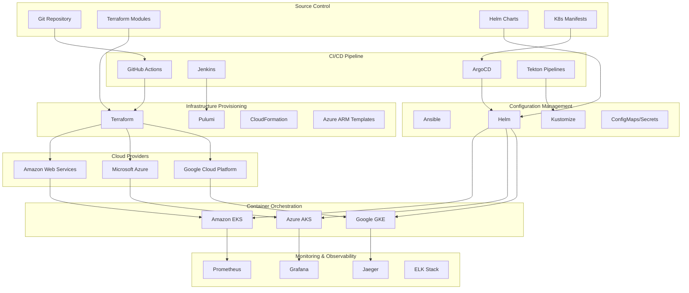

# Deployment and Infrastructure as Code Specifications

## Overview
This document outlines comprehensive deployment strategies and Infrastructure as Code (IaC) specifications for the Atlassian API Gateway, covering multi-cloud deployments, CI/CD pipelines, and automated infrastructure provisioning.

## Infrastructure as Code Architecture



## Terraform Infrastructure Specifications

### 1. Multi-Cloud Provider Configuration
```hcl
# providers.tf
terraform {
  required_version = ">= 1.0"
  required_providers {
    aws = {
      source  = "hashicorp/aws"
      version = "~> 5.0"
    }
    azurerm = {
      source  = "hashicorp/azurerm"
      version = "~> 3.0"
    }
    google = {
      source  = "hashicorp/google"
      version = "~> 4.0"
    }
    kubernetes = {
      source  = "hashicorp/kubernetes"
      version = "~> 2.0"
    }
    helm = {
      source  = "hashicorp/helm"
      version = "~> 2.0"
    }
  }
  
  backend "s3" {
    bucket         = "atlassian-api-gateway-terraform-state"
    key            = "infrastructure/terraform.tfstate"
    region         = "us-west-2"
    encrypt        = true
    dynamodb_table = "terraform-state-lock"
  }
}

# AWS Provider
provider "aws" {
  region = var.aws_region
  
  default_tags {
    tags = {
      Project     = "atlassian-api-gateway"
      Environment = var.environment
      ManagedBy   = "terraform"
      Owner       = "platform-team"
    }
  }
}

# Azure Provider
provider "azurerm" {
  features {
    resource_group {
      prevent_deletion_if_contains_resources = false
    }
  }
  
  subscription_id = var.azure_subscription_id
}

# Google Cloud Provider
provider "google" {
  project = var.gcp_project_id
  region  = var.gcp_region
}

# Kubernetes Provider
provider "kubernetes" {
  host                   = module.eks.cluster_endpoint
  cluster_ca_certificate = base64decode(module.eks.cluster_certificate_authority_data)
  token                  = data.aws_eks_cluster_auth.cluster.token
}

# Helm Provider
provider "helm" {
  kubernetes {
    host                   = module.eks.cluster_endpoint
    cluster_ca_certificate = base64decode(module.eks.cluster_certificate_authority_data)
    token                  = data.aws_eks_cluster_auth.cluster.token
  }
}
```

### 2. AWS Infrastructure Module
```hcl
# modules/aws-infrastructure/main.tf
module "vpc" {
  source = "terraform-aws-modules/vpc/aws"
  
  name = "${var.project_name}-vpc"
  cidr = var.vpc_cidr
  
  azs             = var.availability_zones
  private_subnets = var.private_subnet_cidrs
  public_subnets  = var.public_subnet_cidrs
  
  enable_nat_gateway = true
  enable_vpn_gateway = false
  enable_dns_hostnames = true
  enable_dns_support = true
  
  tags = var.common_tags
}

module "eks" {
  source = "terraform-aws-modules/eks/aws"
  
  cluster_name    = "${var.project_name}-cluster"
  cluster_version = var.kubernetes_version
  
  vpc_id     = module.vpc.vpc_id
  subnet_ids = module.vpc.private_subnets
  
  cluster_endpoint_private_access = true
  cluster_endpoint_public_access  = true
  cluster_endpoint_public_access_cidrs = var.allowed_cidr_blocks
  
  cluster_addons = {
    coredns = {
      resolve_conflicts = "OVERWRITE"
    }
    kube-proxy = {}
    vpc-cni = {
      resolve_conflicts = "OVERWRITE"
    }
    aws-ebs-csi-driver = {
      resolve_conflicts = "OVERWRITE"
    }
  }
  
  eks_managed_node_groups = {
    general = {
      name = "general-purpose"
      
      instance_types = ["m5.large", "m5.xlarge"]
      capacity_type  = "ON_DEMAND"
      
      min_size     = 3
      max_size     = 20
      desired_size = 5
      
      labels = {
        node-type = "general"
        workload  = "api-gateway"
      }
      
      taints = []
      
      update_config = {
        max_unavailable_percentage = 25
      }
    }
    
    compute_optimized = {
      name = "compute-optimized"
      
      instance_types = ["c5.large", "c5.xlarge"]
      capacity_type  = "SPOT"
      
      min_size     = 0
      max_size     = 10
      desired_size = 0
      
      labels = {
        node-type = "compute-optimized"
        workload  = "high-cpu"
      }
      
      taints = [
        {
          key    = "workload"
          value  = "high-cpu"
          effect = "NO_SCHEDULE"
        }
      ]
    }
  }
  
  tags = var.common_tags
}

# Application Load Balancer
resource "aws_lb" "api_gateway" {
  name               = "${var.project_name}-alb"
  internal           = false
  load_balancer_type = "application"
  security_groups    = [aws_security_group.alb.id]
  subnets            = module.vpc.public_subnets
  
  enable_deletion_protection = var.environment == "production"
  
  access_logs {
    bucket  = aws_s3_bucket.alb_logs.bucket
    prefix  = "alb-logs"
    enabled = true
  }
  
  tags = var.common_tags
}

# RDS for PostgreSQL
module "rds" {
  source = "terraform-aws-modules/rds/aws"
  
  identifier = "${var.project_name}-postgres"
  
  engine            = "postgres"
  engine_version    = "14.9"
  instance_class    = var.rds_instance_class
  allocated_storage = var.rds_allocated_storage
  
  db_name  = var.database_name
  username = var.database_username
  password = var.database_password
  
  vpc_security_group_ids = [aws_security_group.rds.id]
  db_subnet_group_name   = module.vpc.database_subnet_group
  
  backup_retention_period = var.environment == "production" ? 30 : 7
  backup_window          = "03:00-04:00"
  maintenance_window     = "sun:04:00-sun:05:00"
  
  enabled_cloudwatch_logs_exports = ["postgresql", "upgrade"]
  
  tags = var.common_tags
}

# ElastiCache Redis Cluster
resource "aws_elasticache_replication_group" "redis" {
  replication_group_id       = "${var.project_name}-redis"
  description                = "Redis cluster for API Gateway caching"
  
  node_type                  = var.redis_node_type
  port                       = 6379
  parameter_group_name       = "default.redis7"
  
  num_cache_clusters         = var.redis_num_nodes
  automatic_failover_enabled = true
  multi_az_enabled          = true
  
  subnet_group_name = aws_elasticache_subnet_group.redis.name
  security_group_ids = [aws_security_group.redis.id]
  
  at_rest_encryption_enabled = true
  transit_encryption_enabled = true
  auth_token                 = var.redis_auth_token
  
  log_delivery_configuration {
    destination      = aws_cloudwatch_log_group.redis_slow.name
    destination_type = "cloudwatch-logs"
    log_format       = "text"
    log_type         = "slow-log"
  }
  
  tags = var.common_tags
}
```

### 3. Azure Infrastructure Module
```hcl
# modules/azure-infrastructure/main.tf
resource "azurerm_resource_group" "main" {
  name     = "${var.project_name}-rg"
  location = var.azure_region
  
  tags = var.common_tags
}

resource "azurerm_virtual_network" "main" {
  name                = "${var.project_name}-vnet"
  address_space       = [var.vnet_cidr]
  location            = azurerm_resource_group.main.location
  resource_group_name = azurerm_resource_group.main.name
  
  tags = var.common_tags
}

resource "azurerm_subnet" "aks" {
  name                 = "aks-subnet"
  resource_group_name  = azurerm_resource_group.main.name
  virtual_network_name = azurerm_virtual_network.main.name
  address_prefixes     = [var.aks_subnet_cidr]
}

resource "azurerm_kubernetes_cluster" "main" {
  name                = "${var.project_name}-aks"
  location            = azurerm_resource_group.main.location
  resource_group_name = azurerm_resource_group.main.name
  dns_prefix          = "${var.project_name}-aks"
  kubernetes_version  = var.kubernetes_version
  
  default_node_pool {
    name       = "default"
    node_count = var.aks_node_count
    vm_size    = var.aks_vm_size
    vnet_subnet_id = azurerm_subnet.aks.id
    
    enable_auto_scaling = true
    min_count          = 3
    max_count          = 20
    
    node_labels = {
      "node-type" = "general"
      "workload"  = "api-gateway"
    }
  }
  
  identity {
    type = "SystemAssigned"
  }
  
  network_profile {
    network_plugin    = "azure"
    load_balancer_sku = "standard"
  }
  
  addon_profile {
    oms_agent {
      enabled                    = true
      log_analytics_workspace_id = azurerm_log_analytics_workspace.main.id
    }
    
    azure_policy {
      enabled = true
    }
    
    http_application_routing {
      enabled = false
    }
  }
  
  tags = var.common_tags
}

# Azure Database for PostgreSQL
resource "azurerm_postgresql_flexible_server" "main" {
  name                   = "${var.project_name}-postgres"
  resource_group_name    = azurerm_resource_group.main.name
  location               = azurerm_resource_group.main.location
  version                = "14"
  administrator_login    = var.database_username
  administrator_password = var.database_password
  
  storage_mb = var.postgres_storage_mb
  sku_name   = var.postgres_sku_name
  
  backup_retention_days        = var.environment == "production" ? 30 : 7
  geo_redundant_backup_enabled = var.environment == "production"
  
  high_availability {
    mode = var.environment == "production" ? "ZoneRedundant" : "Disabled"
  }
  
  tags = var.common_tags
}

# Azure Cache for Redis
resource "azurerm_redis_cache" "main" {
  name                = "${var.project_name}-redis"
  location            = azurerm_resource_group.main.location
  resource_group_name = azurerm_resource_group.main.name
  capacity            = var.redis_capacity
  family              = var.redis_family
  sku_name            = var.redis_sku_name
  
  enable_non_ssl_port = false
  minimum_tls_version = "1.2"
  
  redis_configuration {
    enable_authentication = true
  }
  
  tags = var.common_tags
}
```

### 4. Google Cloud Infrastructure Module
```hcl
# modules/gcp-infrastructure/main.tf
resource "google_project_service" "required_apis" {
  for_each = toset([
    "container.googleapis.com",
    "compute.googleapis.com",
    "sqladmin.googleapis.com",
    "redis.googleapis.com",
    "monitoring.googleapis.com",
    "logging.googleapis.com"
  ])
  
  project = var.gcp_project_id
  service = each.value
  
  disable_dependent_services = true
}

resource "google_compute_network" "main" {
  name                    = "${var.project_name}-vpc"
  auto_create_subnetworks = false
  
  depends_on = [google_project_service.required_apis]
}

resource "google_compute_subnetwork" "gke" {
  name          = "${var.project_name}-gke-subnet"
  ip_cidr_range = var.gke_subnet_cidr
  region        = var.gcp_region
  network       = google_compute_network.main.id
  
  secondary_ip_range {
    range_name    = "gke-pods"
    ip_cidr_range = var.gke_pods_cidr
  }
  
  secondary_ip_range {
    range_name    = "gke-services"
    ip_cidr_range = var.gke_services_cidr
  }
}

resource "google_container_cluster" "main" {
  name     = "${var.project_name}-gke"
  location = var.gcp_region
  
  remove_default_node_pool = true
  initial_node_count       = 1
  
  network    = google_compute_network.main.id
  subnetwork = google_compute_subnetwork.gke.id
  
  ip_allocation_policy {
    cluster_secondary_range_name  = "gke-pods"
    services_secondary_range_name = "gke-services"
  }
  
  master_auth {
    client_certificate_config {
      issue_client_certificate = false
    }
  }
  
  addons_config {
    http_load_balancing {
      disabled = false
    }
    
    horizontal_pod_autoscaling {
      disabled = false
    }
    
    network_policy_config {
      disabled = false
    }
  }
  
  network_policy {
    enabled = true
  }
  
  depends_on = [google_project_service.required_apis]
}

resource "google_container_node_pool" "general" {
  name       = "general-pool"
  location   = var.gcp_region
  cluster    = google_container_cluster.main.name
  node_count = var.gke_node_count
  
  autoscaling {
    min_node_count = 3
    max_node_count = 20
  }
  
  node_config {
    preemptible  = false
    machine_type = var.gke_machine_type
    
    labels = {
      node-type = "general"
      workload  = "api-gateway"
    }
    
    oauth_scopes = [
      "https://www.googleapis.com/auth/logging.write",
      "https://www.googleapis.com/auth/monitoring",
      "https://www.googleapis.com/auth/devstorage.read_only"
    ]
  }
  
  management {
    auto_repair  = true
    auto_upgrade = true
  }
}

# Cloud SQL PostgreSQL
resource "google_sql_database_instance" "main" {
  name             = "${var.project_name}-postgres"
  database_version = "POSTGRES_14"
  region           = var.gcp_region
  
  settings {
    tier = var.cloudsql_tier
    
    backup_configuration {
      enabled                        = true
      start_time                     = "03:00"
      point_in_time_recovery_enabled = true
      backup_retention_settings {
        retained_backups = var.environment == "production" ? 30 : 7
      }
    }
    
    ip_configuration {
      ipv4_enabled    = false
      private_network = google_compute_network.main.id
    }
    
    database_flags {
      name  = "log_statement"
      value = "all"
    }
  }
  
  depends_on = [google_project_service.required_apis]
}

# Memorystore Redis
resource "google_redis_instance" "main" {
  name           = "${var.project_name}-redis"
  tier           = var.redis_tier
  memory_size_gb = var.redis_memory_size
  region         = var.gcp_region
  
  authorized_network = google_compute_network.main.id
  
  redis_version     = "REDIS_7_0"
  display_name      = "${var.project_name} Redis Cache"
  
  auth_enabled      = true
  transit_encryption_mode = "SERVER_AUTHENTICATION"
  
  depends_on = [google_project_service.required_apis]
}
```

## Kubernetes Deployment Specifications

### 1. Helm Chart Structure
```yaml
# Chart.yaml
apiVersion: v2
name: atlassian-api-gateway
description: Atlassian API Gateway Helm Chart
type: application
version: 1.0.0
appVersion: "1.0.0"

dependencies:
  - name: redis
    version: "17.3.7"
    repository: "https://charts.bitnami.com/bitnami"
    condition: redis.enabled
    
  - name: postgresql
    version: "12.1.2"
    repository: "https://charts.bitnami.com/bitnami"
    condition: postgresql.enabled
    
  - name: prometheus
    version: "15.18.0"
    repository: "https://prometheus-community.github.io/helm-charts"
    condition: monitoring.prometheus.enabled
    
  - name: grafana
    version: "6.50.7"
    repository: "https://grafana.github.io/helm-charts"
    condition: monitoring.grafana.enabled

maintainers:
  - name: Platform Team
    email: platform-team@company.com
```

### 2. API Gateway Deployment
```yaml
# templates/deployment.yaml
apiVersion: apps/v1
kind: Deployment
metadata:
  name: {{ include "api-gateway.fullname" . }}
  labels:
    {{- include "api-gateway.labels" . | nindent 4 }}
spec:
  replicas: {{ .Values.replicaCount }}
  selector:
    matchLabels:
      {{- include "api-gateway.selectorLabels" . | nindent 6 }}
  template:
    metadata:
      annotations:
        checksum/config: {{ include (print $.Template.BasePath "/configmap.yaml") . | sha256sum }}
        prometheus.io/scrape: "true"
        prometheus.io/port: "8080"
        prometheus.io/path: "/metrics"
      labels:
        {{- include "api-gateway.selectorLabels" . | nindent 8 }}
    spec:
      serviceAccountName: {{ include "api-gateway.serviceAccountName" . }}
      securityContext:
        {{- toYaml .Values.podSecurityContext | nindent 8 }}
      containers:
        - name: {{ .Chart.Name }}
          securityContext:
            {{- toYaml .Values.securityContext | nindent 12 }}
          image: "{{ .Values.image.repository }}:{{ .Values.image.tag | default .Chart.AppVersion }}"
          imagePullPolicy: {{ .Values.image.pullPolicy }}
          ports:
            - name: http
              containerPort: 8080
              protocol: TCP
            - name: metrics
              containerPort: 9090
              protocol: TCP
          livenessProbe:
            httpGet:
              path: /health/live
              port: http
            initialDelaySeconds: 30
            periodSeconds: 10
            timeoutSeconds: 5
            failureThreshold: 3
          readinessProbe:
            httpGet:
              path: /health/ready
              port: http
            initialDelaySeconds: 5
            periodSeconds: 5
            timeoutSeconds: 3
            failureThreshold: 3
          resources:
            {{- toYaml .Values.resources | nindent 12 }}
          env:
            - name: SPRING_PROFILES_ACTIVE
              value: {{ .Values.environment }}
            - name: SERVER_PORT
              value: "8080"
            - name: MANAGEMENT_SERVER_PORT
              value: "9090"
            - name: REDIS_HOST
              value: {{ include "api-gateway.redis.host" . }}
            - name: REDIS_PORT
              value: {{ include "api-gateway.redis.port" . | quote }}
            - name: REDIS_PASSWORD
              valueFrom:
                secretKeyRef:
                  name: {{ include "api-gateway.redis.secretName" . }}
                  key: redis-password
            - name: DATABASE_URL
              valueFrom:
                secretKeyRef:
                  name: {{ include "api-gateway.database.secretName" . }}
                  key: database-url
            - name: DATABASE_USERNAME
              valueFrom:
                secretKeyRef:
                  name: {{ include "api-gateway.database.secretName" . }}
                  key: database-username
            - name: DATABASE_PASSWORD
              valueFrom:
                secretKeyRef:
                  name: {{ include "api-gateway.database.secretName" . }}
                  key: database-password
          volumeMounts:
            - name: config
              mountPath: /app/config
              readOnly: true
            - name: secrets
              mountPath: /app/secrets
              readOnly: true
      volumes:
        - name: config
          configMap:
            name: {{ include "api-gateway.fullname" . }}-config
        - name: secrets
          secret:
            secretName: {{ include "api-gateway.fullname" . }}-secrets
      {{- with .Values.nodeSelector }}
      nodeSelector:
        {{- toYaml . | nindent 8 }}
      {{- end }}
      {{- with .Values.affinity }}
      affinity:
        {{- toYaml . | nindent 8 }}
      {{- end }}
      {{- with .Values.tolerations }}
      tolerations:
        {{- toYaml . | nindent 8 }}
      {{- end }}
```

### 3. Service and Ingress Configuration
```yaml
# templates/service.yaml
apiVersion: v1
kind: Service
metadata:
  name: {{ include "api-gateway.fullname" . }}
  labels:
    {{- include "api-gateway.labels" . | nindent 4 }}
spec:
  type: {{ .Values.service.type }}
  ports:
    - port: {{ .Values.service.port }}
      targetPort: http
      protocol: TCP
      name: http
    - port: {{ .Values.service.metricsPort }}
      targetPort: metrics
      protocol: TCP
      name: metrics
  selector:
    {{- include "api-gateway.selectorLabels" . | nindent 4 }}

---
# templates/ingress.yaml
{{- if .Values.ingress.enabled -}}
apiVersion: networking.k8s.io/v1
kind: Ingress
metadata:
  name: {{ include "api-gateway.fullname" . }}
  labels:
    {{- include "api-gateway.labels" . | nindent 4 }}
  {{- with .Values.ingress.annotations }}
  annotations:
    {{- toYaml . | nindent 4 }}
  {{- end }}
spec:
  {{- if .Values.ingress.tls }}
  tls:
    {{- range .Values.ingress.tls }}
    - hosts:
        {{- range .hosts }}
        - {{ . | quote }}
        {{- end }}
      secretName: {{ .secretName }}
    {{- end }}
  {{- end }}
  rules:
    {{- range .Values.ingress.hosts }}
    - host: {{ .host | quote }}
      http:
        paths:
          {{- range .paths }}
          - path: {{ .path }}
            pathType: {{ .pathType }}
            backend:
              service:
                name: {{ include "api-gateway.fullname" $ }}
                port:
                  number: {{ $.Values.service.port }}
          {{- end }}
    {{- end }}
{{- end }}
```

### 4. Horizontal Pod Autoscaler
```yaml
# templates/hpa.yaml
{{- if .Values.autoscaling.enabled }}
apiVersion: autoscaling/v2
kind: HorizontalPodAutoscaler
metadata:
  name: {{ include "api-gateway.fullname" . }}
  labels:
    {{- include "api-gateway.labels" . | nindent 4 }}
spec:
  scaleTargetRef:
    apiVersion: apps/v1
    kind: Deployment
    name: {{ include "api-gateway.fullname" . }}
  minReplicas: {{ .Values.autoscaling.minReplicas }}
  maxReplicas: {{ .Values.autoscaling.maxReplicas }}
  metrics:
    {{- if .Values.autoscaling.targetCPUUtilizationPercentage }}
    - type: Resource
      resource:
        name: cpu
        target:
          type: Utilization
          averageUtilization: {{ .Values.autoscaling.targetCPUUtilizationPercentage }}
    {{- end }}
    {{- if .Values.autoscaling.targetMemoryUtilizationPercentage }}
    - type: Resource
      resource:
        name: memory
        target:
          type: Utilization
          averageUtilization: {{ .Values.autoscaling.targetMemoryUtilizationPercentage }}
    {{- end }}
    {{- if .Values.autoscaling.customMetrics }}
    {{- range .Values.autoscaling.customMetrics }}
    - type: Pods
      pods:
        metric:
          name: {{ .name }}
        target:
          type: AverageValue
          averageValue: {{ .targetValue }}
    {{- end }}
    {{- end }}
  behavior:
    scaleUp:
      stabilizationWindowSeconds: {{ .Values.autoscaling.behavior.scaleUp.stabilizationWindowSeconds | default 60 }}
      policies:
        - type: Percent
          value: {{ .Values.autoscaling.behavior.scaleUp.percentPolicy | default 100 }}
          periodSeconds: {{ .Values.autoscaling.behavior.scaleUp.periodSeconds | default 60 }}
        - type: Pods
          value: {{ .Values.autoscaling.behavior.scaleUp.podsPolicy | default 5 }}
          periodSeconds: {{ .Values.autoscaling.behavior.scaleUp.periodSeconds | default 60 }}
      selectPolicy: Max
    scaleDown:
      stabilizationWindowSeconds: {{ .Values.autoscaling.behavior.scaleDown.stabilizationWindowSeconds | default 300 }}
      policies:
        - type: Percent
          value: {{ .Values.autoscaling.behavior.scaleDown.percentPolicy | default 10 }}
          periodSeconds: {{ .Values.autoscaling.behavior.scaleDown.periodSeconds | default 60 }}
        - type: Pods
          value: {{ .Values.autoscaling.behavior.scaleDown.podsPolicy | default 2 }}
          periodSeconds: {{ .Values.autoscaling.behavior.scaleDown.periodSeconds | default 60 }}
      selectPolicy: Min
{{- end }}
```

## CI/CD Pipeline Specifications

### 1. GitHub Actions Workflow
```yaml
# .github/workflows/ci-cd.yml
name: CI/CD Pipeline

on:
  push:
    branches: [main, develop]
  pull_request:
    branches: [main]

env:
  REGISTRY: ghcr.io
  IMAGE_NAME: ${{ github.repository }}

jobs:
  test:
    runs-on: ubuntu-latest
    steps:
      - name: Checkout code
        uses: actions/checkout@v4
        
      - name: Set up JDK 17
        uses: actions/setup-java@v3
        with:
          java-version: '17'
          distribution: 'temurin'
          
      - name: Cache Maven dependencies
        uses: actions/cache@v3
        with:
          path: ~/.m2
          key: ${{ runner.os }}-m2-${{ hashFiles('**/pom.xml') }}
          restore-keys: ${{ runner.os }}-m2
          
      - name: Run tests
        run: mvn clean test
        
      - name: Run integration tests
        run: mvn verify -P integration-tests
        
      - name: Generate test report
        uses: dorny/test-reporter@v1
        if: success() || failure()
        with:
          name: Maven Tests
          path: target/surefire-reports/*.xml
          reporter: java-junit
          
      - name: Upload coverage to Codecov
        uses: codecov/codecov-action@v3
        with:
          file: target/site/jacoco/jacoco.xml

  security-scan:
    runs-on: ubuntu-latest
    steps:
      - name: Checkout code
        uses: actions/checkout@v4
        
      - name: Run Trivy vulnerability scanner
        uses: aquas
ecurity/trivy-action@master
        with:
          scan-type: 'fs'
          scan-ref: '.'
          format: 'sarif'
          output: 'trivy-results.sarif'
          
      - name: Upload Trivy scan results to GitHub Security tab
        uses: github/codeql-action/upload-sarif@v2
        with:
          sarif_file: 'trivy-results.sarif'
          
      - name: Run OWASP Dependency Check
        uses: dependency-check/Dependency-Check_Action@main
        with:
          project: 'atlassian-api-gateway'
          path: '.'
          format: 'ALL'
          
      - name: Upload OWASP results
        uses: actions/upload-artifact@v3
        with:
          name: dependency-check-report
          path: reports/

  build-and-push:
    needs: [test, security-scan]
    runs-on: ubuntu-latest
    permissions:
      contents: read
      packages: write
    steps:
      - name: Checkout code
        uses: actions/checkout@v4
        
      - name: Set up Docker Buildx
        uses: docker/setup-buildx-action@v3
        
      - name: Log in to Container Registry
        uses: docker/login-action@v3
        with:
          registry: ${{ env.REGISTRY }}
          username: ${{ github.actor }}
          password: ${{ secrets.GITHUB_TOKEN }}
          
      - name: Extract metadata
        id: meta
        uses: docker/metadata-action@v5
        with:
          images: ${{ env.REGISTRY }}/${{ env.IMAGE_NAME }}
          tags: |
            type=ref,event=branch
            type=ref,event=pr
            type=sha,prefix={{branch}}-
            type=raw,value=latest,enable={{is_default_branch}}
            
      - name: Build and push Docker image
        uses: docker/build-push-action@v5
        with:
          context: .
          platforms: linux/amd64,linux/arm64
          push: true
          tags: ${{ steps.meta.outputs.tags }}
          labels: ${{ steps.meta.outputs.labels }}
          cache-from: type=gha
          cache-to: type=gha,mode=max

  deploy-staging:
    needs: build-and-push
    runs-on: ubuntu-latest
    if: github.ref == 'refs/heads/develop'
    environment: staging
    steps:
      - name: Checkout code
        uses: actions/checkout@v4
        
      - name: Configure AWS credentials
        uses: aws-actions/configure-aws-credentials@v4
        with:
          aws-access-key-id: ${{ secrets.AWS_ACCESS_KEY_ID }}
          aws-secret-access-key: ${{ secrets.AWS_SECRET_ACCESS_KEY }}
          aws-region: us-west-2
          
      - name: Update kubeconfig
        run: aws eks update-kubeconfig --name atlassian-api-gateway-staging-cluster
        
      - name: Deploy to staging
        run: |
          helm upgrade --install api-gateway ./helm/api-gateway \
            --namespace staging \
            --create-namespace \
            --values ./helm/api-gateway/values-staging.yaml \
            --set image.tag=${{ github.sha }} \
            --wait --timeout=10m
            
      - name: Run smoke tests
        run: |
          kubectl wait --for=condition=ready pod -l app.kubernetes.io/name=api-gateway -n staging --timeout=300s
          ./scripts/smoke-tests.sh staging

  deploy-production:
    needs: build-and-push
    runs-on: ubuntu-latest
    if: github.ref == 'refs/heads/main'
    environment: production
    steps:
      - name: Checkout code
        uses: actions/checkout@v4
        
      - name: Configure AWS credentials
        uses: aws-actions/configure-aws-credentials@v4
        with:
          aws-access-key-id: ${{ secrets.AWS_ACCESS_KEY_ID }}
          aws-secret-access-key: ${{ secrets.AWS_SECRET_ACCESS_KEY }}
          aws-region: us-west-2
          
      - name: Update kubeconfig
        run: aws eks update-kubeconfig --name atlassian-api-gateway-production-cluster
        
      - name: Deploy to production (Blue-Green)
        run: |
          # Deploy to green environment
          helm upgrade --install api-gateway-green ./helm/api-gateway \
            --namespace production-green \
            --create-namespace \
            --values ./helm/api-gateway/values-production.yaml \
            --set image.tag=${{ github.sha }} \
            --set service.name=api-gateway-green \
            --wait --timeout=15m
            
          # Run health checks
          ./scripts/health-check.sh production-green
          
          # Switch traffic (this would be done via load balancer configuration)
          ./scripts/switch-traffic.sh blue green
          
          # Clean up old blue environment after successful deployment
          sleep 300  # Wait 5 minutes for traffic to stabilize
          helm uninstall api-gateway-blue --namespace production-blue || true

  infrastructure-deploy:
    runs-on: ubuntu-latest
    if: github.ref == 'refs/heads/main' && contains(github.event.head_commit.message, '[deploy-infra]')
    steps:
      - name: Checkout code
        uses: actions/checkout@v4
        
      - name: Setup Terraform
        uses: hashicorp/setup-terraform@v3
        with:
          terraform_version: 1.6.0
          
      - name: Configure AWS credentials
        uses: aws-actions/configure-aws-credentials@v4
        with:
          aws-access-key-id: ${{ secrets.AWS_ACCESS_KEY_ID }}
          aws-secret-access-key: ${{ secrets.AWS_SECRET_ACCESS_KEY }}
          aws-region: us-west-2
          
      - name: Terraform Init
        run: terraform init
        working-directory: ./terraform
        
      - name: Terraform Plan
        run: terraform plan -var-file="production.tfvars" -out=tfplan
        working-directory: ./terraform
        
      - name: Terraform Apply
        run: terraform apply tfplan
        working-directory: ./terraform
```

### 2. Jenkins Pipeline
```groovy
// Jenkinsfile
pipeline {
    agent {
        kubernetes {
            yaml """
                apiVersion: v1
                kind: Pod
                spec:
                  containers:
                  - name: maven
                    image: maven:3.8.6-openjdk-17
                    command:
                    - cat
                    tty: true
                    volumeMounts:
                    - name: docker-sock
                      mountPath: /var/run/docker.sock
                  - name: docker
                    image: docker:20.10.17-dind
                    securityContext:
                      privileged: true
                    volumeMounts:
                    - name: docker-sock
                      mountPath: /var/run/docker.sock
                  - name: kubectl
                    image: bitnami/kubectl:latest
                    command:
                    - cat
                    tty: true
                  - name: helm
                    image: alpine/helm:latest
                    command:
                    - cat
                    tty: true
                  volumes:
                  - name: docker-sock
                    hostPath:
                      path: /var/run/docker.sock
            """
        }
    }
    
    environment {
        DOCKER_REGISTRY = 'your-registry.com'
        IMAGE_NAME = 'atlassian-api-gateway'
        KUBECONFIG = credentials('kubeconfig')
        DOCKER_CREDENTIALS = credentials('docker-registry-credentials')
    }
    
    stages {
        stage('Checkout') {
            steps {
                checkout scm
            }
        }
        
        stage('Test') {
            parallel {
                stage('Unit Tests') {
                    steps {
                        container('maven') {
                            sh 'mvn clean test'
                        }
                    }
                    post {
                        always {
                            publishTestResults testResultsPattern: 'target/surefire-reports/*.xml'
                            publishCoverage adapters: [jacocoAdapter('target/site/jacoco/jacoco.xml')]
                        }
                    }
                }
                
                stage('Integration Tests') {
                    steps {
                        container('maven') {
                            sh 'mvn verify -P integration-tests'
                        }
                    }
                }
                
                stage('Security Scan') {
                    steps {
                        container('maven') {
                            sh 'mvn org.owasp:dependency-check-maven:check'
                        }
                    }
                    post {
                        always {
                            publishHTML([
                                allowMissing: false,
                                alwaysLinkToLastBuild: true,
                                keepAll: true,
                                reportDir: 'target',
                                reportFiles: 'dependency-check-report.html',
                                reportName: 'OWASP Dependency Check Report'
                            ])
                        }
                    }
                }
            }
        }
        
        stage('Build') {
            steps {
                container('maven') {
                    sh 'mvn clean package -DskipTests'
                }
            }
        }
        
        stage('Docker Build & Push') {
            steps {
                container('docker') {
                    script {
                        def imageTag = "${env.BUILD_NUMBER}-${env.GIT_COMMIT.take(7)}"
                        def fullImageName = "${DOCKER_REGISTRY}/${IMAGE_NAME}:${imageTag}"
                        
                        sh "docker build -t ${fullImageName} ."
                        
                        withCredentials([usernamePassword(credentialsId: 'docker-registry-credentials', 
                                                        usernameVariable: 'DOCKER_USER', 
                                                        passwordVariable: 'DOCKER_PASS')]) {
                            sh "echo \$DOCKER_PASS | docker login ${DOCKER_REGISTRY} -u \$DOCKER_USER --password-stdin"
                            sh "docker push ${fullImageName}"
                        }
                        
                        env.IMAGE_TAG = imageTag
                    }
                }
            }
        }
        
        stage('Deploy to Staging') {
            when {
                branch 'develop'
            }
            steps {
                container('helm') {
                    sh """
                        helm upgrade --install api-gateway-staging ./helm/api-gateway \\
                            --namespace staging \\
                            --create-namespace \\
                            --values ./helm/api-gateway/values-staging.yaml \\
                            --set image.tag=${env.IMAGE_TAG} \\
                            --wait --timeout=10m
                    """
                }
            }
        }
        
        stage('Deploy to Production') {
            when {
                branch 'main'
            }
            steps {
                script {
                    def deployApproval = input(
                        message: 'Deploy to Production?',
                        parameters: [
                            choice(choices: ['Deploy', 'Abort'], description: 'Choose action', name: 'ACTION')
                        ]
                    )
                    
                    if (deployApproval == 'Deploy') {
                        container('helm') {
                            sh """
                                helm upgrade --install api-gateway-production ./helm/api-gateway \\
                                    --namespace production \\
                                    --create-namespace \\
                                    --values ./helm/api-gateway/values-production.yaml \\
                                    --set image.tag=${env.IMAGE_TAG} \\
                                    --wait --timeout=15m
                            """
                        }
                    }
                }
            }
        }
        
        stage('Post-Deployment Tests') {
            parallel {
                stage('Smoke Tests') {
                    steps {
                        container('kubectl') {
                            sh './scripts/smoke-tests.sh'
                        }
                    }
                }
                
                stage('Performance Tests') {
                    steps {
                        container('kubectl') {
                            sh './scripts/performance-tests.sh'
                        }
                    }
                }
            }
        }
    }
    
    post {
        always {
            cleanWs()
        }
        success {
            slackSend(
                channel: '#deployments',
                color: 'good',
                message: "✅ Deployment successful: ${env.JOB_NAME} - ${env.BUILD_NUMBER}"
            )
        }
        failure {
            slackSend(
                channel: '#deployments',
                color: 'danger',
                message: "❌ Deployment failed: ${env.JOB_NAME} - ${env.BUILD_NUMBER}"
            )
        }
    }
}
```

### 3. ArgoCD Application Configuration
```yaml
# argocd/application.yaml
apiVersion: argoproj.io/v1alpha1
kind: Application
metadata:
  name: atlassian-api-gateway
  namespace: argocd
  finalizers:
    - resources-finalizer.argocd.argoproj.io
spec:
  project: default
  source:
    repoURL: https://github.com/company/atlassian-api-gateway
    targetRevision: main
    path: helm/api-gateway
    helm:
      valueFiles:
        - values-production.yaml
      parameters:
        - name: image.tag
          value: "latest"
        - name: replicaCount
          value: "5"
  destination:
    server: https://kubernetes.default.svc
    namespace: production
  syncPolicy:
    automated:
      prune: true
      selfHeal: true
      allowEmpty: false
    syncOptions:
      - CreateNamespace=true
      - PrunePropagationPolicy=foreground
      - PruneLast=true
    retry:
      limit: 5
      backoff:
        duration: 5s
        factor: 2
        maxDuration: 3m
  revisionHistoryLimit: 10

---
# argocd/app-of-apps.yaml
apiVersion: argoproj.io/v1alpha1
kind: Application
metadata:
  name: atlassian-api-gateway-apps
  namespace: argocd
spec:
  project: default
  source:
    repoURL: https://github.com/company/atlassian-api-gateway
    targetRevision: main
    path: argocd/applications
  destination:
    server: https://kubernetes.default.svc
    namespace: argocd
  syncPolicy:
    automated:
      prune: true
      selfHeal: true
```

## Configuration Management

### 1. Environment-Specific Values
```yaml
# helm/api-gateway/values-production.yaml
replicaCount: 5

image:
  repository: ghcr.io/company/atlassian-api-gateway
  pullPolicy: IfNotPresent
  tag: "latest"

service:
  type: ClusterIP
  port: 80
  metricsPort: 9090

ingress:
  enabled: true
  className: "nginx"
  annotations:
    nginx.ingress.kubernetes.io/rewrite-target: /
    nginx.ingress.kubernetes.io/ssl-redirect: "true"
    nginx.ingress.kubernetes.io/force-ssl-redirect: "true"
    cert-manager.io/cluster-issuer: "letsencrypt-prod"
  hosts:
    - host: api.company.com
      paths:
        - path: /
          pathType: Prefix
  tls:
    - secretName: api-gateway-tls
      hosts:
        - api.company.com

resources:
  limits:
    cpu: 2000m
    memory: 4Gi
  requests:
    cpu: 1000m
    memory: 2Gi

autoscaling:
  enabled: true
  minReplicas: 5
  maxReplicas: 50
  targetCPUUtilizationPercentage: 70
  targetMemoryUtilizationPercentage: 80
  customMetrics:
    - name: http_requests_per_second
      targetValue: "100"
  behavior:
    scaleUp:
      stabilizationWindowSeconds: 60
      percentPolicy: 100
      podsPolicy: 5
      periodSeconds: 60
    scaleDown:
      stabilizationWindowSeconds: 300
      percentPolicy: 10
      podsPolicy: 2
      periodSeconds: 60

nodeSelector:
  node-type: general

tolerations: []

affinity:
  podAntiAffinity:
    preferredDuringSchedulingIgnoredDuringExecution:
      - weight: 100
        podAffinityTerm:
          labelSelector:
            matchExpressions:
              - key: app.kubernetes.io/name
                operator: In
                values:
                  - api-gateway
          topologyKey: kubernetes.io/hostname

podSecurityContext:
  fsGroup: 2000
  runAsNonRoot: true
  runAsUser: 1000

securityContext:
  allowPrivilegeEscalation: false
  capabilities:
    drop:
      - ALL
  readOnlyRootFilesystem: true
  runAsNonRoot: true
  runAsUser: 1000

# External dependencies
redis:
  enabled: false  # Using external Redis
  external:
    host: "atlassian-api-gateway-redis.cache.amazonaws.com"
    port: 6379
    auth:
      enabled: true
      existingSecret: "redis-credentials"
      existingSecretPasswordKey: "password"

postgresql:
  enabled: false  # Using external PostgreSQL
  external:
    host: "atlassian-api-gateway-postgres.rds.amazonaws.com"
    port: 5432
    database: "api_gateway"
    auth:
      existingSecret: "postgres-credentials"
      secretKeys:
        adminPasswordKey: "password"
        userPasswordKey: "password"

monitoring:
  prometheus:
    enabled: true
    serviceMonitor:
      enabled: true
      interval: 30s
      path: /metrics
      port: metrics
  grafana:
    enabled: true
    dashboards:
      enabled: true
```

### 2. Staging Environment Values
```yaml
# helm/api-gateway/values-staging.yaml
replicaCount: 2

image:
  repository: ghcr.io/company/atlassian-api-gateway
  pullPolicy: Always
  tag: "develop"

service:
  type: ClusterIP
  port: 80

ingress:
  enabled: true
  className: "nginx"
  annotations:
    nginx.ingress.kubernetes.io/rewrite-target: /
    cert-manager.io/cluster-issuer: "letsencrypt-staging"
  hosts:
    - host: api-staging.company.com
      paths:
        - path: /
          pathType: Prefix
  tls:
    - secretName: api-gateway-staging-tls
      hosts:
        - api-staging.company.com

resources:
  limits:
    cpu: 1000m
    memory: 2Gi
  requests:
    cpu: 500m
    memory: 1Gi

autoscaling:
  enabled: true
  minReplicas: 2
  maxReplicas: 10
  targetCPUUtilizationPercentage: 70

nodeSelector:
  node-type: general

redis:
  enabled: true  # Using in-cluster Redis for staging
  auth:
    enabled: true
    password: "staging-redis-password"

postgresql:
  enabled: true  # Using in-cluster PostgreSQL for staging
  auth:
    postgresPassword: "staging-postgres-password"
    database: "api_gateway_staging"

monitoring:
  prometheus:
    enabled: true
  grafana:
    enabled: true
```

## Deployment Scripts and Automation

### 1. Deployment Scripts
```bash
#!/bin/bash
# scripts/deploy.sh

set -euo pipefail

ENVIRONMENT=${1:-staging}
IMAGE_TAG=${2:-latest}
NAMESPACE=${ENVIRONMENT}

echo "Deploying API Gateway to ${ENVIRONMENT} environment..."

# Validate environment
if [[ ! "${ENVIRONMENT}" =~ ^(staging|production)$ ]]; then
    echo "Error: Environment must be 'staging' or 'production'"
    exit 1
fi

# Set kubectl context
kubectl config use-context "${ENVIRONMENT}-cluster"

# Create namespace if it doesn't exist
kubectl create namespace "${NAMESPACE}" --dry-run=client -o yaml | kubectl apply -f -

# Deploy using Helm
helm upgrade --install "api-gateway-${ENVIRONMENT}" ./helm/api-gateway \
    --namespace "${NAMESPACE}" \
    --values "./helm/api-gateway/values-${ENVIRONMENT}.yaml" \
    --set "image.tag=${IMAGE_TAG}" \
    --wait \
    --timeout=10m

# Wait for rollout to complete
kubectl rollout status deployment/api-gateway-${ENVIRONMENT} -n "${NAMESPACE}" --timeout=600s

# Run health checks
./scripts/health-check.sh "${ENVIRONMENT}"

echo "Deployment to ${ENVIRONMENT} completed successfully!"
```

### 2. Health Check Script
```bash
#!/bin/bash
# scripts/health-check.sh

set -euo pipefail

ENVIRONMENT=${1:-staging}
NAMESPACE=${ENVIRONMENT}
MAX_RETRIES=30
RETRY_INTERVAL=10

echo "Running health checks for ${ENVIRONMENT} environment..."

# Get service endpoint
if [[ "${ENVIRONMENT}" == "production" ]]; then
    ENDPOINT="https://api.company.com"
else
    ENDPOINT="https://api-staging.company.com"
fi

# Function to check health endpoint
check_health() {
    local url=$1
    local expected_status=${2:-200}
    
    response=$(curl -s -o /dev/null -w "%{http_code}" "${url}" || echo "000")
    
    if [[ "${response}" == "${expected_status}" ]]; then
        return 0
    else
        return 1
    fi
}

# Wait for pods to be ready
echo "Waiting for pods to be ready..."
kubectl wait --for=condition=ready pod -l app.kubernetes.io/name=api-gateway -n "${NAMESPACE}" --timeout=300s

# Check health endpoint
echo "Checking health endpoint..."
for i in $(seq 1 ${MAX_RETRIES}); do
    if check_health "${ENDPOINT}/health"; then
        echo "Health check passed!"
        break
    else
        if [[ $i -eq ${MAX_RETRIES} ]]; then
            echo "Health check failed after ${MAX_RETRIES} attempts"
            exit 1
        fi
        echo "Health check failed, retrying in ${RETRY_INTERVAL} seconds... (${i}/${MAX_RETRIES})"
        sleep ${RETRY_INTERVAL}
    fi
done

# Check metrics endpoint
echo "Checking metrics endpoint..."
if check_health "${ENDPOINT}/metrics"; then
    echo "Metrics endpoint is healthy!"
else
    echo "Warning: Metrics endpoint is not responding"
fi

# Run smoke tests
echo "Running smoke tests..."
./scripts/smoke-tests.sh "${ENVIRONMENT}"

echo "All health checks passed for ${ENVIRONMENT} environment!"
```

### 3. Rollback Script
```bash
#!/bin/bash
# scripts/rollback.sh

set -euo pipefail

ENVIRONMENT=${1:-staging}
REVISION=${2:-}
NAMESPACE=${ENVIRONMENT}

echo "Rolling back API Gateway in ${ENVIRONMENT} environment..."

# Validate environment
if [[ ! "${ENVIRONMENT}" =~ ^(staging|production)$ ]]; then
    echo "Error: Environment must be 'staging' or 'production'"
    exit 1
fi

# Set kubectl context
kubectl config use-context "${ENVIRONMENT}-cluster"

# Get rollback revision
if [[ -z "${REVISION}" ]]; then
    echo "Available revisions:"
    helm history "api-gateway-${ENVIRONMENT}" -n "${NAMESPACE}"
    read -p "Enter revision number to rollback to: " REVISION
fi

# Perform rollback
echo "Rolling back to revision ${REVISION}..."
helm rollback "api-gateway-${ENVIRONMENT}" "${REVISION}" -n "${NAMESPACE}" --wait --timeout=10m

# Wait for rollout to complete
kubectl rollout status deployment/api-gateway-${ENVIRONMENT} -n "${NAMESPACE}" --timeout=600s

# Run health checks
./scripts/health-check.sh "${ENVIRONMENT}"

echo "Rollback to revision ${REVISION} completed successfully!"
```

## Monitoring and Observability Deployment

### 1. Prometheus Configuration
```yaml
# monitoring/prometheus-config.yaml
apiVersion: v1
kind: ConfigMap
metadata:
  name: prometheus-config
  namespace: monitoring
data:
  prometheus.yml: |
    global:
      scrape_interval: 15s
      evaluation_interval: 15s
    
    rule_files:
      - "/etc/prometheus/rules/*.yml"
    
    alerting:
      alertmanagers:
        - static_configs:
            - targets:
              - alertmanager:9093
    
    scrape_configs:
      - job_name: 'api-gateway'
        kubernetes_sd_configs:
          - role: pod
            namespaces:
              names:
                - production
                - staging
        relabel_configs:
          - source_labels: [__meta_kubernetes_pod_annotation_prometheus_io_scrape]
            action: keep
            regex: true
          - source_labels: [__meta_kubernetes_pod_annotation_prometheus_io_path]
            action: replace
            target_label: __metrics_path__
            regex: (.+)
          - source_labels: [__address__, __meta_kubernetes_pod_annotation_prometheus_io_port]
            action: replace
            regex: ([^:]+)(?::\d+)?;(\d+)
            replacement: $1:$2
            target_label: __address__
          - action: labelmap
            regex: __meta_kubernetes_pod_label_(.+)
          - source_labels: [__meta_kubernetes_namespace]
            action: replace
            target_label: kubernetes_namespace
          - source_labels: [__meta_kubernetes_pod_name]
            action: replace
            target_label: kubernetes_pod_name
      
      - job_name: 'kubernetes-nodes'
        kubernetes_sd_configs:
          - role: node
        relabel_configs:
          - action: labelmap
            regex: __meta_kubernetes_node_label_(.+)
          - target_label: __address__
            replacement: kubernetes.default.svc:443
          - source_labels: [__meta_kubernetes_node_name]
            regex: (.+)
            target_label: __metrics_path__
            replacement: /api/v1/nodes/${1}/proxy/metrics
      
      - job_name: 'kubernetes-cadvisor'
        kubernetes_sd_configs:
          - role: node
        scheme: https
        tls_config:
          ca_file: /var/run/secrets/kubernetes.io/serviceaccount/ca.crt
        bearer_token_file: /var/run/secrets/kubernetes.io/serviceaccount/token
        relabel_configs:
          - action: labelmap
            regex: __meta_kubernetes_node_label_(.+)
          - target_label: __address__
            replacement: kubernetes.default.svc:443
          - source_labels: [__meta_kubernetes_node_name]
            regex: (.+)
            target_label: __metrics_path__
            replacement: /api/v1/nodes/${1}/proxy/metrics/cadvisor
```

### 2. Grafana Dashboard Deployment
```yaml
# monitoring/grafana-dashboard-configmap.yaml
apiVersion: v1
kind: ConfigMap
metadata:
  name: api-gateway-dashboard
  namespace: monitoring
  labels:
    grafana_dashboard: "1"
data:
  api-gateway-dashboard.json: |
    {
      "dashboard": {
        "id": null,
        "title": "Atlassian API Gateway",
        "tags": ["api-gateway", "atlassian"],
        "timezone": "browser",
        "panels": [
          {
            "id": 1,
            "title": "Request Rate",
            "type": "graph",
            "targets": [
              {
                "expr": "sum(rate(http_requests_total{job=\"api-gateway\"}[5m])) by (method, endpoint)",
                "legendFormat": "{{method}} {{endpoint}}"
              }
            ],
            "yAxes": [
              {
                "label": "Requests/sec"
              }
            ]
          },
          {
            "id": 2,
            "title": "Response Time",
            "type": "graph",
            "targets": [
              {
                "expr": "histogram_quantile(0.95, sum(rate(http_request_duration_seconds_bucket{job=\"api-gateway\"}[5m])) by (le))",
                "legendFormat": "95th percentile"
              },
              {
                "expr": "histogram_quantile(0.50, sum(rate(http_request_duration_seconds_bucket{job=\"api-gateway\"}[5m])) by (le))",
                "legendFormat": "50th percentile"
              }
            ],
            "yAxes": [
              {
                "label": "Seconds"
              }
            ]
          },
          {
            "id": 3,
            "title": "Error Rate",
            "type": "singlestat",
            "targets": [
              {
                "expr": "sum(rate(http_requests_total{job=\"api-gateway\",status=~\"5..\"}[5m])) / sum(rate(http_requests_total{job=\"api-gateway\"}[5m])) * 100",
                "legendFormat": "Error Rate %"
              }
            ],
            "thresholds": "1,5",
            "colorBackground": true
          }
        ],
        "time": {
          "from": "now-1h",
          "to": "now"
        },
        "refresh": "30s"
      }
    }
```

This completes the comprehensive deployment and infrastructure as code specifications for the Atlassian API Gateway, covering multi-cloud deployments, CI/CD pipelines, configuration management, and monitoring setup.