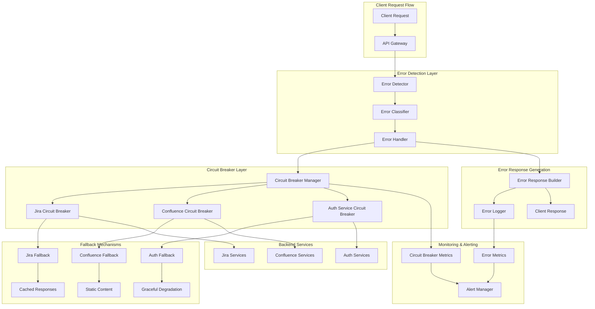

# Error Handling and Circuit Breaker Patterns

## Overview
This document outlines comprehensive error handling strategies and circuit breaker patterns for the Atlassian API Gateway, ensuring resilient operation, graceful degradation, and effective failure isolation across the distributed system.

## Error Handling Architecture



## Error Classification and Handling

### 1. Error Categories
```yaml
error_categories:
  client_errors:
    4xx_errors:
      - code: 400
        name: "BAD_REQUEST"
        description: "Invalid request format or parameters"
        retry_strategy: "no_retry"
        client_action: "fix_request"
        
      - code: 401
        name: "UNAUTHORIZED"
        description: "Authentication required or failed"
        retry_strategy: "retry_with_auth"
        client_action: "authenticate"
        
      - code: 403
        name: "FORBIDDEN"
        description: "Insufficient permissions"
        retry_strategy: "no_retry"
        client_action: "check_permissions"
        
      - code: 404
        name: "NOT_FOUND"
        description: "Resource not found"
        retry_strategy: "no_retry"
        client_action: "verify_resource_id"
        
      - code: 409
        name: "CONFLICT"
        description: "Resource conflict or version mismatch"
        retry_strategy: "conditional_retry"
        client_action: "resolve_conflict"
        
      - code: 422
        name: "UNPROCESSABLE_ENTITY"
        description: "Valid format but semantic errors"
        retry_strategy: "no_retry"
        client_action: "fix_data"
        
      - code: 429
        name: "TOO_MANY_REQUESTS"
        description: "Rate limit exceeded"
        retry_strategy: "exponential_backoff"
        client_action: "reduce_request_rate"

  server_errors:
    5xx_errors:
      - code: 500
        name: "INTERNAL_SERVER_ERROR"
        description: "Unexpected server error"
        retry_strategy: "exponential_backoff"
        circuit_breaker_trigger: true
        
      - code: 502
        name: "BAD_GATEWAY"
        description: "Invalid response from upstream"
        retry_strategy: "immediate_retry"
        circuit_breaker_trigger: true
        
      - code: 503
        name: "SERVICE_UNAVAILABLE"
        description: "Service temporarily unavailable"
        retry_strategy: "exponential_backoff"
        circuit_breaker_trigger: true
        
      - code: 504
        name: "GATEWAY_TIMEOUT"
        description: "Upstream timeout"
        retry_strategy: "exponential_backoff"
        circuit_breaker_trigger: true

  network_errors:
    connection_errors:
      - name: "CONNECTION_REFUSED"
        description: "Cannot connect to upstream service"
        retry_strategy: "exponential_backoff"
        circuit_breaker_trigger: true
        
      - name: "CONNECTION_TIMEOUT"
        description: "Connection establishment timeout"
        retry_strategy: "exponential_backoff"
        circuit_breaker_trigger: true
        
      - name: "READ_TIMEOUT"
        description: "Response read timeout"
        retry_strategy: "exponential_backoff"
        circuit_breaker_trigger: true
        
      - name: "SSL_HANDSHAKE_FAILURE"
        description: "SSL/TLS handshake failed"
        retry_strategy: "immediate_retry"
        circuit_breaker_trigger: false

  business_errors:
    jira_errors:
      - name: "ISSUE_NOT_FOUND"
        description: "Jira issue does not exist"
        retry_strategy: "no_retry"
        fallback_strategy: "return_empty_result"
        
      - name: "PROJECT_ACCESS_DENIED"
        description: "No access to Jira project"
        retry_strategy: "no_retry"
        fallback_strategy: "return_permission_error"
        
      - name: "WORKFLOW_TRANSITION_INVALID"
        description: "Invalid workflow transition"
        retry_strategy: "no_retry"
        fallback_strategy: "return_validation_error"
        
    confluence_errors:
      - name: "PAGE_NOT_FOUND"
        description: "Confluence page does not exist"
        retry_strategy: "no_retry"
        fallback_strategy: "return_empty_result"
        
      - name: "SPACE_ACCESS_DENIED"
        description: "No access to Confluence space"
        retry_strategy: "no_retry"
        fallback_strategy: "return_permission_error"
        
      - name: "CONTENT_LOCKED"
        description: "Content is locked for editing"
        retry_strategy: "conditional_retry"
        fallback_strategy: "return_lock_error"
```

### 2. Error Response Format
```yaml
error_response_format:
  standard_format:
    structure:
      error:
        code: "string"
        message: "string"
        details: "object"
        timestamp: "ISO8601"
        request_id: "string"
        trace_id: "string"
        
    examples:
      client_error:
        error:
          code: "INVALID_REQUEST_PARAMETER"
          message: "The 'maxResults' parameter must be between 1 and 100"
          details:
            parameter: "maxResults"
            provided_value: 500
            valid_range: "1-100"
          timestamp: "2024-01-15T10:30:00.000Z"
          request_id: "req-123456789"
          trace_id: "trace-abc123def456"
          
      server_error:
        error:
          code: "SERVICE_UNAVAILABLE"
          message: "Jira service is temporarily unavailable"
          details:
            service: "jira-api"
            retry_after: 30
            estimated_recovery: "2024-01-15T10:35:00.000Z"
          timestamp: "2024-01-15T10:30:00.000Z"
          request_id: "req-123456789"
          trace_id: "trace-abc123def456"

  service_specific_formats:
    jira_errors:
      structure:
        errorMessages: ["string"]
        errors: "object"
        
      example:
        errorMessages: ["Issue does not exist or you do not have permission to see it."]
        errors:
          issuekey: "Issue key 'INVALID-123' is not valid"
          
    confluence_errors:
      structure:
        message: "string"
        statusCode: "number"
        
      example:
        message: "No content found with id: 123456"
        statusCode: 404

  error_details_enrichment:
    contextual_information:
      - "user_id"
      - "tenant_id"
      - "api_version"
      - "client_type"
      - "request_path"
      - "upstream_service"
      
    debugging_information:
      - "correlation_id"
      - "trace_id"
      - "span_id"
      - "error_stack_trace"
      - "upstream_response_time"
      - "circuit_breaker_state"
      
    user_guidance:
      - "suggested_actions"
      - "documentation_links"
      - "support_contact_info"
      - "retry_recommendations"
```

## Circuit Breaker Implementation

### 1. Circuit Breaker States and Transitions
```yaml
circuit_breaker_states:
  closed:
    description: "Normal operation, requests pass through"
    behavior:
      - "forward_all_requests"
      - "monitor_failure_rate"
      - "track_response_times"
      
    transition_conditions:
      to_open:
        - "failure_rate > threshold"
        - "consecutive_failures > limit"
        - "response_time > timeout_threshold"
        
  open:
    description: "Circuit breaker tripped, requests fail fast"
    behavior:
      - "reject_all_requests"
      - "return_fallback_response"
      - "start_recovery_timer"
      
    transition_conditions:
      to_half_open:
        - "recovery_timeout_elapsed"
        
  half_open:
    description: "Testing recovery, limited requests allowed"
    behavior:
      - "allow_limited_requests"
      - "monitor_success_rate"
      - "evaluate_recovery"
      
    transition_conditions:
      to_closed:
        - "success_rate > recovery_threshold"
        - "consecutive_successes > limit"
        
      to_open:
        - "any_request_fails"
        - "response_time > threshold"

### 2. Service-Specific Circuit Breaker Configuration
```yaml
circuit_breaker_configurations:
  jira_service:
    failure_threshold: 5
    failure_rate_threshold: 50  # percentage
    slow_call_threshold: 10
    slow_call_duration: 5000    # milliseconds
    
    timing_configuration:
      wait_duration_in_open_state: 60000  # 1 minute
      sliding_window_size: 100
      minimum_number_of_calls: 10
      
    permitted_calls_in_half_open: 5
    max_wait_duration_in_half_open: 30000  # 30 seconds
    
    fallback_configuration:
      enabled: true
      strategy: "cached_response"
      cache_ttl: 300  # 5 minutes
      
  confluence_service:
    failure_threshold: 3
    failure_rate_threshold: 40
    slow_call_threshold: 8
    slow_call_duration: 3000
    
    timing_configuration:
      wait_duration_in_open_state: 45000  # 45 seconds
      sliding_window_size: 50
      minimum_number_of_calls: 5
      
    permitted_calls_in_half_open: 3
    max_wait_duration_in_half_open: 20000  # 20 seconds
    
    fallback_configuration:
      enabled: true
      strategy: "static_content"
      fallback_content: "service_unavailable_page"
      
  authentication_service:
    failure_threshold: 2
    failure_rate_threshold: 30
    slow_call_threshold: 5
    slow_call_duration: 2000
    
    timing_configuration:
      wait_duration_in_open_state: 30000  # 30 seconds
      sliding_window_size: 20
      minimum_number_of_calls: 3
      
    permitted_calls_in_half_open: 2
    max_wait_duration_in_half_open: 10000  # 10 seconds
    
    fallback_configuration:
      enabled: true
      strategy: "graceful_degradation"
      allow_anonymous_access: false
      
  rate_limiting_service:
    failure_threshold: 10
    failure_rate_threshold: 60
    slow_call_threshold: 15
    slow_call_duration: 1000
    
    timing_configuration:
      wait_duration_in_open_state: 20000  # 20 seconds
      sliding_window_size: 200
      minimum_number_of_calls: 20
      
    permitted_calls_in_half_open: 10
    max_wait_duration_in_half_open: 15000  # 15 seconds
    
    fallback_configuration:
      enabled: true
      strategy: "allow_all_requests"
      temporary_bypass: true
```

### 3. Advanced Circuit Breaker Features
```yaml
advanced_features:
  adaptive_thresholds:
    enabled: true
    adjustment_factors:
      - "historical_performance"
      - "time_of_day"
      - "system_load"
      - "error_patterns"
      
    threshold_adjustments:
      peak_hours:
        failure_rate_threshold: 40  # More sensitive during peak
        slow_call_threshold: 8
        
      off_hours:
        failure_rate_threshold: 60  # Less sensitive during off-hours
        slow_call_threshold: 12
        
      high_load:
        failure_rate_threshold: 35
        slow_call_duration: 3000
        
  bulkhead_pattern:
    enabled: true
    resource_isolation:
      jira_read_operations:
        thread_pool_size: 50
        queue_capacity: 100
        
      jira_write_operations:
        thread_pool_size: 20
        queue_capacity: 50
        
      confluence_operations:
        thread_pool_size: 30
        queue_capacity: 75
        
      authentication_operations:
        thread_pool_size: 40
        queue_capacity: 80
        
  cascading_failure_prevention:
    enabled: true
    dependency_mapping:
      jira_service:
        dependencies: ["database", "search_index", "file_storage"]
        
      confluence_service:
        dependencies: ["database", "search_index", "attachment_storage"]
        
      authentication_service:
        dependencies: ["user_directory", "session_store", "token_service"]
        
    failure_isolation:
      strategy: "fail_fast_on_dependency_failure"
      propagation_delay: 5000  # 5 seconds
      recovery_coordination: true
```

## Retry Strategies

### 1. Retry Policies
```yaml
retry_policies:
  exponential_backoff:
    initial_delay: 1000      # 1 second
    max_delay: 30000         # 30 seconds
    multiplier: 2.0
    jitter: true
    max_attempts: 5
    
    applicable_errors:
      - "SERVICE_UNAVAILABLE"
      - "GATEWAY_TIMEOUT"
      - "CONNECTION_TIMEOUT"
      - "INTERNAL_SERVER_ERROR"
      
  linear_backoff:
    initial_delay: 2000      # 2 seconds
    increment: 1000          # 1 second
    max_delay: 10000         # 10 seconds
    max_attempts: 3
    
    applicable_errors:
      - "TOO_MANY_REQUESTS"
      - "TEMPORARY_FAILURE"
      
  immediate_retry:
    delay: 0
    max_attempts: 2
    
    applicable_errors:
      - "BAD_GATEWAY"
      - "NETWORK_GLITCH"
      
  conditional_retry:
    conditions:
      - error_type: "CONFLICT"
        condition: "retry_if_optimistic_lock"
        max_attempts: 3
        delay: 500
        
      - error_type: "CONTENT_LOCKED"
        condition: "retry_if_temporary_lock"
        max_attempts: 2
        delay: 2000
        
  no_retry:
    max_attempts: 1
    
    applicable_errors:
      - "BAD_REQUEST"
      - "UNAUTHORIZED"
      - "FORBIDDEN"
      - "NOT_FOUND"
      - "UNPROCESSABLE_ENTITY"

### 2. Retry Configuration by Service
```yaml
service_retry_configurations:
  jira_service:
    read_operations:
      policy: "exponential_backoff"
      max_attempts: 3
      circuit_breaker_integration: true
      
    write_operations:
      policy: "linear_backoff"
      max_attempts: 2
      idempotency_check: true
      
    search_operations:
      policy: "exponential_backoff"
      max_attempts: 4
      timeout_per_attempt: 10000
      
  confluence_service:
    content_retrieval:
      policy: "exponential_backoff"
      max_attempts: 3
      cache_on_success: true
      
    content_creation:
      policy: "conditional_retry"
      max_attempts: 2
      conflict_resolution: "merge_strategy"
      
    content_update:
      policy: "conditional_retry"
      max_attempts: 3
      version_check: true
      
  authentication_service:
    token_validation:
      policy: "immediate_retry"
      max_attempts: 2
      fallback_to_cache: true
      
    user_lookup:
      policy: "exponential_backoff"
      max_attempts: 3
      cache_negative_results: true
      
    permission_check:
      policy: "linear_backoff"
      max_attempts: 2
      default_to_deny: true
```

## Fallback Mechanisms

### 1. Fallback Strategies
```yaml
fallback_strategies:
  cached_response:
    description: "Return cached version of the response"
    cache_sources:
      - "redis_cache"
      - "local_memory_cache"
      - "cdn_cache"
      
    cache_policies:
      max_age: 300           # 5 minutes
      stale_while_revalidate: 600  # 10 minutes
      stale_if_error: 3600   # 1 hour
      
    cache_keys:
      jira_issues: "jira:issue:{issue_id}:v{version}"
      confluence_pages: "confluence:page:{page_id}:v{version}"
      user_profiles: "user:profile:{user_id}"
      
  static_content:
    description: "Return predefined static content"
    content_types:
      error_pages:
        service_unavailable: "/static/errors/503.html"
        maintenance_mode: "/static/errors/maintenance.html"
        
      default_responses:
        empty_search_results: '{"results": [], "total": 0}'
        user_not_found: '{"error": "User not found"}'
        
  graceful_degradation:
    description: "Provide limited functionality"
    degradation_levels:
      level_1:
        description: "Disable non-essential features"
        disabled_features:
          - "advanced_search"
          - "real_time_notifications"
          - "activity_streams"
          
      level_2:
        description: "Read-only mode"
        disabled_operations:
          - "create"
          - "update"
          - "delete"
          
      level_3:
        description: "Essential operations only"
        enabled_operations:
          - "authentication"
          - "basic_read_access"
          
  alternative_service:
    description: "Route to alternative service instance"
    routing_strategies:
      geographic_failover:
        primary_region: "us-west-2"
        fallback_regions: ["us-east-1", "eu-west-1"]
        
      service_version_fallback:
        primary_version: "v3"
        fallback_versions: ["v2", "v1"]
        
  synthetic_response:
    description: "Generate synthetic response based on request"
    response_generators:
      user_profile:
        template: |
          {
            "accountId": "{{user_id}}",
            "displayName": "User {{user_id}}",
            "active": true,
            "timeZone": "UTC"
          }
          
      empty_search:
        template: |
          {
            "expand": "{{expand}}",
            "startAt": 0,
            "maxResults": {{maxResults}},
            "total": 0,
            "issues": []
          }

### 2. Fallback Decision Matrix
```yaml
fallback_decision_matrix:
  error_type_mapping:
    SERVICE_UNAVAILABLE:
      primary_fallback: "cached_response"
      secondary_fallback: "static_content"
      tertiary_fallback: "graceful_degradation"
      
    GATEWAY_TIMEOUT:
      primary_fallback: "cached_response"
      secondary_fallback: "alternative_service"
      tertiary_fallback: "synthetic_response"
      
    INTERNAL_SERVER_ERROR:
      primary_fallback: "alternative_service"
      secondary_fallback: "cached_response"
      tertiary_fallback: "static_content"
      
    CONNECTION_REFUSED:
      primary_fallback: "alternative_service"
      secondary_fallback: "cached_response"
      tertiary_fallback: "graceful_degradation"
      
  operation_type_mapping:
    read_operations:
      preferred_fallbacks:
        - "cached_response"
        - "alternative_service"
        - "synthetic_response"
        
    write_operations:
      preferred_fallbacks:
        - "alternative_service"
        - "graceful_degradation"
        - "error_response"
        
    search_operations:
      preferred_fallbacks:
        - "cached_response"
        - "synthetic_response"
        - "empty_results"
        
  user_type_mapping:
    anonymous_users:
      fallback_priority:
        - "cached_response"
        - "static_content"
        - "limited_access"
        
    authenticated_users:
      fallback_priority:
        - "cached_response"
        - "alternative_service"
        - "graceful_degradation"
        
    admin_users:
      fallback_priority:
        - "alternative_service"
        - "cached_response"
        - "full_error_details"
```

## Error Recovery and Self-Healing

### 1. Automatic Recovery Mechanisms
```yaml
automatic_recovery:
  health_check_recovery:
    health_check_interval: 30000  # 30 seconds
    recovery_threshold: 3         # consecutive successful checks
    
    health_check_endpoints:
      jira_service: "/rest/api/2/serverInfo"
      confluence_service: "/rest/api/status"
      auth_service: "/health"
      
    recovery_actions:
      - "reset_circuit_breaker"
      - "clear_error_counters"
      - "resume_normal_routing"
      - "notify_recovery"
      
  adaptive_timeout_adjustment:
    enabled: true
    adjustment_factors:
      - "recent_response_times"
      - "error_patterns"
      - "system_load"
      
    timeout_ranges:
      min_timeout: 1000    # 1 second
      max_timeout: 30000   # 30 seconds
      adjustment_step: 500 # 0.5 seconds
      
  connection_pool_recovery:
    pool_validation_interval: 60000  # 1 minute
    invalid_connection_threshold: 10
    
    recovery_actions:
      - "validate_connections"
      - "remove_invalid_connections"
      - "create_new_connections"
      - "rebalance_pool"
      
  cache_warming:
    enabled: true
    warming_triggers:
      - "service_recovery"
      - "cache_miss_threshold_exceeded"
      - "scheduled_warming"
      
    warming_strategies:
      popular_content:
        cache_keys: "most_accessed_last_24h"
        warming_percentage: 80
        
      user_specific:
        cache_keys: "user_recent_activity"
        warming_percentage: 50

### 2. Self-Healing Patterns
```yaml
self_healing_patterns:
  circuit_breaker_auto_tuning:
    enabled: true
    tuning_interval: 3600000  # 1 hour
    
    tuning_parameters:
      - "failure_threshold"
      - "timeout_duration"
      - "recovery_time"
      
    tuning_algorithm: "machine_learning_based"
    training_data_window: "7_days"
    
  load_shedding:
    enabled: true
    shedding_triggers:
      - "response_time_p95 > 5s"
      - "error_rate > 10%"
      - "queue_depth > 1000"
      
    shedding_strategies:
      priority_based:
        high_priority: "authenticated_users"
        medium_priority: "api_key_users"
        low_priority: "anonymous_users"
        
      operation_based:
        critical: "authentication"
        important: "read_operations"
        optional: "analytics_tracking"
        
  resource_scaling:
    enabled: true
    scaling_triggers:
      - "sustained_high_error_rate"
      - "circuit_breaker_open_duration > 5m"
      - "fallback_usage > 50%"
      
    scaling_actions:
      - "increase_connection_pool_size"
      - "add_additional_service_instances"
      - "allocate_more_memory"
      - "increase_thread_pool_size"
      
  configuration_rollback:
    enabled: true
    rollback_triggers:
      - "error_rate_spike_after_config_change"
      - "circuit_breaker_trips_after_deployment"
      - "performance_degradation_detected"
      
    rollback_scope:
      - "circuit_breaker_settings"
      - "timeout_configurations"
      - "retry_policies"
      - "fallback_strategies"
```

## Error Monitoring and Alerting

### 1. Error Metrics and KPIs
```yaml
error_metrics:
  error_rate_metrics:
    - name: "overall_error_rate"
      calculation: "errors / total_requests * 100"
      labels: ["service", "endpoint", "error_type"]
      
    - name: "service_error_rate"
      calculation: "service_errors / service_requests * 100"
      labels: ["service", "error_category"]
      
    - name: "circuit_breaker_trip_rate"
      calculation: "cb_trips / time_window"
      labels: ["service", "circuit_breaker"]
      
  error_distribution_metrics:
    - name: "error_by_type"
      type: "counter"
      labels: ["error_code", "error_category", "service"]
      
    - name: "error_by_client"
      type: "counter"
      labels: ["client_id", "error_type", "user_type"]
      
    - name: "error_by_endpoint"
      type: "counter"
      labels: ["endpoint", "method", "error_code"]
      
  recovery_metrics:
    - name: "circuit_breaker_recovery_time"
      type: "histogram"
      labels: ["service", "circuit_breaker"]
      
    - name: "fallback_success_rate"
      calculation: "successful_fallbacks / total_fallbacks * 100"
      labels: ["fallback_type", "service"]
      
    - name: "retry_success_rate"
      calculation: "successful_retries / total_retries * 100"
      labels: ["retry_policy", "service"]

### 2. Alerting Rules
```yaml
alerting_rules:
  critical_alerts:
    - alert: "HighErrorRate"
      expr: "error_rate > 5"
      for: "2m"
      labels:
        severity: "critical"
        team: "sre"
      annotations:
        summary: "High error rate detected"
        description: "Error rate is {{ $value }}% for service {{ $labels.service }}"
        runbook_url: "https://runbooks.company.com/high-error-rate"
        
    - alert: "CircuitBreakerOpen"
      expr: "circuit_breaker_state == 1"
      for: "1m"
      labels:
        severity: "critical"
        team: "sre"
      annotations:
        summary: "Circuit breaker is open"
        description: "Circuit breaker for {{ $labels.service }} has been open for {{ $for }}"
        
    - alert: "AllFallbacksFailing"
      expr: "fallback_success_rate < 50"
      for: "5m"
      labels:
        severity: "critical"
        team: "sre"
      annotations:
        summary: "Fallback mechanisms failing"
        description: "Fallback success rate is {{ $value }}% for {{ $labels.service }}"
        
  warning_alerts:
    - alert: "IncreasingErrorRate"
      expr: "increase(error_rate[10m]) > 2"
      for: "5m"
      labels:
        severity: "warning"
        team: "platform"
      annotations:
        summary: "Error rate is increasing"
        description: "Error rate has increased by {{ $value }}% in the last 10 minutes"
        
    - alert: "FrequentCircuitBreakerTrips"
      expr: "increase(circuit_breaker_trips[1h]) > 5"
      for: "0m"
      labels:
        severity: "warning"
        team: "platform"
      annotations:
        summary: "Frequent circuit breaker trips"
        description: "Circuit breaker for {{ $labels.service }} has tripped {{ $value }} times in the last hour"
        
    - alert: "HighRetryRate"
      expr: "retry_rate > 20"
      for: "10m"
      labels:
        severity: "warning"
        team: "platform"
      annotations:
        summary: "High retry rate detected"
        description: "Retry rate is {{ $value }}% for {{ $labels.service }}"

### 3. Error Analysis and Reporting
```yaml
error_analysis:
  automated_analysis:
    error_pattern_detection:
      enabled: true
      analysis_window: "1h"
      pattern_types:
        - "error_bursts"
        - "cascading_failures"
        - "periodic_errors"
        - "client_specific_errors"
        
    root_cause_analysis:
      enabled: true
      correlation_factors:
        - "deployment_events"
        - "configuration_changes"
        - "infrastructure_changes"
        - "external_dependencies"
        
    impact_assessment:
      metrics:
        - "affected_users"
        - "affected_requests"
        - "business_impact"
        - "sla_violations"
        
  reporting:
    error_reports:
      frequency: "daily"
      recipients: ["sre_team", "platform_team"]
      content:
        - "error_rate_trends"
        - "top_error_types"
        - "service_reliability_metrics"
        - "improvement_recommendations"
        
    incident_reports:
      trigger: "critical_error_threshold_exceeded"
      auto_generation: true
      content:
        - "incident_timeline"
        - "error_analysis"
        - "
- "impact_assessment"
        - "recovery_actions_taken"
        - "lessons_learned"
        
    compliance_reports:
      frequency: "monthly"
      recipients: ["compliance_team", "management"]
      content:
        - "sla_compliance_metrics"
        - "availability_statistics"
        - "error_budget_consumption"
        - "regulatory_compliance_status"
```

## Testing Error Scenarios

### 1. Chaos Engineering
```yaml
chaos_engineering:
  chaos_experiments:
    service_failure_simulation:
      - name: "jira_service_outage"
        description: "Simulate complete Jira service failure"
        duration: "10m"
        expected_behavior:
          - "circuit_breaker_opens"
          - "fallback_responses_served"
          - "error_rate_within_limits"
          
      - name: "confluence_latency_injection"
        description: "Inject high latency into Confluence responses"
        latency_range: "5s-10s"
        duration: "15m"
        expected_behavior:
          - "timeout_circuit_breaker_triggers"
          - "retry_mechanisms_activate"
          - "response_times_degrade_gracefully"
          
      - name: "authentication_service_intermittent_failure"
        description: "Cause random authentication failures"
        failure_rate: "30%"
        duration: "20m"
        expected_behavior:
          - "auth_fallback_mechanisms_activate"
          - "user_experience_minimally_impacted"
          - "error_logging_captures_failures"
          
    network_failure_simulation:
      - name: "connection_timeout_simulation"
        description: "Simulate network connection timeouts"
        timeout_duration: "30s"
        affected_services: ["jira", "confluence"]
        expected_behavior:
          - "connection_retry_logic_activates"
          - "circuit_breakers_respond_appropriately"
          - "fallback_content_served"
          
      - name: "packet_loss_simulation"
        description: "Simulate network packet loss"
        packet_loss_rate: "15%"
        duration: "30m"
        expected_behavior:
          - "tcp_retransmission_handled"
          - "application_layer_retries_work"
          - "user_experience_acceptable"
          
    resource_exhaustion_simulation:
      - name: "memory_pressure_test"
        description: "Simulate high memory usage"
        memory_pressure: "90%"
        duration: "25m"
        expected_behavior:
          - "garbage_collection_pressure_handled"
          - "circuit_breakers_protect_system"
          - "graceful_degradation_activates"
          
      - name: "cpu_saturation_test"
        description: "Simulate high CPU usage"
        cpu_usage: "95%"
        duration: "20m"
        expected_behavior:
          - "request_queuing_manages_load"
          - "response_times_increase_predictably"
          - "system_remains_stable"

### 2. Error Injection Testing
```yaml
error_injection_testing:
  http_error_injection:
    - error_code: 500
      injection_rate: "10%"
      target_endpoints: ["/api/v2/jira/issues"]
      duration: "5m"
      
    - error_code: 503
      injection_rate: "25%"
      target_endpoints: ["/api/v2/confluence/content"]
      duration: "10m"
      
    - error_code: 429
      injection_rate: "5%"
      target_endpoints: ["all"]
      duration: "15m"
      
  timeout_injection:
    - timeout_type: "connection_timeout"
      timeout_duration: "10s"
      injection_rate: "20%"
      target_services: ["jira"]
      
    - timeout_type: "read_timeout"
      timeout_duration: "30s"
      injection_rate: "15%"
      target_services: ["confluence"]
      
  dependency_failure_injection:
    - dependency: "database"
      failure_type: "connection_refused"
      injection_rate: "100%"
      duration: "2m"
      
    - dependency: "redis_cache"
      failure_type: "timeout"
      injection_rate: "50%"
      duration: "5m"
      
    - dependency: "external_auth_provider"
      failure_type: "invalid_response"
      injection_rate: "30%"
      duration: "8m"

### 3. Load Testing with Error Scenarios
```yaml
load_testing_scenarios:
  baseline_load_test:
    description: "Normal load without errors"
    virtual_users: 1000
    duration: "30m"
    ramp_up_time: "5m"
    success_criteria:
      - "error_rate < 1%"
      - "response_time_p95 < 2s"
      - "throughput > 500_rps"
      
  error_resilience_test:
    description: "Load test with injected errors"
    virtual_users: 1000
    duration: "45m"
    error_injection:
      - "5xx_errors: 10%"
      - "timeouts: 5%"
      - "connection_failures: 3%"
    success_criteria:
      - "error_rate < 15%"  # Higher tolerance due to injected errors
      - "response_time_p95 < 5s"
      - "circuit_breakers_function_correctly"
      - "fallback_responses_served"
      
  spike_load_with_failures:
    description: "Sudden load spike with service failures"
    load_pattern:
      - "baseline: 100_users"
      - "spike_to: 2000_users"
      - "spike_duration: 10m"
    failure_injection:
      - "backend_service_outage: 2m"
      - "database_slowdown: 5m"
    success_criteria:
      - "system_remains_stable"
      - "auto_scaling_activates"
      - "error_handling_effective"
      
  sustained_failure_test:
    description: "Long-term failure scenario"
    virtual_users: 500
    duration: "2h"
    failure_scenarios:
      - "jira_service_degraded: 30m"
      - "confluence_intermittent_failures: 45m"
      - "auth_service_slow_responses: 60m"
    success_criteria:
      - "fallback_mechanisms_sustain_service"
      - "user_experience_acceptable"
      - "system_recovers_automatically"
```

## Error Handling Best Practices

### 1. Design Principles
```yaml
design_principles:
  fail_fast_principle:
    description: "Detect and report failures quickly"
    implementation:
      - "early_validation_of_requests"
      - "quick_timeout_detection"
      - "immediate_circuit_breaker_response"
      - "fast_error_response_generation"
      
  graceful_degradation:
    description: "Maintain partial functionality during failures"
    implementation:
      - "feature_toggles_for_non_essential_features"
      - "fallback_to_cached_content"
      - "reduced_functionality_modes"
      - "user_notification_of_limitations"
      
  isolation_principle:
    description: "Prevent failure propagation"
    implementation:
      - "bulkhead_pattern_for_resource_isolation"
      - "circuit_breakers_for_service_isolation"
      - "separate_thread_pools_for_different_operations"
      - "independent_failure_domains"
      
  observability_principle:
    description: "Make system behavior visible"
    implementation:
      - "comprehensive_error_logging"
      - "detailed_metrics_collection"
      - "distributed_tracing_integration"
      - "real_time_monitoring_dashboards"

### 2. Implementation Guidelines
```yaml
implementation_guidelines:
  error_handling_hierarchy:
    1: "input_validation_errors"
    2: "business_logic_errors"
    3: "external_service_errors"
    4: "infrastructure_errors"
    5: "unexpected_system_errors"
    
  error_context_preservation:
    required_context:
      - "request_id"
      - "user_context"
      - "operation_context"
      - "timing_information"
      - "upstream_service_context"
      
    context_propagation:
      - "trace_headers_forwarding"
      - "correlation_id_maintenance"
      - "error_chain_tracking"
      - "causality_preservation"
      
  error_message_guidelines:
    user_facing_messages:
      - "clear_and_actionable"
      - "avoid_technical_jargon"
      - "provide_next_steps"
      - "maintain_professional_tone"
      
    developer_facing_messages:
      - "include_technical_details"
      - "provide_debugging_information"
      - "reference_documentation"
      - "suggest_resolution_steps"
      
  performance_considerations:
    error_handling_overhead:
      - "minimize_error_processing_time"
      - "avoid_expensive_operations_in_error_paths"
      - "cache_error_responses_when_appropriate"
      - "use_efficient_logging_mechanisms"
      
    resource_management:
      - "proper_resource_cleanup_on_errors"
      - "connection_pool_management"
      - "memory_leak_prevention"
      - "thread_safety_in_error_handlers"

### 3. Code Quality Standards
```yaml
code_quality_standards:
  error_handling_patterns:
    try_catch_guidelines:
      - "catch_specific_exceptions"
      - "avoid_empty_catch_blocks"
      - "log_before_rethrowing"
      - "clean_up_resources_in_finally"
      
    return_value_patterns:
      - "use_result_objects_for_complex_operations"
      - "distinguish_between_null_and_error"
      - "provide_meaningful_error_codes"
      - "include_error_context_in_results"
      
    async_error_handling:
      - "handle_promise_rejections"
      - "use_proper_error_propagation"
      - "implement_timeout_handling"
      - "manage_concurrent_operation_failures"
      
  testing_requirements:
    unit_test_coverage:
      - "test_all_error_paths"
      - "verify_error_message_accuracy"
      - "validate_error_code_consistency"
      - "test_resource_cleanup"
      
    integration_test_coverage:
      - "test_end_to_end_error_flows"
      - "verify_circuit_breaker_behavior"
      - "validate_fallback_mechanisms"
      - "test_error_propagation_across_services"
      
    performance_test_coverage:
      - "measure_error_handling_overhead"
      - "test_error_handling_under_load"
      - "validate_resource_usage_during_errors"
      - "test_recovery_time_objectives"

### 4. Operational Procedures
```yaml
operational_procedures:
  incident_response:
    error_escalation_matrix:
      level_1: "automated_recovery_attempts"
      level_2: "on_call_engineer_notification"
      level_3: "team_lead_escalation"
      level_4: "management_involvement"
      
    response_procedures:
      immediate_actions:
        - "assess_impact_scope"
        - "implement_immediate_mitigation"
        - "communicate_status_to_stakeholders"
        - "begin_root_cause_investigation"
        
      follow_up_actions:
        - "implement_permanent_fix"
        - "update_monitoring_and_alerting"
        - "conduct_post_incident_review"
        - "update_documentation_and_procedures"
        
  maintenance_procedures:
    regular_maintenance:
      - "review_error_logs_weekly"
      - "analyze_error_trends_monthly"
      - "update_circuit_breaker_thresholds_quarterly"
      - "conduct_chaos_engineering_exercises_quarterly"
      
    configuration_management:
      - "version_control_all_error_handling_configs"
      - "test_configuration_changes_in_staging"
      - "implement_gradual_rollout_for_config_changes"
      - "maintain_rollback_procedures"
      
  knowledge_management:
    documentation_maintenance:
      - "keep_runbooks_up_to_date"
      - "document_new_error_scenarios"
      - "maintain_troubleshooting_guides"
      - "update_architecture_diagrams"
      
    team_knowledge_sharing:
      - "conduct_regular_error_handling_reviews"
      - "share_lessons_learned_from_incidents"
      - "provide_training_on_new_error_patterns"
      - "maintain_expertise_across_team_members"
```