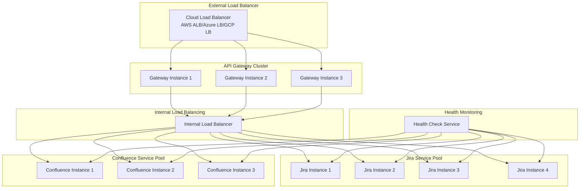

# Load Balancing and Health Check Strategies

## Overview
This document outlines comprehensive load balancing strategies and health check implementations for the Atlassian API Gateway, ensuring high availability, optimal performance, and automatic failure detection.

## Load Balancing Architecture



## Load Balancing Algorithms

### 1. Round Robin with Health Awareness
```yaml
load_balancing:
  jira_services:
    algorithm: "weighted_round_robin"
    health_check_enabled: true
    configuration:
      - service: "jira-core-1"
        weight: 100
        health_endpoint: "/status"
      - service: "jira-core-2"
        weight: 100
        health_endpoint: "/status"
      - service: "jira-core-3"
        weight: 80  # Lower capacity instance
        health_endpoint: "/status"
      - service: "jira-core-4"
        weight: 120  # Higher capacity instance
        health_endpoint: "/status"
```

### 2. Least Connections Algorithm
```yaml
least_connections:
  confluence_services:
    algorithm: "least_connections"
    sticky_sessions: true
    session_affinity: "cookie"
    configuration:
      - service: "confluence-content-1"
        max_connections: 1000
        current_connections: 0
      - service: "confluence-content-2"
        max_connections: 1000
        current_connections: 0
      - service: "confluence-content-3"
        max_connections: 800
        current_connections: 0
```

### 3. Resource-Based Load Balancing
```yaml
resource_based:
  algorithm: "resource_aware"
  metrics:
    - cpu_utilization
    - memory_usage
    - response_time
    - active_connections
  
  jira_cluster:
    - service: "jira-instance-1"
      cpu_weight: 0.3
      memory_weight: 0.3
      response_time_weight: 0.4
      thresholds:
        cpu_max: 80
        memory_max: 85
        response_time_max: 2000ms
    
    - service: "jira-instance-2"
      cpu_weight: 0.3
      memory_weight: 0.3
      response_time_weight: 0.4
      thresholds:
        cpu_max: 80
        memory_max: 85
        response_time_max: 2000ms
```

### 4. Geographic Load Balancing
```yaml
geographic_lb:
  strategy: "proximity_based"
  regions:
    - region: "us-east-1"
      services:
        - "jira-us-east-1a"
        - "jira-us-east-1b"
        - "confluence-us-east-1a"
        - "confluence-us-east-1b"
      latency_threshold: 50ms
    
    - region: "eu-west-1"
      services:
        - "jira-eu-west-1a"
        - "jira-eu-west-1b"
        - "confluence-eu-west-1a"
      latency_threshold: 50ms
    
    - region: "ap-southeast-1"
      services:
        - "jira-apac-1a"
        - "confluence-apac-1a"
      latency_threshold: 100ms
```

## Health Check Implementation

### 1. Multi-Level Health Checks
```yaml
health_checks:
  levels:
    - name: "basic_connectivity"
      type: "tcp"
      interval: 5s
      timeout: 2s
      
    - name: "application_health"
      type: "http"
      interval: 10s
      timeout: 5s
      
    - name: "deep_health"
      type: "custom"
      interval: 30s
      timeout: 10s
```

### 2. Jira Health Check Configuration
```yaml
jira_health_checks:
  basic:
    endpoint: "/status"
    method: "GET"
    expected_status: 200
    interval: 10s
    timeout: 3s
    retries: 3
    
  detailed:
    endpoint: "/rest/api/3/serverInfo"
    method: "GET"
    expected_status: 200
    interval: 30s
    timeout: 5s
    validation:
      - json_path: "$.state"
        expected_value: "RUNNING"
      - json_path: "$.version"
        regex: "^9\\..*"
    
  database:
    endpoint: "/rest/api/3/health/database"
    method: "GET"
    expected_status: 200
    interval: 60s
    timeout: 10s
    critical: true
    
  custom_checks:
    - name: "license_validity"
      endpoint: "/rest/api/3/application-properties"
      validation:
        - json_path: "$.license.valid"
          expected_value: true
    
    - name: "disk_space"
      endpoint: "/rest/api/3/health/disk"
      validation:
        - json_path: "$.available_space_gb"
          min_value: 10
```

### 3. Confluence Health Check Configuration
```yaml
confluence_health_checks:
  basic:
    endpoint: "/status"
    method: "GET"
    expected_status: 200
    interval: 15s
    timeout: 5s
    
  application:
    endpoint: "/rest/api/content"
    method: "GET"
    expected_status: 200
    interval: 30s
    timeout: 8s
    headers:
      Authorization: "Bearer ${HEALTH_CHECK_TOKEN}"
    
  database:
    endpoint: "/rest/api/space"
    method: "GET"
    expected_status: 200
    interval: 45s
    timeout: 10s
    validation:
      - response_time_max: 5000ms
      - json_path: "$.size"
        min_value: 0
    
  search_index:
    endpoint: "/rest/api/search"
    method: "GET"
    query_params:
      cql: "type=page"
      limit: 1
    expected_status: 200
    interval: 60s
    timeout: 15s
```

### 4. Advanced Health Check Features
```yaml
advanced_health_checks:
  circuit_breaker_integration:
    failure_threshold: 3
    recovery_timeout: 30s
    half_open_requests: 5
    
  cascading_failure_prevention:
    dependency_checks:
      - service: "jira-core"
        dependencies: ["database", "search-index", "license-server"]
      - service: "confluence-content"
        dependencies: ["database", "search-index", "attachment-storage"]
    
    failure_isolation:
      - if_dependency_fails: "database"
        action: "mark_unhealthy"
        grace_period: 10s
      - if_dependency_fails: "search-index"
        action: "partial_degradation"
        fallback_mode: "database_only_search"
```

## Load Balancer Configuration

### 1. Cloud Load Balancer Setup (AWS ALB Example)
```yaml
aws_alb_configuration:
  load_balancer:
    name: "atlassian-api-gateway-alb"
    scheme: "internet-facing"
    type: "application"
    subnets:
      - "subnet-12345678"
      - "subnet-87654321"
      - "subnet-11223344"
    
    security_groups:
      - "sg-api-gateway"
    
    listeners:
      - port: 443
        protocol: "HTTPS"
        ssl_policy: "ELBSecurityPolicy-TLS-1-2-2017-01"
        certificate_arn: "arn:aws:acm:region:account:certificate/cert-id"
        
        default_actions:
          - type: "forward"
            target_group_arn: "arn:aws:elasticloadbalancing:region:account:targetgroup/api-gateway-tg"
    
    target_groups:
      - name: "api-gateway-tg"
        port: 8080
        protocol: "HTTP"
        vpc_id: "vpc-12345678"
        
        health_check:
          enabled: true
          path: "/health"
          port: "8080"
          protocol: "HTTP"
          healthy_threshold_count: 2
          unhealthy_threshold_count: 3
          timeout: 5
          interval: 30
          matcher: "200"
        
        targets:
          - id: "i-gateway-1"
            port: 8080
          - id: "i-gateway-2"
            port: 8080
          - id: "i-gateway-3"
            port: 8080
```

### 2. Kubernetes Service Configuration
```yaml
apiVersion: v1
kind: Service
metadata:
  name: api-gateway-service
  annotations:
    service.beta.kubernetes.io/aws-load-balancer-type: "nlb"
    service.beta.kubernetes.io/aws-load-balancer-cross-zone-load-balancing-enabled: "true"
spec:
  type: LoadBalancer
  selector:
    app: api-gateway
  ports:
  - port: 443
    targetPort: 8080
    protocol: TCP
  sessionAffinity: ClientIP
  sessionAffinityConfig:
    clientIP:
      timeoutSeconds: 300

---
apiVersion: v1
kind: Service
metadata:
  name: jira-service
spec:
  selector:
    app: jira
  ports:
  - port: 8080
    targetPort: 8080
  type: ClusterIP

---
apiVersion: v1
kind: Service
metadata:
  name: confluence-service
spec:
  selector:
    app: confluence
  ports:
  - port: 8090
    targetPort: 8090
  type: ClusterIP
```

## Health Check Monitoring and Alerting

### 1. Health Check Metrics
```yaml
health_metrics:
  collection:
    - metric: "health_check_success_rate"
      labels: ["service", "check_type", "region"]
      
    - metric: "health_check_response_time"
      labels: ["service", "endpoint"]
      
    - metric: "service_availability"
      labels: ["service", "instance"]
      
    - metric: "failed_health_checks_total"
      labels: ["service", "failure_reason"]
  
  alerts:
    - name: "ServiceUnhealthy"
      condition: "health_check_success_rate < 0.8"
      duration: "2m"
      severity: "critical"
      
    - name: "HighHealthCheckLatency"
      condition: "health_check_response_time > 5s"
      duration: "5m"
      severity: "warning"
      
    - name: "ServicePartiallyDegraded"
      condition: "service_availability < 0.9"
      duration: "1m"
      severity: "warning"
```

### 2. Automated Recovery Actions
```yaml
recovery_actions:
  service_restart:
    trigger: "consecutive_failures >= 5"
    action: "restart_service"
    cooldown: "5m"
    
  instance_replacement:
    trigger: "health_check_failures >= 10 AND duration >= 10m"
    action: "replace_instance"
    approval_required: false
    
  traffic_rerouting:
    trigger: "service_availability < 0.5"
    action: "reroute_traffic"
    fallback_region: "nearest_healthy_region"
    
  scale_out:
    trigger: "avg_response_time > 3s AND healthy_instances < 2"
    action: "increase_replicas"
    scale_factor: 2
    max_replicas: 10
```

## Performance Optimization

### 1. Connection Pooling
```yaml
connection_pooling:
  jira_services:
    pool_size: 50
    max_idle_connections: 10
    connection_timeout: 30s
    idle_timeout: 300s
    keep_alive: true
    
  confluence_services:
    pool_size: 30
    max_idle_connections: 8
    connection_timeout: 30s
    idle_timeout: 300s
    keep_alive: true
```

### 2. Load Balancing Optimization
```yaml
optimization:
  sticky_sessions:
    enabled: true
    cookie_name: "ATLASSIAN_SESSION"
    cookie_duration: "1h"
    fallback_strategy: "least_connections"
    
  request_queuing:
    max_queue_size: 1000
    queue_timeout: 30s
    priority_queuing: true
    
  adaptive_load_balancing:
    enabled: true
    adjustment_interval: 30s
    metrics_window: 5m
    sensitivity: 0.1
```

## Disaster Recovery and Failover

### 1. Multi-Region Failover
```yaml
disaster_recovery:
  primary_region: "us-east-1"
  secondary_regions:
    - "us-west-2"
    - "eu-west-1"
  
  failover_triggers:
    - region_availability < 50%
    - cross_region_latency > 500ms
    - manual_failover_initiated
  
  failover_strategy:
    type: "active_passive"
    rto: "5m"  # Recovery Time Objective
    rpo: "1m"  # Recovery Point Objective
    
  data_replication:
    jira_data: "cross_region_sync"
    confluence_data: "cross_region_sync"
    configuration: "real_time_sync"
```

### 2. Graceful Degradation
```yaml
degradation_strategies:
  jira_readonly_mode:
    trigger: "database_write_failures > 5"
    actions:
      - disable_write_operations
      - enable_cached_responses
      - redirect_to_readonly_replicas
    
  confluence_limited_functionality:
    trigger: "search_index_unavailable"
    actions:
      - disable_advanced_search
      - enable_basic_content_retrieval
      - show_degraded_service_banner