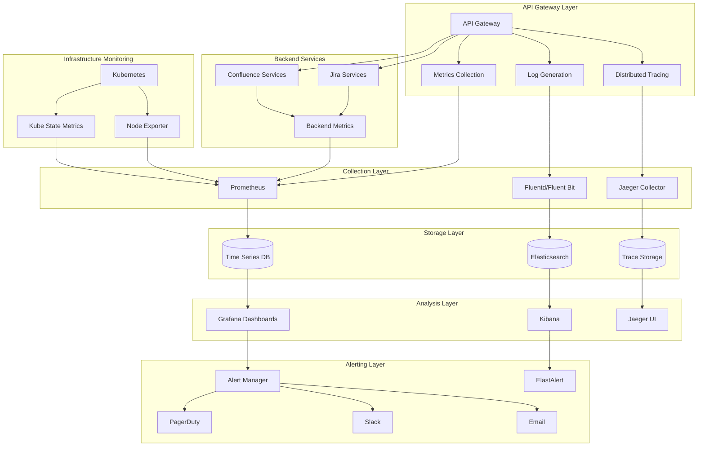

# Monitoring, Logging, and Observability Strategy

## Overview
This document outlines a comprehensive monitoring, logging, and observability strategy for the Atlassian API Gateway, implementing the three pillars of observability: metrics, logs, and traces, along with alerting, dashboards, and SRE practices.

## Observability Architecture



## Metrics Collection and Monitoring

### 1. Application Metrics
```yaml
application_metrics:
  api_gateway_metrics:
    request_metrics:
      - name: "http_requests_total"
        type: "counter"
        labels: ["method", "endpoint", "status_code", "service"]
        description: "Total number of HTTP requests"
        
      - name: "http_request_duration_seconds"
        type: "histogram"
        labels: ["method", "endpoint", "service"]
        buckets: [0.1, 0.25, 0.5, 1, 2.5, 5, 10]
        description: "HTTP request duration in seconds"
        
      - name: "http_request_size_bytes"
        type: "histogram"
        labels: ["method", "endpoint"]
        buckets: [1024, 4096, 16384, 65536, 262144, 1048576]
        description: "HTTP request size in bytes"
        
      - name: "http_response_size_bytes"
        type: "histogram"
        labels: ["method", "endpoint"]
        buckets: [1024, 4096, 16384, 65536, 262144, 1048576]
        description: "HTTP response size in bytes"
    
    authentication_metrics:
      - name: "auth_requests_total"
        type: "counter"
        labels: ["auth_method", "result", "client_id"]
        description: "Total authentication requests"
        
      - name: "auth_duration_seconds"
        type: "histogram"
        labels: ["auth_method"]
        buckets: [0.01, 0.05, 0.1, 0.25, 0.5, 1, 2]
        description: "Authentication duration in seconds"
        
      - name: "token_validation_total"
        type: "counter"
        labels: ["token_type", "result"]
        description: "Total token validations"
        
      - name: "active_sessions"
        type: "gauge"
        labels: ["auth_method"]
        description: "Number of active user sessions"
    
    authorization_metrics:
      - name: "authz_decisions_total"
        type: "counter"
        labels: ["decision", "policy", "resource_type"]
        description: "Total authorization decisions"
        
      - name: "authz_duration_seconds"
        type: "histogram"
        labels: ["policy_type"]
        buckets: [0.001, 0.005, 0.01, 0.025, 0.05, 0.1, 0.25]
        description: "Authorization decision duration"
        
      - name: "policy_evaluations_total"
        type: "counter"
        labels: ["policy_id", "result"]
        description: "Total policy evaluations"
    
    rate_limiting_metrics:
      - name: "rate_limit_hits_total"
        type: "counter"
        labels: ["limit_type", "key", "action"]
        description: "Total rate limit hits"
        
      - name: "rate_limit_remaining"
        type: "gauge"
        labels: ["limit_type", "key"]
        description: "Remaining rate limit quota"
        
      - name: "throttled_requests_total"
        type: "counter"
        labels: ["reason", "service"]
        description: "Total throttled requests"
    
    cache_metrics:
      - name: "cache_operations_total"
        type: "counter"
        labels: ["cache_name", "operation", "result"]
        description: "Total cache operations"
        
      - name: "cache_hit_ratio"
        type: "gauge"
        labels: ["cache_name"]
        description: "Cache hit ratio"
        
      - name: "cache_size_bytes"
        type: "gauge"
        labels: ["cache_name"]
        description: "Cache size in bytes"
        
      - name: "cache_evictions_total"
        type: "counter"
        labels: ["cache_name", "reason"]
        description: "Total cache evictions"

  backend_service_metrics:
    jira_metrics:
      - name: "jira_api_requests_total"
        type: "counter"
        labels: ["endpoint", "method", "status"]
        description: "Total Jira API requests"
        
      - name: "jira_response_time_seconds"
        type: "histogram"
        labels: ["endpoint"]
        buckets: [0.1, 0.5, 1, 2, 5, 10, 30]
        description: "Jira API response time"
        
      - name: "jira_active_connections"
        type: "gauge"
        labels: ["instance"]
        description: "Active connections to Jira"
        
      - name: "jira_queue_depth"
        type: "gauge"
        labels: ["instance"]
        description: "Request queue depth for Jira"
    
    confluence_metrics:
      - name: "confluence_api_requests_total"
        type: "counter"
        labels: ["endpoint", "method", "status"]
        description: "Total Confluence API requests"
        
      - name: "confluence_response_time_seconds"
        type: "histogram"
        labels: ["endpoint"]
        buckets: [0.1, 0.5, 1, 2, 5, 10, 30]
        description: "Confluence API response time"
        
      - name: "confluence_active_connections"
        type: "gauge"
        labels: ["instance"]
        description: "Active connections to Confluence"
        
      - name: "confluence_search_latency_seconds"
        type: "histogram"
        labels: ["search_type"]
        buckets: [0.5, 1, 2, 5, 10, 20, 60]
        description: "Confluence search latency"
```

### 2. Infrastructure Metrics
```yaml
infrastructure_metrics:
  system_metrics:
    cpu_metrics:
      - name: "node_cpu_seconds_total"
        type: "counter"
        labels: ["cpu", "mode"]
        description: "CPU time spent in different modes"
        
      - name: "process_cpu_seconds_total"
        type: "counter"
        labels: ["instance"]
        description: "Process CPU time"
    
    memory_metrics:
      - name: "node_memory_MemTotal_bytes"
        type: "gauge"
        description: "Total memory in bytes"
        
      - name: "node_memory_MemAvailable_bytes"
        type: "gauge"
        description: "Available memory in bytes"
        
      - name: "process_resident_memory_bytes"
        type: "gauge"
        labels: ["instance"]
        description: "Process resident memory"
    
    network_metrics:
      - name: "node_network_receive_bytes_total"
        type: "counter"
        labels: ["device"]
        description: "Network bytes received"
        
      - name: "node_network_transmit_bytes_total"
        type: "counter"
        labels: ["device"]
        description: "Network bytes transmitted"
        
      - name: "node_network_receive_packets_total"
        type: "counter"
        labels: ["device"]
        description: "Network packets received"
    
    disk_metrics:
      - name: "node_filesystem_size_bytes"
        type: "gauge"
        labels: ["device", "mountpoint"]
        description: "Filesystem size in bytes"
        
      - name: "node_filesystem_avail_bytes"
        type: "gauge"
        labels: ["device", "mountpoint"]
        description: "Filesystem available space"
        
      - name: "node_disk_io_time_seconds_total"
        type: "counter"
        labels: ["device"]
        description: "Disk I/O time"

  kubernetes_metrics:
    cluster_metrics:
      - name: "kube_node_status_condition"
        type: "gauge"
        labels: ["node", "condition", "status"]
        description: "Node condition status"
        
      - name: "kube_pod_status_phase"
        type: "gauge"
        labels: ["namespace", "pod", "phase"]
        description: "Pod status phase"
        
      - name: "kube_deployment_status_replicas"
        type: "gauge"
        labels: ["namespace", "deployment"]
        description: "Deployment replica count"
    
    resource_metrics:
      - name: "container_cpu_usage_seconds_total"
        type: "counter"
        labels: ["namespace", "pod", "container"]
        description: "Container CPU usage"
        
      - name: "container_memory_usage_bytes"
        type: "gauge"
        labels: ["namespace", "pod", "container"]
        description: "Container memory usage"
        
      - name: "container_network_receive_bytes_total"
        type: "counter"
        labels: ["namespace", "pod"]
        description: "Container network bytes received"
```

## Logging Strategy

### 1. Log Structure and Format
```yaml
logging_configuration:
  log_format: "json"
  timestamp_format: "ISO8601"
  timezone: "UTC"
  
  log_levels:
    - "TRACE"
    - "DEBUG"
    - "INFO"
    - "WARN"
    - "ERROR"
    - "FATAL"
  
  structured_logging:
    common_fields:
      - "timestamp"
      - "level"
      - "logger"
      - "message"
      - "request_id"
      - "correlation_id"
      - "user_id"
      - "tenant_id"
      - "service"
      - "version"
    
    context_fields:
      - "method"
      - "url"
      - "status_code"
      - "response_time"
      - "user_agent"
      - "ip_address"
      - "session_id"
      - "api_key_id"
    
    error_fields:
      - "error_code"
      - "error_message"
      - "stack_trace"
      - "error_type"
      - "error_context"

  log_categories:
    access_logs:
      level: "INFO"
      format: |
        {
          "timestamp": "2024-01-15T10:30:00.000Z",
          "level": "INFO",
          "category": "access",
          "request_id": "req-123456",
          "method": "GET",
          "url": "/api/v2/jira/issues/PROJ-123",
          "status_code": 200,
          "response_time": 150,
          "user_id": "user123",
          "ip_address": "192.168.1.100",
          "user_agent": "Mozilla/5.0...",
          "bytes_sent": 1024,
          "bytes_received": 256
        }
    
    application_logs:
      level: "INFO"
      format: |
        {
          "timestamp": "2024-01-15T10:30:00.000Z",
          "level": "ERROR",
          "category": "application",
          "logger": "com.atlassian.gateway.auth",
          "message": "Authentication failed for user",
          "request_id": "req-123456",
          "user_id": "user123",
          "error_code": "AUTH_FAILED",
          "error_message": "Invalid credentials",
          "auth_method": "oauth2"
        }
    
    security_logs:
      level: "WARN"
      format: |
        {
          "timestamp": "2024-01-15T10:30:00.000Z",
          "level": "WARN",
          "category": "security",
          "event_type": "suspicious_activity",
          "message": "Multiple failed login attempts detected",
          "user_id": "user123",
          "ip_address": "192.168.1.100",
          "failed_attempts": 5,
          "time_window": "5m",
          "action_taken": "account_locked"
        }
    
    audit_logs:
      level: "INFO"
      format: |
        {
          "timestamp": "2024-01-15T10:30:00.000Z",
          "level": "INFO",
          "category": "audit",
          "event_type": "permission_change",
          "message": "User role updated",
          "actor_id": "admin123",
          "target_user_id": "user456",
          "old_role": "user",
          "new_role": "admin",
          "resource": "project:PROJ",
          "justification": "Promotion to team lead"
        }
```

### 2. Log Collection and Processing
```yaml
log_collection:
  collection_agents:
    fluent_bit:
      enabled: true
      config: |
        [INPUT]
            Name tail
            Path /var/log/api-gateway/*.log
            Parser json
            Tag api-gateway.*
            Refresh_Interval 5
            
        [INPUT]
            Name systemd
            Tag systemd.*
            Systemd_Filter _SYSTEMD_UNIT=api-gateway.service
            
        [FILTER]
            Name kubernetes
            Match kube.*
            Kube_URL https://kubernetes.default.svc:443
            Kube_CA_File /var/run/secrets/kubernetes.io/serviceaccount/ca.crt
            Kube_Token_File /var/run/secrets/kubernetes.io/serviceaccount/token
            
        [OUTPUT]
            Name elasticsearch
            Match *
            Host elasticsearch.logging.svc.cluster.local
            Port 9200
            Index api-gateway-logs
            Type _doc
    
    filebeat:
      enabled: false  # Alternative to Fluent Bit
      config: |
        filebeat.inputs:
        - type: log
          paths:
            - /var/log/api-gateway/*.log
          json.keys_under_root: true
          json.add_error_key: true
          
        output.elasticsearch:
          hosts: ["elasticsearch:9200"]
          index: "api-gateway-logs-%{+yyyy.MM.dd}"
  
  log_processing:
    parsing_rules:
      - name: "extract_request_id"
        pattern: "request_id\":\"([^\"]+)\""
        field: "request_id"
        
      - name: "extract_user_id"
        pattern: "user_id\":\"([^\"]+)\""
        field: "user_id"
        
      - name: "extract_response_time"
        pattern: "response_time\":([0-9]+)"
        field: "response_time"
        type: "integer"
    
    enrichment_rules:
      - name: "add_geo_location"
        field: "ip_address"
        target: "geo_location"
        type: "geoip"
        
      - name: "add_user_agent_parsing"
        field: "user_agent"
        target: "user_agent_parsed"
        type: "user_agent"
        
      - name: "add_timestamp_parsing"
        field: "timestamp"
        target: "parsed_timestamp"
        type: "date"
        format: "ISO8601"
    
    filtering_rules:
      - name: "exclude_health_checks"
        condition: "url matches '/health'"
        action: "drop"
        
      - name: "exclude_debug_logs_in_prod"
        condition: "level == 'DEBUG' AND environment == 'production'"
        action: "drop"
        
      - name: "sample_high_volume_logs"
        condition: "category == 'access' AND status_code == 200"
        action: "sample"
        rate: 0.1  # Keep 10% of successful requests
```

## Distributed Tracing

### 1. Tracing Configuration
```yaml
distributed_tracing:
  tracing_system: "jaeger"
  
  trace_configuration:
    sampling_strategy:
      type: "probabilistic"
      param: 0.1  # Sample 10% of traces
      
      per_service_strategies:
        - service: "api-gateway"
          type: "probabilistic"
          param: 0.2  # Sample 20% for gateway
          
        - service: "auth-service"
          type: "probabilistic"
          param: 0.5  # Sample 50% for auth
          
        - service: "jira-service"
          type: "rate_limiting"
          max_traces_per_second: 100
          
        - service: "confluence-service"
          type: "rate_limiting"
          max_traces_per_second: 50
    
    trace_context:
      propagation_format: "jaeger"
      headers:
        - "uber-trace-id"
        - "jaeger-debug-id"
        - "jaeger-baggage"
      
      baggage_restrictions:
        max_value_length: 2048
        max_name_length: 256
        max_baggage_items: 64
  
  instrumentation:
    automatic_instrumentation:
      http_requests: true
      database_queries: true
      cache_operations: true
      message_queue_operations: true
      
    custom_spans:
      authentication:
        span_name: "authenticate_user"
        tags:
          - "auth.method"
          - "auth.user_id"
          - "auth.client_id"
          
      authorization:
        span_name: "authorize_request"
        tags:
          - "authz.policy"
          - "authz.resource"
          - "authz.decision"
          
      rate_limiting:
        span_name: "check_rate_limit"
        tags:
          - "rate_limit.type"
          - "rate_limit.key"
          - "rate_limit.result"
          
      backend_calls:
        span_name: "backend_request"
        tags:
          - "backend.service"
          - "backend.endpoint"
          - "backend.method"
          - "backend.status_code"
  
  trace_analysis:
    service_map: true
    dependency_analysis: true
    performance_analysis: true
    error_analysis: true
    
    alerting_rules:
      - name: "high_trace_error_rate"
        condition: "error_rate > 5%"
        window: "5m"
        severity: "warning"
        
      - name: "slow_trace_detection"
        condition: "p95_duration > 5s"
        window: "10m"
        severity: "warning"
        
      - name: "service_dependency_failure"
        condition: "dependency_error_rate > 10%"
        window: "5m"
        severity: "critical"
```

### 2. Trace Storage and Retention
```yaml
trace_storage:
  storage_backend: "elasticsearch"
  
  retention_policies:
    hot_storage:
      duration: "7d"
      storage_class: "ssd"
      
    warm_storage:
      duration: "30d"
      storage_class: "standard"
      
    cold_storage:
      duration: "90d"
      storage_class: "archive"
      
    deletion:
      after: "1y"
  
  storage_optimization:
    compression: true
    indexing_strategy: "time_based"
    sharding_strategy: "daily"
    
  query_optimization:
    index_patterns:
      - "jaeger-span-*"
      - "jaeger-service-*"
      - "jaeger-dependencies-*"
      
    query_limits:
      max_traces_per_query: 1000
      max_query_duration: "1h"
      query_timeout: "30s"
```

## Dashboards and Visualization

### 1. Grafana Dashboard Configuration
```yaml
grafana_dashboards:
  api_gateway_overview:
    panels:
      - title: "Request Rate"
        type: "graph"
        targets:
          - expr: "rate(http_requests_total[5m])"
            legend: "{{method}} {{endpoint}}"
            
      - title: "Response Time"
        type: "graph"
        targets:
          - expr: "histogram_quantile(0.95, rate(http_request_duration_seconds_bucket[5m]))"
            legend: "95th percentile"
          - expr: "histogram_quantile(0.50, rate(http_request_duration_seconds_bucket[5m]))"
            legend: "50th percentile"
            
      - title: "Error Rate"
        type: "stat"
        targets:
          - expr: "rate(http_requests_total{status_code=~\"5..\"}[5m]) / rate(http_requests_total[5m]) * 100"
            
      - title: "Active Connections"
        type: "gauge"
        targets:
          - expr: "sum(active_connections) by (service)"
            
      - title: "Top Endpoints by Request Count"
        type: "table"
        targets:
          - expr: "topk(10, sum(rate(http_requests_total[5m])) by (endpoint))"
  
  authentication_dashboard:
    panels:
      - title: "Authentication Success Rate"
        type: "stat"
        targets:
          - expr: "rate(auth_requests_total{result=\"success\"}[5m]) / rate(auth_requests_total[5m]) * 100"
            
      - title: "Authentication Methods"
        type: "pie"
        targets:
          - expr: "sum(rate(auth_requests_total[5m])) by (auth_method)"
            
      - title: "Failed Authentication Attempts"
        type: "graph"
        targets:
          - expr: "rate(auth_requests_total{result=\"failure\"}[5m])"
            legend: "{{auth_method}}"
            
      - title: "Active Sessions"
        type: "gauge"
        targets:
          - expr: "sum(active_sessions) by (auth_method)"
  
  backend_services_dashboard:
    panels:
      - title: "Jira API Response Time"
        type: "graph"
        targets:
          - expr: "histogram_quantile(0.95, rate(jira_response_time_seconds_bucket[5m]))"
            legend: "95th percentile"
            
      - title: "Confluence API Response Time"
        type: "graph"
        targets:
          - expr: "histogram_quantile(0.95, rate(confluence_response_time_seconds_bucket[5m]))"
            legend: "95th percentile"
            
      - title: "Backend Service Health"
        type: "stat"
        targets:
          - expr: "up{job=\"jira-service\"}"
            displayName: "Jira"
          - expr: "up{job=\"confluence-service\"}"
            displayName: "Confluence"
            
      - title: "Request Distribution"
        type: "pie"
        targets:
          - expr: "sum(rate(http_requests_total[5m])) by (service)"
  
  infrastructure_dashboard:
    panels:
      - title: "CPU Usage"
        type: "graph"
        targets:
          - expr: "100 - (avg(rate(node_cpu_seconds_total{mode=\"idle\"}[5m])) * 100)"
            legend: "CPU Usage %"
            
      - title: "Memory Usage"
        type: "graph"
        targets:
          - expr: "(1 - (node_memory_MemAvailable_bytes / node_memory_MemTotal_bytes)) * 100"
            legend: "Memory Usage %"
            
      - title: "Disk Usage"
        type: "graph"
        targets:
          - expr: "100 - ((node_filesystem_avail_bytes / node_filesystem_size_bytes) * 100)"
            legend: "{{mountpoint}}"
            
      - title: "Network I/O"
        type: "graph"
        targets:
          - expr: "rate(node_network_receive_bytes_total[5m])"
            legend: "Receive {{device}}"
          - expr: "rate(node_network_transmit_bytes_total[5m])"
            legend: "Transmit {{device}}"
```

### 2. Custom Dashboards
```yaml
custom_dashboards:
  sre_dashboard:
    sli_slo_panels:
      - title: "API Availability SLI"
        type: "stat"
        targets:
          - expr: "(sum(rate(http_requests_total{status_code!~\"5..\"}[30d])) / sum(rate(http_requests_total[30d]))) * 100"
        thresholds:
          - value: 99.9
            color: "green"
          - value: 99.5
            color: "yellow"
          - value: 99.0
            color: "red"
            
      - title: "API Latency SLI"
        type: "stat"
        targets:
          - expr: "histogram_quantile(0.95, rate(http_request_duration_seconds_bucket[30d]))"
        thresholds:
          - value: 1.0
            color: "green"
          - value: 2.0
            color: "yellow"
          - value: 5.0
            color: "red"
            
      - title: "Error Budget Burn Rate"
        type: "graph"
        targets:
          - expr: "rate(http_requests_total{status_code=~\"5..\"}[1h]) / (0.001 * rate(http_requests_total[1h]))"
            legend: "1h burn rate"
          - expr: "rate(http_requests_total{status_code=~\"5..\"}[6h]) / (0.001 * rate(http_requests_total[6h]))"
            legend: "6h burn rate"
  
  business_dashboard:
    panels:
      - title: "API Usage by Tenant"
        type: "table"
        targets:
          - expr: "topk(20, sum(rate(http_requests_total[24h])) by (tenant_id))"
            
      - title: "Feature Usage"
        type: "pie"
        targets:
          - expr: "sum(rate(http_requests_total[24h])) by (endpoint)"
            
      - title: "Geographic Distribution"
        type: "worldmap"
        targets:
          - expr: "sum(rate(http_requests_total[1h])) by (country)"
            
      - title: "API Key Usage"
        type: "graph"
        targets:
          - expr: "sum(rate(http_requests_total{auth_method=\"api_key\"}[5m])) by (api_key_type)"
```

## Alerting Strategy

### 1. Alert Rules Configuration
```yaml
alerting_rules:
  critical_alerts:
    - alert: "APIGatewayDown"
      expr: "up{job=\"api-gateway\"} == 0"
      for: "1m"
      labels:
        severity: "critical"
        team: "sre"
      annotations:
        summary: "API Gateway instance is down"
        description: "API Gateway instance {{ $labels.instance }} has been down for more than 1 minute"
        runbook_url: "https://runbooks.company.com/api-gateway-down"
        
    - alert: "HighErrorRate"
      expr: "rate(http_requests_total{status_code=~\"5..\"}[5m]) / rate(http_requests_total[5m]) > 0.05"
      for: "2m"
      labels:
        severity: "critical"
        team: "sre"
      annotations:
        summary: "High error rate detected"
        description: "Error rate is {{ $value | humanizePercentage }} for the last 5 minutes"
        
    - alert: "HighLatency"
      expr: "histogram_quantile(0.95, rate(http_request_duration_seconds_bucket[5m])) > 5"
      for: "5m"
      labels:
        severity: "critical"
        team: "sre"
      annotations:
        summary: "High API latency detected"
        description: "95th percentile latency is {{ $value }}s for the last 5 minutes"
        
    - alert: "AuthenticationFailureSpike"
      expr: "rate(auth_requests_total{result=\"failure\"}[5m]) > 10"
      for: "2m"
      labels:
        severity: "critical"
        team: "security"
      annotations:
        summary: "High authentication failure rate"
        description: "Authentication failure rate is {{ $value }} failures/sec"
  
  warning_alerts:
    - alert: "HighMemoryUsage"
      expr: "process_resident_memory_bytes / 1024 / 1024 / 1024 > 2"
      for: "10m"
      labels:
        severity: "warning"
        team: "sre"
      annotations:
        summary: "High memory usage"
        description: "Memory usage is {{ $value }}GB"
        
    - alert: "RateLimitViolations"
      expr: "rate(rate_limit_hits_total{action=\"block\"}[5m]) > 100"
      for: "5m"
      labels:
        severity: "warning"
        team: "platform"
      annotations:
        summary: "High rate limit violations"
        description: "Rate limit violations: {{ $value }} blocks/sec"
        
    - alert: "CacheHitRateLow"
      expr: "cache_hit_ratio < 0.8"
      for: "10m"
      labels:
        severity: "warning"
        team: "platform"
      annotations:
        summary: "Low cache hit ratio"
        description: "Cache hit ratio is {{ $value | humanizePercentage }}"
  
  info_alerts:
    - alert: "NewDeployment"
      expr: "increase(process_start_time_seconds[5m]) > 0"
      for: "0m"
      labels:
        severity: "info"
team: "platform"
      annotations:
        summary: "New deployment detected"
        description: "API Gateway instance {{ $labels.instance }} has been restarted"

### 2. Alert Routing and Notification
```yaml
alert_routing:
  notification_channels:
    pagerduty:
      critical_alerts:
        service_key: "${PAGERDUTY_CRITICAL_SERVICE_KEY}"
        escalation_policy: "sre-escalation"
        
      warning_alerts:
        service_key: "${PAGERDUTY_WARNING_SERVICE_KEY}"
        escalation_policy: "platform-escalation"
    
    slack:
      channels:
        - name: "#sre-alerts"
          severity: ["critical", "warning"]
          teams: ["sre"]
          
        - name: "#security-alerts"
          severity: ["critical"]
          teams: ["security"]
          
        - name: "#platform-alerts"
          severity: ["warning", "info"]
          teams: ["platform"]
    
    email:
      recipients:
        critical:
          - "sre-oncall@company.com"
          - "engineering-leads@company.com"
          
        warning:
          - "platform-team@company.com"
          
        info:
          - "dev-notifications@company.com"
    
    webhook:
      endpoints:
        - url: "https://incident-management.company.com/webhook"
          severity: ["critical"]
          headers:
            Authorization: "Bearer ${INCIDENT_WEBHOOK_TOKEN}"
  
  routing_rules:
    - match:
        severity: "critical"
        team: "sre"
      receiver: "sre-critical"
      group_wait: "10s"
      group_interval: "5m"
      repeat_interval: "1h"
      
    - match:
        severity: "critical"
        team: "security"
      receiver: "security-critical"
      group_wait: "0s"
      group_interval: "1m"
      repeat_interval: "30m"
      
    - match:
        severity: "warning"
      receiver: "platform-warning"
      group_wait: "30s"
      group_interval: "10m"
      repeat_interval: "4h"
      
    - match:
        severity: "info"
      receiver: "info-notifications"
      group_wait: "5m"
      group_interval: "1h"
      repeat_interval: "24h"
```

## SRE Practices and SLI/SLO

### 1. Service Level Indicators (SLIs)
```yaml
service_level_indicators:
  availability_sli:
    name: "API Availability"
    description: "Percentage of successful API requests"
    query: |
      sum(rate(http_requests_total{status_code!~"5.."}[30d])) /
      sum(rate(http_requests_total[30d])) * 100
    unit: "percentage"
    good_events: "successful_requests"
    total_events: "all_requests"
    
  latency_sli:
    name: "API Latency"
    description: "95th percentile response time"
    query: |
      histogram_quantile(0.95, 
        rate(http_request_duration_seconds_bucket[30d]))
    unit: "seconds"
    threshold: "fast_requests"
    total_events: "all_requests"
    
  error_rate_sli:
    name: "Error Rate"
    description: "Percentage of requests resulting in errors"
    query: |
      sum(rate(http_requests_total{status_code=~"5.."}[30d])) /
      sum(rate(http_requests_total[30d])) * 100
    unit: "percentage"
    bad_events: "error_requests"
    total_events: "all_requests"
    
  throughput_sli:
    name: "Request Throughput"
    description: "Requests per second"
    query: |
      sum(rate(http_requests_total[5m]))
    unit: "requests_per_second"
    measurement: "instantaneous"

### 2. Service Level Objectives (SLOs)
```yaml
service_level_objectives:
  availability_slo:
    sli: "availability_sli"
    target: 99.9
    time_window: "30d"
    error_budget: 0.1
    burn_rate_alerts:
      - window: "1h"
        threshold: 14.4  # 2% of monthly budget in 1 hour
        severity: "critical"
      - window: "6h"
        threshold: 6     # 2% of monthly budget in 6 hours
        severity: "warning"
    
  latency_slo:
    sli: "latency_sli"
    target: 1.0  # 95% of requests under 1 second
    time_window: "30d"
    error_budget: 5.0  # 5% can be slower than 1 second
    burn_rate_alerts:
      - window: "1h"
        threshold: 10
        severity: "critical"
      - window: "6h"
        threshold: 5
        severity: "warning"
    
  error_rate_slo:
    sli: "error_rate_sli"
    target: 1.0  # Less than 1% error rate
    time_window: "30d"
    error_budget: 1.0
    burn_rate_alerts:
      - window: "1h"
        threshold: 20
        severity: "critical"
      - window: "6h"
        threshold: 10
        severity: "warning"

### 3. Error Budget Policies
```yaml
error_budget_policies:
  budget_calculation:
    availability_budget:
      slo_target: 99.9
      time_window: "30d"
      total_budget: 0.1  # 0.1% error budget
      
    latency_budget:
      slo_target: 95.0   # 95% under threshold
      time_window: "30d"
      total_budget: 5.0  # 5% can exceed threshold
  
  budget_alerts:
    - name: "error_budget_25_percent_consumed"
      condition: "error_budget_consumed > 0.25"
      action: "notify_team"
      
    - name: "error_budget_50_percent_consumed"
      condition: "error_budget_consumed > 0.50"
      action: "review_changes"
      
    - name: "error_budget_75_percent_consumed"
      condition: "error_budget_consumed > 0.75"
      action: "freeze_risky_changes"
      
    - name: "error_budget_exhausted"
      condition: "error_budget_consumed > 1.0"
      action: "incident_response"
  
  budget_enforcement:
    change_freeze:
      trigger: "error_budget_consumed > 0.9"
      exceptions:
        - "security_patches"
        - "critical_bug_fixes"
        - "rollbacks"
      approval_required: true
      
    feature_rollout_gates:
      trigger: "error_budget_consumed > 0.5"
      actions:
        - "require_canary_deployment"
        - "extended_monitoring_period"
        - "additional_testing"
```

## Performance Monitoring

### 1. Performance Metrics
```yaml
performance_monitoring:
  response_time_metrics:
    - name: "api_response_time_p50"
      query: "histogram_quantile(0.50, rate(http_request_duration_seconds_bucket[5m]))"
      
    - name: "api_response_time_p95"
      query: "histogram_quantile(0.95, rate(http_request_duration_seconds_bucket[5m]))"
      
    - name: "api_response_time_p99"
      query: "histogram_quantile(0.99, rate(http_request_duration_seconds_bucket[5m]))"
  
  throughput_metrics:
    - name: "requests_per_second"
      query: "sum(rate(http_requests_total[5m]))"
      
    - name: "requests_per_minute"
      query: "sum(rate(http_requests_total[1m])) * 60"
      
    - name: "peak_requests_per_second"
      query: "max_over_time(sum(rate(http_requests_total[1m]))[1h:])"
  
  resource_utilization:
    - name: "cpu_utilization"
      query: "rate(process_cpu_seconds_total[5m]) * 100"
      
    - name: "memory_utilization"
      query: "process_resident_memory_bytes / 1024 / 1024 / 1024"
      
    - name: "connection_pool_utilization"
      query: "active_connections / max_connections * 100"
  
  backend_performance:
    - name: "jira_response_time"
      query: "histogram_quantile(0.95, rate(jira_response_time_seconds_bucket[5m]))"
      
    - name: "confluence_response_time"
      query: "histogram_quantile(0.95, rate(confluence_response_time_seconds_bucket[5m]))"
      
    - name: "backend_error_rate"
      query: "sum(rate(backend_requests_total{status_code=~\"5..\"}[5m])) / sum(rate(backend_requests_total[5m]))"

### 2. Capacity Planning
```yaml
capacity_planning:
  growth_projections:
    request_volume:
      current_baseline: "1000 rps"
      growth_rate: "20% per quarter"
      projection_period: "12 months"
      
    user_growth:
      current_users: 10000
      growth_rate: "15% per quarter"
      projection_period: "12 months"
  
  resource_forecasting:
    cpu_requirements:
      current_utilization: "60%"
      target_utilization: "70%"
      scaling_threshold: "80%"
      
    memory_requirements:
      current_usage: "4GB"
      growth_factor: 1.5
      buffer_percentage: 20
      
    network_bandwidth:
      current_usage: "100 Mbps"
      peak_multiplier: 3
      growth_projection: "25% per quarter"
  
  scaling_triggers:
    scale_up_triggers:
      - "cpu_utilization > 70% for 5m"
      - "memory_utilization > 80% for 5m"
      - "response_time_p95 > 2s for 10m"
      - "queue_depth > 100 for 5m"
      
    scale_down_triggers:
      - "cpu_utilization < 30% for 15m"
      - "memory_utilization < 40% for 15m"
      - "response_time_p95 < 500ms for 30m"
```

## Incident Management Integration

### 1. Incident Detection and Response
```yaml
incident_management:
  incident_detection:
    automated_detection:
      - trigger: "critical_alert_fired"
        action: "create_incident"
        severity: "high"
        
      - trigger: "slo_burn_rate_exceeded"
        action: "create_incident"
        severity: "medium"
        
      - trigger: "multiple_warning_alerts"
        condition: "count > 5 in 10m"
        action: "create_incident"
        severity: "low"
  
  incident_response:
    response_procedures:
      high_severity:
        - "page_on_call_engineer"
        - "create_incident_room"
        - "notify_stakeholders"
        - "start_incident_timeline"
        
      medium_severity:
        - "notify_on_call_engineer"
        - "create_incident_ticket"
        - "monitor_situation"
        
      low_severity:
        - "create_incident_ticket"
        - "assign_to_team"
        - "schedule_investigation"
  
  incident_communication:
    status_page_integration:
      enabled: true
      auto_update: true
      components:
        - "api_gateway"
        - "jira_api"
        - "confluence_api"
        
    stakeholder_notifications:
      internal:
        - "engineering_team"
        - "product_team"
        - "customer_success"
        
      external:
        - "enterprise_customers"
        - "integration_partners"
  
  post_incident_review:
    automated_data_collection:
      - "incident_timeline"
      - "alert_history"
      - "metric_snapshots"
      - "log_excerpts"
      - "trace_samples"
      
    review_process:
      - "incident_timeline_review"
      - "root_cause_analysis"
      - "action_item_identification"
      - "process_improvement_recommendations"
      - "documentation_updates"
```

### 2. Runbook Integration
```yaml
runbook_integration:
  automated_runbooks:
    high_error_rate:
      triggers:
        - "error_rate > 5%"
      actions:
        - "check_backend_health"
        - "verify_circuit_breaker_status"
        - "analyze_error_patterns"
        - "escalate_if_backend_issue"
        
    high_latency:
      triggers:
        - "p95_latency > 5s"
      actions:
        - "check_resource_utilization"
        - "analyze_slow_queries"
        - "verify_cache_performance"
        - "consider_scaling_up"
        
    authentication_failures:
      triggers:
        - "auth_failure_rate > 10%"
      actions:
        - "check_auth_service_health"
        - "verify_token_validation"
        - "analyze_failure_patterns"
        - "notify_security_team"
  
  manual_runbooks:
    deployment_rollback:
      steps:
        - "identify_problematic_deployment"
        - "stop_traffic_to_new_version"
        - "rollback_to_previous_version"
        - "verify_system_health"
        - "communicate_status"
        
    database_connectivity_issues:
      steps:
        - "check_database_connectivity"
        - "verify_connection_pool_status"
        - "analyze_database_performance"
        - "coordinate_with_dba_team"
        - "implement_fallback_measures"
```

## Data Retention and Compliance

### 1. Data Retention Policies
```yaml
data_retention:
  metrics_retention:
    high_resolution:
      duration: "7d"
      resolution: "15s"
      
    medium_resolution:
      duration: "30d"
      resolution: "1m"
      
    low_resolution:
      duration: "1y"
      resolution: "1h"
      
    long_term_storage:
      duration: "7y"
      resolution: "1d"
      compression: true
  
  logs_retention:
    access_logs:
      duration: "3y"
      compression: true
      
    application_logs:
      duration: "1y"
      compression: true
      
    security_logs:
      duration: "7y"
      encryption: true
      
    debug_logs:
      duration: "30d"
      auto_cleanup: true
  
  traces_retention:
    detailed_traces:
      duration: "7d"
      sampling_rate: 1.0
      
    sampled_traces:
      duration: "30d"
      sampling_rate: 0.1
      
    summary_traces:
      duration: "1y"
      aggregated_only: true

### 2. Compliance and Privacy
```yaml
compliance_monitoring:
  gdpr_compliance:
    data_anonymization:
      enabled: true
      fields: ["user_id", "ip_address", "email"]
      retention_period: "2y"
      
    right_to_deletion:
      enabled: true
      automated_cleanup: true
      verification_required: true
      
    data_export:
      enabled: true
      format: "json"
      encryption: true
  
  audit_requirements:
    sox_compliance:
      audit_trail: true
      immutable_logs: true
      access_logging: true
      
    pci_compliance:
      sensitive_data_masking: true
      encryption_at_rest: true
      access_controls: true
      
    hipaa_compliance:
      data_encryption: true
      access_logging: true
      breach_notification: true
  
  data_governance:
    classification:
      public: "no_restrictions"
      internal: "employee_access_only"
      confidential: "need_to_know_basis"
      restricted: "executive_approval_required"
      
    access_controls:
      role_based: true
      time_limited: true
      approval_workflow: true
      
    data_lineage:
      tracking_enabled: true
      source_identification: true
      transformation_logging: true
```