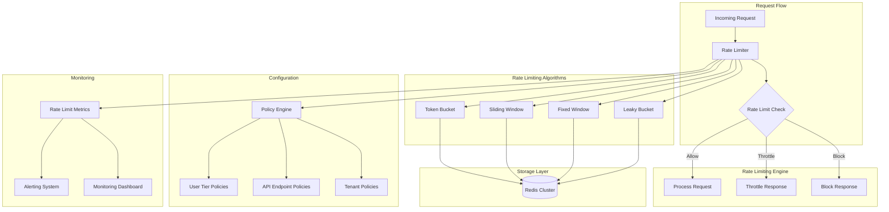

# Rate Limiting and Throttling Mechanisms

## Overview
This document outlines comprehensive rate limiting and throttling strategies for the Atlassian API Gateway, ensuring fair resource usage, preventing abuse, and maintaining service quality across different user tiers and usage patterns.

## Rate Limiting Architecture



## Rate Limiting Strategies

### 1. Multi-Dimensional Rate Limiting
```yaml
rate_limiting_dimensions:
  user_based:
    description: "Rate limits per authenticated user"
    key_pattern: "user:{user_id}"
    algorithms: ["token_bucket", "sliding_window"]
    
  api_key_based:
    description: "Rate limits per API key"
    key_pattern: "api_key:{api_key_hash}"
    algorithms: ["token_bucket", "fixed_window"]
    
  ip_based:
    description: "Rate limits per IP address"
    key_pattern: "ip:{ip_address}"
    algorithms: ["sliding_window", "leaky_bucket"]
    
  tenant_based:
    description: "Rate limits per tenant/organization"
    key_pattern: "tenant:{tenant_id}"
    algorithms: ["token_bucket"]
    
  endpoint_based:
    description: "Rate limits per API endpoint"
    key_pattern: "endpoint:{endpoint_path}"
    algorithms: ["fixed_window", "sliding_window"]
    
  service_based:
    description: "Rate limits per backend service"
    key_pattern: "service:{service_name}"
    algorithms: ["token_bucket", "circuit_breaker"]
    
  geographic_based:
    description: "Rate limits per geographic region"
    key_pattern: "geo:{country_code}"
    algorithms: ["sliding_window"]
```

### 2. Hierarchical Rate Limiting
```yaml
hierarchical_limits:
  global_limits:
    description: "System-wide rate limits"
    priority: 1
    limits:
      requests_per_second: 10000
      requests_per_minute: 500000
      requests_per_hour: 20000000
    
  tenant_limits:
    description: "Per-tenant rate limits"
    priority: 2
    enterprise_tier:
      requests_per_second: 1000
      requests_per_minute: 50000
      requests_per_hour: 2000000
      burst_capacity: 2000
    
    professional_tier:
      requests_per_second: 500
      requests_per_minute: 25000
      requests_per_hour: 1000000
      burst_capacity: 1000
    
    standard_tier:
      requests_per_second: 100
      requests_per_minute: 5000
      requests_per_hour: 200000
      burst_capacity: 200
    
  user_limits:
    description: "Per-user rate limits within tenant"
    priority: 3
    admin_users:
      requests_per_second: 50
      requests_per_minute: 2500
      requests_per_hour: 100000
    
    power_users:
      requests_per_second: 25
      requests_per_minute: 1250
      requests_per_hour: 50000
    
    standard_users:
      requests_per_second: 10
      requests_per_minute: 500
      requests_per_hour: 20000
    
  api_key_limits:
    description: "Per-API key rate limits"
    priority: 4
    service_keys:
      requests_per_second: 100
      requests_per_minute: 5000
      requests_per_hour: 200000
    
    user_keys:
      requests_per_second: 20
      requests_per_minute: 1000
      requests_per_hour: 40000
```

## Rate Limiting Algorithms

### 1. Token Bucket Algorithm
```yaml
token_bucket_configuration:
  jira_api_limits:
    issue_operations:
      bucket_size: 100
      refill_rate: 10  # tokens per second
      refill_period: 1s
      burst_capacity: 200
      
    search_operations:
      bucket_size: 50
      refill_rate: 5
      refill_period: 1s
      burst_capacity: 100
      
    admin_operations:
      bucket_size: 20
      refill_rate: 2
      refill_period: 1s
      burst_capacity: 40
  
  confluence_api_limits:
    content_operations:
      bucket_size: 80
      refill_rate: 8
      refill_period: 1s
      burst_capacity: 160
      
    search_operations:
      bucket_size: 40
      refill_rate: 4
      refill_period: 1s
      burst_capacity: 80
      
    admin_operations:
      bucket_size: 15
      refill_rate: 1.5
      refill_period: 1s
      burst_capacity: 30
  
  implementation:
    storage: "redis"
    key_expiration: "1h"
    atomic_operations: true
    lua_scripts: true
```

### 2. Sliding Window Algorithm
```yaml
sliding_window_configuration:
  window_sizes:
    - 1m   # 1 minute window
    - 5m   # 5 minute window
    - 15m  # 15 minute window
    - 1h   # 1 hour window
    - 24h  # 24 hour window
  
  precision: "1s"  # Window precision
  
  jira_sliding_limits:
    issue_creation:
      window: "1m"
      limit: 60
      precision: "1s"
      
    bulk_operations:
      window: "5m"
      limit: 100
      precision: "5s"
      
    export_operations:
      window: "1h"
      limit: 10
      precision: "1m"
  
  confluence_sliding_limits:
    page_creation:
      window: "1m"
      limit: 30
      precision: "1s"
      
    attachment_upload:
      window: "5m"
      limit: 50
      precision: "5s"
      
    space_export:
      window: "1h"
      limit: 5
      precision: "1m"
  
  storage_optimization:
    compression: true
    cleanup_interval: "5m"
    memory_efficient: true
```

### 3. Fixed Window Algorithm
```yaml
fixed_window_configuration:
  window_duration: "1m"
  
  api_key_limits:
    read_operations:
      window: "1m"
      limit: 1000
      reset_time: "start_of_minute"
      
    write_operations:
      window: "1m"
      limit: 100
      reset_time: "start_of_minute"
      
    admin_operations:
      window: "1m"
      limit: 20
      reset_time: "start_of_minute"
  
  ip_based_limits:
    anonymous_requests:
      window: "1m"
      limit: 60
      reset_time: "start_of_minute"
      
    authenticated_requests:
      window: "1m"
      limit: 300
      reset_time: "start_of_minute"
  
  implementation:
    counter_storage: "redis"
    atomic_increment: true
    ttl_management: "automatic"
```

### 4. Leaky Bucket Algorithm
```yaml
leaky_bucket_configuration:
  bucket_capacity: 1000
  leak_rate: 10  # requests per second
  
  use_cases:
    traffic_shaping:
      description: "Smooth out bursty traffic"
      bucket_size: 500
      leak_rate: 50
      
    backend_protection:
      description: "Protect backend services from overload"
      bucket_size: 200
      leak_rate: 20
      
    quality_of_service:
      description: "Ensure consistent response times"
      bucket_size: 100
      leak_rate: 10
  
  implementation:
    processing_interval: "100ms"
    queue_management: "fifo"
    overflow_handling: "drop_oldest"
```

## Service-Specific Rate Limiting

### 1. Jira API Rate Limits
```yaml
jira_rate_limits:
  rest_api_v3:
    issue_operations:
      get_issue:
        limit: 1000
        window: "1m"
        algorithm: "sliding_window"
        
      create_issue:
        limit: 100
        window: "1m"
        algorithm: "token_bucket"
        burst_capacity: 200
        
      update_issue:
        limit: 200
        window: "1m"
        algorithm: "token_bucket"
        burst_capacity: 400
        
      delete_issue:
        limit: 50
        window: "1m"
        algorithm: "fixed_window"
    
    search_operations:
      jql_search:
        limit: 200
        window: "1m"
        algorithm: "sliding_window"
        complexity_factor: true
        
      advanced_search:
        limit: 50
        window: "1m"
        algorithm: "token_bucket"
        
    project_operations:
      get_projects:
        limit: 500
        window: "1m"
        algorithm: "sliding_window"
        
      create_project:
        limit: 10
        window: "1h"
        algorithm: "fixed_window"
        
      update_project:
        limit: 50
        window: "1m"
        algorithm: "token_bucket"
    
    admin_operations:
      user_management:
        limit: 100
        window: "1m"
        algorithm: "token_bucket"
        
      system_configuration:
        limit: 20
        window: "1m"
        algorithm: "fixed_window"
        
      bulk_operations:
        limit: 10
        window: "5m"
        algorithm: "leaky_bucket"
  
  agile_api:
    board_operations:
      get_boards:
        limit: 300
        window: "1m"
        algorithm: "sliding_window"
        
      get_board_issues:
        limit: 200
        window: "1m"
        algorithm: "token_bucket"
    
    sprint_operations:
      get_sprints:
        limit: 200
        window: "1m"
        algorithm: "sliding_window"
        
      create_sprint:
        limit: 20
        window: "1m"
        algorithm: "fixed_window"
```

### 2. Confluence API Rate Limits
```yaml
confluence_rate_limits:
  rest_api_v1:
    content_operations:
      get_content:
        limit: 800
        window: "1m"
        algorithm: "sliding_window"
        
      create_content:
        limit: 60
        window: "1m"
        algorithm: "token_bucket"
        burst_capacity: 120
        
      update_content:
        limit: 100
        window: "1m"
        algorithm: "token_bucket"
        burst_capacity: 200
        
      delete_content:
        limit: 30
        window: "1m"
        algorithm: "fixed_window"
    
    space_operations:
      get_spaces:
        limit: 400
        window: "1m"
        algorithm: "sliding_window"
        
      create_space:
        limit: 5
        window: "1h"
        algorithm: "fixed_window"
        
      update_space:
        limit: 20
        window: "1m"
        algorithm: "token_bucket"
    
    search_operations:
      cql_search:
        limit: 150
        window: "1m"
        algorithm: "sliding_window"
        complexity_factor: true
        
      content_search:
        limit: 100
        window: "1m"
        algorithm: "token_bucket"
    
    attachment_operations:
      upload_attachment:
        limit: 50
        window: "1m"
        algorithm: "leaky_bucket"
        size_factor: true
        
      download_attachment:
        limit: 200
        window: "1m"
        algorithm: "sliding_window"
    
    admin_operations:
      user_management:
        limit: 80
        window: "1m"
        algorithm: "token_bucket"
        
      space_permissions:
        limit: 40
        window: "1m"
        algorithm: "fixed_window"
        
      system_settings:
        limit: 15
        window: "1m"
        algorithm: "fixed_window"
```

## Advanced Rate Limiting Features

### 1. Dynamic Rate Limiting
```yaml
dynamic_rate_limiting:
  adaptive_limits:
    enabled: true
    adjustment_factors:
      - "system_load"
      - "response_time"
      - "error_rate"
      - "queue_depth"
    
    adjustment_rules:
      high_load:
        condition: "system_cpu > 80% OR response_time > 2s"
        action: "reduce_limits"
        factor: 0.7
        
      low_load:
        condition: "system_cpu < 40% AND response_time < 500ms"
        action: "increase_limits"
        factor: 1.3
        
      error_spike:
        condition: "error_rate > 5%"
        action: "reduce_limits"
        factor: 0.5
  
  time_based_adjustments:
    business_hours:
      schedule: "09:00-17:00 Mon-Fri"
      multiplier: 1.5
      
    off_hours:
      schedule: "17:00-09:00 Mon-Fri, Sat-Sun"
      multiplier: 0.8
      
    maintenance_window:
      schedule: "02:00-04:00 Sun"
      multiplier: 0.3
  
  user_behavior_adaptation:
    good_actors:
      criteria: "low_error_rate AND consistent_usage"
      bonus_multiplier: 1.2
      
    suspicious_actors:
      criteria: "high_error_rate OR irregular_patterns"
      penalty_multiplier: 0.5
      
    new_users:
      criteria: "account_age < 30d"
      initial_multiplier: 0.8
      ramp_up_period: "7d"
```

### 2. Quota Management
```yaml
quota_management:
  monthly_quotas:
    enterprise_tier:
      api_calls: 10000000
      data_transfer_gb: 1000
      storage_gb: 500
      
    professional_tier:
      api_calls: 5000000
      data_transfer_gb: 500
      storage_gb: 250
      
    standard_tier:
      api_calls: 1000000
      data_transfer_gb: 100
      storage_gb: 50
  
  quota_tracking:
    reset_schedule: "monthly"
    reset_day: 1
    grace_period: "24h"
    
    overage_handling:
      soft_limit: 110  # 110% of quota
      hard_limit: 120  # 120% of quota
      
      soft_limit_action: "warning_notification"
      hard_limit_action: "throttle_requests"
  
  quota_alerts:
    thresholds:
      - 75   # 75% usage warning
      - 90   # 90% usage alert
      - 100  # 100% usage critical
      
    notification_channels:
      - "email"
      - "webhook"
      - "dashboard"
```

### 3. Circuit Breaker Integration
```yaml
circuit_breaker_integration:
  rate_limit_circuit_breaker:
    failure_threshold: 10
    recovery_timeout: 30s
    half_open_max_calls: 5
    
    failure_conditions:
      - "rate_limit_exceeded"
      - "quota_exhausted"
      - "backend_unavailable"
    
    fallback_strategies:
      cached_response:
        enabled: true
        max_age: "5m"
        
      degraded_service:
        enabled: true
        reduced_functionality: true
        
      queue_request:
        enabled: true
        max_queue_size: 1000
        timeout: "30s"
  
  backend_protection:
    jira_circuit_breaker:
      failure_threshold: 5
      recovery_timeout: 60s
      rate_limit_integration: true
      
    confluence_circuit_breaker:
      failure_threshold: 5
      recovery_timeout: 60s
      rate_limit_integration: true
```

## Rate Limiting Responses

### 1. Response Headers
```yaml
rate_limit_headers:
  standard_headers:
    - "X-RateLimit-Limit: {limit}"
    - "X-RateLimit-Remaining: {remaining}"
    - "X-RateLimit-Reset: {reset_time}"
    - "X-RateLimit-Window: {window_size}"
    
  extended_headers:
    - "X-RateLimit-Type: {algorithm_type}"
    - "X-RateLimit-Scope: {scope}"
    - "X-RateLimit-Retry-After: {retry_seconds}"
    - "X-RateLimit-Quota-Remaining: {quota_remaining}"
    
  custom_headers:
    - "X-Atlassian-RateLimit-Tier: {user_tier}"
    - "X-Atlassian-RateLimit-Burst: {burst_capacity}"
    - "X-Atlassian-RateLimit-Policy: {policy_name}"
```

### 2. Error Responses
```yaml
error_responses:
  rate_limit_exceeded:
    status_code: 429
    error_code: "RATE_LIMIT_EXCEEDED"
    message: "Rate limit exceeded. Please retry after {retry_after} seconds."
    details:
      limit: "{current_limit}"
      window: "{window_size}"
      retry_after: "{retry_seconds}"
      
  quota_exhausted:
    status_code: 429
    error_code: "QUOTA_EXHAUSTED"
    message: "Monthly quota exhausted. Quota resets on {reset_date}."
    details:
      quota_limit: "{quota_limit}"
      quota_used: "{quota_used}"
      reset_date: "{reset_date}"
      
  throttled:
    status_code: 429
    error_code: "REQUEST_THROTTLED"
    message: "Request throttled due to high load. Please retry after {retry_after} seconds."
    details:
      reason: "high_system_load"
      retry_after: "{retry_seconds}"
```

## Monitoring and Analytics

### 1. Rate Limiting Metrics
```yaml
rate_limiting_metrics:
  request_metrics:
    - "requests_per_second"
    - "requests_per_minute"
    - "requests_per_hour"
    - "requests_per_day"
    
  rate_limit_metrics:
    - "rate_limit_hits"
    - "rate_limit_misses"
    - "rate_limit_violations"
    - "throttled_requests"
    
  performance_metrics:
    - "rate_limit_check_latency"
    - "redis_operation_time"
    - "cache_hit_ratio"
    - "memory_usage"
    
  user_behavior_metrics:
    - "top_rate_limited_users"
    - "top_rate_limited_endpoints"
    - "usage_patterns_by_tier"
    - "quota_utilization"
```

### 2. Alerting and Notifications
```yaml
alerting_configuration:
  rate_limit_alerts:
    high_violation_rate:
      condition: "rate_limit_violations > 1000/min"
      severity: "warning"
      notification: "ops_team"
      
    quota_exhaustion:
      condition: "quota_usage > 95%"
      severity: "critical"
      notification: "account_team"
      
    system_overload:
      condition: "throttled_requests > 50%"
      severity: "critical"
      notification: "sre_team"
  
  notification_channels:
    email:
      enabled: true
      recipients: ["ops@company.com", "sre@company.com"]
      
    slack:
      enabled: true
      webhook_url: "${SLACK_WEBHOOK_URL}"
      channel: "#api-gateway-alerts"
      
    pagerduty:
      enabled: true
      service_key: "${PAGERDUTY_SERVICE_KEY}"
      
    webhook:
      enabled: true
      url: "${WEBHOOK_URL}"
      headers:
        Authorization: "Bearer ${WEBHOOK_TOKEN}"
```

## Configuration Management

### 1. Policy Configuration
```yaml
policy_configuration:
  configuration_sources:
    - "environment_variables"
    - "configuration_files"
    - "database"
    - "external_api"
    
  hot_reload:
    enabled: true
    check_interval: "30s"
    graceful_transition: true
    
  validation:
    schema_validation: true
    conflict_detection: true
    impact_analysis: true
    
  versioning:
    version_control: true
    rollback_capability: true
    change_history: true
```

### 2. A/B Testing for Rate Limits
```yaml
ab_testing:
  experiments:
    - name: "increased_jira_limits"
      description: "Test 20% increase in Jira API limits"
      traffic_split: 10  # 10% of traffic
      duration: "7d"
      
      control_group:
        jira_issue_limit: 100
        
      treatment_group:
        jira_issue_limit: 120
        
      success_metrics:
        - "user_satisfaction"
        - "api_success_rate"
        - "system_performance"
    
    - name: "dynamic_confluence_limits"
      description: "Test dynamic rate limiting for Confluence"
      traffic_split: 5   # 5% of traffic
      duration: "14d"
      
      control_group:
        algorithm: "fixed_window"
        
      treatment_group:
        algorithm: "adaptive_token_bucket"
        
      success_metrics:
        - "response_time"
        - "throughput"
        - "error_rate"