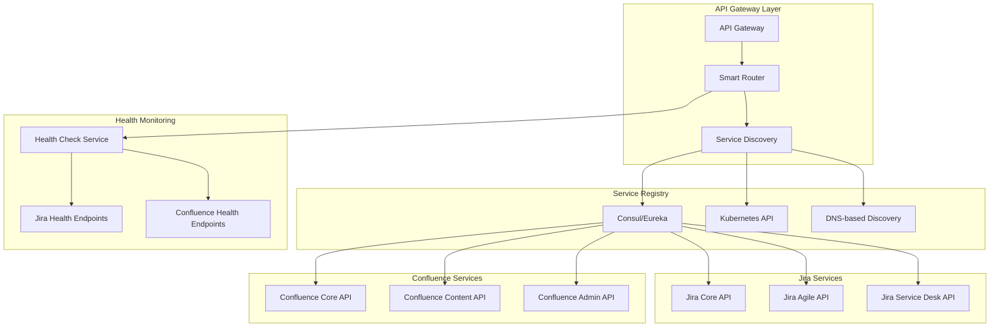

# Routing and Service Discovery for Atlassian Services

## Overview
This document details the routing mechanisms and service discovery patterns for the API Gateway handling Jira and Confluence services in a cloud-native environment.

## Service Discovery Architecture



## Routing Strategies

### 1. Path-Based Routing
```yaml
# Example routing configuration
routes:
  jira:
    - path: "/api/v2/jira/issues/*"
      service: "jira-core-api"
      methods: ["GET", "POST", "PUT", "DELETE"]
    - path: "/api/v2/jira/projects/*"
      service: "jira-core-api"
      methods: ["GET", "POST", "PUT"]
    - path: "/api/v2/jira/agile/*"
      service: "jira-agile-api"
      methods: ["GET", "POST", "PUT"]
    - path: "/api/v2/jira/servicedesk/*"
      service: "jira-servicedesk-api"
      methods: ["GET", "POST", "PUT", "DELETE"]

  confluence:
    - path: "/api/v2/confluence/content/*"
      service: "confluence-content-api"
      methods: ["GET", "POST", "PUT", "DELETE"]
    - path: "/api/v2/confluence/spaces/*"
      service: "confluence-core-api"
      methods: ["GET", "POST", "PUT", "DELETE"]
    - path: "/api/v2/confluence/admin/*"
      service: "confluence-admin-api"
      methods: ["GET", "POST", "PUT"]
```

### 2. Header-Based Routing
```yaml
# Service version routing based on headers
header_routing:
  - header: "X-Atlassian-Service"
    rules:
      - value: "jira-v8"
        service: "jira-v8-cluster"
      - value: "jira-v9"
        service: "jira-v9-cluster"
      - value: "confluence-v7"
        service: "confluence-v7-cluster"
      - value: "confluence-v8"
        service: "confluence-v8-cluster"
```

### 3. Tenant-Based Routing
```yaml
# Multi-tenant routing configuration
tenant_routing:
  - tenant_header: "X-Tenant-ID"
    rules:
      - tenant: "enterprise-customer-1"
        jira_service: "jira-enterprise-cluster-1"
        confluence_service: "confluence-enterprise-cluster-1"
      - tenant: "startup-customer-1"
        jira_service: "jira-shared-cluster"
        confluence_service: "confluence-shared-cluster"
```

## Service Discovery Implementation

### 1. Kubernetes Native Discovery
```yaml
# Kubernetes Service Discovery
apiVersion: v1
kind: Service
metadata:
  name: jira-core-api
  labels:
    app: jira-core
    version: v9.0
spec:
  selector:
    app: jira-core
  ports:
  - port: 8080
    targetPort: 8080
  type: ClusterIP

---
apiVersion: apps/v1
kind: Deployment
metadata:
  name: jira-core-api
spec:
  replicas: 3
  selector:
    matchLabels:
      app: jira-core
  template:
    metadata:
      labels:
        app: jira-core
        version: v9.0
    spec:
      containers:
      - name: jira-core
        image: atlassian/jira-software:9.0
        ports:
        - containerPort: 8080
        readinessProbe:
          httpGet:
            path: /status
            port: 8080
          initialDelaySeconds: 30
          periodSeconds: 10
```

### 2. Consul-Based Service Registry
```json
{
  "service": {
    "name": "jira-core-api",
    "id": "jira-core-api-1",
    "tags": ["jira", "core", "v9.0"],
    "address": "10.0.1.100",
    "port": 8080,
    "check": {
      "http": "http://10.0.1.100:8080/status",
      "interval": "10s",
      "timeout": "3s"
    },
    "meta": {
      "version": "9.0.1",
      "environment": "production",
      "capacity": "1000"
    }
  }
}
```

### 3. DNS-Based Discovery
```yaml
# DNS SRV records for service discovery
_jira-core._tcp.atlassian.local. 300 IN SRV 10 5 8080 jira-core-1.atlassian.local.
_jira-core._tcp.atlassian.local. 300 IN SRV 10 5 8080 jira-core-2.atlassian.local.
_jira-core._tcp.atlassian.local. 300 IN SRV 10 5 8080 jira-core-3.atlassian.local.

_confluence-content._tcp.atlassian.local. 300 IN SRV 10 5 8090 confluence-1.atlassian.local.
_confluence-content._tcp.atlassian.local. 300 IN SRV 10 5 8090 confluence-2.atlassian.local.
```

## Advanced Routing Features

### 1. Weighted Routing for Canary Deployments
```yaml
weighted_routing:
  jira-core-api:
    - service: "jira-core-v9.0"
      weight: 90
    - service: "jira-core-v9.1-canary"
      weight: 10
  
  confluence-content-api:
    - service: "confluence-content-v7.19"
      weight: 80
    - service: "confluence-content-v8.0-canary"
      weight: 20
```

### 2. Geographic Routing
```yaml
geographic_routing:
  regions:
    - region: "us-east-1"
      services:
        jira: "jira-us-east-cluster"
        confluence: "confluence-us-east-cluster"
    - region: "eu-west-1"
      services:
        jira: "jira-eu-west-cluster"
        confluence: "confluence-eu-west-cluster"
    - region: "ap-southeast-1"
      services:
        jira: "jira-apac-cluster"
        confluence: "confluence-apac-cluster"
```

### 3. Circuit Breaker Integration
```yaml
circuit_breaker:
  jira-core-api:
    failure_threshold: 5
    recovery_timeout: 30s
    half_open_max_calls: 3
    fallback_service: "jira-readonly-cache"
  
  confluence-content-api:
    failure_threshold: 3
    recovery_timeout: 60s
    half_open_max_calls: 2
    fallback_service: "confluence-static-content"
```

## Request Transformation and Middleware

### 1. Request/Response Transformation
```yaml
transformations:
  jira_api_v2_to_v3:
    request:
      - path_rewrite: "/api/v2/jira/(.*)" -> "/rest/api/3/$1"
      - header_add: "Accept: application/json"
      - header_remove: "X-Legacy-Auth"
    response:
      - header_add: "X-API-Version: v3"
      - body_transform: "legacy_to_v3_format"

  confluence_content_enrichment:
    request:
      - query_param_add: "expand=body.storage,version"
    response:
      - header_add: "X-Content-Type: confluence-page"
```

### 2. Middleware Pipeline
```yaml
middleware_pipeline:
  global:
    - cors_handler
    - request_logger
    - rate_limiter
    - authentication
    - authorization
  
  jira_specific:
    - jira_project_validator
    - jira_permission_checker
    - jira_audit_logger
  
  confluence_specific:
    - confluence_space_validator
    - confluence_content_transformer
    - confluence_macro_processor
```

## Service Health and Monitoring

### 1. Health Check Configuration
```yaml
health_checks:
  jira-core-api:
    endpoint: "/status"
    method: "GET"
    expected_status: 200
    timeout: 5s
    interval: 10s
    unhealthy_threshold: 3
    healthy_threshold: 2
  
  confluence-content-api:
    endpoint: "/status"
    method: "GET"
    expected_status: 200
    timeout: 3s
    interval: 15s
    unhealthy_threshold: 2
    healthy_threshold: 3
```

### 2. Service Metrics Collection
```yaml
metrics:
  service_discovery:
    - service_registration_count
    - service_deregistration_count
    - healthy_service_count
    - unhealthy_service_count
  
  routing:
    - request_routing_latency
    - routing_decision_time
    - failed_routing_attempts
    - successful_route_matches
```

## Implementation Considerations

### 1. Performance Optimization
- **Connection Pooling**: Maintain persistent connections to backend services
- **DNS Caching**: Cache DNS lookups for service discovery
- **Route Caching**: Cache routing decisions for frequently accessed paths

### 2. Fault Tolerance
- **Retry Logic**: Exponential backoff for failed service calls
- **Timeout Management**: Configurable timeouts per service
- **Graceful Degradation**: Fallback to cached responses when services are unavailable

### 3. Security Integration
- **Service-to-Service Authentication**: mTLS for backend communication
- **Route-Level Security**: Different security policies per route
- **Service Mesh Integration**: Istio/Linkerd for secure service communication