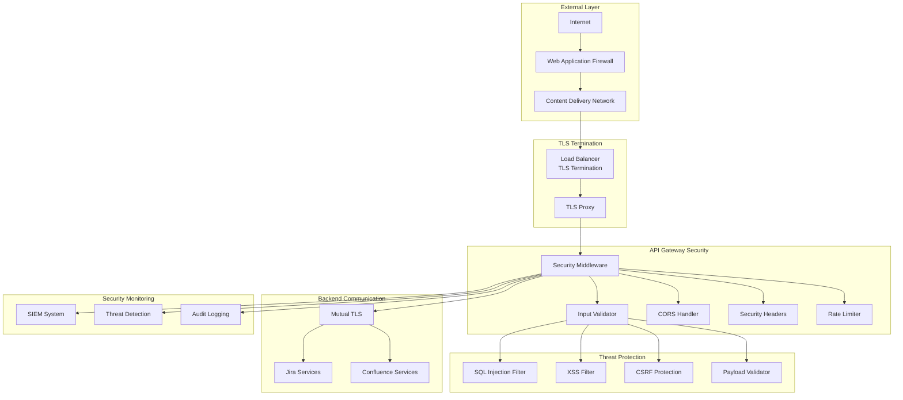

# Security Implementations for Atlassian API Gateway

## Overview
This document outlines comprehensive security implementations for the Atlassian API Gateway, covering TLS/SSL configuration, input validation, CORS policies, and additional security measures to protect against common threats and vulnerabilities.

## Security Architecture



## TLS/SSL Configuration

### 1. TLS Termination and Configuration
```yaml
tls_configuration:
  termination_points:
    load_balancer:
      provider: "aws_alb"  # or azure_lb, gcp_lb
      ssl_policy: "ELBSecurityPolicy-TLS-1-2-2017-01"
      protocols:
        - "TLSv1.2"
        - "TLSv1.3"
      
      cipher_suites:
        - "ECDHE-RSA-AES256-GCM-SHA384"
        - "ECDHE-RSA-AES128-GCM-SHA256"
        - "ECDHE-RSA-AES256-SHA384"
        - "ECDHE-RSA-AES128-SHA256"
        - "AES256-GCM-SHA384"
        - "AES128-GCM-SHA256"
      
      certificate_management:
        provider: "aws_acm"  # or let's_encrypt, custom
        auto_renewal: true
        certificate_transparency: true
        
    api_gateway:
      ssl_protocols:
        - "TLSv1.2"
        - "TLSv1.3"
      
      ssl_ciphers:
        - "ECDHE+AESGCM"
        - "ECDHE+CHACHA20"
        - "DHE+AESGCM"
        - "DHE+CHACHA20"
        - "!aNULL"
        - "!MD5"
        - "!DSS"
      
      ssl_prefer_server_ciphers: true
      ssl_session_cache: "shared:SSL:10m"
      ssl_session_timeout: "10m"
      
      hsts_configuration:
        enabled: true
        max_age: 31536000  # 1 year
        include_subdomains: true
        preload: true

  certificate_management:
    primary_certificate:
      domains:
        - "api.atlassian.company.com"
        - "*.api.atlassian.company.com"
      key_algorithm: "RSA"
      key_size: 2048
      validity_period: "1y"
      
    backup_certificate:
      domains:
        - "api-backup.atlassian.company.com"
      key_algorithm: "ECDSA"
      key_size: 256
      validity_period: "1y"
    
    certificate_rotation:
      auto_rotation: true
      rotation_threshold: "30d"  # Rotate 30 days before expiry
      notification_threshold: "7d"
      
    certificate_pinning:
      enabled: true
      pin_type: "public_key"
      backup_pins: 2
      max_age: "60d"
```

### 2. Mutual TLS (mTLS) for Backend Communication
```yaml
mtls_configuration:
  backend_services:
    jira_services:
      enabled: true
      client_certificate: "/etc/ssl/certs/api-gateway-client.crt"
      client_key: "/etc/ssl/private/api-gateway-client.key"
      ca_certificate: "/etc/ssl/certs/jira-ca.crt"
      verify_mode: "strict"
      
    confluence_services:
      enabled: true
      client_certificate: "/etc/ssl/certs/api-gateway-client.crt"
      client_key: "/etc/ssl/private/api-gateway-client.key"
      ca_certificate: "/etc/ssl/certs/confluence-ca.crt"
      verify_mode: "strict"
  
  certificate_validation:
    verify_hostname: true
    verify_certificate_chain: true
    check_certificate_revocation: true
    allowed_certificate_purposes:
      - "server_auth"
      - "client_auth"
    
  connection_security:
    min_tls_version: "1.2"
    cipher_suite_selection: "secure_only"
    perfect_forward_secrecy: true
    session_resumption: false
```

## Input Validation and Sanitization

### 1. Request Validation Framework
```yaml
input_validation:
  validation_layers:
    - "schema_validation"
    - "data_type_validation"
    - "business_rule_validation"
    - "security_validation"
  
  schema_validation:
    openapi_spec: true
    json_schema: true
    xml_schema: true
    
    validation_rules:
      strict_mode: true
      additional_properties: false
      required_fields_enforcement: true
      data_type_coercion: false
  
  security_validation:
    sql_injection:
      enabled: true
      patterns:
        - "(?i)(union|select|insert|update|delete|drop|create|alter|exec|execute)"
        - "(?i)(script|javascript|vbscript|onload|onerror|onclick)"
        - "(?i)(<script|</script|<iframe|</iframe)"
      
      sanitization:
        escape_sql_chars: true
        remove_sql_keywords: true
        parameterized_queries_only: true
    
    xss_protection:
      enabled: true
      patterns:
        - "(?i)(<script|</script|javascript:|vbscript:|onload=|onerror=)"
        - "(?i)(alert\\(|confirm\\(|prompt\\(|document\\.)"
        - "(?i)(<iframe|<object|<embed|<applet)"
      
      sanitization:
        html_encode: true
        remove_script_tags: true
        whitelist_tags: ["b", "i", "u", "strong", "em"]
    
    command_injection:
      enabled: true
      patterns:
        - "(?i)(;|\\||&&|\\$\\(|`|\\$\\{)"
        - "(?i)(rm |del |format |shutdown |reboot)"
        - "(?i)(wget |curl |nc |netcat)"
      
      sanitization:
        escape_shell_chars: true
        remove_dangerous_chars: true
    
    path_traversal:
      enabled: true
      patterns:
        - "(\\.\\./|\\.\\.\\\\)"
        - "(?i)(etc/passwd|windows/system32)"
        - "(\\x00|%00|\\0)"
      
      sanitization:
        normalize_paths: true
        restrict_to_allowed_dirs: true
```

### 2. Payload Validation
```yaml
payload_validation:
  size_limits:
    max_request_size: "10MB"
    max_header_size: "8KB"
    max_url_length: "2048"
    max_query_params: 100
    max_form_fields: 100
    
  content_type_validation:
    allowed_types:
      - "application/json"
      - "application/xml"
      - "application/x-www-form-urlencoded"
      - "multipart/form-data"
      - "text/plain"
    
    strict_validation: true
    charset_validation: true
    
  file_upload_validation:
    max_file_size: "50MB"
    allowed_extensions:
      - ".jpg"
      - ".jpeg"
      - ".png"
      - ".gif"
      - ".pdf"
      - ".doc"
      - ".docx"
      - ".xls"
      - ".xlsx"
    
    virus_scanning: true
    content_type_verification: true
    filename_sanitization: true
    
  json_validation:
    max_depth: 10
    max_array_length: 1000
    max_string_length: 10000
    max_number_value: 1000000
    
    dangerous_patterns:
      - "eval("
      - "Function("
      - "__proto__"
      - "constructor"
      - "prototype"
```

## CORS (Cross-Origin Resource Sharing) Configuration

### 1. CORS Policy Configuration
```yaml
cors_configuration:
  global_policy:
    enabled: true
    allow_credentials: true
    max_age: 86400  # 24 hours
    
  allowed_origins:
    production:
      - "https://company.atlassian.net"
      - "https://app.company.com"
      - "https://admin.company.com"
      - "https://*.company.com"
    
    development:
      - "http://localhost:3000"
      - "http://localhost:8080"
      - "https://dev.company.com"
      - "https://staging.company.com"
    
    mobile_apps:
      - "https://mobile.company.com"
      - "capacitor://localhost"
      - "ionic://localhost"
  
  allowed_methods:
    read_operations:
      - "GET"
      - "HEAD"
      - "OPTIONS"
    
    write_operations:
      - "POST"
      - "PUT"
      - "PATCH"
      - "DELETE"
  
  allowed_headers:
    standard_headers:
      - "Accept"
      - "Accept-Language"
      - "Content-Language"
      - "Content-Type"
      - "Authorization"
    
    custom_headers:
      - "X-Requested-With"
      - "X-API-Key"
      - "X-Client-Version"
      - "X-Tenant-ID"
      - "X-Atlassian-Token"
  
  exposed_headers:
    - "X-RateLimit-Limit"
    - "X-RateLimit-Remaining"
    - "X-RateLimit-Reset"
    - "X-Request-ID"
    - "X-Response-Time"

  endpoint_specific_policies:
    jira_api:
      path_pattern: "/api/v*/jira/*"
      allowed_origins:
        - "https://jira.company.com"
        - "https://*.atlassian.net"
      allowed_methods: ["GET", "POST", "PUT", "DELETE"]
      
    confluence_api:
      path_pattern: "/api/v*/confluence/*"
      allowed_origins:
        - "https://confluence.company.com"
        - "https://*.atlassian.net"
      allowed_methods: ["GET", "POST", "PUT", "DELETE"]
      
    admin_api:
      path_pattern: "/api/v*/admin/*"
      allowed_origins:
        - "https://admin.company.com"
      allowed_methods: ["GET", "POST", "PUT"]
      require_auth: true
```

### 2. Preflight Request Handling
```yaml
preflight_handling:
  cache_control:
    max_age: 86400  # 24 hours
    vary_header: "Origin, Access-Control-Request-Method, Access-Control-Request-Headers"
  
  optimization:
    cache_preflight_responses: true
    batch_preflight_requests: true
    minimize_preflight_requests: true
  
  security_checks:
    origin_validation: "strict"
    method_validation: "strict"
    header_validation: "strict"
    
  error_handling:
    invalid_origin: "block_request"
    invalid_method: "block_request"
    invalid_headers: "block_request"
    missing_origin: "allow_same_origin_only"
```

## Security Headers

### 1. HTTP Security Headers
```yaml
security_headers:
  strict_transport_security:
    enabled: true
    max_age: 31536000  # 1 year
    include_subdomains: true
    preload: true
    
  content_security_policy:
    enabled: true
    policy: |
      default-src 'self';
      script-src 'self' 'unsafe-inline' https://cdn.company.com;
      style-src 'self' 'unsafe-inline' https://fonts.googleapis.com;
      img-src 'self' data: https:;
      font-src 'self' https://fonts.gstatic.com;
      connect-src 'self' https://api.company.com;
      frame-ancestors 'none';
      base-uri 'self';
      form-action 'self';
    report_uri: "https://csp-reports.company.com/report"
    
  x_frame_options:
    enabled: true
    value: "DENY"
    
  x_content_type_options:
    enabled: true
    value: "nosniff"
    
  x_xss_protection:
    enabled: true
    value: "1; mode=block"
    
  referrer_policy:
    enabled: true
    value: "strict-origin-when-cross-origin"
    
  permissions_policy:
    enabled: true
    policy: |
      geolocation=(),
      microphone=(),
      camera=(),
      payment=(),
      usb=(),
      magnetometer=(),
      gyroscope=(),
      speaker=()
  
  custom_headers:
    x_api_version:
      enabled: true
      value: "v2"
      
    x_powered_by:
      enabled: false  # Remove to avoid information disclosure
      
    server:
      enabled: false  # Remove to avoid information disclosure
```

### 2. API-Specific Security Headers
```yaml
api_security_headers:
  authentication_headers:
    www_authenticate:
      enabled: true
      schemes: ["Bearer", "Basic"]
      realm: "Atlassian API Gateway"
      
    authorization_required:
      enabled: true
      message: "Authorization required for this resource"
  
  rate_limiting_headers:
    x_ratelimit_limit:
      enabled: true
      format: "requests per window"
      
    x_ratelimit_remaining:
      enabled: true
      format: "remaining requests"
      
    x_ratelimit_reset:
      enabled: true
      format: "unix timestamp"
      
    retry_after:
      enabled: true
      format: "seconds"
  
  request_tracking_headers:
    x_request_id:
      enabled: true
      format: "uuid"
      
    x_correlation_id:
      enabled: true
      format: "uuid"
      
    x_response_time:
      enabled: true
      format: "milliseconds"
```

## Web Application Firewall (WAF) Integration

### 1. WAF Rules Configuration
```yaml
waf_configuration:
  provider: "aws_waf"  # or cloudflare, azure_waf
  
  rule_groups:
    owasp_top_10:
      enabled: true
      rules:
        - "sql_injection"
        - "xss_attacks"
        - "path_traversal"
        - "remote_file_inclusion"
        - "command_injection"
        - "ldap_injection"
        - "ssi_injection"
    
    rate_limiting:
      enabled: true
      rules:
        - name: "general_rate_limit"
          limit: 2000
          window: 300  # 5 minutes
          action: "block"
        
        - name: "login_rate_limit"
          path: "/auth/login"
          limit: 10
          window: 60   # 1 minute
          action: "block"
    
    geo_blocking:
      enabled: true
      blocked_countries:
        - "CN"  # Example: Block China
        - "RU"  # Example: Block Russia
      allowed_countries:
        - "US"
        - "CA"
        - "GB"
        - "AU"
        - "DE"
        - "FR"
    
    ip_reputation:
      enabled: true
      block_malicious_ips: true
      block_tor_exit_nodes: true
      block_known_scanners: true
      
    bot_protection:
      enabled: true
      challenge_suspicious_requests: true
      block_automated_tools: true
      allow_good_bots: true
      
  custom_rules:
    api_specific_protection:
      - name: "block_admin_api_from_public"
        condition: "path matches '/api/.*/admin/.*' AND source_ip not in private_ranges"
        action: "block"
        
      - name: "require_auth_header"
        condition: "path matches '/api/.*' AND authorization header missing"
        action: "challenge"
        
      - name: "block_large_payloads"
        condition: "request_size > 10MB"
        action: "block"
```

### 2. DDoS Protection
```yaml
ddos_protection:
  layer_3_4_protection:
    enabled: true
    provider: "cloud_provider"  # AWS Shield, Azure DDoS, etc.
    
    thresholds:
      packets_per_second: 1000000
      bits_per_second: "10Gbps"
      connections_per_second: 10000
    
    mitigation_actions:
      - "traffic_shaping"
      - "rate_limiting"
      - "blackholing"
      - "scrubbing"
  
  layer_7_protection:
    enabled: true
    
    detection_methods:
      - "request_rate_analysis"
      - "behavioral_analysis"
      - "signature_based_detection"
      - "machine_learning_detection"
    
    mitigation_strategies:
      - "javascript_challenge"
      - "captcha_challenge"
      - "rate_limiting"
      - "request_queuing"
      - "traffic_filtering"
  
  adaptive_protection:
    enabled: true
    learning_period: "7d"
    sensitivity: "medium"
    auto_mitigation: true
```

## API Security Best Practices

### 1. Authentication Security
```yaml
authentication_security:
  token_security:
    jwt_validation:
      verify_signature: true
      verify_expiration: true
      verify_issuer: true
      verify_audience: true
      clock_skew_tolerance: "5m"
    
    token_storage:
      secure_cookies: true
      httponly_cookies: true
      samesite_cookies: "strict"
      
    session_security:
      session_timeout: "30m"
      absolute_timeout: "8h"
      concurrent_sessions: 5
      session_fixation_protection: true
  
  password_security:
    minimum_length: 12
    complexity_requirements:
      - "uppercase_letters"
      - "lowercase_letters"
      - "numbers"
      - "special_characters"
    
    password_history: 12
    password_expiration: "90d"
    account_lockout:
      failed_attempts: 5
      lockout_duration: "15m"
      progressive_delays: true
```

### 2. Data Protection
```yaml
data_protection:
  encryption:
    data_at_rest:
      algorithm: "AES-256-GCM"
      key_management: "hsm"
      key_rotation: "quarterly"
      
    data_in_transit:
      min_tls_version: "1.2"
      cipher_suites: "strong_only"
      perfect_forward_secrecy: true
      
    sensitive_data_masking:
      credit_cards: true
      social_security_numbers: true
      email_addresses: "partial"
      phone_numbers: "partial"
  
  data_sanitization:
    output_encoding:
      html_encoding: true
      url_encoding: true
      json_encoding: true
      
    input_sanitization:
      remove_null_bytes: true
      normalize_unicode: true
      trim_whitespace: true
      
  privacy_protection:
    pii_detection: true
    data_classification: true
    retention_policies: true
    right_to_deletion: true
```

## Security Monitoring and Incident Response

### 1. Security Event Monitoring
```yaml
security_monitoring:
  event_types:
    authentication_events:
      - "login_success"
      - "login_failure"
      - "password_change"
      - "account_lockout"
      - "privilege_escalation"
    
    authorization_events:
      - "access_granted"
      - "access_denied"
      - "permission_change"
      - "role_assignment"
    
    security_events:
      - "sql_injection_attempt"
      - "xss_attempt"
      - "csrf_attempt"
      - "rate_limit_exceeded"
      - "suspicious_activity"
  
  alerting_rules:
    critical_alerts:
      - condition: "failed_login_attempts > 100 in 5m"
        severity: "critical"
        
      - condition: "sql_injection_attempts > 10 in 1m"
        severity: "critical"
        
      - condition: "privilege_escalation_detected"
        severity: "critical"
    
    warning_alerts:
      - condition: "unusual_traffic_pattern"
        severity: "warning"
        
      - condition: "rate_limit_violations > 1000 in 1h"
        severity: "warning"
```

### 2. Incident Response
```yaml
incident_response:
  automated_responses:
    account_compromise:
      - "disable_account"
      - "revoke_tokens"
      - "notify_security_team"
      - "log_incident"
    
    attack_detection:
      - "block_source_ip"
      - "increase_monitoring"
      - "alert_soc_team"
      - "preserve_evidence"
    
    system_compromise:
      - "isolate_affected_systems"
      - "preserve_forensic_data"
      - "activate_incident_response_team"
      - "notify_stakeholders"
  
  manual_procedures:
    investigation_steps:
      - "collect_logs_and_evidence"
      - "analyze_attack_vectors"
      - "assess_impact_and_scope"
      - "identify_root_cause"
      - "document_findings"
    
    recovery_steps:
      - "patch_vulnerabilities"
      - "restore_from_backups"
      - "verify_system_integrity"
      - "monitor_for_reoccurrence"
      - "update_security_controls"
```

## Compliance and Audit

### 1. Compliance Requirements
```yaml
compliance_frameworks:
  gdpr:
    data_protection: true
    consent_management: true
    right_to_deletion: true
    data_portability: true
    breach_notification: true
    
  sox:
    access_controls: true
    audit_trails: true
    segregation_of_duties: true
    change_management: true
    
  pci_dss:
    network_security: true
    access_control: true
    encryption: true
    monitoring: true
    vulnerability_management: true
    
  iso_27001:
    information_security_management: true
    risk_assessment: true
    security_controls: true
    incident_management: true
    business_continuity: true
```

### 2. Security Audit Logging
```yaml
audit_logging:
  log_retention:
    security_logs: "7y"
    access_logs: "3y"
    system_logs: "1y"
    debug_logs: "30d"
    
  log_integrity:
    digital_signatures: true
    tamper_detection: true
    centralized_logging: true
    log_encryption: true
    
  audit_reports:
    frequency: "monthly"
    automated_generation: true
    compliance_mapping: true
    executive_summary: true
    
  log_analysis:
    automated_analysis: true
    anomaly_detection: true
    correlation_rules: true
    threat_intelligence_integration: true