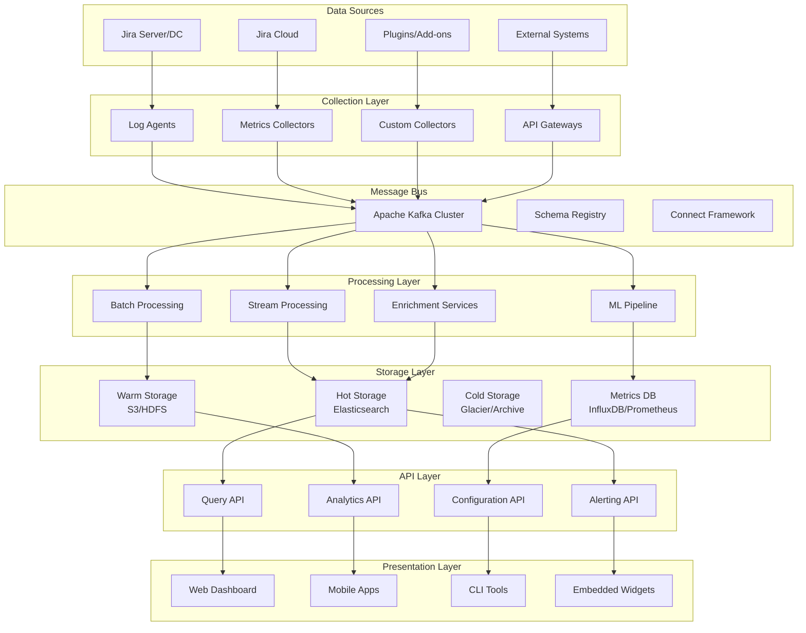
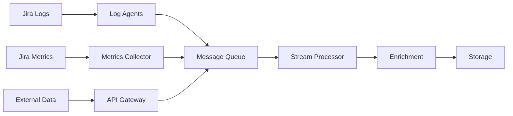
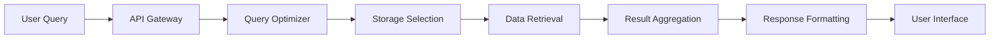

# Jira Logging and Monitoring System Architecture

## Executive Summary

This document defines the comprehensive system architecture for the Jira logging and monitoring solution. The architecture follows a microservices-based approach with clear separation of concerns, ensuring scalability, reliability, and maintainability.

## 1. Architecture Overview

### 1.1 Design Principles

#### Scalability
- **Horizontal Scaling**: All components designed for horizontal scaling
- **Load Distribution**: Even distribution of processing load across nodes
- **Auto-scaling**: Dynamic scaling based on demand and resource utilization
- **Partitioning**: Data partitioning strategies for optimal performance

#### Reliability
- **Fault Tolerance**: No single points of failure in the architecture
- **Redundancy**: Multiple instances of critical components
- **Circuit Breakers**: Protection against cascading failures
- **Graceful Degradation**: System continues operating with reduced functionality

#### Security
- **Defense in Depth**: Multiple layers of security controls
- **Zero Trust**: No implicit trust between components
- **Encryption**: End-to-end encryption for all data flows
- **Access Control**: Fine-grained access control mechanisms

#### Observability
- **Monitoring**: Comprehensive monitoring of all system components
- **Tracing**: Distributed tracing for request flow analysis
- **Logging**: Structured logging for all system activities
- **Metrics**: Real-time metrics collection and analysis

### 1.2 High-Level Architecture

## 2. Component Architecture

### 2.1 Data Collection Layer

#### Log Agents
- **Filebeat**: Lightweight log shipper for file-based logs
- **Fluentd**: Unified logging layer with plugin ecosystem
- **Vector**: High-performance observability data pipeline
- **Custom Agents**: Specialized collectors for Jira-specific data

**Key Features:**
- Multi-format log parsing (JSON, XML, plain text)
- Real-time log tailing and shipping
- Buffer management and retry mechanisms
- Metadata enrichment and tagging

#### Metrics Collectors
- **Prometheus Node Exporter**: System-level metrics collection
- **JMX Exporter**: Java application metrics via JMX
- **Custom Exporters**: Jira-specific business metrics
- **SNMP Collectors**: Network device monitoring

**Key Features:**
- Pull and push-based metric collection
- Metric aggregation and downsampling
- Label-based metric organization
- Health check and service discovery

### 2.2 Message Bus Layer

#### Apache Kafka Cluster
- **Brokers**: Distributed message brokers for high throughput
- **Topics**: Logical channels for different data types
- **Partitions**: Parallel processing and scalability
- **Replication**: Data durability and fault tolerance

**Configuration:**
- **Retention**: Configurable retention policies per topic
- **Compression**: LZ4/Snappy compression for efficiency
- **Security**: SASL/SSL authentication and encryption
- **Monitoring**: JMX metrics and health checks

#### Schema Registry
- **Schema Evolution**: Backward/forward compatibility management
- **Serialization**: Avro/JSON schema enforcement
- **Versioning**: Schema version control and migration
- **Validation**: Data quality and format validation

### 2.3 Processing Layer

#### Stream Processing (Apache Flink/Kafka Streams)
- **Real-time Processing**: Sub-second latency for critical events
- **Windowing**: Time-based and count-based windows
- **State Management**: Fault-tolerant state handling
- **Complex Event Processing**: Pattern detection and correlation

**Use Cases:**
- Real-time alerting and notifications
- Anomaly detection and security monitoring
- Live dashboard updates
- Immediate data enrichment

#### Batch Processing (Apache Spark)
- **Large-scale Analytics**: Historical data analysis
- **ETL Operations**: Extract, transform, load operations
- **Machine Learning**: Model training and inference
- **Report Generation**: Scheduled report creation

**Use Cases:**
- Daily/weekly/monthly reports
- Trend analysis and forecasting
- Data warehouse population
- Compliance reporting

### 2.4 Storage Layer

#### Hot Storage (Elasticsearch)
- **Real-time Search**: Sub-second query response times
- **Full-text Search**: Advanced text search capabilities
- **Aggregations**: Real-time analytics and dashboards
- **Scalability**: Horizontal scaling with sharding

**Configuration:**
- **Indices**: Time-based index rotation
- **Sharding**: Optimal shard size and distribution
- **Replicas**: Data redundancy and query performance
- **Lifecycle Management**: Automated index lifecycle

#### Warm Storage (Object Storage)
- **Cost-effective**: Lower cost per GB for older data
- **Compression**: High compression ratios for archival
- **Durability**: 99.999999999% durability guarantee
- **Accessibility**: On-demand data retrieval

#### Cold Storage (Archive Storage)
- **Long-term Retention**: Multi-year data retention
- **Compliance**: Regulatory compliance requirements
- **Immutability**: Write-once, read-many storage
- **Cost Optimization**: Lowest cost storage tier

#### Metrics Database (InfluxDB/Prometheus)
- **Time Series**: Optimized for time-series data
- **High Cardinality**: Support for high-cardinality metrics
- **Downsampling**: Automatic data aggregation over time
- **Retention Policies**: Configurable data retention

## 3. Network Architecture

### 3.1 Network Segmentation

#### DMZ (Demilitarized Zone)
- **Load Balancers**: External traffic entry points
- **Reverse Proxies**: SSL termination and routing
- **API Gateways**: External API access control
- **Web Servers**: Public-facing web interfaces

#### Application Zone
- **Processing Services**: Stream and batch processing
- **Application Servers**: Core business logic
- **Message Brokers**: Internal communication
- **Cache Layers**: Performance optimization

#### Data Zone
- **Database Servers**: Primary data storage
- **Backup Systems**: Data protection and recovery
- **Archive Storage**: Long-term data retention
- **Replication Services**: Data synchronization

#### Management Zone
- **Monitoring Systems**: Infrastructure monitoring
- **Configuration Management**: System configuration
- **Security Tools**: Security monitoring and analysis
- **Administrative Access**: Secure administrative interfaces

### 3.2 Security Architecture

#### Network Security
- **Firewalls**: Network-level access control
- **VPNs**: Secure remote access
- **Network Segmentation**: Micro-segmentation for isolation
- **DDoS Protection**: Distributed denial-of-service protection

#### Application Security
- **Authentication**: Multi-factor authentication
- **Authorization**: Role-based access control
- **Encryption**: Data encryption at rest and in transit
- **API Security**: OAuth 2.0/JWT token-based security

#### Data Security
- **Data Classification**: Sensitive data identification
- **Data Masking**: PII and sensitive data protection
- **Audit Logging**: Comprehensive audit trails
- **Compliance**: Regulatory compliance controls

## 4. Deployment Architecture

### 4.1 Container Orchestration (Kubernetes)

#### Cluster Architecture
- **Master Nodes**: Control plane components
- **Worker Nodes**: Application workload execution
- **etcd Cluster**: Distributed configuration store
- **Load Balancers**: Traffic distribution and failover

#### Workload Management
- **Deployments**: Application deployment and scaling
- **Services**: Service discovery and load balancing
- **ConfigMaps**: Configuration management
- **Secrets**: Sensitive data management

#### Storage Management
- **Persistent Volumes**: Stateful application storage
- **Storage Classes**: Dynamic volume provisioning
- **Backup Solutions**: Data protection and recovery
- **Disaster Recovery**: Cross-region replication

### 4.2 Multi-Environment Strategy

#### Development Environment
- **Resource Allocation**: Minimal resource requirements
- **Data Isolation**: Synthetic and anonymized data
- **Rapid Deployment**: Fast iteration and testing
- **Debug Capabilities**: Enhanced debugging and profiling

#### Staging Environment
- **Production Parity**: Mirror of production environment
- **Integration Testing**: End-to-end testing capabilities
- **Performance Testing**: Load and stress testing
- **Security Testing**: Vulnerability and penetration testing

#### Production Environment
- **High Availability**: Multi-zone deployment
- **Performance Optimization**: Optimized for production workloads
- **Security Hardening**: Production security controls
- **Monitoring**: Comprehensive monitoring and alerting

## 5. Data Flow Architecture

### 5.1 Ingestion Pipeline

#### Data Sources
- **Application Logs**: Jira application and access logs
- **System Metrics**: Infrastructure and application metrics
- **Audit Events**: Security and compliance events
- **Business Data**: Issue tracking and project metrics

#### Processing Stages
1. **Collection**: Data gathering from various sources
2. **Validation**: Data quality and format validation
3. **Enrichment**: Metadata addition and context enhancement
4. **Transformation**: Data normalization and standardization
5. **Routing**: Intelligent data routing based on content
6. **Storage**: Optimized storage based on data characteristics

### 5.2 Query Pipeline

#### Query Processing
1. **Authentication**: User identity verification
2. **Authorization**: Access permission validation
3. **Query Parsing**: Query syntax analysis and validation
4. **Optimization**: Query execution plan optimization
5. **Execution**: Distributed query execution
6. **Aggregation**: Result consolidation and formatting

## 6. Scalability Considerations

### 6.1 Horizontal Scaling Strategies

#### Stateless Services
- **Load Balancing**: Round-robin and weighted distribution
- **Auto-scaling**: CPU/memory-based scaling policies
- **Service Mesh**: Inter-service communication management
- **Circuit Breakers**: Failure isolation and recovery

#### Stateful Services
- **Sharding**: Data partitioning across nodes
- **Replication**: Master-slave and master-master replication
- **Consistent Hashing**: Distributed data placement
- **Backup and Recovery**: Data protection strategies

### 6.2 Performance Optimization

#### Caching Strategies
- **Application Cache**: In-memory application caching
- **Database Cache**: Query result caching
- **CDN**: Content delivery network for static assets
- **Edge Caching**: Geographically distributed caching

#### Database Optimization
- **Indexing**: Optimal index design and maintenance
- **Query Optimization**: Query performance tuning
- **Connection Pooling**: Database connection management
- **Read Replicas**: Read workload distribution

## 7. Disaster Recovery Architecture

### 7.1 Backup Strategy

#### Data Backup
- **Full Backups**: Complete system state snapshots
- **Incremental Backups**: Changed data since last backup
- **Differential Backups**: Changed data since last full backup
- **Continuous Backup**: Real-time data replication

#### Recovery Objectives
- **RTO (Recovery Time Objective)**: Maximum acceptable downtime
- **RPO (Recovery Point Objective)**: Maximum acceptable data loss
- **RTA (Recovery Time Actual)**: Actual recovery time achieved
- **RPA (Recovery Point Actual)**: Actual data loss experienced

### 7.2 Failover Mechanisms

#### Automatic Failover
- **Health Monitoring**: Continuous system health checks
- **Failure Detection**: Rapid failure identification
- **Failover Triggers**: Automated failover initiation
- **Service Recovery**: Automatic service restoration

#### Manual Failover
- **Planned Maintenance**: Scheduled system maintenance
- **Emergency Procedures**: Manual intervention protocols
- **Rollback Procedures**: System rollback capabilities
- **Communication Plans**: Stakeholder notification procedures

## 8. Technology Stack

### 8.1 Core Technologies

| Component | Technology | Purpose |
|-----------|------------|---------|
| Container Platform | Kubernetes | Container orchestration |
| Message Queue | Apache Kafka | Event streaming |
| Stream Processing | Apache Flink | Real-time processing |
| Batch Processing | Apache Spark | Large-scale analytics |
| Search Engine | Elasticsearch | Log search and analytics |
| Time Series DB | InfluxDB | Metrics storage |
| Visualization | Grafana/Kibana | Dashboards and visualization |
| Monitoring | Prometheus | Infrastructure monitoring |
| Service Mesh | Istio | Service communication |
| API Gateway | Kong/Envoy | API management |

### 8.2 Supporting Technologies

| Component | Technology | Purpose |
|-----------|------------|---------|
| Load Balancer | HAProxy/NGINX | Traffic distribution |
| Cache | Redis/Memcached | Performance optimization |
| Configuration | Consul/etcd | Configuration management |
| Security | Vault | Secrets management |
| CI/CD | Jenkins/GitLab | Deployment automation |
| Infrastructure | Terraform | Infrastructure as code |
| Logging | Fluentd/Filebeat | Log collection |
| Tracing | Jaeger/Zipkin | Distributed tracing |

## 9. Integration Points

### 9.1 Jira Integration

#### Native Integration
- **Jira REST API**: Direct API integration
- **Jira Events**: Webhook-based event streaming
- **Database Access**: Direct database query access
- **Plugin Framework**: Custom plugin development

#### Third-party Integration
- **Marketplace Apps**: Integration with Jira marketplace apps
- **Custom Add-ons**: Support for custom developed add-ons
- **External Tools**: Integration with development and project management tools
- **Legacy Systems**: Integration with existing enterprise systems

### 9.2 External System Integration

#### Identity Management
- **LDAP/Active Directory**: User authentication and authorization
- **SAML/OAuth**: Single sign-on integration
- **Multi-factor Authentication**: Enhanced security integration
- **Role-based Access Control**: Fine-grained permission management

#### Notification Systems
- **Email Systems**: SMTP integration for notifications
- **Slack/Teams**: Chat platform integration
- **PagerDuty**: Incident management integration
- **SMS Gateways**: Mobile notification integration

## 10. Future Considerations

### 10.1 Emerging Technologies

#### Artificial Intelligence
- **Machine Learning**: Predictive analytics and anomaly detection
- **Natural Language Processing**: Log analysis and query processing
- **Computer Vision**: Visual pattern recognition in dashboards
- **Automated Remediation**: AI-driven problem resolution

#### Edge Computing
- **Edge Analytics**: Local data processing and analysis
- **Distributed Architecture**: Geographically distributed processing
- **Bandwidth Optimization**: Reduced data transfer requirements
- **Latency Reduction**: Improved response times

### 10.2 Scalability Evolution

#### Cloud-Native Architecture
- **Serverless Computing**: Function-as-a-Service integration
- **Microservices**: Further decomposition of services
- **Event-Driven Architecture**: Reactive system design
- **Multi-Cloud Strategy**: Vendor-agnostic cloud deployment

#### Performance Enhancement
- **In-Memory Computing**: Memory-based data processing
- **GPU Acceleration**: Graphics processing unit utilization
- **Quantum Computing**: Future quantum computing integration
- **5G Networks**: High-speed network connectivity