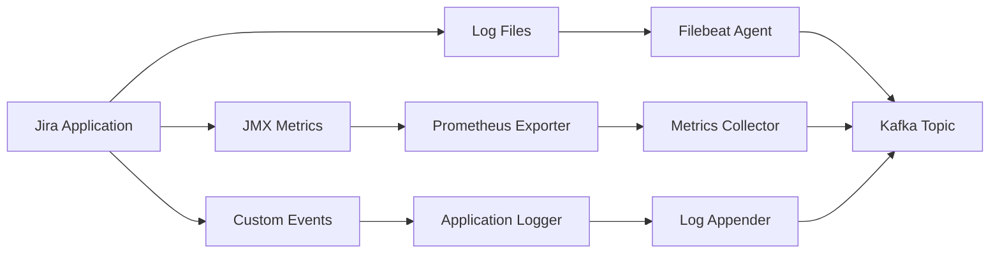
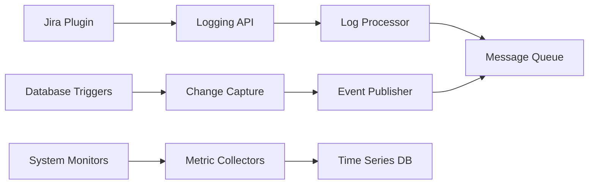
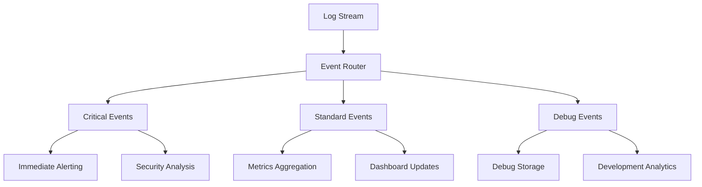
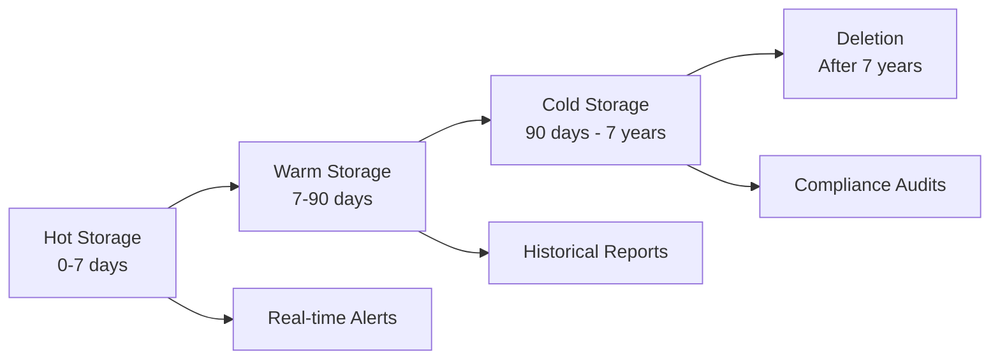

# Jira Logging Strategy

## Executive Summary

This document outlines the comprehensive logging strategy for Jira environments, defining log categories, formats, collection methods, processing pipelines, and retention policies. The strategy ensures complete observability while maintaining performance and compliance requirements.

## 1. Logging Framework Overview

### 1.1 Logging Objectives

#### Operational Excellence
- **Troubleshooting**: Rapid identification and resolution of system issues
- **Performance Monitoring**: Continuous performance tracking and optimization
- **Capacity Planning**: Data-driven infrastructure scaling decisions
- **Change Impact Analysis**: Understanding the impact of system changes

#### Security and Compliance
- **Audit Trails**: Comprehensive audit logging for compliance requirements
- **Security Monitoring**: Detection of security threats and anomalies
- **Forensic Analysis**: Detailed investigation capabilities for security incidents
- **Regulatory Compliance**: Meeting industry-specific logging requirements

#### Business Intelligence
- **User Behavior Analysis**: Understanding user interaction patterns
- **Feature Usage Tracking**: Monitoring feature adoption and usage
- **Performance Metrics**: Business-relevant performance indicators
- **Trend Analysis**: Long-term trend identification and analysis

### 1.2 Logging Principles

#### Structured Logging
- **Consistent Format**: Standardized log format across all components
- **Machine Readable**: JSON-based structured logging for automated processing
- **Contextual Information**: Rich context for effective log analysis
- **Correlation IDs**: Request tracing across distributed components

#### Performance Conscious
- **Minimal Overhead**: Logging with minimal impact on application performance
- **Asynchronous Processing**: Non-blocking log processing
- **Efficient Serialization**: Optimized data serialization formats
- **Resource Management**: Controlled resource usage for logging operations

#### Security First
- **Data Sanitization**: Automatic removal of sensitive information
- **Access Control**: Role-based access to log data
- **Encryption**: Secure transmission and storage of log data
- **Audit Logging**: Logging of access to log data itself

## 2. Log Categories and Types

### 2.1 Application Logs

#### User Activity Logs
```json
{
  "timestamp": "2024-01-15T10:30:00.123Z",
  "level": "INFO",
  "category": "user_activity",
  "event_type": "issue_created",
  "correlation_id": "req_abc123def456",
  "session_id": "sess_789xyz012",
  "user": {
    "id": "john.doe",
    "display_name": "John Doe",
    "email": "john.doe@company.com",
    "groups": ["developers", "project-leads"]
  },
  "issue": {
    "key": "PROJ-123",
    "project": "PROJ",
    "issue_type": "Bug",
    "priority": "High",
    "status": "Open"
  },
  "client": {
    "ip_address": "192.168.1.100",
    "user_agent": "Mozilla/5.0 (Windows NT 10.0; Win64; x64) AppleWebKit/537.36",
    "browser": "Chrome",
    "version": "91.0.4472.124"
  },
  "performance": {
    "response_time_ms": 245,
    "database_queries": 3,
    "cache_hits": 2,
    "cache_misses": 1
  }
}
```

#### System Event Logs
```json
{
  "timestamp": "2024-01-15T10:30:00.123Z",
  "level": "INFO",
  "category": "system_event",
  "event_type": "application_startup",
  "correlation_id": "sys_startup_001",
  "application": {
    "name": "jira",
    "version": "8.20.1",
    "build": "820001",
    "node_id": "jira-node-01"
  },
  "system": {
    "hostname": "jira-prod-01",
    "os": "Linux",
    "os_version": "Ubuntu 20.04.3 LTS",
    "java_version": "11.0.12",
    "memory_total_mb": 16384,
    "memory_available_mb": 12288
  },
  "configuration": {
    "database_url": "postgresql://jira-db:5432/jira",
    "cluster_mode": "data_center",
    "plugins_enabled": 47,
    "custom_fields": 23
  }
}
```

#### Error and Exception Logs
```json
{
  "timestamp": "2024-01-15T10:30:00.123Z",
  "level": "ERROR",
  "category": "application_error",
  "event_type": "database_connection_failed",
  "correlation_id": "req_abc123def456",
  "error": {
    "type": "SQLException",
    "message": "Connection to database failed: timeout after 30 seconds",
    "code": "08001",
    "stack_trace": "java.sql.SQLException: Connection timeout...",
    "cause": "Network connectivity issue"
  },
  "context": {
    "operation": "issue_search",
    "user_id": "john.doe",
    "query": "project = PROJ AND status = Open",
    "database_pool": {
      "active_connections": 45,
      "max_connections": 50,
      "idle_connections": 2
    }
  },
  "impact": {
    "affected_users": 1,
    "operation_failed": true,
    "retry_attempted": true,
    "fallback_used": false
  }
}
```

### 2.2 Security and Audit Logs

#### Authentication Events
```json
{
  "timestamp": "2024-01-15T10:30:00.123Z",
  "level": "INFO",
  "category": "security_audit",
  "event_type": "user_login_success",
  "correlation_id": "auth_abc123",
  "authentication": {
    "user_id": "john.doe",
    "method": "ldap",
    "source_ip": "192.168.1.100",
    "user_agent": "Mozilla/5.0...",
    "session_id": "sess_789xyz012",
    "mfa_used": true,
    "mfa_method": "totp"
  },
  "security_context": {
    "risk_score": "low",
    "geo_location": "New York, US",
    "device_fingerprint": "fp_device123",
    "previous_login": "2024-01-14T15:22:00.000Z",
    "failed_attempts": 0
  }
}
```

#### Authorization Events
```json
{
  "timestamp": "2024-01-15T10:30:00.123Z",
  "level": "WARN",
  "category": "security_audit",
  "event_type": "permission_denied",
  "correlation_id": "authz_def456",
  "authorization": {
    "user_id": "jane.smith",
    "requested_action": "delete_issue",
    "resource": "PROJ-456",
    "resource_type": "issue",
    "permission_required": "DELETE_ISSUES",
    "result": "denied",
    "reason": "insufficient_permissions"
  },
  "context": {
    "user_groups": ["users", "testers"],
    "project_permissions": ["BROWSE_PROJECTS", "CREATE_ISSUES"],
    "global_permissions": ["JIRA_USERS"],
    "admin_override": false
  }
}
```

#### Administrative Actions
```json
{
  "timestamp": "2024-01-15T10:30:00.123Z",
  "level": "INFO",
  "category": "admin_audit",
  "event_type": "user_permission_granted",
  "correlation_id": "admin_ghi789",
  "administrative_action": {
    "actor": "admin.user",
    "action": "grant_permission",
    "target_user": "new.developer",
    "permission": "ADMINISTER_PROJECTS",
    "scope": "project:PROJ",
    "effective_date": "2024-01-15T10:30:00.123Z",
    "expiry_date": null
  },
  "justification": {
    "reason": "New team member onboarding",
    "ticket_reference": "HR-789",
    "approved_by": "manager.user",
    "approval_date": "2024-01-14T16:45:00.000Z"
  }
}
```

### 2.3 Performance and Monitoring Logs

#### Request Performance Logs
```json
{
  "timestamp": "2024-01-15T10:30:00.123Z",
  "level": "INFO",
  "category": "performance",
  "event_type": "request_completed",
  "correlation_id": "req_abc123def456",
  "request": {
    "method": "GET",
    "uri": "/rest/api/2/search",
    "query_parameters": "jql=project%3DPROJ",
    "user_id": "john.doe",
    "session_id": "sess_789xyz012"
  },
  "performance_metrics": {
    "total_time_ms": 1250,
    "database_time_ms": 890,
    "cache_time_ms": 45,
    "rendering_time_ms": 315,
    "network_time_ms": 0,
    "cpu_time_ms": 780,
    "memory_used_mb": 12.5
  },
  "database_metrics": {
    "queries_executed": 5,
    "rows_returned": 247,
    "index_scans": 3,
    "sequential_scans": 2,
    "cache_hit_ratio": 0.85
  },
  "result": {
    "status_code": 200,
    "response_size_bytes": 15420,
    "issues_returned": 25,
    "total_issues": 247
  }
}
```

#### System Resource Logs
```json
{
  "timestamp": "2024-01-15T10:30:00.123Z",
  "level": "INFO",
  "category": "system_metrics",
  "event_type": "resource_utilization",
  "correlation_id": "sys_metrics_001",
  "system_resources": {
    "cpu": {
      "usage_percent": 65.2,
      "load_average_1m": 2.1,
      "load_average_5m": 1.8,
      "load_average_15m": 1.5,
      "context_switches": 15420,
      "interrupts": 8930
    },
    "memory": {
      "total_mb": 16384,
      "used_mb": 12288,
      "free_mb": 4096,
      "cached_mb": 2048,
      "swap_used_mb": 512,
      "swap_total_mb": 4096
    },
    "disk": {
      "root_usage_percent": 78.5,
      "data_usage_percent": 65.2,
      "iops_read": 450,
      "iops_write": 230,
      "throughput_read_mbps": 45.2,
      "throughput_write_mbps": 23.1
    },
    "network": {
      "bytes_in": 1048576,
      "bytes_out": 2097152,
      "packets_in": 1024,
      "packets_out": 1536,
      "errors_in": 0,
      "errors_out": 0
    }
  },
  "jvm_metrics": {
    "heap_used_mb": 8192,
    "heap_max_mb": 12288,
    "heap_usage_percent": 66.7,
    "non_heap_used_mb": 256,
    "gc_collections": 15,
    "gc_time_ms": 450,
    "threads_active": 89,
    "threads_peak": 125
  }
}
```

### 2.4 Integration and API Logs

#### REST API Logs
```json
{
  "timestamp": "2024-01-15T10:30:00.123Z",
  "level": "INFO",
  "category": "api_access",
  "event_type": "rest_api_call",
  "correlation_id": "api_jkl012",
  "api_request": {
    "method": "POST",
    "endpoint": "/rest/api/2/issue",
    "version": "2",
    "client_id": "jenkins_integration",
    "authentication_method": "oauth",
    "source_ip": "10.0.1.50",
    "user_agent": "Jenkins/2.401.3"
  },
  "request_data": {
    "content_type": "application/json",
    "content_length": 1024,
    "parameters": {
      "project": "PROJ",
      "issuetype": "Bug",
      "summary": "Automated test failure"
    }
  },
  "response_data": {
    "status_code": 201,
    "response_time_ms": 345,
    "content_length": 512,
    "issue_key": "PROJ-789"
  },
  "rate_limiting": {
    "requests_per_minute": 45,
    "limit_per_minute": 100,
    "remaining_requests": 55,
    "reset_time": "2024-01-15T10:31:00.000Z"
  }
}
```

#### Webhook Logs
```json
{
  "timestamp": "2024-01-15T10:30:00.123Z",
  "level": "INFO",
  "category": "webhook",
  "event_type": "webhook_delivered",
  "correlation_id": "webhook_mno345",
  "webhook": {
    "id": "webhook_123",
    "name": "Slack Integration",
    "url": "https://hooks.slack.com/services/...",
    "event_type": "issue_created",
    "trigger": "PROJ-123 created"
  },
  "delivery": {
    "attempt": 1,
    "status_code": 200,
    "response_time_ms": 156,
    "payload_size_bytes": 2048,
    "retry_count": 0,
    "next_retry": null
  },
  "payload": {
    "issue_key": "PROJ-123",
    "event_type": "issue_created",
    "user": "john.doe",
    "timestamp": "2024-01-15T10:30:00.123Z"
  }
}
```

## 3. Log Processing Pipeline

### 3.1 Collection Architecture

#### Agent-Based Collection


#### Direct Integration


### 3.2 Processing Stages

#### Stage 1: Ingestion and Validation
- **Format Validation**: Ensure log entries conform to expected schema
- **Data Quality Checks**: Identify and handle malformed or incomplete logs
- **Duplicate Detection**: Identify and handle duplicate log entries
- **Rate Limiting**: Protect downstream systems from log floods

#### Stage 2: Enrichment and Transformation
- **Metadata Addition**: Add contextual information (hostname, environment, version)
- **Geo-location**: Add geographic information based on IP addresses
- **User Context**: Enrich with user profile and group information
- **Normalization**: Standardize field names and formats across log sources

#### Stage 3: Classification and Routing
- **Log Level Classification**: Categorize logs by severity and importance
- **Content-Based Routing**: Route logs to appropriate storage and processing systems
- **Real-time Alerting**: Trigger immediate alerts for critical events
- **Batch Processing**: Queue logs for batch analysis and reporting

#### Stage 4: Storage and Indexing
- **Hot Storage**: Store recent logs in high-performance search indices
- **Warm Storage**: Move older logs to cost-effective storage with slower access
- **Cold Storage**: Archive historical logs for compliance and long-term analysis
- **Index Optimization**: Optimize search indices for query performance

### 3.3 Real-time Processing

#### Stream Processing Architecture


#### Complex Event Processing
- **Pattern Detection**: Identify complex patterns across multiple log streams
- **Correlation Analysis**: Correlate events across different systems and timeframes
- **Anomaly Detection**: Detect unusual patterns and behaviors in real-time
- **Predictive Analytics**: Use historical patterns to predict future issues

## 4. Log Retention and Lifecycle Management

### 4.1 Retention Policies

#### Hot Data (0-7 days)
- **Storage**: High-performance SSD storage
- **Access Pattern**: Frequent random access for real-time queries
- **Replication**: 3x replication for high availability
- **Backup**: Real-time replication to warm storage

#### Warm Data (7-90 days)
- **Storage**: Standard SSD or high-performance HDD
- **Access Pattern**: Occasional access for investigations and reporting
- **Compression**: 5:1 compression ratio to reduce storage costs
- **Backup**: Daily incremental backups

#### Cold Data (90 days - 7 years)
- **Storage**: Object storage or tape archives
- **Access Pattern**: Rare access for compliance and forensic analysis
- **Compression**: 10:1 compression ratio for maximum space efficiency
- **Backup**: Weekly full backups with geographic distribution

### 4.2 Data Lifecycle Automation

#### Automated Transitions


#### Lifecycle Rules
- **Age-based Transitions**: Automatic movement based on log age
- **Size-based Triggers**: Transition when storage thresholds are reached
- **Access-based Optimization**: Move frequently accessed data to faster storage
- **Compliance-based Retention**: Extend retention for compliance-critical logs

### 4.3 Data Archival and Deletion

#### Archival Process
1. **Data Validation**: Verify data integrity before archival
2. **Compression**: Apply maximum compression for long-term storage
3. **Encryption**: Encrypt archived data for security and compliance
4. **Metadata Preservation**: Maintain searchable metadata for archived data
5. **Verification**: Verify successful archival and data retrievability

#### Secure Deletion
1. **Retention Verification**: Confirm retention period has expired
2. **Legal Hold Check**: Verify no legal holds prevent deletion
3. **Secure Erasure**: Use cryptographic erasure or physical destruction
4. **Audit Logging**: Log all deletion activities for compliance
5. **Verification**: Confirm complete and irreversible deletion

## 5. Log Security and Privacy

### 5.1 Data Protection

#### Sensitive Data Handling
- **PII Detection**: Automatic detection of personally identifiable information
- **Data Masking**: Real-time masking of sensitive data in logs
- **Tokenization**: Replace sensitive values with non-sensitive tokens
- **Encryption**: Encrypt sensitive data that must be logged

#### Access Control
- **Role-Based Access**: Granular access control based on user roles
- **Attribute-Based Access**: Dynamic access control based on data attributes
- **Time-Based Access**: Temporary access grants with automatic expiration
- **Audit Logging**: Comprehensive logging of all access to log data

### 5.2 Compliance and Governance

#### Regulatory Compliance
- **GDPR Compliance**: Right to erasure and data portability
- **HIPAA Compliance**: Healthcare data protection requirements
- **SOX Compliance**: Financial data integrity and audit trails
- **PCI DSS Compliance**: Payment card industry security standards

#### Data Governance
- **Data Classification**: Automatic classification of log data by sensitivity
- **Retention Policies**: Automated enforcement of data retention requirements
- **Data Lineage**: Tracking of data flow and transformations
- **Quality Monitoring**: Continuous monitoring of data quality and completeness

## 6. Performance Optimization

### 6.1 Logging Performance

#### Application Impact Minimization
- **Asynchronous Logging**: Non-blocking log operations
- **Batching**: Batch multiple log entries for efficient processing
- **Sampling**: Intelligent sampling for high-volume debug logs
- **Circuit Breakers**: Protect applications from logging system failures

#### Resource Optimization
- **Memory Management**: Efficient memory usage for log buffers
- **CPU Optimization**: Minimize CPU overhead for log processing
- **Network Efficiency**: Compress and batch network transmissions
- **Storage Optimization**: Efficient storage formats and indexing strategies

### 6.2 Query Performance

#### Index Optimization
- **Field Selection**: Index only frequently queried fields
- **Composite Indices**: Multi-field indices for complex queries
- **Time-based Partitioning**: Partition indices by time for efficient queries
- **Index Lifecycle**: Automatic index optimization and maintenance

#### Query Optimization
- **Query Caching**: Cache frequently executed queries
- **Result Pagination**: Efficient pagination for large result sets
- **Aggregation Optimization**: Pre-computed aggregations for common queries
- **Parallel Processing**: Distribute queries across multiple nodes

## 7. Monitoring and Alerting

### 7.1 Log System Monitoring

#### Health Metrics
- **Ingestion Rate**: Logs processed per second
- **Processing Latency**: Time from log generation to availability
- **Error Rates**: Failed log processing attempts
- **Storage Utilization**: Disk space usage across storage tiers

#### Performance Metrics
- **Query Response Time**: Average and percentile query response times
- **Throughput**: Queries processed per second
- **Resource Utilization**: CPU, memory, and network usage
- **Availability**: System uptime and service availability

### 7.2 Automated Alerting

#### Critical Alerts
- **System Failures**: Log processing system failures
- **Data Loss**: Missing or corrupted log data
- **Security Incidents**: Detected security threats or breaches
- **Compliance Violations**: Regulatory compliance failures

#### Warning Alerts
- **Performance Degradation**: Slower than normal processing
- **Capacity Issues**: Approaching storage or processing limits
- **Configuration Changes**: Unauthorized system configuration changes
- **Unusual Patterns**: Anomalous log patterns or volumes

## 8. Implementation Roadmap

### 8.1 Phase 1: Foundation (Months 1-2)
- **Basic Log Collection**: Implement core log collection infrastructure
- **Storage Setup**: Deploy hot and warm storage systems
- **Security Framework**: Implement basic security and access controls
- **Monitoring**: Deploy system health monitoring

### 8.2 Phase 2: Enhancement (Months 3-4)
- **Advanced Processing**: Implement real-time processing and enrichment
- **Alerting System**: Deploy comprehensive alerting and notification
- **Dashboard Development**: Create operational and business dashboards
- **Integration**: Integrate with existing tools and systems

### 8.3 Phase 3: Optimization (Months 5-6)
- **Performance Tuning**: Optimize system performance and efficiency
- **Advanced Analytics**: Implement machine learning and predictive analytics
- **Compliance Features**: Add advanced compliance and governance features
- **Automation**: Implement automated operations and maintenance

### 8.4 Phase 4: Advanced Features (Months 7-12)
- **AI Integration**: Deploy AI-powered log analysis and insights
- **Predictive Monitoring**: Implement predictive failure detection
- **Advanced Security**: Deploy advanced threat detection and response
- **Global Deployment**: Expand to multi-region deployment

## 9. Success Metrics

### 9.1 Technical Metrics
- **Log Processing Latency**: < 5 seconds from generation to searchability
- **System Availability**: > 99.9% uptime for logging infrastructure
- **Query Performance**: < 1 second response time for 95% of queries
- **Data Integrity**: 100% data integrity with zero data loss

### 9.2 Operational Metrics
- **Mean Time to Detection**: < 5 minutes for critical issues
- **Mean Time to Resolution**: < 30 minutes for system issues
- **False Positive Rate**: < 5% for automated alerts
- **User Satisfaction**: > 90% satisfaction with logging and monitoring tools

### 9.3 Business Metrics
- **Incident Reduction**: 50% reduction in unplanned outages
- **Compliance Achievement**: 100% compliance with regulatory requirements
- **Cost Optimization**: 20% reduction in operational overhead
- **Productivity Improvement**: 25% improvement in troubleshooting efficiency