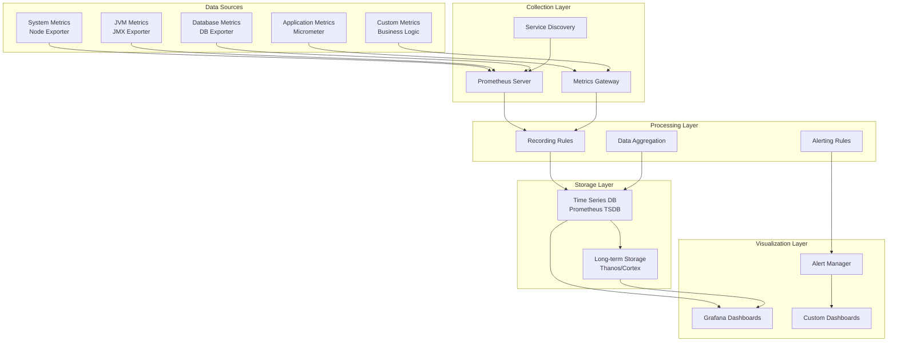
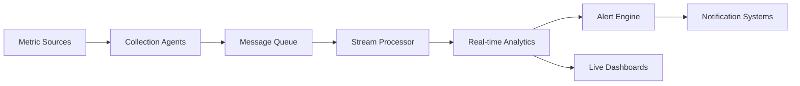
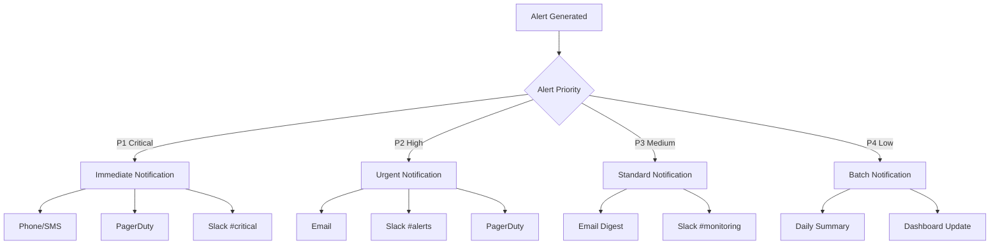

# Jira Monitoring Strategy

## Executive Summary

This document defines the comprehensive monitoring strategy for Jira environments, covering infrastructure monitoring, application performance monitoring, business metrics tracking, and user experience monitoring. The strategy ensures proactive issue detection, performance optimization, and business intelligence gathering.

## 1. Monitoring Framework Overview

### 1.1 Monitoring Objectives

#### Proactive Issue Detection
- **Early Warning Systems**: Detect issues before they impact users
- **Predictive Analytics**: Forecast potential problems based on trends
- **Anomaly Detection**: Identify unusual patterns and behaviors
- **Root Cause Analysis**: Quickly identify the source of problems

#### Performance Optimization
- **Bottleneck Identification**: Pinpoint performance constraints
- **Capacity Planning**: Data-driven infrastructure scaling decisions
- **Resource Optimization**: Efficient utilization of system resources
- **SLA Compliance**: Ensure service level agreement adherence

#### Business Intelligence
- **Usage Analytics**: Understand how Jira is being used
- **Feature Adoption**: Track adoption of new features and functionality
- **User Behavior**: Analyze user interaction patterns
- **ROI Measurement**: Measure return on investment for Jira deployment

### 1.2 Monitoring Principles

#### Comprehensive Coverage
- **Full Stack Monitoring**: Monitor all layers from infrastructure to user experience
- **End-to-End Visibility**: Track requests across all system components
- **Multi-Dimensional Metrics**: Collect metrics across time, users, and features
- **Contextual Monitoring**: Provide rich context for all metrics and alerts

#### Real-Time Insights
- **Low Latency**: Sub-second metric collection and processing
- **Streaming Analytics**: Real-time analysis of metric streams
- **Immediate Alerting**: Instant notifications for critical issues
- **Live Dashboards**: Real-time visualization of system state

#### Actionable Intelligence
- **Meaningful Metrics**: Focus on metrics that drive action
- **Clear Thresholds**: Well-defined alert thresholds and escalation paths
- **Automated Response**: Automated remediation for common issues
- **Decision Support**: Data-driven insights for operational decisions

## 2. Monitoring Categories and Metrics

### 2.1 Infrastructure Monitoring

#### System Resources
```json
{
  "timestamp": "2024-01-15T10:30:00.123Z",
  "metric_type": "system_resources",
  "host": "jira-prod-01",
  "metrics": {
    "cpu": {
      "usage_percent": 65.2,
      "load_average_1m": 2.1,
      "load_average_5m": 1.8,
      "load_average_15m": 1.5,
      "cores": 8,
      "context_switches_per_sec": 1542,
      "interrupts_per_sec": 893
    },
    "memory": {
      "total_bytes": 17179869184,
      "used_bytes": 12884901888,
      "free_bytes": 4294967296,
      "cached_bytes": 2147483648,
      "buffers_bytes": 536870912,
      "swap_used_bytes": 536870912,
      "swap_total_bytes": 4294967296,
      "usage_percent": 75.0
    },
    "disk": {
      "root_partition": {
        "total_bytes": 107374182400,
        "used_bytes": 84295146496,
        "free_bytes": 23079035904,
        "usage_percent": 78.5,
        "inodes_used": 1048576,
        "inodes_total": 6553600
      },
      "data_partition": {
        "total_bytes": 1099511627776,
        "used_bytes": 716636651520,
        "free_bytes": 382874976256,
        "usage_percent": 65.2
      },
      "io_stats": {
        "reads_per_sec": 450,
        "writes_per_sec": 230,
        "read_bytes_per_sec": 47185920,
        "write_bytes_per_sec": 24117248,
        "io_wait_percent": 5.2
      }
    },
    "network": {
      "bytes_in_per_sec": 1048576,
      "bytes_out_per_sec": 2097152,
      "packets_in_per_sec": 1024,
      "packets_out_per_sec": 1536,
      "errors_in_per_sec": 0,
      "errors_out_per_sec": 0,
      "dropped_in_per_sec": 0,
      "dropped_out_per_sec": 0
    }
  }
}
```

#### JVM Metrics
```json
{
  "timestamp": "2024-01-15T10:30:00.123Z",
  "metric_type": "jvm_metrics",
  "application": "jira",
  "instance": "jira-prod-01",
  "metrics": {
    "heap_memory": {
      "used_bytes": 8589934592,
      "max_bytes": 12884901888,
      "committed_bytes": 10737418240,
      "usage_percent": 66.7,
      "eden_space_bytes": 2147483648,
      "survivor_space_bytes": 268435456,
      "old_gen_bytes": 6174015488
    },
    "non_heap_memory": {
      "used_bytes": 268435456,
      "max_bytes": 536870912,
      "committed_bytes": 402653184,
      "metaspace_bytes": 134217728,
      "code_cache_bytes": 67108864,
      "compressed_class_space_bytes": 67108864
    },
    "garbage_collection": {
      "young_gen_collections": 15,
      "young_gen_time_ms": 450,
      "old_gen_collections": 2,
      "old_gen_time_ms": 1200,
      "total_gc_time_ms": 1650,
      "gc_overhead_percent": 0.8
    },
    "threads": {
      "active_count": 89,
      "peak_count": 125,
      "daemon_count": 45,
      "total_started": 2847,
      "deadlocked_count": 0
    },
    "class_loading": {
      "loaded_classes": 15420,
      "unloaded_classes": 234,
      "total_loaded_classes": 15654
    }
  }
}
```

#### Database Monitoring
```json
{
  "timestamp": "2024-01-15T10:30:00.123Z",
  "metric_type": "database_metrics",
  "database": "postgresql",
  "instance": "jira-db-01",
  "metrics": {
    "connections": {
      "active_connections": 45,
      "idle_connections": 15,
      "max_connections": 100,
      "connection_utilization_percent": 60.0,
      "waiting_connections": 2,
      "connection_errors": 0
    },
    "performance": {
      "queries_per_sec": 234,
      "slow_queries_per_sec": 3,
      "avg_query_time_ms": 45.2,
      "p95_query_time_ms": 156.7,
      "p99_query_time_ms": 345.8,
      "deadlocks_per_sec": 0.1,
      "lock_waits_per_sec": 2.3
    },
    "storage": {
      "database_size_bytes": 53687091200,
      "table_size_bytes": 48318382080,
      "index_size_bytes": 5368709120,
      "temp_files_bytes": 0,
      "cache_hit_ratio": 0.95,
      "index_hit_ratio": 0.98
    },
    "replication": {
      "replication_lag_ms": 150,
      "replication_status": "streaming",
      "wal_files_count": 12,
      "wal_size_bytes": 268435456
    }
  }
}
```

### 2.2 Application Performance Monitoring

#### Request Metrics
```json
{
  "timestamp": "2024-01-15T10:30:00.123Z",
  "metric_type": "request_metrics",
  "application": "jira",
  "endpoint": "/secure/Dashboard.jspa",
  "time_window": "1m",
  "metrics": {
    "request_count": 156,
    "error_count": 3,
    "error_rate_percent": 1.9,
    "response_times": {
      "min_ms": 89,
      "max_ms": 2345,
      "avg_ms": 456,
      "p50_ms": 234,
      "p90_ms": 789,
      "p95_ms": 1234,
      "p99_ms": 1890
    },
    "throughput": {
      "requests_per_sec": 2.6,
      "bytes_per_sec": 1048576,
      "concurrent_requests": 12
    },
    "status_codes": {
      "2xx": 150,
      "3xx": 3,
      "4xx": 2,
      "5xx": 1
    }
  }
}
```

#### Feature Usage Metrics
```json
{
  "timestamp": "2024-01-15T10:30:00.123Z",
  "metric_type": "feature_usage",
  "application": "jira",
  "time_window": "1h",
  "metrics": {
    "issue_operations": {
      "issues_created": 45,
      "issues_updated": 123,
      "issues_resolved": 34,
      "issues_closed": 28,
      "issues_reopened": 5,
      "comments_added": 89,
      "attachments_uploaded": 23
    },
    "search_operations": {
      "searches_performed": 234,
      "jql_searches": 156,
      "quick_searches": 78,
      "avg_search_time_ms": 345,
      "avg_results_returned": 23.4,
      "failed_searches": 5
    },
    "project_operations": {
      "projects_accessed": 12,
      "project_configurations_changed": 3,
      "permissions_modified": 2,
      "workflows_updated": 1,
      "custom_fields_modified": 0
    },
    "user_operations": {
      "logins": 67,
      "logouts": 45,
      "password_changes": 2,
      "profile_updates": 8,
      "preference_changes": 15
    }
  }
}
```

#### Plugin Performance Metrics
```json
{
  "timestamp": "2024-01-15T10:30:00.123Z",
  "metric_type": "plugin_metrics",
  "application": "jira",
  "time_window": "5m",
  "metrics": {
    "installed_plugins": 47,
    "active_plugins": 45,
    "disabled_plugins": 2,
    "plugin_performance": [
      {
        "plugin_key": "com.atlassian.jira.plugins.jira-development-integration-plugin",
        "plugin_name": "Development Integration",
        "execution_count": 234,
        "avg_execution_time_ms": 45.2,
        "max_execution_time_ms": 234.5,
        "error_count": 1,
        "memory_usage_mb": 12.5
      },
      {
        "plugin_key": "com.atlassian.servicedesk",
        "plugin_name": "Service Desk",
        "execution_count": 89,
        "avg_execution_time_ms": 123.4,
        "max_execution_time_ms": 567.8,
        "error_count": 0,
        "memory_usage_mb": 45.2
      }
    ]
  }
}
```

### 2.3 Business Metrics Monitoring

#### Project Health Metrics
```json
{
  "timestamp": "2024-01-15T10:30:00.123Z",
  "metric_type": "project_health",
  "time_window": "1d",
  "metrics": {
    "project_summary": {
      "total_projects": 25,
      "active_projects": 23,
      "archived_projects": 2,
      "avg_issues_per_project": 234.5,
      "avg_users_per_project": 12.3
    },
    "issue_metrics": {
      "total_issues": 5863,
      "open_issues": 2341,
      "in_progress_issues": 456,
      "resolved_issues": 2789,
      "closed_issues": 277,
      "issue_creation_rate_per_day": 45.2,
      "issue_resolution_rate_per_day": 38.7,
      "avg_resolution_time_hours": 72.5
    },
    "velocity_metrics": {
      "story_points_completed_per_sprint": 89.5,
      "velocity_trend": "increasing",
      "sprint_completion_rate_percent": 87.3,
      "avg_cycle_time_days": 5.2,
      "avg_lead_time_days": 8.7
    },
    "quality_metrics": {
      "bug_rate_percent": 12.3,
      "reopened_issue_rate_percent": 3.4,
      "customer_satisfaction_score": 4.2,
      "sla_compliance_rate_percent": 94.5
    }
  }
}
```

#### User Engagement Metrics
```json
{
  "timestamp": "2024-01-15T10:30:00.123Z",
  "metric_type": "user_engagement",
  "time_window": "1d",
  "metrics": {
    "user_activity": {
      "total_users": 234,
      "active_users_today": 156,
      "active_users_this_week": 198,
      "active_users_this_month": 221,
      "new_users_today": 3,
      "avg_session_duration_minutes": 45.2,
      "avg_actions_per_session": 23.4
    },
    "feature_adoption": {
      "dashboard_usage_percent": 89.2,
      "agile_boards_usage_percent": 67.8,
      "reports_usage_percent": 45.3,
      "automation_usage_percent": 23.1,
      "advanced_search_usage_percent": 34.5,
      "mobile_app_usage_percent": 12.7
    },
    "collaboration_metrics": {
      "comments_per_issue": 2.3,
      "mentions_per_day": 45,
      "watchers_per_issue": 3.4,
      "shared_dashboards": 23,
      "team_collaboration_score": 7.8
    }
  }
}
```

### 2.4 User Experience Monitoring

#### Page Performance Metrics
```json
{
  "timestamp": "2024-01-15T10:30:00.123Z",
  "metric_type": "page_performance",
  "page": "/secure/Dashboard.jspa",
  "time_window": "5m",
  "metrics": {
    "page_load_times": {
      "avg_load_time_ms": 1234,
      "p50_load_time_ms": 987,
      "p90_load_time_ms": 2345,
      "p95_load_time_ms": 3456,
      "p99_load_time_ms": 5678
    },
    "resource_timing": {
      "dns_lookup_ms": 12,
      "tcp_connect_ms": 45,
      "ssl_handshake_ms": 67,
      "server_response_ms": 234,
      "dom_processing_ms": 456,
      "resource_loading_ms": 789
    },
    "user_interactions": {
      "clicks_per_session": 12.3,
      "form_submissions": 45,
      "search_queries": 23,
      "navigation_events": 67,
      "error_events": 2
    },
    "browser_metrics": {
      "chrome_users_percent": 67.8,
      "firefox_users_percent": 23.4,
      "safari_users_percent": 6.7,
      "edge_users_percent": 2.1,
      "mobile_users_percent": 15.6
    }
  }
}
```

#### API Performance Metrics
```json
{
  "timestamp": "2024-01-15T10:30:00.123Z",
  "metric_type": "api_performance",
  "api_endpoint": "/rest/api/2/search",
  "time_window": "1m",
  "metrics": {
    "request_metrics": {
      "total_requests": 89,
      "successful_requests": 86,
      "failed_requests": 3,
      "success_rate_percent": 96.6,
      "avg_response_time_ms": 345,
      "p95_response_time_ms": 789,
      "p99_response_time_ms": 1234
    },
    "client_metrics": {
      "unique_clients": 23,
      "requests_per_client": 3.9,
      "top_clients": [
        {"client_id": "jenkins", "requests": 34},
        {"client_id": "confluence", "requests": 23},
        {"client_id": "mobile_app", "requests": 12}
      ]
    },
    "error_analysis": {
      "4xx_errors": 2,
      "5xx_errors": 1,
      "timeout_errors": 0,
      "rate_limit_errors": 0,
      "authentication_errors": 1,
      "authorization_errors": 1
    }
  }
}
```

## 3. Monitoring Architecture

### 3.1 Data Collection Architecture

#### Metrics Collection Pipeline


#### Real-time Monitoring Pipeline


### 3.2 Metric Storage Strategy

#### Time Series Database Design
- **Retention Policies**: Multi-tier retention based on metric importance
- **Downsampling**: Automatic aggregation of older data points
- **Compression**: Efficient storage of time series data
- **Partitioning**: Time-based partitioning for query performance

#### Storage Tiers
1. **High-Resolution (1-7 days)**: 15-second intervals for recent data
2. **Medium-Resolution (7-90 days)**: 5-minute intervals for historical analysis
3. **Low-Resolution (90+ days)**: 1-hour intervals for long-term trends
4. **Archive Storage**: Daily/weekly aggregates for compliance

### 3.3 Query and Analysis Engine

#### Query Optimization
- **Query Caching**: Cache frequently executed queries
- **Index Optimization**: Optimize time series indices for common query patterns
- **Parallel Processing**: Distribute queries across multiple nodes
- **Result Aggregation**: Pre-compute common aggregations

#### Analysis Capabilities
- **Statistical Analysis**: Mean, median, percentiles, standard deviation
- **Trend Analysis**: Linear regression, seasonal decomposition
- **Anomaly Detection**: Statistical and machine learning-based detection
- **Correlation Analysis**: Cross-metric correlation and causation analysis

## 4. Dashboard and Visualization Strategy

### 4.1 Dashboard Hierarchy

#### Executive Dashboards
- **System Health Overview**: High-level system status and KPIs
- **Business Metrics**: User engagement, project health, ROI metrics
- **SLA Compliance**: Service level agreement adherence tracking
- **Cost Analysis**: Infrastructure and operational cost tracking

#### Operational Dashboards
- **Infrastructure Monitoring**: Detailed system resource utilization
- **Application Performance**: Request rates, response times, error rates
- **Database Performance**: Query performance, connection pools, replication
- **Security Monitoring**: Authentication, authorization, threat detection

#### Development Dashboards
- **Application Metrics**: Feature usage, performance bottlenecks
- **Error Tracking**: Error rates, exception analysis, debugging information
- **Deployment Metrics**: Release frequency, deployment success rates
- **Code Quality**: Technical debt, test coverage, performance regression

#### Business Dashboards
- **Project Analytics**: Project health, velocity, quality metrics
- **User Analytics**: User engagement, feature adoption, satisfaction
- **Capacity Planning**: Growth trends, resource forecasting
- **ROI Analysis**: Return on investment, cost per user, efficiency metrics

### 4.2 Visualization Best Practices

#### Design Principles
- **Clarity**: Clear, unambiguous visualizations
- **Relevance**: Show only relevant information for the audience
- **Actionability**: Enable quick decision-making and action
- **Consistency**: Consistent design patterns across dashboards

#### Chart Selection
- **Time Series**: Line charts for trends over time
- **Distributions**: Histograms and box plots for data distributions
- **Comparisons**: Bar charts for categorical comparisons
- **Relationships**: Scatter plots for correlation analysis
- **Status**: Gauges and single stats for current status

### 4.3 Interactive Features

#### Drill-Down Capabilities
- **Multi-level Navigation**: Navigate from high-level to detailed views
- **Contextual Filtering**: Filter data based on selected dimensions
- **Time Range Selection**: Dynamic time range adjustment
- **Cross-Dashboard Linking**: Navigate between related dashboards

#### Collaborative Features
- **Dashboard Sharing**: Share dashboards with team members
- **Annotations**: Add contextual annotations to charts
- **Comments**: Collaborative discussion on dashboard insights
- **Export Capabilities**: Export charts and data for reporting

## 5. Alerting and Notification Strategy

### 5.1 Alert Classification

#### Critical Alerts (P1)
- **System Down**: Complete system unavailability
- **Data Loss**: Risk of data corruption or loss
- **Security Breach**: Confirmed security incidents
- **SLA Violation**: Critical SLA threshold breaches

**Response Time**: Immediate (< 5 minutes)
**Escalation**: Automatic escalation to on-call engineer
**Notification Channels**: Phone, SMS, PagerDuty, Slack

#### High Priority Alerts (P2)
- **Performance Degradation**: Significant performance issues
- **High Error Rates**: Error rates above acceptable thresholds
- **Resource Exhaustion**: Critical resource utilization
- **Integration Failures**: Third-party integration failures

**Response Time**: 15 minutes
**Escalation**: Escalate to team lead after 30 minutes
**Notification Channels**: Email, Slack, PagerDuty

#### Medium Priority Alerts (P3)
- **Capacity Warnings**: Approaching capacity limits
- **Performance Warnings**: Minor performance degradation
- **Configuration Changes**: Unauthorized configuration changes
- **Unusual Patterns**: Anomalous but non-critical patterns

**Response Time**: 1 hour
**Escalation**: Daily summary to management
**Notification Channels**: Email, Slack

#### Low Priority Alerts (P4)
- **Informational**: System status updates
- **Maintenance**: Scheduled maintenance notifications
- **Trend Alerts**: Long-term trend notifications
- **Compliance**: Compliance status updates

**Response Time**: Next business day
**Escalation**: Weekly summary reports
**Notification Channels**: Email, Dashboard notifications

### 5.2 Alert Rules and Thresholds

#### Dynamic Thresholds
- **Baseline Learning**: Establish normal behavior patterns
- **Seasonal Adjustments**: Account for daily, weekly, seasonal patterns
- **Adaptive Thresholds**: Automatically adjust based on historical data
- **Context-Aware**: Consider business context (maintenance windows, releases)

#### Multi-Condition Alerts
- **Composite Conditions**: Multiple metrics must breach thresholds
- **Time-Based Conditions**: Sustained threshold breaches over time
- **Rate-of-Change**: Alert on rapid changes rather than absolute values
- **Correlation-Based**: Alert when multiple related metrics show issues

### 5.3 Notification Management

#### Notification Routing


#### Escalation Procedures
1. **Initial Alert**: Notify primary on-call engineer
2. **Acknowledgment Timeout**: Escalate to secondary if no acknowledgment
3. **Resolution Timeout**: Escalate to team lead if not resolved
4. **Management Escalation**: Notify management for prolonged incidents
5. **Executive Escalation**: Notify executives for critical business impact

## 6. Performance Monitoring Implementation

### 6.1 Application Performance Monitoring (APM)

#### Distributed Tracing
- **Request Tracing**: Track requests across all system components
- **Service Dependencies**: Map service interactions and dependencies
- **Performance Bottlenecks**: Identify slow components in request path
- **Error Propagation**: Track how errors propagate through the system

#### Code-Level Monitoring
- **Method Performance**: Monitor individual method execution times
- **Database Queries**: Track SQL query performance and optimization
- **External API Calls**: Monitor third-party service interactions
- **Resource Usage**: Track memory, CPU usage at the code level

### 6.2 Infrastructure Performance Monitoring

#### Server Monitoring
- **Resource Utilization**: CPU, memory, disk, network monitoring
- **Process Monitoring**: Monitor critical system processes
- **Service Health**: Monitor service status and availability
- **Log Analysis**: Automated analysis of system logs for issues

#### Network Monitoring
- **Bandwidth Utilization**: Monitor network bandwidth usage
- **Latency Monitoring**: Track network latency between components
- **Packet Loss**: Monitor network packet loss and errors
- **Connection Monitoring**: Track network connection health

### 6.3 Database Performance Monitoring

#### Query Performance
- **Slow Query Detection**: Identify and analyze slow-running queries
- **Query Optimization**: Recommendations for query improvements
- **Index Usage**: Monitor index effectiveness and recommendations
- **Execution Plan Analysis**: Analyze query execution plans

#### Database Health
- **Connection Pool Monitoring**: Track database connection usage
- **Replication Lag**: Monitor database replication performance
- **Lock Contention**: Identify database locking issues
- **Storage Growth**: Track database storage growth patterns

## 7. Business Intelligence and Analytics

### 7.1 Usage Analytics

#### Feature Usage Tracking
- **Feature Adoption**: Track adoption rates of new features
- **Usage Patterns**: Understand how features are being used
- **User Journeys**: Map common user interaction patterns
- **Abandonment Analysis**: Identify where users abandon workflows

#### Performance Impact Analysis
- **Feature Performance**: Correlate feature usage with system performance
- **Scalability Analysis**: Understand how usage affects system scalability
- **Resource Planning**: Plan resources based on usage patterns
- **Optimization Opportunities**: Identify optimization opportunities

### 7.2 Predictive Analytics

#### Capacity Forecasting
- **Growth Projections**: Predict future resource requirements
- **Seasonal Patterns**: Account for seasonal usage variations
- **Trend Analysis**: Identify long-term growth trends
- **Scenario Planning**: Model different growth scenarios

#### Failure Prediction
- **Anomaly Detection**: Identify patterns that precede failures
- **Predictive Maintenance**: Schedule maintenance before failures occur
- **Risk Assessment**: Assess risk of system failures
- **Preventive Actions**: Recommend preventive actions

### 7.3 Business Metrics Correlation

#### Performance-Business Correlation
- **User Satisfaction**: Correlate system performance with user satisfaction
- **Productivity Impact**: Measure impact of performance on productivity
- **Revenue Impact**: Understand how system performance affects business
- **Cost-Benefit Analysis**: Analyze cost-benefit of performance improvements

#### ROI Analysis
- **Infrastructure ROI**: Return on investment for infrastructure improvements
- **Feature ROI**: Return on investment for new features
- **Operational Efficiency**: Measure operational efficiency improvements
- **Cost Optimization**: Identify cost optimization opportunities

## 8. Implementation Roadmap

### 8.1 Phase 1: Foundation (Months 1-2)
- **Infrastructure Monitoring**: Deploy basic infrastructure monitoring
- **Application Monitoring**: Implement basic application performance monitoring
- **Core Dashboards**: Create essential operational dashboards
- **Basic Alerting**: Implement critical alert rules and notifications

### 8.2 Phase 2: Enhancement (Months 3-4)
- **Advanced Metrics**: Implement business and user experience metrics
- **Custom Dashboards**: Develop role-specific dashboards
- **Predictive Analytics**: Deploy basic predictive monitoring capabilities
- **Integration**: Integrate with existing tools and workflows

### 8.3 Phase 3: Optimization (Months 5-6)
- **Performance Tuning**: Optimize monitoring system performance
- **Advanced Analytics**: Implement machine learning-based analytics
- **Automation**: Automate common monitoring and response tasks
- **Compliance**: Implement compliance and governance features

### 8.4 Phase 4: Advanced Features (Months 7-12)
- **AI Integration**: Deploy AI-powered monitoring and insights
- **Predictive Maintenance**: Implement predictive maintenance capabilities
- **Business Intelligence**: Advanced business intelligence and reporting
- **Global Deployment**: Expand monitoring to multi-region deployments

## 9. Success Metrics and KPIs

### 9.1 Technical KPIs
- **System Availability**: > 99.9% uptime
- **Mean Time to Detection (MTTD)**: < 5 minutes for critical issues
- **Mean Time to Resolution (MTTR)**: < 30 minutes for system issues
- **False Positive Rate**: < 5% for automated alerts
- **Monitoring Coverage**: 100% coverage of critical system components

### 9.2 Operational KPIs
- **Alert Response Time**: < 5 minutes for critical alerts
- **Incident Resolution Time**: < 2 hours for high-priority incidents
- **Monitoring System Availability**: > 99.95% uptime
- **Data Retention Compliance**: 100% compliance with retention policies
-