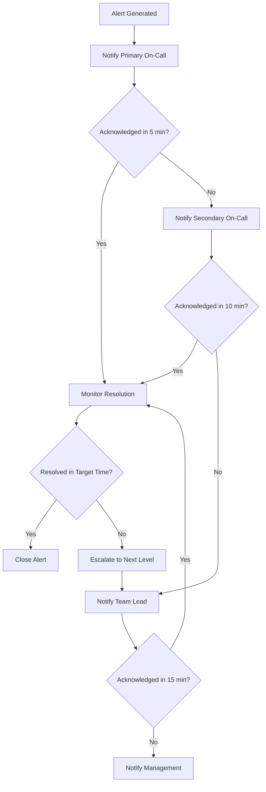
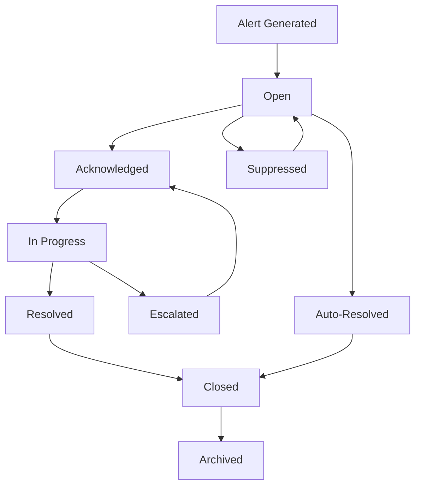

# Jira Alerting and Notification System

## Executive Summary

This document defines the comprehensive alerting and notification system for Jira environments, covering alert classification, escalation procedures, notification channels, and automated response mechanisms. The system ensures rapid incident detection, appropriate stakeholder notification, and efficient incident resolution.

## 1. Alerting Framework Overview

### 1.1 Alerting Objectives

#### Rapid Incident Detection
- **Early Warning**: Detect issues before they impact end users
- **Proactive Monitoring**: Identify potential problems based on trends and patterns
- **Comprehensive Coverage**: Monitor all critical system components and business processes
- **Intelligent Filtering**: Reduce noise while maintaining sensitivity to real issues

#### Effective Communication
- **Right Person**: Notify the appropriate person based on expertise and availability
- **Right Time**: Send notifications at the optimal time for rapid response
- **Right Channel**: Use the most effective communication channel for each situation
- **Right Information**: Provide sufficient context for effective decision-making

#### Efficient Resolution
- **Clear Escalation**: Well-defined escalation paths for unresolved incidents
- **Automated Response**: Automated remediation for common, well-understood issues
- **Knowledge Integration**: Link to relevant documentation and runbooks
- **Feedback Loop**: Continuous improvement based on incident outcomes

### 1.2 Alerting Principles

#### Actionable Alerts
- **Clear Impact**: Every alert must clearly indicate the business impact
- **Specific Actions**: Provide specific actions that can be taken to resolve the issue
- **Sufficient Context**: Include enough information to understand and address the problem
- **Avoid Alert Fatigue**: Minimize false positives and non-actionable alerts

#### Intelligent Routing
- **Skill-Based Routing**: Route alerts to team members with relevant expertise
- **Load Balancing**: Distribute alerts evenly across available team members
- **Time-Zone Awareness**: Consider time zones for global teams
- **Escalation Logic**: Automatic escalation based on response times and severity

#### Continuous Improvement
- **Alert Effectiveness**: Regularly review and optimize alert rules
- **Response Analysis**: Analyze response times and resolution effectiveness
- **Feedback Integration**: Incorporate feedback from incident responders
- **Metric-Driven Optimization**: Use metrics to drive alerting improvements

## 2. Alert Classification and Severity Levels

### 2.1 Severity Level Definitions

#### P1 - Critical (Immediate Response Required)
**Definition**: Complete system outage or critical functionality unavailable affecting all users

**Examples**:
- Jira application completely inaccessible
- Database server down or unreachable
- Authentication system failure preventing all logins
- Data corruption or loss detected
- Security breach confirmed

**Response Requirements**:
- **Response Time**: Immediate (< 5 minutes)
- **Resolution Target**: 1 hour
- **Escalation**: Automatic to on-call engineer, then management
- **Communication**: Real-time updates every 15 minutes

```json
{
  "alert_level": "P1_CRITICAL",
  "response_time_minutes": 5,
  "resolution_target_hours": 1,
  "notification_channels": ["phone", "sms", "pagerduty", "slack_critical"],
  "escalation_levels": [
    {"level": 1, "timeout_minutes": 5, "target": "primary_oncall"},
    {"level": 2, "timeout_minutes": 15, "target": "secondary_oncall"},
    {"level": 3, "timeout_minutes": 30, "target": "team_lead"},
    {"level": 4, "timeout_minutes": 60, "target": "management"}
  ]
}
```

#### P2 - High (Urgent Response Required)
**Definition**: Significant functionality impaired affecting multiple users or critical business processes

**Examples**:
- Performance degradation affecting > 50% of users
- Critical feature unavailable (issue creation, search)
- High error rates (> 10% of requests failing)
- Database performance severely degraded
- Integration with critical external systems failing

**Response Requirements**:
- **Response Time**: 15 minutes
- **Resolution Target**: 4 hours
- **Escalation**: To team lead after 30 minutes
- **Communication**: Updates every 30 minutes

```json
{
  "alert_level": "P2_HIGH",
  "response_time_minutes": 15,
  "resolution_target_hours": 4,
  "notification_channels": ["email", "slack_alerts", "pagerduty"],
  "escalation_levels": [
    {"level": 1, "timeout_minutes": 15, "target": "assigned_engineer"},
    {"level": 2, "timeout_minutes": 30, "target": "team_lead"},
    {"level": 3, "timeout_minutes": 120, "target": "senior_engineer"}
  ]
}
```

#### P3 - Medium (Standard Response Required)
**Definition**: Minor functionality impaired or potential issues that could escalate

**Examples**:
- Performance degradation affecting < 25% of users
- Non-critical features unavailable
- Moderate error rates (5-10% of requests failing)
- Resource utilization approaching limits
- Plugin or add-on failures

**Response Requirements**:
- **Response Time**: 1 hour
- **Resolution Target**: 24 hours
- **Escalation**: Daily summary to management
- **Communication**: Updates every 2 hours during business hours

```json
{
  "alert_level": "P3_MEDIUM",
  "response_time_minutes": 60,
  "resolution_target_hours": 24,
  "notification_channels": ["email", "slack_monitoring"],
  "escalation_levels": [
    {"level": 1, "timeout_minutes": 60, "target": "assigned_engineer"},
    {"level": 2, "timeout_hours": 8, "target": "team_lead"}
  ]
}
```

#### P4 - Low (Informational)
**Definition**: Informational alerts that don't require immediate action but should be tracked

**Examples**:
- Scheduled maintenance notifications
- Capacity planning warnings
- Long-term trend alerts
- Compliance status updates
- System configuration changes

**Response Requirements**:
- **Response Time**: Next business day
- **Resolution Target**: 1 week
- **Escalation**: Weekly summary reports
- **Communication**: Batch notifications

```json
{
  "alert_level": "P4_LOW",
  "response_time_hours": 24,
  "resolution_target_days": 7,
  "notification_channels": ["email_digest", "dashboard"],
  "escalation_levels": [
    {"level": 1, "timeout_days": 1, "target": "assigned_engineer"}
  ]
}
```

### 2.2 Alert Categories

#### System Health Alerts
```json
{
  "category": "system_health",
  "alert_types": [
    {
      "name": "system_down",
      "severity": "P1_CRITICAL",
      "description": "System completely unavailable",
      "threshold": "http_response_code != 200 for 2 minutes",
      "impact": "All users unable to access Jira"
    },
    {
      "name": "high_cpu_usage",
      "severity": "P2_HIGH",
      "description": "CPU usage critically high",
      "threshold": "cpu_usage > 90% for 10 minutes",
      "impact": "System performance severely degraded"
    },
    {
      "name": "memory_exhaustion",
      "severity": "P1_CRITICAL",
      "description": "Memory usage critically high",
      "threshold": "memory_usage > 95% for 5 minutes",
      "impact": "Risk of system crash and data loss"
    },
    {
      "name": "disk_space_critical",
      "severity": "P1_CRITICAL",
      "description": "Disk space critically low",
      "threshold": "disk_usage > 95%",
      "impact": "Risk of system failure and data loss"
    }
  ]
}
```

#### Application Performance Alerts
```json
{
  "category": "application_performance",
  "alert_types": [
    {
      "name": "high_response_time",
      "severity": "P2_HIGH",
      "description": "Application response time degraded",
      "threshold": "p95_response_time > 5000ms for 5 minutes",
      "impact": "Poor user experience, potential user abandonment"
    },
    {
      "name": "high_error_rate",
      "severity": "P2_HIGH",
      "description": "High application error rate",
      "threshold": "error_rate > 10% for 5 minutes",
      "impact": "Users experiencing frequent errors"
    },
    {
      "name": "database_slow_queries",
      "severity": "P3_MEDIUM",
      "description": "Database queries running slowly",
      "threshold": "avg_query_time > 1000ms for 10 minutes",
      "impact": "Application performance degradation"
    },
    {
      "name": "jvm_gc_pressure",
      "severity": "P3_MEDIUM",
      "description": "JVM garbage collection pressure high",
      "threshold": "gc_time_percent > 10% for 15 minutes",
      "impact": "Application performance impact"
    }
  ]
}
```

#### Security Alerts
```json
{
  "category": "security",
  "alert_types": [
    {
      "name": "multiple_failed_logins",
      "severity": "P2_HIGH",
      "description": "Multiple failed login attempts detected",
      "threshold": "failed_logins > 10 from same IP in 5 minutes",
      "impact": "Potential brute force attack"
    },
    {
      "name": "privilege_escalation",
      "severity": "P1_CRITICAL",
      "description": "Unauthorized privilege escalation detected",
      "threshold": "admin_permission_granted without approval",
      "impact": "Security breach, unauthorized access"
    },
    {
      "name": "suspicious_activity",
      "severity": "P2_HIGH",
      "description": "Suspicious user activity pattern",
      "threshold": "anomaly_score > 0.8",
      "impact": "Potential security threat"
    },
    {
      "name": "data_export_anomaly",
      "severity": "P2_HIGH",
      "description": "Unusual data export activity",
      "threshold": "data_export_volume > 10x normal",
      "impact": "Potential data exfiltration"
    }
  ]
}
```

#### Business Process Alerts
```json
{
  "category": "business_process",
  "alert_types": [
    {
      "name": "sla_breach",
      "severity": "P2_HIGH",
      "description": "SLA threshold breached",
      "threshold": "issue_resolution_time > sla_target",
      "impact": "Customer satisfaction impact, contract violations"
    },
    {
      "name": "low_user_activity",
      "severity": "P3_MEDIUM",
      "description": "Unusually low user activity",
      "threshold": "active_users < 50% of normal",
      "impact": "Potential system issues affecting user access"
    },
    {
      "name": "integration_failure",
      "severity": "P2_HIGH",
      "description": "Critical integration failing",
      "threshold": "webhook_failure_rate > 50%",
      "impact": "Business process disruption"
    },
    {
      "name": "license_expiration",
      "severity": "P3_MEDIUM",
      "description": "License approaching expiration",
      "threshold": "license_expires_in < 30 days",
      "impact": "Risk of service interruption"
    }
  ]
}
```

## 3. Alert Rules and Thresholds

### 3.1 Dynamic Threshold Management

#### Baseline Learning
```json
{
  "threshold_type": "dynamic_baseline",
  "learning_period_days": 30,
  "confidence_interval": 0.95,
  "seasonal_adjustment": true,
  "parameters": {
    "metric": "response_time_p95",
    "baseline_calculation": "rolling_average",
    "anomaly_detection": "statistical_outlier",
    "threshold_multiplier": 2.0,
    "minimum_threshold": 1000,
    "maximum_threshold": 10000
  },
  "schedule": {
    "recalculation_frequency": "daily",
    "business_hours_weight": 1.5,
    "weekend_adjustment": 0.7,
    "holiday_adjustment": 0.5
  }
}
```

#### Adaptive Thresholds
```json
{
  "threshold_type": "adaptive",
  "adaptation_strategy": "machine_learning",
  "model_type": "time_series_forecasting",
  "parameters": {
    "lookback_period_days": 90,
    "forecast_horizon_hours": 24,
    "sensitivity": "medium",
    "false_positive_tolerance": 0.05,
    "adaptation_rate": 0.1
  },
  "triggers": {
    "upper_bound": "forecast + 2 * standard_deviation",
    "lower_bound": "forecast - 2 * standard_deviation",
    "rate_of_change": "abs(current - forecast) / forecast > 0.3"
  }
}
```

### 3.2 Composite Alert Rules

#### Multi-Condition Alerts
```json
{
  "alert_name": "system_degradation",
  "alert_type": "composite",
  "severity": "P2_HIGH",
  "conditions": {
    "operator": "AND",
    "rules": [
      {
        "metric": "cpu_usage",
        "operator": ">",
        "threshold": 80,
        "duration": "5m"
      },
      {
        "metric": "memory_usage",
        "operator": ">",
        "threshold": 85,
        "duration": "5m"
      },
      {
        "metric": "response_time_p95",
        "operator": ">",
        "threshold": 3000,
        "duration": "3m"
      }
    ]
  },
  "suppression": {
    "maintenance_windows": true,
    "related_alerts": ["high_cpu_usage", "high_memory_usage"],
    "cooldown_period": "15m"
  }
}
```

#### Correlation-Based Alerts
```json
{
  "alert_name": "cascading_failure",
  "alert_type": "correlation",
  "severity": "P1_CRITICAL",
  "correlation_rules": [
    {
      "primary_metric": "database_connection_errors",
      "secondary_metrics": ["application_errors", "user_complaints"],
      "correlation_threshold": 0.8,
      "time_window": "10m"
    }
  ],
  "escalation": {
    "immediate": true,
    "bypass_normal_routing": true,
    "notify_management": true
  }
}
```

### 3.3 Alert Suppression and Grouping

#### Maintenance Window Suppression
```json
{
  "suppression_type": "maintenance_window",
  "windows": [
    {
      "name": "weekly_maintenance",
      "schedule": "0 2 * * SUN",
      "duration": "4h",
      "suppressed_alerts": ["system_health", "performance"],
      "exceptions": ["security", "data_loss"]
    },
    {
      "name": "deployment_window",
      "trigger": "deployment_started",
      "duration": "30m",
      "suppressed_alerts": ["application_performance"],
      "auto_resume": true
    }
  ]
}
```

#### Alert Grouping
```json
{
  "grouping_strategy": "intelligent_grouping",
  "grouping_rules": [
    {
      "group_by": ["service", "environment"],
      "time_window": "5m",
      "max_group_size": 10,
      "group_threshold": 3
    },
    {
      "correlation_grouping": true,
      "correlation_threshold": 0.7,
      "max_correlation_distance": "15m"
    }
  ],
  "notification_strategy": {
    "single_notification_per_group": true,
    "group_summary": true,
    "individual_alert_details": true
  }
}
```

## 4. Notification Channels and Routing

### 4.1 Notification Channel Configuration

#### Email Notifications
```json
{
  "channel_type": "email",
  "configuration": {
    "smtp_server": "smtp.company.com",
    "port": 587,
    "encryption": "TLS",
    "authentication": "required",
    "from_address": "jira-alerts@company.com",
    "reply_to": "devops-team@company.com"
  },
  "templates": {
    "critical_alert": {
      "subject": "[CRITICAL] Jira Alert: {{alert_name}}",
      "body_template": "critical_alert_template.html",
      "include_graphs": true,
      "include_runbook_links": true
    },
    "digest": {
      "subject": "Jira Monitoring Daily Digest - {{date}}",
      "body_template": "daily_digest_template.html",
      "frequency": "daily",
      "time": "08:00"
    }
  },
  "routing_rules": [
    {
      "severity": ["P1_CRITICAL", "P2_HIGH"],
      "recipients": ["oncall@company.com", "team-lead@company.com"],
      "immediate": true
    },
    {
      "severity": ["P3_MEDIUM"],
      "recipients": ["devops-team@company.com"],
      "batch": true,
      "batch_interval": "1h"
    }
  ]
}
```

#### Slack Integration
```json
{
  "channel_type": "slack",
  "configuration": {
    "webhook_url": "https://hooks.slack.com/services/...",
    "bot_token": "xoxb-...",
    "channels": {
      "critical": "#jira-critical-alerts",
      "alerts": "#jira-alerts",
      "monitoring": "#jira-monitoring",
      "digest": "#jira-daily-digest"
    }
  },
  "message_formatting": {
    "use_blocks": true,
    "include_emoji": true,
    "color_coding": {
      "P1_CRITICAL": "#FF0000",
      "P2_HIGH": "#FF8C00",
      "P3_MEDIUM": "#FFD700",
      "P4_LOW": "#32CD32"
    },
    "include_actions": true,
    "actions": ["acknowledge", "resolve", "escalate", "snooze"]
  },
  "routing_rules": [
    {
      "severity": "P1_CRITICAL",
      "channel": "#jira-critical-alerts",
      "mention": "@channel",
      "thread_alerts": false
    },
    {
      "severity": ["P2_HIGH", "P3_MEDIUM"],
      "channel": "#jira-alerts",
      "mention": "@here",
      "thread_alerts": true
    }
  ]
}
```

#### PagerDuty Integration
```json
{
  "channel_type": "pagerduty",
  "configuration": {
    "integration_key": "...",
    "api_token": "...",
    "services": {
      "jira_production": "PXXXXXX",
      "jira_infrastructure": "PYYYYYY"
    }
  },
  "escalation_policies": {
    "primary": {
      "policy_id": "PZZZZZZ",
      "levels": [
        {"timeout": 5, "targets": ["primary_oncall"]},
        {"timeout": 15, "targets": ["secondary_oncall"]},
        {"timeout": 30, "targets": ["team_lead"]}
      ]
    },
    "infrastructure": {
      "policy_id": "PAAAAAA",
      "levels": [
        {"timeout": 10, "targets": ["infrastructure_team"]},
        {"timeout": 30, "targets": ["senior_engineer"]}
      ]
    }
  },
  "routing_rules": [
    {
      "severity": "P1_CRITICAL",
      "service": "jira_production",
      "escalation_policy": "primary",
      "urgency": "high"
    },
    {
      "severity": "P2_HIGH",
      "service": "jira_production",
      "escalation_policy": "primary",
      "urgency": "low"
    }
  ]
}
```

#### SMS/Phone Notifications
```json
{
  "channel_type": "sms_phone",
  "configuration": {
    "provider": "twilio",
    "account_sid": "...",
    "auth_token": "...",
    "from_number": "+1234567890"
  },
  "notification_rules": {
    "sms": {
      "severity_threshold": "P1_CRITICAL",
      "max_message_length": 160,
      "include_short_url": true,
      "retry_attempts": 3,
      "retry_interval": "2m"
    },
    "voice_call": {
      "severity_threshold": "P1_CRITICAL",
      "conditions": ["no_acknowledgment_after_10m"],
      "message_template": "voice_alert_template.xml",
      "max_attempts": 3
    }
  },
  "contact_list": [
    {
      "name": "Primary On-Call",
      "phone": "+1234567891",
      "role": "primary_oncall",
      "availability": "24x7"
    },
    {
      "name": "Secondary On-Call",
      "phone": "+1234567892",
      "role": "secondary_oncall",
      "availability": "business_hours"
    }
  ]
}
```

### 4.2 Intelligent Routing

#### Skill-Based Routing
```json
{
  "routing_type": "skill_based",
  "skills_matrix": {
    "database_issues": ["john.doe", "jane.smith"],
    "performance_issues": ["bob.wilson", "alice.brown"],
    "security_issues": ["charlie.davis", "diana.miller"],
    "infrastructure_issues": ["eve.johnson", "frank.garcia"]
  },
  "routing_rules": [
    {
      "alert_category": "database_performance",
      "required_skills": ["database_issues"],
      "fallback_to": "general_oncall",
      "max_routing_attempts": 3
    },
    {
      "alert_category": "security",
      "required_skills": ["security_issues"],
      "escalate_immediately": true,
      "notify_management": true
    }
  ]
}
```

#### Load Balancing
```json
{
  "routing_type": "load_balanced",
  "balancing_strategy": "round_robin",
  "parameters": {
    "consider_current_load": true,
    "consider_expertise": true,
    "consider_timezone": true,
    "max_concurrent_alerts": 5
  },
  "team_members": [
    {
      "name": "john.doe",
      "current_load": 2,
      "max_load": 5,
      "timezone": "UTC-8",
      "availability": "available"
    },
    {
      "name": "jane.smith",
      "current_load": 1,
      "max_load": 4,
      "timezone": "UTC-5",
      "availability": "available"
    }
  ]
}
```

### 4.3 Escalation Procedures

#### Time-Based Escalation


#### Severity-Based Escalation
```json
{
  "escalation_matrix": {
    "P1_CRITICAL": {
      "immediate_notification": ["primary_oncall", "team_lead"],
      "escalation_timeline": [
        {"time": "5m", "action": "notify_secondary_oncall"},
        {"time": "15m", "action": "notify_management"},
        {"time": "30m", "action": "notify_executives"},
        {"time": "60m", "action": "activate_crisis_team"}
      ]
    },
    "P2_HIGH": {
      "immediate_notification": ["assigned_engineer"],
      "escalation_timeline": [
        {"time": "30m", "action": "notify_team_lead"},
        {"time": "2h", "action": "notify_senior_engineer"},
        {"time": "4h", "action": "notify_management"}
      ]
    },
    "P3_MEDIUM": {
      "immediate_notification": ["assigned_engineer"],
      "escalation_timeline": [
        {"time": "4h", "action": "notify_team_lead"},
        {"time": "24h", "action": "create_ticket"}
      ]
    }
  }
}
```

## 5. Automated Response and Remediation

### 5.1 Automated Response Framework

#### Response Action Types
```json
{
  "response_actions": {
    "restart_service": {
      "description": "Restart a specific service",
      "risk_level": "low",
      "approval_required": false,
      "parameters": ["service_name", "graceful_shutdown"],
      "rollback_action": "start_service",
      "success_criteria": "service_status == 'running'"
    },
    "scale_resources": {
      "description": "Scale system resources up or down",
      "risk_level": "medium",
      "approval_required": true,
      "parameters": ["resource_type", "scale_factor", "max_instances"],
      "rollback_action": "scale_to_original",
      "success_criteria": "resource_utilization < threshold"
    },
    "failover_database": {
      "description": "Failover to backup database",
      "risk_level": "high",
      "approval_required": true,
      "parameters": ["primary_db", "backup_db", "sync_check"],
      "rollback_action": "failback_database",
      "success_criteria": "database_connectivity == true"
    }
  }
}
```

#### Automated Response Rules
```json
{
  "response_rules": [
    {
      "alert_type": "high_memory_usage",
      "conditions": {
        "memory_usage": "> 90%",
        "duration": "> 5m",
        "trend": "increasing"
      },
      "automated_actions": [
        {
          "action": "clear_cache",
          "parameters": {"cache_type": "application"},
          "wait_time": "2m"
        },
        {
          "action": "restart_service",
          "parameters": {"service": "jira", "graceful": true},
          "condition": "memory_usage still > 85%"
        }
      ],
      "human_approval": {
        "required_for": ["restart_service"],
        "timeout": "10m",
        "fallback": "create_incident"
      }
    },
    {
      "alert_type": "disk_space_critical",
      "conditions": {
        "disk_usage": "> 95%"
      },
      "automated_actions": [
        {
          "action": "cleanup_logs",
          "parameters": {"retention_days": 7}
        },
        {
          "action": "compress_archives",
          "parameters": {"older_than_days": 30}
        },
        {
          "action": "notify_for_manual_cleanup",
          "condition": "disk_usage still > 90%"
        }
      ]
    }
  ]
}
```

### 5.2 Runbook Integration

#### Automated Runbook Execution
```json
{
  "runbook_integration": {
    "storage_location": "https://wiki.company.com/runbooks/",
    "execution_engine": "ansible",
    "approval_workflow": {
      "low_risk": "auto_execute",
      "medium_risk": "team_lead_approval",
      "high_risk": "management_approval"
    },
    "runbooks": [
      {
        "name": "jira_performance_degradation",
        "trigger_alerts": ["high_response_time", "high_cpu_usage"],
        "steps": [
          {"action": "check_system_resources", "automated": true},
          {"action": "analyze_slow_queries", "automated": true},
          {"action": "restart_jvm", "automated": false, "approval_required": true},
          {"action": "scale_infrastructure", "automated": false, "approval_required": true}
        ],
        "success_criteria": "response_time < 2000ms",
        "rollback_plan": "runbook_rollback_performance"
      }
    ]
  }
}
```

### 5.3 Self-Healing Capabilities

#### Predictive Healing
```json
{
  "predictive_healing": {
    "enabled": true,
    "prediction_models": [
      {
        "name": "memory_leak_prediction",
        "model_type": "time_series_forecasting",
        "prediction_horizon": "2h",
        "confidence_threshold": 0.8,
        "preventive_actions": [
          {"action": "schedule_restart", "lead_time": "30m"},
          {"action": "notify_team", "message": "Predicted memory leak"}
        ]
      },
      {
        "name": "disk_space_prediction",
        "model_type": "linear_regression",
        "prediction_horizon": "24h",
        "confidence_threshold": 0.9,
        "preventive_actions": [
          {"action": "cleanup_old_files", "threshold": "80%"},
          {"action": "request_storage_expansion", "threshold": "85%"}
        ]
      }
    ]
  }
}
```

## 6. Alert Management and Lifecycle

### 6.1 Alert States and Transitions

#### Alert State Machine


#### State Definitions
```json
{
  "alert_states": {
    "open": {
      "description": "Alert generated and waiting for acknowledgment",
      "auto_actions": ["send_notifications", "start_escalation_timer"],
      "valid_transitions": ["acknowledged", "suppressed", "auto_resolved"]
    },
    "acknowledged": {
      "description": "Alert acknowledged by responder",
      "auto_actions": ["stop_escalation", "start_resolution_timer"],
      "valid_transitions": ["in_progress", "resolved", "escalated"]
    },
    "in_progress": {
      "description": "Active work being performed to resolve alert",
      "auto_actions": ["track_resolution_time", "send_progress_updates"],
      "valid_transitions": ["resolved", "escalated"]
    },
    "resolved": {
      "description": "Issue resolved, waiting for confirmation",
      "auto_actions": ["stop_notifications", "start_confirmation_timer"],
      "valid_transitions": ["closed", "reopened"]
    },
    "closed": {