# Jira Logging and Monitoring System Diagrams

## Executive Summary

This document contains comprehensive system diagrams for the Jira logging and monitoring solution, including architectural overviews, data flow diagrams, network topology, deployment diagrams, and operational workflows. These diagrams provide visual representations to support implementation, troubleshooting, and system understanding.

## 1. High-Level Architecture Diagrams

### 1.1 Overall System Architecture

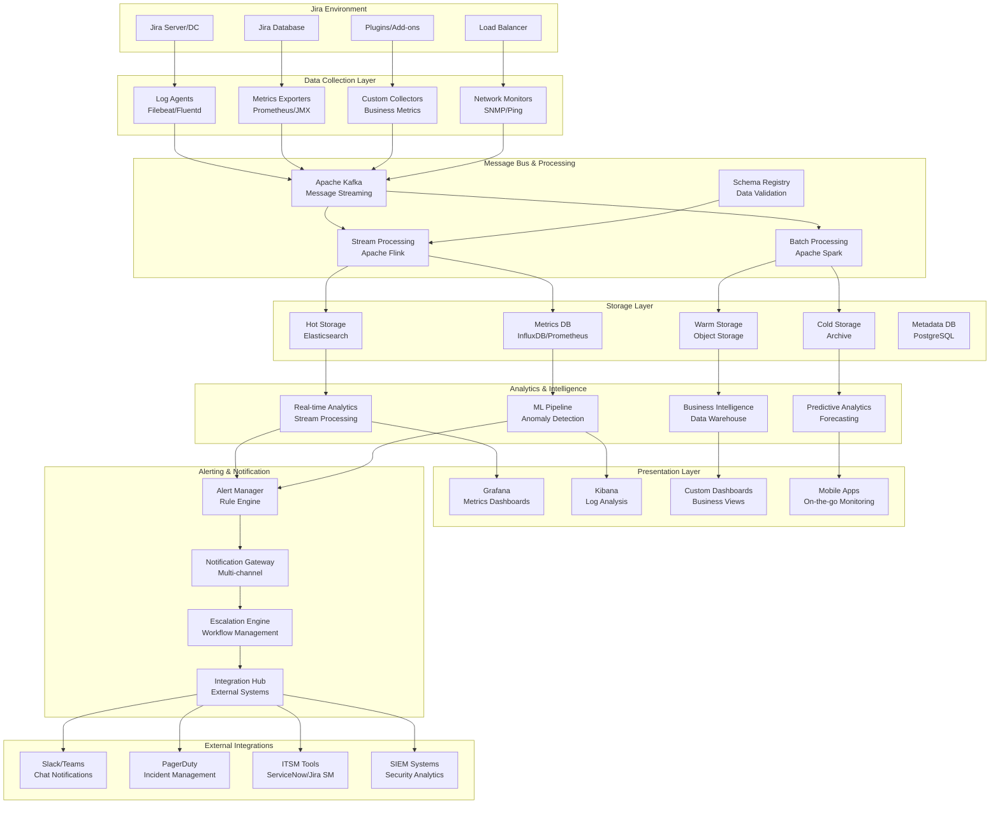

### 1.2 Layered Architecture View

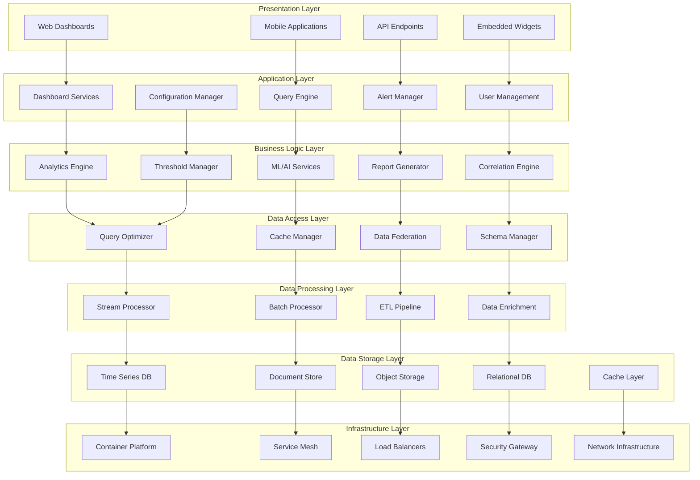

## 2. Data Flow Diagrams

### 2.1 Log Processing Data Flow

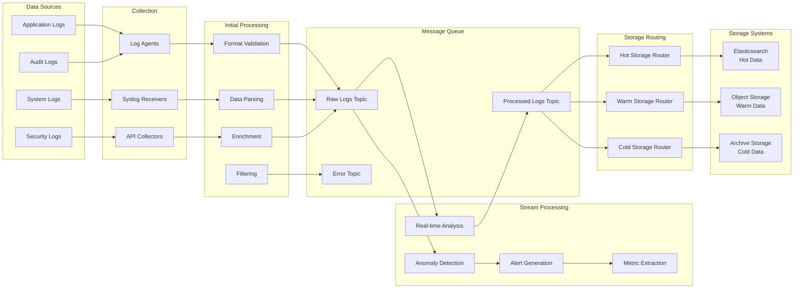

### 2.2 Metrics Collection Data Flow

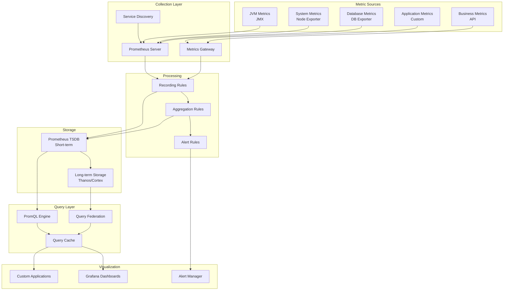

### 2.3 Alert Processing Flow

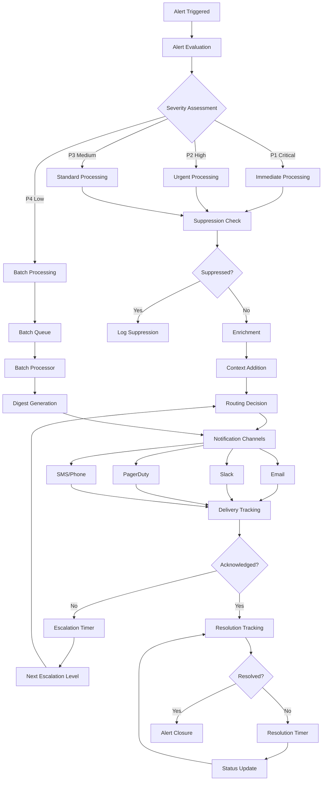

## 3. Network and Deployment Diagrams

### 3.1 Network Topology

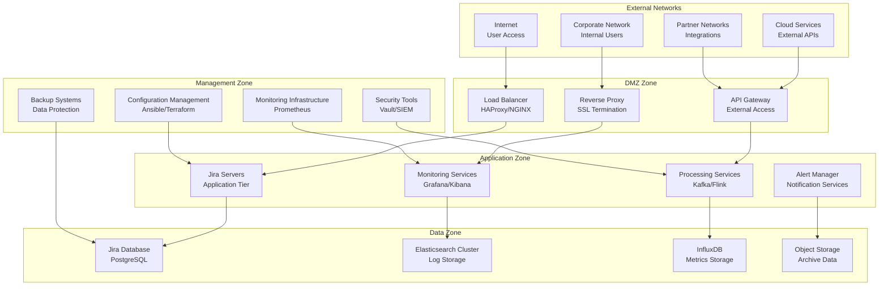

### 3.2 Kubernetes Deployment Architecture

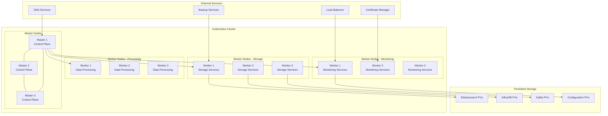

### 3.3 Multi-Environment Deployment

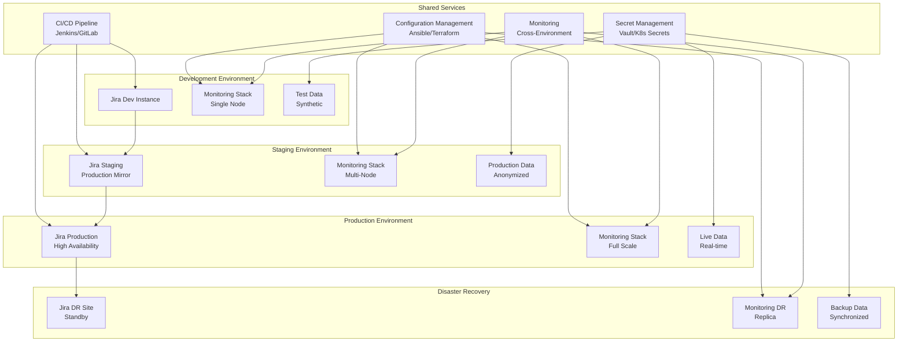

## 4. Component Integration Diagrams

### 4.1 Jira Integration Points

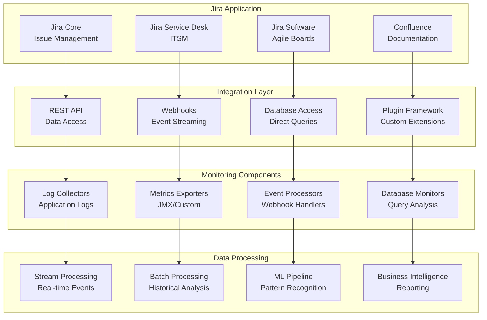

### 4.2 External System Integrations

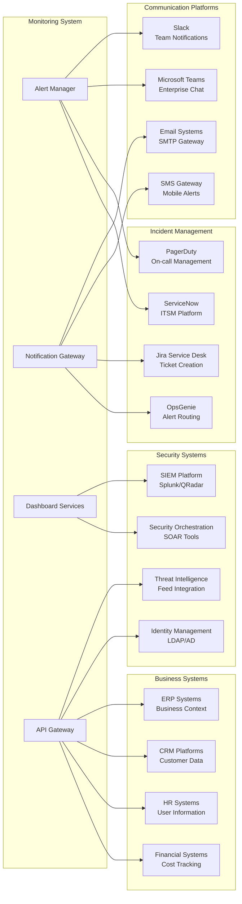

## 5. Operational Workflow Diagrams

### 5.1 Incident Response Workflow

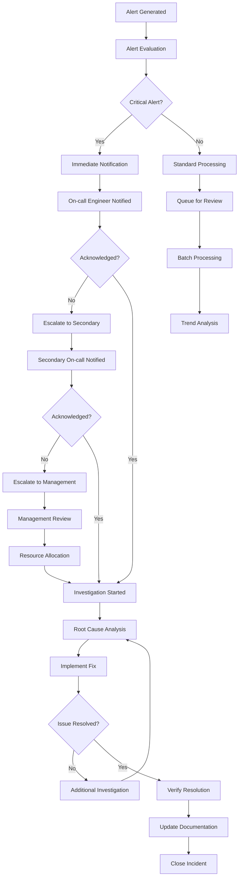

### 5.2 Capacity Planning Workflow

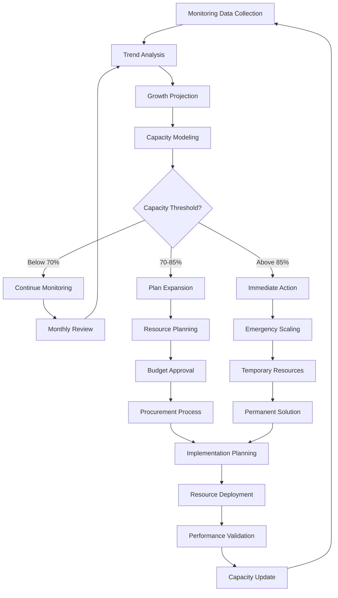

### 5.3 Change Management Workflow

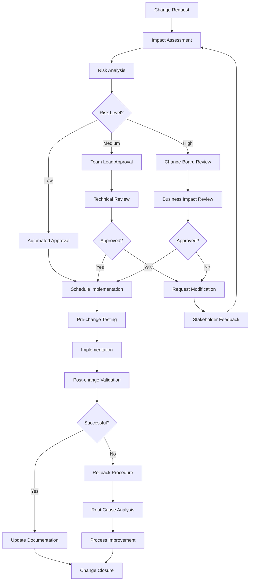

## 6. Security Architecture Diagrams

### 6.1 Security Zones and Controls

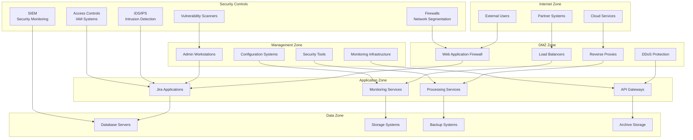

### 6.2 Data Flow Security

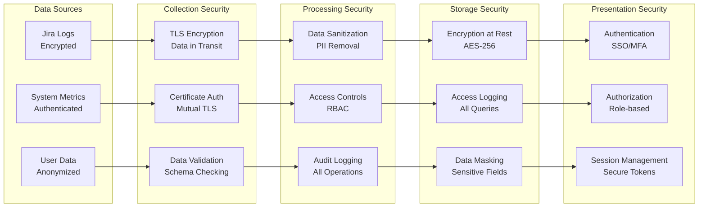

## 7. Disaster Recovery Diagrams

### 7.1 Backup and Recovery Architecture

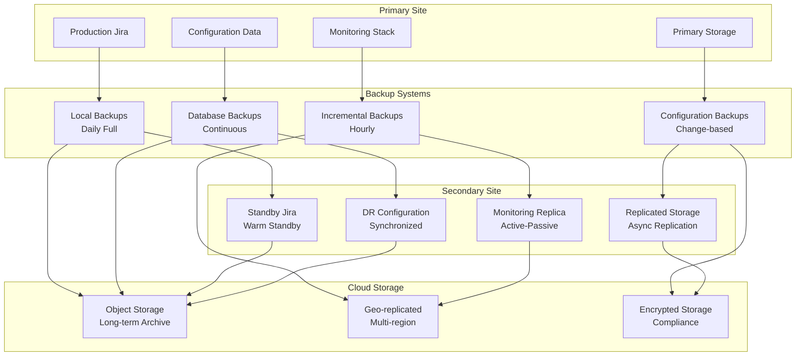

### 7.2 Failover Process Flow

```mermaid
graph TD
    A[Disaster Detected] --> B[Automatic Health Checks]
    B --> C{Primary Site Responsive?}
    
    C