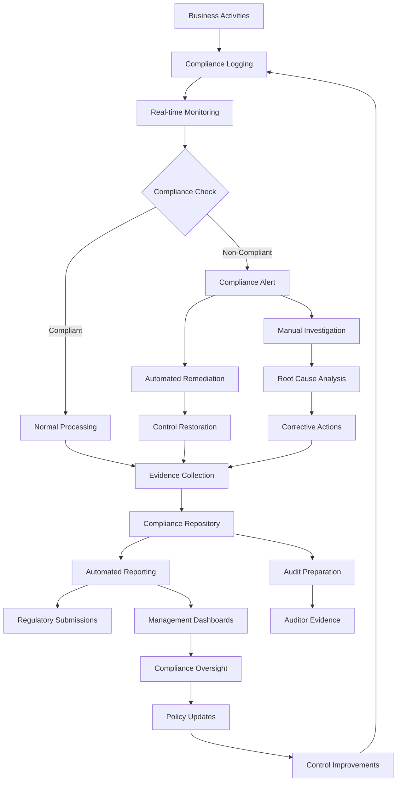

# Compliance Requirements Example: How Logging and Monitoring Systems Support Regulatory Compliance

## Executive Summary

This document demonstrates how the Jira logging and monitoring system enables organizations to meet various regulatory compliance requirements. Through detailed examples, we show how structured logging, automated reporting, and audit trails support compliance with GDPR, SOX, HIPAA, PCI DSS, and other regulatory frameworks.

## Scenario: Multi-Regulatory Compliance in a Healthcare Financial Services Company

### Background

A healthcare financial services company uses Jira to manage patient billing projects, insurance claims processing, and financial reporting workflows. The organization must comply with multiple regulations:
- **HIPAA**: Healthcare data protection
- **SOX**: Financial reporting integrity
- **GDPR**: European data privacy
- **PCI DSS**: Payment card data security

### Compliance Challenge

The company faces an upcoming regulatory audit and needs to demonstrate:
1. Proper access controls and data protection
2. Complete audit trails for financial processes
3. Data privacy compliance for EU patients
4. Secure handling of payment card information

## GDPR Compliance Example

### Scenario: Data Subject Access Request (DSAR)

A European patient requests access to all personal data held by the organization under GDPR Article 15.

#### Step 1: Data Discovery and Mapping

**Log Query for Personal Data Access**:
```json
{
  "query_id": "GDPR-DSAR-2024-001",
  "timestamp": "2024-01-15T10:00:00.000Z",
  "regulation": "GDPR",
  "request_type": "data_subject_access_request",
  "subject": {
    "data_subject_id": "patient_12345",
    "email": "john.doe@email.com",
    "request_date": "2024-01-10T14:30:00.000Z"
  },
  "data_discovery": {
    "search_criteria": [
      "user_id = 'patient_12345'",
      "email = 'john.doe@email.com'",
      "patient_id = 'P-12345'",
      "reference_number LIKE '%12345%'"
    ],
    "data_sources_searched": [
      "user_activity_logs",
      "issue_comments",
      "attachment_metadata",
      "audit_logs",
      "system_logs"
    ]
  }
}
```

**Automated Data Discovery Results**:
```json
{
  "discovery_results": {
    "total_records_found": 247,
    "data_categories": [
      {
        "category": "identity_data",
        "records": 15,
        "fields": ["name", "email", "patient_id", "date_of_birth"],
        "retention_period": "7_years",
        "legal_basis": "legitimate_interest"
      },
      {
        "category": "health_data",
        "records": 89,
        "fields": ["diagnosis_codes", "treatment_notes", "medical_history"],
        "retention_period": "10_years",
        "legal_basis": "vital_interests"
      },
      {
        "category": "financial_data",
        "records": 143,
        "fields": ["billing_amount", "insurance_claims", "payment_status"],
        "retention_period": "7_years",
        "legal_basis": "contract"
      }
    ],
    "processing_activities": [
      "billing_management",
      "insurance_processing",
      "patient_communication",
      "medical_record_keeping"
    ]
  }
}
```

#### Step 2: Access Log Analysis

**Personal Data Access Tracking**:
```json
{
  "timestamp": "2024-01-15T10:15:00.000Z",
  "event_type": "personal_data_access",
  "correlation_id": "gdpr_audit_001",
  "data_subject": "patient_12345",
  "access_details": {
    "accessor": "billing.clerk",
    "access_time": "2024-01-14T09:30:00.000Z",
    "data_accessed": [
      "patient_name",
      "billing_address",
      "insurance_information",
      "treatment_codes"
    ],
    "purpose": "insurance_claim_processing",
    "legal_basis": "contract",
    "retention_applied": true
  },
  "privacy_controls": {
    "data_minimization": "applied",
    "purpose_limitation": "verified",
    "access_authorization": "role_based",
    "audit_trail": "complete"
  },
  "gdpr_compliance": {
    "lawful_basis_documented": true,
    "consent_status": "not_required",
    "data_protection_impact_assessment": "completed",
    "privacy_by_design": "implemented"
  }
}
```

#### Step 3: Automated GDPR Report Generation

**DSAR Response Report**:
```json
{
  "report_id": "GDPR-REPORT-2024-001",
  "generated_at": "2024-01-15T10:30:00.000Z",
  "data_subject": "patient_12345",
  "report_type": "data_subject_access_request",
  "compliance_summary": {
    "total_processing_activities": 4,
    "lawful_basis_confirmed": true,
    "retention_periods_compliant": true,
    "data_minimization_applied": true,
    "purpose_limitation_verified": true
  },
  "data_inventory": {
    "personal_data_categories": 3,
    "total_data_points": 247,
    "oldest_record": "2019-03-15T00:00:00.000Z",
    "newest_record": "2024-01-14T16:45:00.000Z",
    "data_sources": 5
  },
  "access_history": {
    "total_access_events": 45,
    "authorized_users": 8,
    "access_purposes": [
      "billing_management",
      "insurance_processing",
      "patient_care",
      "compliance_audit"
    ],
    "unauthorized_access_attempts": 0
  },
  "automated_compliance_checks": {
    "all_checks_passed": true,
    "data_accuracy_verified": true,
    "consent_status_current": true,
    "retention_policies_applied": true
  }
}
```

## SOX Compliance Example

### Scenario: Financial Reporting Process Audit

The company must demonstrate SOX compliance for financial reporting processes managed through Jira.

#### Financial Process Workflow Logging

**SOX-Critical Process Tracking**:
```json
{
  "timestamp": "2024-01-15T11:00:00.000Z",
  "event_type": "sox_financial_process",
  "correlation_id": "sox_audit_q4_2024",
  "process_details": {
    "process_name": "quarterly_financial_close",
    "process_id": "QFC-2024-Q4",
    "process_owner": "finance.manager",
    "process_stage": "revenue_recognition",
    "sox_control_id": "SOX-REV-001"
  },
  "financial_data": {
    "transaction_type": "revenue_adjustment",
    "amount": 125000.00,
    "currency": "USD",
    "account_code": "4000-REVENUE",
    "journal_entry_id": "JE-2024-001234",
    "supporting_documentation": ["invoice_scan.pdf", "contract_amendment.pdf"]
  },
  "sox_controls": {
    "segregation_of_duties": {
      "preparer": "accounting.clerk",
      "reviewer": "senior.accountant",
      "approver": "finance.manager",
      "control_satisfied": true
    },
    "authorization_controls": {
      "required_approvals": 2,
      "received_approvals": 2,
      "approval_hierarchy_followed": true,
      "approval_timestamps": [
        "2024-01-15T10:45:00.000Z",
        "2024-01-15T10:55:00.000Z"
      ]
    },
    "documentation_controls": {
      "supporting_documents_attached": true,
      "document_retention_applied": true,
      "document_integrity_verified": true
    }
  },
  "audit_trail": {
    "immutable_log": true,
    "digital_signature": "sha256:abc123...",
    "timestamp_authority": "trusted_timestamping_service",
    "log_integrity_verified": true
  }
}
```

#### SOX Control Testing Results

**Automated Control Testing**:
```json
{
  "control_test_id": "SOX-TEST-2024-Q4-001",
  "timestamp": "2024-01-15T11:30:00.000Z",
  "testing_period": "2024-Q4",
  "control_tested": "SOX-REV-001",
  "control_description": "Revenue Recognition Authorization Control",
  "test_results": {
    "total_transactions_tested": 1247,
    "control_exceptions": 0,
    "control_effectiveness": "effective",
    "test_coverage": "100%",
    "sampling_method": "statistical_sampling"
  },
  "detailed_findings": {
    "segregation_of_duties": {
      "violations_found": 0,
      "compliance_rate": "100%",
      "test_details": "All transactions showed proper separation between preparer, reviewer, and approver roles"
    },
    "authorization_controls": {
      "unauthorized_transactions": 0,
      "missing_approvals": 0,
      "compliance_rate": "100%",
      "test_details": "All transactions had required approvals with proper authorization hierarchy"
    },
    "documentation_controls": {
      "missing_documentation": 0,
      "incomplete_documentation": 0,
      "compliance_rate": "100%",
      "test_details": "All transactions had complete supporting documentation"
    }
  },
  "management_assertion": {
    "control_design_effective": true,
    "control_operating_effective": true,
    "no_material_weaknesses": true,
    "certification_ready": true
  }
}
```

## HIPAA Compliance Example

### Scenario: Protected Health Information (PHI) Access Audit

The organization must demonstrate HIPAA compliance for PHI access and handling.

#### PHI Access Monitoring

**HIPAA Audit Log Entry**:
```json
{
  "timestamp": "2024-01-15T12:00:00.000Z",
  "event_type": "phi_access",
  "correlation_id": "hipaa_audit_2024_001",
  "hipaa_compliance": {
    "covered_entity": "HealthFinance Corp",
    "business_associate": null,
    "phi_involved": true,
    "minimum_necessary_applied": true
  },
  "access_details": {
    "user_id": "nurse.practitioner",
    "user_role": "healthcare_provider",
    "patient_id": "P-67890",
    "access_time": "2024-01-15T12:00:00.000Z",
    "access_method": "jira_web_interface",
    "workstation_id": "WS-CLINIC-05",
    "ip_address": "192.168.10.25"
  },
  "phi_accessed": {
    "data_elements": [
      "patient_name",
      "date_of_birth",
      "diagnosis_code",
      "treatment_plan",
      "medication_list"
    ],
    "purpose_of_access": "treatment",
    "minimum_necessary_standard": "applied",
    "authorization_required": false,
    "authorization_reason": "treatment_exception"
  },
  "security_safeguards": {
    "user_authentication": "multi_factor",
    "access_authorization": "role_based",
    "audit_logging": "enabled",
    "data_encryption": "aes_256",
    "transmission_security": "tls_1_3"
  },
  "administrative_safeguards": {
    "workforce_training_current": true,
    "access_management_policy": "enforced",
    "incident_response_plan": "active",
    "business_associate_agreement": "not_applicable"
  },
  "physical_safeguards": {
    "workstation_security": "compliant",
    "facility_access_controls": "active",
    "device_controls": "implemented"
  }
}
```

#### HIPAA Breach Detection

**Potential Breach Alert**:
```json
{
  "alert_id": "HIPAA-BREACH-2024-001",
  "timestamp": "2024-01-15T12:15:00.000Z",
  "alert_type": "potential_phi_breach",
  "severity": "high",
  "breach_details": {
    "incident_type": "unauthorized_access",
    "phi_involved": true,
    "patients_affected": 1,
    "discovery_method": "automated_monitoring",
    "breach_location": "jira_system"
  },
  "incident_analysis": {
    "unauthorized_user": "temp.contractor",
    "access_time": "2024-01-15T12:10:00.000Z",
    "phi_accessed": ["patient_medical_records"],
    "access_duration": "5_minutes",
    "data_copied": false,
    "data_transmitted": false
  },
  "hipaa_assessment": {
    "breach_threshold_met": true,
    "notification_required": true,
    "notification_timeline": "60_days",
    "hhs_notification_required": true,
    "media_notification_required": false
  },
  "immediate_actions": {
    "access_revoked": true,
    "incident_contained": true,
    "forensic_analysis_initiated": true,
    "legal_team_notified": true,
    "privacy_officer_notified": true
  }
}
```

## PCI DSS Compliance Example

### Scenario: Payment Card Data Protection Audit

The organization processes payment cards and must demonstrate PCI DSS compliance.

#### Cardholder Data Environment Monitoring

**PCI DSS Audit Log**:
```json
{
  "timestamp": "2024-01-15T13:00:00.000Z",
  "event_type": "cardholder_data_access",
  "correlation_id": "pci_audit_2024_001",
  "pci_compliance": {
    "merchant_level": "level_2",
    "card_brands": ["visa", "mastercard", "amex"],
    "processing_volume": "1M_to_6M_annually",
    "compliance_status": "compliant"
  },
  "cardholder_data_environment": {
    "system_component": "jira_payment_processing",
    "network_segment": "pci_secure_zone",
    "data_flow": "encrypted_transmission",
    "storage_location": "tokenized_vault"
  },
  "access_details": {
    "user_id": "payment.processor",
    "user_role": "authorized_personnel",
    "access_purpose": "payment_reconciliation",
    "access_time": "2024-01-15T13:00:00.000Z",
    "session_id": "pci_session_001"
  },
  "pci_requirements": {
    "requirement_1": {
      "description": "Install and maintain firewall configuration",
      "status": "compliant",
      "evidence": "firewall_rules_active"
    },
    "requirement_2": {
      "description": "Do not use vendor-supplied defaults",
      "status": "compliant",
      "evidence": "default_passwords_changed"
    },
    "requirement_3": {
      "description": "Protect stored cardholder data",
      "status": "compliant",
      "evidence": "data_encrypted_tokenized"
    },
    "requirement_4": {
      "description": "Encrypt transmission of cardholder data",
      "status": "compliant",
      "evidence": "tls_1_3_encryption"
    },
    "requirement_7": {
      "description": "Restrict access by business need-to-know",
      "status": "compliant",
      "evidence": "role_based_access_control"
    },
    "requirement_8": {
      "description": "Identify and authenticate access",
      "status": "compliant",
      "evidence": "multi_factor_authentication"
    },
    "requirement_10": {
      "description": "Track and monitor all access",
      "status": "compliant",
      "evidence": "comprehensive_audit_logging"
    }
  },
  "security_controls": {
    "data_encryption": "aes_256",
    "key_management": "hsm_protected",
    "access_controls": "rbac_implemented",
    "network_segmentation": "active",
    "vulnerability_management": "current",
    "penetration_testing": "annual"
  }
}
```

## Automated Compliance Reporting

### Multi-Regulation Compliance Dashboard

**Compliance Status Summary**:
```json
{
  "compliance_report_id": "COMP-2024-Q1-001",
  "generated_at": "2024-01-15T14:00:00.000Z",
  "reporting_period": "2024-Q1",
  "organization": "HealthFinance Corp",
  "compliance_frameworks": {
    "gdpr": {
      "overall_status": "compliant",
      "compliance_score": 98.5,
      "data_subject_requests": {
        "total_requests": 15,
        "completed_on_time": 15,
        "average_response_time": "18_days",
        "sla_compliance": "100%"
      },
      "privacy_controls": {
        "data_minimization": "implemented",
        "purpose_limitation": "enforced",
        "consent_management": "active",
        "breach_notifications": 0
      },
      "audit_findings": {
        "total_findings": 2,
        "high_risk": 0,
        "medium_risk": 1,
        "low_risk": 1,
        "remediation_status": "in_progress"
      }
    },
    "sox": {
      "overall_status": "compliant",
      "compliance_score": 99.2,
      "financial_controls": {
        "total_controls_tested": 25,
        "effective_controls": 25,
        "control_deficiencies": 0,
        "material_weaknesses": 0
      },
      "audit_trail_integrity": {
        "log_completeness": "100%",
        "log_integrity_verified": true,
        "unauthorized_changes": 0,
        "segregation_of_duties": "enforced"
      },
      "management_certification": {
        "icfr_effective": true,
        "disclosure_controls_effective": true,
        "certification_ready": true
      }
    },
    "hipaa": {
      "overall_status": "compliant",
      "compliance_score": 97.8,
      "phi_protection": {
        "unauthorized_access_incidents": 1,
        "breach_threshold_incidents": 0,
        "risk_assessments_current": true,
        "workforce_training_current": true
      },
      "security_safeguards": {
        "administrative_safeguards": "implemented",
        "physical_safeguards": "implemented",
        "technical_safeguards": "implemented",
        "audit_controls": "active"
      },
      "business_associate_management": {
        "agreements_current": true,
        "compliance_monitoring": "active",
        "incident_reporting": "functional"
      }
    },
    "pci_dss": {
      "overall_status": "compliant",
      "compliance_score": 99.5,
      "security_requirements": {
        "total_requirements": 12,
        "compliant_requirements": 12,
        "compensating_controls": 0,
        "vulnerabilities": 0
      },
      "cardholder_data_protection": {
        "data_discovery_complete": true,
        "encryption_implemented": true,
        "tokenization_active": true,
        "key_management_secure": true
      },
      "quarterly_scans": {
        "last_scan_date": "2024-01-01T00:00:00.000Z",
        "scan_status": "passed",
        "vulnerabilities_found": 0,
        "next_scan_due": "2024-04-01T00:00:00.000Z"
      }
    }
  },
  "overall_compliance_metrics": {
    "average_compliance_score": 98.75,
    "total_audit_findings": 2,
    "critical_findings": 0,
    "remediation_rate": "100%",
    "compliance_trend": "improving"
  },
  "automated_controls": {
    "total_automated_controls": 156,
    "controls_passing": 154,
    "controls_failing": 2,
    "automation_coverage": "98.7%"
  }
}
```

## Key Benefits for Compliance

### 1. Automated Evidence Collection

**Capability**: Automatically collect and organize compliance evidence

**Benefits**:
- Continuous evidence gathering without manual intervention
- Complete audit trails for all regulated activities
- Automated documentation of control effectiveness
- Real-time compliance status monitoring

**Implementation Example**:
```json
{
  "evidence_collection": {
    "automated_controls": [
      "access_control_monitoring",
      "data_encryption_verification",
      "audit_log_integrity_checks",
      "segregation_of_duties_validation"
    ],
    "collection_frequency": "real_time",
    "evidence_retention": "7_years",
    "evidence_integrity": "cryptographically_protected"
  }
}
```

### 2. Real-time Compliance Monitoring

**Capability**: Continuous monitoring of compliance status

**Benefits**:
- Immediate detection of compliance violations
- Proactive remediation before audit findings
- Continuous control testing and validation
- Real-time compliance dashboards

### 3. Regulatory Reporting Automation

**Capability**: Automated generation of regulatory reports

**Benefits**:
- Consistent and accurate regulatory reporting
- Reduced manual effort and human error
- Timely submission of required reports
- Standardized compliance documentation

### 4. Audit Preparation and Support

**Capability**: Comprehensive audit trail and evidence management

**Benefits**:
- Complete audit trails for all regulated activities
- Organized evidence packages for auditors
- Rapid response to audit requests
- Demonstrated control effectiveness

### 5. Risk Management and Remediation

**Capability**: Proactive identification and remediation of compliance risks

**Benefits**:
- Early warning of potential compliance issues
- Automated remediation workflows
- Risk-based prioritization of compliance activities
- Continuous improvement of compliance posture

## Conclusion

This example demonstrates how a comprehensive logging and monitoring system serves as a critical compliance enabler by providing:

1. **Automated Evidence Collection**: Continuous gathering of compliance evidence without manual intervention
2. **Real-time Monitoring**: Immediate detection of compliance violations and control failures
3. **Comprehensive Audit Trails**: Complete documentation of all regulated activities and controls
4. **Regulatory Reporting**: Automated generation of accurate and timely compliance reports
5. **Risk Management**: Proactive identification and remediation of compliance risks

The integration of structured logging, automated monitoring, and compliance-specific controls creates a robust compliance management capability that significantly reduces the burden of regulatory compliance while improving the organization's overall compliance posture.

## Mermaid Diagram: Compliance Monitoring Workflow



This workflow illustrates how logging and monitoring systems create a continuous compliance management cycle that ensures ongoing regulatory adherence and continuous improvement.