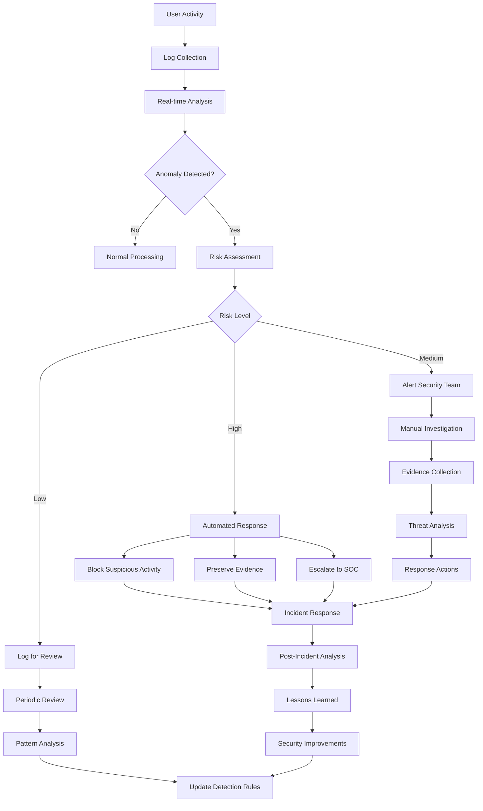

# Security Analysis Example: How Logging and Monitoring Systems Help with Security Analysis

## Executive Summary

This document provides a comprehensive example demonstrating how the Jira logging and monitoring system enables effective security analysis. Through real-world scenarios, we show how structured logging, real-time monitoring, and automated alerting work together to detect, investigate, and respond to security threats.

## Scenario: Detecting and Investigating a Potential Insider Threat

### Background

A security analyst receives an automated alert about unusual access patterns in the Jira system. This example demonstrates how the logging and monitoring system helps identify, investigate, and respond to a potential insider threat involving unauthorized access to sensitive project data.

### Timeline of Events

#### Day 1 - 14:30 UTC: Initial Suspicious Activity

**Event**: Unusual login pattern detected by the monitoring system

**Log Entry - Authentication Event**:
```json
{
  "timestamp": "2024-01-15T14:30:15.123Z",
  "level": "WARN",
  "category": "security_audit",
  "event_type": "unusual_login_pattern",
  "correlation_id": "security_alert_001",
  "authentication": {
    "user_id": "jane.contractor",
    "method": "ldap",
    "source_ip": "203.0.113.45",
    "user_agent": "Mozilla/5.0 (Windows NT 10.0; Win64; x64) AppleWebKit/537.36",
    "session_id": "sess_suspicious_001",
    "mfa_used": false,
    "login_time": "2024-01-15T14:30:15.123Z"
  },
  "security_context": {
    "risk_score": "high",
    "risk_factors": [
      "login_outside_normal_hours",
      "new_geographic_location",
      "mfa_not_used",
      "unusual_user_agent"
    ],
    "geo_location": "Unknown Location",
    "device_fingerprint": "fp_unknown_device",
    "previous_login": "2024-01-12T09:15:00.000Z",
    "failed_attempts_today": 0,
    "normal_login_hours": "09:00-17:00 UTC",
    "normal_locations": ["New York, US", "Boston, US"]
  },
  "automated_response": {
    "additional_monitoring_enabled": true,
    "session_flagged": true,
    "security_team_notified": true
  }
}
```

**Monitoring Alert Generated**:
```json
{
  "alert_id": "SEC-2024-001",
  "severity": "HIGH",
  "title": "Unusual Login Pattern Detected",
  "description": "User jane.contractor logged in from unusual location outside normal hours without MFA",
  "triggered_at": "2024-01-15T14:30:30.000Z",
  "metrics": {
    "risk_score": 8.5,
    "confidence": 0.85,
    "anomaly_score": 7.2
  },
  "recommended_actions": [
    "Review user activity logs",
    "Verify user identity",
    "Monitor ongoing session activity",
    "Consider temporary access restriction"
  ]
}
```

#### Day 1 - 14:45 UTC: Suspicious Data Access

**Event**: User accesses projects they don't normally work on

**Log Entry - Authorization Event**:
```json
{
  "timestamp": "2024-01-15T14:45:22.456Z",
  "level": "WARN",
  "category": "security_audit",
  "event_type": "unusual_project_access",
  "correlation_id": "security_alert_001",
  "authorization": {
    "user_id": "jane.contractor",
    "session_id": "sess_suspicious_001",
    "requested_action": "browse_project",
    "resource": "FINANCE-2024",
    "resource_type": "project",
    "permission_required": "BROWSE_PROJECTS",
    "result": "granted",
    "access_granted_at": "2024-01-15T14:45:22.456Z"
  },
  "context": {
    "user_normal_projects": ["MARKETING-2024", "SALES-2024"],
    "project_sensitivity": "high",
    "project_classification": "financial_data",
    "user_groups": ["contractors", "marketing_team"],
    "project_access_history": {
      "first_access": "2024-01-15T14:45:22.456Z",
      "previous_access_count": 0,
      "normal_access_pattern": false
    }
  },
  "security_analysis": {
    "anomaly_detected": true,
    "risk_factors": [
      "accessing_sensitive_project",
      "no_previous_access_history",
      "outside_normal_project_scope",
      "contractor_accessing_financial_data"
    ],
    "risk_score": 9.2
  }
}
```

#### Day 1 - 15:00 UTC: Bulk Data Export Attempt

**Event**: User attempts to export large amounts of data

**Log Entry - User Activity**:
```json
{
  "timestamp": "2024-01-15T15:00:45.789Z",
  "level": "ERROR",
  "category": "security_audit",
  "event_type": "bulk_export_blocked",
  "correlation_id": "security_alert_001",
  "user_activity": {
    "user_id": "jane.contractor",
    "session_id": "sess_suspicious_001",
    "action": "export_issues",
    "project": "FINANCE-2024",
    "export_format": "csv",
    "requested_issue_count": 2847,
    "export_blocked": true,
    "block_reason": "exceeds_export_limit_for_user_role"
  },
  "security_context": {
    "user_role": "contractor",
    "normal_export_limit": 100,
    "requested_export_size": 2847,
    "export_contains_sensitive_data": true,
    "data_classification": ["financial", "confidential"],
    "previous_exports_today": 0,
    "previous_exports_this_week": 1
  },
  "automated_response": {
    "export_blocked": true,
    "security_team_alerted": true,
    "session_flagged_for_review": true,
    "additional_logging_enabled": true
  }
}
```

#### Day 1 - 15:05 UTC: Real-time Security Analysis

**Automated Correlation Analysis**:
```json
{
  "analysis_id": "CORR-2024-001",
  "timestamp": "2024-01-15T15:05:00.000Z",
  "analysis_type": "security_correlation",
  "time_window": "4h",
  "subject": {
    "user_id": "jane.contractor",
    "session_id": "sess_suspicious_001"
  },
  "correlated_events": [
    {
      "event_type": "unusual_login_pattern",
      "timestamp": "2024-01-15T14:30:15.123Z",
      "risk_score": 8.5
    },
    {
      "event_type": "unusual_project_access",
      "timestamp": "2024-01-15T14:45:22.456Z",
      "risk_score": 9.2
    },
    {
      "event_type": "bulk_export_blocked",
      "timestamp": "2024-01-15T15:00:45.789Z",
      "risk_score": 9.8
    }
  ],
  "threat_assessment": {
    "overall_risk_score": 9.5,
    "threat_category": "insider_threat",
    "confidence_level": 0.92,
    "threat_indicators": [
      "unusual_access_pattern",
      "privilege_escalation_attempt",
      "data_exfiltration_attempt",
      "outside_normal_behavior"
    ],
    "recommended_response": "immediate_investigation"
  },
  "automated_actions": {
    "user_session_terminated": false,
    "additional_monitoring_enabled": true,
    "security_team_escalation": true,
    "incident_created": "INC-2024-001"
  }
}
```

### Security Investigation Process

#### Step 1: Historical Analysis

The security team uses the logging system to analyze historical patterns:

**Query**: Find all activities by user in the last 30 days
```sql
SELECT timestamp, event_type, project, action, risk_score
FROM security_logs 
WHERE user_id = 'jane.contractor' 
  AND timestamp >= NOW() - INTERVAL '30 days'
ORDER BY timestamp DESC;
```

**Results Show**:
- Normal working hours: 9 AM - 5 PM EST
- Typical projects: MARKETING-2024, SALES-2024
- Average daily activities: 45 actions
- No previous access to financial projects
- No previous bulk export attempts

#### Step 2: Network Analysis

**Log Entry - Network Monitoring**:
```json
{
  "timestamp": "2024-01-15T15:10:00.000Z",
  "metric_type": "network_analysis",
  "analysis_target": "203.0.113.45",
  "network_intelligence": {
    "ip_address": "203.0.113.45",
    "geolocation": {
      "country": "Unknown",
      "city": "Unknown",
      "coordinates": null,
      "isp": "Unknown ISP",
      "organization": "Unknown"
    },
    "reputation": {
      "threat_score": 6.5,
      "categories": ["proxy", "anonymizer"],
      "blacklist_status": "not_listed",
      "previous_incidents": 0
    },
    "connection_analysis": {
      "connection_type": "vpn_or_proxy",
      "anonymization_detected": true,
      "tor_exit_node": false,
      "datacenter_ip": true
    }
  },
  "risk_assessment": {
    "risk_level": "high",
    "risk_factors": [
      "anonymized_connection",
      "datacenter_ip",
      "unknown_geolocation",
      "potential_proxy_usage"
    ]
  }
}
```

#### Step 3: Behavioral Analysis

**Machine Learning Analysis**:
```json
{
  "analysis_id": "ML-2024-001",
  "timestamp": "2024-01-15T15:15:00.000Z",
  "analysis_type": "behavioral_anomaly_detection",
  "user_id": "jane.contractor",
  "time_period": "30_days",
  "behavioral_model": {
    "normal_patterns": {
      "login_times": ["09:00-17:00 EST"],
      "login_locations": ["New York", "Boston"],
      "project_access": ["MARKETING-2024", "SALES-2024"],
      "daily_activity_count": {"mean": 45, "std_dev": 12},
      "export_frequency": {"weekly_avg": 0.5, "max_size": 25}
    },
    "current_session_analysis": {
      "anomaly_score": 9.7,
      "deviations": [
        {
          "metric": "login_time",
          "normal_range": "09:00-17:00",
          "actual": "14:30",
          "deviation_score": 8.2
        },
        {
          "metric": "project_access",
          "normal_projects": ["MARKETING-2024", "SALES-2024"],
          "accessed": ["FINANCE-2024"],
          "deviation_score": 9.5
        },
        {
          "metric": "export_attempt",
          "normal_size": 25,
          "attempted": 2847,
          "deviation_score": 9.9
        }
      ]
    }
  },
  "threat_classification": {
    "primary_threat": "insider_threat",
    "sub_category": "data_exfiltration",
    "confidence": 0.94,
    "severity": "high"
  }
}
```

### Security Response Actions

#### Immediate Response (Automated)

1. **Session Monitoring Enhancement**:
   ```json
   {
     "action": "enhance_session_monitoring",
     "user_id": "jane.contractor",
     "session_id": "sess_suspicious_001",
     "monitoring_level": "maximum",
     "log_all_actions": true,
     "real_time_analysis": true,
     "screenshot_capture": true
   }
   ```

2. **Access Restriction**:
   ```json
   {
     "action": "restrict_access",
     "user_id": "jane.contractor",
     "restrictions": [
       "block_bulk_exports",
       "limit_project_access",
       "require_manager_approval",
       "enable_additional_mfa"
     ],
     "duration": "pending_investigation"
   }
   ```

#### Investigation Response (Manual)

1. **Security Team Notification**:
   - Immediate alert to security operations center
   - Incident ticket created with all correlated evidence
   - Escalation to security manager

2. **Evidence Collection**:
   - All session logs preserved
   - Network traffic analysis initiated
   - User device forensics requested

3. **Business Impact Assessment**:
   - Identify potentially compromised data
   - Assess business risk
   - Determine notification requirements

### Outcome and Lessons Learned

#### Investigation Results

After investigation, it was determined that:
- The user's credentials were compromised
- The access was from a malicious actor using stolen credentials
- No data was successfully exfiltrated due to automated blocking
- The real employee was on vacation and unaware of the breach

#### System Effectiveness

The logging and monitoring system demonstrated effectiveness by:

1. **Early Detection**: Identified suspicious activity within minutes
2. **Automated Response**: Blocked data exfiltration attempt automatically
3. **Comprehensive Evidence**: Provided complete audit trail for investigation
4. **Risk Assessment**: Accurately assessed threat level and recommended actions
5. **Correlation Analysis**: Connected multiple events to identify the threat pattern

#### Improvements Implemented

Based on this incident:
- Enhanced MFA requirements for contractor accounts
- Improved geolocation-based access controls
- Added behavioral analysis for all users
- Implemented stricter data export controls

## Key Benefits of Logging and Monitoring for Security Analysis

### 1. Real-time Threat Detection

**Capability**: Immediate identification of security threats as they occur

**Example Benefits**:
- Detect unusual login patterns within seconds
- Identify privilege escalation attempts in real-time
- Spot data exfiltration attempts before completion
- Recognize compromised accounts through behavioral analysis

**Technical Implementation**:
```json
{
  "detection_rules": [
    {
      "rule_name": "unusual_login_pattern",
      "conditions": [
        "login_outside_normal_hours",
        "new_geographic_location",
        "failed_mfa_attempts"
      ],
      "response_time": "< 30 seconds",
      "automated_actions": ["flag_session", "notify_security_team"]
    }
  ]
}
```

### 2. Comprehensive Audit Trail

**Capability**: Complete forensic evidence for security investigations

**Example Benefits**:
- Track every user action with timestamps and context
- Maintain immutable audit logs for compliance
- Provide evidence for legal proceedings
- Enable post-incident analysis and learning

**Log Retention Strategy**:
```json
{
  "retention_policy": {
    "security_logs": {
      "hot_storage": "90_days",
      "warm_storage": "2_years",
      "cold_storage": "7_years",
      "compliance_requirement": "SOX_HIPAA_GDPR"
    }
  }
}
```

### 3. Behavioral Analysis and Anomaly Detection

**Capability**: Identify threats through deviation from normal behavior patterns

**Example Benefits**:
- Detect insider threats through behavioral changes
- Identify compromised accounts through unusual activity
- Spot advanced persistent threats (APTs)
- Reduce false positives through contextual analysis

**Machine Learning Models**:
```json
{
  "behavioral_models": [
    {
      "model_type": "user_behavior_baseline",
      "features": [
        "login_times",
        "project_access_patterns",
        "data_export_frequency",
        "geographic_locations"
      ],
      "update_frequency": "daily",
      "anomaly_threshold": 0.85
    }
  ]
}
```

### 4. Automated Incident Response

**Capability**: Immediate automated response to security threats

**Example Benefits**:
- Block suspicious activities automatically
- Isolate compromised accounts
- Preserve evidence automatically
- Escalate to appropriate security personnel

**Response Automation**:
```json
{
  "automated_responses": [
    {
      "trigger": "high_risk_data_access",
      "actions": [
        "block_bulk_exports",
        "require_additional_authentication",
        "notify_data_owner",
        "create_security_incident"
      ],
      "execution_time": "< 5 seconds"
    }
  ]
}
```

### 5. Compliance and Regulatory Support

**Capability**: Meet regulatory requirements for security monitoring and reporting

**Example Benefits**:
- Demonstrate compliance with security regulations
- Provide audit evidence for regulatory reviews
- Support incident reporting requirements
- Enable data breach notification compliance

**Compliance Features**:
```json
{
  "compliance_support": {
    "regulations": ["GDPR", "SOX", "HIPAA", "PCI_DSS"],
    "features": [
      "immutable_audit_logs",
      "data_classification_tracking",
      "access_control_monitoring",
      "breach_detection_reporting"
    ],
    "reporting": {
      "frequency": "monthly",
      "automated": true,
      "stakeholders": ["compliance_team", "legal_team", "executives"]
    }
  }
}
```

## Conclusion

This example demonstrates how a comprehensive logging and monitoring system serves as a critical security control by providing:

1. **Proactive Threat Detection**: Identifying security threats before they cause damage
2. **Comprehensive Visibility**: Complete view of all system activities and user behaviors
3. **Rapid Response**: Automated and manual response capabilities to contain threats
4. **Forensic Evidence**: Detailed audit trails for investigation and compliance
5. **Continuous Improvement**: Learning from incidents to strengthen security posture

The integration of structured logging, real-time monitoring, behavioral analysis, and automated response creates a robust security analysis capability that significantly enhances an organization's ability to detect, investigate, and respond to security threats effectively.

## Mermaid Diagram: Security Analysis Workflow



This workflow shows how logging and monitoring systems create a continuous security analysis cycle that improves over time through learning and adaptation.