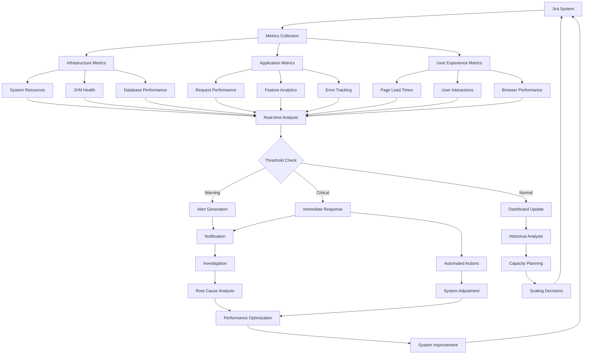

# System Health and Performance Monitoring Example: Jira System Monitoring

## Executive Summary

This document demonstrates how logging and monitoring systems provide comprehensive system health and performance monitoring for Jira environments. Through detailed examples, we show how real-time monitoring, automated alerting, and performance analytics help maintain optimal Jira system performance and availability.

## Scenario: Comprehensive Jira System Monitoring

### Background

A large enterprise runs a Jira Data Center deployment serving 5,000+ users across multiple projects. The system must maintain 99.9% availability with optimal performance during peak usage periods. The monitoring system tracks system health, application performance, and user experience metrics.

## System Health Monitoring Examples

### 1. Infrastructure Health Monitoring

#### Server Resource Monitoring

**System Resource Alert - High CPU Usage**:
```json
{
  "timestamp": "2024-01-15T14:30:00.123Z",
  "alert_id": "SYS-HEALTH-001",
  "severity": "WARNING",
  "category": "system_health",
  "event_type": "high_cpu_utilization",
  "host": "jira-node-01.company.com",
  "metrics": {
    "cpu": {
      "current_usage_percent": 85.2,
      "threshold_warning": 80.0,
      "threshold_critical": 90.0,
      "load_average": {
        "1min": 6.8,
        "5min": 5.2,
        "15min": 4.1
      },
      "top_processes": [
        {
          "process": "java (Jira)",
          "cpu_percent": 72.3,
          "memory_mb": 8192,
          "threads": 245
        },
        {
          "process": "postgres",
          "cpu_percent": 8.9,
          "memory_mb": 2048,
          "threads": 12
        }
      ]
    },
    "memory": {
      "total_mb": 32768,
      "used_mb": 28672,
      "free_mb": 4096,
      "usage_percent": 87.5,
      "swap_used_mb": 1024,
      "jvm_heap_usage_percent": 78.2
    },
    "disk": {
      "root_partition": {
        "usage_percent": 65.2,
        "free_gb": 45.2,
        "io_wait_percent": 12.3
      },
      "data_partition": {
        "usage_percent": 72.8,
        "free_gb": 234.5,
        "io_wait_percent": 8.7
      }
    }
  },
  "impact_assessment": {
    "user_impact": "potential_slowdown",
    "affected_services": ["issue_search", "dashboard_loading"],
    "estimated_affected_users": 150,
    "performance_degradation": "15%"
  },
  "recommended_actions": [
    "investigate_high_cpu_processes",
    "check_for_runaway_queries",
    "consider_scaling_resources",
    "review_recent_configuration_changes"
  ]
}
```

#### JVM Health Monitoring

**JVM Memory Alert - Heap Usage Critical**:
```json
{
  "timestamp": "2024-01-15T14:35:00.456Z",
  "alert_id": "JVM-HEALTH-001",
  "severity": "CRITICAL",
  "category": "jvm_health",
  "event_type": "heap_memory_critical",
  "application": "jira",
  "instance": "jira-node-01",
  "jvm_metrics": {
    "heap_memory": {
      "used_mb": 11264,
      "max_mb": 12288,
      "usage_percent": 91.7,
      "threshold_warning": 85.0,
      "threshold_critical": 90.0,
      "eden_space": {
        "used_mb": 2048,
        "max_mb": 4096,
        "usage_percent": 50.0
      },
      "old_generation": {
        "used_mb": 8704,
        "max_mb": 8192,
        "usage_percent": 106.3,
        "collection_frequency": "increasing"
      }
    },
    "garbage_collection": {
      "young_gen": {
        "collections_last_hour": 45,
        "avg_collection_time_ms": 125,
        "total_time_ms": 5625
      },
      "old_gen": {
        "collections_last_hour": 8,
        "avg_collection_time_ms": 2340,
        "total_time_ms": 18720,
        "full_gc_frequency": "every_7_minutes"
      },
      "gc_overhead_percent": 12.3
    },
    "thread_analysis": {
      "total_threads": 287,
      "peak_threads": 312,
      "deadlocked_threads": 0,
      "blocked_threads": 23,
      "waiting_threads": 145
    }
  },
  "performance_impact": {
    "response_time_increase": "45%",
    "throughput_decrease": "30%",
    "user_complaints": 12,
    "timeout_errors": 8
  },
  "automated_actions": {
    "heap_dump_triggered": true,
    "thread_dump_captured": true,
    "gc_analysis_initiated": true,
    "load_balancer_weight_reduced": true
  }
}
```

#### Database Health Monitoring

**Database Performance Alert**:
```json
{
  "timestamp": "2024-01-15T14:40:00.789Z",
  "alert_id": "DB-HEALTH-001",
  "severity": "HIGH",
  "category": "database_health",
  "event_type": "slow_query_threshold_exceeded",
  "database": {
    "type": "postgresql",
    "version": "13.8",
    "instance": "jira-db-primary",
    "cluster_role": "primary"
  },
  "performance_metrics": {
    "connections": {
      "active": 78,
      "idle": 22,
      "max_connections": 100,
      "utilization_percent": 78.0,
      "waiting_connections": 5
    },
    "query_performance": {
      "avg_query_time_ms": 234.5,
      "p95_query_time_ms": 1250.0,
      "p99_query_time_ms": 3450.0,
      "slow_queries_per_minute": 12,
      "slow_query_threshold_ms": 1000
    },
    "lock_analysis": {
      "active_locks": 156,
      "waiting_locks": 8,
      "deadlocks_detected": 2,
      "lock_wait_time_ms": 2340
    },
    "cache_performance": {
      "buffer_hit_ratio": 0.89,
      "shared_buffer_usage_percent": 92.3,
      "cache_misses_per_second": 45
    }
  },
  "slow_queries": [
    {
      "query_id": "slow_query_001",
      "execution_time_ms": 3450,
      "query_text": "SELECT * FROM jiraissue ji JOIN project p ON ji.project = p.id WHERE ji.created > ? AND p.pkey = ?",
      "execution_count": 23,
      "avg_execution_time_ms": 2890,
      "table_scans": 2,
      "index_usage": "partial"
    }
  ],
  "impact_assessment": {
    "affected_operations": ["issue_search", "project_browsing", "dashboard_loading"],
    "user_experience_impact": "significant_slowdown",
    "timeout_risk": "high"
  }
}
```

### 2. Application Health Monitoring

#### Jira Application Status

**Application Health Check Results**:
```json
{
  "timestamp": "2024-01-15T14:45:00.000Z",
  "health_check_id": "APP-HEALTH-001",
  "application": "jira",
  "version": "8.20.1",
  "build": "820001",
  "cluster_node": "jira-node-01",
  "health_status": "DEGRADED",
  "health_checks": {
    "database_connectivity": {
      "status": "HEALTHY",
      "response_time_ms": 45,
      "connection_pool_available": true,
      "last_check": "2024-01-15T14:44:55.000Z"
    },
    "index_health": {
      "status": "DEGRADED",
      "elasticsearch_status": "yellow",
      "index_count": 15,
      "unhealthy_indices": 2,
      "replication_issues": true,
      "last_reindex": "2024-01-14T02:00:00.000Z"
    },
    "plugin_status": {
      "status": "HEALTHY",
      "total_plugins": 47,
      "enabled_plugins": 45,
      "disabled_plugins": 2,
      "plugin_errors": 0,
      "last_plugin_scan": "2024-01-15T14:30:00.000Z"
    },
    "license_status": {
      "status": "HEALTHY",
      "license_type": "data_center",
      "users_licensed": 5000,
      "users_active": 3245,
      "expiry_date": "2024-12-31T23:59:59.000Z",
      "days_until_expiry": 351
    },
    "cluster_health": {
      "status": "HEALTHY",
      "total_nodes": 3,
      "active_nodes": 3,
      "cluster_state": "active",
      "shared_home_accessible": true,
      "cache_replication": "functioning"
    }
  },
  "system_resources": {
    "jvm_heap_usage_percent": 78.2,
    "system_cpu_usage_percent": 85.2,
    "system_memory_usage_percent": 87.5,
    "disk_usage_percent": 72.8
  },
  "performance_indicators": {
    "avg_response_time_ms": 1250,
    "requests_per_second": 45.2,
    "error_rate_percent": 2.3,
    "active_sessions": 1247
  }
}
```

## Performance Monitoring Examples

### 1. Request Performance Monitoring

#### Slow Request Detection

**Slow Request Alert**:
```json
{
  "timestamp": "2024-01-15T15:00:00.123Z",
  "alert_id": "PERF-001",
  "severity": "WARNING",
  "category": "performance_monitoring",
  "event_type": "slow_request_detected",
  "request_details": {
    "correlation_id": "req_slow_001",
    "method": "GET",
    "uri": "/secure/Dashboard.jspa",
    "user_id": "john.doe",
    "session_id": "sess_123456",
    "user_agent": "Mozilla/5.0 (Windows NT 10.0; Win64; x64) AppleWebKit/537.36",
    "source_ip": "192.168.1.100"
  },
  "performance_metrics": {
    "total_response_time_ms": 5670,
    "threshold_warning_ms": 3000,
    "threshold_critical_ms": 10000,
    "breakdown": {
      "database_time_ms": 3240,
      "cache_time_ms": 120,
      "rendering_time_ms": 1890,
      "plugin_execution_time_ms": 420,
      "network_time_ms": 0
    },
    "database_metrics": {
      "queries_executed": 23,
      "slow_queries": 3,
      "total_rows_returned": 1247,
      "cache_hit_ratio": 0.67,
      "index_scans": 15,
      "sequential_scans": 8
    },
    "memory_usage": {
      "heap_allocated_mb": 45.2,
      "objects_created": 12450,
      "gc_triggered": true
    }
  },
  "slow_components": [
    {
      "component": "dashboard_gadget_loader",
      "execution_time_ms": 2340,
      "queries": 8,
      "cache_misses": 5
    },
    {
      "component": "project_statistics_calculator",
      "execution_time_ms": 1890,
      "queries": 12,
      "cache_misses": 3
    }
  ],
  "user_impact": {
    "user_experience": "poor",
    "likelihood_of_timeout": "medium",
    "similar_requests_affected": 15
  }
}
```

#### Feature Performance Analysis

**Feature Performance Report**:
```json
{
  "timestamp": "2024-01-15T15:15:00.000Z",
  "report_id": "PERF-ANALYSIS-001",
  "report_type": "feature_performance_analysis",
  "time_period": "last_24_hours",
  "feature_metrics": {
    "issue_search": {
      "total_requests": 12450,
      "avg_response_time_ms": 890,
      "p50_response_time_ms": 567,
      "p95_response_time_ms": 2340,
      "p99_response_time_ms": 4560,
      "error_rate_percent": 1.2,
      "timeout_rate_percent": 0.3,
      "performance_trend": "degrading",
      "bottlenecks": [
        {
          "component": "jql_parser",
          "avg_time_ms": 234,
          "impact": "medium"
        },
        {
          "component": "index_search",
          "avg_time_ms": 456,
          "impact": "high"
        }
      ]
    },
    "dashboard_loading": {
      "total_requests": 8920,
      "avg_response_time_ms": 1250,
      "p50_response_time_ms": 890,
      "p95_response_time_ms": 3450,
      "p99_response_time_ms": 6780,
      "error_rate_percent": 2.1,
      "timeout_rate_percent": 0.8,
      "performance_trend": "stable",
      "gadget_performance": [
        {
          "gadget": "assigned_to_me",
          "avg_load_time_ms": 345,
          "cache_hit_ratio": 0.78
        },
        {
          "gadget": "activity_stream",
          "avg_load_time_ms": 567,
          "cache_hit_ratio": 0.45
        }
      ]
    },
    "issue_creation": {
      "total_requests": 3450,
      "avg_response_time_ms": 678,
      "p50_response_time_ms": 456,
      "p95_response_time_ms": 1234,
      "p99_response_time_ms": 2890,
      "error_rate_percent": 0.5,
      "success_rate_percent": 99.5,
      "performance_trend": "improving",
      "validation_time_ms": 123,
      "database_insert_time_ms": 234,
      "notification_time_ms": 321
    }
  },
  "resource_correlation": {
    "cpu_correlation": 0.78,
    "memory_correlation": 0.65,
    "database_correlation": 0.89,
    "network_correlation": 0.23
  }
}
```

### 2. User Experience Monitoring

#### Page Load Performance

**Page Performance Monitoring**:
```json
{
  "timestamp": "2024-01-15T15:30:00.000Z",
  "metric_type": "user_experience",
  "page": "/secure/Dashboard.jspa",
  "time_window": "15_minutes",
  "user_experience_metrics": {
    "page_load_times": {
      "avg_load_time_ms": 2340,
      "p50_load_time_ms": 1890,
      "p75_load_time_ms": 2890,
      "p90_load_time_ms": 4560,
      "p95_load_time_ms": 6780,
      "p99_load_time_ms": 9870
    },
    "core_web_vitals": {
      "largest_contentful_paint_ms": 2340,
      "first_input_delay_ms": 89,
      "cumulative_layout_shift": 0.12,
      "first_contentful_paint_ms": 890,
      "time_to_interactive_ms": 3450
    },
    "resource_timing": {
      "dns_lookup_ms": 12,
      "tcp_connect_ms": 45,
      "ssl_handshake_ms": 67,
      "server_response_ms": 1234,
      "dom_processing_ms": 890,
      "resource_loading_ms": 567
    },
    "javascript_performance": {
      "script_execution_time_ms": 456,
      "dom_ready_time_ms": 1890,
      "ajax_requests": 12,
      "ajax_avg_time_ms": 234
    }
  },
  "user_interaction_metrics": {
    "bounce_rate_percent": 15.2,
    "session_duration_avg_minutes": 23.4,
    "pages_per_session": 8.7,
    "user_satisfaction_score": 3.2,
    "error_encounters": 23
  },
  "browser_breakdown": {
    "chrome": {
      "usage_percent": 67.8,
      "avg_load_time_ms": 2100
    },
    "firefox": {
      "usage_percent": 23.4,
      "avg_load_time_ms": 2450
    },
    "safari": {
      "usage_percent": 6.7,
      "avg_load_time_ms": 2890
    },
    "edge": {
      "usage_percent": 2.1,
      "avg_load_time_ms": 2340
    }
  }
}
```

### 3. System Capacity Monitoring

#### Capacity Planning Metrics

**System Capacity Analysis**:
```json
{
  "timestamp": "2024-01-15T16:00:00.000Z",
  "analysis_id": "CAPACITY-001",
  "analysis_type": "system_capacity_planning",
  "time_period": "last_30_days",
  "current_capacity": {
    "concurrent_users": {
      "current": 1247,
      "peak_today": 1890,
      "peak_this_month": 2340,
      "licensed_capacity": 5000,
      "utilization_percent": 37.8
    },
    "system_resources": {
      "cpu_utilization": {
        "avg_percent": 65.2,
        "peak_percent": 89.7,
        "capacity_remaining_percent": 10.3
      },
      "memory_utilization": {
        "avg_percent": 72.8,
        "peak_percent": 91.2,
        "capacity_remaining_percent": 8.8
      },
      "storage_utilization": {
        "data_partition_percent": 72.8,
        "growth_rate_gb_per_month": 45.2,
        "months_until_full": 8.5
      }
    },
    "database_capacity": {
      "connection_utilization_percent": 78.0,
      "query_throughput_per_second": 234,
      "storage_size_gb": 256.7,
      "growth_rate_gb_per_month": 12.3
    }
  },
  "growth_projections": {
    "user_growth": {
      "current_active_users": 3245,
      "projected_6_months": 3890,
      "projected_12_months": 4560,
      "growth_rate_percent_monthly": 3.2
    },
    "data_growth": {
      "current_issues": 125000,
      "projected_6_months": 156000,
      "projected_12_months": 189000,
      "growth_rate_issues_per_month": 2580
    },
    "resource_requirements": {
      "cpu_scaling_needed": "20% increase in 6 months",
      "memory_scaling_needed": "32GB additional in 4 months",
      "storage_scaling_needed": "500GB additional in 8 months",
      "database_scaling_needed": "read replica in 3 months"
    }
  },
  "performance_thresholds": {
    "response_time_sla": "< 3 seconds for 95% of requests",
    "availability_sla": "> 99.9% uptime",
    "concurrent_user_limit": 2000,
    "database_connection_limit": 80
  },
  "recommendations": [
    {
      "priority": "high",
      "action": "increase_jvm_heap_size",
      "timeline": "next_maintenance_window",
      "impact": "improve_memory_utilization"
    },
    {
      "priority": "medium",
      "action": "add_database_read_replica",
      "timeline": "within_3_months",
      "impact": "improve_query_performance"
    },
    {
      "priority": "low",
      "action": "optimize_elasticsearch_indices",
      "timeline": "within_6_months",
      "impact": "improve_search_performance"
    }
  ]
}
```

## Automated Monitoring and Alerting

### Real-time Health Dashboard

**System Health Dashboard Data**:
```json
{
  "dashboard_id": "JIRA-HEALTH-DASHBOARD",
  "last_updated": "2024-01-15T16:15:00.000Z",
  "refresh_interval": "30_seconds",
  "overall_health": {
    "status": "DEGRADED",
    "health_score": 78.5,
    "availability_percent": 99.2,
    "performance_score": 72.3
  },
  "key_metrics": {
    "response_time": {
      "current_avg_ms": 1890,
      "target_ms": 1000,
      "trend": "increasing",
      "status": "warning"
    },
    "error_rate": {
      "current_percent": 2.3,
      "target_percent": 1.0,
      "trend": "stable",
      "status": "warning"
    },
    "throughput": {
      "current_rps": 45.2,
      "capacity_rps": 100.0,
      "utilization_percent": 45.2,
      "status": "healthy"
    },
    "active_users": {
      "current": 1247,
      "peak_today": 1890,
      "capacity": 2000,
      "status": "healthy"
    }
  },
  "system_components": {
    "application_servers": {
      "total": 3,
      "healthy": 2,
      "degraded": 1,
      "failed": 0,
      "status": "degraded"
    },
    "database": {
      "primary": "healthy",
      "replicas": "healthy",
      "connection_pool": "warning",
      "status": "warning"
    },
    "search_indices": {
      "total_indices": 15,
      "healthy_indices": 13,
      "degraded_indices": 2,
      "status": "degraded"
    },
    "load_balancer": {
      "status": "healthy",
      "backend_servers": 3,
      "active_connections": 1247
    }
  },
  "recent_alerts": [
    {
      "alert_id": "JVM-HEALTH-001",
      "severity": "critical",
      "message": "High heap usage on jira-node-01",
      "timestamp": "2024-01-15T14:35:00.000Z",
      "status": "active"
    },
    {
      "alert_id": "DB-HEALTH-001",
      "severity": "high",
      "message": "Slow queries detected",
      "timestamp": "2024-01-15T14:40:00.000Z",
      "status": "investigating"
    }
  ]
}
```

## Key Benefits of System Health and Performance Monitoring

### 1. Proactive Issue Detection

**Capability**: Identify problems before they impact users

**Benefits**:
- Early warning of resource exhaustion
- Detection of performance degradation trends
- Identification of system bottlenecks
- Prevention of system outages

### 2. Performance Optimization

**Capability**: Continuous performance analysis and optimization

**Benefits**:
- Identification of slow queries and operations
- Resource utilization optimization
- Capacity planning based on actual usage
- Performance trend analysis

### 3. User Experience Monitoring

**Capability**: Real-time monitoring of user experience metrics

**Benefits**:
- Page load time optimization
- User satisfaction measurement
- Browser-specific performance analysis
- Core web vitals tracking

### 4. Automated Response and Scaling

**Capability**: Automated response to performance issues

**Benefits**:
- Automatic resource scaling
- Load balancing adjustments
- Cache optimization
- Alert escalation procedures

## Conclusion

This comprehensive example demonstrates how system health and performance monitoring provides:

1. **Complete Visibility**: Full-stack monitoring from infrastructure to user experience
2. **Proactive Management**: Early detection and prevention of performance issues
3. **Data-Driven Decisions**: Performance analytics for optimization and capacity planning
4. **Automated Response**: Immediate response to critical system health issues
5. **Continuous Improvement**: Ongoing performance optimization based on monitoring data

The integration of infrastructure monitoring, application performance monitoring, and user experience tracking creates a comprehensive monitoring solution that ensures optimal Jira system performance and availability.

## Mermaid Diagram: System Health and Performance Monitoring Flow



This workflow shows how comprehensive monitoring creates a continuous cycle of measurement, analysis, and improvement for optimal Jira system performance.