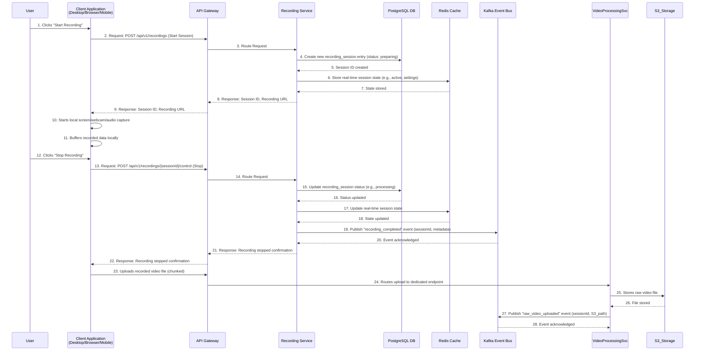
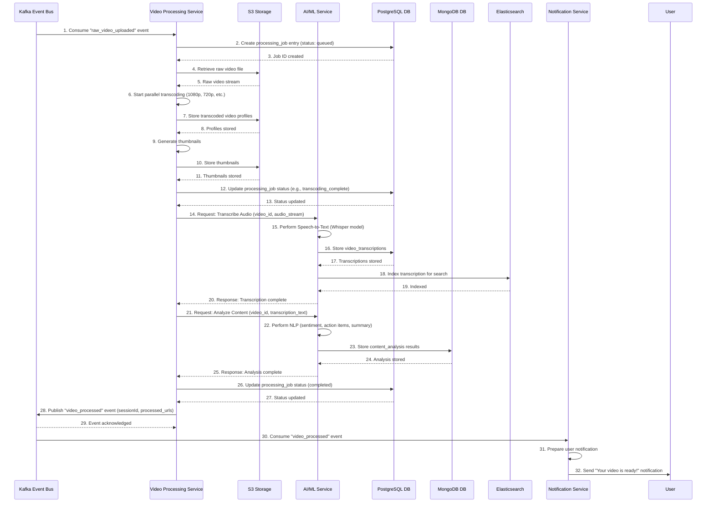
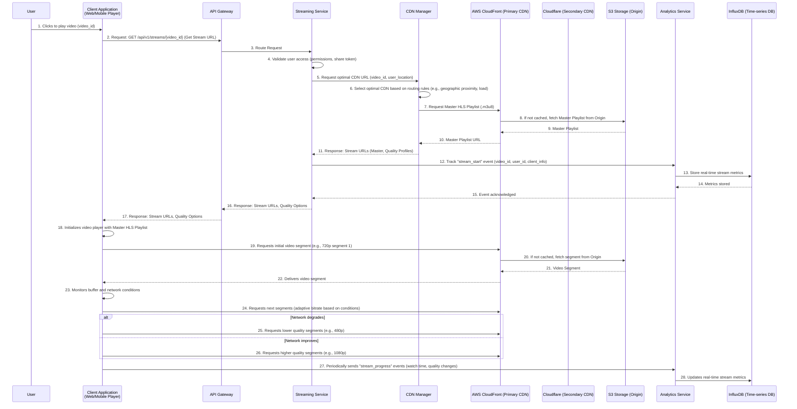

# Atlassian Loom: Component Interaction Flows

This document illustrates the typical interaction flows between the various microservices and components during the key operations of recording, video processing, and streaming. These sequence diagrams highlight the communication patterns and data flow across the Atlassian Loom platform.

## 1. Recording Flow

This diagram shows the sequence of interactions when a user initiates and completes a recording.

## 2. Video Processing Flow

This diagram shows the asynchronous flow of video processing, triggered by a completed recording.

## 3. Streaming Flow

This diagram shows how a user requests and streams a video, leveraging the CDN and adaptive bitrate.

---
**Document Version**: 1.0  
**Last Updated**: 2025-01-30  
**Focus**: Component interaction flows for core operations  
**Review Status**: Ready for review