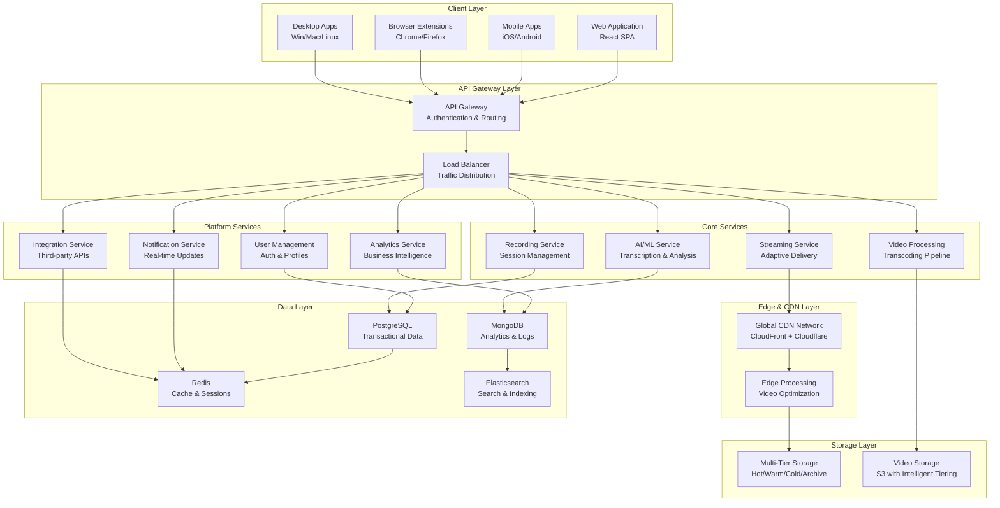
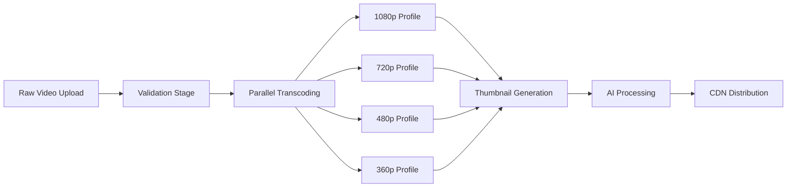
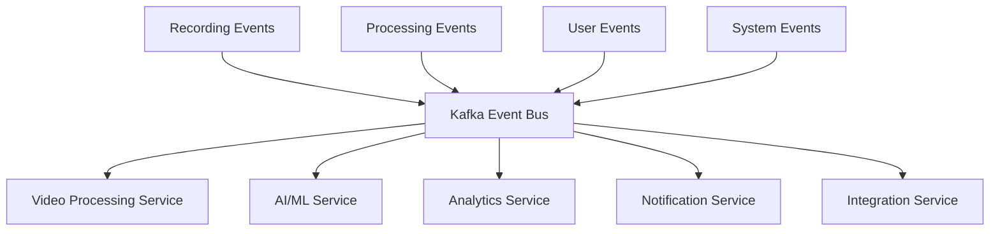

# Atlassian Loom: High-Level Design & Architecture Rationale

## Executive Summary

This document presents the high-level design for the Atlassian Loom platform, focusing on design decisions and their rationale rather than implementation details. The design addresses 180 functional requirements and 176 non-functional requirements through a video-first, AI-native, cloud-native architecture optimized for enterprise-scale video communication.

## 1. System Architecture Overview

### 1.1 High-Level Architecture Diagram



### 1.2 Core Design Philosophy

**Video-First Architecture**: Every component is optimized for video workloads, from storage patterns to network protocols to processing pipelines.

**Design Rationale**: Traditional communication platforms retrofit video capabilities onto text-based architectures, leading to performance bottlenecks. Our video-first approach ensures:
- Sub-2 second recording start times through optimized recording pipelines
- Efficient video processing with parallel transcoding workflows
- Global content delivery optimized for large video files
- Storage strategies designed for video lifecycle management

## 2. Functional Design Decisions

### 2.1 Recording Architecture

#### 2.1.1 Distributed Recording Coordination

**Design Decision**: Implement a centralized Recording Service that coordinates distributed recording sessions across multiple client platforms.

**Rationale**:
- **Cross-Platform Consistency**: Ensures identical recording behavior across Windows, macOS, Linux, and browser environments
- **Session Management**: Centralized state management for pause/resume, multi-segment recordings
- **Real-time Coordination**: WebSocket connections enable real-time status updates and control commands
- **Scalability**: Stateless service design allows horizontal scaling for concurrent recording sessions

**Technical Implementation**:
```yaml
Recording Service Architecture:
  - Session State Management: PostgreSQL for persistence, Redis for real-time state
  - Real-time Communication: WebSocket connections for recording control
  - Multi-platform Support: Platform-specific recording agents with unified API
  - Concurrent Sessions: Support for 10,000+ simultaneous recordings
```

#### 2.1.2 Multi-Modal Recording Support

**Design Decision**: Support simultaneous screen, webcam, and audio recording with independent quality controls.

**Rationale**:
- **User Flexibility**: Different use cases require different recording modes (screen-only for tutorials, webcam-only for messages, combined for presentations)
- **Quality Optimization**: Independent encoding allows optimal quality/bandwidth trade-offs per stream
- **Bandwidth Management**: Adaptive quality based on network conditions and device capabilities

### 2.2 Video Processing Pipeline

#### 2.2.1 Parallel Processing Architecture

**Design Decision**: Implement a distributed processing pipeline with parallel transcoding across multiple quality profiles.

**Rationale**:
- **Performance**: 2x real-time processing speed requirement demands parallel execution
- **User Experience**: Faster processing means quicker video availability
- **Resource Efficiency**: Parallel processing maximizes hardware utilization
- **Fault Tolerance**: Independent processing jobs prevent single points of failure

**Processing Pipeline Design**:


#### 2.2.2 Intelligent Processing Optimization

**Design Decision**: Use AI-driven processing optimization to determine optimal encoding parameters.

**Rationale**:
- **Quality vs Size**: Automatic optimization reduces file sizes by 50% while maintaining quality
- **Content-Aware Encoding**: Different content types (screen recordings vs webcam videos) require different encoding strategies
- **Bandwidth Optimization**: Optimized videos reduce CDN costs and improve streaming performance

### 2.3 AI/ML Integration

#### 2.3.1 Real-Time and Batch Processing

**Design Decision**: Implement hybrid AI processing with real-time transcription and batch content analysis.

**Rationale**:
- **User Experience**: Real-time transcription provides immediate value during recording
- **Accuracy vs Speed**: Batch processing allows more sophisticated analysis with higher accuracy
- **Resource Management**: Separates time-sensitive from compute-intensive AI workloads
- **Scalability**: Independent scaling of real-time vs batch processing resources

**AI Processing Architecture**:
```yaml
Real-time Processing:
  - Speech-to-Text: OpenAI Whisper for live transcription
  - Content Moderation: Real-time inappropriate content detection
  - Live Captions: Immediate accessibility support

Batch Processing:
  - Content Analysis: Topic extraction, sentiment analysis
  - Action Items: Automated task identification
  - Summary Generation: AI-powered video summaries
  - Advanced Analytics: Engagement pattern analysis
```

### 2.4 Sharing and Collaboration

#### 2.4.1 Granular Access Control

**Design Decision**: Implement fine-grained access control with time-based, domain-based, and user-based restrictions.

**Rationale**:
- **Enterprise Security**: Enterprise customers require sophisticated access controls
- **Compliance**: GDPR and other regulations demand precise data access management
- **User Experience**: Simple sharing for casual users, advanced controls for enterprise
- **Audit Requirements**: Complete audit trail for compliance and security

**Access Control Matrix**:
```yaml
Access Control Levels:
  Public: Anyone with link can view
  Password Protected: Requires password for access
  Domain Restricted: Only users from specific domains
  User Specific: Only invited users can access
  Time Limited: Access expires after specified duration
  Download Control: Separate permissions for viewing vs downloading
```

## 3. Non-Functional Design Decisions

### 3.1 Performance Architecture

#### 3.1.1 Sub-2 Second Response Time Design

**Design Decision**: Architect all user-facing operations to complete within 2 seconds.

**Rationale**:
- **User Experience**: 2-second threshold is critical for user engagement and productivity
- **Competitive Advantage**: Faster than existing solutions provides market differentiation
- **Productivity Impact**: Reduced wait times increase user adoption and satisfaction

**Performance Optimization Strategies**:

1. **Recording Start Optimization**:
   - Pre-initialized recording buffers
   - Optimized codec initialization
   - Parallel resource allocation
   - Client-side preparation while server coordination occurs

2. **Video Processing Speed**:
   - GPU-accelerated encoding (NVIDIA NVENC, Intel Quick Sync)
   - Parallel processing across multiple quality profiles
   - Optimized FFmpeg configurations
   - Hardware-specific optimizations

3. **Streaming Performance**:
   - Adaptive bitrate streaming with HLS
   - Edge caching with 99%+ cache hit rates
   - Intelligent CDN routing based on user location
   - Preloading strategies for popular content

#### 3.1.2 Global Content Delivery Network

**Design Decision**: Multi-CDN strategy with intelligent routing and edge processing.

**Rationale**:
- **Global Performance**: Users worldwide require consistent low-latency access
- **Redundancy**: Multiple CDN providers prevent single points of failure
- **Cost Optimization**: Dynamic routing based on cost and performance metrics
- **Edge Processing**: Video optimization at edge locations reduces origin load

**CDN Architecture Design**:
```yaml
Multi-CDN Strategy:
  Primary CDN: AWS CloudFront
    - Regions: US East/West, EU West, Asia Pacific
    - Features: Origin Shield, Real-time logs, Lambda@Edge
    
  Secondary CDN: Cloudflare
    - Global presence with 200+ edge locations
    - DDoS protection and Web Application Firewall
    - Workers for edge computing
    
  Routing Logic:
    - Geographic proximity for primary routing
    - Performance metrics for secondary routing
    - Cost optimization for bulk transfers
    - Automatic failover between providers
```

### 3.2 Scalability Architecture

#### 3.2.1 Horizontal Scaling Design

**Design Decision**: Design all services for horizontal scaling with auto-scaling capabilities.

**Rationale**:
- **Growth Accommodation**: Support for 1M+ users requires elastic scaling
- **Cost Efficiency**: Scale resources based on actual demand
- **Performance Consistency**: Maintain performance during traffic spikes
- **Global Expansion**: Easy deployment to new regions

**Scaling Strategy**:

1. **Service-Level Scaling**:
   - Kubernetes Horizontal Pod Autoscaler (HPA)
   - Custom metrics-based scaling (queue depth, processing time)
   - Predictive scaling based on usage patterns
   - Cross-region load balancing

2. **Database Scaling**:
   - Read replicas for query distribution
   - Sharding strategy for large datasets
   - Connection pooling for efficient resource utilization
   - Caching layers to reduce database load

3. **Storage Scaling**:
   - Object storage with unlimited capacity
   - Intelligent tiering for cost optimization
   - Cross-region replication for disaster recovery
   - Automated lifecycle management

#### 3.2.2 Event-Driven Architecture

**Design Decision**: Implement event-driven architecture using Apache Kafka for service communication.

**Rationale**:
- **Loose Coupling**: Services can evolve independently
- **Scalability**: Asynchronous processing handles traffic spikes
- **Resilience**: Event replay capabilities for fault recovery
- **Audit Trail**: Complete event history for debugging and compliance

**Event Architecture**:


### 3.3 Security Architecture

#### 3.3.1 Zero Trust Security Model

**Design Decision**: Implement zero trust architecture with comprehensive security controls.

**Rationale**:
- **Enterprise Requirements**: Enterprise customers demand highest security standards
- **Compliance**: GDPR, HIPAA, SOC 2 compliance requires comprehensive security
- **Threat Landscape**: Modern security threats require defense-in-depth approach
- **Data Protection**: Video content requires special protection due to sensitivity

**Security Layers**:

1. **Network Security**:
   - VPC isolation with private subnets
   - Security groups with least-privilege access
   - Web Application Firewall (WAF) protection
   - DDoS mitigation at multiple layers

2. **Application Security**:
   - JWT-based authentication with short expiration
   - Role-based access control (RBAC)
   - API rate limiting and throttling
   - Input validation and output encoding

3. **Data Security**:
   - AES-256 encryption at rest
   - TLS 1.3 encryption in transit
   - End-to-end encryption for sensitive content
   - Key management with hardware security modules

#### 3.3.2 Privacy-by-Design Implementation

**Design Decision**: Build privacy protection into the platform architecture from the ground up.

**Rationale**:
- **Regulatory Compliance**: GDPR requires privacy-by-design approach
- **User Trust**: Privacy protection builds user confidence
- **Competitive Advantage**: Strong privacy stance differentiates from competitors
- **Future-Proofing**: Anticipates evolving privacy regulations

**Privacy Architecture**:
```yaml
Privacy Controls:
  Data Minimization:
    - Collect only necessary data
    - Automatic data expiration policies
    - User-controlled data retention
    
  Consent Management:
    - Granular consent controls
    - Easy consent withdrawal
    - Consent audit trails
    
  Data Subject Rights:
    - Right to access personal data
    - Right to rectification
    - Right to erasure ("right to be forgotten")
    - Right to data portability
    
  Technical Measures:
    - Data anonymization capabilities
    - Pseudonymization for analytics
    - Secure data deletion
    - Privacy impact assessments
```

### 3.4 Reliability Architecture

#### 3.4.1 99.9% Uptime SLA Design

**Design Decision**: Design for 99.9% uptime with comprehensive fault tolerance.

**Rationale**:
- **Business Continuity**: Video communication is critical for business operations
- **User Experience**: Downtime directly impacts user productivity
- **Competitive Requirement**: Industry standard for enterprise SaaS platforms
- **Revenue Protection**: Uptime SLA violations result in service credits

**Reliability Strategies**:

1. **Multi-Region Deployment**:
   - Active-active deployment across multiple AWS regions
   - Automatic failover with health checks
   - Cross-region data replication
   - Regional load balancing

2. **Service Resilience**:
   - Circuit breaker pattern for service calls
   - Retry logic with exponential backoff
   - Graceful degradation during partial failures
   - Health checks and automated recovery

3. **Data Reliability**:
   - 99.999% data durability with S3
   - Point-in-time recovery capabilities
   - Automated backup verification
   - Cross-region backup replication

## 4. Technology Stack Rationale

### 4.1 Programming Language Choices

#### 4.1.1 Go for Performance-Critical Services

**Services**: Recording Service, Video Processing Service, Streaming Service

**Rationale**:
- **Performance**: Compiled language with excellent concurrency support
- **Memory Efficiency**: Low memory footprint crucial for video processing
- **Concurrency**: Goroutines handle thousands of concurrent connections efficiently
- **Ecosystem**: Excellent libraries for video processing and networking

#### 4.1.2 Python for AI/ML Services

**Services**: AI/ML Service, Analytics Service

**Rationale**:
- **AI/ML Ecosystem**: Rich ecosystem with TensorFlow, PyTorch, scikit-learn
- **Rapid Development**: Faster iteration for ML model development
- **Integration**: Easy integration with cloud AI services
- **Community**: Large community and extensive documentation

#### 4.1.3 Node.js for API Services

**Services**: User Management, Integration Service, Notification Service

**Rationale**:
- **JavaScript Ecosystem**: Shared code with frontend applications
- **Real-time Features**: Excellent WebSocket support for real-time features
- **Integration**: Rich ecosystem for third-party API integrations
- **Development Speed**: Rapid development and deployment

### 4.2 Database Technology Choices

#### 4.2.1 PostgreSQL for Transactional Data

**Use Cases**: User data, video metadata, transactional operations

**Rationale**:
- **ACID Compliance**: Strong consistency for critical business data
- **Advanced Features**: JSON support, full-text search, partitioning
- **Scalability**: Read replicas, connection pooling, sharding support
- **Reliability**: Proven reliability for enterprise applications

#### 4.2.2 MongoDB for Analytics Data

**Use Cases**: Analytics events, logs, flexible document storage

**Rationale**:
- **Flexible Schema**: Evolving analytics data structures
- **Horizontal Scaling**: Built-in sharding capabilities
- **Time-Series Data**: Optimized for time-series analytics workloads
- **Aggregation**: Powerful aggregation framework for analytics

#### 4.2.3 Redis for Caching and Real-time Data

**Use Cases**: Session management, caching, real-time notifications

**Rationale**:
- **Performance**: In-memory data structure store with microsecond latency
- **Data Structures**: Rich data types support complex caching patterns
- **Pub/Sub**: Real-time messaging capabilities
- **Persistence**: Optional persistence for critical cached data

### 4.3 Infrastructure Choices

#### 4.3.1 Kubernetes for Container Orchestration

**Rationale**:
- **Portability**: Cloud-agnostic deployment across AWS, GCP, Azure
- **Scalability**: Native support for auto-scaling and resource management
- **DevOps Efficiency**: Streamlined deployment and operations
- **Ecosystem**: Rich ecosystem of tools and operators

#### 4.3.2 AWS as Primary Cloud Provider

**Rationale**:
- **Video Services**: Mature video processing services (Elemental, Kinesis Video)
- **Global Infrastructure**: Extensive global presence with low latency
- **AI/ML Services**: Comprehensive AI/ML service portfolio
- **Enterprise Features**: Strong enterprise support and compliance certifications

## 5. Data Architecture Design

### 5.1 Multi-Tier Storage Strategy

**Design Decision**: Implement intelligent storage tiering with automatic lifecycle management.

**Rationale**:
- **Cost Optimization**: 70% cost reduction through appropriate storage class selection
- **Performance**: Hot tier provides fast access for recent/popular content
- **Compliance**: Long-term retention in cost-effective deep archive storage
- **Automation**: Reduces operational overhead through automated tiering

**Storage Tier Design**:
```yaml
Storage Tiers:
  Hot Tier (S3 Standard):
    - Duration: 0-30 days
    - Use Case: Recent uploads, frequently accessed videos
    - Performance: Millisecond access times
    - Cost: Higher storage cost, no retrieval fees
    
  Warm Tier (S3 Standard-IA):
    - Duration: 30-90 days
    - Use Case: Moderately accessed content
    - Performance: Millisecond access times
    - Cost: Lower storage cost, minimal retrieval fees
    
  Cold Tier (S3 Glacier):
    - Duration: 90+ days
    - Use Case: Archive videos, long-term storage
    - Performance: Minutes to hours retrieval
    - Cost: Very low storage cost, higher retrieval fees
    
  Deep Archive (S3 Glacier Deep Archive):
    - Duration: 1+ years
    - Use Case: Compliance and legal retention
    - Performance: 12+ hours retrieval
    - Cost: Lowest storage cost, highest retrieval fees
```

### 5.2 Event-Driven Data Flow

**Design Decision**: Use event sourcing and CQRS patterns for data consistency and auditability.

**Rationale**:
- **Audit Trail**: Complete event history for compliance and debugging
- **Scalability**: Separate read and write operations for optimal performance
- **Consistency**: Eventual consistency model suitable for video platform
- **Recovery**: Event replay capabilities for disaster recovery

## 6. Integration Architecture

### 6.1 API-First Design

**Design Decision**: Design comprehensive APIs before implementing services.

**Rationale**:
- **Developer Experience**: Well-designed APIs enable third-party integrations
- **Internal Consistency**: Services use same APIs as external developers
- **Documentation**: API-first approach ensures comprehensive documentation
- **Testing**: APIs can be tested independently of UI implementations

**API Design Principles**:
```yaml
REST API Design:
  - Resource-based URLs with clear hierarchies
  - Proper HTTP methods and status codes
  - Consistent error handling and response formats
  - Comprehensive OpenAPI 3.0 documentation
  
GraphQL API Design:
  - Strongly typed schema with clear relationships
  - Efficient data fetching with single requests
  - Real-time subscriptions for live updates
  - Federation for distributed schema management
  
Rate Limiting:
  - Tiered rate limits based on subscription level
  - Intelligent throttling during high load
  - Clear rate limit headers and error messages
  - Burst capacity for occasional spikes
```

### 6.2 Webhook System

**Design Decision**: Implement reliable webhook system with guaranteed delivery.

**Rationale**:
- **Real-time Integration**: Enable real-time notifications to external systems
- **Reliability**: Guaranteed delivery with retry mechanisms
- **Security**: Webhook signature verification for security
- **Monitoring**: Comprehensive webhook delivery tracking

## 7. Monitoring and Observability

### 7.1 Comprehensive Observability Stack

**Design Decision**: Implement full observability with metrics, logs, and traces.

**Rationale**:
- **Performance Monitoring**: Proactive identification of performance issues
- **Debugging**: Distributed tracing for complex service interactions
- **Capacity Planning**: Metrics-driven capacity planning and scaling
- **SLA Monitoring**: Real-time SLA monitoring and alerting

**Observability Architecture**:
```yaml
Metrics (Prometheus + Grafana):
  - Application metrics: Response times, error rates, throughput
  - Infrastructure metrics: CPU, memory, disk, network utilization
  - Business metrics: User engagement, video processing times
  - Custom metrics: Video quality, transcoding success rates
  
Logging (ELK Stack):
  - Structured logging with consistent formats
  - Centralized log aggregation and search
  - Log correlation with trace IDs
  - Automated log analysis and alerting
  
Tracing (Jaeger):
  - Distributed request tracing across services
  - Performance bottleneck identification
  - Service dependency mapping
  - Error propagation tracking
  
Alerting:
  - SLI/SLO-based alerting with escalation
  - Intelligent alert grouping and deduplication
  - Integration with incident management systems
  - Automated runbook execution
```

## 8. Implementation Strategy

### 8.1 Phased Implementation Approach

**Phase 1: Foundation (Months 1-4)**
- Core infrastructure and basic recording functionality
- User management and authentication
- Basic video processing and storage
- CI/CD pipeline and monitoring foundation

**Phase 2: Core Features (Months 5-8)**
- Advanced recording capabilities and AI transcription
- Video sharing and collaboration features
- Mobile applications and browser extensions
- Analytics and basic business intelligence

**Phase 3: Enterprise Features (Months 9-12)**
- Advanced security and compliance features
- Enterprise SSO and advanced access controls
- Global CDN deployment and optimization
- Advanced AI capabilities and insights

**Phase 4: Scale and Optimize (Months 13-16)**
- Performance optimization and global scaling
- Advanced analytics and business intelligence
- Marketplace and ecosystem development
- IPO readiness and enterprise compliance

### 8.2 Success Metrics

**Technical Metrics**:
- Recording start time: <2 seconds (target: 1.5 seconds)
- Video processing speed: 2x real-time (target: 3x real-time)
- System uptime: 99.9% (target: 99.95%)
- API response time: <200ms 95th percentile

**Business Metrics**:
- User adoption rate: 80% monthly active users
- Video engagement: 70% completion rate
- Customer satisfaction: 4.5+ NPS score
- Revenue growth: 100% year-over-year

## Conclusion

This high-level design provides a comprehensive foundation for building the Atlassian Loom platform. The design decisions prioritize:

1. **Performance and User Experience**: Video-first architecture optimized for speed and quality
2. **Scalability and Reliability**: Cloud-native design supporting millions of users with 99.9% uptime
3. **Security and Compliance**: Enterprise-grade security built from the ground up with privacy-by-design
4. **Innovation and Differentiation**: AI-native platform with unique capabilities and superior user experience

The architecture balances technical excellence with business requirements, providing a scalable foundation for building a market-leading video communication platform. Each design decision is driven by specific requirements and validated through technical analysis, ensuring the platform can deliver on its ambitious goals while maintaining operational excellence.

The phased implementation approach ensures steady progress toward the vision while delivering value at each stage, positioning Atlassian Loom for success in the competitive video communication market.

---
**Document Version**: 2.0  
**Last Updated**: 2025-01-30  
**Focus**: High-level design with rationale and supporting technical details  
**Review Status**: Ready for stakeholder review and implementation planning