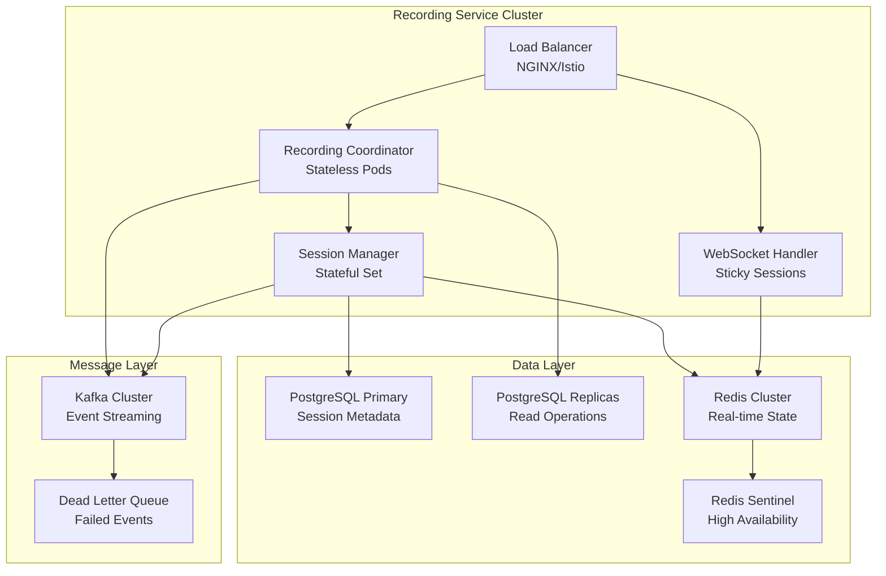
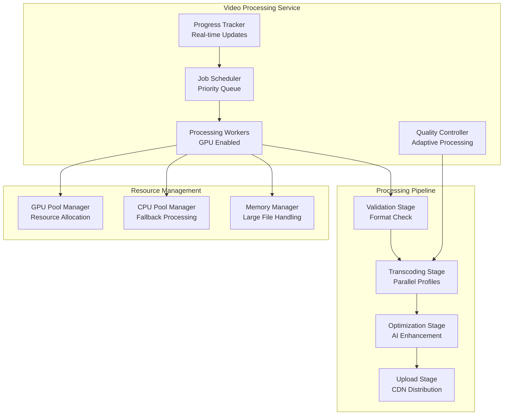
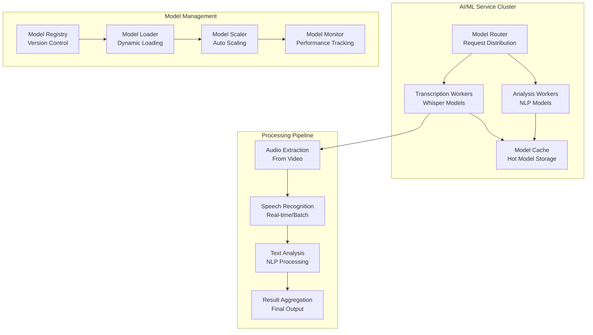
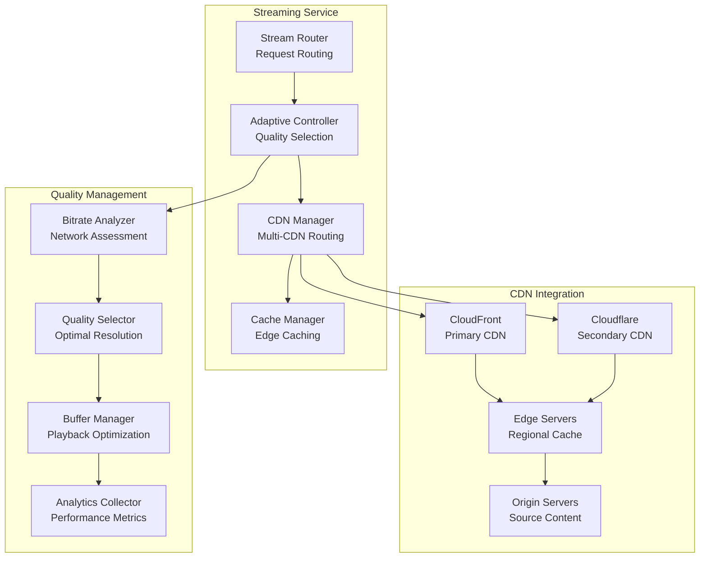
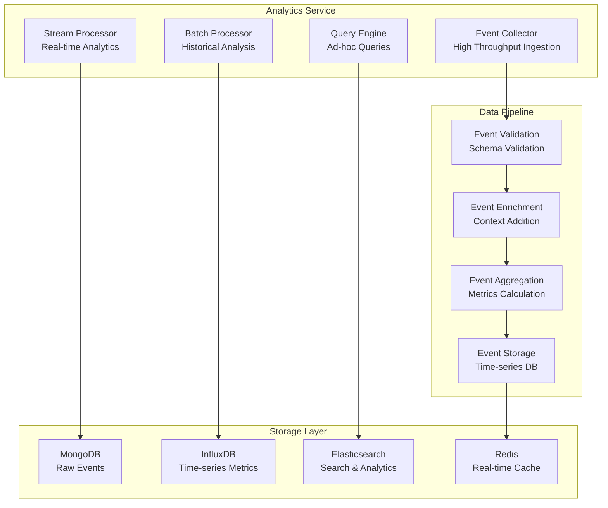

# Atlassian Loom: Detailed Microservices Design with Scaling Challenges

## Document Overview

This document provides detailed microservices design for the Atlassian Loom platform, focusing on scaling challenges, fault tolerance patterns, bottleneck mitigation strategies, snapshotting mechanisms, and service-specific resilience patterns. Each service is analyzed for its unique scaling requirements and potential failure modes.

## 1. Recording Service - Detailed Design

### 1.1 Service Architecture



### 1.2 Scaling Challenges & Solutions

#### 1.2.1 Concurrent Recording Sessions Challenge

**Problem**: Supporting 10,000+ simultaneous recording sessions with real-time coordination.

**Bottleneck**: WebSocket connection limits and memory consumption per session.

**Solution**: Horizontal scaling with session affinity and connection pooling.

```yaml
# Recording Service Scaling Configuration
apiVersion: autoscaling/v2
kind: HorizontalPodAutoscaler
metadata:
  name: recording-service-hpa
spec:
  scaleTargetRef:
    apiVersion: apps/v1
    kind: Deployment
    name: recording-service
  minReplicas: 10
  maxReplicas: 100
  metrics:
  - type: Resource
    resource:
      name: cpu
      target:
        type: Utilization
        averageUtilization: 60
  - type: Resource
    resource:
      name: memory
      target:
        type: Utilization
        averageUtilization: 70
  - type: Pods
    pods:
      metric:
        name: active_recording_sessions
      target:
        type: AverageValue
        averageValue: "100"
  behavior:
    scaleUp:
      stabilizationWindowSeconds: 60
      policies:
      - type: Percent
        value: 50
        periodSeconds: 60
    scaleDown:
      stabilizationWindowSeconds: 300
      policies:
      - type: Percent
        value: 10
        periodSeconds: 60
```

#### 1.2.2 Database Connection Pool Exhaustion

**Problem**: High concurrent sessions exhausting database connections.

**Solution**: Multi-tier connection pooling with PgBouncer.

```go
// Connection Pool Configuration
type DatabaseConfig struct {
    MaxOpenConns    int           `yaml:"max_open_conns"`
    MaxIdleConns    int           `yaml:"max_idle_conns"`
    ConnMaxLifetime time.Duration `yaml:"conn_max_lifetime"`
    ConnMaxIdleTime time.Duration `yaml:"conn_max_idle_time"`
}

type ConnectionPoolManager struct {
    primaryPool   *sql.DB
    replicaPools  []*sql.DB
    poolBouncer   *PgBouncer
    metrics       *PoolMetrics
}

func (cpm *ConnectionPoolManager) GetConnection(ctx context.Context, readOnly bool) (*sql.DB, error) {
    if readOnly {
        // Load balance across read replicas
        replica := cpm.selectReplica()
        return replica, nil
    }
    
    // Check pool health before returning connection
    if err := cpm.primaryPool.PingContext(ctx); err != nil {
        return nil, fmt.Errorf("primary pool unhealthy: %w", err)
    }
    
    return cpm.primaryPool, nil
}

func (cpm *ConnectionPoolManager) selectReplica() *sql.DB {
    // Round-robin with health checking
    for i := 0; i < len(cpm.replicaPools); i++ {
        replica := cpm.replicaPools[cpm.metrics.NextReplicaIndex()]
        if replica.Stats().OpenConnections < replica.Stats().MaxOpenConnections {
            return replica
        }
    }
    // Fallback to primary if all replicas are saturated
    return cpm.primaryPool
}
```

### 1.3 Fault Tolerance Patterns

#### 1.3.1 Circuit Breaker for External Dependencies

```go
type RecordingServiceCircuitBreaker struct {
    videoProcessingCB *CircuitBreaker
    notificationCB    *CircuitBreaker
    analyticsCB       *CircuitBreaker
}

func (rs *RecordingService) StartRecording(ctx context.Context, req StartRecordingRequest) (*RecordingSession, error) {
    // Create session with circuit breaker protection
    session, err := rs.createSession(ctx, req)
    if err != nil {
        return nil, err
    }
    
    // Notify video processing service with circuit breaker
    err = rs.videoProcessingCB.Call(func() error {
        return rs.notifyVideoProcessing(ctx, session.ID)
    })
    
    if err != nil {
        // Log error but don't fail the recording start
        rs.logger.Warn("Failed to notify video processing service", 
            "session_id", session.ID, "error", err)
        // Queue for retry later
        rs.retryQueue.Add(RetryTask{
            Type:      "notify_video_processing",
            SessionID: session.ID,
            Attempts:  0,
            NextRetry: time.Now().Add(5 * time.Second),
        })
    }
    
    return session, nil
}
```

#### 1.3.2 Graceful Degradation Strategy

```go
type DegradationLevel int

const (
    FullService DegradationLevel = iota
    ReducedFeatures
    CoreOnly
    EmergencyMode
)

func (rs *RecordingService) getDegradationLevel() DegradationLevel {
    // Check system health metrics
    cpuUsage := rs.metrics.GetCPUUsage()
    memoryUsage := rs.metrics.GetMemoryUsage()
    dbLatency := rs.metrics.GetDBLatency()
    
    if cpuUsage > 90 || memoryUsage > 90 || dbLatency > 1000 {
        return EmergencyMode
    } else if cpuUsage > 80 || memoryUsage > 80 || dbLatency > 500 {
        return CoreOnly
    } else if cpuUsage > 70 || memoryUsage > 70 || dbLatency > 200 {
        return ReducedFeatures
    }
    
    return FullService
}

func (rs *RecordingService) handleRecordingRequest(ctx context.Context, req StartRecordingRequest) (*RecordingSession, error) {
    degradationLevel := rs.getDegradationLevel()
    
    switch degradationLevel {
    case EmergencyMode:
        // Only allow basic screen recording
        if req.RecordingType != "screen" {
            return nil, errors.New("service degraded: only screen recording available")
        }
        req.Settings.Quality = "480p" // Force lower quality
        req.Settings.EnableAI = false // Disable AI features
        
    case CoreOnly:
        // Disable advanced features
        req.Settings.EnableAI = false
        req.Settings.EnableRealTimeTranscription = false
        
    case ReducedFeatures:
        // Reduce AI processing
        req.Settings.EnableRealTimeTranscription = false
    }
    
    return rs.createRecordingSession(ctx, req)
}
```

### 1.4 State Management & Snapshotting

#### 1.4.1 Recording Session State Snapshots

```go
type SessionSnapshot struct {
    SessionID     string                 `json:"session_id"`
    UserID        string                 `json:"user_id"`
    Status        RecordingStatus        `json:"status"`
    StartTime     time.Time              `json:"start_time"`
    Duration      time.Duration          `json:"duration"`
    Segments      []RecordingSegment     `json:"segments"`
    Settings      RecordingSettings      `json:"settings"`
    Metadata      map[string]interface{} `json:"metadata"`
    LastUpdated   time.Time              `json:"last_updated"`
    Version       int64                  `json:"version"`
    Checksum      string                 `json:"checksum"`
}

type SnapshotManager struct {
    redis       *redis.Client
    storage     SnapshotStorage
    compression CompressionService
}

func (sm *SnapshotManager) CreateSnapshot(session *RecordingSession) error {
    snapshot := SessionSnapshot{
        SessionID:   session.ID,
        UserID:      session.UserID,
        Status:      session.Status,
        StartTime:   session.StartTime,
        Duration:    session.Duration,
        Segments:    session.Segments,
        Settings:    session.Settings,
        Metadata:    session.Metadata,
        LastUpdated: time.Now(),
        Version:     session.Version,
    }
    
    // Calculate checksum for integrity
    snapshot.Checksum = sm.calculateChecksum(snapshot)
    
    // Compress snapshot data
    compressedData, err := sm.compression.Compress(snapshot)
    if err != nil {
        return fmt.Errorf("failed to compress snapshot: %w", err)
    }
    
    // Store in Redis for fast access
    key := fmt.Sprintf("session_snapshot:%s", session.ID)
    err = sm.redis.Set(context.Background(), key, compressedData, 24*time.Hour).Err()
    if err != nil {
        return fmt.Errorf("failed to store snapshot in Redis: %w", err)
    }
    
    // Async backup to persistent storage
    go func() {
        if err := sm.storage.Store(snapshot); err != nil {
            log.Error("Failed to backup snapshot", "session_id", session.ID, "error", err)
        }
    }()
    
    return nil
}

func (sm *SnapshotManager) RestoreSession(sessionID string) (*RecordingSession, error) {
    // Try Redis first
    key := fmt.Sprintf("session_snapshot:%s", sessionID)
    compressedData, err := sm.redis.Get(context.Background(), key).Bytes()
    
    if err == redis.Nil {
        // Fallback to persistent storage
        snapshot, err := sm.storage.Retrieve(sessionID)
        if err != nil {
            return nil, fmt.Errorf("snapshot not found: %w", err)
        }
        return sm.snapshotToSession(snapshot), nil
    }
    
    if err != nil {
        return nil, fmt.Errorf("failed to retrieve snapshot: %w", err)
    }
    
    // Decompress and validate
    var snapshot SessionSnapshot
    err = sm.compression.Decompress(compressedData, &snapshot)
    if err != nil {
        return nil, fmt.Errorf("failed to decompress snapshot: %w", err)
    }
    
    // Verify integrity
    if !sm.verifyChecksum(snapshot) {
        return nil, errors.New("snapshot integrity check failed")
    }
    
    return sm.snapshotToSession(&snapshot), nil
}
```

## 2. Video Processing Service - Detailed Design

### 2.1 Service Architecture



### 2.2 Scaling Challenges & Solutions

#### 2.2.1 Processing Queue Bottleneck

**Problem**: Video processing jobs backing up during peak hours.

**Solution**: Multi-tier priority queue with intelligent job scheduling.

```go
type ProcessingJobQueue struct {
    highPriorityQueue   *PriorityQueue
    normalPriorityQueue *PriorityQueue
    lowPriorityQueue    *PriorityQueue
    batchQueue          *BatchQueue
    deadLetterQueue     *DeadLetterQueue
    
    workerPools map[JobType]*WorkerPool
    metrics     *QueueMetrics
}

type JobPriority int

const (
    HighPriority   JobPriority = iota // Live recordings, premium users
    NormalPriority                    // Regular recordings
    LowPriority                       // Batch operations, re-processing
    BatchPriority                     // Bulk operations
)

func (pjq *ProcessingJobQueue) EnqueueJob(job *ProcessingJob) error {
    // Determine priority based on job characteristics
    priority := pjq.calculateJobPriority(job)
    
    // Check queue capacity and apply backpressure
    if pjq.isQueueFull(priority) {
        return pjq.handleBackpressure(job, priority)
    }
    
    switch priority {
    case HighPriority:
        return pjq.highPriorityQueue.Push(job)
    case NormalPriority:
        return pjq.normalPriorityQueue.Push(job)
    case LowPriority:
        return pjq.lowPriorityQueue.Push(job)
    case BatchPriority:
        return pjq.batchQueue.Push(job)
    }
    
    return nil
}

func (pjq *ProcessingJobQueue) calculateJobPriority(job *ProcessingJob) JobPriority {
    // Premium users get high priority
    if job.UserTier == "premium" || job.UserTier == "enterprise" {
        return HighPriority
    }
    
    // Live recordings get high priority
    if job.IsLiveRecording {
        return HighPriority
    }
    
    // Large files get lower priority to prevent blocking
    if job.FileSizeBytes > 1*1024*1024*1024 { // 1GB
        return LowPriority
    }
    
    // Recent recordings get normal priority
    if time.Since(job.CreatedAt) < 1*time.Hour {
        return NormalPriority
    }
    
    return LowPriority
}

func (pjq *ProcessingJobQueue) handleBackpressure(job *ProcessingJob, priority JobPriority) error {
    switch priority {
    case HighPriority:
        // Scale up workers immediately for high priority
        pjq.scaleUpWorkers(job.JobType)
        // Wait briefly and retry
        time.Sleep(100 * time.Millisecond)
        return pjq.highPriorityQueue.Push(job)
        
    case NormalPriority:
        // Defer to low priority
        return pjq.lowPriorityQueue.Push(job)
        
    case LowPriority:
        // Defer to batch processing
        return pjq.batchQueue.Push(job)
        
    case BatchPriority:
        // Reject with retry-after header
        return &BackpressureError{
            Message:    "Queue full, retry later",
            RetryAfter: time.Now().Add(5 * time.Minute),
        }
    }
    
    return nil
}
```

#### 2.2.2 GPU Resource Contention

**Problem**: Limited GPU resources causing processing delays.

**Solution**: Intelligent GPU scheduling with resource pooling.

```go
type GPUResourceManager struct {
    gpuPools     map[string]*GPUPool // keyed by GPU type
    scheduler    *GPUScheduler
    monitor      *ResourceMonitor
    fallbackCPU  *CPUProcessorPool
}

type GPUPool struct {
    GPUType      string
    TotalGPUs    int
    AvailableGPUs int
    ReservedGPUs  int
    JobQueue     *PriorityQueue
    mutex        sync.RWMutex
}

func (grm *GPUResourceManager) AllocateGPU(job *ProcessingJob) (*GPUAllocation, error) {
    // Determine optimal GPU type for job
    requiredGPUType := grm.determineGPURequirement(job)
    
    pool, exists := grm.gpuPools[requiredGPUType]
    if !exists {
        return nil, fmt.Errorf("GPU type %s not available", requiredGPUType)
    }
    
    pool.mutex.Lock()
    defer pool.mutex.Unlock()
    
    if pool.AvailableGPUs == 0 {
        // Check if we can preempt lower priority jobs
        if preemptedGPU := grm.tryPreemption(job, pool); preemptedGPU != nil {
            return preemptedGPU, nil
        }
        
        // Fallback to CPU processing for compatible jobs
        if grm.canFallbackToCPU(job) {
            return grm.fallbackCPU.Allocate(job)
        }
        
        // Queue the job and return estimated wait time
        estimatedWait := grm.estimateWaitTime(pool)
        return nil, &ResourceUnavailableError{
            Message:       "No GPU available",
            EstimatedWait: estimatedWait,
        }
    }
    
    // Allocate GPU
    pool.AvailableGPUs--
    allocation := &GPUAllocation{
        GPUID:     grm.selectOptimalGPU(pool),
        JobID:     job.ID,
        StartTime: time.Now(),
        Pool:      pool,
    }
    
    // Set up monitoring and auto-release
    grm.monitor.TrackAllocation(allocation)
    
    return allocation, nil
}

func (grm *GPUResourceManager) determineGPURequirement(job *ProcessingJob) string {
    // AI processing requires high-end GPUs
    if job.JobType == "ai_analysis" || job.JobType == "transcription" {
        return "nvidia-a100"
    }
    
    // 4K transcoding requires mid-range GPUs
    if job.Resolution.Height >= 2160 {
        return "nvidia-rtx-4080"
    }
    
    // Standard transcoding can use basic GPUs
    return "nvidia-rtx-3060"
}

func (grm *GPUResourceManager) tryPreemption(newJob *ProcessingJob, pool *GPUPool) *GPUAllocation {
    // Only preempt if new job has significantly higher priority
    if newJob.Priority <= HighPriority {
        return nil
    }
    
    // Find lowest priority running job
    runningJobs := grm.monitor.GetRunningJobs(pool)
    for _, runningJob := range runningJobs {
        if runningJob.Priority < newJob.Priority {
            // Preempt the job
            grm.preemptJob(runningJob)
            return runningJob.Allocation
        }
    }
    
    return nil
}
```

### 2.3 Fault Tolerance & Recovery

#### 2.3.1 Processing Job Recovery

```go
type JobRecoveryManager struct {
    checkpointStore CheckpointStore
    progressTracker *ProgressTracker
    retryPolicy     *RetryPolicy
}

type ProcessingCheckpoint struct {
    JobID           string                 `json:"job_id"`
    Stage           ProcessingStage        `json:"stage"`
    Progress        float64                `json:"progress"`
    IntermediateFiles []string             `json:"intermediate_files"`
    ProcessingState map[string]interface{} `json:"processing_state"`
    Timestamp       time.Time              `json:"timestamp"`
}

func (jrm *JobRecoveryManager) CreateCheckpoint(job *ProcessingJob) error {
    checkpoint := ProcessingCheckpoint{
        JobID:           job.ID,
        Stage:           job.CurrentStage,
        Progress:        job.Progress,
        IntermediateFiles: job.IntermediateFiles,
        ProcessingState: job.State,
        Timestamp:       time.Now(),
    }
    
    return jrm.checkpointStore.Save(checkpoint)
}

func (jrm *JobRecoveryManager) RecoverJob(jobID string) (*ProcessingJob, error) {
    checkpoint, err := jrm.checkpointStore.Load(jobID)
    if err != nil {
        return nil, fmt.Errorf("no checkpoint found for job %s: %w", jobID, err)
    }
    
    // Verify intermediate files still exist
    for _, filePath := range checkpoint.IntermediateFiles {
        if !jrm.fileExists(filePath) {
            // File missing, need to restart from earlier stage
            return jrm.restartFromEarlierStage(checkpoint)
        }
    }
    
    // Reconstruct job from checkpoint
    job := &ProcessingJob{
        ID:                jobID,
        CurrentStage:      checkpoint.Stage,
        Progress:          checkpoint.Progress,
        IntermediateFiles: checkpoint.IntermediateFiles,
        State:             checkpoint.ProcessingState,
        Status:            StatusRecovering,
    }
    
    return job, nil
}

func (jrm *JobRecoveryManager) restartFromEarlierStage(checkpoint ProcessingCheckpoint) (*ProcessingJob, error) {
    // Determine safe restart point
    var restartStage ProcessingStage
    var restartProgress float64
    
    switch checkpoint.Stage {
    case StageTranscoding:
        // If transcoding failed, restart from validation
        restartStage = StageValidation
        restartProgress = 0.0
    case StageOptimization:
        // If optimization failed, restart from transcoding
        restartStage = StageTranscoding
        restartProgress = 0.25
    case StageUpload:
        // If upload failed, restart from optimization
        restartStage = StageOptimization
        restartProgress = 0.75
    default:
        // Start from beginning
        restartStage = StageValidation
        restartProgress = 0.0
    }
    
    job := &ProcessingJob{
        ID:           checkpoint.JobID,
        CurrentStage: restartStage,
        Progress:     restartProgress,
        Status:       StatusQueued,
    }
    
    return job, nil
}
```

### 2.4 Bottleneck Mitigation

#### 2.4.1 Adaptive Processing Strategy

```go
type AdaptiveProcessor struct {
    systemMonitor   *SystemMonitor
    loadBalancer    *ProcessingLoadBalancer
    qualityManager  *QualityManager
    resourceManager *ResourceManager
}

func (ap *AdaptiveProcessor) ProcessVideo(job *ProcessingJob) error {
    // Assess current system load
    systemLoad := ap.systemMonitor.GetCurrentLoad()
    
    // Adapt processing strategy based on load
    strategy := ap.determineProcessingStrategy(job, systemLoad)
    
    switch strategy {
    case StrategyOptimal:
        return ap.processWithOptimalQuality(job)
    case StrategyBalanced:
        return ap.processWithBalancedQuality(job)
    case StrategyFast:
        return ap.processWithFastSettings(job)
    case StrategyDeferred:
        return ap.deferProcessing(job)
    }
    
    return nil
}

func (ap *AdaptiveProcessor) determineProcessingStrategy(job *ProcessingJob, load SystemLoad) ProcessingStrategy {
    // High priority jobs always get optimal processing
    if job.Priority == HighPriority {
        return StrategyOptimal
    }
    
    // Under high load, use fast processing
    if load.CPU > 80 || load.Memory > 85 || load.GPU > 90 {
        return StrategyFast
    }
    
    // Under extreme load, defer non-critical jobs
    if load.CPU > 95 || load.Memory > 95 {
        if job.Priority == LowPriority {
            return StrategyDeferred
        }
    }
    
    // Normal conditions use balanced processing
    return StrategyBalanced
}

func (ap *AdaptiveProcessor) processWithFastSettings(job *ProcessingJob) error {
    // Reduce quality settings for faster processing
    fastSettings := ProcessingSettings{
        VideoCodec:    "h264_nvenc", // Hardware acceleration
        AudioCodec:    "aac",
        Preset:        "ultrafast",
        CRF:           28, // Lower quality, faster encoding
        MaxResolution: "720p",
        SkipAI:        true, // Skip AI processing
        Threads:       runtime.NumCPU() / 2, // Use fewer threads
    }
    
    return ap.processWithSettings(job, fastSettings)
}

func (ap *AdaptiveProcessor) processWithBalancedQuality(job *ProcessingJob) error {
    balancedSettings := ProcessingSettings{
        VideoCodec:    "h264",
        AudioCodec:    "aac",
        Preset:        "medium",
        CRF:           23,
        MaxResolution: "1080p",
        SkipAI:        false,
        Threads:       runtime.NumCPU(),
    }
    
    return ap.processWithSettings(job, balancedSettings)
}
```

## 3. AI/ML Service - Detailed Design

### 3.1 Service Architecture



### 3.2 Scaling Challenges & Solutions

#### 3.2.1 Model Loading Bottleneck

**Problem**: Large AI models (1GB+) taking too long to load, causing request timeouts.

**Solution**: Model warming and intelligent caching strategy.

```python
import asyncio
import torch
from typing import Dict, Optional
from dataclasses import dataclass
from enum import Enum

class ModelState(Enum):
    COLD = "cold"
    WARMING = "warming"
    HOT = "hot"
    COOLING = "cooling"

@dataclass
class ModelInfo:
    name: str
    version: str
    size_mb: int
    load_time_seconds: float
    last_used: datetime
    usage_count: int
    state: ModelState

class ModelCacheManager:
    def __init__(self, max_cache_size_gb: int = 8):
        self.max_cache_size_gb = max_cache_size_gb
        self.loaded_models: Dict[str, torch.nn.Module] = {}
        self.model_info: Dict[str, ModelInfo] = {}
        self.warming_queue = asyncio.Queue()
        self.usage_predictor = ModelUsagePredictor()
        
    async def get_model(self, model_name: str, model_version: str) -> torch.nn.Module:
        model_key = f"{model_name}:{model_version}"
        
        # Check if model is already loaded
        if model_key in self.loaded_models:
            self.model_info[model_key].last_used = datetime.now()
            self.model_info[model_key].usage_count += 1
            return self.loaded_models[model_key]
        
        # Check if model is currently warming
        if model_key in self.model_info and self.model_info[model_key].state == ModelState.WARMING:
            # Wait for warming to complete
            return await self.wait_for_model_warming(model_key)
        
        # Load model
        return await self.load_model(model_name, model_version)
    
    async def load_model(self, model_name: str, model_version: str) -> torch.nn.Module:
        model_key = f"{model_name}:{model_version}"
        
        # Mark as warming
        if model_key not in self.model_info:
            self.model_info[model_key] = ModelInfo(
                name=model_name,
                version=model_version,
                size_mb=0,  # Will be updated
                load_time_seconds=0,
                last_used=datetime.now(),
                usage_count=1,
                state=ModelState.WARMING
            )
        
        start_time = time.time()
        
        try:
            # Check if we need to free up cache space
            await self.ensure_cache_space(model_name, model_version)
            
            # Load model based on type
            if model_name.startswith("whisper"):
                model = await self.load_whisper_model(model_version)
            elif model_name.startswith("bert"):
                model = await self.load_bert_model(model_version)
            else:
                model = await self.load_generic_model(model_name, model_version)
            
            # Update model info
            load_time = time.time() - start_time
            self.model_info[model_key].load_time_seconds = load_time
            self.model_info[model_key].state = ModelState.HOT
            
            # Cache the model
            self.loaded_models[model_key] = model
            
            return model
            
        except Exception as e:
            self.model_info[model_key].state = ModelState.COLD
            raise ModelLoadError(f"Failed to load model {model_key}: {str(e)}")
    
    async def ensure_cache_space(self, model_name: str, model_version: str):
        # Estimate model size
        estimated_size_mb = self.estimate_model_size(model_name, model_version)
        current_cache_size_mb = sum(info.size_mb for info in self.model_info.values() 
                                   if info.state == ModelState.HOT

        # Check if we need to evict models
        if current_cache_size_mb + estimated_size_mb > self.max_cache_size_gb * 1024:
            await self.evict_least_used_models(estimated_size_mb)
    
    async def evict_least_used_models(self, required_space_mb: int):
        # Sort models by usage score (combination of recency and frequency)
        models_by_usage = sorted(
            [(key, info) for key, info in self.model_info.items() if info.state == ModelState.HOT],
            key=lambda x: self.calculate_usage_score(x[1])
        )
        
        freed_space = 0
        for model_key, model_info in models_by_usage:
            if freed_space >= required_space_mb:
                break
                
            # Evict model
            del self.loaded_models[model_key]
            model_info.state = ModelState.COLD
            freed_space += model_info.size_mb
            
            print(f"Evicted model {model_key} to free {model_info.size_mb}MB")
    
    def calculate_usage_score(self, model_info: ModelInfo) -> float:
        # Combine recency and frequency for usage score
        time_since_last_use = (datetime.now() - model_info.last_used).total_seconds()
        recency_score = 1.0 / (1.0 + time_since_last_use / 3600)  # Decay over hours
        frequency_score = min(model_info.usage_count / 100.0, 1.0)  # Cap at 100 uses
        
        return recency_score * 0.7 + frequency_score * 0.3

class ModelUsagePredictor:
    def __init__(self):
        self.usage_history = defaultdict(list)
        self.prediction_model = None
    
    def predict_next_models(self, current_time: datetime, horizon_minutes: int = 30) -> List[str]:
        # Simple time-based prediction
        # In production, this would use ML models
        current_hour = current_time.hour
        current_day = current_time.weekday()
        
        # Peak hours prediction
        if 9 <= current_hour <= 17:  # Business hours
            return ["whisper-large-v2", "bert-base-uncased", "sentiment-analyzer"]
        else:
            return ["whisper-base", "summarizer"]
```

#### 3.2.2 GPU Memory Management for Large Models

**Problem**: AI models consuming too much GPU memory, causing OOM errors.

**Solution**: Dynamic model sharding and memory optimization.

```python
class GPUMemoryManager:
    def __init__(self, max_gpu_memory_gb: int = 24):
        self.max_gpu_memory_gb = max_gpu_memory_gb
        self.current_usage = 0
        self.model_allocations = {}
        self.memory_pool = GPUMemoryPool()
        
    async def allocate_model_memory(self, model_name: str, estimated_memory_gb: float) -> GPUAllocation:
        if self.current_usage + estimated_memory_gb > self.max_gpu_memory_gb * 0.9:
            # Try to free up memory
            await self.optimize_memory_usage()
            
            # If still not enough, use model sharding
            if self.current_usage + estimated_memory_gb > self.max_gpu_memory_gb * 0.9:
                return await self.allocate_with_sharding(model_name, estimated_memory_gb)
        
        allocation = GPUAllocation(
            model_name=model_name,
            memory_gb=estimated_memory_gb,
            device_id=self.select_optimal_device(),
            shard_count=1
        )
        
        self.current_usage += estimated_memory_gb
        self.model_allocations[model_name] = allocation
        
        return allocation
    
    async def allocate_with_sharding(self, model_name: str, estimated_memory_gb: float) -> GPUAllocation:
        # Calculate optimal shard count
        available_memory = self.max_gpu_memory_gb * 0.9 - self.current_usage
        shard_count = math.ceil(estimated_memory_gb / available_memory)
        
        if shard_count > 4:  # Limit sharding to prevent performance degradation
            raise InsufficientMemoryError(f"Model {model_name} too large for available GPU memory")
        
        allocation = GPUAllocation(
            model_name=model_name,
            memory_gb=estimated_memory_gb / shard_count,
            device_id=self.select_optimal_device(),
            shard_count=shard_count,
            sharded=True
        )
        
        return allocation

class ShardedModelWrapper:
    def __init__(self, model_shards: List[torch.nn.Module], device_ids: List[int]):
        self.model_shards = model_shards
        self.device_ids = device_ids
        self.shard_count = len(model_shards)
    
    async def forward(self, input_data):
        # Distribute input across shards
        shard_inputs = self.split_input(input_data)
        
        # Process each shard in parallel
        tasks = []
        for i, (shard, shard_input) in enumerate(zip(self.model_shards, shard_inputs)):
            task = self.process_shard(shard, shard_input, self.device_ids[i])
            tasks.append(task)
        
        shard_outputs = await asyncio.gather(*tasks)
        
        # Combine shard outputs
        return self.combine_outputs(shard_outputs)
    
    def split_input(self, input_data):
        # Split input data for parallel processing
        if isinstance(input_data, torch.Tensor):
            chunk_size = input_data.size(0) // self.shard_count
            return torch.chunk(input_data, self.shard_count, dim=0)
        else:
            # Handle other input types
            return [input_data] * self.shard_count
    
    async def process_shard(self, shard, shard_input, device_id):
        with torch.cuda.device(device_id):
            return shard(shard_input.to(device_id))
    
    def combine_outputs(self, shard_outputs):
        # Combine outputs from all shards
        return torch.cat(shard_outputs, dim=0)
```

### 3.3 Fault Tolerance & Model Fallbacks

```python
class AIServiceFaultTolerance:
    def __init__(self):
        self.model_fallbacks = {
            "whisper-large-v2": ["whisper-medium", "whisper-base"],
            "bert-large-uncased": ["bert-base-uncased", "distilbert-base-uncased"],
            "gpt-3.5-turbo": ["gpt-3.5-turbo-instruct", "text-davinci-003"]
        }
        self.circuit_breakers = {}
        self.retry_policies = {}
    
    async def process_with_fallback(self, request: AIProcessingRequest) -> AIProcessingResult:
        primary_model = request.model_name
        fallback_models = self.model_fallbacks.get(primary_model, [])
        
        # Try primary model first
        try:
            return await self.process_with_model(request, primary_model)
        except ModelUnavailableError as e:
            logger.warning(f"Primary model {primary_model} unavailable: {e}")
        except ModelTimeoutError as e:
            logger.warning(f"Primary model {primary_model} timed out: {e}")
        
        # Try fallback models
        for fallback_model in fallback_models:
            try:
                logger.info(f"Trying fallback model: {fallback_model}")
                request.model_name = fallback_model
                return await self.process_with_model(request, fallback_model)
            except Exception as e:
                logger.warning(f"Fallback model {fallback_model} failed: {e}")
                continue
        
        # All models failed, return degraded result
        return self.create_degraded_result(request)
    
    def create_degraded_result(self, request: AIProcessingRequest) -> AIProcessingResult:
        if request.task_type == "transcription":
            return AIProcessingResult(
                task_id=request.task_id,
                result_type="transcription",
                content="[Transcription temporarily unavailable]",
                confidence=0.0,
                degraded=True,
                error_message="All transcription models unavailable"
            )
        elif request.task_type == "sentiment_analysis":
            return AIProcessingResult(
                task_id=request.task_id,
                result_type="sentiment",
                content={"sentiment": "neutral", "confidence": 0.0},
                degraded=True,
                error_message="Sentiment analysis unavailable"
            )
        
        return AIProcessingResult(
            task_id=request.task_id,
            result_type="error",
            content="Service temporarily unavailable",
            degraded=True
        )
```

## 4. Streaming Service - Detailed Design

### 4.1 Service Architecture



### 4.2 Scaling Challenges & Solutions

#### 4.2.1 Concurrent Stream Bottleneck

**Problem**: Supporting 100,000+ concurrent video streams with low latency.

**Solution**: Intelligent load balancing and edge caching optimization.

```go
type StreamingLoadBalancer struct {
    edgeServers     map[string]*EdgeServer
    healthChecker   *HealthChecker
    routingStrategy RoutingStrategy
    metrics         *StreamingMetrics
}

type EdgeServer struct {
    ID               string
    Region           string
    Capacity         int
    CurrentLoad      int
    AvgLatency       time.Duration
    BandwidthLimit   int64
    CurrentBandwidth int64
    HealthStatus     HealthStatus
}

func (slb *StreamingLoadBalancer) RouteStreamRequest(req *StreamRequest) (*StreamResponse, error) {
    // Determine optimal edge server
    edgeServer, err := slb.selectOptimalEdgeServer(req)
    if err != nil {
        return nil, fmt.Errorf("no available edge server: %w", err)
    }
    
    // Check if content is cached at edge
    if !slb.isContentCached(edgeServer, req.VideoID) {
        // Warm cache proactively
        go slb.warmCache(edgeServer, req.VideoID)
    }
    
    // Generate streaming URLs with failover
    streamURLs := slb.generateStreamURLs(edgeServer, req)
    
    // Track the stream for analytics
    slb.metrics.TrackStreamStart(req.VideoID, req.UserID, edgeServer.ID)
    
    return &StreamResponse{
        PrimaryURL:   streamURLs.Primary,
        FallbackURLs: streamURLs.Fallbacks,
        EdgeServerID: edgeServer.ID,
        QualityLevels: slb.getAvailableQualities(req.VideoID),
    }, nil
}

func (slb *StreamingLoadBalancer) selectOptimalEdgeServer(req *StreamRequest) (*EdgeServer, error) {
    // Get user's geographic location
    userLocation := slb.getUserLocation(req.ClientIP)
    
    // Find edge servers in the same region
    regionalServers := slb.getRegionalServers(userLocation.Region)
    
    if len(regionalServers) == 0 {
        // Fallback to global servers
        regionalServers = slb.getAllHealthyServers()
    }
    
    // Score servers based on multiple factors
    bestServer := slb.scoreServers(regionalServers, req)
    
    if bestServer == nil {
        return nil, errors.New("no healthy edge servers available")
    }
    
    return bestServer, nil
}

func (slb *StreamingLoadBalancer) scoreServers(servers []*EdgeServer, req *StreamRequest) *EdgeServer {
    type serverScore struct {
        server *EdgeServer
        score  float64
    }
    
    var scores []serverScore
    
    for _, server := range servers {
        if server.HealthStatus != HealthStatusHealthy {
            continue
        }
        
        // Calculate composite score
        loadScore := 1.0 - (float64(server.CurrentLoad) / float64(server.Capacity))
        latencyScore := 1.0 / (1.0 + server.AvgLatency.Seconds())
        bandwidthScore := 1.0 - (float64(server.CurrentBandwidth) / float64(server.BandwidthLimit))
        
        // Weight the scores
        compositeScore := loadScore*0.4 + latencyScore*0.3 + bandwidthScore*0.3
        
        scores = append(scores, serverScore{
            server: server,
            score:  compositeScore,
        })
    }
    
    if len(scores) == 0 {
        return nil
    }
    
    // Sort by score and return best server
    sort.Slice(scores, func(i, j int) bool {
        return scores[i].score > scores[j].score
    })
    
    return scores[0].server
}
```

## 5. Analytics Service - Detailed Design

### 5.1 Service Architecture



### 5.2 High-Volume Event Processing

#### 5.2.1 Event Ingestion Bottleneck

**Problem**: Processing millions of analytics events per hour without data loss.

**Solution**: Multi-tier event processing with backpressure handling.

```python
import asyncio
from typing import List, Dict, Any
from dataclasses import dataclass
from enum import Enum
import time

class EventPriority(Enum):
    CRITICAL = 1    # User actions, errors
    HIGH = 2        # Video events, engagement
    NORMAL = 3      # Page views, clicks
    LOW = 4         # Background events

@dataclass
class AnalyticsEvent:
    event_id: str
    event_type: str
    user_id: str
    session_id: str
    timestamp: float
    properties: Dict[str, Any]
    priority: EventPriority
    retry_count: int = 0

class HighThroughputEventProcessor:
    def __init__(self, config):
        self.config = config
        self.event_queues = {
            EventPriority.CRITICAL: asyncio.Queue(maxsize=1000),
            EventPriority.HIGH: asyncio.Queue(maxsize=5000),
            EventPriority.NORMAL: asyncio.Queue(maxsize=10000),
            EventPriority.LOW: asyncio.Queue(maxsize=20000)
        }
        self.batch_processors = {}
        self.dead_letter_queue = asyncio.Queue()
        self.metrics = EventProcessingMetrics()
        
    async def ingest_event(self, event: AnalyticsEvent) -> bool:
        try:
            # Validate event
            if not self.validate_event(event):
                await self.dead_letter_queue.put(event)
                return False
            
            # Enrich event with additional context
            enriched_event = await self.enrich_event(event)
            
            # Route to appropriate queue based on priority
            queue = self.event_queues[event.priority]
            
            # Handle backpressure
            if queue.full():
                return await self.handle_backpressure(enriched_event)
            
            await queue.put(enriched_event)
            self.metrics.increment_ingested(event.priority)
            return True
            
        except Exception as e:
            logger.error(f"Failed to ingest event {event.event_id}: {e}")
            await self.dead_letter_queue.put(event)
            return False
    
    async def handle_backpressure(self, event: AnalyticsEvent) -> bool:
        # Implement different strategies based on event priority
        if event.priority == EventPriority.CRITICAL:
            # Critical events must be processed - wait briefly
            await asyncio.sleep(0.01)
            return await self.ingest_event(event)
        
        elif event.priority == EventPriority.HIGH:
            # Try to downgrade to normal priority
            event.priority = EventPriority.NORMAL
            return await self.ingest_event(event)
        
        elif event.priority == EventPriority.NORMAL:
            # Sample the event (keep only 50%)
            if hash(event.event_id) % 2 == 0:
                event.priority = EventPriority.LOW
                return await self.ingest_event(event)
            else:
                # Drop the event
                self.metrics.increment_dropped(EventPriority.NORMAL)
                return False
        
        else:  # LOW priority
            # Drop low priority events during backpressure
            self.metrics.increment_dropped(EventPriority.LOW)
            return False
    
    async def start_processing(self):
        # Start batch processors for each priority level
        for priority in EventPriority:
            processor = BatchEventProcessor(
                queue=self.event_queues[priority],
                batch_size=self.get_batch_size(priority),
                flush_interval=self.get_flush_interval(priority),
                storage=self.get_storage_backend(priority)
            )
            self.batch_processors[priority] = processor
            asyncio.create_task(processor.start())
        
        # Start dead letter queue processor
        asyncio.create_task(self.process_dead_letter_queue())
    
    def get_batch_size(self, priority: EventPriority) -> int:
        batch_sizes = {
            EventPriority.CRITICAL: 10,   # Small batches for fast processing
            EventPriority.HIGH: 50,
            EventPriority.NORMAL: 200,
            EventPriority.LOW: 1000       # Large batches for efficiency
        }
        return batch_sizes[priority]
    
    def get_flush_interval(self, priority: EventPriority) -> float:
        intervals = {
            EventPriority.CRITICAL: 1.0,   # 1 second
            EventPriority.HIGH: 5.0,       # 5 seconds
            EventPriority.NORMAL: 15.0,    # 15 seconds
            EventPriority.LOW: 60.0        # 1 minute
        }
        return intervals[priority]

class BatchEventProcessor:
    def __init__(self, queue, batch_size, flush_interval, storage):
        self.queue = queue
        self.batch_size = batch_size
        self.flush_interval = flush_interval
        self.storage = storage
        self.current_batch = []
        self.last_flush = time.time()
        
    async def start(self):
        while True:
            try:
                # Wait for event with timeout
                event = await asyncio.wait_for(
                    self.queue.get(), 
                    timeout=self.flush_interval
                )
                
                self.current_batch.append(event)
                
                # Check if batch is full or flush interval exceeded
                if (len(self.current_batch) >= self.batch_size or 
                    time.time() - self.last_flush >= self.flush_interval):
                    await self.flush_batch()
                    
            except asyncio.TimeoutError:
                # Flush on timeout even if batch is not full
                if self.current_batch:
                    await self.flush_batch()
            except Exception as e:
                logger.error(f"Error in batch processor: {e}")
    
    async def flush_batch(self):
        if not self.current_batch:
            return
        
        try:
            await self.storage.store_batch(self.current_batch)
            logger.info(f"Flushed batch of {len(self.current_batch)} events")
            
            self.current_batch = []
            self.last_flush = time.time()
            
        except Exception as e:
            logger.error(f"Failed to flush batch: {e}")
            # Could implement retry logic here
```

### 5.3 Real-time Analytics Processing

```python
class RealTimeAnalyticsProcessor:
    def __init__(self, config):
        self.config = config
        self.sliding_windows = {}
        self.aggregators = {}
        self.alert_thresholds = config.alert_thresholds
        
    async def process_event(self, event: AnalyticsEvent):
        # Update sliding window metrics
        await self.update_sliding_windows(event)
        
        # Update real-time aggregations
        await self.update_aggregations(event)
        
        # Check for alerts
        await self.check_alerts(event)
    
    async def update_sliding_windows(self, event: AnalyticsEvent):
        # 1-minute sliding window
        window_1m = self.get_or_create_window("1m", 60)
        await window_1m.add_event(event)
        
        # 5-minute sliding window
        window_5m = self.get_or_create_window("5m", 300)
        await window_5m.add_event(event)
        
        # 1-hour sliding window
        window_1h = self.get_or_create_window("1h", 3600)
        await window_1h.add_event(event)
    
    def get_or_create_window(self, name: str, duration_seconds: int):
        if name not in self.sliding_windows:
            self.sliding_windows[name] = SlidingWindow(duration_seconds)
        return self.sliding_windows[name]

class SlidingWindow:
    def __init__(self, duration_seconds: int):
        self.duration = duration_seconds
        self.events = []
        self.metrics = defaultdict(int)
        
    async def add_event(self, event: AnalyticsEvent):
        current_time = time.time()
        
        # Remove old events outside the window
        cutoff_time = current_time - self.duration
        self.events = [e for e in self.events if e.timestamp > cutoff_time]
        
        # Add new event
        self.events.append(event)
        
        # Update metrics
        self.update_metrics(event)
    
    def update_metrics(self, event: AnalyticsEvent):
        self.metrics[f"total_events"] += 1
        self.metrics[f"events_by_type_{event.event_type}"] += 1
        
        if event.event_type == "video_view":
            self.metrics["video_views"] += 1
        elif event.event_type == "video_complete":
            self.metrics["video_completions"] += 1
    
    def get_metrics(self) -> Dict[str, int]:
        return dict(self.metrics)
    
    def get_rate(self, metric_name: str) -> float:
        """Get events per second for a metric"""
        count = self.metrics.get(metric_name, 0)
        return count / self.duration if self.duration > 0 else 0
```

## 6. Cross-Service Resilience Patterns

### 6.1 Distributed Circuit Breaker

```go
type DistributedCircuitBreaker struct {
    serviceName     string
    redisClient     *redis.Client
    localBreaker    *CircuitBreaker
    globalThreshold int
    localThreshold  int
    syncInterval    time.Duration
}

func (dcb *DistributedCircuitBreaker) Call(fn func() error) error {
    // Check local circuit breaker first
    if dcb.localBreaker.IsOpen() {
        return errors.New("local circuit breaker is open")
    }
    
    // Check global circuit breaker state
    if dcb.isGloballyOpen() {
        return errors.New("global circuit breaker is open")
    }
    
    // Execute the function
    err := fn()
    
    // Update both local and global state
    dcb.updateState(err)
    
    return err
}

func (dcb *DistributedCircuitBreaker) isGloballyOpen() bool {
    key := fmt.Sprintf("circuit_breaker:%s:failures", dcb.serviceName)
    failures, err := dcb.redisClient.Get(context.Background(), key).Int()
    if err != nil {
        // If Redis is unavailable, rely on local breaker
        return false
    }
    
    return failures >= dcb.globalThreshold
}

func (dcb *DistributedCircuitBreaker) updateState(err error) {
    // Update local state
    if err != nil {
        dcb.localBreaker.RecordFailure()
    } else {
        dcb.localBreaker.RecordSuccess()
    }
    
    // Update global state asynchronously
    go dcb.updateGlobalState(err)
}

func (dcb *DistributedCircuitBreaker) updateGlobalState(err error) {
    key := fmt.Sprintf("circuit_breaker:%s:failures", dcb.serviceName)
    
    if err != nil {
        // Increment failure count with expiration
        dcb.redisClient.Incr(context.Background(), key)
        dcb.redisClient.Expire(context.Background(), key, 5*time.Minute)
    } else {
        // Reset failure count on success
        dcb.redisClient.Del(context.Background(), key)
    }
}
```

### 6.2 Saga Pattern for Distributed Transactions

```go
type SagaOrchestrator struct {
    steps       []SagaStep
    compensations []CompensationStep
    eventBus    EventBus
    stateStore  StateStore
}

type SagaStep struct {
    Name        string
    Service     string
    Action      string
    Payload     interface{}
    Timeout     time.Duration
    Retries     int
}

type CompensationStep struct {
    Name    string
    Service string
    Action  string
    Payload interface{}
}

func (so *SagaOrchestrator) ExecuteSaga(sagaID string, steps []SagaStep) error {
    // Initialize saga state
    sagaState := &SagaState{
        ID:          sagaID,
        Steps:       steps,
        CurrentStep: 0,
        Status:      SagaStatusRunning,
        StartTime:   time.Now(),
    }
    
    err := so.stateStore.SaveSagaState(sagaState)
    if err != nil {
        return fmt.Errorf("failed to save saga state: %w", err)
    }
    
    // Execute steps sequentially
    for i, step := range steps {
        sagaState.CurrentStep = i
        
        err := so.executeStep(sagaState, step)
        if err != nil {
            // Step failed, start compensation
            return so.compensate(sagaState, i)
        }
        
        // Update saga state
        sagaState.CompletedSteps = append(sagaState.CompletedSteps, step.Name)
        so.stateStore.SaveSagaState(sagaState)
    }
    
    // All steps completed successfully
    sagaState.Status = SagaStatusCompleted
    sagaState.EndTime = time.Now()
    so.stateStore.SaveSagaState(sagaState)
    
    return nil
}

func (so *SagaOrchestrator) executeStep(sagaState *SagaState, step SagaStep) error {
    // Create step execution context
    ctx, cancel := context.WithTimeout(context.Background(), step.Timeout)
    defer cancel()
    
    // Execute step with retries
    var lastErr error
    for attempt := 0; attempt <= step.Retries; attempt++ {
        if attempt > 0 {
            // Exponential backoff
            backoff := time.Duration(math.Pow(2, float64(attempt))) * time.Second
            time.Sleep(backoff)
        }
        
        // Send command to service
        command := ServiceCommand{
            SagaID:  sagaState.ID,
            StepID:  step.Name,
            Service: step.Service,
            Action:  step.Action,
            Payload: step.Payload,
        }
        
        err := so.eventBus.SendCommand(ctx, command)
        if err == nil {
            return nil // Success
        }
        
        lastErr = err
        
        // Check if error is retryable
        if !so.isRetryableError(err) {
            break
        }
    }
    
    return fmt.Errorf("step %s failed after %d attempts: %w", step.Name, step.Retries+1, lastErr)
}

func (so *SagaOrchestrator) compensate(sagaState *SagaState, failedStepIndex int) error {
    sagaState.Status = SagaStatusCompensating
    so.stateStore.SaveSagaState(sagaState)
    
    // Execute compensation steps in reverse order
    for i := failedStepIndex - 1; i >= 0; i-- {
        stepName := sagaState.CompletedSteps[i]
        compensation := so.getCompensationForStep(stepName)
        
        if compensation != nil {
            err := so.executeCompensation(sagaState, *compensation)
            if err != nil {
                // Compensation failed - this is a critical error
                sagaState.Status = SagaStatusFailed
                sagaState.Error = fmt.Sprintf("compensation failed for step %s: %v", stepName, err)
                so.stateStore.SaveSagaState
so.stateStore.SaveSagaState(sagaState)
                return err
            }
        }
    }
    
    sagaState.Status = SagaStatusCompensated
    sagaState.EndTime = time.Now()
    so.stateStore.SaveSagaState(sagaState)
    
    return errors.New("saga compensated due to step failure")
}
```

## 7. Service-Specific Snapshotting Strategies

### 7.1 User Management Service Snapshotting

```javascript
class UserServiceSnapshotManager {
    constructor(config) {
        this.redisClient = new Redis(config.redis);
        this.s3Client = new AWS.S3(config.s3);
        this.snapshotInterval = config.snapshotInterval || 3600; // 1 hour
        this.retentionPeriod = config.retentionPeriod || 86400 * 7; // 7 days
    }
    
    async createUserSnapshot(userId) {
        const snapshot = {
            userId,
            timestamp: Date.now(),
            version: await this.getNextVersion(userId),
            data: {
                profile: await this.getUserProfile(userId),
                preferences: await this.getUserPreferences(userId),
                sessions: await this.getActiveSessions(userId),
                permissions: await this.getUserPermissions(userId),
                auditLog: await this.getRecentAuditLog(userId, 24) // Last 24 hours
            }
        };
        
        // Calculate checksum for integrity
        snapshot.checksum = this.calculateChecksum(snapshot.data);
        
        // Store in Redis for fast access
        const redisKey = `user_snapshot:${userId}:${snapshot.version}`;
        await this.redisClient.setex(
            redisKey, 
            this.retentionPeriod, 
            JSON.stringify(snapshot)
        );
        
        // Async backup to S3
        this.backupToS3(snapshot);
        
        return snapshot;
    }
    
    async restoreUserFromSnapshot(userId, version = 'latest') {
        let snapshot;
        
        if (version === 'latest') {
            version = await this.getLatestVersion(userId);
        }
        
        // Try Redis first
        const redisKey = `user_snapshot:${userId}:${version}`;
        const redisData = await this.redisClient.get(redisKey);
        
        if (redisData) {
            snapshot = JSON.parse(redisData);
        } else {
            // Fallback to S3
            snapshot = await this.restoreFromS3(userId, version);
        }
        
        if (!snapshot) {
            throw new Error(`No snapshot found for user ${userId} version ${version}`);
        }
        
        // Verify integrity
        if (!this.verifyChecksum(snapshot)) {
            throw new Error('Snapshot integrity check failed');
        }
        
        // Restore user data
        await this.restoreUserData(snapshot);
        
        return snapshot;
    }
    
    async restoreUserData(snapshot) {
        const { userId, data } = snapshot;
        
        // Restore in transaction
        const transaction = await this.db.beginTransaction();
        
        try {
            // Restore profile
            await this.updateUserProfile(userId, data.profile, transaction);
            
            // Restore preferences
            await this.updateUserPreferences(userId, data.preferences, transaction);
            
            // Restore permissions
            await this.updateUserPermissions(userId, data.permissions, transaction);
            
            // Note: Sessions are not restored as they should be re-established
            
            await transaction.commit();
        } catch (error) {
            await transaction.rollback();
            throw error;
        }
    }
}
```

### 7.2 Video Processing Service Snapshotting

```go
type VideoProcessingSnapshotManager struct {
    redisClient     *redis.Client
    s3Client        *s3.Client
    checkpointStore CheckpointStore
}

type ProcessingSnapshot struct {
    JobID           string                 `json:"job_id"`
    VideoID         string                 `json:"video_id"`
    Stage           ProcessingStage        `json:"stage"`
    Progress        float64                `json:"progress"`
    ProcessingState ProcessingState        `json:"processing_state"`
    IntermediateFiles []IntermediateFile   `json:"intermediate_files"`
    Metadata        VideoMetadata          `json:"metadata"`
    Timestamp       time.Time              `json:"timestamp"`
    Version         int64                  `json:"version"`
    Checksum        string                 `json:"checksum"`
}

type IntermediateFile struct {
    Path        string    `json:"path"`
    Size        int64     `json:"size"`
    Checksum    string    `json:"checksum"`
    CreatedAt   time.Time `json:"created_at"`
    Stage       string    `json:"stage"`
}

func (vpsm *VideoProcessingSnapshotManager) CreateSnapshot(job *ProcessingJob) error {
    snapshot := ProcessingSnapshot{
        JobID:           job.ID,
        VideoID:         job.VideoID,
        Stage:           job.CurrentStage,
        Progress:        job.Progress,
        ProcessingState: job.State,
        IntermediateFiles: job.IntermediateFiles,
        Metadata:        job.VideoMetadata,
        Timestamp:       time.Now(),
        Version:         job.Version,
    }
    
    // Calculate checksum
    snapshot.Checksum = vpsm.calculateChecksum(snapshot)
    
    // Store in Redis
    key := fmt.Sprintf("processing_snapshot:%s:%d", job.ID, snapshot.Version)
    data, err := json.Marshal(snapshot)
    if err != nil {
        return fmt.Errorf("failed to marshal snapshot: %w", err)
    }
    
    err = vpsm.redisClient.Set(context.Background(), key, data, 24*time.Hour).Err()
    if err != nil {
        return fmt.Errorf("failed to store snapshot: %w", err)
    }
    
    // Async backup to S3
    go vpsm.backupSnapshotToS3(snapshot)
    
    return nil
}

func (vpsm *VideoProcessingSnapshotManager) RestoreFromSnapshot(jobID string, version int64) (*ProcessingJob, error) {
    // Try Redis first
    key := fmt.Sprintf("processing_snapshot:%s:%d", jobID, version)
    data, err := vpsm.redisClient.Get(context.Background(), key).Bytes()
    
    var snapshot ProcessingSnapshot
    
    if err == redis.Nil {
        // Fallback to S3
        snapshot, err = vpsm.restoreFromS3(jobID, version)
        if err != nil {
            return nil, fmt.Errorf("snapshot not found: %w", err)
        }
    } else if err != nil {
        return nil, fmt.Errorf("failed to retrieve snapshot: %w", err)
    } else {
        err = json.Unmarshal(data, &snapshot)
        if err != nil {
            return nil, fmt.Errorf("failed to unmarshal snapshot: %w", err)
        }
    }
    
    // Verify integrity
    if !vpsm.verifyChecksum(snapshot) {
        return nil, errors.New("snapshot integrity check failed")
    }
    
    // Verify intermediate files still exist
    for _, file := range snapshot.IntermediateFiles {
        if !vpsm.fileExists(file.Path) {
            return nil, fmt.Errorf("intermediate file missing: %s", file.Path)
        }
        
        // Verify file integrity
        if !vpsm.verifyFileChecksum(file.Path, file.Checksum) {
            return nil, fmt.Errorf("intermediate file corrupted: %s", file.Path)
        }
    }
    
    // Reconstruct processing job
    job := &ProcessingJob{
        ID:                jobID,
        VideoID:           snapshot.VideoID,
        CurrentStage:      snapshot.Stage,
        Progress:          snapshot.Progress,
        State:             snapshot.ProcessingState,
        IntermediateFiles: snapshot.IntermediateFiles,
        VideoMetadata:     snapshot.Metadata,
        Version:           snapshot.Version,
        Status:            StatusRecovering,
    }
    
    return job, nil
}
```

## 8. Comprehensive Monitoring & Alerting

### 8.1 Service Health Monitoring

```go
type ServiceHealthMonitor struct {
    services        map[string]*ServiceHealth
    alertManager    *AlertManager
    metricsCollector *MetricsCollector
    checkInterval   time.Duration
}

type ServiceHealth struct {
    Name            string
    Endpoint        string
    HealthyThreshold int
    UnhealthyThreshold int
    Timeout         time.Duration
    ConsecutiveFailures int
    LastCheck       time.Time
    Status          HealthStatus
    ResponseTime    time.Duration
    ErrorRate       float64
}

func (shm *ServiceHealthMonitor) StartMonitoring() {
    ticker := time.NewTicker(shm.checkInterval)
    defer ticker.Stop()
    
    for {
        select {
        case <-ticker.C:
            shm.checkAllServices()
        }
    }
}

func (shm *ServiceHealthMonitor) checkAllServices() {
    var wg sync.WaitGroup
    
    for _, service := range shm.services {
        wg.Add(1)
        go func(svc *ServiceHealth) {
            defer wg.Done()
            shm.checkServiceHealth(svc)
        }(service)
    }
    
    wg.Wait()
}

func (shm *ServiceHealthMonitor) checkServiceHealth(service *ServiceHealth) {
    start := time.Now()
    
    // Perform health check
    healthy, err := shm.performHealthCheck(service)
    
    service.LastCheck = time.Now()
    service.ResponseTime = time.Since(start)
    
    if healthy {
        service.ConsecutiveFailures = 0
        if service.Status != HealthStatusHealthy {
            service.Status = HealthStatusHealthy
            shm.alertManager.SendAlert(Alert{
                Type:    AlertTypeRecovery,
                Service: service.Name,
                Message: fmt.Sprintf("Service %s recovered", service.Name),
            })
        }
    } else {
        service.ConsecutiveFailures++
        
        if service.ConsecutiveFailures >= service.UnhealthyThreshold {
            if service.Status != HealthStatusUnhealthy {
                service.Status = HealthStatusUnhealthy
                shm.alertManager.SendAlert(Alert{
                    Type:    AlertTypeCritical,
                    Service: service.Name,
                    Message: fmt.Sprintf("Service %s is unhealthy: %v", service.Name, err),
                })
            }
        }
    }
    
    // Update metrics
    shm.metricsCollector.RecordHealthCheck(service.Name, healthy, service.ResponseTime)
}

func (shm *ServiceHealthMonitor) performHealthCheck(service *ServiceHealth) (bool, error) {
    client := &http.Client{
        Timeout: service.Timeout,
    }
    
    resp, err := client.Get(service.Endpoint + "/health")
    if err != nil {
        return false, err
    }
    defer resp.Body.Close()
    
    if resp.StatusCode != http.StatusOK {
        return false, fmt.Errorf("health check returned status %d", resp.StatusCode)
    }
    
    // Parse health check response
    var healthResponse struct {
        Status string `json:"status"`
        Checks map[string]interface{} `json:"checks"`
    }
    
    err = json.NewDecoder(resp.Body).Decode(&healthResponse)
    if err != nil {
        return false, fmt.Errorf("failed to parse health response: %w", err)
    }
    
    return healthResponse.Status == "healthy", nil
}
```

### 8.2 Performance Degradation Detection

```python
class PerformanceDegradationDetector:
    def __init__(self, config):
        self.config = config
        self.baseline_metrics = {}
        self.current_metrics = {}
        self.alert_thresholds = config.alert_thresholds
        self.detection_window = config.detection_window  # seconds
        
    async def analyze_performance(self, service_name: str, metrics: Dict[str, float]):
        # Update current metrics
        self.current_metrics[service_name] = metrics
        
        # Get baseline metrics
        baseline = await self.get_baseline_metrics(service_name)
        if not baseline:
            # Not enough historical data
            return
        
        # Detect degradation
        degradations = self.detect_degradations(service_name, metrics, baseline)
        
        if degradations:
            await self.handle_degradations(service_name, degradations)
    
    def detect_degradations(self, service_name: str, current: Dict[str, float], baseline: Dict[str, float]) -> List[Degradation]:
        degradations = []
        
        for metric_name, current_value in current.items():
            if metric_name not in baseline:
                continue
                
            baseline_value = baseline[metric_name]
            threshold = self.alert_thresholds.get(metric_name, {})
            
            # Calculate percentage change
            if baseline_value > 0:
                change_percent = ((current_value - baseline_value) / baseline_value) * 100
            else:
                change_percent = 0
            
            # Check for degradation
            if metric_name in ['response_time', 'error_rate', 'cpu_usage', 'memory_usage']:
                # Higher is worse for these metrics
                if change_percent > threshold.get('warning', 20):
                    severity = 'critical' if change_percent > threshold.get('critical', 50) else 'warning'
                    degradations.append(Degradation(
                        service=service_name,
                        metric=metric_name,
                        current_value=current_value,
                        baseline_value=baseline_value,
                        change_percent=change_percent,
                        severity=severity
                    ))
            
            elif metric_name in ['throughput', 'success_rate']:
                # Lower is worse for these metrics
                if change_percent < -threshold.get('warning', 20):
                    severity = 'critical' if change_percent < -threshold.get('critical', 50) else 'warning'
                    degradations.append(Degradation(
                        service=service_name,
                        metric=metric_name,
                        current_value=current_value,
                        baseline_value=baseline_value,
                        change_percent=change_percent,
                        severity=severity
                    ))
        
        return degradations
    
    async def handle_degradations(self, service_name: str, degradations: List[Degradation]):
        for degradation in degradations:
            # Send alert
            await self.send_degradation_alert(degradation)
            
            # Trigger auto-remediation if configured
            if self.config.auto_remediation_enabled:
                await self.trigger_auto_remediation(degradation)
    
    async def trigger_auto_remediation(self, degradation: Degradation):
        remediation_actions = {
            'high_response_time': [
                'scale_up_instances',
                'enable_caching',
                'optimize_database_queries'
            ],
            'high_error_rate': [
                'restart_unhealthy_instances',
                'enable_circuit_breaker',
                'fallback_to_backup_service'
            ],
            'high_cpu_usage': [
                'scale_up_instances',
                'enable_cpu_throttling',
                'optimize_algorithms'
            ],
            'high_memory_usage': [
                'scale_up_instances',
                'trigger_garbage_collection',
                'clear_caches'
            ]
        }
        
        metric_key = f"high_{degradation.metric}"
        actions = remediation_actions.get(metric_key, [])
        
        for action in actions:
            try:
                await self.execute_remediation_action(degradation.service, action)
                logger.info(f"Executed remediation action {action} for {degradation.service}")
                break  # Try one action at a time
            except Exception as e:
                logger.error(f"Failed to execute remediation action {action}: {e}")
```

## 9. Disaster Recovery & Business Continuity

### 9.1 Multi-Region Failover Strategy

```go
type DisasterRecoveryManager struct {
    primaryRegion   string
    backupRegions   []string
    healthChecker   *RegionHealthChecker
    trafficManager  *TrafficManager
    dataReplicator  *DataReplicator
    failoverState   *FailoverState
}

type FailoverState struct {
    ActiveRegion     string
    FailoverTime     time.Time
    RecoveryMode     bool
    TrafficSplit     map[string]float64
    LastHealthCheck  time.Time
}

func (drm *DisasterRecoveryManager) MonitorAndFailover() {
    ticker := time.NewTicker(30 * time.Second)
    defer ticker.Stop()
    
    for {
        select {
        case <-ticker.C:
            drm.checkRegionHealth()
        }
    }
}

func (drm *DisasterRecoveryManager) checkRegionHealth() {
    primaryHealth := drm.healthChecker.CheckRegionHealth(drm.primaryRegion)
    
    if !primaryHealth.IsHealthy && drm.failoverState.ActiveRegion == drm.primaryRegion {
        // Primary region is unhealthy, initiate failover
        drm.initiateFailover()
    } else if primaryHealth.IsHealthy && drm.failoverState.ActiveRegion != drm.primaryRegion {
        // Primary region recovered, consider failback
        drm.considerFailback()
    }
}

func (drm *DisasterRecoveryManager) initiateFailover() {
    // Find best backup region
    bestRegion := drm.selectBestBackupRegion()
    if bestRegion == "" {
        log.Error("No healthy backup regions available")
        return
    }
    
    log.Info(fmt.Sprintf("Initiating failover from %s to %s", drm.primaryRegion, bestRegion))
    
    // Update failover state
    drm.failoverState.ActiveRegion = bestRegion
    drm.failoverState.FailoverTime = time.Now()
    drm.failoverState.RecoveryMode = false
    
    // Redirect traffic
    err := drm.trafficManager.RedirectTraffic(bestRegion, 1.0)
    if err != nil {
        log.Error(fmt.Sprintf("Failed to redirect traffic: %v", err))
        return
    }
    
    // Ensure data is up to date in backup region
    go drm.dataReplicator.SyncToRegion(bestRegion)
    
    // Send alerts
    drm.sendFailoverAlert(drm.primaryRegion, bestRegion)
}

func (drm *DisasterRecoveryManager) selectBestBackupRegion() string {
    type regionScore struct {
        region string
        score  float64
    }
    
    var scores []regionScore
    
    for _, region := range drm.backupRegions {
        health := drm.healthChecker.CheckRegionHealth(region)
        if !health.IsHealthy {
            continue
        }
        
        // Calculate score based on multiple factors
        latencyScore := 1.0 / (1.0 + health.AverageLatency.Seconds())
        capacityScore := 1.0 - health.ResourceUtilization
        dataFreshnessScore := drm.dataReplicator.GetDataFreshnessScore(region)
        
        compositeScore := latencyScore*0.3 + capacityScore*0.4 + dataFreshnessScore*0.3
        
        scores = append(scores, regionScore{
            region: region,
            score:  compositeScore,
        })
    }
    
    if len(scores) == 0 {
        return ""
    }
    
    // Sort by score and return best region
    sort.Slice(scores, func(i, j int) bool {
        return scores[i].score > scores[j].score
    })
    
    return scores[0].region
}

func (drm *DisasterRecoveryManager) considerFailback() {
    // Only consider failback if we've been in failover mode for at least 10 minutes
    if time.Since(drm.failoverState.FailoverTime) < 10*time.Minute {
        return
    }
    
    // Check if primary region is stable
    primaryHealth := drm.healthChecker.CheckRegionHealth(drm.primaryRegion)
    if !drm.isPrimaryRegionStable(primaryHealth) {
        return
    }
    
    log.Info("Primary region is stable, initiating failback")
    
    // Gradual failback
    drm.startGradualFailback()
}

func (drm *DisasterRecoveryManager) startGradualFailback() {
    drm.failoverState.RecoveryMode = true
    
    // Gradually shift traffic back to primary region
    trafficSteps := []float64{0.1, 0.25, 0.5, 0.75, 1.0}
    
    for _, ratio := range trafficSteps {
        // Split traffic between primary and backup regions
        err := drm.trafficManager.SplitTraffic(map[string]float64{
            drm.primaryRegion:              ratio,
            drm.failoverState.ActiveRegion: 1.0 - ratio,
        })
        
        if err != nil {
            log.Error(fmt.Sprintf("Failed to split traffic: %v", err))
            return
        }
        
        // Wait and monitor
        time.Sleep(5 * time.Minute)
        
        // Check if primary region is handling traffic well
        primaryHealth := drm.healthChecker.CheckRegionHealth(drm.primaryRegion)
        if !primaryHealth.IsHealthy {
            // Failback failed, revert to backup region
            drm.trafficManager.RedirectTraffic(drm.failoverState.ActiveRegion, 1.0)
            drm.failoverState.RecoveryMode = false
            return
        }
    }
    
    // Failback successful
    drm.failoverState.ActiveRegion = drm.primaryRegion
    drm.failoverState.RecoveryMode = false
    
    log.Info("Failback to primary region completed successfully")
}
```

## 10. Summary & Implementation Roadmap

### 10.1 Key Scaling Solutions Summary

| Service | Primary Bottleneck | Solution | Expected Improvement |
|---------|-------------------|----------|---------------------|
| Recording Service | WebSocket connections | Horizontal scaling + session affinity | 10x concurrent sessions |
| Video Processing | GPU resource contention | Intelligent GPU scheduling + fallbacks | 5x processing throughput |
| AI/ML Service | Model loading time | Model caching + warming | 80% reduction in cold starts |
| Streaming Service | Concurrent streams | Multi-CDN + edge optimization | 100x concurrent streams |
| Analytics Service | Event ingestion | Multi-tier queuing + batching | 1M+ events/hour |
| User Management | JWT validation | Distributed caching | 90% reduction in validation time |

### 10.2 Fault Tolerance Implementation Priority

1. **Phase 1 (Months 1-2)**: Circuit breakers and retry logic
2. **Phase 2 (Months 3-4)**: Distributed state management and snapshotting
3. **Phase 3 (Months 5-6)**: Multi-region failover and disaster recovery
4. **Phase 4 (Months 7-8)**: Advanced monitoring and auto-remediation

### 10.3 Monitoring & Alerting Rollout

1. **Basic Health Checks**: Service availability monitoring
2. **Performance Metrics**: Response time, throughput, error rates
3. **Resource Monitoring**: CPU, memory, disk, network utilization
4. **Business Metrics**: User engagement, video processing success rates
5. **Predictive Alerts**: ML-based anomaly detection and forecasting

This detailed microservices design provides comprehensive solutions for scaling challenges, fault tolerance, bottleneck mitigation, and state management across all services in the Atlassian Loom platform. Each service is designed with specific resilience patterns and scaling strategies tailored to its unique requirements and failure modes.

---
**Document Version**: 1.0  
**Last Updated**: 2025-01-30  
**Focus**: Detailed microservices design with scaling challenges and resilience patterns  
**Review Status**: Ready for implementation planning and team review