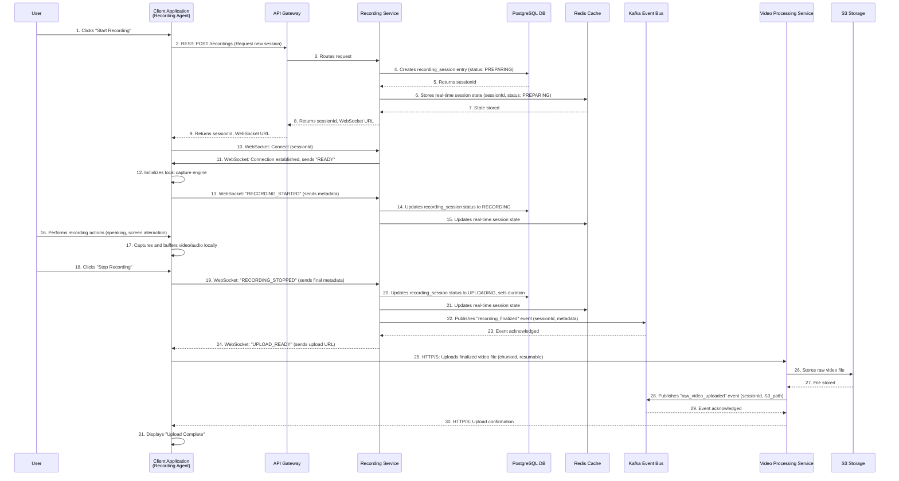
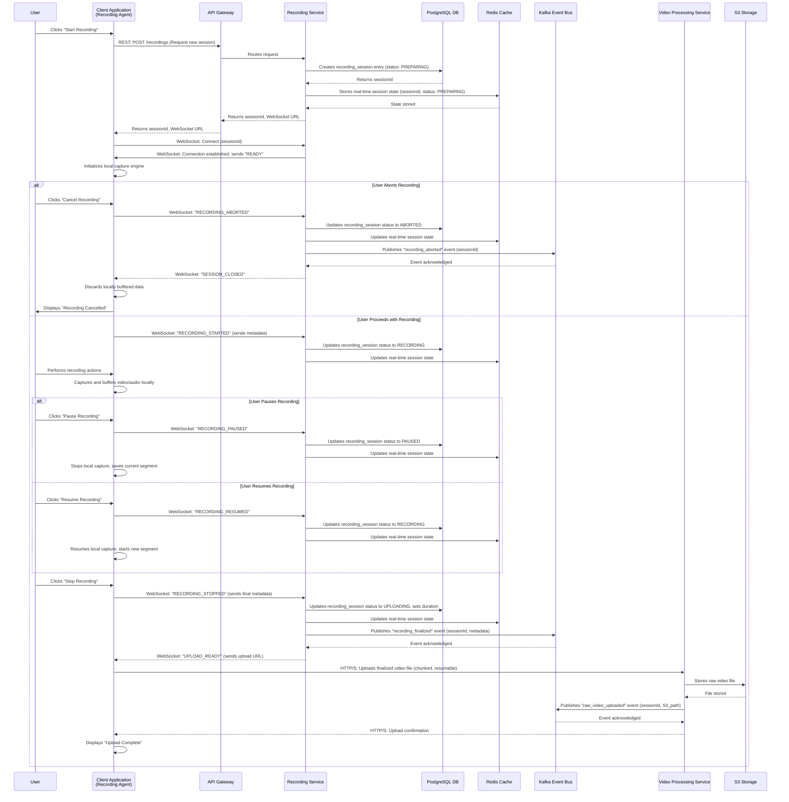

# Atlassian Loom: Recording Service Detailed Design

This document provides a detailed design for the Atlassian Loom Recording Service, covering its core purpose, the structure of the client-side stub, typical use-case flows (including abort scenarios), the file upload mechanism, and the rationale behind using WebSockets for real-time communication.

## 1. Core Purpose of the Recording Service

The Recording Service is the **central orchestrator and state manager** for all recording sessions within the Atlassian Loom platform. Its primary responsibilities are:

-   **Session Lifecycle Management**: Managing the entire lifecycle of a recording, from initiation, through active recording (including pause/resume), to completion or cancellation.
-   **Metadata Management**: Storing and retrieving all relevant metadata associated with a recording session (e.g., user, workspace, title, description, recording type, settings).
-   **Coordination with Client Applications**: Providing a robust API and real-time communication channel for various client applications (desktop, browser extension, mobile) to interact with the recording process.
-   **Orchestration of Downstream Processes**: Triggering subsequent processing workflows (e.g., video transcoding, AI analysis) once a recording is finalized and uploaded.
-   **Ensuring Reliability**: Maintaining session state and enabling recovery in case of client-side issues or network interruptions.

It acts as the "source of truth" for recording sessions, abstracting the complexities of distributed recording from other services and ensuring a consistent experience across all platforms.

## 2. Structure of the Client-Side Stub (Recording Agent)

The client-side stub, or Recording Agent, is a lightweight application or component embedded within the various Loom client applications (Desktop App, Browser Extension, Mobile App). It is responsible for the low-level capture and local management of recording data.

### 2.1 Key Components of the Client-Side Stub:

-   **Capture Engine**:
    -   **Screen Capture**: OS-level APIs for capturing screen, window, or specific application content.
    -   **Webcam Capture**: Access to local camera devices.
    -   **Audio Capture**: Access to microphone and system audio devices.
    -   **Encoding**: Real-time encoding of raw audio/video streams into a suitable intermediate format (e.g., MP4 fragments, WebM).
-   **Local Buffer/Storage Manager**:
    -   Temporarily stores recorded data locally (in memory or on disk) during an active recording session.
    -   Manages multi-segment recordings (for pause/resume) by storing individual fragments.
-   **WebSocket Client**:
    -   Maintains a persistent, bidirectional connection with the Recording Service.
    -   Sends real-time status updates (e.g., "recording started," "paused," "error").
    -   Receives control commands from the Recording Service (e.g., "session expired," "force stop").
-   **Upload Manager**:
    -   Responsible for chunked, resumable uploads of the finalized video file to the Video Processing Service's dedicated upload endpoint.
    -   Handles retry logic and progress reporting.
-   **User Interface Integration**:
    -   Provides controls (start, stop, pause, resume, settings) to the user.
    -   Displays recording status and preview.

### 2.2 Interaction with Recording Service:

The client-side stub communicates with the Recording Service primarily via WebSockets for real-time control and status, and via REST API for initial session creation and final confirmation.

## 3. Normal Use-Case Flow (Start, Record, Stop)

This sequence diagram illustrates the typical successful recording flow.

## 4. Detailed Swim-Lane Flows (including Abort)

This diagram provides a more granular view, including the scenario where a user aborts the recording.

## 5. How Does the File Upload Happen?

The file upload process is designed for **robustness and efficiency**, especially considering large video file sizes. It occurs **after** the recording has been completed and locally finalized by the client-side stub.

### 5.1 Mechanism: Chunked, Resumable HTTP/S Uploads

1.  **Client-Side Finalization**: Once the user stops recording, the client-side stub (Recording Agent) takes all the locally buffered or segmented video/audio data and stitches it into a single, finalized video file (e.g., MP4, WebM).
2.  **Upload URL Request**: The Recording Service, upon receiving the `RECORDING_STOPPED` event, generates a secure, time-limited upload URL (e.g., a pre-signed S3 URL or an endpoint on the Video Processing Service). This URL is sent back to the client via WebSocket.
3.  **Chunking**: The client-side Upload Manager divides the finalized video file into smaller, manageable chunks (e.g., 5MB-10MB each).
4.  **Parallel Uploads (Optional)**: For faster uploads, multiple chunks can be uploaded in parallel.
5.  **HTTP/S PUT Requests**: Each chunk is uploaded using standard HTTP/S PUT requests to the designated upload URL.
6.  **Resumability**: The upload manager tracks the progress of each chunk. If an upload is interrupted (e.g., network disconnection, client crash), it can resume from the last successfully uploaded chunk, preventing the need to restart the entire upload. This is typically achieved by tracking byte ranges or chunk indices.
7.  **Progress Reporting**: The client-side stub can report upload progress to the user interface.
8.  **Server-Side Assembly**: The Video Processing Service (or S3 directly, if using pre-signed URLs for multi-part uploads) receives these chunks and reassembles them into the complete raw video file.
9.  **Confirmation**: Once all chunks are successfully uploaded and assembled, the Video Processing Service confirms the upload, and publishes a `raw_video_uploaded` event to Kafka.

### 5.2 Advantages of Chunked, Resumable Uploads:

-   **Reliability**: Tolerates network interruptions and client crashes.
-   **Efficiency**: Allows for parallel uploads and reduces re-uploading data.
-   **Scalability**: Leverages standard HTTP/S and cloud storage capabilities (like S3 multi-part uploads) which are highly scalable.
-   **Bandwidth Optimization**: Can adapt to varying network conditions by adjusting chunk size or concurrency.

## 6. Why WebSockets for Recording Service Communication?

WebSockets are chosen for the real-time communication between the client-side Recording Agent and the Recording Service due to their inherent advantages for bidirectional, low-latency interactions.

### 6.1 Key Advantages:

-   **Bidirectional Communication**:
    -   **Client to Server**: Allows the client to send real-time status updates (e.g., "recording started," "paused," "error," "recording aborted") and metadata.
    -   **Server to Client**: Enables the Recording Service to send immediate control commands (e.g., "session expired," "force stop," "upload URL ready") or critical alerts back to the client. This is crucial for managing the recording lifecycle from the server side.
-   **Low Latency**:
    -   Unlike traditional HTTP requests (which are stateless and require a new connection for each request), WebSockets establish a single, persistent connection. This eliminates the overhead of connection setup and teardown for each message, significantly reducing latency.
    -   This is vital for responsive recording controls and real-time status synchronization.
-   **Reduced Overhead**:
    -   After the initial HTTP handshake, WebSocket frames have minimal overhead compared to full HTTP requests, making them more efficient for frequent, small message exchanges.
-   **Real-time Updates**:
    -   Facilitates instant communication, which is essential for features like:
        -   Immediate feedback on recording status.
        -   Server-initiated session management (e.g., if a recording hits a time limit or an admin forces a stop).
        -   Synchronizing pause/resume states across potentially multiple devices (though not explicitly in current scope, WebSockets enable this).
-   **Persistent Connection**:
    -   Maintains an open channel, allowing both client and server to push data at any time without polling, leading to more efficient resource utilization.

### 6.2 Alternatives Considered (and why WebSockets are preferred):

-   **Polling (HTTP)**: Would involve the client repeatedly sending HTTP requests to the server to check for updates. This is inefficient (high latency, high overhead) and not suitable for real-time control.
-   **Server-Sent Events (SSE)**: Provides a unidirectional (server-to-client) persistent connection. While good for server-push notifications, it lacks the client-to-server real-time communication needed for recording controls (e.g., client sending "paused" status).
-   **Long Polling (HTTP)**: Keeps an HTTP connection open until an event occurs or a timeout. While better than short polling, it's still less efficient than WebSockets for truly bidirectional, frequent communication.

In summary, WebSockets provide the necessary **bidirectional, low-latency, and persistent communication channel** required for the robust and responsive coordination between the client-side Recording Agent and the Recording Service, which is fundamental to the Atlassian Loom recording experience.

---
**Document Version**: 1.0  
**Last Updated**: 2025-01-30  
**Focus**: Detailed design of the Recording Service and client-side interactions  
**Review Status**: Ready for review
