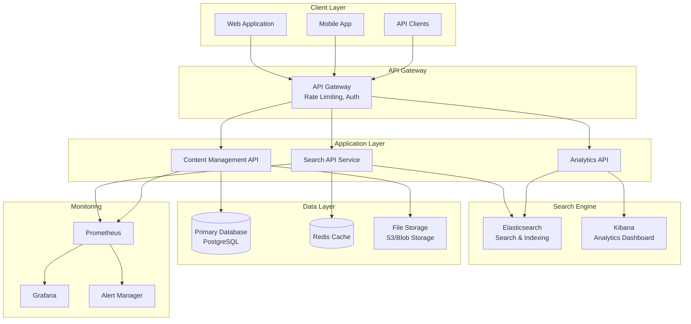

# Knowledge Base Search System - Complete Architecture Design

## Overview

This repository contains a comprehensive architectural design for a knowledge base search system capable of handling 1,000-10,000 articles for internal company use. The system provides full-text search capabilities with faceted navigation, analytics, and modern web technologies deployed on cloud infrastructure.

## 📋 Design Documents

### Core Architecture
1. **[System Requirements](./system-requirements.md)** - Functional and non-functional requirements, success metrics
2. **[System Architecture](./system-architecture.md)** - High-level architecture, technology stack, component design
3. **[Data Model](./data-model.md)** - Database schema, Elasticsearch mappings, data relationships

### Search & Navigation
4. **[Search Indexing Strategy](./search-indexing-strategy.md)** - Content processing, indexing pipeline, optimization
5. **[Search API Design](./search-api-design.md)** - API endpoints, query processing, response optimization
6. **[Faceted Navigation](./faceted-navigation-design.md)** - Filter structure, user interface, state management

### User Experience & Analytics
7. **[User Interface Design](./user-interface-design.md)** - UI components, responsive design, accessibility
8. **[Analytics & Reporting](./analytics-reporting-system.md)** - Event tracking, dashboards, insights

### Operations & Security
9. **[Security & Access Control](./security-access-control.md)** - Authentication, authorization, data protection
10. **[Deployment & Infrastructure](./deployment-infrastructure.md)** - Cloud deployment, CI/CD, scaling
11. **[Performance Optimization](./performance-optimization-strategy.md)** - Frontend/backend optimization, caching
12. **[Monitoring & Maintenance](./monitoring-maintenance-procedures.md)** - Observability, health checks, maintenance

## 🏗️ System Architecture Overview

## 🎯 Key Features

### Search Capabilities
- **Full-text search** with relevance ranking
- **Faceted navigation** with dynamic filters
- **Auto-suggestions** and spell correction
- **Advanced search** with boolean operators
- **Search analytics** and user behavior tracking

### Performance & Scalability
- **Sub-200ms search response times** for 95% of queries
- **Horizontal scaling** with auto-scaling capabilities
- **Multi-level caching** (L1: Memory, L2: Redis, L3: Database)
- **CDN integration** for global content delivery
- **Load balancing** with health checks

### Security & Compliance
- **Role-based access control** (RBAC)
- **Multi-factor authentication** (MFA)
- **Data encryption** at rest and in transit
- **Audit logging** and compliance reporting
- **Security monitoring** and threat detection

### User Experience
- **Responsive design** for all devices
- **Accessibility compliance** (WCAG 2.1 AA)
- **Progressive web app** capabilities
- **Offline functionality** with service workers
- **Real-time search** with debounced input

## 🛠️ Technology Stack

### Frontend
- **Framework**: React/Vue.js with TypeScript
- **Styling**: CSS-in-JS or Tailwind CSS
- **State Management**: Redux/Vuex
- **Build Tools**: Webpack/Vite
- **Testing**: Jest, Cypress

### Backend
- **Runtime**: Node.js or Python
- **Framework**: Express.js or FastAPI
- **Database**: PostgreSQL with read replicas
- **Search Engine**: Elasticsearch
- **Cache**: Redis cluster
- **Message Queue**: Redis/SQS

### Infrastructure
- **Cloud Platform**: AWS/Azure/GCP
- **Containers**: Docker + Kubernetes
- **CI/CD**: GitHub Actions
- **Monitoring**: Prometheus + Grafana
- **Logging**: ELK Stack (Elasticsearch, Logstash, Kibana)

## 📊 Performance Targets

| Metric | Target | Warning | Critical |
|--------|--------|---------|----------|
| Search Response Time | < 150ms | 200ms | 500ms |
| Page Load Time | < 2s | 3s | 5s |
| Availability | 99.9% | 99.5% | 99% |
| Error Rate | < 0.1% | 1% | 5% |
| Concurrent Users | 1000+ | 800 | 500 |

## 🚀 Deployment Strategy

### Environments
- **Development**: Single instance, minimal resources
- **Staging**: Production-like setup for testing
- **Production**: High availability, auto-scaling

### CI/CD Pipeline
1. **Code Commit** → Automated testing
2. **Build & Test** → Docker image creation
3. **Security Scan** → Vulnerability assessment
4. **Deploy to Staging** → Integration testing
5. **Deploy to Production** → Blue-green deployment

### Scaling Strategy
- **Horizontal Pod Autoscaler** for application scaling
- **Vertical Pod Autoscaler** for resource optimization
- **Cluster Autoscaler** for node scaling
- **Database read replicas** for read scaling

## 🔒 Security Measures

### Authentication & Authorization
- **Single Sign-On** (SSO) integration
- **Multi-factor Authentication** for privileged users
- **Role-based Access Control** with fine-grained permissions
- **API key management** for service-to-service communication

### Data Protection
- **Encryption at rest** (AES-256)
- **Encryption in transit** (TLS 1.3)
- **Data masking** for sensitive information
- **Regular security audits** and penetration testing

### Monitoring & Alerting
- **Real-time threat detection**
- **Anomaly detection** for unusual patterns
- **Security incident response** procedures
- **Compliance reporting** (GDPR, SOX, HIPAA)

## 📈 Analytics & Insights

### Search Analytics
- **Query performance** and response times
- **Search result relevance** and click-through rates
- **Popular search terms** and trending topics
- **User search patterns** and behavior analysis

### Content Analytics
- **Article performance** and engagement metrics
- **Content gaps** and optimization opportunities
- **Author and category** performance analysis
- **Content freshness** and update recommendations

### Business Intelligence
- **User adoption** and engagement trends
- **System utilization** and capacity planning
- **Cost optimization** opportunities
- **ROI measurement** and success metrics

## 🔧 Maintenance & Operations

### Automated Maintenance
- **Daily**: Log cleanup, health checks, backup verification
- **Weekly**: Performance analysis, index optimization
- **Monthly**: Security audits, capacity planning
- **Quarterly**: Architecture review, technology updates

### Monitoring & Alerting
- **Application Performance Monitoring** (APM)
- **Infrastructure monitoring** with Prometheus
- **Log aggregation** and analysis
- **Synthetic monitoring** and health checks

### Disaster Recovery
- **RTO**: 4 hours (Recovery Time Objective)
- **RPO**: 1 hour (Recovery Point Objective)
- **Automated backups** with cross-region replication
- **Disaster recovery testing** procedures

## 📚 Implementation Roadmap

### Phase 1: Foundation (Weeks 1-4)
- [ ] Set up development environment
- [ ] Implement core data model
- [ ] Basic search functionality
- [ ] Simple user interface

### Phase 2: Core Features (Weeks 5-8)
- [ ] Advanced search capabilities
- [ ] Faceted navigation
- [ ] User authentication
- [ ] Basic analytics

### Phase 3: Enhancement (Weeks 9-12)
- [ ] Performance optimization
- [ ] Advanced security features
- [ ] Comprehensive monitoring
- [ ] Mobile responsiveness

### Phase 4: Production (Weeks 13-16)
- [ ] Production deployment
- [ ] Load testing and optimization
- [ ] Documentation and training
- [ ] Go-live and support

## 🤝 Contributing

This design serves as a comprehensive blueprint for implementing a production-ready knowledge base search system. Each document provides detailed specifications, code examples, and best practices for implementation.

## 📄 License

This architectural design is provided as a reference implementation guide. Adapt and modify according to your specific requirements and constraints.

---

**Total Design Effort**: 12 comprehensive documents covering all aspects of system design, from requirements to maintenance procedures.

**Target Audience**: Technical architects, development teams, DevOps engineers, and project stakeholders.

**Implementation Time**: Estimated 12-16 weeks for a complete implementation with a dedicated team.