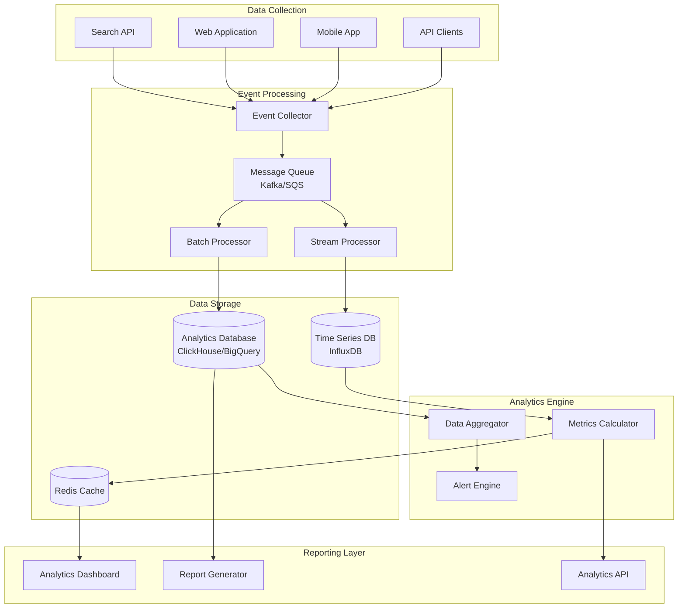

# Knowledge Base Search System - Analytics & Reporting

## Overview

The analytics and reporting system provides comprehensive insights into search behavior, content performance, user engagement, and system health. This enables data-driven decisions for content optimization and system improvements.

## Analytics Architecture



## Event Tracking Schema

### Search Events

```json
{
  "event_type": "search_performed",
  "timestamp": "2024-01-15T10:30:00.000Z",
  "session_id": "sess_123456",
  "user_id": "user_789",
  "search_data": {
    "query": "user authentication",
    "query_type": "simple",
    "filters": {
      "categories": ["security"],
      "authors": ["john-doe"],
      "date_range": "last_month"
    },
    "sort": "relevance",
    "page": 1,
    "size": 20
  },
  "results": {
    "total_count": 156,
    "returned_count": 20,
    "response_time_ms": 45,
    "top_result_score": 8.5
  },
  "context": {
    "user_agent": "Mozilla/5.0...",
    "ip_address": "192.168.1.100",
    "referrer": "/dashboard",
    "device_type": "desktop",
    "location": {
      "country": "US",
      "region": "CA"
    }
  }
}
```

### Click Events

```json
{
  "event_type": "result_clicked",
  "timestamp": "2024-01-15T10:30:15.000Z",
  "session_id": "sess_123456",
  "user_id": "user_789",
  "search_session_id": "search_456",
  "click_data": {
    "article_id": "article_123",
    "position": 3,
    "query": "user authentication",
    "result_score": 7.8,
    "click_time_from_search": 15000
  },
  "article_metadata": {
    "title": "User Authentication Guide",
    "category": "Security",
    "author": "john-doe",
    "published_at": "2024-01-10T09:00:00.000Z"
  }
}
```

### Engagement Events

```json
{
  "event_type": "article_engagement",
  "timestamp": "2024-01-15T10:35:00.000Z",
  "session_id": "sess_123456",
  "user_id": "user_789",
  "engagement_data": {
    "article_id": "article_123",
    "time_spent_seconds": 180,
    "scroll_depth_percent": 75,
    "actions": [
      {"type": "like", "timestamp": "2024-01-15T10:32:00.000Z"},
      {"type": "share", "timestamp": "2024-01-15T10:34:00.000Z"},
      {"type": "download_attachment", "attachment_id": "att_456", "timestamp": "2024-01-15T10:33:00.000Z"}
    ],
    "exit_type": "navigation"
  }
}
```

## Analytics Metrics

### Search Performance Metrics

```javascript
class SearchMetrics {
    // Query performance metrics
    calculateQueryPerformance(timeRange) {
        return {
            averageResponseTime: this.getAverageResponseTime(timeRange),
            p95ResponseTime: this.getPercentileResponseTime(timeRange, 95),
            p99ResponseTime: this.getPercentileResponseTime(timeRange, 99),
            totalQueries: this.getTotalQueries(timeRange),
            queriesPerSecond: this.getQueriesPerSecond(timeRange),
            errorRate: this.getErrorRate(timeRange)
        };
    }
    
    // Search quality metrics
    calculateSearchQuality(timeRange) {
        return {
            clickThroughRate: this.getClickThroughRate(timeRange),
            averageClickPosition: this.getAverageClickPosition(timeRange),
            zeroResultQueries: this.getZeroResultQueries(timeRange),
            abandonmentRate: this.getAbandonmentRate(timeRange),
            refinementRate: this.getRefinementRate(timeRange)
        };
    }
    
    // Popular queries analysis
    getPopularQueries(timeRange, limit = 100) {
        return {
            topQueries: this.getTopQueries(timeRange, limit),
            trendingQueries: this.getTrendingQueries(timeRange, limit),
            failingQueries: this.getFailingQueries(timeRange, limit),
            longTailQueries: this.getLongTailQueries(timeRange, limit)
        };
    }
}
```

### Content Performance Metrics

```javascript
class ContentMetrics {
    // Article performance
    calculateArticlePerformance(timeRange) {
        return {
            topPerformingArticles: this.getTopPerformingArticles(timeRange),
            underperformingArticles: this.getUnderperformingArticles(timeRange),
            contentGaps: this.identifyContentGaps(timeRange),
            categoryPerformance: this.getCategoryPerformance(timeRange)
        };
    }
    
    // Content engagement metrics
    calculateEngagementMetrics(timeRange) {
        return {
            averageTimeOnPage: this.getAverageTimeOnPage(timeRange),
            bounceRate: this.getBounceRate(timeRange),
            socialShares: this.getSocialShares(timeRange),
            downloadCounts: this.getDownloadCounts(timeRange),
            likeRatios: this.getLikeRatios(timeRange)
        };
    }
    
    // Content freshness analysis
    analyzeContentFreshness() {
        return {
            staleContent: this.getStaleContent(),
            recentlyUpdated: this.getRecentlyUpdated(),
            updateFrequency: this.getUpdateFrequency(),
            contentAge: this.getContentAgeDistribution()
        };
    }
}
```

### User Behavior Metrics

```javascript
class UserBehaviorMetrics {
    // User engagement patterns
    calculateUserEngagement(timeRange) {
        return {
            activeUsers: this.getActiveUsers(timeRange),
            sessionDuration: this.getAverageSessionDuration(timeRange),
            pagesPerSession: this.getAveragePagesPerSession(timeRange),
            returnUserRate: this.getReturnUserRate(timeRange),
            userRetention: this.getUserRetention(timeRange)
        };
    }
    
    // Search behavior patterns
    analyzeSearchBehavior(timeRange) {
        return {
            searchFrequency: this.getSearchFrequency(timeRange),
            queryComplexity: this.getQueryComplexity(timeRange),
            filterUsage: this.getFilterUsage(timeRange),
            searchPatterns: this.getSearchPatterns(timeRange)
        };
    }
    
    // User segmentation
    segmentUsers(timeRange) {
        return {
            powerUsers: this.getPowerUsers(timeRange),
            casualUsers: this.getCasualUsers(timeRange),
            newUsers: this.getNewUsers(timeRange),
            departmentBreakdown: this.getDepartmentBreakdown(timeRange)
        };
    }
}
```

## Real-time Analytics Dashboard

### Dashboard Components

```javascript
// React dashboard component structure
const AnalyticsDashboard = () => {
    const [timeRange, setTimeRange] = useState('24h');
    const [metrics, setMetrics] = useState({});
    const [realTimeData, setRealTimeData] = useState({});
    
    return (
        <div className="analytics-dashboard">
            <DashboardHeader 
                timeRange={timeRange}
                onTimeRangeChange={setTimeRange}
            />
            
            <div className="dashboard-grid">
                {/* Real-time metrics */}
                <MetricCard
                    title="Searches per Minute"
                    value={realTimeData.searchesPerMinute}
                    trend={realTimeData.searchTrend}
                    type="realtime"
                />
                
                <MetricCard
                    title="Average Response Time"
                    value={`${metrics.avgResponseTime}ms`}
                    trend={metrics.responseTrend}
                    type="performance"
                />
                
                <MetricCard
                    title="Click-through Rate"
                    value={`${metrics.clickThroughRate}%`}
                    trend={metrics.ctrTrend}
                    type="engagement"
                />
                
                <MetricCard
                    title="Zero Results Rate"
                    value={`${metrics.zeroResultsRate}%`}
                    trend={metrics.zeroResultsTrend}
                    type="quality"
                />
                
                {/* Charts */}
                <ChartContainer span={2}>
                    <SearchVolumeChart 
                        data={metrics.searchVolume}
                        timeRange={timeRange}
                    />
                </ChartContainer>
                
                <ChartContainer span={2}>
                    <ResponseTimeChart 
                        data={metrics.responseTime}
                        timeRange={timeRange}
                    />
                </ChartContainer>
                
                {/* Tables */}
                <TableContainer span={2}>
                    <PopularQueriesTable 
                        queries={metrics.popularQueries}
                        timeRange={timeRange}
                    />
                </TableContainer>
                
                <TableContainer span={2}>
                    <TopArticlesTable 
                        articles={metrics.topArticles}
                        timeRange={timeRange}
                    />
                </TableContainer>
            </div>
        </div>
    );
};
```

### Real-time Data Processing

```javascript
class RealTimeAnalytics {
    constructor(redisClient, websocketServer) {
        this.redis = redisClient;
        this.ws = websocketServer;
        this.metrics = new Map();
        this.startRealTimeProcessing();
    }
    
    startRealTimeProcessing() {
        // Process events from Redis streams
        this.processEventStream();
        
        // Calculate and broadcast metrics every 10 seconds
        setInterval(() => {
            this.calculateRealTimeMetrics();
            this.broadcastMetrics();
        }, 10000);
    }
    
    async processEventStream() {
        const stream = this.redis.xread(
            'BLOCK', 1000,
            'STREAMS', 'analytics:events', '$'
        );
        
        for (const [streamName, messages] of stream) {
            for (const [messageId, fields] of messages) {
                await this.processEvent(JSON.parse(fields.data));
            }
        }
        
        // Continue processing
        setImmediate(() => this.processEventStream());
    }
    
    async processEvent(event) {
        const minute = Math.floor(Date.now() / 60000);
        
        switch (event.event_type) {
            case 'search_performed':
                await this.updateSearchMetrics(event, minute);
                break;
            case 'result_clicked':
                await this.updateClickMetrics(event, minute);
                break;
            case 'article_engagement':
                await this.updateEngagementMetrics(event, minute);
                break;
        }
    }
    
    async updateSearchMetrics(event, minute) {
        const key = `metrics:search:${minute}`;
        
        await this.redis.multi()
            .hincrby(key, 'total_searches', 1)
            .hincrby(key, 'total_response_time', event.results.response_time_ms)
            .hincrby(key, 'zero_results', event.results.total_count === 0 ? 1 : 0)
            .expire(key, 3600) // Keep for 1 hour
            .exec();
    }
    
    calculateRealTimeMetrics() {
        const now = Math.floor(Date.now() / 60000);
        const metrics = {
            searchesPerMinute: this.getSearchesPerMinute(now),
            avgResponseTime: this.getAverageResponseTime(now),
            clickThroughRate: this.getClickThroughRate(now),
            zeroResultsRate: this.getZeroResultsRate(now),
            activeUsers: this.getActiveUsers(now)
        };
        
        this.metrics.set('realtime', metrics);
    }
    
    broadcastMetrics() {
        const metrics = this.metrics.get('realtime');
        
        this.ws.broadcast({
            type: 'metrics_update',
            data: metrics,
            timestamp: Date.now()
        });
    }
}
```

## Reporting System

### Automated Report Generation

```javascript
class ReportGenerator {
    constructor(analyticsDB, emailService) {
        this.db = analyticsDB;
        this.email = emailService;
        this.scheduleReports();
    }
    
    scheduleReports() {
        // Daily reports at 9 AM
        cron.schedule('0 9 * * *', () => {
            this.generateDailyReport();
        });
        
        // Weekly reports on Monday at 9 AM
        cron.schedule('0 9 * * 1', () => {
            this.generateWeeklyReport();
        });
        
        // Monthly reports on 1st at 9 AM
        cron.schedule('0 9 1 * *', () => {
            this.generateMonthlyReport();
        });
    }
    
    async generateDailyReport() {
        const yesterday = moment().subtract(1, 'day');
        const data = await this.collectDailyData(yesterday);
        
        const report = {
            title: `Daily Search Analytics - ${yesterday.format('YYYY-MM-DD')}`,
            period: yesterday.format('YYYY-MM-DD'),
            summary: {
                totalSearches: data.totalSearches,
                uniqueUsers: data.uniqueUsers,
                avgResponseTime: data.avgResponseTime,
                clickThroughRate: data.clickThroughRate
            },
            topQueries: data.topQueries,
            topArticles: data.topArticles,
            performance: data.performance,
            issues: data.issues
        };
        
        await this.saveReport(report);
        await this.sendReportEmail(report, 'daily');
    }
    
    async generateWeeklyReport() {
        const lastWeek = {
            start: moment().subtract(1, 'week').startOf('week'),
            end: moment().subtract(1, 'week').endOf('week')
        };
        
        const data = await this.collectWeeklyData(lastWeek);
        
        const report = {
            title: `Weekly Search Analytics - Week of ${lastWeek.start.format('YYYY-MM-DD')}`,
            period: `${lastWeek.start.format('YYYY-MM-DD')} to ${lastWeek.end.format('YYYY-MM-DD')}`,
            summary: data.summary,
            trends: data.trends,
            insights: await this.generateInsights(data),
            recommendations: await this.generateRecommendations(data)
        };
        
        await this.saveReport(report);
        await this.sendReportEmail(report, 'weekly');
    }
    
    async generateInsights(data) {
        const insights = [];
        
        // Search volume trends
        if (data.searchVolumeChange > 0.1) {
            insights.push({
                type: 'positive',
                title: 'Search Volume Increase',
                description: `Search volume increased by ${(data.searchVolumeChange * 100).toFixed(1)}% compared to previous period`
            });
        }
        
        // Performance improvements
        if (data.responseTimeChange < -0.05) {
            insights.push({
                type: 'positive',
                title: 'Performance Improvement',
                description: `Average response time improved by ${Math.abs(data.responseTimeChange * 100).toFixed(1)}%`
            });
        }
        
        // Content gaps
        const contentGaps = await this.identifyContentGaps(data);
        if (contentGaps.length > 0) {
            insights.push({
                type: 'opportunity',
                title: 'Content Gaps Identified',
                description: `Found ${contentGaps.length} topics with high search volume but low-quality results`,
                details: contentGaps
            });
        }
        
        return insights;
    }
}
```

### Custom Report Builder

```javascript
class CustomReportBuilder {
    constructor(analyticsDB) {
        this.db = analyticsDB;
        this.reportTemplates = new Map();
        this.loadReportTemplates();
    }
    
    async buildCustomReport(config) {
        const {
            title,
            timeRange,
            metrics,
            dimensions,
            filters,
            format
        } = config;
        
        const data = await this.queryData({
            timeRange,
            metrics,
            dimensions,
            filters
        });
        
        const report = {
            title,
            generatedAt: new Date().toISOString(),
            config,
            data: this.processReportData(data, config),
            charts: this.generateCharts(data, config),
            tables: this.generateTables(data, config)
        };
        
        return this.formatReport(report, format);
    }
    
    async queryData(config) {
        const query = this.buildAnalyticsQuery(config);
        return await this.db.query(query);
    }
    
    buildAnalyticsQuery(config) {
        let query = `
            SELECT 
                ${config.dimensions.join(', ')},
                ${config.metrics.map(m => this.getMetricExpression(m)).join(', ')}
            FROM analytics_events
            WHERE timestamp >= '${config.timeRange.start}'
            AND timestamp <= '${config.timeRange.end}'
        `;
        
        if (config.filters) {
            const filterClauses = Object.entries(config.filters)
                .map(([field, value]) => `${field} = '${value}'`);
            query += ` AND ${filterClauses.join(' AND ')}`;
        }
        
        if (config.dimensions.length > 0) {
            query += ` GROUP BY ${config.dimensions.join(', ')}`;
        }
        
        query += ` ORDER BY ${config.metrics[0]} DESC`;
        
        return query;
    }
    
    getMetricExpression(metric) {
        const expressions = {
            'total_searches': 'COUNT(*)',
            'unique_users': 'COUNT(DISTINCT user_id)',
            'avg_response_time': 'AVG(response_time_ms)',
            'click_through_rate': 'AVG(CASE WHEN clicked = 1 THEN 1.0 ELSE 0.0 END)',
            'zero_results_rate': 'AVG(CASE WHEN result_count = 0 THEN 1.0 ELSE 0.0 END)'
        };
        
        return `${expressions[metric]} as ${metric}`;
    }
}
```

## Alert System

### Alert Configuration

```javascript
class AlertSystem {
    constructor(metricsCalculator, notificationService) {
        this.metrics = metricsCalculator;
        this.notifications = notificationService;
        this.alerts = new Map();
        this.setupDefaultAlerts();
    }
    
    setupDefaultAlerts() {
        // Performance alerts
        this.addAlert({
            id: 'high_response_time',
            name: 'High Response Time',
            condition: 'avg_response_time > 500',
            severity: 'warning',
            threshold: 500,
            timeWindow: '5m',
            recipients: ['ops-team@company.com']
        });
        
        this.addAlert({
            id: 'search_errors',
            name: 'Search Error Rate',
            condition: 'error_rate > 0.05',
            severity: 'critical',
            threshold: 0.05,
            timeWindow: '5m',
            recipients: ['ops-team@company.com', 'dev-team@company.com']
        });
        
        // Quality alerts
        this.addAlert({
            id: 'low_ctr',
            name: 'Low Click-through Rate',
            condition: 'click_through_rate < 0.1',
            severity: 'warning',
            threshold: 0.1,
            timeWindow: '1h',
            recipients: ['content-team@company.com']
        });
        
        this.addAlert({
            id: 'high_zero_results',
            name: 'High Zero Results Rate',
            condition: 'zero_results_rate > 0.2',
            severity: 'warning',
            threshold: 0.2,
            timeWindow: '1h',
            recipients: ['content-team@company.com']
        });
    }
    
    async checkAlerts() {
        for (const [alertId, alert] of this.alerts) {
            const currentValue = await this.metrics.calculateMetric(
                alert.metric,
                alert.timeWindow
            );
            
            if (this.evaluateCondition(alert.condition, currentValue)) {
                await this.triggerAlert(alert, currentValue);
            }
        }
    }
    
    async triggerAlert(alert, currentValue) {
        const alertData = {
            id: alert.id,
            name: alert.name,
            severity: alert.severity,
            currentValue,
            threshold: alert.threshold,
            timestamp: new Date().toISOString(),
            dashboardUrl: `${process.env.DASHBOARD_URL}/alerts/${alert.id}`
        };
        
        await this.notifications.sendAlert(alert.recipients, alertData);
        await this.logAlert(alertData);
    }
}
```

This comprehensive analytics and reporting system provides deep insights into search behavior, content performance, and system health, enabling data-driven optimization of the knowledge base search system.