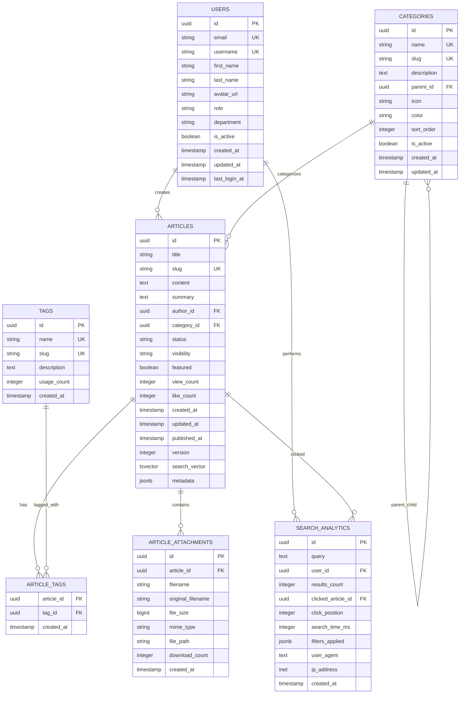

# Knowledge Base Search System - Data Model

## Database Schema (PostgreSQL)

### Articles Table
```sql
CREATE TABLE articles (
    id UUID PRIMARY KEY DEFAULT gen_random_uuid(),
    title VARCHAR(500) NOT NULL,
    slug VARCHAR(200) UNIQUE NOT NULL,
    content TEXT NOT NULL,
    summary TEXT,
    author_id UUID NOT NULL REFERENCES users(id),
    category_id UUID NOT NULL REFERENCES categories(id),
    status VARCHAR(20) DEFAULT 'draft' CHECK (status IN ('draft', 'published', 'archived')),
    visibility VARCHAR(20) DEFAULT 'internal' CHECK (visibility IN ('public', 'internal', 'restricted')),
    featured BOOLEAN DEFAULT FALSE,
    view_count INTEGER DEFAULT 0,
    like_count INTEGER DEFAULT 0,
    created_at TIMESTAMP WITH TIME ZONE DEFAULT NOW(),
    updated_at TIMESTAMP WITH TIME ZONE DEFAULT NOW(),
    published_at TIMESTAMP WITH TIME ZONE,
    version INTEGER DEFAULT 1,
    search_vector TSVECTOR,
    metadata JSONB DEFAULT '{}'::jsonb
);

-- Indexes for performance
CREATE INDEX idx_articles_status ON articles(status);
CREATE INDEX idx_articles_category ON articles(category_id);
CREATE INDEX idx_articles_author ON articles(author_id);
CREATE INDEX idx_articles_published_at ON articles(published_at DESC);
CREATE INDEX idx_articles_search_vector ON articles USING GIN(search_vector);
CREATE INDEX idx_articles_metadata ON articles USING GIN(metadata);
```

### Categories Table
```sql
CREATE TABLE categories (
    id UUID PRIMARY KEY DEFAULT gen_random_uuid(),
    name VARCHAR(100) NOT NULL UNIQUE,
    slug VARCHAR(100) NOT NULL UNIQUE,
    description TEXT,
    parent_id UUID REFERENCES categories(id),
    icon VARCHAR(50),
    color VARCHAR(7), -- Hex color code
    sort_order INTEGER DEFAULT 0,
    is_active BOOLEAN DEFAULT TRUE,
    created_at TIMESTAMP WITH TIME ZONE DEFAULT NOW(),
    updated_at TIMESTAMP WITH TIME ZONE DEFAULT NOW()
);

CREATE INDEX idx_categories_parent ON categories(parent_id);
CREATE INDEX idx_categories_active ON categories(is_active);
```

### Tags Table
```sql
CREATE TABLE tags (
    id UUID PRIMARY KEY DEFAULT gen_random_uuid(),
    name VARCHAR(50) NOT NULL UNIQUE,
    slug VARCHAR(50) NOT NULL UNIQUE,
    description TEXT,
    usage_count INTEGER DEFAULT 0,
    created_at TIMESTAMP WITH TIME ZONE DEFAULT NOW()
);

CREATE INDEX idx_tags_usage_count ON tags(usage_count DESC);
```

### Article Tags Junction Table
```sql
CREATE TABLE article_tags (
    article_id UUID NOT NULL REFERENCES articles(id) ON DELETE CASCADE,
    tag_id UUID NOT NULL REFERENCES tags(id) ON DELETE CASCADE,
    created_at TIMESTAMP WITH TIME ZONE DEFAULT NOW(),
    PRIMARY KEY (article_id, tag_id)
);
```

### Users Table
```sql
CREATE TABLE users (
    id UUID PRIMARY KEY DEFAULT gen_random_uuid(),
    email VARCHAR(255) NOT NULL UNIQUE,
    username VARCHAR(100) NOT NULL UNIQUE,
    first_name VARCHAR(100),
    last_name VARCHAR(100),
    avatar_url VARCHAR(500),
    role VARCHAR(20) DEFAULT 'user' CHECK (role IN ('admin', 'editor', 'author', 'user')),
    department VARCHAR(100),
    is_active BOOLEAN DEFAULT TRUE,
    created_at TIMESTAMP WITH TIME ZONE DEFAULT NOW(),
    updated_at TIMESTAMP WITH TIME ZONE DEFAULT NOW(),
    last_login_at TIMESTAMP WITH TIME ZONE
);

CREATE INDEX idx_users_email ON users(email);
CREATE INDEX idx_users_role ON users(role);
CREATE INDEX idx_users_active ON users(is_active);
```

### Article Attachments Table
```sql
CREATE TABLE article_attachments (
    id UUID PRIMARY KEY DEFAULT gen_random_uuid(),
    article_id UUID NOT NULL REFERENCES articles(id) ON DELETE CASCADE,
    filename VARCHAR(255) NOT NULL,
    original_filename VARCHAR(255) NOT NULL,
    file_size BIGINT NOT NULL,
    mime_type VARCHAR(100) NOT NULL,
    file_path VARCHAR(500) NOT NULL,
    download_count INTEGER DEFAULT 0,
    created_at TIMESTAMP WITH TIME ZONE DEFAULT NOW()
);

CREATE INDEX idx_attachments_article ON article_attachments(article_id);
```

### Search Analytics Table
```sql
CREATE TABLE search_analytics (
    id UUID PRIMARY KEY DEFAULT gen_random_uuid(),
    query TEXT NOT NULL,
    user_id UUID REFERENCES users(id),
    results_count INTEGER NOT NULL,
    clicked_article_id UUID REFERENCES articles(id),
    click_position INTEGER,
    search_time_ms INTEGER,
    filters_applied JSONB DEFAULT '{}'::jsonb,
    user_agent TEXT,
    ip_address INET,
    created_at TIMESTAMP WITH TIME ZONE DEFAULT NOW()
);

CREATE INDEX idx_search_analytics_query ON search_analytics(query);
CREATE INDEX idx_search_analytics_created_at ON search_analytics(created_at DESC);
CREATE INDEX idx_search_analytics_user ON search_analytics(user_id);
```

## Elasticsearch Index Schema

### Articles Index Mapping
```json
{
  "mappings": {
    "properties": {
      "id": {
        "type": "keyword"
      },
      "title": {
        "type": "text",
        "analyzer": "standard",
        "fields": {
          "keyword": {
            "type": "keyword"
          },
          "suggest": {
            "type": "completion"
          }
        }
      },
      "content": {
        "type": "text",
        "analyzer": "standard"
      },
      "summary": {
        "type": "text",
        "analyzer": "standard"
      },
      "author": {
        "type": "object",
        "properties": {
          "id": { "type": "keyword" },
          "name": { "type": "text" },
          "email": { "type": "keyword" },
          "department": { "type": "keyword" }
        }
      },
      "category": {
        "type": "object",
        "properties": {
          "id": { "type": "keyword" },
          "name": { "type": "keyword" },
          "slug": { "type": "keyword" },
          "path": { "type": "keyword" }
        }
      },
      "tags": {
        "type": "keyword"
      },
      "status": {
        "type": "keyword"
      },
      "visibility": {
        "type": "keyword"
      },
      "featured": {
        "type": "boolean"
      },
      "view_count": {
        "type": "integer"
      },
      "like_count": {
        "type": "integer"
      },
      "created_at": {
        "type": "date"
      },
      "updated_at": {
        "type": "date"
      },
      "published_at": {
        "type": "date"
      },
      "attachments": {
        "type": "object",
        "properties": {
          "filename": { "type": "text" },
          "mime_type": { "type": "keyword" },
          "file_size": { "type": "long" }
        }
      },
      "metadata": {
        "type": "object",
        "dynamic": true
      },
      "popularity_score": {
        "type": "float"
      },
      "freshness_score": {
        "type": "float"
      }
    }
  },
  "settings": {
    "number_of_shards": 2,
    "number_of_replicas": 1,
    "analysis": {
      "analyzer": {
        "custom_text_analyzer": {
          "type": "custom",
          "tokenizer": "standard",
          "filter": [
            "lowercase",
            "stop",
            "stemmer"
          ]
        }
      }
    }
  }
}
```

## Data Relationships



## Data Validation Rules

### Article Validation
- **Title**: 1-500 characters, required
- **Content**: Minimum 10 characters, required
- **Summary**: Maximum 1000 characters, optional
- **Status**: Must be one of: draft, published, archived
- **Visibility**: Must be one of: public, internal, restricted
- **Slug**: URL-friendly, unique, auto-generated from title

### Category Validation
- **Name**: 1-100 characters, unique, required
- **Slug**: URL-friendly, unique, auto-generated from name
- **Parent**: Cannot create circular references
- **Color**: Valid hex color code format

### Tag Validation
- **Name**: 1-50 characters, unique, required
- **Slug**: URL-friendly, unique, auto-generated from name

### User Validation
- **Email**: Valid email format, unique, required
- **Username**: 3-100 characters, alphanumeric + underscore, unique
- **Role**: Must be one of: admin, editor, author, user

## Data Migration Strategy

### Initial Data Import
1. **CSV/Excel Import**: Support bulk import of existing articles
2. **Data Validation**: Validate all imported data against schema rules
3. **Duplicate Detection**: Identify and handle duplicate articles
4. **Category Mapping**: Map existing categories to new structure
5. **User Migration**: Import user accounts with role assignments

### Ongoing Data Sync
1. **Real-time Indexing**: Sync PostgreSQL changes to Elasticsearch
2. **Batch Processing**: Handle bulk operations efficiently
3. **Conflict Resolution**: Handle concurrent updates gracefully
4. **Data Consistency**: Ensure data integrity across systems

## Performance Considerations

### Database Optimization
- **Indexing Strategy**: Optimize for common query patterns
- **Partitioning**: Consider partitioning large tables by date
- **Connection Pooling**: Efficient database connection management
- **Query Optimization**: Use EXPLAIN ANALYZE for query tuning

### Elasticsearch Optimization
- **Shard Strategy**: Balance shard size and count
- **Refresh Interval**: Optimize for search vs. indexing performance
- **Field Mapping**: Use appropriate field types and analyzers
- **Index Templates**: Standardize index configurations