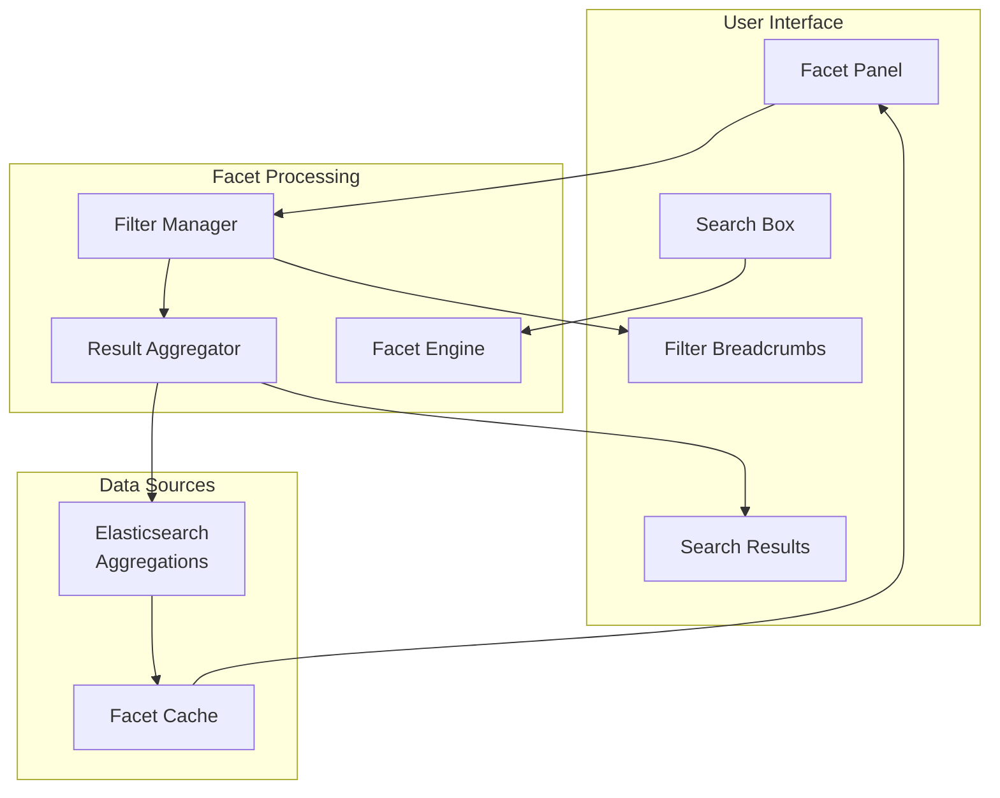

# Knowledge Base Search System - Faceted Navigation Design

## Overview

Faceted navigation provides users with multiple ways to filter and explore search results through various dimensions (facets) such as categories, authors, dates, and tags. This design ensures users can quickly narrow down results to find relevant content.

## Faceted Navigation Architecture



## Facet Types and Structure

### 1. Category Facet (Hierarchical)

```json
{
  "facet_type": "hierarchical",
  "field": "category",
  "display_name": "Categories",
  "max_items": 10,
  "show_count": true,
  "collapsible": true,
  "structure": {
    "Technology": {
      "count": 245,
      "children": {
        "Development": {
          "count": 120,
          "children": {
            "Frontend": {"count": 45},
            "Backend": {"count": 35},
            "Mobile": {"count": 25},
            "DevOps": {"count": 15}
          }
        },
        "Security": {
          "count": 85,
          "children": {
            "Authentication": {"count": 30},
            "Authorization": {"count": 25},
            "Encryption": {"count": 20},
            "Compliance": {"count": 10}
          }
        },
        "Infrastructure": {
          "count": 40,
          "children": {
            "Cloud": {"count": 25},
            "Networking": {"count": 15}
          }
        }
      }
    },
    "Business": {
      "count": 156,
      "children": {
        "Processes": {"count": 80},
        "Policies": {"count": 45},
        "Training": {"count": 31}
      }
    }
  }
}
```

### 2. Author Facet (Terms)

```json
{
  "facet_type": "terms",
  "field": "author.keyword",
  "display_name": "Authors",
  "max_items": 15,
  "show_count": true,
  "searchable": true,
  "sort_by": "count",
  "values": [
    {"key": "john-doe", "display_name": "John Doe", "count": 45, "avatar": "/avatars/john-doe.jpg"},
    {"key": "jane-smith", "display_name": "Jane Smith", "count": 32, "avatar": "/avatars/jane-smith.jpg"},
    {"key": "mike-johnson", "display_name": "Mike Johnson", "count": 28, "avatar": "/avatars/mike-johnson.jpg"},
    {"key": "sarah-wilson", "display_name": "Sarah Wilson", "count": 24, "avatar": "/avatars/sarah-wilson.jpg"}
  ]
}
```

### 3. Tags Facet (Terms with Search)

```json
{
  "facet_type": "terms",
  "field": "tags.keyword",
  "display_name": "Tags",
  "max_items": 20,
  "show_count": true,
  "searchable": true,
  "sort_by": "count",
  "show_more": true,
  "values": [
    {"key": "authentication", "display_name": "Authentication", "count": 67},
    {"key": "api", "display_name": "API", "count": 54},
    {"key": "security", "display_name": "Security", "count": 48},
    {"key": "javascript", "display_name": "JavaScript", "count": 42},
    {"key": "database", "display_name": "Database", "count": 38}
  ]
}
```

### 4. Date Range Facet

```json
{
  "facet_type": "date_range",
  "field": "published_at",
  "display_name": "Publication Date",
  "ranges": [
    {"key": "last_week", "display_name": "Last Week", "from": "now-7d", "count": 12},
    {"key": "last_month", "display_name": "Last Month", "from": "now-30d", "count": 45},
    {"key": "last_3_months", "display_name": "Last 3 Months", "from": "now-90d", "count": 128},
    {"key": "last_year", "display_name": "Last Year", "from": "now-365d", "count": 234},
    {"key": "older", "display_name": "Older", "to": "now-365d", "count": 89}
  ],
  "custom_range": {
    "enabled": true,
    "min_date": "2020-01-01",
    "max_date": "now"
  }
}
```

### 5. Content Type Facet

```json
{
  "facet_type": "terms",
  "field": "content_type.keyword",
  "display_name": "Content Type",
  "max_items": 8,
  "show_count": true,
  "icons": true,
  "values": [
    {"key": "guide", "display_name": "Guides", "count": 156, "icon": "book"},
    {"key": "tutorial", "display_name": "Tutorials", "count": 89, "icon": "play-circle"},
    {"key": "faq", "display_name": "FAQs", "count": 67, "icon": "question-circle"},
    {"key": "policy", "display_name": "Policies", "count": 45, "icon": "shield"},
    {"key": "announcement", "display_name": "Announcements", "count": 23, "icon": "megaphone"}
  ]
}
```

### 6. Popularity Facet (Range)

```json
{
  "facet_type": "range",
  "field": "view_count",
  "display_name": "Popularity",
  "ranges": [
    {"key": "trending", "display_name": "Trending (1000+ views)", "from": 1000, "count": 45},
    {"key": "popular", "display_name": "Popular (500-999 views)", "from": 500, "to": 999, "count": 78},
    {"key": "moderate", "display_name": "Moderate (100-499 views)", "from": 100, "to": 499, "count": 156},
    {"key": "new", "display_name": "New (< 100 views)", "to": 99, "count": 234}
  ]
}
```

## Facet Configuration System

### Facet Configuration Schema

```javascript
class FacetConfiguration {
    constructor() {
        this.facets = new Map();
        this.loadDefaultConfiguration();
    }
    
    loadDefaultConfiguration() {
        const defaultFacets = [
            {
                id: 'categories',
                type: 'hierarchical',
                field: 'category',
                displayName: 'Categories',
                position: 1,
                enabled: true,
                collapsible: true,
                defaultExpanded: true,
                maxItems: 10,
                showCount: true,
                sortBy: 'count'
            },
            {
                id: 'authors',
                type: 'terms',
                field: 'author.keyword',
                displayName: 'Authors',
                position: 2,
                enabled: true,
                collapsible: true,
                defaultExpanded: false,
                maxItems: 15,
                showCount: true,
                searchable: true,
                sortBy: 'count'
            },
            {
                id: 'tags',
                type: 'terms',
                field: 'tags.keyword',
                displayName: 'Tags',
                position: 3,
                enabled: true,
                collapsible: true,
                defaultExpanded: false,
                maxItems: 20,
                showCount: true,
                searchable: true,
                showMore: true,
                sortBy: 'count'
            },
            {
                id: 'date_range',
                type: 'date_range',
                field: 'published_at',
                displayName: 'Publication Date',
                position: 4,
                enabled: true,
                collapsible: true,
                defaultExpanded: false,
                customRange: true
            },
            {
                id: 'content_type',
                type: 'terms',
                field: 'content_type.keyword',
                displayName: 'Content Type',
                position: 5,
                enabled: true,
                collapsible: true,
                defaultExpanded: false,
                maxItems: 8,
                showCount: true,
                showIcons: true
            }
        ];
        
        defaultFacets.forEach(facet => {
            this.facets.set(facet.id, facet);
        });
    }
    
    getFacetConfiguration(facetId) {
        return this.facets.get(facetId);
    }
    
    getEnabledFacets() {
        return Array.from(this.facets.values())
            .filter(facet => facet.enabled)
            .sort((a, b) => a.position - b.position);
    }
}
```

## Facet Processing Engine

### Elasticsearch Aggregation Builder

```javascript
class FacetAggregationBuilder {
    buildAggregations(facetConfigs, filters = {}) {
        const aggregations = {};
        
        facetConfigs.forEach(config => {
            switch (config.type) {
                case 'terms':
                    aggregations[config.id] = this.buildTermsAggregation(config, filters);
                    break;
                case 'hierarchical':
                    aggregations[config.id] = this.buildHierarchicalAggregation(config, filters);
                    break;
                case 'date_range':
                    aggregations[config.id] = this.buildDateRangeAggregation(config, filters);
                    break;
                case 'range':
                    aggregations[config.id] = this.buildRangeAggregation(config, filters);
                    break;
            }
        });
        
        return aggregations;
    }
    
    buildTermsAggregation(config, filters) {
        const agg = {
            terms: {
                field: config.field,
                size: config.maxItems || 10,
                order: this.getOrderClause(config.sortBy)
            }
        };
        
        // Add post-filter to exclude current facet filter
        if (filters[config.id]) {
            return {
                filter: this.buildExclusionFilter(filters, config.id),
                aggs: {
                    [config.id]: agg
                }
            };
        }
        
        return agg;
    }
    
    buildHierarchicalAggregation(config, filters) {
        // Build nested aggregation for hierarchical categories
        return {
            terms: {
                field: `${config.field}.level1`,
                size: config.maxItems || 10
            },
            aggs: {
                level2: {
                    terms: {
                        field: `${config.field}.level2`,
                        size: 5
                    },
                    aggs: {
                        level3: {
                            terms: {
                                field: `${config.field}.level3`,
                                size: 5
                            }
                        }
                    }
                }
            }
        };
    }
    
    buildDateRangeAggregation(config, filters) {
        const ranges = [
            { key: 'last_week', from: 'now-7d' },
            { key: 'last_month', from: 'now-30d' },
            { key: 'last_3_months', from: 'now-90d' },
            { key: 'last_year', from: 'now-365d' },
            { key: 'older', to: 'now-365d' }
        ];
        
        return {
            date_range: {
                field: config.field,
                ranges: ranges
            }
        };
    }
    
    buildExclusionFilter(filters, excludeFacetId) {
        const filterClauses = [];
        
        Object.keys(filters).forEach(facetId => {
            if (facetId !== excludeFacetId) {
                filterClauses.push(this.buildFilterClause(facetId, filters[facetId]));
            }
        });
        
        return filterClauses.length > 0 ? { bool: { must: filterClauses } } : { match_all: {} };
    }
}
```

### Filter State Management

```javascript
class FilterStateManager {
    constructor() {
        this.activeFilters = new Map();
        this.filterHistory = [];
    }
    
    addFilter(facetId, value, displayName) {
        if (!this.activeFilters.has(facetId)) {
            this.activeFilters.set(facetId, []);
        }
        
        const filters = this.activeFilters.get(facetId);
        const existingIndex = filters.findIndex(f => f.value === value);
        
        if (existingIndex === -1) {
            filters.push({
                value,
                displayName,
                timestamp: Date.now()
            });
            
            this.recordFilterAction('add', facetId, value);
        }
    }
    
    removeFilter(facetId, value) {
        if (this.activeFilters.has(facetId)) {
            const filters = this.activeFilters.get(facetId);
            const index = filters.findIndex(f => f.value === value);
            
            if (index !== -1) {
                filters.splice(index, 1);
                
                if (filters.length === 0) {
                    this.activeFilters.delete(facetId);
                }
                
                this.recordFilterAction('remove', facetId, value);
            }
        }
    }
    
    clearAllFilters() {
        this.activeFilters.clear();
        this.recordFilterAction('clear_all');
    }
    
    clearFacetFilters(facetId) {
        this.activeFilters.delete(facetId);
        this.recordFilterAction('clear_facet', facetId);
    }
    
    getActiveFilters() {
        const result = {};
        
        this.activeFilters.forEach((filters, facetId) => {
            result[facetId] = filters.map(f => f.value);
        });
        
        return result;
    }
    
    getFilterBreadcrumbs() {
        const breadcrumbs = [];
        
        this.activeFilters.forEach((filters, facetId) => {
            filters.forEach(filter => {
                breadcrumbs.push({
                    facetId,
                    value: filter.value,
                    displayName: filter.displayName,
                    removable: true
                });
            });
        });
        
        return breadcrumbs.sort((a, b) => a.timestamp - b.timestamp);
    }
    
    recordFilterAction(action, facetId = null, value = null) {
        this.filterHistory.push({
            action,
            facetId,
            value,
            timestamp: Date.now()
        });
        
        // Keep only last 100 actions
        if (this.filterHistory.length > 100) {
            this.filterHistory.shift();
        }
    }
}
```

## User Interface Components

### Facet Panel Component Structure

```javascript
// React component example
const FacetPanel = ({ facets, activeFilters, onFilterChange }) => {
    return (
        <div className="facet-panel">
            <div className="facet-header">
                <h3>Filter Results</h3>
                {Object.keys(activeFilters).length > 0 && (
                    <button 
                        className="clear-all-btn"
                        onClick={() => onFilterChange('clear_all')}
                    >
                        Clear All
                    </button>
                )}
            </div>
            
            <div className="active-filters">
                <FilterBreadcrumbs 
                    filters={activeFilters}
                    onRemove={onFilterChange}
                />
            </div>
            
            <div className="facet-list">
                {facets.map(facet => (
                    <FacetGroup
                        key={facet.id}
                        facet={facet}
                        activeFilters={activeFilters[facet.id] || []}
                        onFilterChange={onFilterChange}
                    />
                ))}
            </div>
        </div>
    );
};

const FacetGroup = ({ facet, activeFilters, onFilterChange }) => {
    const [expanded, setExpanded] = useState(facet.defaultExpanded);
    const [searchTerm, setSearchTerm] = useState('');
    
    const filteredValues = facet.searchable 
        ? facet.values.filter(value => 
            value.display_name.toLowerCase().includes(searchTerm.toLowerCase())
          )
        : facet.values;
    
    return (
        <div className={`facet-group ${expanded ? 'expanded' : 'collapsed'}`}>
            <div 
                className="facet-header"
                onClick={() => setExpanded(!expanded)}
            >
                <h4>{facet.displayName}</h4>
                <span className="expand-icon">
                    {expanded ? '−' : '+'}
                </span>
            </div>
            
            {expanded && (
                <div className="facet-content">
                    {facet.searchable && (
                        <input
                            type="text"
                            placeholder={`Search ${facet.displayName.toLowerCase()}...`}
                            value={searchTerm}
                            onChange={(e) => setSearchTerm(e.target.value)}
                            className="facet-search"
                        />
                    )}
                    
                    <div className="facet-values">
                        {filteredValues.map(value => (
                            <FacetValue
                                key={value.key}
                                value={value}
                                isActive={activeFilters.includes(value.key)}
                                onToggle={() => onFilterChange(facet.id, value.key, value.display_name)}
                                showCount={facet.showCount}
                                showIcon={facet.showIcons}
                            />
                        ))}
                    </div>
                    
                    {facet.showMore && filteredValues.length >= facet.maxItems && (
                        <button className="show-more-btn">
                            Show More
                        </button>
                    )}
                </div>
            )}
        </div>
    );
};
```

## Mobile-Responsive Design

### Mobile Facet Interface

```css
/* Mobile-first responsive design */
.facet-panel {
    width: 100%;
    background: #fff;
    border-radius: 8px;
    box-shadow: 0 2px 8px rgba(0,0,0,0.1);
}

@media (min-width: 768px) {
    .facet-panel {
        width: 280px;
        position: sticky;
        top: 20px;
        height: fit-content;
        max-height: calc(100vh - 40px);
        overflow-y: auto;
    }
}

/* Mobile facet modal */
@media (max-width: 767px) {
    .facet-panel {
        position: fixed;
        top: 0;
        left: 0;
        right: 0;
        bottom: 0;
        z-index: 1000;
        transform: translateY(100%);
        transition: transform 0.3s ease;
    }
    
    .facet-panel.open {
        transform: translateY(0);
    }
    
    .facet-trigger {
        position: fixed;
        bottom: 20px;
        right: 20px;
        background: #007bff;
        color: white;
        border: none;
        border-radius: 50%;
        width: 56px;
        height: 56px;
        font-size: 24px;
        box-shadow: 0 4px 12px rgba(0,0,0,0.3);
    }
}
```

## Performance Optimization

### Facet Caching Strategy

```javascript
class FacetCache {
    constructor(redisClient) {
        this.redis = redisClient;
        this.cacheTTL = 300; // 5 minutes
    }
    
    async getCachedFacets(cacheKey) {
        const cached = await this.redis.get(`facets:${cacheKey}`);
        return cached ? JSON.parse(cached) : null;
    }
    
    async setCachedFacets(cacheKey, facets) {
        await this.redis.setex(
            `facets:${cacheKey}`, 
            this.cacheTTL, 
            JSON.stringify(facets)
        );
    }
    
    generateFacetCacheKey(query, filters) {
        const keyData = {
            query: query || '',
            filters: this.normalizeFilters(filters)
        };
        
        return crypto
            .createHash('md5')
            .update(JSON.stringify(keyData))
            .digest('hex');
    }
    
    normalizeFilters(filters) {
        const normalized = {};
        
        Object.keys(filters || {}).sort().forEach(key => {
            normalized[key] = Array.isArray(filters[key]) 
                ? filters[key].sort() 
                : filters[key];
        });
        
        return normalized;
    }
}
```

This comprehensive faceted navigation design provides users with powerful filtering capabilities while maintaining good performance and usability across different devices and screen sizes.