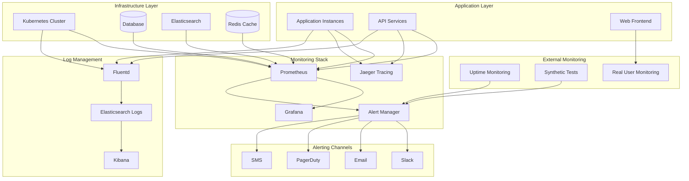

# Knowledge Base Search System - Monitoring & Maintenance Procedures

## Overview

This document outlines comprehensive monitoring and maintenance procedures for the knowledge base search system, ensuring optimal performance, reliability, and user experience through proactive monitoring, alerting, and systematic maintenance practices.

## Monitoring Architecture



## Monitoring Strategy

### 1. Application Performance Monitoring (APM)

```javascript
// Application metrics collection
class ApplicationMetrics {
  constructor() {
    this.prometheus = require('prom-client');
    this.register = new this.prometheus.Registry();
    this.setupMetrics();
  }
  
  setupMetrics() {
    // HTTP request metrics
    this.httpRequestDuration = new this.prometheus.Histogram({
      name: 'http_request_duration_seconds',
      help: 'Duration of HTTP requests in seconds',
      labelNames: ['method', 'route', 'status_code'],
      buckets: [0.1, 0.3, 0.5, 0.7, 1, 3, 5, 7, 10]
    });
    
    this.httpRequestTotal = new this.prometheus.Counter({
      name: 'http_requests_total',
      help: 'Total number of HTTP requests',
      labelNames: ['method', 'route', 'status_code']
    });
    
    // Search-specific metrics
    this.searchRequestDuration = new this.prometheus.Histogram({
      name: 'search_request_duration_seconds',
      help: 'Duration of search requests in seconds',
      labelNames: ['query_type', 'result_count_range'],
      buckets: [0.05, 0.1, 0.2, 0.5, 1, 2, 5]
    });
    
    this.searchRequestTotal = new this.prometheus.Counter({
      name: 'search_requests_total',
      help: 'Total number of search requests',
      labelNames: ['query_type', 'status']
    });
    
    // Database metrics
    this.dbQueryDuration = new this.prometheus.Histogram({
      name: 'db_query_duration_seconds',
      help: 'Duration of database queries in seconds',
      labelNames: ['query_type', 'table'],
      buckets: [0.01, 0.05, 0.1, 0.5, 1, 2, 5]
    });
    
    this.dbConnectionsActive = new this.prometheus.Gauge({
      name: 'db_connections_active',
      help: 'Number of active database connections'
    });
    
    // Cache metrics
    this.cacheHitTotal = new this.prometheus.Counter({
      name: 'cache_hits_total',
      help: 'Total number of cache hits',
      labelNames: ['cache_type']
    });
    
    this.cacheMissTotal = new this.prometheus.Counter({
      name: 'cache_misses_total',
      help: 'Total number of cache misses',
      labelNames: ['cache_type']
    });
    
    // Business metrics
    this.activeUsers = new this.prometheus.Gauge({
      name: 'active_users_total',
      help: 'Number of active users'
    });
    
    this.articlesIndexed = new this.prometheus.Gauge({
      name: 'articles_indexed_total',
      help: 'Total number of indexed articles'
    });
    
    // Register all metrics
    this.register.registerMetric(this.httpRequestDuration);
    this.register.registerMetric(this.httpRequestTotal);
    this.register.registerMetric(this.searchRequestDuration);
    this.register.registerMetric(this.searchRequestTotal);
    this.register.registerMetric(this.dbQueryDuration);
    this.register.registerMetric(this.dbConnectionsActive);
    this.register.registerMetric(this.cacheHitTotal);
    this.register.registerMetric(this.cacheMissTotal);
    this.register.registerMetric(this.activeUsers);
    this.register.registerMetric(this.articlesIndexed);
  }
  
  recordHttpRequest(method, route, statusCode, duration) {
    this.httpRequestDuration
      .labels(method, route, statusCode)
      .observe(duration);
    
    this.httpRequestTotal
      .labels(method, route, statusCode)
      .inc();
  }
  
  recordSearchRequest(queryType, resultCount, duration, status) {
    const resultCountRange = this.getResultCountRange(resultCount);
    
    this.searchRequestDuration
      .labels(queryType, resultCountRange)
      .observe(duration);
    
    this.searchRequestTotal
      .labels(queryType, status)
      .inc();
  }
  
  recordDatabaseQuery(queryType, table, duration) {
    this.dbQueryDuration
      .labels(queryType, table)
      .observe(duration);
  }
  
  recordCacheHit(cacheType) {
    this.cacheHitTotal.labels(cacheType).inc();
  }
  
  recordCacheMiss(cacheType) {
    this.cacheMissTotal.labels(cacheType).inc();
  }
  
  updateActiveUsers(count) {
    this.activeUsers.set(count);
  }
  
  updateArticlesIndexed(count) {
    this.articlesIndexed.set(count);
  }
  
  getResultCountRange(count) {
    if (count === 0) return '0';
    if (count <= 10) return '1-10';
    if (count <= 50) return '11-50';
    if (count <= 100) return '51-100';
    return '100+';
  }
  
  getMetrics() {
    return this.register.metrics();
  }
}
```

### 2. Infrastructure Monitoring

```yaml
# Prometheus configuration
global:
  scrape_interval: 15s
  evaluation_interval: 15s

rule_files:
  - "alert_rules.yml"

alerting:
  alertmanagers:
    - static_configs:
        - targets:
          - alertmanager:9093

scrape_configs:
  # Application metrics
  - job_name: 'kb-search-api'
    kubernetes_sd_configs:
      - role: endpoints
        namespaces:
          names:
            - knowledge-base
    relabel_configs:
      - source_labels: [__meta_kubernetes_service_name]
        action: keep
        regex: kb-search-api-service
      - source_labels: [__meta_kubernetes_endpoint_port_name]
        action: keep
        regex: metrics
    scrape_interval: 10s
    metrics_path: /metrics

  # Kubernetes cluster metrics
  - job_name: 'kubernetes-apiservers'
    kubernetes_sd_configs:
      - role: endpoints
    scheme: https
    tls_config:
      ca_file: /var/run/secrets/kubernetes.io/serviceaccount/ca.crt
    bearer_token_file: /var/run/secrets/kubernetes.io/serviceaccount/token
    relabel_configs:
      - source_labels: [__meta_kubernetes_namespace, __meta_kubernetes_service_name, __meta_kubernetes_endpoint_port_name]
        action: keep
        regex: default;kubernetes;https

  # Node metrics
  - job_name: 'kubernetes-nodes'
    kubernetes_sd_configs:
      - role: node
    scheme: https
    tls_config:
      ca_file: /var/run/secrets/kubernetes.io/serviceaccount/ca.crt
    bearer_token_file: /var/run/secrets/kubernetes.io/serviceaccount/token
    relabel_configs:
      - action: labelmap
        regex: __meta_kubernetes_node_label_(.+)

  # Pod metrics
  - job_name: 'kubernetes-pods'
    kubernetes_sd_configs:
      - role: pod
    relabel_configs:
      - source_labels: [__meta_kubernetes_pod_annotation_prometheus_io_scrape]
        action: keep
        regex: true
      - source_labels: [__meta_kubernetes_pod_annotation_prometheus_io_path]
        action: replace
        target_label: __metrics_path__
        regex: (.+)

  # Database metrics
  - job_name: 'postgresql'
    static_configs:
      - targets: ['postgres-exporter:9187']
    scrape_interval: 30s

  # Elasticsearch metrics
  - job_name: 'elasticsearch'
    static_configs:
      - targets: ['elasticsearch-exporter:9114']
    scrape_interval: 30s

  # Redis metrics
  - job_name: 'redis'
    static_configs:
      - targets: ['redis-exporter:9121']
    scrape_interval: 30s
```

### 3. Alert Rules Configuration

```yaml
# alert_rules.yml
groups:
  - name: application_alerts
    rules:
      - alert: HighResponseTime
        expr: histogram_quantile(0.95, rate(http_request_duration_seconds_bucket[5m])) > 0.5
        for: 2m
        labels:
          severity: warning
          team: backend
        annotations:
          summary: "High response time detected"
          description: "95th percentile response time is {{ $value }}s for {{ $labels.route }}"
          runbook_url: "https://wiki.company.com/runbooks/high-response-time"

      - alert: HighErrorRate
        expr: rate(http_requests_total{status_code=~"5.."}[5m]) / rate(http_requests_total[5m]) > 0.05
        for: 1m
        labels:
          severity: critical
          team: backend
        annotations:
          summary: "High error rate detected"
          description: "Error rate is {{ $value | humanizePercentage }} for {{ $labels.route }}"
          runbook_url: "https://wiki.company.com/runbooks/high-error-rate"

      - alert: SearchPerformanceDegraded
        expr: histogram_quantile(0.95, rate(search_request_duration_seconds_bucket[5m])) > 0.2
        for: 3m
        labels:
          severity: warning
          team: search
        annotations:
          summary: "Search performance degraded"
          description: "Search response time 95th percentile is {{ $value }}s"

      - alert: LowCacheHitRatio
        expr: rate(cache_hits_total[5m]) / (rate(cache_hits_total[5m]) + rate(cache_misses_total[5m])) < 0.8
        for: 5m
        labels:
          severity: warning
          team: backend
        annotations:
          summary: "Low cache hit ratio"
          description: "Cache hit ratio is {{ $value | humanizePercentage }} for {{ $labels.cache_type }}"

  - name: infrastructure_alerts
    rules:
      - alert: HighCPUUsage
        expr: 100 - (avg by(instance) (irate(node_cpu_seconds_total{mode="idle"}[5m])) * 100) > 80
        for: 5m
        labels:
          severity: warning
          team: infrastructure
        annotations:
          summary: "High CPU usage"
          description: "CPU usage is {{ $value }}% on {{ $labels.instance }}"

      - alert: HighMemoryUsage
        expr: (1 - (node_memory_MemAvailable_bytes / node_memory_MemTotal_bytes)) * 100 > 85
        for: 5m
        labels:
          severity: warning
          team: infrastructure
        annotations:
          summary: "High memory usage"
          description: "Memory usage is {{ $value }}% on {{ $labels.instance }}"

      - alert: DiskSpaceLow
        expr: (1 - (node_filesystem_avail_bytes / node_filesystem_size_bytes)) * 100 > 85
        for: 5m
        labels:
          severity: warning
          team: infrastructure
        annotations:
          summary: "Low disk space"
          description: "Disk usage is {{ $value }}% on {{ $labels.instance }} {{ $labels.mountpoint }}"

  - name: database_alerts
    rules:
      - alert: DatabaseConnectionsHigh
        expr: pg_stat_database_numbackends / pg_settings_max_connections > 0.8
        for: 5m
        labels:
          severity: warning
          team: database
        annotations:
          summary: "High database connections"
          description: "Database connections are at {{ $value | humanizePercentage }} of maximum"

      - alert: DatabaseSlowQueries
        expr: rate(pg_stat_database_tup_returned[5m]) / rate(pg_stat_database_tup_fetched[5m]) < 0.1
        for: 5m
        labels:
          severity: warning
          team: database
        annotations:
          summary: "Database slow queries detected"
          description: "Query efficiency is low: {{ $value | humanizePercentage }}"

  - name: elasticsearch_alerts
    rules:
      - alert: ElasticsearchClusterRed
        expr: elasticsearch_cluster_health_status{color="red"} == 1
        for: 1m
        labels:
          severity: critical
          team: search
        annotations:
          summary: "Elasticsearch cluster is red"
          description: "Elasticsearch cluster health is red"

      - alert: ElasticsearchHighJVMMemory
        expr: elasticsearch_jvm_memory_used_bytes / elasticsearch_jvm_memory_max_bytes > 0.9
        for: 5m
        labels:
          severity: warning
          team: search
        annotations:
          summary: "Elasticsearch high JVM memory usage"
          description: "JVM memory usage is {{ $value | humanizePercentage }}"
```

## Logging Strategy

### 1. Centralized Logging Configuration

```yaml
# Fluentd configuration
apiVersion: v1
kind: ConfigMap
metadata:
  name: fluentd-config
  namespace: kube-system
data:
  fluent.conf: |
    <source>
      @type tail
      @id in_tail_container_logs
      path /var/log/containers/*.log
      pos_file /var/log/fluentd-containers.log.pos
      tag kubernetes.*
      read_from_head true
      <parse>
        @type json
        time_format %Y-%m-%dT%H:%M:%S.%NZ
      </parse>
    </source>
    
    <filter kubernetes.**>
      @type kubernetes_metadata
      @id filter_kube_metadata
      kubernetes_url "#{ENV['FLUENT_FILTER_KUBERNETES_URL'] || 'https://' + ENV['KUBERNETES_SERVICE_HOST'] + ':' + ENV['KUBERNETES_SERVICE_PORT'] + '/api'}"
      verify_ssl "#{ENV['KUBERNETES_VERIFY_SSL'] || true}"
      ca_file "#{ENV['KUBERNETES_CA_FILE']}"
      skip_labels false
      skip_container_metadata false
      skip_master_url false
      skip_namespace_metadata false
    </filter>
    
    <filter kubernetes.**>
      @type parser
      key_name log
      reserve_data true
      remove_key_name_field true
      <parse>
        @type json
      </parse>
    </filter>
    
    <match kubernetes.var.log.containers.**kb-search-api**.log>
      @type elasticsearch
      @id out_es_kb_search_api
      host "#{ENV['FLUENT_ELASTICSEARCH_HOST'] || 'elasticsearch'}"
      port "#{ENV['FLUENT_ELASTICSEARCH_PORT'] || '9200'}"
      scheme "#{ENV['FLUENT_ELASTICSEARCH_SCHEME'] || 'http'}"
      ssl_verify "#{ENV['FLUENT_ELASTICSEARCH_SSL_VERIFY'] || 'true'}"
      index_name kb-search-api-logs
      type_name _doc
      include_timestamp true
      reconnect_on_error true
      reload_on_failure true
      reload_connections false
      <buffer>
        @type file
        path /var/log/fluentd-buffers/kb-search-api.buffer
        flush_mode interval
        retry_type exponential_backoff
        flush_thread_count 2
        flush_interval 5s
        retry_forever
        retry_max_interval 30
        chunk_limit_size 2M
        queue_limit_length 8
        overflow_action block
      </buffer>
    </match>
    
    <match kubernetes.**>
      @type elasticsearch
      @id out_es_kubernetes
      host "#{ENV['FLUENT_ELASTICSEARCH_HOST'] || 'elasticsearch'}"
      port "#{ENV['FLUENT_ELASTICSEARCH_PORT'] || '9200'}"
      scheme "#{ENV['FLUENT_ELASTICSEARCH_SCHEME'] || 'http'}"
      ssl_verify "#{ENV['FLUENT_ELASTICSEARCH_SSL_VERIFY'] || 'true'}"
      index_name kubernetes-logs
      type_name _doc
      include_timestamp true
      <buffer>
        @type file
        path /var/log/fluentd-buffers/kubernetes.buffer
        flush_mode interval
        retry_type exponential_backoff
        flush_thread_count 2
        flush_interval 5s
        retry_forever
        retry_max_interval 30
        chunk_limit_size 2M
        queue_limit_length 8
        overflow_action block
      </buffer>
    </match>
```

### 2. Application Logging Standards

```javascript
// Structured logging implementation
class Logger {
  constructor(service, version) {
    this.service = service;
    this.version = version;
    this.winston = require('winston');
    
    this.logger = this.winston.createLogger({
      level: process.env.LOG_LEVEL || 'info',
      format: this.winston.format.combine(
        this.winston.format.timestamp(),
        this.winston.format.errors({ stack: true }),
        this.winston.format.json(),
        this.winston.format.printf(this.formatMessage.bind(this))
      ),
      defaultMeta: {
        service: this.service,
        version: this.version,
        environment: process.env.NODE_ENV || 'development'
      },
      transports: [
        new this.winston.transports.Console(),
        new this.winston.transports.File({
          filename: '/var/log/app/error.log',
          level: 'error'
        }),
        new this.winston.transports.File({
          filename: '/var/log/app/combined.log'
        })
      ]
    });
  }
  
  formatMessage(info) {
    const {
      timestamp,
      level,
      message,
      service,
      version,
      environment,
      requestId,
      userId,
      ...meta
    } = info;
    
    return JSON.stringify({
      '@timestamp': timestamp,
      level: level.toUpperCase(),
      message,
      service,
      version,
      environment,
      request_id: requestId,
      user_id: userId,
      ...meta
    });
  }
  
  info(message, meta = {}) {
    this.logger.info(message, meta);
  }
  
  warn(message, meta = {}) {
    this.logger.warn(message, meta);
  }
  
  error(message, error = null, meta = {}) {
    const errorMeta = error ? {
      error: {
        name: error.name,
        message: error.message,
        stack: error.stack
      }
    } : {};
    
    this.logger.error(message, { ...errorMeta, ...meta });
  }
  
  debug(message, meta = {}) {
    this.logger.debug(message, meta);
  }
  
  // Search-specific logging methods
  logSearchRequest(query, filters, userId, requestId) {
    this.info('Search request', {
      event_type: 'search_request',
      query,
      filters,
      user_id: userId,
      request_id: requestId
    });
  }
  
  logSearchResponse(query, resultCount, duration, requestId) {
    this.info('Search response', {
      event_type: 'search_response',
      query,
      result_count: resultCount,
      duration_ms: duration,
      request_id: requestId
    });
  }
  
  logDatabaseQuery(query, duration, table, requestId) {
    this.debug('Database query', {
      event_type: 'database_query',
      query: query.substring(0, 100), // Truncate long queries
      duration_ms: duration,
      table,
      request_id: requestId
    });
  }
  
  logCacheOperation(operation, key, hit, duration, requestId) {
    this.debug('Cache operation', {
      event_type: 'cache_operation',
      operation,
      key,
      hit,
      duration_ms: duration,
      request_id: requestId
    });
  }
}
```

## Health Checks and Synthetic Monitoring

### 1. Application Health Checks

```javascript
// Comprehensive health check system
class HealthCheckService {
  constructor(dependencies) {
    this.dependencies = dependencies;
    this.checks = new Map();
    this.setupHealthChecks();
  }
  
  setupHealthChecks() {
    // Database health check
    this.addCheck('database', async () => {
      try {
        const result = await this.dependencies.database.query('SELECT 1');
        return {
          status: 'healthy',
          response_time: result.duration,
          details: 'Database connection successful'
        };
      } catch (error) {
        return {
          status: 'unhealthy',
          error: error.message,
          details: 'Database connection failed'
        };
      }
    });
    
    // Elasticsearch health check
    this.addCheck('elasticsearch', async () => {
      try {
        const response = await this.dependencies.elasticsearch.cluster.health();
        return {
          status: response.status === 'red' ? 'unhealthy' : 'healthy',
          cluster_status: response.status,
          active_shards: response.active_shards,
          details: `Cluster status: ${response.status}`
        };
      } catch (error) {
        return {
          status: 'unhealthy',
          error: error.message,
          details: 'Elasticsearch connection failed'
        };
      }
    });
    
    // Redis health check
    this.addCheck('redis', async () => {
      try {
        const start = Date.now();
        await this.dependencies.redis.ping();
        const duration = Date.now() - start;
        
        return {
          status: 'healthy',
          response_time: duration,
          details: 'Redis connection successful'
        };
      } catch (error) {
        return {
          status: 'unhealthy',
          error: error.message,
          details: 'Redis connection failed'
        };
      }
    });
    
    // Search functionality check
    this.addCheck('search', async () => {
      try {
        const start = Date.now();
        const result = await this.dependencies.searchService.search({
          query: 'test',
          size: 1
        });
        const duration = Date.now() - start;
        
        return {
          status: 'healthy',
          response_time: duration,
          result_count: result.total,
          details: 'Search functionality working'
        };
      } catch (error) {
        return {
          status: 'unhealthy',
          error: error.message,
          details: 'Search functionality failed'
        };
      }
    });
  }
  
  addCheck(name, checkFunction) {
    this.checks.set(name, checkFunction);
  }
  
  async runHealthCheck(checkName = null) {
    if (checkName) {
      const check = this.checks.get(checkName);
      if (!check) {
        throw new Error(`Health check '${checkName}' not found`);
      }
      
      return await check();
    }
    
    // Run all checks
    const results = {};
    const promises = Array.from(this.checks.entries()).map(async ([name, check]) => {
      try {
        const result = await Promise.race([
          check(),
          new Promise((_, reject) => 
            setTimeout(() => reject(new Error('Health check timeout')), 5000)
          )
        ]);
        results[name] = result;
      } catch (error) {
        results[name] = {
          status: 'unhealthy',
          error: error.message,
          details: 'Health check failed or timed out'
        };
      }
    });
    
    await Promise.all(promises);
    
    const overallStatus = Object.values(results).every(r => r.status === 'healthy') 
      ? 'healthy' 
      : 'unhealthy';
    
    return {
      status: overallStatus,
      timestamp: new Date().toISOString(),
      checks: results
    };
  }
  
  async getReadinessCheck() {
    // Readiness check - can the service handle requests?
    const criticalChecks = ['database', 'elasticsearch'];
    const results = {};
    
    for (const checkName of criticalChecks) {
      results[checkName] = await this.runHealthCheck(checkName);
    }
    
    const ready = Object.values(results).every(r => r.status === 'healthy');
    
    return {
      ready,
      timestamp: new Date().toISOString(),
      checks: results
    };
  }
  
  async getLivenessCheck() {
    // Liveness check - is the service alive?
    return {
      alive: true,
      timestamp: new Date().toISOString(),
      uptime: process.uptime(),
      memory_usage: process.memoryUsage()
    };
  }
}
```

### 2. Synthetic Monitoring

```javascript
// Synthetic monitoring tests
class SyntheticMonitoring {
  constructor(baseUrl) {
    this.baseUrl = baseUrl;
    this.tests = [];
    this.setupTests();
  }
  
  setupTests() {
    // Basic availability test
    this.addTest('homepage_availability', async () => {
      const response = await fetch(`${this.baseUrl}/`);
      return {
        success: response.ok,
        status_code: response.status,
        response_time: response.headers.get('x-response-time')
      };
    });
    
    // Search functionality test
    this.addTest('search_functionality', async () => {
      const start = Date.now();
      const response = await fetch(`${this.baseUrl}/api/v1/search?q=test`);
      const duration = Date.now() - start;
      
      if (!response.ok) {
        throw new Error(`Search API returned ${response.status}`);
      }
      
      const data = await response.json();
      
      return {
        success: true,
        response_time: duration,
        result_count: data.total,
        has_results: data.total > 0
      };
    });
    
    // User journey test
    this.addTest('user_journey', async () => {
      const steps = [];
      
      // Step 1: Load homepage
      let start = Date.now();
      let response = await fetch(`${this.baseUrl}/`);
      steps.push({
        step: 'homepage',
        success: response.ok,
        duration: Date.now() - start
      });
      
      // Step 2: Perform search
      start = Date.now();
      response = await fetch(`${this.baseUrl}/api/v1/search?q=authentication`);
      const searchData = await response.json();
      steps.push({
        step: 'search',
        success: response.ok && searchData.total > 0,
        duration: Date.now() - start,
        result_count: searchData.total
      });
      
      // Step 3: View article (if results exist)
      if (searchData.results && searchData.results.length > 0) {
        const articleId = searchData.results[0].id;
        start = Date.now();
        response = await fetch(`${this.baseUrl}/api/v1/articles/${articleId}`);
        steps.push({
          step: 'article_view',
          success: response.ok,
          duration: Date.now() - start
        });
      }
      
      return {
        success: steps.every(step => step.success),
        steps: steps,
        total_duration: steps.reduce((sum, step) => sum + step.duration, 0)
      };
    });
  }
  
  addTest(name, testFunction) {
    this.tests.push({ name, test: testFunction });
  }
  
  async runAllTests() {
    const results = [];
    
    for (const { name, test } of this.tests) {
      try {
        const start = Date.now();
        const result = await test();
        const duration = Date.now() - start;
        
        results.push({
          name,
          success: result.success,
          duration,
          details: result,
          timestamp: new Date().toISOString()
        });
      } catch (error) {
        results.push({
          name,
          success: false,
          error: error.message,
          timestamp: new Date().toISOString()
        });
      }
    }
    
    return {
      overall_success: results.every(r => r.success),
      test_count: results.length,
      passed_count: results.filter(r => r.success).length,
      results
    };
  }
}
```

## Maintenance Procedures

### 1. Routine Maintenance Tasks

```javascript
// Automated maintenance tasks
class MaintenanceScheduler {
  constructor(dependencies) {
    this.dependencies = dependencies;
    this.tasks = new Map();
    this.setupMaintenanceTasks();
  }
  
  setupMaintenanceTasks() {
    // Daily tasks
    this.scheduleTask('daily_
cleanup', '0 2 * * *', async () => {
      await this.cleanupOldLogs();
      await this.cleanupTempFiles();
      await this.optimizeDatabase();
    });
    
    // Weekly tasks
    this.scheduleTask('weekly_maintenance', '0 3 * * 0', async () => {
      await this.analyzePerformanceTrends();
      await this.updateSearchIndexes();
      await this.generateHealthReport();
    });
    
    // Monthly tasks
    this.scheduleTask('monthly_maintenance', '0 4 1 * *', async () => {
      await this.archiveOldData();
      await this.updateSecurityPatches();
      await this.reviewCapacityPlanning();
    });
  }
  
  scheduleTask(name, cronExpression, taskFunction) {
    const cron = require('node-cron');
    
    this.tasks.set(name, {
      name,
      schedule: cronExpression,
      task: taskFunction,
      lastRun: null,
      nextRun: null
    });
    
    cron.schedule(cronExpression, async () => {
      await this.executeTask(name);
    });
  }
  
  async executeTask(taskName) {
    const task = this.tasks.get(taskName);
    if (!task) {
      throw new Error(`Task ${taskName} not found`);
    }
    
    console.log(`Starting maintenance task: ${taskName}`);
    const startTime = Date.now();
    
    try {
      task.lastRun = new Date();
      await task.task();
      
      const duration = Date.now() - startTime;
      console.log(`Completed maintenance task: ${taskName} in ${duration}ms`);
      
      // Log successful completion
      this.dependencies.logger.info('Maintenance task completed', {
        task: taskName,
        duration,
        status: 'success'
      });
      
    } catch (error) {
      const duration = Date.now() - startTime;
      console.error(`Failed maintenance task: ${taskName}`, error);
      
      // Log failure
      this.dependencies.logger.error('Maintenance task failed', error, {
        task: taskName,
        duration,
        status: 'failed'
      });
      
      // Send alert for critical failures
      if (this.isCriticalTask(taskName)) {
        await this.dependencies.alertManager.sendAlert({
          type: 'maintenance_failure',
          severity: 'warning',
          task: taskName,
          error: error.message
        });
      }
    }
  }
  
  async cleanupOldLogs() {
    // Clean up application logs older than 30 days
    const cutoffDate = new Date();
    cutoffDate.setDate(cutoffDate.getDate() - 30);
    
    // Clean up Elasticsearch logs
    await this.dependencies.elasticsearch.indices.delete({
      index: `kb-search-api-logs-${cutoffDate.toISOString().slice(0, 7)}*`,
      ignore_unavailable: true
    });
    
    // Clean up file system logs
    const fs = require('fs').promises;
    const path = require('path');
    const logDir = '/var/log/app';
    
    try {
      const files = await fs.readdir(logDir);
      for (const file of files) {
        const filePath = path.join(logDir, file);
        const stats = await fs.stat(filePath);
        
        if (stats.mtime < cutoffDate) {
          await fs.unlink(filePath);
          console.log(`Deleted old log file: ${file}`);
        }
      }
    } catch (error) {
      console.error('Error cleaning up log files:', error);
    }
  }
  
  async cleanupTempFiles() {
    // Clean up temporary files and caches
    const fs = require('fs').promises;
    const tempDirs = ['/tmp', '/var/tmp/app'];
    
    for (const dir of tempDirs) {
      try {
        const files = await fs.readdir(dir);
        const cutoffTime = Date.now() - (24 * 60 * 60 * 1000); // 24 hours ago
        
        for (const file of files) {
          const filePath = path.join(dir, file);
          const stats = await fs.stat(filePath);
          
          if (stats.mtime.getTime() < cutoffTime) {
            await fs.unlink(filePath);
          }
        }
      } catch (error) {
        console.error(`Error cleaning up ${dir}:`, error);
      }
    }
  }
  
  async optimizeDatabase() {
    // Run database maintenance tasks
    try {
      // Update table statistics
      await this.dependencies.database.query('ANALYZE;');
      
      // Vacuum tables to reclaim space
      await this.dependencies.database.query('VACUUM ANALYZE articles;');
      await this.dependencies.database.query('VACUUM ANALYZE search_analytics;');
      
      // Reindex if needed
      await this.dependencies.database.query('REINDEX INDEX CONCURRENTLY idx_articles_search_vector;');
      
      console.log('Database optimization completed');
    } catch (error) {
      console.error('Database optimization failed:', error);
      throw error;
    }
  }
  
  async updateSearchIndexes() {
    // Optimize Elasticsearch indexes
    try {
      // Force merge to optimize segments
      await this.dependencies.elasticsearch.indices.forcemerge({
        index: 'kb-articles',
        max_num_segments: 1
      });
      
      // Update index settings for better performance
      await this.dependencies.elasticsearch.indices.putSettings({
        index: 'kb-articles',
        body: {
          refresh_interval: '30s',
          number_of_replicas: 1
        }
      });
      
      console.log('Search index optimization completed');
    } catch (error) {
      console.error('Search index optimization failed:', error);
      throw error;
    }
  }
  
  async archiveOldData() {
    // Archive old analytics data
    const archiveDate = new Date();
    archiveDate.setMonth(archiveDate.getMonth() - 12); // 12 months ago
    
    try {
      // Move old search analytics to archive table
      await this.dependencies.database.query(`
        INSERT INTO search_analytics_archive 
        SELECT * FROM search_analytics 
        WHERE created_at < $1
      `, [archiveDate]);
      
      // Delete archived data from main table
      const result = await this.dependencies.database.query(`
        DELETE FROM search_analytics 
        WHERE created_at < $1
      `, [archiveDate]);
      
      console.log(`Archived ${result.rowCount} search analytics records`);
    } catch (error) {
      console.error('Data archiving failed:', error);
      throw error;
    }
  }
  
  isCriticalTask(taskName) {
    const criticalTasks = ['daily_cleanup', 'weekly_maintenance'];
    return criticalTasks.includes(taskName);
  }
}
```

### 2. Incident Response Procedures

```markdown
# Incident Response Playbook

## Incident Classification

### Severity Levels
- **P0 (Critical)**: Complete service outage, data loss, security breach
- **P1 (High)**: Major functionality impaired, significant user impact
- **P2 (Medium)**: Minor functionality issues, limited user impact
- **P3 (Low)**: Cosmetic issues, no user impact

### Response Times
- **P0**: Immediate response (< 15 minutes)
- **P1**: 1 hour response
- **P2**: 4 hour response
- **P3**: Next business day

## Common Incident Scenarios

### 1. High Response Time (P1)
**Symptoms**: API response times > 500ms, user complaints about slow search

**Investigation Steps**:
1. Check application metrics in Grafana
2. Verify database performance
3. Check Elasticsearch cluster health
4. Review recent deployments
5. Analyze error logs

**Resolution Actions**:
1. Scale up application instances if CPU/memory high
2. Restart unhealthy pods
3. Clear caches if stale data suspected
4. Rollback recent deployment if identified as cause

### 2. Search Functionality Down (P0)
**Symptoms**: Search returns errors, Elasticsearch cluster red status

**Investigation Steps**:
1. Check Elasticsearch cluster status
2. Verify node health and disk space
3. Review Elasticsearch logs
4. Check network connectivity

**Resolution Actions**:
1. Restart failed Elasticsearch nodes
2. Restore from backup if data corruption
3. Scale cluster if resource constraints
4. Fix network issues if connectivity problems

### 3. Database Connection Issues (P0)
**Symptoms**: Database connection errors, high connection count

**Investigation Steps**:
1. Check database server health
2. Monitor connection pool metrics
3. Review database logs
4. Check network connectivity

**Resolution Actions**:
1. Restart application to reset connections
2. Scale database if resource constraints
3. Increase connection pool limits if needed
4. Failover to read replica if primary down

### 4. High Error Rate (P1)
**Symptoms**: HTTP 5xx errors > 5%, application exceptions

**Investigation Steps**:
1. Review application error logs
2. Check recent code deployments
3. Verify external service dependencies
4. Monitor resource utilization

**Resolution Actions**:
1. Rollback recent deployment if identified
2. Fix configuration issues
3. Scale resources if capacity issues
4. Implement circuit breaker for failing dependencies
```

### 3. Capacity Planning

```javascript
// Capacity planning and forecasting
class CapacityPlanner {
  constructor(metricsCollector) {
    this.metrics = metricsCollector;
    this.forecasts = new Map();
  }
  
  async generateCapacityReport() {
    const report = {
      timestamp: new Date().toISOString(),
      current_usage: await this.getCurrentUsage(),
      trends: await this.analyzeTrends(),
      forecasts: await this.generateForecasts(),
      recommendations: await this.generateRecommendations()
    };
    
    return report;
  }
  
  async getCurrentUsage() {
    const now = Date.now();
    const oneHourAgo = now - (60 * 60 * 1000);
    
    return {
      cpu: await this.metrics.getAverageMetric('cpu_usage', oneHourAgo, now),
      memory: await this.metrics.getAverageMetric('memory_usage', oneHourAgo, now),
      disk: await this.metrics.getAverageMetric('disk_usage', oneHourAgo, now),
      network: await this.metrics.getAverageMetric('network_usage', oneHourAgo, now),
      requests_per_second: await this.metrics.getAverageMetric('requests_per_second', oneHourAgo, now),
      database_connections: await this.metrics.getAverageMetric('db_connections_active', oneHourAgo, now)
    };
  }
  
  async analyzeTrends() {
    const periods = [
      { name: '24h', duration: 24 * 60 * 60 * 1000 },
      { name: '7d', duration: 7 * 24 * 60 * 60 * 1000 },
      { name: '30d', duration: 30 * 24 * 60 * 60 * 1000 }
    ];
    
    const trends = {};
    
    for (const period of periods) {
      const endTime = Date.now();
      const startTime = endTime - period.duration;
      
      trends[period.name] = {
        cpu_trend: await this.calculateTrend('cpu_usage', startTime, endTime),
        memory_trend: await this.calculateTrend('memory_usage', startTime, endTime),
        request_trend: await this.calculateTrend('requests_per_second', startTime, endTime),
        search_trend: await this.calculateTrend('search_requests_per_second', startTime, endTime)
      };
    }
    
    return trends;
  }
  
  async calculateTrend(metric, startTime, endTime) {
    const dataPoints = await this.metrics.getMetricTimeSeries(metric, startTime, endTime);
    
    if (dataPoints.length < 2) {
      return { trend: 'insufficient_data', slope: 0 };
    }
    
    // Simple linear regression to calculate trend
    const n = dataPoints.length;
    const sumX = dataPoints.reduce((sum, point, index) => sum + index, 0);
    const sumY = dataPoints.reduce((sum, point) => sum + point.value, 0);
    const sumXY = dataPoints.reduce((sum, point, index) => sum + (index * point.value), 0);
    const sumXX = dataPoints.reduce((sum, point, index) => sum + (index * index), 0);
    
    const slope = (n * sumXY - sumX * sumY) / (n * sumXX - sumX * sumX);
    const intercept = (sumY - slope * sumX) / n;
    
    let trendDirection;
    if (Math.abs(slope) < 0.01) {
      trendDirection = 'stable';
    } else if (slope > 0) {
      trendDirection = 'increasing';
    } else {
      trendDirection = 'decreasing';
    }
    
    return {
      trend: trendDirection,
      slope: slope,
      intercept: intercept,
      correlation: this.calculateCorrelation(dataPoints)
    };
  }
  
  async generateForecasts() {
    const forecastPeriods = [
      { name: '1_week', days: 7 },
      { name: '1_month', days: 30 },
      { name: '3_months', days: 90 }
    ];
    
    const forecasts = {};
    
    for (const period of forecastPeriods) {
      forecasts[period.name] = {
        cpu_forecast: await this.forecastMetric('cpu_usage', period.days),
        memory_forecast: await this.forecastMetric('memory_usage', period.days),
        request_forecast: await this.forecastMetric('requests_per_second', period.days),
        storage_forecast: await this.forecastMetric('disk_usage', period.days)
      };
    }
    
    return forecasts;
  }
  
  async forecastMetric(metric, days) {
    const endTime = Date.now();
    const startTime = endTime - (30 * 24 * 60 * 60 * 1000); // Use 30 days of historical data
    
    const trend = await this.calculateTrend(metric, startTime, endTime);
    const currentValue = await this.metrics.getLatestMetric(metric);
    
    // Simple linear extrapolation
    const forecastValue = currentValue + (trend.slope * days);
    
    return {
      current_value: currentValue,
      forecast_value: Math.max(0, forecastValue), // Ensure non-negative
      confidence: this.calculateConfidence(trend.correlation),
      trend_direction: trend.trend
    };
  }
  
  async generateRecommendations() {
    const usage = await this.getCurrentUsage();
    const forecasts = await this.generateForecasts();
    const recommendations = [];
    
    // CPU recommendations
    if (usage.cpu > 80 || forecasts['1_month'].cpu_forecast.forecast_value > 80) {
      recommendations.push({
        type: 'scale_up',
        resource: 'cpu',
        priority: 'high',
        description: 'CPU usage is high or trending upward. Consider scaling up instances.',
        action: 'Increase CPU limits or add more replicas'
      });
    }
    
    // Memory recommendations
    if (usage.memory > 85 || forecasts['1_month'].memory_forecast.forecast_value > 85) {
      recommendations.push({
        type: 'scale_up',
        resource: 'memory',
        priority: 'high',
        description: 'Memory usage is high or trending upward. Consider increasing memory limits.',
        action: 'Increase memory limits or optimize memory usage'
      });
    }
    
    // Storage recommendations
    if (usage.disk > 80 || forecasts['3_months'].storage_forecast.forecast_value > 80) {
      recommendations.push({
        type: 'storage_expansion',
        resource: 'disk',
        priority: 'medium',
        description: 'Disk usage is high or will be high in 3 months. Plan for storage expansion.',
        action: 'Increase disk size or implement data archiving'
      });
    }
    
    // Database recommendations
    if (usage.database_connections > 80) {
      recommendations.push({
        type: 'database_optimization',
        resource: 'database',
        priority: 'medium',
        description: 'Database connection usage is high. Consider optimizing connection pooling.',
        action: 'Increase connection pool size or optimize query performance'
      });
    }
    
    return recommendations;
  }
  
  calculateConfidence(correlation) {
    const absCorrelation = Math.abs(correlation);
    if (absCorrelation > 0.8) return 'high';
    if (absCorrelation > 0.5) return 'medium';
    return 'low';
  }
  
  calculateCorrelation(dataPoints) {
    if (dataPoints.length < 2) return 0;
    
    const n = dataPoints.length;
    const xValues = dataPoints.map((_, index) => index);
    const yValues = dataPoints.map(point => point.value);
    
    const meanX = xValues.reduce((sum, x) => sum + x, 0) / n;
    const meanY = yValues.reduce((sum, y) => sum + y, 0) / n;
    
    const numerator = xValues.reduce((sum, x, i) => 
      sum + (x - meanX) * (yValues[i] - meanY), 0
    );
    
    const denomX = Math.sqrt(xValues.reduce((sum, x) => 
      sum + Math.pow(x - meanX, 2), 0
    ));
    
    const denomY = Math.sqrt(yValues.reduce((sum, y) => 
      sum + Math.pow(y - meanY, 2), 0
    ));
    
    return denomX * denomY === 0 ? 0 : numerator / (denomX * denomY);
  }
}
```

## Maintenance Schedule

### Daily Tasks (Automated)
- [ ] Log rotation and cleanup
- [ ] Temporary file cleanup
- [ ] Health check validation
- [ ] Backup verification
- [ ] Security scan results review

### Weekly Tasks (Automated + Manual Review)
- [ ] Performance trend analysis
- [ ] Search index optimization
- [ ] Database maintenance (VACUUM, ANALYZE)
- [ ] Security patch review
- [ ] Capacity utilization review

### Monthly Tasks (Manual)
- [ ] Comprehensive security audit
- [ ] Disaster recovery testing
- [ ] Capacity planning review
- [ ] Performance benchmark testing
- [ ] Documentation updates
- [ ] Dependency updates review

### Quarterly Tasks (Manual)
- [ ] Architecture review
- [ ] Security penetration testing
- [ ] Business continuity plan review
- [ ] Technology stack evaluation
- [ ] Performance optimization review

## Monitoring Dashboard Configuration

### Executive Dashboard
- System availability (99.9% SLA)
- User satisfaction metrics
- Business KPIs (searches per day, active users)
- Cost optimization metrics

### Operations Dashboard
- Infrastructure health (CPU, memory, disk, network)
- Application performance (response times, error rates)
- Database performance (query times, connection pools)
- Search performance (search times, index health)

### Development Dashboard
- Deployment metrics (frequency, success rate)
- Code quality metrics (test coverage, code complexity)
- Performance regression tracking
- Error tracking and resolution times

This comprehensive monitoring and maintenance strategy ensures the knowledge base search system operates reliably, performs optimally, and scales effectively to meet growing demands while maintaining security and compliance standards.