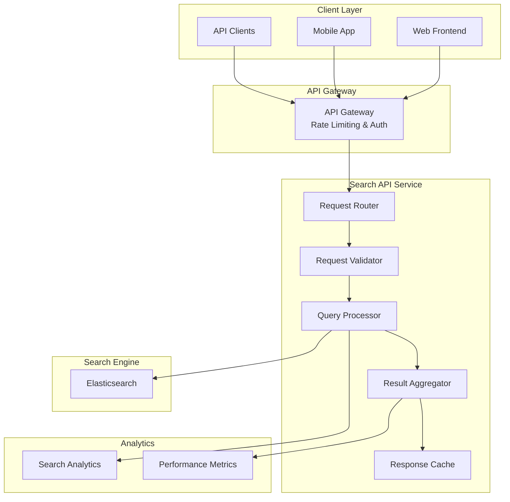
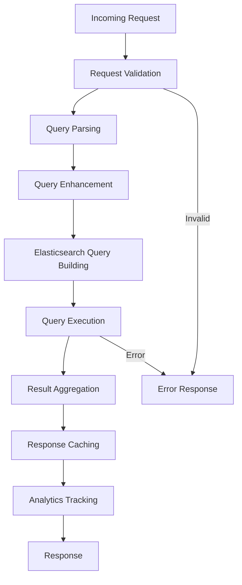

# Knowledge Base Search System - API Design & Query Processing

## API Overview

The Search API provides a comprehensive interface for searching knowledge base articles with advanced filtering, faceted navigation, and analytics tracking.

## API Architecture



## API Endpoints

### 1. Search Endpoints

#### Basic Search
```http
GET /api/v1/search?q={query}&page={page}&size={size}
```

**Parameters:**
- `q` (string, required): Search query
- `page` (integer, optional, default=1): Page number
- `size` (integer, optional, default=20, max=100): Results per page
- `sort` (string, optional, default=relevance): Sort order

**Response:**
```json
{
  "query": "user authentication",
  "total": 156,
  "page": 1,
  "size": 20,
  "took": 45,
  "results": [
    {
      "id": "uuid-123",
      "title": "User Authentication Guide",
      "summary": "Complete guide to user authentication...",
      "url": "/articles/user-authentication-guide",
      "score": 8.5,
      "highlight": {
        "title": ["<em>User</em> <em>Authentication</em> Guide"],
        "content": ["...implement <em>user</em> <em>authentication</em>..."]
      },
      "metadata": {
        "author": "John Doe",
        "category": "Security",
        "tags": ["authentication", "security", "login"],
        "published_at": "2024-01-15T10:30:00Z",
        "view_count": 1250,
        "like_count": 45
      }
    }
  ],
  "facets": {
    "categories": [
      {"name": "Security", "count": 45},
      {"name": "Development", "count": 32}
    ],
    "authors": [
      {"name": "John Doe", "count": 12},
      {"name": "Jane Smith", "count": 8}
    ],
    "tags": [
      {"name": "authentication", "count": 25},
      {"name": "security", "count": 20}
    ]
  },
  "suggestions": [
    "user authentication methods",
    "user authorization",
    "authentication best practices"
  ]
}
```

#### Advanced Search
```http
POST /api/v1/search/advanced
```

**Request Body:**
```json
{
  "query": {
    "text": "user authentication",
    "fields": ["title^2", "content", "summary^1.5"],
    "operator": "AND"
  },
  "filters": {
    "categories": ["security", "development"],
    "authors": ["john-doe"],
    "tags": ["authentication"],
    "date_range": {
      "from": "2024-01-01",
      "to": "2024-12-31"
    },
    "status": ["published"],
    "visibility": ["internal"]
  },
  "sort": [
    {"field": "score", "order": "desc"},
    {"field": "published_at", "order": "desc"}
  ],
  "pagination": {
    "page": 1,
    "size": 20
  },
  "highlight": {
    "enabled": true,
    "fields": ["title", "content", "summary"],
    "fragment_size": 150,
    "number_of_fragments": 3
  },
  "facets": {
    "categories": {"size": 10},
    "authors": {"size": 10},
    "tags": {"size": 20},
    "date_histogram": {
      "field": "published_at",
      "interval": "month"
    }
  }
}
```

### 2. Suggestion Endpoints

#### Auto-complete
```http
GET /api/v1/search/suggest?q={partial_query}&size={size}
```

**Response:**
```json
{
  "suggestions": [
    {
      "text": "user authentication",
      "score": 8.5,
      "type": "completion"
    },
    {
      "text": "user authorization",
      "score": 7.2,
      "type": "completion"
    }
  ]
}
```

#### Search Suggestions
```http
GET /api/v1/search/suggestions?q={query}
```

**Response:**
```json
{
  "query": "user auth",
  "suggestions": {
    "spell_check": [
      "user authentication"
    ],
    "related_queries": [
      "user authentication methods",
      "user authorization guide",
      "authentication best practices"
    ],
    "popular_searches": [
      "user login process",
      "password reset guide"
    ]
  }
}
```

### 3. Facet Endpoints

#### Get Available Facets
```http
GET /api/v1/search/facets
```

**Response:**
```json
{
  "facets": {
    "categories": {
      "type": "terms",
      "field": "category.keyword",
      "display_name": "Categories",
      "values": [
        {"key": "security", "doc_count": 156, "display_name": "Security"},
        {"key": "development", "doc_count": 142, "display_name": "Development"}
      ]
    },
    "authors": {
      "type": "terms",
      "field": "author.keyword",
      "display_name": "Authors",
      "values": [
        {"key": "john-doe", "doc_count": 45, "display_name": "John Doe"},
        {"key": "jane-smith", "doc_count": 32, "display_name": "Jane Smith"}
      ]
    },
    "date_ranges": {
      "type": "date_range",
      "field": "published_at",
      "display_name": "Publication Date",
      "ranges": [
        {"key": "last_week", "from": "now-7d", "doc_count": 12},
        {"key": "last_month", "from": "now-30d", "doc_count": 45},
        {"key": "last_year", "from": "now-365d", "doc_count": 234}
      ]
    }
  }
}
```

## Query Processing Pipeline

### 1. Request Processing Flow



### 2. Query Processing Implementation

```javascript
class SearchQueryProcessor {
    async processSearchRequest(request) {
        // 1. Validate request
        const validation = await this.validateRequest(request);
        if (!validation.isValid) {
            throw new ValidationError(validation.errors);
        }
        
        // 2. Parse and enhance query
        const parsedQuery = this.parseQuery(request.query);
        const enhancedQuery = await this.enhanceQuery(parsedQuery, request);
        
        // 3. Build Elasticsearch query
        const esQuery = this.buildElasticsearchQuery(enhancedQuery, request);
        
        // 4. Execute search
        const searchResult = await this.executeSearch(esQuery);
        
        // 5. Process and aggregate results
        const processedResults = await this.processResults(searchResult, request);
        
        // 6. Track analytics
        await this.trackSearchAnalytics(request, processedResults);
        
        return processedResults;
    }
    
    parseQuery(queryString) {
        // Handle different query types
        if (this.isPhrasedQuery(queryString)) {
            return {
                type: 'phrase',
                text: queryString.replace(/"/g, ''),
                boost: 2.0
            };
        }
        
        if (this.isBooleanQuery(queryString)) {
            return {
                type: 'boolean',
                clauses: this.parseBooleanClauses(queryString)
            };
        }
        
        return {
            type: 'simple',
            text: queryString,
            boost: 1.0
        };
    }
    
    async enhanceQuery(parsedQuery, request) {
        const enhanced = { ...parsedQuery };
        
        // Add spell correction
        if (parsedQuery.type === 'simple') {
            const corrected = await this.spellCheck(parsedQuery.text);
            if (corrected !== parsedQuery.text) {
                enhanced.corrected = corrected;
                enhanced.shouldSuggestCorrection = true;
            }
        }
        
        // Add synonyms
        enhanced.synonyms = await this.getSynonyms(parsedQuery.text);
        
        // Add user context
        if (request.user) {
            enhanced.userContext = {
                department: request.user.department,
                role: request.user.role,
                preferences: await this.getUserPreferences(request.user.id)
            };
        }
        
        return enhanced;
    }
    
    buildElasticsearchQuery(enhancedQuery, request) {
        const query = {
            index: 'kb-articles',
            body: {
                query: this.buildMainQuery(enhancedQuery),
                highlight: this.buildHighlightConfig(request.highlight),
                aggs: this.buildAggregations(request.facets),
                sort: this.buildSortConfig(request.sort),
                from: (request.page - 1) * request.size,
                size: request.size
            }
        };
        
        // Add filters
        if (request.filters) {
            query.body.post_filter = this.buildFilters(request.filters);
        }
        
        return query;
    }
    
    buildMainQuery(enhancedQuery) {
        switch (enhancedQuery.type) {
            case 'phrase':
                return {
                    bool: {
                        should: [
                            {
                                multi_match: {
                                    query: enhancedQuery.text,
                                    type: 'phrase',
                                    fields: ['title^3', 'summary^2', 'content'],
                                    boost: enhancedQuery.boost
                                }
                            }
                        ]
                    }
                };
                
            case 'boolean':
                return this.buildBooleanQuery(enhancedQuery.clauses);
                
            default:
                return {
                    bool: {
                        should: [
                            // Exact phrase match (highest priority)
                            {
                                multi_match: {
                                    query: enhancedQuery.text,
                                    type: 'phrase',
                                    fields: ['title^4', 'summary^3'],
                                    boost: 3.0
                                }
                            },
                            // Cross-field match
                            {
                                multi_match: {
                                    query: enhancedQuery.text,
                                    type: 'cross_fields',
                                    fields: ['title^2', 'summary^1.5', 'content'],
                                    boost: 2.0
                                }
                            },
                            // Fuzzy match for typos
                            {
                                multi_match: {
                                    query: enhancedQuery.text,
                                    type: 'best_fields',
                                    fields: ['title', 'summary', 'content'],
                                    fuzziness: 'AUTO',
                                    boost: 1.0
                                }
                            }
                        ],
                        // Boost popular and recent content
                        should: [
                            {
                                function_score: {
                                    field_value_factor: {
                                        field: 'popularity_score',
                                        factor: 1.2,
                                        modifier: 'log1p'
                                    }
                                }
                            },
                            {
                                function_score: {
                                    field_value_factor: {
                                        field: 'freshness_score',
                                        factor: 1.1,
                                        modifier: 'log1p'
                                    }
                                }
                            }
                        ]
                    }
                };
        }
    }
}
```

### 3. Result Processing

```javascript
class SearchResultProcessor {
    async processResults(esResponse, request) {
        const results = {
            query: request.query,
            total: esResponse.hits.total.value,
            took: esResponse.took,
            page: request.page,
            size: request.size,
            results: [],
            facets: {},
            suggestions: []
        };
        
        // Process search hits
        results.results = await Promise.all(
            esResponse.hits.hits.map(hit => this.processHit(hit, request))
        );
        
        // Process aggregations (facets)
        if (esResponse.aggregations) {
            results.facets = this.processAggregations(esResponse.aggregations);
        }
        
        // Generate suggestions
        if (results.total === 0 || request.query.length < 3) {
            results.suggestions = await this.generateSuggestions(request.query);
        }
        
        return results;
    }
    
    async processHit(hit, request) {
        const source = hit._source;
        
        return {
            id: source.id,
            title: source.title,
            summary: source.summary || this.generateSummary(source.content),
            url: `/articles/${source.slug}`,
            score: hit._score,
            highlight: hit.highlight || {},
            metadata: {
                author: source.author.name,
                category: source.category.name,
                tags: source.tags,
                published_at: source.published_at,
                view_count: source.view_count,
                like_count: source.like_count
            }
        };
    }
    
    processAggregations(aggregations) {
        const facets = {};
        
        Object.keys(aggregations).forEach(key => {
            const agg = aggregations[key];
            
            if (agg.buckets) {
                facets[key] = agg.buckets.map(bucket => ({
                    name: bucket.key,
                    count: bucket.doc_count,
                    selected: false // Will be set based on current filters
                }));
            }
        });
        
        return facets;
    }
}
```

## Performance Optimization

### 1. Caching Strategy

```javascript
class SearchCache {
    constructor(redisClient) {
        this.redis = redisClient;
        this.defaultTTL = 300; // 5 minutes
    }
    
    async getCachedResult(cacheKey) {
        const cached = await this.redis.get(cacheKey);
        return cached ? JSON.parse(cached) : null;
    }
    
    async setCachedResult(cacheKey, result, ttl = this.defaultTTL) {
        await this.redis.setex(cacheKey, ttl, JSON.stringify(result));
    }
    
    generateCacheKey(request) {
        const keyData = {
            query: request.query,
            filters: request.filters,
            sort: request.sort,
            page: request.page,
            size: request.size
        };
        
        return `search:${this.hashObject(keyData)}`;
    }
    
    hashObject(obj) {
        return crypto
            .createHash('md5')
            .update(JSON.stringify(obj))
            .digest('hex');
    }
}
```

### 2. Query Optimization

- **Field Boosting**: Prioritize title and summary fields
- **Query Rewriting**: Optimize complex queries
- **Index Warming**: Pre-load frequently accessed data
- **Result Caching**: Cache search results with appropriate TTL

### 3. Rate Limiting

```javascript
class RateLimiter {
    constructor(redisClient) {
        this.redis = redisClient;
    }
    
    async checkRateLimit(userId, endpoint) {
        const key = `rate_limit:${userId}:${endpoint}`;
        const current = await this.redis.incr(key);
        
        if (current === 1) {
            await this.redis.expire(key, 60); // 1 minute window
        }
        
        const limit = this.getLimitForEndpoint(endpoint);
        
        if (current > limit) {
            throw new RateLimitError(`Rate limit exceeded: ${current}/${limit}`);
        }
        
        return {
            current,
            limit,
            remaining: limit - current,
            resetTime: await this.redis.ttl(key)
        };
    }
    
    getLimitForEndpoint(endpoint) {
        const limits = {
            '/api/v1/search': 100,
            '/api/v1/search/advanced': 50,
            '/api/v1/search/suggest': 200
        };
        
        return limits[endpoint] || 60;
    }
}
```

## Error Handling

### Error Response Format
```json
{
  "error": {
    "code": "SEARCH_ERROR",
    "message": "Search request failed",
    "details": {
      "query": "user authentication",
      "reason": "Invalid query syntax"
    },
    "timestamp": "2024-01-15T10:30:00Z",
    "request_id": "req-123456"
  }
}
```

### Common Error Codes
- `INVALID_QUERY`: Malformed search query
- `RATE_LIMIT_EXCEEDED`: Too many requests
- `SEARCH_TIMEOUT`: Search took too long
- `INDEX_UNAVAILABLE`: Search index is down
- `INSUFFICIENT_PERMISSIONS`: User lacks access rights

## API Documentation

### OpenAPI Specification
```yaml
openapi: 3.0.0
info:
  title: Knowledge Base Search API
  version: 1.0.0
  description: API for searching knowledge base articles

paths:
  /api/v1/search:
    get:
      summary: Basic search
      parameters:
        - name: q
          in: query
          required: true
          schema:
            type: string
          description: Search query
        - name: page
          in: query
          schema:
            type: integer
            default: 1
          description: Page number
        - name: size
          in: query
          schema:
            type: integer
            default: 20
            maximum: 100
          description: Results per page
      responses:
        '200':
          description: Search results
          content:
            application/json:
              schema:
                $ref: '#/components/schemas/SearchResponse'
```

This comprehensive API design provides a robust foundation for the knowledge base search system with advanced querying capabilities, performance optimization, and proper error handling.