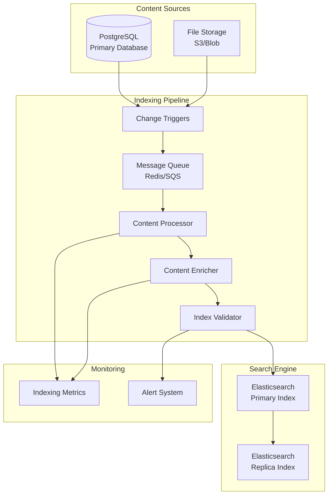

# Knowledge Base Search System - Indexing Strategy

## Overview

The search indexing strategy defines how content is processed, indexed, and optimized for search performance. This strategy ensures fast, relevant search results while maintaining data consistency and system performance.

## Indexing Architecture



## Indexing Strategy Components

### 1. Real-time Indexing

#### Database Triggers
```sql
-- PostgreSQL trigger for real-time indexing
CREATE OR REPLACE FUNCTION notify_article_change()
RETURNS TRIGGER AS $$
BEGIN
    IF TG_OP = 'INSERT' OR TG_OP = 'UPDATE' THEN
        PERFORM pg_notify('article_changed', 
            json_build_object(
                'operation', TG_OP,
                'article_id', NEW.id,
                'status', NEW.status
            )::text
        );
        RETURN NEW;
    ELSIF TG_OP = 'DELETE' THEN
        PERFORM pg_notify('article_changed',
            json_build_object(
                'operation', TG_OP,
                'article_id', OLD.id
            )::text
        );
        RETURN OLD;
    END IF;
    RETURN NULL;
END;
$$ LANGUAGE plpgsql;

CREATE TRIGGER article_change_trigger
    AFTER INSERT OR UPDATE OR DELETE ON articles
    FOR EACH ROW EXECUTE FUNCTION notify_article_change();
```

#### Change Detection System
- **Database Listeners**: Monitor PostgreSQL notifications
- **File Watchers**: Detect file system changes
- **API Hooks**: Capture changes via API endpoints
- **Batch Processors**: Handle bulk operations

### 2. Content Processing Pipeline

#### Stage 1: Content Extraction
```javascript
// Content extraction example
class ContentExtractor {
    async extractContent(article) {
        const extracted = {
            id: article.id,
            title: this.cleanText(article.title),
            content: this.extractTextContent(article.content),
            summary: this.generateSummary(article.content),
            metadata: await this.extractMetadata(article)
        };
        
        // Extract text from attachments
        if (article.attachments) {
            extracted.attachmentText = await this.extractAttachmentText(
                article.attachments
            );
        }
        
        return extracted;
    }
    
    cleanText(text) {
        return text
            .replace(/<[^>]*>/g, '') // Remove HTML tags
            .replace(/\s+/g, ' ')    // Normalize whitespace
            .trim();
    }
    
    async extractAttachmentText(attachments) {
        const textContent = [];
        
        for (const attachment of attachments) {
            if (attachment.mime_type === 'application/pdf') {
                textContent.push(await this.extractPdfText(attachment));
            } else if (attachment.mime_type.startsWith('text/')) {
                textContent.push(await this.extractPlainText(attachment));
            }
        }
        
        return textContent.join(' ');
    }
}
```

#### Stage 2: Content Enrichment
```javascript
class ContentEnricher {
    async enrichContent(extractedContent) {
        const enriched = {
            ...extractedContent,
            
            // Add search-optimized fields
            searchableText: this.createSearchableText(extractedContent),
            keywords: await this.extractKeywords(extractedContent.content),
            readingTime: this.calculateReadingTime(extractedContent.content),
            
            // Add scoring factors
            popularityScore: await this.calculatePopularityScore(extractedContent.id),
            freshnessScore: this.calculateFreshnessScore(extractedContent.updated_at),
            qualityScore: this.calculateQualityScore(extractedContent),
            
            // Add suggestions
            titleSuggest: this.createSuggestions(extractedContent.title),
            contentSuggest: this.createSuggestions(extractedContent.content)
        };
        
        return enriched;
    }
    
    createSearchableText(content) {
        return [
            content.title,
            content.summary,
            content.content,
            content.attachmentText,
            content.metadata.keywords?.join(' ')
        ].filter(Boolean).join(' ');
    }
    
    calculatePopularityScore(articleId) {
        // Combine view count, likes, and recent activity
        const viewWeight = 0.4;
        const likeWeight = 0.3;
        const recentActivityWeight = 0.3;
        
        // Implementation would fetch actual metrics
        return (viewCount * viewWeight) + 
               (likeCount * likeWeight) + 
               (recentActivity * recentActivityWeight);
    }
    
    calculateFreshnessScore(updatedAt) {
        const daysSinceUpdate = (Date.now() - new Date(updatedAt)) / (1000 * 60 * 60 * 24);
        return Math.max(0, 1 - (daysSinceUpdate / 365)); // Decay over a year
    }
}
```

### 3. Index Management

#### Index Templates
```json
{
  "index_patterns": ["kb-articles-*"],
  "template": {
    "settings": {
      "number_of_shards": 2,
      "number_of_replicas": 1,
      "refresh_interval": "5s",
      "analysis": {
        "analyzer": {
          "kb_text_analyzer": {
            "type": "custom",
            "tokenizer": "standard",
            "filter": [
              "lowercase",
              "stop",
              "stemmer",
              "kb_synonym_filter"
            ]
          },
          "kb_search_analyzer": {
            "type": "custom",
            "tokenizer": "standard",
            "filter": [
              "lowercase",
              "stop",
              "kb_synonym_filter"
            ]
          }
        },
        "filter": {
          "kb_synonym_filter": {
            "type": "synonym",
            "synonyms": [
              "login,signin,authentication",
              "password,pwd,passphrase",
              "error,issue,problem,bug"
            ]
          }
        }
      }
    },
    "mappings": {
      "dynamic": "strict",
      "properties": {
        "title": {
          "type": "text",
          "analyzer": "kb_text_analyzer",
          "search_analyzer": "kb_search_analyzer",
          "fields": {
            "keyword": { "type": "keyword" },
            "suggest": {
              "type": "completion",
              "analyzer": "simple"
            }
          }
        },
        "content": {
          "type": "text",
          "analyzer": "kb_text_analyzer",
          "search_analyzer": "kb_search_analyzer"
        },
        "searchable_text": {
          "type": "text",
          "analyzer": "kb_text_analyzer",
          "search_analyzer": "kb_search_analyzer"
        }
      }
    }
  }
}
```

#### Index Lifecycle Management
```json
{
  "policy": {
    "phases": {
      "hot": {
        "actions": {
          "rollover": {
            "max_size": "10GB",
            "max_age": "30d"
          }
        }
      },
      "warm": {
        "min_age": "30d",
        "actions": {
          "allocate": {
            "number_of_replicas": 0
          }
        }
      },
      "cold": {
        "min_age": "90d",
        "actions": {
          "allocate": {
            "number_of_replicas": 0
          }
        }
      },
      "delete": {
        "min_age": "365d"
      }
    }
  }
}
```

### 4. Batch Indexing Operations

#### Bulk Indexing Strategy
```javascript
class BulkIndexer {
    constructor(batchSize = 100, concurrency = 5) {
        this.batchSize = batchSize;
        this.concurrency = concurrency;
        this.queue = [];
    }
    
    async indexArticles(articles) {
        const batches = this.createBatches(articles, this.batchSize);
        const results = await this.processBatchesConcurrently(batches);
        
        return this.aggregateResults(results);
    }
    
    async processBatchesConcurrently(batches) {
        const semaphore = new Semaphore(this.concurrency);
        
        return Promise.all(
            batches.map(batch => 
                semaphore.acquire().then(async (release) => {
                    try {
                        return await this.processBatch(batch);
                    } finally {
                        release();
                    }
                })
            )
        );
    }
    
    async processBatch(articles) {
        const body = [];
        
        for (const article of articles) {
            // Index operation
            body.push({
                index: {
                    _index: 'kb-articles',
                    _id: article.id
                }
            });
            
            // Document data
            body.push(await this.prepareDocument(article));
        }
        
        return await this.elasticsearch.bulk({ body });
    }
}
```

### 5. Index Optimization

#### Search Performance Optimization
- **Field Boosting**: Boost important fields (title > summary > content)
- **Index Warming**: Pre-load frequently accessed data
- **Query Caching**: Cache common search queries
- **Result Caching**: Cache search results with TTL

#### Storage Optimization
- **Field Exclusion**: Don't index fields not used for search
- **Compression**: Enable index compression
- **Shard Optimization**: Balance shard size and count
- **Replica Strategy**: Optimize replica count for availability vs. cost

### 6. Monitoring and Maintenance

#### Indexing Metrics
```javascript
class IndexingMetrics {
    trackIndexingOperation(operation, duration, success, documentCount) {
        this.metrics.increment('indexing.operations.total', {
            operation,
            success: success.toString()
        });
        
        this.metrics.histogram('indexing.duration', duration, {
            operation
        });
        
        this.metrics.gauge('indexing.documents.processed', documentCount, {
            operation
        });
    }
    
    trackIndexHealth() {
        return {
            indexSize: this.getIndexSize(),
            documentCount: this.getDocumentCount(),
            shardHealth: this.getShardHealth(),
            indexingRate: this.getIndexingRate(),
            searchLatency: this.getSearchLatency()
        };
    }
}
```

#### Health Checks
- **Index Status**: Monitor index health and availability
- **Indexing Lag**: Track delay between content changes and indexing
- **Error Rates**: Monitor indexing failures and retries
- **Performance Metrics**: Track indexing throughput and latency

### 7. Disaster Recovery

#### Backup Strategy
- **Snapshot Schedule**: Daily snapshots of indices
- **Cross-Region Replication**: Replicate to different regions
- **Point-in-Time Recovery**: Ability to restore to specific timestamps
- **Data Validation**: Verify backup integrity

#### Recovery Procedures
```javascript
class IndexRecovery {
    async rebuildIndex(indexName) {
        // 1. Create new index with timestamp
        const newIndexName = `${indexName}-${Date.now()}`;
        await this.createIndex(newIndexName);
        
        // 2. Reindex all data
        await this.reindexFromDatabase(newIndexName);
        
        // 3. Validate new index
        const isValid = await this.validateIndex(newIndexName);
        if (!isValid) {
            throw new Error('Index validation failed');
        }
        
        // 4. Switch alias to new index
        await this.switchAlias(indexName, newIndexName);
        
        // 5. Delete old index
        await this.deleteOldIndex(indexName);
    }
    
    async validateIndex(indexName) {
        const dbCount = await this.getDatabaseArticleCount();
        const indexCount = await this.getIndexDocumentCount(indexName);
        
        return Math.abs(dbCount - indexCount) < (dbCount * 0.01); // 1% tolerance
    }
}
```

## Performance Considerations

### Indexing Performance
- **Batch Size Optimization**: Balance memory usage and throughput
- **Refresh Interval**: Optimize for search latency vs. indexing performance
- **Concurrent Indexing**: Use multiple threads/processes for bulk operations
- **Resource Allocation**: Dedicated indexing nodes for large operations

### Search Performance
- **Index Warming**: Pre-load frequently accessed data into memory
- **Query Optimization**: Use appropriate query types and filters
- **Result Caching**: Cache search results at multiple levels
- **Load Balancing**: Distribute search load across nodes

## Security Considerations

### Index Security
- **Access Control**: Restrict index access to authorized services
- **Encryption**: Encrypt indices at rest and in transit
- **Audit Logging**: Log all indexing operations
- **Data Masking**: Mask sensitive data in indices

### Content Security
- **Content Validation**: Validate content before indexing
- **Malware Scanning**: Scan uploaded files before processing
- **Data Sanitization**: Remove or mask sensitive information
- **Access Logging**: Track who accesses what content