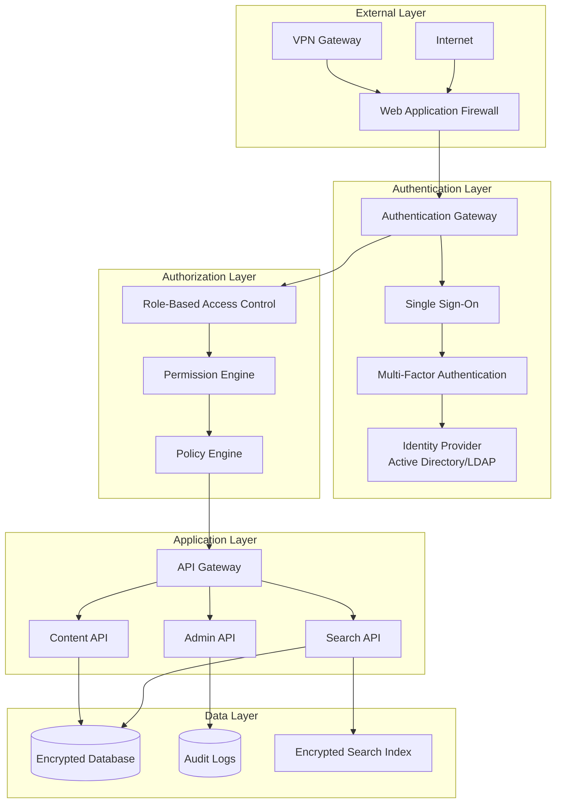

# Knowledge Base Search System - Security & Access Control

## Overview

The security and access control system ensures that the knowledge base search system is protected against threats while providing appropriate access levels to different user types. This design follows security best practices and compliance requirements for enterprise environments.

## Security Architecture



## Authentication System

### 1. Multi-Factor Authentication

```javascript
class AuthenticationService {
    constructor(identityProvider, mfaProvider) {
        this.identityProvider = identityProvider;
        this.mfaProvider = mfaProvider;
        this.sessionManager = new SessionManager();
        this.auditLogger = new AuditLogger();
    }
    
    async authenticate(credentials) {
        try {
            // Step 1: Primary authentication
            const primaryAuth = await this.identityProvider.authenticate(
                credentials.username,
                credentials.password
            );
            
            if (!primaryAuth.success) {
                await this.auditLogger.logFailedLogin(credentials.username, 'invalid_credentials');
                throw new AuthenticationError('Invalid credentials');
            }
            
            // Step 2: Check if MFA is required
            const user = primaryAuth.user;
            if (this.requiresMFA(user)) {
                const mfaChallenge = await this.mfaProvider.createChallenge(user);
                
                return {
                    status: 'mfa_required',
                    challengeId: mfaChallenge.id,
                    methods: mfaChallenge.availableMethods
                };
            }
            
            // Step 3: Create session
            const session = await this.sessionManager.createSession(user);
            
            await this.auditLogger.logSuccessfulLogin(user.id);
            
            return {
                status: 'authenticated',
                token: session.token,
                user: this.sanitizeUserData(user),
                expiresAt: session.expiresAt
            };
            
        } catch (error) {
            await this.auditLogger.logAuthenticationError(credentials.username, error);
            throw error;
        }
    }
    
    async verifyMFA(challengeId, mfaCode) {
        try {
            const challenge = await this.mfaProvider.getChallenge(challengeId);
            
            if (!challenge || challenge.isExpired()) {
                throw new AuthenticationError('MFA challenge expired');
            }
            
            const verification = await this.mfaProvider.verifyCode(challenge, mfaCode);
            
            if (!verification.success) {
                await this.auditLogger.logFailedMFA(challenge.userId);
                throw new AuthenticationError('Invalid MFA code');
            }
            
            // Create session after successful MFA
            const user = await this.identityProvider.getUser(challenge.userId);
            const session = await this.sessionManager.createSession(user);
            
            await this.auditLogger.logSuccessfulMFA(user.id);
            
            return {
                status: 'authenticated',
                token: session.token,
                user: this.sanitizeUserData(user),
                expiresAt: session.expiresAt
            };
            
        } catch (error) {
            await this.auditLogger.logMFAError(challengeId, error);
            throw error;
        }
    }
    
    requiresMFA(user) {
        // Require MFA for admin users or sensitive roles
        return user.role === 'admin' || 
               user.role === 'editor' || 
               user.permissions.includes('content:manage');
    }
    
    sanitizeUserData(user) {
        return {
            id: user.id,
            username: user.username,
            email: user.email,
            firstName: user.firstName,
            lastName: user.lastName,
            role: user.role,
            department: user.department,
            permissions: user.permissions
        };
    }
}
```

### 2. Single Sign-On Integration

```javascript
class SSOProvider {
    constructor(config) {
        this.config = config;
        this.samlProvider = new SAMLProvider(config.saml);
        this.oidcProvider = new OIDCProvider(config.oidc);
    }
    
    async initiateSSOLogin(provider, returnUrl) {
        switch (provider) {
            case 'saml':
                return await this.samlProvider.createAuthRequest(returnUrl);
            case 'oidc':
                return await this.oidcProvider.createAuthRequest(returnUrl);
            default:
                throw new Error(`Unsupported SSO provider: ${provider}`);
        }
    }
    
    async handleSSOCallback(provider, response) {
        let userInfo;
        
        switch (provider) {
            case 'saml':
                userInfo = await this.samlProvider.validateResponse(response);
                break;
            case 'oidc':
                userInfo = await this.oidcProvider.validateToken(response);
                break;
            default:
                throw new Error(`Unsupported SSO provider: ${provider}`);
        }
        
        // Map SSO user info to internal user format
        return this.mapSSOUser(userInfo);
    }
    
    mapSSOUser(ssoUser) {
        return {
            id: ssoUser.nameId || ssoUser.sub,
            username: ssoUser.username || ssoUser.preferred_username,
            email: ssoUser.email,
            firstName: ssoUser.firstName || ssoUser.given_name,
            lastName: ssoUser.lastName || ssoUser.family_name,
            department: ssoUser.department,
            groups: ssoUser.groups || [],
            attributes: ssoUser.customAttributes || {}
        };
    }
}
```

## Authorization System

### 1. Role-Based Access Control (RBAC)

```javascript
class RBACSystem {
    constructor() {
        this.roles = new Map();
        this.permissions = new Map();
        this.userRoles = new Map();
        this.initializeDefaultRoles();
    }
    
    initializeDefaultRoles() {
        // Define permissions
        const permissions = [
            'search:basic',
            'search:advanced',
            'content:read',
            'content:create',
            'content:edit',
            'content:delete',
            'content:publish',
            'analytics:view',
            'analytics:export',
            'admin:users',
            'admin:system',
            'admin:security'
        ];
        
        permissions.forEach(permission => {
            this.permissions.set(permission, {
                name: permission,
                description: this.getPermissionDescription(permission)
            });
        });
        
        // Define roles
        this.defineRole('viewer', [
            'search:basic',
            'content:read'
        ]);
        
        this.defineRole('user', [
            'search:basic',
            'search:advanced',
            'content:read'
        ]);
        
        this.defineRole('author', [
            'search:basic',
            'search:advanced',
            'content:read',
            'content:create',
            'content:edit'
        ]);
        
        this.defineRole('editor', [
            'search:basic',
            'search:advanced',
            'content:read',
            'content:create',
            'content:edit',
            'content:delete',
            'content:publish',
            'analytics:view'
        ]);
        
        this.defineRole('admin', [
            ...Array.from(this.permissions.keys()) // All permissions
        ]);
    }
    
    defineRole(roleName, permissions) {
        this.roles.set(roleName, {
            name: roleName,
            permissions: new Set(permissions),
            description: this.getRoleDescription(roleName)
        });
    }
    
    assignRole(userId, roleName) {
        if (!this.roles.has(roleName)) {
            throw new Error(`Role ${roleName} does not exist`);
        }
        
        if (!this.userRoles.has(userId)) {
            this.userRoles.set(userId, new Set());
        }
        
        this.userRoles.get(userId).add(roleName);
    }
    
    hasPermission(userId, permission) {
        const userRoles = this.userRoles.get(userId);
        if (!userRoles) return false;
        
        for (const roleName of userRoles) {
            const role = this.roles.get(roleName);
            if (role && role.permissions.has(permission)) {
                return true;
            }
        }
        
        return false;
    }
    
    getUserPermissions(userId) {
        const userRoles = this.userRoles.get(userId);
        if (!userRoles) return new Set();
        
        const permissions = new Set();
        
        for (const roleName of userRoles) {
            const role = this.roles.get(roleName);
            if (role) {
                role.permissions.forEach(permission => {
                    permissions.add(permission);
                });
            }
        }
        
        return permissions;
    }
    
    getPermissionDescription(permission) {
        const descriptions = {
            'search:basic': 'Perform basic searches',
            'search:advanced': 'Use advanced search features and filters',
            'content:read': 'View published content',
            'content:create': 'Create new articles and content',
            'content:edit': 'Edit existing content',
            'content:delete': 'Delete content',
            'content:publish': 'Publish and unpublish content',
            'analytics:view': 'View search and content analytics',
            'analytics:export': 'Export analytics data',
            'admin:users': 'Manage user accounts and permissions',
            'admin:system': 'Manage system settings and configuration',
            'admin:security': 'Manage security settings and audit logs'
        };
        
        return descriptions[permission] || permission;
    }
    
    getRoleDescription(role) {
        const descriptions = {
            'viewer': 'Can search and view published content',
            'user': 'Standard user with search and content access',
            'author': 'Can create and edit content',
            'editor': 'Can manage content and view analytics',
            'admin': 'Full system administration access'
        };
        
        return descriptions[role] || role;
    }
}
```

### 2. Content-Level Security

```javascript
class ContentSecurityManager {
    constructor(rbacSystem) {
        this.rbac = rbacSystem;
        this.contentPolicies = new Map();
        this.departmentAccess = new Map();
    }
    
    async checkContentAccess(userId, contentId, action = 'read') {
        const content = await this.getContent(contentId);
        if (!content) {
            throw new Error('Content not found');
        }
        
        // Check basic permission
        const requiredPermission = `content:${action}`;
        if (!this.rbac.hasPermission(userId, requiredPermission)) {
            return { allowed: false, reason: 'insufficient_permissions' };
        }
        
        // Check content visibility
        if (!this.checkVisibility(userId, content)) {
            return { allowed: false, reason: 'content_not_visible' };
        }
        
        // Check department restrictions
        if (!this.checkDepartmentAccess(userId, content)) {
            return { allowed: false, reason: 'department_restricted' };
        }
        
        // Check custom policies
        const policyResult = await this.evaluateContentPolicies(userId, content, action);
        if (!policyResult.allowed) {
            return policyResult;
        }
        
        return { allowed: true };
    }
    
    checkVisibility(userId, content) {
        switch (content.visibility) {
            case 'public':
                return true;
            case 'internal':
                return this.rbac.hasPermission(userId, 'content:read');
            case 'restricted':
                return this.rbac.hasPermission(userId, 'content:read') && 
                       this.hasRestrictedAccess(userId, content);
            case 'private':
                return content.authorId === userId || 
                       this.rbac.hasPermission(userId, 'admin:system');
            default:
                return false;
        }
    }
    
    checkDepartmentAccess(userId, content) {
        if (!content.departmentRestrictions || content.departmentRestrictions.length === 0) {
            return true; // No department restrictions
        }
        
        const user = this.getUser(userId);
        return content.departmentRestrictions.includes(user.department);
    }
    
    hasRestrictedAccess(userId, content) {
        // Check if user has specific access to restricted content
        const user = this.getUser(userId);
        
        // Admins and editors have access to restricted content
        if (user.role === 'admin' || user.role === 'editor') {
            return true;
        }
        
        // Check if user is in allowed groups
        if (content.allowedGroups) {
            return content.allowedGroups.some(group => user.groups.includes(group));
        }
        
        // Check if user is explicitly allowed
        if (content.allowedUsers) {
            return content.allowedUsers.includes(userId);
        }
        
        return false;
    }
    
    async evaluateContentPolicies(userId, content, action) {
        const policies = this.contentPolicies.get(content.categoryId) || [];
        
        for (const policy of policies) {
            const result = await policy.evaluate(userId, content, action);
            if (!result.allowed) {
                return result;
            }
        }
        
        return { allowed: true };
    }
    
    addContentPolicy(categoryId, policy) {
        if (!this.contentPolicies.has(categoryId)) {
            this.contentPolicies.set(categoryId, []);
        }
        this.contentPolicies.get(categoryId).push(policy);
    }
}
```

## API Security

### 1. JWT Token Management

```javascript
class JWTManager {
    constructor(config) {
        this.secretKey = config.secretKey;
        this.issuer = config.issuer;
        this.audience = config.audience;
        this.accessTokenTTL = config.accessTokenTTL || 3600; // 1 hour
        this.refreshTokenTTL = config.refreshTokenTTL || 604800; // 7 days
    }
    
    generateTokens(user) {
        const now = Math.floor(Date.now() / 1000);
        
        const accessTokenPayload = {
            sub: user.id,
            iss: this.issuer,
            aud: this.audience,
            iat: now,
            exp: now + this.accessTokenTTL,
            type: 'access',
            user: {
                id: user.id,
                username: user.username,
                role: user.role,
                permissions: Array.from(user.permissions)
            }
        };
        
        const refreshTokenPayload = {
            sub: user.id,
            iss: this.issuer,
            aud: this.audience,
            iat: now,
            exp: now + this.refreshTokenTTL,
            type: 'refresh',
            jti: this.generateJTI() // Unique token ID for revocation
        };
        
        return {
            accessToken: jwt.sign(accessTokenPayload, this.secretKey, { algorithm: 'HS256' }),
            refreshToken: jwt.sign(refreshTokenPayload, this.secretKey, { algorithm: 'HS256' }),
            expiresIn: this.accessTokenTTL
        };
    }
    
    verifyToken(token, expectedType = 'access') {
        try {
            const decoded = jwt.verify(token, this.secretKey, {
                issuer: this.issuer,
                audience: this.audience
            });
            
            if (decoded.type !== expectedType) {
                throw new Error(`Invalid token type. Expected ${expectedType}, got ${decoded.type}`);
            }
            
            // Check if token is revoked (for refresh tokens)
            if (expectedType === 'refresh' && this.isTokenRevoked(decoded.jti)) {
                throw new Error('Token has been revoked');
            }
            
            return decoded;
        } catch (error) {
            throw new Error(`Token verification failed: ${error.message}`);
        }
    }
    
    refreshAccessToken(refreshToken) {
        const decoded = this.verifyToken(refreshToken, 'refresh');
        
        // Get updated user information
        const user = this.getUserById(decoded.sub);
        if (!user) {
            throw new Error('User not found');
        }
        
        // Generate new access token
        const tokens = this.generateTokens(user);
        
        return {
            accessToken: tokens.accessToken,
            expiresIn: tokens.expiresIn
        };
    }
    
    revokeToken(tokenId) {
        // Add token ID to revocation list
        this.revokedTokens.add(tokenId);
        
        // Persist to database for distributed systems
        this.persistRevokedToken(tokenId);
    }
    
    generateJTI() {
        return crypto.randomBytes(16).toString('hex');
    }
    
    isTokenRevoked(tokenId) {
        return this.revokedTokens.has(tokenId);
    }
}
```

### 2. API Rate Limiting

```javascript
class RateLimiter {
    constructor(redisClient) {
        this.redis = redisClient;
        this.limits = new Map([
            ['search', { requests: 100, window: 60 }], // 100 requests per minute
            ['content', { requests: 50, window: 60 }], // 50 requests per minute
            ['admin', { requests: 20, window: 60 }]    // 20 requests per minute
        ]);
    }
    
    async checkRateLimit(userId, endpoint, userRole = 'user') {
        const key = `rate_limit:${userId}:${endpoint}`;
        const limit = this.getLimitForEndpoint(endpoint, userRole);
        
        const current = await this.redis.incr(key);
        
        if (current === 1) {
            await this.redis.expire(key, limit.window);
        }
        
        const ttl = await this.redis.ttl(key);
        
        if (current > limit.requests) {
            throw new RateLimitError({
                message: 'Rate limit exceeded',
                limit: limit.requests,
                current: current,
                resetTime: ttl
            });
        }
        
        return {
            allowed: true,
            limit: limit.requests,
            remaining: Math.max(0, limit.requests - current),
            resetTime: ttl
        };
    }
    
    getLimitForEndpoint(endpoint, userRole) {
        // Higher limits for privileged users
        const roleMultiplier = {
            'admin': 3,
            'editor': 2,
            'author': 1.5,
            'user': 1
        };
        
        const baseLimit = this.limits.get(this.categorizeEndpoint(endpoint));
        const multiplier = roleMultiplier[userRole] || 1;
        
        return {
            requests: Math.floor(baseLimit.requests * multiplier),
            window: baseLimit.window
        };
    }
    
    categorizeEndpoint(endpoint) {
        if (endpoint.includes('/search')) return 'search';
        if (endpoint.includes('/admin')) return 'admin';
        return 'content';
    }
}
```

## Data Security

### 1. Encryption at Rest

```javascript
class DataEncryption {
    constructor(config) {
        this.algorithm = 'aes-256-gcm';
        this.keyDerivationRounds = 100000;
        this.masterKey = config.masterKey;
        this.keyRotationInterval = config.keyRotationInterval || 86400000; // 24 hours
    }
    
    async encryptSensitiveData(data, context = {}) {
        const dataKey = await this.generateDataKey();
        const iv = crypto.randomBytes(16);
        
        const cipher = crypto.createCipher(this.algorithm, dataKey.key, iv);
        
        let encrypted = cipher.update(JSON.stringify(data), 'utf8', 'hex');
        encrypted += cipher.final('hex');
        
        const authTag = cipher.getAuthTag();
        
        return {
            encryptedData: encrypted,
            iv: iv.toString('hex'),
            authTag: authTag.toString('hex'),
            keyId: dataKey.id,
            algorithm: this.algorithm,
            context: context
        };
    }
    
    async decryptSensitiveData(encryptedPayload) {
        const dataKey = await this.getDataKey(encryptedPayload.keyId);
        
        const decipher = crypto.createDecipher(
            encryptedPayload.algorithm,
            dataKey.key,
            Buffer.from(encryptedPayload.iv, 'hex')
        );
        
        decipher.setAuthTag(Buffer.from(encryptedPayload.authTag, 'hex'));
        
        let decrypted = decipher.update(encryptedPayload.encryptedData, 'hex', 'utf8');
        decrypted += decipher.final('utf8');
        
        return JSON.parse(decrypted);
    }
    
    async generateDataKey() {
        const keyId = crypto.randomUUID();
        const key = crypto.randomBytes(32); // 256-bit key
        
        // Encrypt the data key with the master key
        const encryptedKey = await this.encryptWithMasterKey(key);
        
        // Store the encrypted data key
        await this.storeDataKey(keyId, encryptedKey);
        
        return { id: keyId, key: key };
    }
    
    async rotateKeys() {
        const oldKeys = await this.getActiveDataKeys();
        
        for (const keyId of oldKeys) {
            // Mark key for rotation
            await this.markKeyForRotation(keyId);
            
            // Re-encrypt data with new key
            await this.reEncryptDataWithNewKey(keyId);
            
            // Deactivate old key
            await this.deactivateKey(keyId);
        }
    }
}
```

### 2. Search Index Security

```javascript
class SecureSearchIndex {
    constructor(elasticsearchClient, encryptionService) {
        this.es = elasticsearchClient;
        this.encryption = encryptionService;
        this.sensitiveFields = ['content', 'summary', 'metadata.personalInfo'];
    }
    
    async indexDocument(document) {
        const secureDocument = await this.prepareSecureDocument(document);
        
        return await this.es.index({
            index: 'kb-articles-secure',
            id: document.id,
            body: secureDocument
        });
    }
    
    async prepareSecureDocument(document) {
        const secureDoc = { ...document };
        
        // Encrypt sensitive fields
        for (const field of this.sensitiveFields) {
            const value = this.getNestedValue(secureDoc, field);
            if (value) {
                const encrypted = await this.encryption.encryptSensitiveData(value, {
                    documentId: document.id,
                    field: field
                });
                this.setNestedValue(secureDoc, field, encrypted);
            }
        }
        
        // Add security metadata
        secureDoc._security = {
            visibility: document.visibility,
            departmentRestrictions: document.departmentRestrictions,
            allowedRoles: this.calculateAllowedRoles(document),
            encryptedFields: this.sensitiveFields
        };
        
        return secureDoc;
    }
    
    async searchWithSecurity(query, userContext) {
        // Add security filters to the query
        const secureQuery = this.addSecurityFilters(query, userContext);
        
        const response = await this.es.search({
            index: 'kb-articles-secure',
            body: secureQuery
        });
        
        // Decrypt results for authorized user
        const decryptedResults = await this.decryptSearchResults(
            response.hits.hits,
            userContext
        );
        
        return {
            ...response,
            hits: {
                ...response.hits,
                hits: decryptedResults
            }
        };
    }
    
    addSecurityFilters(query, userContext) {
        const securityFilters = [];
        
        // Visibility filter
        const visibilityFilter = {
            terms: {
                '_security.visibility': this.getAllowedVisibilities(userContext)
            }
        };
        securityFilters.push(visibilityFilter);
        
        // Department filter
        if (userContext.department) {
            securityFilters.push({
                bool: {
                    should: [
                        { bool: { must_not: { exists: { field: '_security.departmentRestrictions' } } } },
                        { terms: { '_security.departmentRestrictions': [userContext.department] } }
                    ]
                }
            });
        }
        
        // Role filter
        securityFilters.push({
            terms: {
                '_security.allowedRoles': userContext.roles
            }
        });
        
        // Combine with original query
        return {
            ...query,
            query: {
                bool: {
                    must: [query.query || { match_all: {} }],
                    filter: securityFilters
                }
            }
        };
    }
    
    async decryptSearchResults(hits, userContext) {
        const decryptedHits = [];
        
        for (const hit of hits) {
            const decryptedHit = { ...hit };
            
            // Decrypt sensitive fields if user has access
            if (this.canAccessSensitiveData(userContext, hit._source)) {
                for (const field of this.sensitiveFields) {
                    const encryptedValue = this.getNestedValue(hit._source, field);
                    if (encryptedValue && encryptedValue.encryptedData) {
                        try {
                            const decrypted = await this.encryption.decryptSensitiveData(encryptedValue);
                            this.setNestedValue(decryptedHit._source, field, decrypted);
                        } catch (error) {
                            // Log decryption error but don't fail the search
                            console.error(`Failed to decrypt field ${field}:`, error);
                            this.setNestedValue(decryptedHit._source, field, '[ENCRYPTED]');
                        }
                    }
                }
            }
            
            // Remove security metadata from results
            delete decryptedHit._source._security;
            
            decryptedHits.push(decryptedHit);
        }
        
        return decryptedHits;
    }
    
    canAccessSensitiveData(userContext, document) {
        // Check if user has permission to view sensitive data
        return userContext.permissions.includes('content:read_sensitive') ||
               userContext.roles.includes('admin') ||
               userContext.roles.includes('editor');
    }
}
```

## Audit and Compliance

### 1. Audit Logging

```javascript
class AuditLogger {
    constructor(database) {
        this.db = database;
        this.sensitiveActions = [
            'login', 'logout', 'failed_login',
            'content_access', 'content_modify', 'content_delete',
            'admin_action', 'permission_change', 'security_event'
        ];
    }
    
    async logEvent(event) {
        const auditEntry = {
            id: crypto.randomUUID(),
            timestamp: new Date().toISOString(),
            userId: event.userId,
            sessionId: event.sessionId,
            action: event.action,
            resource: event.resource,
            resourceId: event.resourceId,
            details: event.details,
            ipAddress: event.ipAddress,
            userAgent: event.userAgent,
            success: event.success,
            errorMessage: event.errorMessage,
            severity: this.calculateSeverity(event),
            category: this.categorizeEvent(event.action)
        };
        
        // Store in audit log database
        await this.db.collection('audit_logs').insertOne(auditEntry);
        
        // Send to SIEM if high severity
        if (auditEntry.severity >= 7) {
            await this.sendToSIEM(auditEntry);
        }
        
        // Trigger alerts for critical events
        if (this.isCriticalEvent(event)) {
            await this.triggerSecurityAlert(auditEntry);
        }
    }
    
    async logSecurityEvent(eventType, details) {
        await this.logEvent({
            action: 'security_event',
            resource: 'system',
            details: {
                eventType: eventType,
                ...details
            },
            success: true,
            severity: 8
        });
    }
    
    async logDataAccess(userId, resourceType, resourceId, action, success = true) {
        await this.logEvent({
            userId: userId,
            action: `${resourceType}_${action}`,
            resource: resourceType,
            resourceId: resourceId,
            success: success,
            category: 'data_access'
        });
    }
    
    calculateSeverity(event) {
        const severityMap = {
            'login': 3,
            'logout': 2,
            'failed_login': 6,
            'content_access': 2,
            'content_modify': 5,
            'content_delete': 7,
            'admin_action': 8,
            'permission_change': 9,
            'security_event': 8
        };
        
        return severityMap[event.action] || 5;
    }
    
    categorizeEvent(action) {
        if (action.includes('login')) return 'authentication';
        if (action.includes('content
')) return 'data_access';
        if (action.includes('admin')) return 'administration';
        if (action.includes('permission')) return 'authorization';
        return 'general';
    }
    
    isCriticalEvent(event) {
        const criticalActions = [
            'failed_login', 'permission_change', 'admin_action',
            'security_event', 'content_delete'
        ];
        
        return criticalActions.includes(event.action) ||
               (event.action === 'failed_login' && this.isRepeatedFailure(event.userId));
    }
    
    async isRepeatedFailure(userId) {
        const recentFailures = await this.db.collection('audit_logs').countDocuments({
            userId: userId,
            action: 'failed_login',
            timestamp: { $gte: new Date(Date.now() - 15 * 60 * 1000) } // Last 15 minutes
        });
        
        return recentFailures >= 3;
    }
}
```

### 2. Compliance Framework

```javascript
class ComplianceManager {
    constructor(auditLogger) {
        this.auditLogger = auditLogger;
        this.complianceRules = new Map();
        this.initializeComplianceRules();
    }
    
    initializeComplianceRules() {
        // GDPR Compliance Rules
        this.addComplianceRule('gdpr_data_access', {
            description: 'Log all personal data access',
            trigger: 'data_access',
            condition: (event) => this.containsPersonalData(event.resource),
            action: (event) => this.logGDPRAccess(event)
        });
        
        this.addComplianceRule('gdpr_data_retention', {
            description: 'Enforce data retention policies',
            trigger: 'scheduled',
            interval: '24h',
            action: () => this.enforceDataRetention()
        });
        
        // SOX Compliance Rules
        this.addComplianceRule('sox_financial_data', {
            description: 'Protect financial information access',
            trigger: 'data_access',
            condition: (event) => this.isFinancialData(event.resource),
            action: (event) => this.logSOXAccess(event)
        });
        
        // HIPAA Compliance Rules (if applicable)
        this.addComplianceRule('hipaa_health_data', {
            description: 'Protect health information',
            trigger: 'data_access',
            condition: (event) => this.isHealthData(event.resource),
            action: (event) => this.logHIPAAAccess(event)
        });
    }
    
    addComplianceRule(id, rule) {
        this.complianceRules.set(id, {
            id: id,
            ...rule,
            createdAt: new Date(),
            active: true
        });
    }
    
    async evaluateCompliance(event) {
        for (const [ruleId, rule] of this.complianceRules) {
            if (!rule.active) continue;
            
            if (rule.trigger === event.type || rule.trigger === 'all') {
                if (!rule.condition || rule.condition(event)) {
                    try {
                        await rule.action(event);
                        await this.logComplianceAction(ruleId, event, 'success');
                    } catch (error) {
                        await this.logComplianceAction(ruleId, event, 'error', error);
                    }
                }
            }
        }
    }
    
    async generateComplianceReport(startDate, endDate, framework = 'all') {
        const report = {
            framework: framework,
            period: { start: startDate, end: endDate },
            generatedAt: new Date(),
            summary: {},
            violations: [],
            recommendations: []
        };
        
        // Analyze audit logs for compliance
        const auditLogs = await this.getAuditLogs(startDate, endDate);
        
        switch (framework) {
            case 'gdpr':
                report.summary = await this.analyzeGDPRCompliance(auditLogs);
                break;
            case 'sox':
                report.summary = await this.analyzeSOXCompliance(auditLogs);
                break;
            case 'hipaa':
                report.summary = await this.analyzeHIPAACompliance(auditLogs);
                break;
            default:
                report.summary = await this.analyzeAllCompliance(auditLogs);
        }
        
        return report;
    }
    
    containsPersonalData(resource) {
        const personalDataTypes = ['user_profile', 'contact_info', 'personal_document'];
        return personalDataTypes.includes(resource);
    }
    
    isFinancialData(resource) {
        const financialDataTypes = ['financial_report', 'budget', 'expense'];
        return financialDataTypes.includes(resource);
    }
    
    isHealthData(resource) {
        const healthDataTypes = ['medical_record', 'health_info', 'wellness_data'];
        return healthDataTypes.includes(resource);
    }
}
```

## Security Monitoring

### 1. Threat Detection

```javascript
class ThreatDetectionSystem {
    constructor(auditLogger, alertManager) {
        this.auditLogger = auditLogger;
        this.alertManager = alertManager;
        this.threatRules = new Map();
        this.suspiciousActivities = new Map();
        this.initializeThreatRules();
    }
    
    initializeThreatRules() {
        // Brute force detection
        this.addThreatRule('brute_force_login', {
            description: 'Detect brute force login attempts',
            pattern: 'failed_login',
            threshold: 5,
            timeWindow: 15 * 60 * 1000, // 15 minutes
            severity: 'high',
            action: (context) => this.handleBruteForce(context)
        });
        
        // Unusual access patterns
        this.addThreatRule('unusual_access_pattern', {
            description: 'Detect unusual access patterns',
            pattern: 'content_access',
            condition: (event) => this.isUnusualAccess(event),
            severity: 'medium',
            action: (context) => this.handleUnusualAccess(context)
        });
        
        // Privilege escalation attempts
        this.addThreatRule('privilege_escalation', {
            description: 'Detect privilege escalation attempts',
            pattern: 'permission_denied',
            condition: (event) => this.isPrivilegeEscalation(event),
            severity: 'high',
            action: (context) => this.handlePrivilegeEscalation(context)
        });
        
        // Data exfiltration detection
        this.addThreatRule('data_exfiltration', {
            description: 'Detect potential data exfiltration',
            pattern: 'bulk_download',
            threshold: 100, // 100 documents in short time
            timeWindow: 5 * 60 * 1000, // 5 minutes
            severity: 'critical',
            action: (context) => this.handleDataExfiltration(context)
        });
    }
    
    addThreatRule(id, rule) {
        this.threatRules.set(id, {
            id: id,
            ...rule,
            createdAt: new Date(),
            active: true
        });
    }
    
    async analyzeEvent(event) {
        for (const [ruleId, rule] of this.threatRules) {
            if (!rule.active) continue;
            
            if (this.matchesPattern(event, rule.pattern)) {
                if (!rule.condition || rule.condition(event)) {
                    await this.evaluateThreat(ruleId, rule, event);
                }
            }
        }
    }
    
    async evaluateThreat(ruleId, rule, event) {
        const key = `${ruleId}:${event.userId || event.ipAddress}`;
        
        if (!this.suspiciousActivities.has(key)) {
            this.suspiciousActivities.set(key, {
                ruleId: ruleId,
                events: [],
                firstSeen: new Date(),
                lastSeen: new Date()
            });
        }
        
        const activity = this.suspiciousActivities.get(key);
        activity.events.push(event);
        activity.lastSeen = new Date();
        
        // Check if threshold is exceeded
        if (rule.threshold) {
            const recentEvents = activity.events.filter(e => 
                new Date() - new Date(e.timestamp) <= rule.timeWindow
            );
            
            if (recentEvents.length >= rule.threshold) {
                await this.triggerThreatAlert(ruleId, rule, activity);
            }
        } else {
            // Immediate threat
            await this.triggerThreatAlert(ruleId, rule, activity);
        }
    }
    
    async triggerThreatAlert(ruleId, rule, activity) {
        const alert = {
            id: crypto.randomUUID(),
            ruleId: ruleId,
            severity: rule.severity,
            description: rule.description,
            detectedAt: new Date(),
            activity: activity,
            status: 'active'
        };
        
        // Log security event
        await this.auditLogger.logSecurityEvent('threat_detected', {
            ruleId: ruleId,
            severity: rule.severity,
            description: rule.description,
            activitySummary: {
                eventCount: activity.events.length,
                timeSpan: new Date() - activity.firstSeen,
                affectedUser: activity.events[0].userId,
                sourceIP: activity.events[0].ipAddress
            }
        });
        
        // Send alert
        await this.alertManager.sendSecurityAlert(alert);
        
        // Execute rule action
        if (rule.action) {
            await rule.action({
                alert: alert,
                activity: activity,
                rule: rule
            });
        }
    }
    
    async handleBruteForce(context) {
        const userId = context.activity.events[0].userId;
        const ipAddress = context.activity.events[0].ipAddress;
        
        // Temporarily lock account
        await this.lockUserAccount(userId, 30 * 60 * 1000); // 30 minutes
        
        // Block IP address
        await this.blockIPAddress(ipAddress, 60 * 60 * 1000); // 1 hour
        
        // Notify security team
        await this.notifySecurityTeam('brute_force_detected', {
            userId: userId,
            ipAddress: ipAddress,
            attemptCount: context.activity.events.length
        });
    }
    
    async handleDataExfiltration(context) {
        const userId = context.activity.events[0].userId;
        
        // Immediately suspend user account
        await this.suspendUserAccount(userId);
        
        // Block all active sessions
        await this.revokeAllUserSessions(userId);
        
        // Alert security team immediately
        await this.alertManager.sendCriticalAlert({
            type: 'data_exfiltration',
            userId: userId,
            downloadCount: context.activity.events.length,
            timeSpan: new Date() - context.activity.firstSeen
        });
    }
    
    isUnusualAccess(event) {
        // Check for access outside normal hours
        const hour = new Date(event.timestamp).getHours();
        if (hour < 6 || hour > 22) return true;
        
        // Check for access from unusual location
        if (this.isUnusualLocation(event.ipAddress, event.userId)) return true;
        
        // Check for rapid sequential access
        if (this.isRapidAccess(event.userId)) return true;
        
        return false;
    }
    
    isPrivilegeEscalation(event) {
        // Check if
user is trying to access resources above their permission level
        const userRole = this.getUserRole(event.userId);
        const requiredRole = this.getRequiredRole(event.resource);
        
        return this.getRoleLevel(userRole) < this.getRoleLevel(requiredRole);
    }
}
```

### 2. Security Incident Response

```javascript
class IncidentResponseSystem {
    constructor(alertManager, auditLogger) {
        this.alertManager = alertManager;
        this.auditLogger = auditLogger;
        this.incidents = new Map();
        this.responsePlaybooks = new Map();
        this.initializePlaybooks();
    }
    
    initializePlaybooks() {
        this.addPlaybook('brute_force', {
            severity: 'high',
            steps: [
                'Lock affected user account',
                'Block source IP address',
                'Notify security team',
                'Analyze attack pattern',
                'Update security rules'
            ],
            autoActions: ['lockAccount', 'blockIP'],
            escalationTime: 15 * 60 * 1000 // 15 minutes
        });
        
        this.addPlaybook('data_breach', {
            severity: 'critical',
            steps: [
                'Isolate affected systems',
                'Preserve evidence',
                'Notify stakeholders',
                'Assess data exposure',
                'Implement containment',
                'Begin recovery process'
            ],
            autoActions: ['isolateSystem', 'preserveEvidence'],
            escalationTime: 5 * 60 * 1000 // 5 minutes
        });
        
        this.addPlaybook('privilege_escalation', {
            severity: 'high',
            steps: [
                'Suspend user account',
                'Revoke active sessions',
                'Review access logs',
                'Assess damage',
                'Update permissions'
            ],
            autoActions: ['suspendAccount', 'revokeSessions'],
            escalationTime: 10 * 60 * 1000 // 10 minutes
        });
    }
    
    async createIncident(alert) {
        const incident = {
            id: crypto.randomUUID(),
            alertId: alert.id,
            type: alert.ruleId,
            severity: alert.severity,
            status: 'open',
            createdAt: new Date(),
            updatedAt: new Date(),
            assignedTo: null,
            timeline: [],
            evidence: [],
            actions: []
        };
        
        this.incidents.set(incident.id, incident);
        
        // Execute playbook
        const playbook = this.responsePlaybooks.get(alert.ruleId);
        if (playbook) {
            await this.executePlaybook(incident, playbook);
        }
        
        // Log incident creation
        await this.auditLogger.logSecurityEvent('incident_created', {
            incidentId: incident.id,
            type: incident.type,
            severity: incident.severity
        });
        
        return incident;
    }
    
    async executePlaybook(incident, playbook) {
        // Execute automated actions
        for (const action of playbook.autoActions) {
            try {
                await this.executeAction(incident, action);
                this.addToTimeline(incident, `Executed automated action: ${action}`);
            } catch (error) {
                this.addToTimeline(incident, `Failed to execute action ${action}: ${error.message}`);
            }
        }
        
        // Schedule escalation if needed
        if (playbook.escalationTime) {
            setTimeout(() => {
                this.escalateIncident(incident.id);
            }, playbook.escalationTime);
        }
        
        // Notify response team
        await this.notifyResponseTeam(incident, playbook);
    }
    
    async executeAction(incident, action) {
        switch (action) {
            case 'lockAccount':
                await this.lockUserAccount(incident.userId, 30 * 60 * 1000);
                break;
            case 'blockIP':
                await this.blockIPAddress(incident.sourceIP, 60 * 60 * 1000);
                break;
            case 'suspendAccount':
                await this.suspendUserAccount(incident.userId);
                break;
            case 'revokeSessions':
                await this.revokeAllUserSessions(incident.userId);
                break;
            case 'isolateSystem':
                await this.isolateAffectedSystems(incident);
                break;
            case 'preserveEvidence':
                await this.preserveEvidence(incident);
                break;
        }
        
        incident.actions.push({
            action: action,
            executedAt: new Date(),
            status: 'completed'
        });
    }
    
    addToTimeline(incident, event) {
        incident.timeline.push({
            timestamp: new Date(),
            event: event,
            source: 'system'
        });
        incident.updatedAt = new Date();
    }
    
    async escalateIncident(incidentId) {
        const incident = this.incidents.get(incidentId);
        if (!incident || incident.status !== 'open') return;
        
        incident.severity = this.escalateSeverity(incident.severity);
        this.addToTimeline(incident, 'Incident escalated due to timeout');
        
        // Notify higher-level response team
        await this.notifyEscalationTeam(incident);
        
        await this.auditLogger.logSecurityEvent('incident_escalated', {
            incidentId: incidentId,
            newSeverity: incident.severity
        });
    }
}
```

## Security Configuration

### 1. Security Headers

```javascript
class SecurityHeaders {
    static getSecurityHeaders() {
        return {
            // Prevent clickjacking
            'X-Frame-Options': 'DENY',
            
            // Prevent MIME type sniffing
            'X-Content-Type-Options': 'nosniff',
            
            // Enable XSS protection
            'X-XSS-Protection': '1; mode=block',
            
            // Strict transport security
            'Strict-Transport-Security': 'max-age=31536000; includeSubDomains; preload',
            
            // Content security policy
            'Content-Security-Policy': [
                "default-src 'self'",
                "script-src 'self' 'unsafe-inline' https://cdn.jsdelivr.net",
                "style-src 'self' 'unsafe-inline' https://fonts.googleapis.com",
                "font-src 'self' https://fonts.gstatic.com",
                "img-src 'self' data: https:",
                "connect-src 'self' https://api.company.com",
                "frame-ancestors 'none'",
                "base-uri 'self'",
                "form-action 'self'"
            ].join('; '),
            
            // Referrer policy
            'Referrer-Policy': 'strict-origin-when-cross-origin',
            
            // Permissions policy
            'Permissions-Policy': [
                'camera=()',
                'microphone=()',
                'geolocation=()',
                'payment=()',
                'usb=()'
            ].join(', ')
        };
    }
    
    static applySecurityHeaders(app) {
        app.use((req, res, next) => {
            const headers = SecurityHeaders.getSecurityHeaders();
            
            Object.entries(headers).forEach(([header, value]) => {
                res.setHeader(header, value);
            });
            
            next();
        });
    }
}
```

### 2. Input Validation and Sanitization

```javascript
class InputValidator {
    constructor() {
        this.sanitizers = new Map();
        this.validators = new Map();
        this.initializeValidators();
    }
    
    initializeValidators() {
        // Search query validation
        this.addValidator('searchQuery', {
            maxLength: 500,
            allowedChars: /^[a-zA-Z0-9\s\-_.,!?()[\]{}'"]+$/,
            sanitize: (input) => this.sanitizeSearchQuery(input)
        });
        
        // Content validation
        this.addValidator('content', {
            maxLength: 50000,
            sanitize: (input) => this.sanitizeHTML(input),
            validate: (input) => this.validateContent(input)
        });
        
        // User input validation
        this.addValidator('userInput', {
            maxLength: 1000,
            sanitize: (input) => this.sanitizeUserInput(input),
            validate: (input) => this.validateUserInput(input)
        });
    }
    
    addValidator(type, config) {
        this.validators.set(type, config);
    }
    
    validate(input, type) {
        const validator = this.validators.get(type);
        if (!validator) {
            throw new Error(`No validator found for type: ${type}`);
        }
        
        // Length check
        if (validator.maxLength && input.length > validator.maxLength) {
            throw new ValidationError(`Input exceeds maximum length of ${validator.maxLength}`);
        }
        
        // Character validation
        if (validator.allowedChars && !validator.allowedChars.test(input)) {
            throw new ValidationError('Input contains invalid characters');
        }
        
        // Custom validation
        if (validator.validate && !validator.validate(input)) {
            throw new ValidationError('Input failed custom validation');
        }
        
        // Sanitization
        if (validator.sanitize) {
            return validator.sanitize(input);
        }
        
        return input;
    }
    
    sanitizeSearchQuery(query) {
        // Remove potentially dangerous characters
        return query
            .replace(/[<>]/g, '') // Remove angle brackets
            .replace(/javascript:/gi, '') // Remove javascript: protocol
            .replace(/on\w+=/gi, '') // Remove event handlers
            .trim();
    }
    
    sanitizeHTML(html) {
        // Use a library like DOMPurify for comprehensive HTML sanitization
        const allowedTags = ['p', 'br', 'strong', 'em', 'ul', 'ol', 'li', 'h1', 'h2', 'h3', 'h4', 'h5', 'h6'];
        const allowedAttributes = ['class', 'id'];
        
        // This is a simplified example - use a proper HTML sanitization library
        return this.stripDisallowedTags(html, allowedTags, allowedAttributes);
    }
    
    sanitizeUserInput(input) {
        return input
            .replace(/[<>&"']/g, (match) => {
                const entities = {
                    '<': '&lt;',
                    '>': '&gt;',
                    '&': '&amp;',
                    '"': '&quot;',
                    "'": '&#x27;'
                };
                return entities[match];
            })
            .trim();
    }
    
    validateContent(content) {
        // Check for suspicious patterns
        const suspiciousPatterns = [
            /<script/i,
            /javascript:/i,
            /on\w+=/i,
            /data:text\/html/i,
            /vbscript:/i
        ];
        
        return !suspiciousPatterns.some(pattern => pattern.test(content));
    }
    
    validateUserInput(input) {
        // Check for SQL injection patterns
        const sqlPatterns = [
            /(\b(SELECT|INSERT|UPDATE|DELETE|DROP|CREATE|ALTER)\b)/i,
            /(UNION|OR|AND)\s+\d+\s*=\s*\d+/i,
            /['"]\s*(OR|AND)\s*['"]\d+['"]\s*=\s*['"]\d+['"]]/i
        ];
        
        return !sqlPatterns.some(pattern => pattern.test(input));
    }
}
```

## Security Best Practices

### 1. Secure Development Guidelines

```markdown
## Secure Coding Standards

### Input Validation
- Validate all user inputs on both client and server side
- Use whitelist validation instead of blacklist
- Sanitize data before processing or storage
- Implement proper error handling without exposing sensitive information

### Authentication & Authorization
- Implement strong password policies
- Use multi-factor authentication for privileged accounts
- Follow principle of least privilege
- Regularly review and audit user permissions

### Data Protection
- Encrypt sensitive data at rest and in transit
- Use strong encryption algorithms (AES-256, RSA-2048+)
- Implement proper key management
- Regular key rotation

### Session Management
- Use secure session tokens
- Implement proper session timeout
- Secure session storage
- Prevent session fixation attacks

### Error Handling
- Don't expose sensitive information in error messages
- Log security-relevant events
- Implement proper exception handling
- Use generic error messages for users

### Logging & Monitoring
- Log all security-relevant events
- Implement real-time monitoring
- Regular log analysis
- Secure log storage and transmission
```

### 2. Security Testing

```javascript
class SecurityTesting {
    constructor() {
        this.testSuites = new Map();
        this.vulnerabilityScanner = new VulnerabilityScanner();
        this.initializeTestSuites();
    }
    
    initializeTestSuites() {
        this.addTestSuite('authentication', [
            'testBruteForceProtection',
            'testPasswordComplexity',
            'testSessionManagement',
            'testMFABypass'
        ]);
        
        this.addTestSuite('authorization', [
            'testPrivilegeEscalation',
            'testAccessControl',
            'testRoleBasedAccess',
            'testResourcePermissions'
        ]);
        
        this.addTestSuite('input_validation', [
            'testSQLInjection',
            'testXSSPrevention',
            'testCSRFProtection',
            'testInputSanitization'
        ]);
        
        this.addTestSuite('data_protection', [
            'testEncryptionAtRest',
            'testEncryptionInTransit',
            'testKeyManagement',
            'testDataLeakage'
        ]);
    }
    
    async runSecurityTests(suite = 'all') {
        const results = {
            suite: suite,
            startTime: new Date(),
            tests: [],
            summary: {
                total: 0,
                passed: 0,
                failed: 0,
                vulnerabilities: []
            }
        };
        
        const suitesToRun = suite === 'all' ? 
            Array.from(this.testSuites.keys()) : [suite];
        
        for (const suiteName of suitesToRun) {
            const testSuite = this.testSuites.get(suiteName);
            if (testSuite) {
                for (const testName of testSuite) {
                    const testResult = await this.runTest(testName);
                    results.tests.push(testResult);
                    results.summary.total++;
                    
                    if (testResult.passed) {
                        results.summary.passed++;
                    } else {
                        results.summary.failed++;
                        if (testResult.vulnerability) {
                            results.summary.vulnerabilities.push(testResult.vulnerability);
                        }
                    }
                }
            }
        }
        
        results.endTime = new Date();
        results.duration = results.endTime - results.startTime;
        
        return results;
    }
    
    async runTest(testName) {
        try {
            const testMethod = this[testName];
            if (!testMethod) {
                throw new Error(`Test method ${testName} not found`);
            }
            
            const result = await testMethod.call(this);
            
            return {
                name: testName,
                passed: result.passed,
                message: result.message,
                vulnerability: result.vulnerability || null,
                executedAt: new Date()
            };
        } catch (error) {
            return {
                name: testName,
                passed: false,
                message: `Test execution failed: ${error.message}`,
                error: error,
                executedAt: new Date()
            };
        }
    }
    
    async testSQLInjection() {
        const testPayloads = [
            "'; DROP TABLE users; --",
            "' OR '1'='1",
            "' UNION SELECT * FROM users --",
            "admin'--",
            "' OR 1=1#"
        ];
        
        for (const payload of testPayloads) {
            const response = await this.makeTestRequest('/api/search', {
                q: payload
            });
            
            if (this.indicatesSQLInjection(response)) {
                return {
                    passed: false,
                    message: `SQL injection vulnerability detected with payload: ${payload}`,
                    vulnerability: {
                        type: 'sql_injection',
                        severity: 'high',
                        payload: payload,
                        endpoint: '/api/search'
                    }
                };
            }
        }
        
        return {
            passed: true,
            message: 'No SQL injection vulnerabilities detected'
        };
    }
    
    async testXSSPrevention() {
        const xssPayloads = [
            '<script>alert("XSS")</script>',
            '"><script>alert("XSS")</script>',
            "javascript:alert('XSS')",
            '',
            '<svg onload=alert("XSS")>'
        ];
        
        for (const payload of xssPayloads) {
            const response = await this.makeTestRequest('/api/search', {
                q: payload
            });
            
            if (this.indicatesXSS(response, payload)) {
                return {
                    passed: false,
                    message: `XSS vulnerability detected with payload: ${payload}`,
                    vulnerability: {
                        type: 'xss',
                        severity: 'high',
                        payload: payload,
                        endpoint: '/api/search'
                    }
                };
            }
        }
        
        return {
            passed: true,
            message: 'No XSS vulnerabilities detected'
        };
    }
    
    indicatesSQLInjection(response) {
        const sqlErrorPatterns = [
            /SQL syntax.*MySQL/i,
            /Warning.*mysql_/i,
            /valid MySQL result/i,
            /PostgreSQL.*ERROR/i,
            /Warning.*pg_/i,
            /valid PostgreSQL result/i,
            /Microsoft.*ODBC.*SQL Server/i,
            /OLE DB.*SQL Server/i
        ];
        
        return sqlErrorPatterns.some(pattern => 
            pattern.test(response.body) || pattern.test(response.error)
        );
    }
    
    indicatesXSS(response, payload) {
        // Check if payload is reflected without proper encoding
        return response.body && response.body.includes(payload);
    }
}
```

This comprehensive security and access control design provides multiple layers of protection for the knowledge base search system, ensuring data confidentiality, integrity, and availability while maintaining compliance with security standards and regulations.