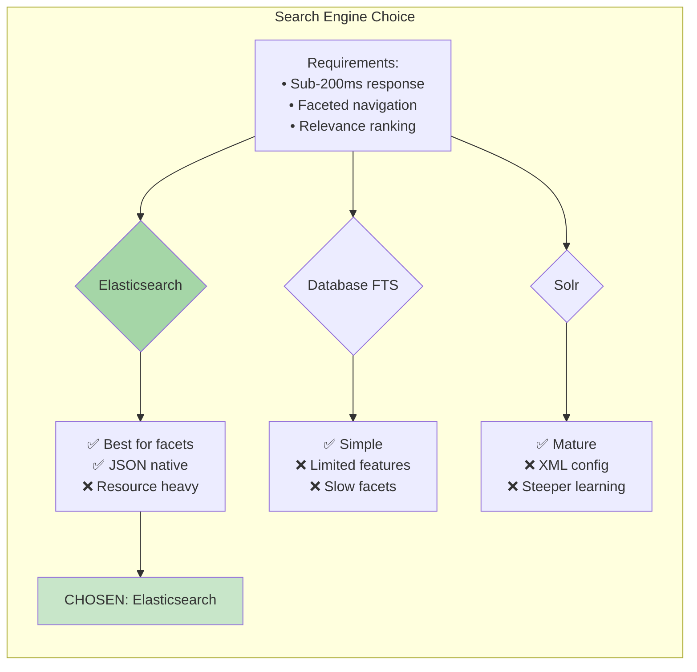

# Knowledge Base Search System - Simplified Architecture Overview

## System Design Philosophy

> **Core Principle**: Optimize for search experience first, manage complexity second.

## High-Level Architecture with Decision Rationale

```mermaid
graph TB
    subgraph "Why: User Experience Focus"
        USER[Knowledge Workers<br/>Need: Find info in <30s]
    end
    
    subgraph "Why: API-First for Flexibility"
        GATEWAY[API Gateway<br/>Decision: Centralized security]
    end
    
    subgraph "Why: Separation of Concerns"
        SEARCH[Search Service<br/>Decision: Elasticsearch expertise]
        CONTENT[Content Service<br/>Decision: ACID transactions]
        ANALYTICS[Analytics Service<br/>Decision: Independent scaling]
    end
    
    subgraph "Why: Right Tool for Right Job"
        ES[Elasticsearch<br/>Decision: Sub-200ms search]
        PG[(PostgreSQL<br/>Decision: Data integrity)]
        REDIS[(Redis<br/>Decision: Cache performance)]
        S3[File Storage<br/>Decision: Infinite scale)]
    end
    
    USER --> GATEWAY
    GATEWAY --> SEARCH
    GATEWAY --> CONTENT
    GATEWAY --> ANALYTICS
    
    SEARCH --> ES
    SEARCH --> REDIS
    CONTENT --> PG
    CONTENT --> S3
    ANALYTICS --> ES
    
    style USER fill:#e1f5fe
    style GATEWAY fill:#f3e5f5
    style SEARCH fill:#e8f5e8
    style CONTENT fill:#fff3e0
    style ANALYTICS fill:#fce4ec
    style ES fill:#ffebee
    style PG fill:#e0f2f1
    style REDIS fill:#fff8e1
    style S3 fill:#f1f8e9
```

## Key Decision Framework

### 1. **Performance vs. Complexity Trade-off**

| Decision | Performance Gain | Complexity Cost | Justification |
|----------|------------------|-----------------|---------------|
| Elasticsearch | 10x faster search | +1 system to manage | Search is primary use case |
| Multi-level caching | 5x response improvement | Cache invalidation logic | 80/20 rule applies |
| Microservices | Independent scaling | Network calls, monitoring | Team autonomy > simplicity |
| Async indexing | No user wait time | Event handling complexity | UX > operational ease |

### 2. **Technology Selection Matrix**



### 3. **Scaling Strategy Rationale**

**Horizontal Scaling Chosen Because:**
- **Predictable Costs**: Linear scaling with usage
- **Fault Tolerance**: No single points of failure
- **Cloud Native**: Leverages container orchestration

**Alternative Considered**: Vertical scaling
**Rejected Because**: Limited by single machine capacity, expensive at scale

## Implementation Priority Rationale

### Phase 1: Core Search (Weeks 1-4)
**Why First**: Validates core value proposition
- Basic search functionality
- Simple UI
- PostgreSQL + Elasticsearch integration

### Phase 2: User Experience (Weeks 5-8)
**Why Second**: Builds on validated core
- Faceted navigation
- Advanced search
- User authentication

### Phase 3: Performance (Weeks 9-12)
**Why Third**: Optimization needs real usage data
- Caching layers
- Performance monitoring
- Load testing

### Phase 4: Advanced Features (Weeks 13-16)
**Why Last**: Nice-to-have features
- Analytics dashboards
- Advanced integrations
- Mobile optimization

## Risk Mitigation Strategies

### High-Risk Decisions and Mitigations

1. **Risk**: Elasticsearch complexity
   - **Mitigation**: Managed service (AWS Elasticsearch)
   - **Fallback**: Database full-text search

2. **Risk**: Data consistency between PostgreSQL and Elasticsearch
   - **Mitigation**: Event-driven sync with retry logic
   - **Monitoring**: Consistency checks and alerts

3. **Risk**: Microservices complexity
   - **Mitigation**: Start with modular monolith, extract services gradually
   - **Tooling**: Service mesh for observability

## Success Metrics Alignment

### Business Goals → Technical Decisions

| Business Goal | Technical Decision | Measurement |
|---------------|-------------------|-------------|
| Faster knowledge discovery | Elasticsearch + caching | Search response time < 200ms |
| Reduced support tickets | Better search relevance | Support ticket volume |
| Improved onboarding | Faceted navigation | Time to find first relevant article |
| Scalable solution | Microservices + cloud | Handle 10x user growth |

## Alternative Architectures Considered

### Option A: Monolithic with Database Search
**Pros**: Simple deployment, single codebase
**Cons**: Limited search features, scaling bottlenecks
**Decision**: Rejected - doesn't meet performance requirements

### Option B: Serverless Architecture
**Pros**: No infrastructure management, pay-per-use
**Cons**: Cold starts, limited search capabilities
**Decision**: Rejected - search needs persistent warm caches

### Option C: Search-as-a-Service (Algolia/Swiftype)
**Pros**: Managed search, great performance
**Cons**: Vendor lock-in, data privacy concerns
**Decision**: Rejected - internal data sensitivity

## Operational Considerations

### Why Cloud-Native Design?
- **Managed Services**: Focus on business logic, not infrastructure
- **Auto-scaling**: Handle traffic spikes automatically
- **Global Distribution**: CDN and multi-region deployment
- **Cost Optimization**: Pay for what you use

### Why Containerization?
- **Consistency**: Same environment dev to prod
- **Scalability**: Kubernetes orchestration
- **Resource Efficiency**: Better utilization than VMs
- **CI/CD Integration**: Automated deployments

## Conclusion

This architecture makes **deliberate trade-offs**:

✅ **Optimizes For**:
- Search performance and user experience
- Scalability and maintainability
- Team productivity and autonomy
- Future flexibility and extensibility

❌ **Sacrifices**:
- Initial simplicity
- Single-system operations
- Immediate development speed
- Lower infrastructure costs

**The Result**: A system that will serve 1,000-10,000 articles and 100+ concurrent users with excellent search experience, while remaining maintainable and scalable as requirements evolve.

**Key Success Factor**: Strong DevOps practices and monitoring to manage the distributed system complexity effectively.