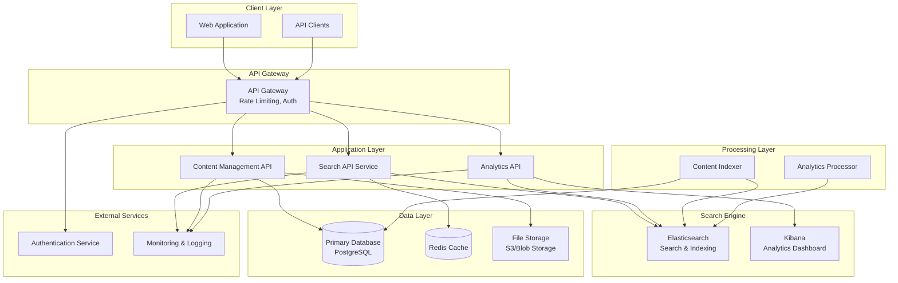
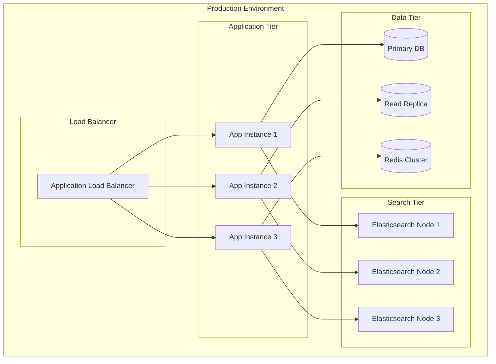

# Knowledge Base Search System - Architecture

## High-Level Architecture

## Component Details

### 1. Client Layer
- **Web Application**: React/Vue.js SPA with responsive design
- **API Clients**: Mobile apps, integrations, third-party tools

### 2. API Gateway
- **Technology**: AWS API Gateway / Azure API Management
- **Features**:
  - Request routing and load balancing
  - Rate limiting and throttling
  - Authentication and authorization
  - Request/response transformation
  - API versioning

### 3. Application Services

#### Search API Service
- **Technology**: Node.js/Express or Python/FastAPI
- **Responsibilities**:
  - Query processing and validation
  - Search result ranking and filtering
  - Faceted search implementation
  - Auto-suggestions and spell correction

#### Content Management API
- **Technology**: Node.js/Express or Python/FastAPI
- **Responsibilities**:
  - Article CRUD operations
  - File upload and management
  - Content validation and processing
  - Version control

#### Analytics API
- **Technology**: Node.js/Express or Python/FastAPI
- **Responsibilities**:
  - Search analytics collection
  - Reporting and dashboard data
  - User behavior tracking
  - Performance metrics

### 4. Search Engine
- **Elasticsearch**: Primary search and indexing engine
  - Full-text search capabilities
  - Faceted search support
  - Real-time indexing
  - Distributed and scalable
- **Kibana**: Analytics and visualization dashboard

### 5. Data Layer

#### Primary Database (PostgreSQL)
- Article metadata and content
- User management
- Configuration data
- Audit logs

#### Cache (Redis)
- Search result caching
- Session management
- Frequently accessed data
- Rate limiting counters

#### File Storage (S3/Blob Storage)
- Article attachments
- Images and media files
- Backup and archival

### 6. Processing Layer

#### Content Indexer
- **Technology**: Background job processor (Celery/Bull)
- **Functions**:
  - Index new/updated articles
  - Process content for search optimization
  - Handle bulk operations

#### Analytics Processor
- **Technology**: Stream processing (Apache Kafka/AWS Kinesis)
- **Functions**:
  - Real-time analytics processing
  - Search behavior analysis
  - Performance monitoring

## Technology Stack

### Cloud Platform Options

#### AWS Stack
- **Compute**: ECS/EKS for containerized services
- **Database**: RDS PostgreSQL, ElastiCache Redis
- **Search**: Amazon Elasticsearch Service
- **Storage**: S3
- **API Gateway**: AWS API Gateway
- **Monitoring**: CloudWatch, X-Ray
- **Authentication**: Cognito

#### Azure Stack
- **Compute**: Container Instances/AKS
- **Database**: Azure Database for PostgreSQL, Redis Cache
- **Search**: Azure Cognitive Search
- **Storage**: Blob Storage
- **API Gateway**: API Management
- **Monitoring**: Application Insights
- **Authentication**: Azure AD B2C

#### GCP Stack
- **Compute**: Cloud Run/GKE
- **Database**: Cloud SQL PostgreSQL, Memorystore Redis
- **Search**: Elasticsearch on Compute Engine
- **Storage**: Cloud Storage
- **API Gateway**: Cloud Endpoints
- **Monitoring**: Cloud Monitoring
- **Authentication**: Firebase Auth

## Deployment Architecture

## Security Architecture

### Authentication & Authorization
- OAuth 2.0 / OpenID Connect
- Role-based access control (RBAC)
- API key management for integrations

### Data Security
- Encryption at rest (AES-256)
- Encryption in transit (TLS 1.3)
- Database connection encryption
- Secure file storage with signed URLs

### Network Security
- VPC/Virtual Network isolation
- Security groups/Network Security Groups
- WAF (Web Application Firewall)
- DDoS protection

## Scalability Considerations

### Horizontal Scaling
- Stateless application services
- Load balancer distribution
- Database read replicas
- Elasticsearch cluster scaling

### Vertical Scaling
- Auto-scaling groups
- Resource monitoring and alerts
- Performance-based scaling triggers

### Caching Strategy
- Multi-level caching (Redis, CDN, browser)
- Cache invalidation strategies
- Search result caching with TTL