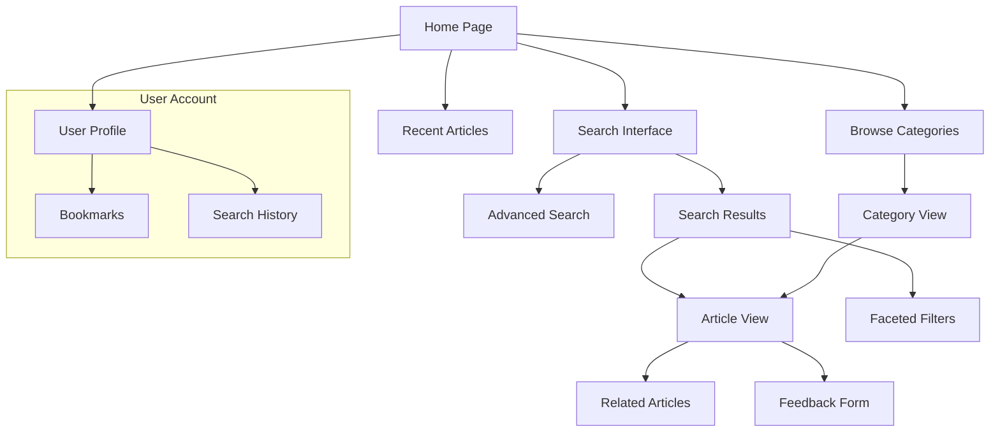

# Knowledge Base Search System - User Interface & Experience Design

## Overview

The user interface design focuses on creating an intuitive, accessible, and efficient search experience for internal company users. The design emphasizes clarity, speed, and ease of use while providing powerful search capabilities.

## Design Principles

### 1. User-Centered Design
- **Simplicity First**: Clean, uncluttered interface with clear visual hierarchy
- **Progressive Disclosure**: Advanced features available but not overwhelming
- **Contextual Help**: Inline guidance and tooltips where needed
- **Accessibility**: WCAG 2.1 AA compliance for inclusive design

### 2. Performance-Focused
- **Fast Loading**: Optimized for quick initial load and search responses
- **Responsive Design**: Seamless experience across devices
- **Progressive Enhancement**: Core functionality works without JavaScript
- **Offline Capability**: Basic search history and cached results

### 3. Enterprise-Ready
- **Professional Appearance**: Clean, corporate-friendly design
- **Customizable Branding**: Company colors, logos, and themes
- **Integration-Friendly**: Embeddable components for other applications
- **Multi-language Support**: Internationalization ready

## Information Architecture



## Page Layouts and Components

### 1. Main Search Interface

```html
<!DOCTYPE html>
<html lang="en">
<head>
    <meta charset="UTF-8">
    <meta name="viewport" content="width=device-width, initial-scale=1.0">
    <title>Knowledge Base Search</title>
    <link rel="stylesheet" href="styles/main.css">
</head>
<body>
    <!-- Header -->
    <header class="main-header">
        <div class="container">
            <div class="header-content">
                <div class="logo">
                    
                    <h1>Knowledge Base</h1>
                </div>
                
                <nav class="main-nav">
                    <a href="/" class="nav-link active">Search</a>
                    <a href="/browse" class="nav-link">Browse</a>
                    <a href="/recent" class="nav-link">Recent</a>
                </nav>
                
                <div class="user-menu">
                    <button class="user-avatar" aria-label="User menu">
                        
                    </button>
                </div>
            </div>
        </div>
    </header>

    <!-- Main Content -->
    <main class="main-content">
        <div class="container">
            <!-- Search Hero Section -->
            <section class="search-hero">
                <div class="search-container">
                    <h2>Find what you need</h2>
                    <p>Search through our comprehensive knowledge base</p>
                    
                    <form class="search-form" role="search">
                        <div class="search-input-group">
                            <input 
                                type="search" 
                                id="main-search"
                                class="search-input"
                                placeholder="Search articles, guides, and documentation..."
                                autocomplete="off"
                                aria-label="Search knowledge base"
                            >
                            <button type="submit" class="search-button" aria-label="Search">
                                <svg class="search-icon" viewBox="0 0 24 24">
                                    <path d="M15.5 14h-.79l-.28-.27C15.41 12.59 16 11.11 16 9.5 16 5.91 13.09 3 9.5 3S3 5.91 3 9.5 5.91 16 9.5 16c1.61 0 3.09-.59 4.23-1.57l.27.28v.79l5 4.99L20.49 19l-4.99-5zm-6 0C7.01 14 5 11.99 5 9.5S7.01 5 9.5 5 14 7.01 14 9.5 11.99 14 9.5 14z"/>
                                </svg>
                            </button>
                        </div>
                        
                        <div class="search-suggestions" id="search-suggestions" hidden>
                            <!-- Auto-complete suggestions will be populated here -->
                        </div>
                    </form>
                    
                    <div class="search-shortcuts">
                        <span class="shortcut-label">Popular searches:</span>
                        <a href="/search?q=authentication" class="search-shortcut">Authentication</a>
                        <a href="/search?q=api+documentation" class="search-shortcut">API Documentation</a>
                        <a href="/search?q=deployment" class="search-shortcut">Deployment</a>
                    </div>
                </div>
            </section>

            <!-- Quick Access Section -->
            <section class="quick-access">
                <h3>Quick Access</h3>
                <div class="quick-access-grid">
                    <a href="/category/getting-started" class="quick-access-card">
                        <div class="card-icon">📚</div>
                        <h4>Getting Started</h4>
                        <p>New to our platform? Start here</p>
                    </a>
                    
                    <a href="/category/api" class="quick-access-card">
                        <div class="card-icon">🔧</div>
                        <h4>API Documentation</h4>
                        <p>Technical references and guides</p>
                    </a>
                    
                    <a href="/category/troubleshooting" class="quick-access-card">
                        <div class="card-icon">🔍</div>
                        <h4>Troubleshooting</h4>
                        <p>Common issues and solutions</p>
                    </a>
                    
                    <a href="/category/policies" class="quick-access-card">
                        <div class="card-icon">📋</div>
                        <h4>Policies</h4>
                        <p>Company policies and procedures</p>
                    </a>
                </div>
            </section>

            <!-- Recent Articles -->
            <section class="recent-articles">
                <h3>Recently Updated</h3>
                <div class="article-list">
                    <!-- Article cards will be populated here -->
                </div>
            </section>
        </div>
    </main>
</body>
</html>
```

### 2. Search Results Page

```html
<div class="search-results-page">
    <!-- Search Header -->
    <div class="search-header">
        <div class="container">
            <form class="search-form compact" role="search">
                <div class="search-input-group">
                    <input 
                        type="search" 
                        class="search-input"
                        value="user authentication"
                        aria-label="Search knowledge base"
                    >
                    <button type="submit" class="search-button">
                        <svg class="search-icon" viewBox="0 0 24 24">
                            <path d="M15.5 14h-.79l-.28-.27C15.41 12.59 16 11.11 16 9.5 16 5.91 13.09 3 9.5 3S3 5.91 3 9.5 5.91 16 9.5 16c1.61 0 3.09-.59 4.23-1.57l.27.28v.79l5 4.99L20.49 19l-4.99-5zm-6 0C7.01 14 5 11.99 5 9.5S7.01 5 9.5 5 14 7.01 14 9.5 11.99 14 9.5 14z"/>
                        </svg>
                    </button>
                </div>
            </form>
            
            <div class="search-meta">
                <span class="results-count">156 results found in 0.045 seconds</span>
                <div class="search-tools">
                    <button class="advanced-search-toggle">Advanced Search</button>
                    <div class="sort-options">
                        <label for="sort-select">Sort by:</label>
                        <select id="sort-select" class="sort-select">
                            <option value="relevance">Relevance</option>
                            <option value="date">Date</option>
                            <option value="popularity">Popularity</option>
                            <option value="title">Title</option>
                        </select>
                    </div>
                </div>
            </div>
        </div>
    </div>

    <!-- Main Results Area -->
    <div class="results-container">
        <div class="container">
            <div class="results-layout">
                <!-- Sidebar Filters -->
                <aside class="filters-sidebar" role="complementary">
                    <div class="filters-header">
                        <h3>Filter Results</h3>
                        <button class="clear-filters">Clear All</button>
                    </div>
                    
                    <!-- Active Filters -->
                    <div class="active-filters">
                        <div class="filter-tag">
                            Security
                            <button class="remove-filter" aria-label="Remove Security filter">×</button>
                        </div>
                    </div>
                    
                    <!-- Filter Groups -->
                    <div class="filter-groups">
                        <!-- Categories Filter -->
                        <div class="filter-group">
                            <h4 class="filter-title">
                                <button class="filter-toggle" aria-expanded="true">
                                    Categories
                                    <span class="toggle-icon">−</span>
                                </button>
                            </h4>
                            <div class="filter-content">
                                <div class="filter-search">
                                    <input type="search" placeholder="Search categories..." class="filter-search-input">
                                </div>
                                <div class="filter-options">
                                    <label class="filter-option">
                                        <input type="checkbox" checked>
                                        <span class="checkmark"></span>
                                        Security (45)
                                    </label>
                                    <label class="filter-option">
                                        <input type="checkbox">
                                        <span class="checkmark"></span>
                                        Development (32)
                                    </label>
                                    <label class="filter-option">
                                        <input type="checkbox">
                                        <span class="checkmark"></span>
                                        Infrastructure (28)
                                    </label>
                                </div>
                            </div>
                        </div>
                        
                        <!-- Authors Filter -->
                        <div class="filter-group">
                            <h4 class="filter-title">
                                <button class="filter-toggle" aria-expanded="false">
                                    Authors
                                    <span class="toggle-icon">+</span>
                                </button>
                            </h4>
                            <div class="filter-content" hidden>
                                <!-- Author filter options -->
                            </div>
                        </div>
                    </div>
                </aside>

                <!-- Search Results -->
                <main class="search-results" role="main">
                    <div class="results-list">
                        <!-- Individual Result Items -->
                        <article class="result-item">
                            <div class="result-content">
                                <h3 class="result-title">
                                    <a href="/articles/user-authentication-guide">
                                        <mark>User</mark> <mark>Authentication</mark> Guide
                                    </a>
                                </h3>
                                
                                <div class="result-meta">
                                    <span class="result-category">Security</span>
                                    <span class="result-author">by John Doe</span>
                                    <span class="result-date">Updated 2 days ago</span>
                                    <div class="result-stats">
                                        <span class="view-count">1,250 views</span>
                                        <span class="like-count">45 likes</span>
                                    </div>
                                </div>
                                
                                <p class="result-summary">
                                    Complete guide to implementing <mark>user</mark> <mark>authentication</mark> 
                                    in your applications. Covers best practices, security considerations...
                                </p>
                                
                                <div class="result-tags">
                                    <span class="tag">authentication</span>
                                    <span class="tag">security</span>
                                    <span class="tag">login</span>
                                </div>
                            </div>
                            
                            <div class="result-actions">
                                <button class="bookmark-btn" aria-label="Bookmark this article">
                                    <svg viewBox="0 0 24 24">
                                        <path d="M17,3H7A2,2 0 0,0 5,5V21L12,18L19,21V5C19,3.89 18.1,3 17,3Z"/>
                                    </svg>
                                </button>
                                <button class="share-btn" aria-label="Share this article">
                                    <svg viewBox="0 0 24 24">
                                        <path d="M18,16.08C17.24,16.08 16.56,16.38 16.04,16.85L8.91,12.7C8.96,12.47 9,12.24 9,12C9,11.76 8.96,11.53 8.91,11.3L15.96,7.19C16.5,7.69 17.21,8 18,8A3,3 0 0,0 21,5A3,3 0 0,0 18,2A3,3 0 0,0 15,5C15,5.24 15.04,5.47 15.09,5.7L8.04,9.81C7.5,9.31 6.79,9 6,9A3,3 0 0,0 3,12A3,3 0 0,0 6,15C6.79,15 7.5,14.69 8.04,14.19L15.16,18.34C15.11,18.55 15.08,18.77 15.08,19C15.08,20.61 16.39,21.91 18,21.91C19.61,21.91 20.92,20.61 20.92,19C20.92,17.39 19.61,16.08 18,16.08M18,4A1,1 0 0,1 19,5A1,1 0 0,1 18,6A1,1 0 0,1 17,5A1,1 0 0,1 18,4M6,13A1,1 0 0,1 5,12A1,1 0 0,1 6,11A1,1 0 0,1 7,12A1,1 0 0,1 6,13M18,20C17.45,20 17,19.55 17,19C17,18.45 17.45,18 18,18C18.55,18 19,18.45 19,19C19,19.55 18.55,20 18,20Z"/>
                                    </svg>
                                </button>
                            </div>
                        </article>
                        
                        <!-- More result items... -->
                    </div>
                    
                    <!-- Pagination -->
                    <nav class="pagination" aria-label="Search results pagination">
                        <button class="pagination-btn prev" disabled>Previous</button>
                        <div class="pagination-numbers">
                            <button class="pagination-number active">1</button>
                            <button class="pagination-number">2</button>
                            <button class="pagination-number">3</button>
                            <span class="pagination-ellipsis">...</span>
                            <button class="pagination-number">8</button>
                        </div>
                        <button class="pagination-btn next">Next</button>
                    </nav>
                </main>
            </div>
        </div>
    </div>
</div>
```

### 3. Article View Page

```html
<div class="article-page">
    <!-- Article Header -->
    <header class="article-header">
        <div class="container">
            <nav class="breadcrumb" aria-label="Breadcrumb">
                <a href="/">Home</a>
                <span class="breadcrumb-separator">›</span>
                <a href="/category/security">Security</a>
                <span class="breadcrumb-separator">›</span>
                <span class="current-page">User Authentication Guide</span>
            </nav>
            
            <div class="article-meta">
                <h1 class="article-title">User Authentication Guide</h1>
                
                <div class="article-info">
                    <div class="author-info">
                        
                        <div class="author-details">
                            <span class="author-name">John Doe</span>
                            <span class="author-title">Security Engineer</span>
                        </div>
                    </div>
                    
                    <div class="article-stats">
                        <span class="publish-date">Published: Jan 10, 2024</span>
                        <span class="update-date">Updated: Jan 15, 2024</span>
                        <span class="read-time">8 min read</span>
                        <span class="view-count">1,250 views</span>
                    </div>
                </div>
                
                <div class="article-actions">
                    <button class="action-btn bookmark-btn">
                        <svg viewBox="0 0 24 24"><path d="M17,3H7A2,2 0 0,0 5,5V21L12,18L19,21V5C19,3.89 18.1,3 17,3Z"/></svg>
                        Bookmark
                    </button>
                    <button class="action-btn share-btn">
                        <svg viewBox="0 0 24 24"><path d="M18,16.08C17.24,16.08 16.56,16.38 16.04,16.85L8.91,12.7C8.96,12.47 9,12.24 9,12C9,11.76 8.96,11.53 8.91,11.3L15.96,7.19C16.5,7.69 17.21,8 18,8A3,3 0 0,0 21,5A3,3 0 0,0 18,2A3,3 0 0,0 15,5C15,5.24 15.04,5.47 15.09,5.7L8.04,9.81C7.5,9.31 6.79,9 6,9A3,3 0 0,0 3,12A3,3 0 0,0 6,15C6.79,15 7.5,14.69 8.04,14.19L15.16,18.34C15.11,18.55 15.08,18.77 15.08,19C15.08,20.61 16.39,21.91 18,21.91C19.61,21.91 20.92,20.61 20.92,19C20.92,17.39 19.61,16.08 18,16.08M18,4A1,1 0 0,1 19,5A1,1 0 0,1 18,6A1,1 0 0,1 17,5A1,1 0 0,1 18,4M6,13A1,1 0 0,1 5,12A1,1 0 0,1 6,11A1,1 0 0,1 7,12A1,1 0 0,1 6,13M18,20C17.45,20 17,19.55 17,19C17,18.45 17.45,18 18,18C18.55,18 19,18.45 19,19C19,19.55 18.55,20 18,20Z"/></svg>
                        Share
                    </button>
                    <button class="action-btn print-btn">
                        <svg viewBox="0 0 24 24"><path d="M18,3H6V7H18M19,12A1,1 0 0,1 18,11A1,1 0 0,1 19,10A1,1 0 0,1 20,11A1,1 0 0,1 19,12M16,19H8V14H16M19,8H5A3,3 0 0,0 2,11V17H6V21H18V17H22V11A3,3 0 0,0 19,8Z"/></svg>
                        Print
                    </button>
                </div>
            </div>
        </div>
    </header>

    <!-- Article Content -->
    <div class="article-container">
        <div class="container">
            <div class="article-layout">
                <!-- Table of Contents -->
                <aside class="table-of-contents" role="complementary">
                    <h3>Table of Contents</h3>
                    <nav class="toc-nav">
                        <ul class="toc-list">
                            <li><a href="#introduction" class="toc-link active">Introduction</a></li>
                            <li><a href="#authentication-methods" class="toc-link">Authentication Methods</a></li>
                            <li><a href="#implementation" class="toc-link">Implementation</a></li>
                            <li><a href="#security-considerations" class="toc-link">Security Considerations</a></li>
                            <li><a href="#best-practices" class="toc-link">Best Practices</a></li>
                        </ul>
                    </nav>
                </aside>

                <!-- Main Article Content -->
                <main class="article-content" role="main">
                    <div class="content-wrapper">
                        <!-- Article content will be rendered here -->
                        <section id="introduction">
                            <h2>Introduction</h2>
                            <p>User authentication is a critical component of any secure application...</p>
                        </section>
                        
                        <!-- More content sections... -->
                    </div>
                    
                    <!-- Article Footer -->
                    <footer class="article-footer">
                        <div class="article-tags">
                            <h4>Tags:</h4>
                            <span class="tag">authentication</span>
                            <span class="tag">security</span>
                            <span class="tag">login</span>
                            <span class="tag">best-practices</span>
                        </div>
                        
                        <div class="article-feedback">
                            <h4>Was this helpful?</h4>
                            <div class="feedback-buttons">
                                <button class="feedback-btn positive">
                                    <svg viewBox="0 0 24 24"><path d="M23,10C23,8.89 22.1,8 21,8H14.68L15.64,3.43C15.66,3.33 15.67,3.22 15.67,3.11C15.67,2.7 15.5,2.32 15.23,2.05L14.17,1L7.59,7.58C7.22,7.95 7,8.45 7,9V19A2,2 0 0,0 9,21H18C18.83,21 19.54,20.5 19.84,19.78L22.86,12.73C22.95,12.5 23,12.26 23,12V10.08L23,10M1,21H5V9H1V21Z"/></svg>
                                    Yes (45)
                                </button>
                                <button class="feedback-btn negative">
                                    <svg viewBox="0 0 24 24"><path d="M19,15H23V3H19V15M15,3H6C5.17,3 4.46,3.5 4.16,4.22L1.14,11.27C1.05,11.5 1,11.74 1,12V14C1,15.11 1.89,16 3,16H9.31L8.36,20.57C8.34,20.67 8.33,20.78 8.33,20.89C8.33,21.3 8.5,21.68 8.77,21.95L9.83,23L16.41,16.42C16.78,16.05 17,15.55 17,15V5C17,3.89 16.1,3 15,3Z"/></svg>
                                    No (3)
                                </button>
                            </div>
                        </div>
                    </footer>
                </main>

                <!-- Related Articles Sidebar -->
                <aside class="related-articles" role="complementary">
                    <h3>Related Articles</h3>
                    <div class="related-list">
                        <article class="related-item">
                            <h4><a href="/articles/oauth-implementation">OAuth 2.0 Implementation</a></h4>
                            <p class="related-meta">Security • 5 min read</p>
                        </article>
                        
                        <article class="related-item">
                            <h4><a href="/articles/password-security">Password Security Best Practices</a></h4>
                            <p class="related-meta">Security • 3 min read</p>
                        </article>
                    </div>
                </aside>
            </div>
        </div>
    </div>
</div>
```

## CSS Design System

### 1. Design Tokens

```css
:root {
  /* Colors */
  --color-primary: #007bff;
  --color-primary-dark: #0056b3;
  --color-primary-light: #66b3ff;
  
  --color-secondary: #6c757d;
  --color-success: #28a745;
  --color-warning: #ffc107;
  --color-danger: #dc3545;
  --color-info: #17a2b8;
  
  --color-text-primary: #212529;
  --color-text-secondary: #6c757d;
  --color-text-muted: #868e96;
  
  --color-background: #ffffff;
  --color-background-alt: #f8f9fa;
  --color-background-dark: #343a40;
  
  --color-border: #dee2e6;
  --color-border-light: #e9ecef;
  
  /* Typography */
  --font-family-primary: -apple-system, BlinkMacSystemFont, 'Segoe UI', Roboto, 'Helvetica Neue', Arial, sans-serif;
  --font-family-mono: 'SF Mono', Monaco, 'Cascadia Code', 'Roboto Mono', Consolas, 'Courier New', monospace;
  
  --font-size-xs: 0.75rem;
  --font-size-sm: 0.875rem;
  --font-size-base: 1rem;
  --font-size-lg: 1.125rem;
  --font-size-xl: 1.25rem;
  --font-size-2xl: 1.5rem;
  --font-size-3xl: 1.875rem;
  --font-size-4xl: 2.25rem;
  
  --font-weight-normal: 400;
  --font-weight-medium: 500;
  --font-weight-semibold: 600;
  --font-weight-bold: 700;
  
  --line-height-tight: 1.25;
  --line-height-normal: 1.5;
  --line-height-relaxed: 1.75;
  
  /* Spacing */
  --spacing-xs: 0.25rem;
  --spacing-sm: 0.5rem;
  --spacing-md: 1rem;
  --spacing-lg: 1.5rem;
  --spacing-xl: 2rem;
  --spacing-2xl: 3rem;
  --spacing-3xl: 4rem;
  
  /* Layout */
  --container-max-width: 1200px;
  --sidebar-width: 280px;
  --header-height: 64px;
  
  /* Shadows */
  --shadow-sm: 0 1px 2px 0 rgba(0, 0, 0, 0.05);
  --shadow-md: 0 4px 6px -1px rgba(0, 0, 0, 0.1), 0 2px 4px -1px rgba(0, 0, 0, 0.06);
  --shadow-lg: 0 10px 15px -3px rgba(0, 0, 0, 0.1), 0 4px 6px -2px rgba(0, 0, 0, 0.05);
  
  /* Border Radius */
  --border-radius-sm: 0.25rem;
  --border-radius-md: 0.375rem;
  --border-radius-lg: 0.5rem;
  --border-radius-xl: 0.75rem;
  
  /* Transitions */
  --transition-fast: 150ms ease-in-out;
  --transition-normal: 250ms ease-in-out;
  --transition-slow: 350ms ease-in-out;
}
```

### 2. Component Styles

```css
/* Search Input Component */
.search-input-group {
  position: relative;
  display: flex;
  align-items: center;
  max-width: 600px;
  margin: 0 auto;
}

.search-input {
  flex: 1;
  padding: var(--spacing-md) var(--spacing-lg);
  padding-right: 3rem;
  font-size: var(--font-size-lg);
  border: 2px solid var(--color-border);
  border-radius: var(--border-radius-lg);
  background: var(--color-background);
  transition: border-color var(--transition-fast), box-shadow var(--transition-fast);
}

.search-input:focus {
  outline: none;
  border-color: var(--color-primary);
  box-shadow: 0 0 0 3px rgba(0, 123, 255, 0.1);
}

.search-button {
  position: absolute;
  right: var(--spacing-sm);
  padding: var(--spacing-sm);
  background: var(--color-primary);
  border: none;
  border-radius: var(--border-radius-md);
  color: white;
cursor: pointer;
  transition: background-color var(--transition-fast);
}

.search-button:hover {
  background: var(--color-primary-dark);
}

.search-icon {
  width: 1.25rem;
  height: 1.25rem;
  fill: currentColor;
}

/* Result Item Component */
.result-item {
  display: flex;
  padding: var(--spacing-lg);
  border: 1px solid var(--color-border-light);
  border-radius: var(--border-radius-lg);
  background: var(--color-background);
  margin-bottom: var(--spacing-md);
  transition: box-shadow var(--transition-fast), border-color var(--transition-fast);
}

.result-item:hover {
  box-shadow: var(--shadow-md);
  border-color: var(--color-border);
}

.result-content {
  flex: 1;
}

.result-title {
  margin: 0 0 var(--spacing-sm) 0;
  font-size: var(--font-size-xl);
  font-weight: var(--font-weight-semibold);
  line-height: var(--line-height-tight);
}

.result-title a {
  color: var(--color-primary);
  text-decoration: none;
}

.result-title a:hover {
  text-decoration: underline;
}

.result-title mark {
  background: #fff3cd;
  padding: 0.1em 0.2em;
  border-radius: var(--border-radius-sm);
}

.result-meta {
  display: flex;
  align-items: center;
  gap: var(--spacing-md);
  margin-bottom: var(--spacing-sm);
  font-size: var(--font-size-sm);
  color: var(--color-text-secondary);
}

.result-category {
  background: var(--color-primary);
  color: white;
  padding: 0.25rem 0.5rem;
  border-radius: var(--border-radius-sm);
  font-size: var(--font-size-xs);
  font-weight: var(--font-weight-medium);
}

.result-summary {
  margin: var(--spacing-sm) 0;
  color: var(--color-text-primary);
  line-height: var(--line-height-relaxed);
}

.result-tags {
  display: flex;
  flex-wrap: wrap;
  gap: var(--spacing-sm);
  margin-top: var(--spacing-sm);
}

.tag {
  background: var(--color-background-alt);
  color: var(--color-text-secondary);
  padding: 0.25rem 0.5rem;
  border-radius: var(--border-radius-sm);
  font-size: var(--font-size-xs);
  text-decoration: none;
  transition: background-color var(--transition-fast);
}

.tag:hover {
  background: var(--color-border);
}

/* Filter Component */
.filters-sidebar {
  width: var(--sidebar-width);
  background: var(--color-background);
  border: 1px solid var(--color-border-light);
  border-radius: var(--border-radius-lg);
  padding: var(--spacing-lg);
  height: fit-content;
  position: sticky;
  top: var(--spacing-lg);
}

.filter-group {
  margin-bottom: var(--spacing-lg);
}

.filter-title {
  margin: 0 0 var(--spacing-md) 0;
}

.filter-toggle {
  display: flex;
  align-items: center;
  justify-content: space-between;
  width: 100%;
  padding: 0;
  background: none;
  border: none;
  font-size: var(--font-size-base);
  font-weight: var(--font-weight-semibold);
  color: var(--color-text-primary);
  cursor: pointer;
}

.filter-option {
  display: flex;
  align-items: center;
  padding: var(--spacing-sm) 0;
  cursor: pointer;
  transition: background-color var(--transition-fast);
}

.filter-option:hover {
  background: var(--color-background-alt);
  border-radius: var(--border-radius-sm);
}

.filter-option input[type="checkbox"] {
  margin-right: var(--spacing-sm);
}

/* Responsive Design */
@media (max-width: 768px) {
  .results-layout {
    flex-direction: column;
  }
  
  .filters-sidebar {
    width: 100%;
    position: static;
    margin-bottom: var(--spacing-lg);
  }
  
  .search-input {
    font-size: var(--font-size-base);
    padding: var(--spacing-sm) var(--spacing-md);
  }
  
  .result-item {
    flex-direction: column;
  }
  
  .result-actions {
    margin-top: var(--spacing-md);
    align-self: flex-start;
  }
}

/* Dark Mode Support */
@media (prefers-color-scheme: dark) {
  :root {
    --color-background: #1a1a1a;
    --color-background-alt: #2d2d2d;
    --color-text-primary: #ffffff;
    --color-text-secondary: #b3b3b3;
    --color-border: #404040;
    --color-border-light: #333333;
  }
}
```

## JavaScript Functionality

### 1. Search Interface Controller

```javascript
class SearchInterface {
    constructor() {
        this.searchInput = document.getElementById('main-search');
        this.searchForm = document.querySelector('.search-form');
        this.suggestionsContainer = document.getElementById('search-suggestions');
        this.debounceTimer = null;
        
        this.initializeEventListeners();
        this.initializeKeyboardShortcuts();
    }
    
    initializeEventListeners() {
        // Search input events
        this.searchInput.addEventListener('input', (e) => {
            this.handleSearchInput(e.target.value);
        });
        
        this.searchInput.addEventListener('focus', () => {
            this.showSuggestions();
        });
        
        this.searchInput.addEventListener('blur', () => {
            // Delay hiding to allow clicking on suggestions
            setTimeout(() => this.hideSuggestions(), 150);
        });
        
        // Form submission
        this.searchForm.addEventListener('submit', (e) => {
            e.preventDefault();
            this.performSearch(this.searchInput.value);
        });
        
        // Keyboard navigation for suggestions
        this.searchInput.addEventListener('keydown', (e) => {
            this.handleKeyboardNavigation(e);
        });
    }
    
    initializeKeyboardShortcuts() {
        document.addEventListener('keydown', (e) => {
            // Focus search with Ctrl/Cmd + K
            if ((e.ctrlKey || e.metaKey) && e.key === 'k') {
                e.preventDefault();
                this.searchInput.focus();
            }
            
            // Clear search with Escape
            if (e.key === 'Escape' && document.activeElement === this.searchInput) {
                this.searchInput.value = '';
                this.hideSuggestions();
            }
        });
    }
    
    handleSearchInput(query) {
        clearTimeout(this.debounceTimer);
        
        if (query.length < 2) {
            this.hideSuggestions();
            return;
        }
        
        this.debounceTimer = setTimeout(() => {
            this.fetchSuggestions(query);
        }, 300);
    }
    
    async fetchSuggestions(query) {
        try {
            const response = await fetch(`/api/v1/search/suggest?q=${encodeURIComponent(query)}&size=8`);
            const data = await response.json();
            
            this.renderSuggestions(data.suggestions);
        } catch (error) {
            console.error('Failed to fetch suggestions:', error);
        }
    }
    
    renderSuggestions(suggestions) {
        if (!suggestions || suggestions.length === 0) {
            this.hideSuggestions();
            return;
        }
        
        const html = suggestions.map((suggestion, index) => `
            <div class="suggestion-item ${index === 0 ? 'highlighted' : ''}" 
                 data-suggestion="${suggestion.text}"
                 role="option">
                <svg class="suggestion-icon" viewBox="0 0 24 24">
                    <path d="M15.5 14h-.79l-.28-.27C15.41 12.59 16 11.11 16 9.5 16 5.91 13.09 3 9.5 3S3 5.91 3 9.5 5.91 16 9.5 16c1.61 0 3.09-.59 4.23-1.57l.27.28v.79l5 4.99L20.49 19l-4.99-5zm-6 0C7.01 14 5 11.99 5 9.5S7.01 5 9.5 5 14 7.01 14 9.5 11.99 14 9.5 14z"/>
                </svg>
                <span class="suggestion-text">${this.highlightQuery(suggestion.text, this.searchInput.value)}</span>
            </div>
        `).join('');
        
        this.suggestionsContainer.innerHTML = html;
        this.suggestionsContainer.hidden = false;
        
        // Add click listeners to suggestions
        this.suggestionsContainer.querySelectorAll('.suggestion-item').forEach(item => {
            item.addEventListener('click', () => {
                this.selectSuggestion(item.dataset.suggestion);
            });
        });
    }
    
    highlightQuery(text, query) {
        const regex = new RegExp(`(${query})`, 'gi');
        return text.replace(regex, '<mark>$1</mark>');
    }
    
    handleKeyboardNavigation(e) {
        const suggestions = this.suggestionsContainer.querySelectorAll('.suggestion-item');
        const highlighted = this.suggestionsContainer.querySelector('.suggestion-item.highlighted');
        
        if (e.key === 'ArrowDown') {
            e.preventDefault();
            const next = highlighted ? highlighted.nextElementSibling : suggestions[0];
            if (next) {
                highlighted?.classList.remove('highlighted');
                next.classList.add('highlighted');
            }
        } else if (e.key === 'ArrowUp') {
            e.preventDefault();
            const prev = highlighted ? highlighted.previousElementSibling : suggestions[suggestions.length - 1];
            if (prev) {
                highlighted?.classList.remove('highlighted');
                prev.classList.add('highlighted');
            }
        } else if (e.key === 'Enter' && highlighted) {
            e.preventDefault();
            this.selectSuggestion(highlighted.dataset.suggestion);
        }
    }
    
    selectSuggestion(suggestion) {
        this.searchInput.value = suggestion;
        this.hideSuggestions();
        this.performSearch(suggestion);
    }
    
    showSuggestions() {
        if (this.suggestionsContainer.children.length > 0) {
            this.suggestionsContainer.hidden = false;
        }
    }
    
    hideSuggestions() {
        this.suggestionsContainer.hidden = true;
    }
    
    performSearch(query) {
        if (!query.trim()) return;
        
        // Track search analytics
        this.trackSearchEvent(query);
        
        // Navigate to search results
        window.location.href = `/search?q=${encodeURIComponent(query)}`;
    }
    
    trackSearchEvent(query) {
        // Send analytics event
        if (window.analytics) {
            window.analytics.track('search_performed', {
                query: query,
                timestamp: new Date().toISOString(),
                source: 'main_search'
            });
        }
    }
}

// Initialize search interface when DOM is loaded
document.addEventListener('DOMContentLoaded', () => {
    new SearchInterface();
});
```

### 2. Filter Management

```javascript
class FilterManager {
    constructor() {
        this.activeFilters = new Map();
        this.filterGroups = document.querySelectorAll('.filter-group');
        this.clearAllButton = document.querySelector('.clear-filters');
        
        this.initializeEventListeners();
        this.loadFiltersFromURL();
    }
    
    initializeEventListeners() {
        // Filter toggle buttons
        document.querySelectorAll('.filter-toggle').forEach(toggle => {
            toggle.addEventListener('click', (e) => {
                this.toggleFilterGroup(e.target.closest('.filter-group'));
            });
        });
        
        // Filter checkboxes
        document.querySelectorAll('.filter-option input[type="checkbox"]').forEach(checkbox => {
            checkbox.addEventListener('change', (e) => {
                this.handleFilterChange(e.target);
            });
        });
        
        // Clear all filters
        this.clearAllButton?.addEventListener('click', () => {
            this.clearAllFilters();
        });
        
        // Filter search inputs
        document.querySelectorAll('.filter-search-input').forEach(input => {
            input.addEventListener('input', (e) => {
                this.filterOptions(e.target);
            });
        });
    }
    
    toggleFilterGroup(group) {
        const content = group.querySelector('.filter-content');
        const toggle = group.querySelector('.filter-toggle');
        const icon = toggle.querySelector('.toggle-icon');
        
        const isExpanded = toggle.getAttribute('aria-expanded') === 'true';
        
        toggle.setAttribute('aria-expanded', !isExpanded);
        content.hidden = isExpanded;
        icon.textContent = isExpanded ? '+' : '−';
    }
    
    handleFilterChange(checkbox) {
        const filterGroup = checkbox.closest('.filter-group');
        const groupId = filterGroup.dataset.filterId;
        const value = checkbox.value;
        
        if (checkbox.checked) {
            this.addFilter(groupId, value);
        } else {
            this.removeFilter(groupId, value);
        }
        
        this.updateURL();
        this.refreshResults();
    }
    
    addFilter(groupId, value) {
        if (!this.activeFilters.has(groupId)) {
            this.activeFilters.set(groupId, new Set());
        }
        this.activeFilters.get(groupId).add(value);
        this.updateFilterDisplay();
    }
    
    removeFilter(groupId, value) {
        if (this.activeFilters.has(groupId)) {
            this.activeFilters.get(groupId).delete(value);
            if (this.activeFilters.get(groupId).size === 0) {
                this.activeFilters.delete(groupId);
            }
        }
        this.updateFilterDisplay();
    }
    
    clearAllFilters() {
        this.activeFilters.clear();
        
        // Uncheck all checkboxes
        document.querySelectorAll('.filter-option input[type="checkbox"]').forEach(checkbox => {
            checkbox.checked = false;
        });
        
        this.updateFilterDisplay();
        this.updateURL();
        this.refreshResults();
    }
    
    updateFilterDisplay() {
        const activeFiltersContainer = document.querySelector('.active-filters');
        
        if (this.activeFilters.size === 0) {
            activeFiltersContainer.innerHTML = '';
            return;
        }
        
        const filterTags = [];
        this.activeFilters.forEach((values, groupId) => {
            values.forEach(value => {
                filterTags.push(`
                    <div class="filter-tag">
                        ${value}
                        <button class="remove-filter" 
                                data-group="${groupId}" 
                                data-value="${value}"
                                aria-label="Remove ${value} filter">×</button>
                    </div>
                `);
            });
        });
        
        activeFiltersContainer.innerHTML = filterTags.join('');
        
        // Add event listeners to remove buttons
        activeFiltersContainer.querySelectorAll('.remove-filter').forEach(button => {
            button.addEventListener('click', (e) => {
                const groupId = e.target.dataset.group;
                const value = e.target.dataset.value;
                this.removeFilter(groupId, value);
                
                // Uncheck the corresponding checkbox
                const checkbox = document.querySelector(
                    `input[type="checkbox"][value="${value}"]`
                );
                if (checkbox) checkbox.checked = false;
                
                this.updateURL();
                this.refreshResults();
            });
        });
    }
    
    async refreshResults() {
        const resultsContainer = document.querySelector('.search-results');
        
        // Show loading state
        resultsContainer.classList.add('loading');
        
        try {
            const response = await this.fetchFilteredResults();
            const data = await response.json();
            
            this.renderResults(data);
        } catch (error) {
            console.error('Failed to refresh results:', error);
        } finally {
            resultsContainer.classList.remove('loading');
        }
    }
    
    formatDate(dateString) {
        const date = new Date(dateString);
        const now = new Date();
        const diffTime = Math.abs(now - date);
        const diffDays = Math.ceil(diffTime / (1000 * 60 * 60 * 24));
        
        if (diffDays === 1) return 'Updated yesterday';
        if (diffDays < 7) return `Updated ${diffDays} days ago`;
        if (diffDays < 30) return `Updated ${Math.ceil(diffDays / 7)} weeks ago`;
        
        return `Updated ${date.toLocaleDateString()}`;
    }
}

// Initialize filter manager
document.addEventListener('DOMContentLoaded', () => {
    if (document.querySelector('.filters-sidebar')) {
        new FilterManager();
    }
});
```

## Accessibility Features

### 1. ARIA Labels and Roles
- Proper semantic HTML structure
- ARIA labels for interactive elements
- Role attributes for complex components
- Screen reader friendly navigation

### 2. Keyboard Navigation
- Tab order optimization
- Keyboard shortcuts (Ctrl/Cmd + K for search)
- Arrow key navigation in suggestions
- Escape key to close modals/suggestions

### 3. Color and Contrast
- WCAG 2.1 AA compliant color ratios
- High contrast mode support
- Color-blind friendly design
- Focus indicators for all interactive elements

### 4. Responsive Design
- Mobile-first approach
- Touch-friendly interface elements
- Flexible layouts that work on all screen sizes
- Progressive enhancement for advanced features

## Performance Optimization

### 1. Loading Performance
- Critical CSS inlined
- Non-critical CSS loaded asynchronously
- JavaScript modules loaded on demand
- Image optimization and lazy loading

### 2. Runtime Performance
- Debounced search input
- Virtual scrolling for large result sets
- Efficient DOM updates
- Memory leak prevention

### 3. Caching Strategy
- Service worker for offline functionality
- Local storage for user preferences
- Session storage for search history
- CDN for static assets

This comprehensive UI design provides a modern, accessible, and user-friendly interface for the knowledge base search system while maintaining professional appearance suitable for internal company use.