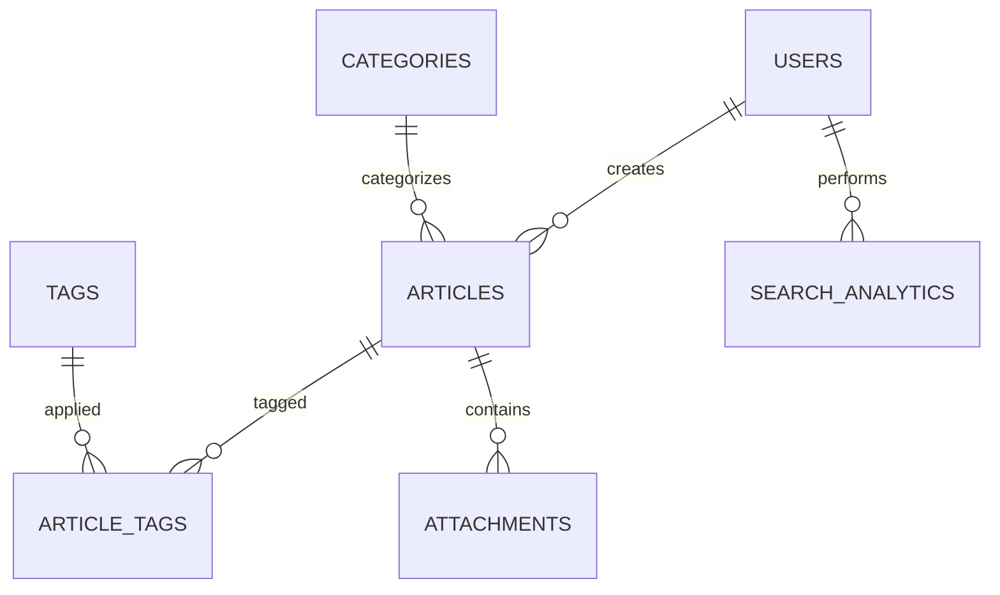

# Data Model Overview

## Purpose & Design Philosophy

The data model serves as the foundation for the knowledge base search system, designed with these key principles:

- **Dual Storage Strategy**: PostgreSQL for transactional data integrity, Elasticsearch for search performance
- **Flexible Content Structure**: Support for rich content with metadata, attachments, and hierarchical categorization
- **Analytics-First Design**: Built-in tracking for search behavior and content performance
- **Scalable Architecture**: Designed to handle growth in content volume and user base

## Core Data Entities

### Articles (Primary Content)
The central entity storing knowledge base content with:
- **Rich Content Support**: Title, content, summary, and metadata
- **Workflow Management**: Draft/published/archived status with versioning
- **Access Control**: Visibility levels (public/internal/restricted)
- **Performance Tracking**: View counts, likes, and engagement metrics

**Key Design Decision**: Using UUID primary keys for better distributed system compatibility and security.

### Categories (Hierarchical Organization)
Supports nested category structures for content organization:
- **Tree Structure**: Parent-child relationships for logical grouping
- **Visual Identity**: Icons and colors for better user experience
- **Flexible Hierarchy**: No depth limits, allowing natural content organization

**Rationale**: Hierarchical categories provide intuitive navigation while supporting complex organizational structures.

### Tags (Flexible Labeling)
Many-to-many relationship with articles for cross-cutting themes:
- **Usage Tracking**: Automatic counting for popularity-based suggestions
- **Dynamic Growth**: New tags created organically by content creators

### Users & Access Control
User management with role-based permissions:
- **Role Hierarchy**: Admin → Editor → Author → User
- **Department Tracking**: For content filtering and access control
- **Activity Monitoring**: Login tracking and engagement metrics

## Search-Optimized Design

### PostgreSQL Full-Text Search
- **TSVECTOR Integration**: Built-in search vectors for basic text search
- **Indexed Performance**: GIN indexes on search vectors and metadata
- **Backup Search**: Fallback when Elasticsearch is unavailable

### Elasticsearch Mapping Strategy
Optimized for search performance with:
- **Multi-Field Mapping**: Text analysis + keyword exact matching
- **Completion Suggestions**: Built-in autocomplete support
- **Scoring Fields**: Popularity and freshness scores for relevance ranking
- **Nested Objects**: Structured data for authors, categories, and attachments

**Key Decision**: Separate analyzers for indexing vs. searching to optimize for both storage and query performance.

## Data Relationships

## Performance Considerations

### Database Optimization
- **Strategic Indexing**: Indexes on frequently queried fields (status, category, author)
- **Partitioning Ready**: Schema supports future partitioning by date
- **Connection Pooling**: Designed for efficient connection management

### Search Performance
- **Dual Indexing**: PostgreSQL for reliability, Elasticsearch for speed
- **Incremental Updates**: Real-time sync between systems
- **Caching Strategy**: Multiple cache layers for frequently accessed data

## Data Validation & Integrity

### Business Rules
- **Content Requirements**: Minimum content length, required fields
- **Referential Integrity**: Proper foreign key relationships
- **Status Workflows**: Controlled transitions between draft/published/archived
- **Circular Reference Prevention**: Category hierarchy validation

### Security Considerations
- **Data Sanitization**: Input validation and XSS prevention
- **Access Logging**: Audit trail for sensitive operations
- **Encryption**: Sensitive data encrypted at rest and in transit

## Migration & Maintenance

### Data Import Strategy
- **Bulk Import Support**: CSV/Excel import with validation
- **Duplicate Detection**: Intelligent matching for existing content
- **Category Mapping**: Flexible mapping from legacy systems

### Ongoing Synchronization
- **Real-time Sync**: Database triggers for immediate Elasticsearch updates
- **Batch Processing**: Efficient handling of bulk operations
- **Consistency Checks**: Regular validation between PostgreSQL and Elasticsearch

## Scalability Design

### Growth Accommodation
- **Horizontal Scaling**: UUID keys support distributed architectures
- **Index Optimization**: Prepared for table partitioning and sharding
- **Storage Efficiency**: JSONB for flexible metadata without schema changes

### Performance Monitoring
- **Query Analytics**: Built-in tracking for optimization opportunities
- **Usage Patterns**: Data to inform caching and indexing strategies
- **Capacity Planning**: Metrics for proactive scaling decisions

This data model provides a robust foundation that balances immediate functionality needs with long-term scalability and performance requirements.