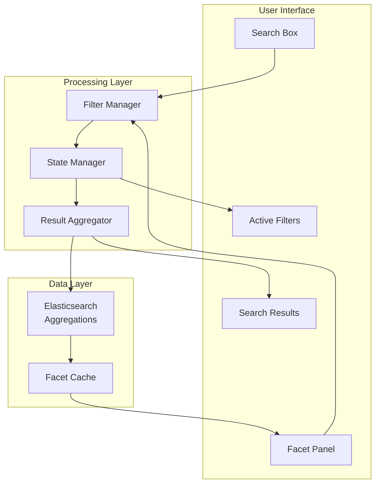

# Faceted Navigation Design Overview

## Purpose & User Experience Philosophy

Faceted navigation enables users to explore and filter search results through multiple dimensions, designed with these principles:

- **Progressive Disclosure**: Start simple, reveal complexity as needed
- **Visual Clarity**: Clear indication of available filters and active selections
- **Mobile-First**: Responsive design that works across all devices
- **Performance**: Fast filtering without page reloads

## Navigation Architecture

## Core Facet Types

### 1. Hierarchical Categories
**Purpose**: Navigate content through organizational structure
**Features**:
- Tree-like structure with parent-child relationships
- Expandable/collapsible sections
- Visual hierarchy with indentation
- Breadcrumb trail for deep navigation

**Design Decision**: Hierarchical display mirrors organizational thinking patterns, making content discovery intuitive.

### 2. Author Facet
**Purpose**: Filter by content creators
**Features**:
- Searchable author list
- Avatar display for visual recognition
- Sort by popularity (article count)
- Department grouping

**Rationale**: People often remember who wrote something before remembering exact titles.

### 3. Tag Cloud
**Purpose**: Cross-cutting themes and topics
**Features**:
- Searchable tag interface
- Usage-based sizing and ordering
- "Show more" expansion for comprehensive lists
- Related tag suggestions

### 4. Date Ranges
**Purpose**: Time-based content filtering
**Features**:
- Predefined ranges (last week, month, year)
- Custom date picker for specific periods
- Visual timeline for content distribution
- Relative date options ("recent", "older")

**Key Decision**: Combination of quick presets and custom ranges balances ease of use with flexibility.

### 5. Content Type
**Purpose**: Filter by document format and purpose
**Features**:
- Icon-based visual representation
- Clear categorization (guides, tutorials, FAQs, policies)
- Count indicators for each type
- Logical grouping of related types

## User Experience Design

### Progressive Filtering
**Approach**: Each filter selection narrows results and updates other facet counts
**Benefits**:
- Users see immediate impact of their choices
- Prevents "zero results" scenarios
- Maintains context of available options

### Visual Feedback
**Active State Indicators**:
- Selected filters highlighted with distinct styling
- Breadcrumb trail showing current filter path
- Clear "remove" actions for each active filter
- Visual count updates as filters are applied

### Mobile Responsiveness
**Mobile Strategy**: Collapsible facet panel with modal overlay
**Key Features**:
- Floating action button to access filters
- Full-screen filter interface on mobile
- Touch-friendly interaction targets
- Swipe gestures for quick actions

**Rationale**: Mobile users need focused, distraction-free filtering experience.

## State Management

### Filter State Persistence
**URL Integration**: Filter state reflected in URL parameters
**Benefits**:
- Shareable filtered search results
- Browser back/forward navigation support
- Bookmark-able search states
- Deep linking to specific filter combinations

### Performance Optimization
**Caching Strategy**:
- Facet counts cached for 5 minutes
- Aggregation results cached separately from search results
- Client-side state management for instant UI updates
- Debounced API calls for rapid filter changes

**Key Decision**: Separate caching for facets allows independent refresh cycles and better performance.

## Technical Implementation

### Elasticsearch Integration
**Aggregation Strategy**:
- Terms aggregations for categorical facets
- Date histogram for time-based facets
- Nested aggregations for hierarchical categories
- Post-filter aggregations to maintain accurate counts

### Filter Exclusion Logic
**Problem**: When a filter is applied, its facet should still show all available options
**Solution**: Exclude current facet from its own aggregation filter
**Benefit**: Users can see alternative choices within the same facet

### Real-time Updates
**Implementation**: WebSocket or Server-Sent Events for live facet updates
**Use Cases**:
- New content appears in real-time
- Popular tags update based on user activity
- Content availability changes based on permissions

## Accessibility & Usability

### Keyboard Navigation
- Tab order through facet groups
- Arrow key navigation within facet lists
- Enter/Space for selection
- Escape to close expanded sections

### Screen Reader Support
- Semantic HTML structure
- ARIA labels for interactive elements
- Live regions for dynamic count updates
- Clear focus indicators

### Visual Design
**Hierarchy**: Clear visual distinction between facet groups and items
**Spacing**: Adequate white space for touch targets
**Typography**: Readable font sizes and contrast ratios
**Icons**: Meaningful icons with text labels

## Performance Considerations

### Facet Loading Strategy
**Lazy Loading**: Load facet data only when needed
**Prioritization**: Load most important facets first
**Caching**: Aggressive caching of facet configurations
**Optimization**: Minimize aggregation complexity

### Scalability Design
**Large Datasets**: Handle thousands of facet values efficiently
**Search Integration**: Facet search within large tag lists
**Pagination**: "Show more" functionality for extensive facet lists
**Memory Management**: Efficient client-side state handling

## Analytics & Optimization

### Usage Tracking
**Metrics Collected**:
- Most used facets and values
- Filter combination patterns
- Abandonment points in filter flow
- Mobile vs. desktop usage patterns

**Optimization Opportunities**:
- Reorder facets based on usage
- Highlight popular filter combinations
- Identify unused facets for removal
- Optimize mobile experience based on behavior

### A/B Testing Framework
**Test Scenarios**:
- Facet ordering and grouping
- Visual design variations
- Mobile interaction patterns
- Default expanded/collapsed states

This faceted navigation design creates an intuitive, powerful filtering system that helps users quickly find relevant content while maintaining excellent performance and accessibility across all devices.