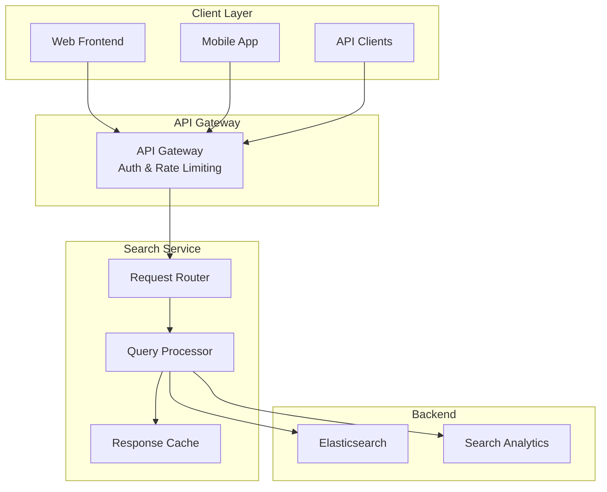
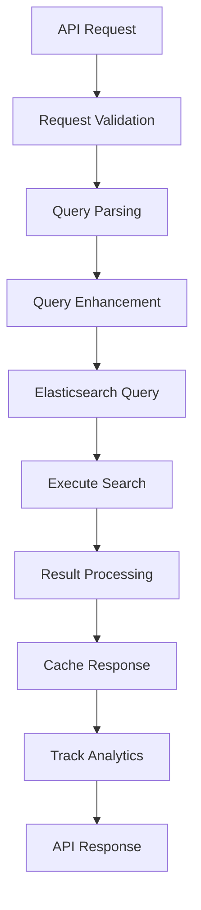

# Search API Design Overview

## Purpose & Design Philosophy

The Search API provides a comprehensive interface for knowledge base search with a focus on:

- **Developer Experience**: Intuitive, well-documented REST API
- **Performance**: Fast response times with intelligent caching
- **Flexibility**: Support for simple queries to complex search scenarios
- **Analytics**: Built-in tracking for search behavior and optimization

## API Architecture

## Core API Endpoints

### Basic Search
**Endpoint**: `GET /api/v1/search`
**Purpose**: Simple, fast search for common use cases

**Key Parameters**:
- `q`: Search query (required)
- `page`, `size`: Pagination controls
- `sort`: Relevance, date, popularity

**Design Decision**: Simple GET endpoint for easy integration and caching.

### Advanced Search
**Endpoint**: `POST /api/v1/search/advanced`
**Purpose**: Complex queries with multiple filters and custom scoring

**Key Features**:
- Multi-field search with field boosting
- Complex filter combinations
- Custom sorting and aggregations
- Highlighting and snippet generation

**Rationale**: POST method allows complex query structures while maintaining clean URLs for simple searches.

### Auto-complete & Suggestions
**Endpoint**: `GET /api/v1/search/suggest`
**Purpose**: Real-time search suggestions and spell correction

**Features**:
- Completion suggestions from indexed content
- Spell checking and correction
- Popular search recommendations
- Related query suggestions

## Query Processing Pipeline

## Key Design Decisions

### Query Enhancement Strategy
**Decision**: Multi-layered query enhancement for better results
**Components**:
- **Spell Correction**: Automatic detection and suggestion of corrections
- **Synonym Expansion**: Domain-specific synonym matching
- **User Context**: Personalization based on user role and department
- **Popularity Boosting**: Recent and popular content gets higher relevance

**Rationale**: Enhanced queries provide better user experience without requiring users to craft perfect search terms.

### Response Format Design
**Decision**: Consistent JSON structure with rich metadata
**Key Elements**:
- **Search Results**: Title, summary, URL, score, highlights
- **Facets**: Available filters with counts
- **Suggestions**: Alternative queries and corrections
- **Metadata**: Query time, total results, pagination info

**Benefits**: Predictable structure enables easy frontend integration and caching.

### Elasticsearch Query Strategy
**Decision**: Multi-match queries with function scoring
**Approach**:
- **Phrase Matching**: Exact phrases get highest priority
- **Cross-field Matching**: Terms across title, summary, content
- **Fuzzy Matching**: Handle typos and variations
- **Function Scoring**: Boost based on popularity and freshness

**Rationale**: Layered approach ensures relevant results for various query types while maintaining performance.

## Performance Optimization

### Caching Strategy
**Multi-level Caching**:
- **Query Cache**: Cache Elasticsearch query results
- **Response Cache**: Cache formatted API responses
- **Facet Cache**: Cache aggregation results separately
- **Suggestion Cache**: Cache autocomplete and spell-check results

**Cache Keys**: MD5 hash of normalized query parameters
**TTL Strategy**: 5 minutes for search results, 15 minutes for facets

### Rate Limiting
**Tiered Limits**:
- Basic Search: 100 requests/minute
- Advanced Search: 50 requests/minute
- Suggestions: 200 requests/minute

**Implementation**: Redis-based sliding window with user-specific limits

### Query Optimization
**Performance Techniques**:
- **Field Boosting**: Prioritize title and summary over content
- **Result Size Limits**: Maximum 100 results per request
- **Timeout Handling**: 5-second query timeout with graceful degradation
- **Index Warming**: Pre-load frequently accessed data

## Error Handling & Reliability

### Error Response Format
Consistent error structure with:
- **Error Code**: Machine-readable error identifier
- **Message**: Human-readable description
- **Details**: Additional context and debugging information
- **Request ID**: For tracking and support

### Common Error Scenarios
- **Invalid Query**: Malformed search syntax
- **Rate Limit Exceeded**: Too many requests
- **Search Timeout**: Query took too long
- **Index Unavailable**: Elasticsearch connectivity issues

### Fallback Strategies
- **PostgreSQL Fallback**: Basic search when Elasticsearch is down
- **Cached Results**: Serve stale results during outages
- **Graceful Degradation**: Reduce features rather than fail completely

## Security & Access Control

### Authentication Integration
- **JWT Token Validation**: Secure API access
- **Role-based Filtering**: Results filtered by user permissions
- **Department Filtering**: Content visibility based on user department
- **Audit Logging**: Track search queries for security analysis

### Data Protection
- **Input Sanitization**: Prevent injection attacks
- **Result Filtering**: Respect document visibility settings
- **PII Handling**: Mask sensitive information in logs
- **HTTPS Only**: Encrypted communication required

## Analytics & Monitoring

### Search Analytics
**Tracked Metrics**:
- Query patterns and frequency
- Result click-through rates
- Search abandonment rates
- Popular content identification

**Use Cases**:
- Content gap analysis
- Search optimization
- User behavior insights
- Performance monitoring

### Performance Monitoring
**Key Metrics**:
- Response time percentiles
- Error rates by endpoint
- Cache hit ratios
- Elasticsearch cluster health

**Alerting**: Proactive notifications for performance degradation or errors

## API Documentation & Developer Experience

### OpenAPI Specification
- Complete API documentation with examples
- Interactive testing interface
- Code generation support
- Version management

### SDK Support
- JavaScript/TypeScript client library
- Python client for backend integration
- Mobile SDK for native apps
- Comprehensive error handling

This API design provides a robust, scalable foundation for search functionality while maintaining simplicity for common use cases and flexibility for advanced scenarios.