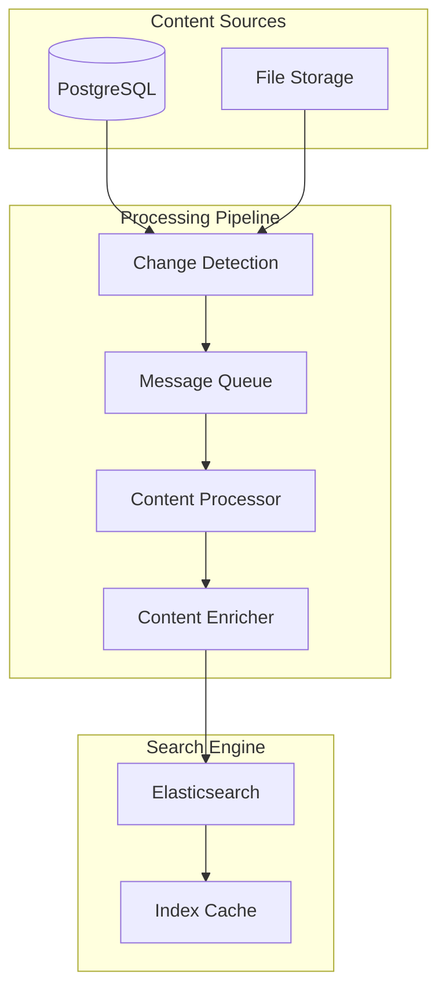

# Search Indexing Strategy Overview

## Purpose & Core Philosophy

The indexing strategy ensures fast, relevant search results while maintaining data consistency and system performance. The design prioritizes:

- **Real-time Responsiveness**: Changes appear in search results within seconds
- **Content Quality**: Rich text processing and intelligent content enhancement
- **System Resilience**: Robust error handling and recovery mechanisms
- **Performance Optimization**: Balanced indexing speed with search performance

## Indexing Architecture

## Key Design Decisions

### Real-time vs. Batch Processing
**Decision**: Hybrid approach combining real-time triggers with batch optimization
**Rationale**: 
- Real-time updates ensure immediate search availability
- Batch processing handles bulk operations efficiently
- Queue system provides resilience and load balancing

### Content Processing Pipeline
**Decision**: Multi-stage processing with content extraction, enrichment, and validation
**Rationale**:
- **Extraction Stage**: Clean HTML, extract text from attachments (PDF, documents)
- **Enrichment Stage**: Add keywords, calculate scores, generate suggestions
- **Validation Stage**: Ensure data quality before indexing

## Content Enhancement Strategy

### Intelligent Content Processing
- **Text Cleaning**: Remove HTML tags, normalize whitespace
- **Attachment Processing**: Extract searchable text from PDFs and documents
- **Keyword Extraction**: Automatic identification of important terms
- **Summary Generation**: Create searchable summaries for long content

### Scoring Algorithm
**Popularity Score**: Combines view count, likes, and recent activity
**Freshness Score**: Time-based decay to favor recent content
**Quality Score**: Content length, structure, and engagement metrics

**Key Decision**: Multi-factor scoring allows fine-tuning of search relevance without complex query modifications.

## Index Management

### Index Structure
- **Rolling Indices**: Time-based index rotation for efficient management
- **Alias System**: Seamless index switching during updates
- **Template-based**: Consistent mapping and settings across indices

### Optimization Strategies
- **Custom Analyzers**: Specialized text processing for knowledge base content
- **Synonym Handling**: Domain-specific synonym expansion
- **Field Boosting**: Title and summary fields prioritized over content
- **Shard Strategy**: Balanced shard distribution for optimal performance

**Rationale**: Template-based approach ensures consistency while allowing for index evolution and optimization.

## Performance Considerations

### Indexing Performance
- **Batch Size Optimization**: 100-document batches for optimal throughput
- **Concurrent Processing**: Multiple threads for bulk operations
- **Resource Management**: Dedicated indexing nodes for large operations
- **Refresh Interval**: 5-second refresh balances search latency with indexing performance

### Search Performance Impact
- **Index Warming**: Pre-load frequently accessed data
- **Query Caching**: Cache common search patterns
- **Result Caching**: Cache search results with appropriate TTL
- **Load Balancing**: Distribute search load across nodes

## Monitoring & Reliability

### Health Monitoring
- **Indexing Metrics**: Track throughput, latency, and error rates
- **Index Health**: Monitor shard status and cluster health
- **Performance Tracking**: Identify bottlenecks and optimization opportunities
- **Alert System**: Proactive notification of issues

### Error Handling & Recovery
- **Retry Logic**: Automatic retry with exponential backoff
- **Dead Letter Queue**: Handle persistently failing documents
- **Index Validation**: Verify index integrity and completeness
- **Disaster Recovery**: Automated backup and restoration procedures

**Key Decision**: Comprehensive monitoring enables proactive issue resolution and performance optimization.

## Content Security & Validation

### Security Measures
- **Content Validation**: Verify content integrity before indexing
- **Access Control**: Respect document visibility settings in search
- **Audit Logging**: Track all indexing operations
- **Data Sanitization**: Remove or mask sensitive information

### Quality Assurance
- **Schema Validation**: Ensure documents match expected structure
- **Content Filtering**: Block inappropriate or malicious content
- **Duplicate Detection**: Identify and handle duplicate content
- **Consistency Checks**: Regular validation between source and index

## Scalability Design

### Growth Accommodation
- **Horizontal Scaling**: Add nodes to handle increased load
- **Index Partitioning**: Distribute large indices across multiple shards
- **Resource Allocation**: Dynamic resource allocation based on load
- **Capacity Planning**: Proactive scaling based on usage patterns

### Maintenance Operations
- **Index Lifecycle Management**: Automated index rotation and cleanup
- **Reindexing Strategy**: Zero-downtime index rebuilding
- **Backup Strategy**: Regular snapshots with point-in-time recovery
- **Performance Tuning**: Continuous optimization based on usage patterns

## Integration Points

### Database Integration
- **Change Detection**: PostgreSQL triggers for real-time updates
- **Bulk Operations**: Efficient handling of large data imports
- **Consistency Maintenance**: Ensure synchronization between systems
- **Fallback Strategy**: PostgreSQL full-text search as backup

### Application Integration
- **API Endpoints**: RESTful interface for indexing operations
- **Event System**: Publish indexing events for other systems
- **Metrics Export**: Performance data for monitoring systems
- **Configuration Management**: Dynamic configuration updates

This indexing strategy provides a robust foundation for fast, accurate search while maintaining system reliability and performance at scale.